# Arquitectura de flujo de datos

**Versión**: 3.2.0  
**Última actualización**: 16 de octubre de 2025  
**Idioma**: Francés

## Tabla de contenido

1. [Resumen](#resumen)
2. [Flujo de datos de un extremo a otro](#flujo de datos de un extremo a otro)
3. [Capa de ingestión](#capa-ingestión)
4. [Capa de almacenamiento](#capa-de-almacenamiento)
5. [Capa de procesamiento] (#capa de procesamiento)
6. [Capa de presentación](#capa de presentación)
7. [Modelos de flujo de datos](#dataflow-models)
8. [Consideraciones de rendimiento](#consideraciones-de rendimiento)
9. [Monitoreo del flujo de datos](#dataflow-monitoring)
10. [Buenas Prácticas](#buenas-practicas)

---

## Descripción general

Este documento detalla la arquitectura completa de flujo de datos de la plataforma, desde la ingesta inicial de datos hasta el consumo final. Comprender estos flujos es fundamental para optimizar el rendimiento, solucionar problemas y diseñar canales de datos eficaces.

### Principios del flujo de datos

Nuestra arquitectura sigue estos principios fundamentales:

1. **Flujo unidireccional**: los datos se mueven en una dirección clara y predecible
2. **Procesamiento en capas**: Cada capa tiene una responsabilidad específica
3. **Componentes desacoplados**: los servicios se comunican a través de interfaces bien definidas
4. **Idempotencia**: Las operaciones se pueden repetir de forma segura
5. **Observabilidad**: cada paso se registra y supervisa

### Capas de arquitectura


---

## Flujo de datos de un extremo a otro

### Secuencia completa de canalización


### Pasos del flujo de datos

| Paso | Componente | Entrada | Salir | Latencia |
|-------|----------|--------|--------|---------|
| **Extracto** | Airbyte | API/BD externos | JSON/CSV sin formato | 1-60 minutos |
| **Cargando** | Capa de almacenamiento | Archivos sin procesar | Cubos seleccionados | <1 minuto |
| **Catalogación** | Dremio | Rutas de almacenamiento | Conjuntos de datos virtuales | <1 minuto |
| **Transformación** | dbt | Mesas de Bronce | Mesas Plata/Oro | 5-30 minutos |
| **Optimización** | Pensamientos de Dremio | Consultas sin procesar | Resultados ocultos | Tiempo real |
| **Visualización** | Superconjunto | Consultas SQL | Gráficos/Paneles | <5 segundos |

---

## Capa de ingestión

### Extracción de datos de Airbyte

Airbyte gestiona toda la ingesta de datos de fuentes externas.

#### Flujo de conexión de origen


#### Métodos de extracción de datos

**1. Actualización completa**
```yaml
# Full refresh extrait toutes les données à chaque sync
sync_mode: full_refresh
destination_sync_mode: overwrite

# Cas d'usage:
# - Petits datasets (<1M lignes)
# - Pas de suivi fiable des changements
# - Snapshots complets nécessaires
```

**2. Sincronización incremental**
```yaml
# Sync incrémental extrait uniquement les données nouvelles/modifiées
sync_mode: incremental
destination_sync_mode: append_dedup
cursor_field: updated_at

# Cas d'usage:
# - Grands datasets (>1M lignes)
# - Possède champ timestamp ou curseur
# - Optimisation performance sync
```

**3. Captura de datos modificados (CDC)**
```yaml
# CDC utilise les logs de transaction de la base de données
method: CDC
replication_method: LOG_BASED

# Bases de données supportées:
# - PostgreSQL (WAL)
# - MySQL (binlog)
# - MongoDB (change streams)
# - SQL Server (change tracking)
```

### Integración de la API de Airbyte

```bash
# Déclencher sync via API
curl -X POST http://localhost:8001/api/v1/connections/sync \
  -H "Content-Type: application/json" \
  -d '{
    "connectionId": "your-connection-id"
  }'

# Vérifier statut sync
curl -X POST http://localhost:8001/api/v1/jobs/get \
  -H "Content-Type: application/json" \
  -d '{
    "id": "job-id"
  }'
```

### Rendimiento de extracción

| Tipo de fuente | Flujo | Frecuencia recomendada |
|----------------|-------|----------------------|
| PostgreSQL | 50-100k líneas/seg | Cada 15-60 minutos |
| API REST | 1-10k requerido/seg | Cada 5-30 minutos |
| Archivos CSV | 100-500 MB/seg | Diario |
| Mongo DB | 10.000-50.000 documentos/seg. | Cada 15-60 minutos |
| CDC de MySQL | Tiempo real | Continuo |

---

## Capa de almacenamiento

### Almacenamiento MinIO S3

MinIO almacena datos sin procesar y procesados ​​en una estructura jerárquica.

#### Organización del cubo


#### Estructura de ruta de datos

```
s3://datalake/
├── bronze/                      # Données brutes d'Airbyte
│   ├── postgres/
│   │   ├── customers/
│   │   │   └── date=2025-10-16/
│   │   │       └── data.parquet
│   │   └── orders/
│   │       └── date=2025-10-16/
│   │           └── data.parquet
│   ├── api/
│   │   └── rest_endpoint/
│   │       └── timestamp=20251016_120000/
│   │           └── response.json
│   └── files/
│       └── csv_import/
│           └── batch_001.csv
│
├── silver/                      # Données nettoyées et validées
│   ├── customers/
│   │   └── version=v2/
│   │       └── customers_cleaned.parquet
│   └── orders/
│       └── version=v2/
│           └── orders_enriched.parquet
│
└── gold/                        # Agrégats prêts pour le métier
    ├── daily_revenue/
    │   └── year=2025/month=10/
    │       └── day=16/
    │           └── revenue.parquet
    └── customer_metrics/
        └── snapshot=2025-10-16/
            └── metrics.parquet
```

### Estrategia de formato de almacenamiento

| Capa | Formato | Compresión | Partición | Razón |
|--------|--------|-------------|-----------------|--------|
| **Bronce** | Parquet | Ágil | Por fecha | Escritura rápida, buena compresión |
| **Plata** | Parquet | Ágil | Por clave comercial | Consultas efectivas |
| **Oro** | Parquet | ZSTD | Por periodo de tiempo | Compresión máxima |
| **Registros** | JSON | zip | Por servicio/fecha | Legible por humanos |

### Almacenamiento de metadatos de PostgreSQL

Tiendas PostgreSQL:
- Configuración y estado de Airbyte.
- Metadatos e historial de ejecución de dbt.
- Paneles de control y usuarios de superconjunto
- Registros y métricas de aplicaciones.

```sql
-- Structure table état Airbyte
CREATE TABLE airbyte_state (
    connection_id UUID PRIMARY KEY,
    state JSONB NOT NULL,
    updated_at TIMESTAMP DEFAULT NOW()
);

-- Historique exécution dbt
CREATE TABLE dbt_run_history (
    run_id UUID PRIMARY KEY,
    project_name VARCHAR(255),
    started_at TIMESTAMP,
    completed_at TIMESTAMP,
    status VARCHAR(50),
    models_run INTEGER,
    tests_run INTEGER,
    metadata JSONB
);
```

### Almacenamiento de documentos de Elasticsearch

Elasticsearch indexa registros y permite búsquedas de texto completo.

```json
{
  "index": "airbyte-logs-2025.10.16",
  "mappings": {
    "properties": {
      "timestamp": {"type": "date"},
      "level": {"type": "keyword"},
      "service": {"type": "keyword"},
      "message": {"type": "text"},
      "job_id": {"type": "keyword"},
      "connection_id": {"type": "keyword"},
      "records_synced": {"type": "integer"},
      "bytes_synced": {"type": "long"}
    }
  }
}
```

---

## Capa de procesamiento

### Virtualización de datos de Dremio

Dremio crea una vista unificada de todas las fuentes de almacenamiento.

#### Creación de conjunto de datos virtuales


#### Aceleración por reflejos

Las reflexiones de Dremio calculan previamente los resultados de las consultas para obtener un rendimiento instantáneo.

```sql
-- Créer réflexion brute (sous-ensemble colonnes)
CREATE REFLECTION raw_customers
ON bronze.customers
USING DISPLAY (customer_id, name, email, created_at);

-- Créer réflexion agrégation
CREATE REFLECTION agg_daily_revenue
ON gold.orders
USING DIMENSIONS (order_date)
MEASURES (SUM(amount), COUNT(*), AVG(amount));

-- Les réflexions se rafraîchissent automatiquement selon la politique
ALTER REFLECTION agg_daily_revenue
SET REFRESH EVERY 1 HOUR;
```

**Impacto en el rendimiento de los reflejos:**

| Tipo de consulta | Sin reflexión | Con reflexión | Aceleración |
|-----------------|----------------|----------------|---------|
| SELECCIONAR Sencillo | 500 ms | 50 ms | 10x |
| Agregaciones | 5s | 100 ms | 50x |
| UNIONES complejas | 30 años | 500 ms | 60x |
| Escaneos grandes | 120 | 2s | 60x |

### transformaciones dbt

dbt transforma datos sin procesar en modelos listos para el negocio.

#### Flujo de transformación


#### Ejemplo de canalización de transformación

```sql
-- models/staging/stg_customers.sql
-- Étape 1: Nettoyage et standardisation
WITH source AS (
    SELECT * FROM bronze.raw_customers
),

cleaned AS (
    SELECT
        customer_id,
        TRIM(UPPER(name)) AS customer_name,
        LOWER(email) AS email,
        phone,
        address,
        city,
        state,
        zip_code,
        created_at,
        updated_at
    FROM source
    WHERE customer_id IS NOT NULL
)

SELECT * FROM cleaned;
```

```sql
-- models/intermediate/int_customer_orders.sql
-- Étape 2: Jointure et enrichissement
WITH customers AS (
    SELECT * FROM {{ ref('stg_customers') }}
),

orders AS (
    SELECT * FROM {{ ref('stg_orders') }}
),

joined AS (
    SELECT
        c.customer_id,
        c.customer_name,
        c.email,
        o.order_id,
        o.order_date,
        o.amount,
        o.status
    FROM customers c
    INNER JOIN orders o
        ON c.customer_id = o.customer_id
)

SELECT * FROM joined;
```

```sql
-- models/marts/fct_customer_lifetime_value.sql
-- Étape 3: Agrégation pour métriques métier
WITH customer_orders AS (
    SELECT * FROM {{ ref('int_customer_orders') }}
),

metrics AS (
    SELECT
        customer_id,
        customer_name,
        email,
        COUNT(DISTINCT order_id) AS total_orders,
        SUM(amount) AS lifetime_value,
        AVG(amount) AS average_order_value,
        MIN(order_date) AS first_order_date,
        MAX(order_date) AS last_order_date,
        DATEDIFF('day', MIN(order_date), MAX(order_date)) AS customer_lifespan_days
    FROM customer_orders
    WHERE status = 'completed'
    GROUP BY customer_id, customer_name, email
)

SELECT * FROM metrics;
```

#### Flujo de ejecución de dbt

```bash
# Exécution pipeline complète
dbt run --select staging        # Exécuter modèles staging
dbt test --select staging       # Tester modèles staging
dbt run --select intermediate   # Exécuter modèles intermédiaires
dbt test --select intermediate  # Tester modèles intermédiaires
dbt run --select marts          # Exécuter modèles mart
dbt test --select marts         # Tester modèles mart

# Générer documentation
dbt docs generate
dbt docs serve
```

### Trazabilidad del linaje de datos


---

## Capa de presentación

### Flujo de ejecución de consultas


### Modelos de acceso API

#### 1. Superconjunto de paneles (BI interactivo)

```python
# Superset exécute SQL via SQLAlchemy
from superset import db

query = """
SELECT 
    order_date,
    SUM(amount) as daily_revenue
FROM gold.fct_daily_revenue
WHERE order_date >= CURRENT_DATE - INTERVAL '30 days'
GROUP BY order_date
ORDER BY order_date
"""

results = db.session.execute(query)
```

#### 2. Arrow Flight API (alto rendimiento)

```python
# Connexion Arrow Flight directe pour outils analytiques
from pyarrow import flight

client = flight.FlightClient("grpc://localhost:32010")

# Authentification
token = client.authenticate_basic_token("admin", "password123")

# Exécuter requête
descriptor = flight.FlightDescriptor.for_command(
    b"SELECT * FROM gold.customer_metrics LIMIT 1000"
)

flight_info = client.get_flight_info(descriptor)
reader = client.do_get(flight_info.endpoints[0].ticket)

# Lire comme Table Arrow (zero-copy)
table = reader.read_all()
df = table.to_pandas()
```

#### 3. API REST (integraciones externas)

```bash
# API REST Dremio pour automatisation
curl -X POST http://localhost:9047/api/v3/sql \
  -H "Authorization: Bearer $TOKEN" \
  -H "Content-Type: application/json" \
  -d '{
    "sql": "SELECT COUNT(*) FROM gold.customers"
  }'
```

---

## Modelos de flujo de datos

### Modelo 1: canalización por lotes ETL

```mermaid
gantt
    title Planification ETL Batch Quotidien
    dateFormat HH:mm
    axisFormat %H:%M
    
    section Ingestion
    Extraction Airbyte (PostgreSQL)     :01:00, 30m
    Extraction Airbyte (APIs)           :01:30, 45m
    
    section Chargement
    Chargement vers Bronze MinIO        :02:15, 15m
    
    section Transformation
    Modèles Staging dbt                 :02:30, 20m
    Modèles Intermédiaires dbt          :02:50, 30m
    Modèles Mart dbt                    :03:20, 40m
    
    section Tests
    Tests Qualité Données dbt           :04:00, 15m
    
    section Optimisation
    Rafraîchissement Réflexions Dremio  :04:15, 20m
    
    section Présentation
    Préchauffage Cache Tableau de Bord  :04:35, 10m
```



### Modelo 2: transmisión en tiempo real


### Patrón 3: Actualizaciones incrementales

```sql
-- Modèle incrémental dbt
{{ config(
    materialized='incremental',
    unique_key='order_id',
    on_schema_change='sync_all_columns'
) }}

SELECT
    order_id,
    customer_id,
    order_date,
    amount,
    status,
    updated_at
FROM {{ source('bronze', 'orders') }}


    -- Traiter uniquement les enregistrements nouveaux ou mis à jour
    WHERE updated_at > (SELECT MAX(updated_at) FROM {{ this }})

```

### Modelo 4: Arquitectura Lambda (lote + flujo)


---

## Consideraciones de rendimiento

### Optimización de la ingesta

```yaml
# Configuration connexion Airbyte
sync_mode: incremental
destination_sync_mode: append_dedup
cursor_field: updated_at

# Ajustement performance
batch_size: 10000              # Enregistrements par batch
threads: 4                     # Workers parallèles
timeout_minutes: 60           # Timeout sync
retry_on_failure: true
max_retries: 3

# Optimisation réseau
compression: gzip
buffer_size_mb: 256
```

### Optimización del almacenamiento

```python
# Options écriture Parquet pour compression optimale
import pyarrow.parquet as pq

pq.write_table(
    table,
    'output.parquet',
    compression='snappy',      # Compression rapide
    use_dictionary=True,       # Activer encodage dictionnaire
    row_group_size=1000000,    # 1M lignes par row group
    data_page_size=1048576,    # 1MB taille page
    write_statistics=True      # Activer statistiques pour pruning
)
```

### Optimización de consultas

```sql
-- Bonnes pratiques requêtes Dremio

-- 1. Utiliser partition pruning
SELECT * FROM gold.orders
WHERE order_date >= '2025-10-01'  -- Élague partitions
  AND order_date < '2025-11-01';

-- 2. Exploiter les réflexions
-- Créer réflexion une fois, requêtes auto-accélérées
ALTER REFLECTION agg_orders SET ENABLED = TRUE;

-- 3. Utiliser column pruning
SELECT order_id, amount       -- Seulement colonnes nécessaires
FROM gold.orders
LIMIT 1000;

-- 4. Pousser les filtres
SELECT *
FROM gold.customers
WHERE state = 'CA'            -- Filtre poussé vers stockage
  AND lifetime_value > 1000;
```

### Optimización de Transformaciones

```sql
-- Techniques optimisation dbt

-- 1. Modèles incrémentaux pour grandes tables
{{ config(materialized='incremental') }}

-- 2. Tables partitionnées
{{ config(
    materialized='table',
    partition_by={
        'field': 'order_date',
        'data_type': 'date',
        'granularity': 'day'
    }
) }}

-- 3. Tables clusterisées pour meilleures jointures
{{ config(
    materialized='table',
    cluster_by=['customer_id']
) }}
```

### Puntos de referencia de rendimiento

| Operación | Pequeño conjunto de datos<br/>(1 millón de líneas) | Conjunto de datos mediano<br/>(100 millones de filas) | Conjunto de datos grande<br/>(mil millones de líneas) |
|----------------------------|----------------------|-------------------------------|----------------------|
| **Sincronizar Airbyte** | 2 minutos | 30 minutos | 5 horas |
| **ejecución dbt** | 30 segundos | 10 minutos | 2 horas |
| **Reflexión de la construcción** | 10 segundos | 5 minutos | 30 minutos |
| **Consulta del panel** | <100 ms | <500 ms | <2s |

---

## Monitoreo del flujo de datos

### Métricas clave para realizar un seguimiento

```yaml
# Configuration métriques Prometheus
metrics:
  ingestion:
    - airbyte_records_synced_total
    - airbyte_sync_duration_seconds
    - airbyte_sync_failures_total
    
  storage:
    - minio_disk_usage_bytes
    - minio_objects_total
    - postgres_connections_active
    
  processing:
    - dremio_query_duration_seconds
    - dremio_reflection_refresh_seconds
    - dbt_model_execution_time
    
  serving:
    - superset_dashboard_load_time
    - superset_query_cache_hit_rate
    - api_requests_per_second
```

### Panel de monitoreo


### Agregación de registros

```bash
# Requête Elasticsearch pour surveillance pipeline
curl -X GET "localhost:9200/airbyte-logs-*/_search" \
  -H 'Content-Type: application/json' \
  -d '{
    "query": {
      "bool": {
        "filter": [
          {"range": {"timestamp": {"gte": "now-1h"}}},
          {"term": {"level": "ERROR"}}
        ]
      }
    },
    "aggs": {
      "by_service": {
        "terms": {"field": "service"}
      }
    }
  }'
```

---

## Mejores prácticas

### Diseño de flujo de datos

1. **Diseño para la idempotencia**
   - Garantizar que las operaciones se puedan repetir de forma segura
   - Utilice claves únicas para la deduplicación
   - Implementar un manejo de errores apropiado.

2. **Implementar controles de calidad de datos**
   ```sql
   -- Exemple test dbt
   -- tests/assert_positive_amounts.sql
   SELECT *
   FROM {{ ref('fct_orders') }}
   WHERE amount <= 0
   ```

3. **Particionar conjuntos de datos grandes**
   ```python
   # Partitionner par date pour requêtes efficaces
   df.write.partitionBy('order_date').parquet('s3://bucket/orders/')
   ```

4. **Utilice modos de sincronización adecuados**
   - Actualización completa: tablas de dimensiones pequeñas
   - Incremental: tablas de hechos grandes
   - CDC: requisitos en tiempo real

### Ajuste de rendimiento

1. **Optimizar la programación de sincronización de Airbyte**
   ```yaml
   # Équilibrer fraîcheur vs utilisation ressources
   small_tables:
     frequency: every_15_minutes
   
   large_tables:
     frequency: every_6_hours
   
   dimension_tables:
     frequency: daily
   ```

2. **Crea pensamientos estratégicos**
   ```sql
   -- Focus sur agrégations fréquemment requêtées
   CREATE REFLECTION common_metrics
   ON gold.orders
   USING DIMENSIONS (product_id, date_trunc('day', order_date))
   MEASURES (SUM(amount), COUNT(*));
   ```

3. **Optimizar modelos dbt**
   ```yaml
   # models/schema.yml
   models:
     - name: fct_large_table
       config:
         materialized: incremental
         incremental_strategy: merge
         unique_key: id
         partition_by: {field: date, data_type: date}
   ```

### Resolución de problemas comunes

| Problema | Síntoma | Solución |
|---------|---------|----------|
| **Sincronización de Airbyte lenta** | Horarios para sincronizar | Aumente el tamaño del lote, use el modo incremental |
| **Falta de Memoria** | Modelos dbt fallidos | Materializar incrementalmente, agregar particiones |
| **Consultas lentas** | Panel de tiempo de espera | Crear reflejos, agregar índice |
| **Almacenamiento lleno** | Fallos de escritura | Implementar retención de datos, comprimir datos antiguos |
| **Datos obsoletos** | Métricas antiguas | Aumentar la frecuencia de sincronización, consultar horarios |

### Buenas prácticas de seguridad

1. **Cifrar datos en tránsito**
   ```yaml
   # docker-compose.yml
   minio:
     environment:
       MINIO_SERVER_URL: https://minio:9000
       MINIO_BROWSER_REDIRECT_URL: https://console.minio.local
   ```

2. **Implementar controles de acceso**
   ```sql
   -- ACLs Dremio
   GRANT SELECT ON gold.customer_metrics TO ROLE analyst;
   GRANT ALL ON bronze.* TO ROLE data_engineer;
   ```

3. **Acceso a datos de auditoría**
   ```json
   {
     "audit_log": {
       "enabled": true,
       "log_queries": true,
       "log_user_actions": true,
       "retention_days": 90
     }
   }
   ```

---

## Resumen

Este documento detalla la arquitectura completa del flujo de datos:

- **Capa de ingestión**: Airbyte extrae datos de varias fuentes mediante actualización completa, incremental o CDC
- **Capa de almacenamiento**: MinIO, PostgreSQL y Elasticsearch almacenan datos sin procesar y procesados ​​en capas organizadas
- **Capa de procesamiento**: Dremio virtualiza los datos y dbt los transforma mediante modelos provisionales, intermedios y comerciales.
- **Capa de presentación**: los paneles de control y las API de superconjunto brindan acceso a datos listos para el negocio

Puntos clave para recordar:
- Los datos fluyen unidireccionalmente a través de capas claramente definidas
- Cada componente tiene responsabilidades e interfaces específicas.
- El rendimiento se optimiza mediante reflexiones, particionamiento y almacenamiento en caché.
- El seguimiento y la observabilidad están integrados en cada capa.
- Las buenas prácticas garantizan confiabilidad, rendimiento y seguridad.

**Documentación relacionada:**
- [Descripción general de la arquitectura] (./overview.md)
- [Componentes](./components.md)
- [Implementación](./deployment.md)
- [Guía de integración de Airbyte] (../guides/airbyte-integration.md)
- [Guía de desarrollo de dbt](../guides/dbt-development.md)

---

**Versión**: 3.2.0  
**Última actualización**: 16 de octubre de 2025