# Arquitectura de implementación

**Versión**: 3.2.0  
**Última actualización**: 16 de octubre de 2025  
**Idioma**: Francés

## Tabla de contenido

1. [Resumen](#resumen)
2. [Topologías de implementación](#topologías de implementación)
3. [Implementación de Docker Compose](#implementación de Docker-compose)
4. [Implementación de Kubernetes](#kubernetes-implementación)
5. [Implementaciones en la nube](#implementaciones en la nube)
6. [Configuración de alta disponibilidad](#alta-disponibilidad-configuración)
7. [Estrategias de escalamiento](#estrategias-de-escalamiento)
8. [Configuración de seguridad](#seguridad-configuración)
9. [Monitoreo y registro] (#monitoreo y registro)
10. [Recuperación ante desastres](#disaster-recovery)
11. [Buenas Prácticas](#buenas-practicas)

---

## Descripción general

Este documento proporciona una guía completa sobre la implementación de la plataforma de datos en diferentes entornos, desde el desarrollo hasta la producción. Cubrimos varias topologías de implementación, estrategias de orquestación y mejores prácticas operativas.

### Objetivos de implementación

- **Confiabilidad**: 99,9 % de tiempo de actividad para cargas de trabajo de producción
- **Escalabilidad**: gestione un crecimiento 10 veces mayor sin cambios arquitectónicos
- **Seguridad**: Defensa en profundidad con múltiples capas de seguridad
- **Mantenibilidad**: actualizaciones sencillas y gestión de configuración
- **Rentabilidad**: Optimizar el uso de recursos

### Tipos de entorno

| Medio ambiente | Objetivo | Escala | Disponibilidad |
|---------------|---------|---------|---------------|
| **Desarrollo** | Desarrollo de características, pruebas | Nodo único | <95% |
| **Puesta en escena** | Validación de preproducción | Multinodo | 95-99% |
| **Producción** | Cargas de trabajo de datos en vivo | Agrupado | >99,9% |
| **DR** | Sitio de recuperación ante desastres | Espejo de producción | En espera |

---

## Topologías de implementación

### Topología 1: desarrollo de un solo host


**Caso de uso**: Desarrollo local, pruebas, demostraciones

**Presupuesto**:
- CPU: 4-8 núcleos
- RAM: 16-32 GB
- Disco: SSD de 100-500 GB
- Red: solo localhost

**Beneficios**:
- Configuración simple (docker-compose up)
- Bajo costo
- Iteración rápida

**Desventajas**:
- Sin redundancia
- Rendimiento limitado
- No apto para producción.

### Topología 2: Docker Swarm Multi-Host


**Caso de uso**: Implementaciones provisionales y de producción pequeña

**Presupuesto**:
- Nodos de administrador: 3x (2 CPU, 4 GB de RAM)
- Nodos de trabajo: 3+ (8-16 CPU, 32-64 GB de RAM)
- Nodo de base de datos: 1-2 (4 CPU, 16 GB de RAM, SSD)
- Nodos de almacenamiento: 4+ (2 CPU, 8 GB de RAM, HDD/SSD)

**Beneficios**:
- Alta disponibilidad
- Fácil escalado
- Equilibrio de carga integrado
- Monitoreo de salud

**Desventajas**:
- Más complejo que un solo host
- Requiere almacenamiento o volúmenes compartidos
- Complejidad de la configuración de la red

### Topología 3: Clúster de Kubernetes


**Caso de uso**: Implementaciones de producción a gran escala

**Presupuesto**:
- Plano de control: más de 3 nodos (administrados o autohospedados)
- Nodos de trabajo: más de 10 nodos (16-32 CPU, 64-128 GB de RAM)
- Almacenamiento: Controlador CSI (EBS, GCP PD, Azure Disk)
- Red: complemento CNI (Calico, Cilium)

**Beneficios**:
- Orquestación a nivel empresarial
- Escalado y reparación automatizados.
- Red avanzada (malla de servicios)
- Compatible con GitOps
- Soporte para múltiples inquilinos

**Desventajas**:
- Configuración y gestión complejas.
- Curva de aprendizaje más pronunciada
- Mayores gastos operativos

---

## Implementación de Docker Compose

### Entorno de desarrollo

Nuestro estándar `docker-compose.yml` para el desarrollo local:

```yaml
version: '3.8'

services:
  # Airbyte Platform
  airbyte-server:
    image: airbyte/server:0.50.33
    container_name: airbyte-server
    ports:
      - "8001:8001"
    environment:
      - DATABASE_USER=airbyte
      - DATABASE_PASSWORD=airbyte
      - DATABASE_DB=airbyte
      - DATABASE_HOST=postgres
      - DATABASE_PORT=5432
      - WORKSPACE_ROOT=/tmp/workspace
      - CONFIG_ROOT=/data
      - TRACKING_STRATEGY=logging
    volumes:
      - airbyte-data:/data
      - airbyte-workspace:/tmp/workspace
    depends_on:
      - postgres
    networks:
      - data-platform

  airbyte-webapp:
    image: airbyte/webapp:0.50.33
    container_name: airbyte-webapp
    ports:
      - "8000:80"
    environment:
      - AIRBYTE_SERVER_HOST=airbyte-server
      - AIRBYTE_SERVER_PORT=8001
    depends_on:
      - airbyte-server
    networks:
      - data-platform

  airbyte-worker:
    image: airbyte/worker:0.50.33
    container_name: airbyte-worker
    environment:
      - DATABASE_USER=airbyte
      - DATABASE_PASSWORD=airbyte
      - DATABASE_DB=airbyte
      - DATABASE_HOST=postgres
      - DATABASE_PORT=5432
      - WORKSPACE_ROOT=/tmp/workspace
      - LOCAL_ROOT=/tmp/airbyte_local
    volumes:
      - airbyte-workspace:/tmp/workspace
      - /var/run/docker.sock:/var/run/docker.sock
    depends_on:
      - postgres
      - airbyte-server
    networks:
      - data-platform

  # Dremio Lakehouse
  dremio:
    image: dremio/dremio-oss:26.0
    container_name: dremio
    ports:
      - "9047:9047"   # Web UI
      - "31010:31010" # ODBC/JDBC
      - "32010:32010" # Arrow Flight
    environment:
      - DREMIO_JAVA_SERVER_EXTRA_OPTS=-Xms2g -Xmx4g
    volumes:
      - dremio-data:/opt/dremio/data
      - ./config/dremio.conf:/opt/dremio/conf/dremio.conf
    networks:
      - data-platform

  # Apache Superset
  superset:
    image: apache/superset:3.0.0
    container_name: superset
    ports:
      - "8088:8088"
    environment:
      - SUPERSET_SECRET_KEY=your-secret-key-here
      - SUPERSET_LOAD_EXAMPLES=yes
    volumes:
      - superset-data:/app/superset_home
    command: >
      sh -c "superset db upgrade &&
             superset fab create-admin 
               --username admin 
               --firstname Admin 
               --lastname User 
               --email admin@example.com 
               --password admin &&
             superset init &&
             superset run -h 0.0.0.0 -p 8088"
    depends_on:
      - postgres
    networks:
      - data-platform

  # PostgreSQL Database
  postgres:
    image: postgres:16
    container_name: postgres
    ports:
      - "5432:5432"
    environment:
      - POSTGRES_USER=postgres
      - POSTGRES_PASSWORD=postgres
      - POSTGRES_DB=postgres
      - PGDATA=/var/lib/postgresql/data/pgdata
    volumes:
      - postgres-data:/var/lib/postgresql/data
      - ./scripts/init-databases.sql:/docker-entrypoint-initdb.d/init.sql
    networks:
      - data-platform
    healthcheck:
      test: ["CMD-SHELL", "pg_isready -U postgres"]
      interval: 10s
      timeout: 5s
      retries: 5

  # MinIO Object Storage
  minio:
    image: minio/minio:latest
    container_name: minio
    ports:
      - "9000:9000"  # API
      - "9001:9001"  # Console
    environment:
      - MINIO_ROOT_USER=minioadmin
      - MINIO_ROOT_PASSWORD=minioadmin
    volumes:
      - minio-data:/data
    command: server /data --console-address ":9001"
    networks:
      - data-platform
    healthcheck:
      test: ["CMD", "curl", "-f", "http://localhost:9000/minio/health/live"]
      interval: 30s
      timeout: 20s
      retries: 3

  # Elasticsearch
  elasticsearch:
    image: docker.elastic.co/elasticsearch/elasticsearch:8.15.0
    container_name: elasticsearch
    ports:
      - "9200:9200"
      - "9300:9300"
    environment:
      - discovery.type=single-node
      - xpack.security.enabled=false
      - "ES_JAVA_OPTS=-Xms1g -Xmx1g"
    volumes:
      - es-data:/usr/share/elasticsearch/data
    networks:
      - data-platform
    healthcheck:
      test: ["CMD-SHELL", "curl -f http://localhost:9200/_cluster/health || exit 1"]
      interval: 30s
      timeout: 10s
      retries: 5

volumes:
  airbyte-data:
  airbyte-workspace:
  dremio-data:
  superset-data:
  postgres-data:
  minio-data:
  es-data:

networks:
  data-platform:
    driver: bridge
```

### Gastos generales de producción de Docker Compose

```yaml
# docker-compose.prod.yml
version: '3.8'

services:
  # Surcharge avec paramètres production
  dremio:
    environment:
      - DREMIO_JAVA_SERVER_EXTRA_OPTS=-Xms8g -Xmx16g
    deploy:
      resources:
        limits:
          cpus: '8'
          memory: 16G
        reservations:
          cpus: '4'
          memory: 8G

  postgres:
    environment:
      - POSTGRES_PASSWORD=${POSTGRES_PASSWORD}  # Depuis .env
    volumes:
      - /mnt/data/postgres:/var/lib/postgresql/data
    deploy:
      resources:
        limits:
          cpus: '4'
          memory: 8G

  minio:
    environment:
      - MINIO_ROOT_USER=${MINIO_ROOT_USER}
      - MINIO_ROOT_PASSWORD=${MINIO_ROOT_PASSWORD}
    volumes:
      - /mnt/data/minio:/data
    deploy:
      replicas: 4  # MinIO distribué
      resources:
        limits:
          cpus: '2'
          memory: 4G
```

**Implementar en producción**:
```bash
docker-compose -f docker-compose.yml -f docker-compose.prod.yml up -d
```

---

## Implementación de Kubernetes

### Configuración del espacio de nombres

```yaml
# namespaces.yaml
apiVersion: v1
kind: Namespace
metadata:
  name: data-platform
  labels:
    name: data-platform
    environment: production
---
apiVersion: v1
kind: Namespace
metadata:
  name: data-storage
  labels:
    name: data-storage
    environment: production
```

### Implementación de Airbyte

```yaml
# airbyte-deployment.yaml
apiVersion: apps/v1
kind: Deployment
metadata:
  name: airbyte-server
  namespace: data-platform
spec:
  replicas: 2
  selector:
    matchLabels:
      app: airbyte-server
  template:
    metadata:
      labels:
        app: airbyte-server
    spec:
      containers:
      - name: server
        image: airbyte/server:0.50.33
        ports:
        - containerPort: 8001
        env:
        - name: DATABASE_USER
          valueFrom:
            secretKeyRef:
              name: airbyte-secrets
              key: db-user
        - name: DATABASE_PASSWORD
          valueFrom:
            secretKeyRef:
              name: airbyte-secrets
              key: db-password
        - name: DATABASE_HOST
          value: postgres-service.data-storage.svc.cluster.local
        resources:
          requests:
            memory: "1Gi"
            cpu: "500m"
          limits:
            memory: "2Gi"
            cpu: "1000m"
        livenessProbe:
          httpGet:
            path: /health
            port: 8001
          initialDelaySeconds: 60
          periodSeconds: 30
        readinessProbe:
          httpGet:
            path: /health
            port: 8001
          initialDelaySeconds: 30
          periodSeconds: 10
---
apiVersion: v1
kind: Service
metadata:
  name: airbyte-server
  namespace: data-platform
spec:
  selector:
    app: airbyte-server
  ports:
  - protocol: TCP
    port: 8001
    targetPort: 8001
  type: ClusterIP
```

### Conjunto con estado Dremio

```yaml
# dremio-statefulset.yaml
apiVersion: apps/v1
kind: StatefulSet
metadata:
  name: dremio-executor
  namespace: data-platform
spec:
  serviceName: dremio-executor
  replicas: 3
  selector:
    matchLabels:
      app: dremio
      role: executor
  template:
    metadata:
      labels:
        app: dremio
        role: executor
    spec:
      containers:
      - name: dremio
        image: dremio/dremio-oss:26.0
        ports:
        - containerPort: 9047
        - containerPort: 31010
        - containerPort: 32010
        env:
        - name: DREMIO_JAVA_SERVER_EXTRA_OPTS
          value: "-Xms8g -Xmx16g"
        - name: DREMIO_COORDINATOR
          value: "false"
        - name: DREMIO_MASTER_HOST
          value: dremio-coordinator.data-platform.svc.cluster.local
        resources:
          requests:
            memory: "16Gi"
            cpu: "4000m"
          limits:
            memory: "32Gi"
            cpu: "8000m"
        volumeMounts:
        - name: dremio-data
          mountPath: /opt/dremio/data
  volumeClaimTemplates:
  - metadata:
      name: dremio-data
    spec:
      accessModes: ["ReadWriteOnce"]
      storageClassName: fast-ssd
      resources:
        requests:
          storage: 100Gi
```

### Escalador automático de pods horizontales

```yaml
# hpa.yaml
apiVersion: autoscaling/v2
kind: HorizontalPodAutoscaler
metadata:
  name: airbyte-worker-hpa
  namespace: data-platform
spec:
  scaleTargetRef:
    apiVersion: apps/v1
    kind: Deployment
    name: airbyte-worker
  minReplicas: 2
  maxReplicas: 10
  metrics:
  - type: Resource
    resource:
      name: cpu
      target:
        type: Utilization
        averageUtilization: 70
  - type: Resource
    resource:
      name: memory
      target:
        type: Utilization
        averageUtilization: 80
  behavior:
    scaleUp:
      stabilizationWindowSeconds: 60
      policies:
      - type: Percent
        value: 100
        periodSeconds: 60
    scaleDown:
      stabilizationWindowSeconds: 300
      policies:
      - type: Pods
        value: 1
        periodSeconds: 60
```

### Configuración de ingreso

```yaml
# ingress.yaml
apiVersion: networking.k8s.io/v1
kind: Ingress
metadata:
  name: data-platform-ingress
  namespace: data-platform
  annotations:
    kubernetes.io/ingress.class: nginx
    cert-manager.io/cluster-issuer: letsencrypt-prod
    nginx.ingress.kubernetes.io/ssl-redirect: "true"
    nginx.ingress.kubernetes.io/proxy-body-size: "500m"
spec:
  tls:
  - hosts:
    - airbyte.example.com
    - dremio.example.com
    - superset.example.com
    secretName: data-platform-tls
  rules:
  - host: airbyte.example.com
    http:
      paths:
      - path: /
        pathType: Prefix
        backend:
          service:
            name: airbyte-webapp
            port:
              number: 80
  - host: dremio.example.com
    http:
      paths:
      - path: /
        pathType: Prefix
        backend:
          service:
            name: dremio-coordinator
            port:
              number: 9047
  - host: superset.example.com
    http:
      paths:
      - path: /
        pathType: Prefix
        backend:
          service:
            name: superset-web
            port:
              number: 8088
```

### Almacenamiento persistente

```yaml
# storage-class.yaml
apiVersion: storage.k8s.io/v1
kind: StorageClass
metadata:
  name: fast-ssd
provisioner: kubernetes.io/aws-ebs
parameters:
  type: gp3
  iops: "3000"
  throughput: "125"
  fsType: ext4
allowVolumeExpansion: true
volumeBindingMode: WaitForFirstConsumer
---
apiVersion: storage.k8s.io/v1
kind: StorageClass
metadata:
  name: standard
provisioner: kubernetes.io/aws-ebs
parameters:
  type: gp2
  fsType: ext4
allowVolumeExpansion: true
volumeBindingMode: WaitForFirstConsumer
```

---

## Implementaciones en la nube

### Arquitectura de AWS


**Servicios de AWS utilizados**:
- **EKS**: Clúster de Kubernetes administrado
- **RDS**: PostgreSQL Multi-AZ para metadatos
- **S3**: Almacenamiento de objetos para lago de datos
- **ALB**: aplicación de equilibrador de carga
- **CloudWatch**: Monitoreo y registro
- **Administrador de secretos**: gestión de identificadores
- **ECR**: Registro de contenedores
- **VPC**: aislamiento de red

**Ejemplo de terraformación**:
```hcl
# main.tf
module "eks" {
  source  = "terraform-aws-modules/eks/aws"
  version = "~> 19.0"

  cluster_name    = "data-platform-prod"
  cluster_version = "1.27"

  vpc_id     = module.vpc.vpc_id
  subnet_ids = module.vpc.private_subnets

  eks_managed_node_groups = {
    general = {
      min_size     = 3
      max_size     = 10
      desired_size = 5

      instance_types = ["m5.2xlarge"]
      capacity_type  = "ON_DEMAND"
    }
  }
}

module "rds" {
  source = "terraform-aws-modules/rds/aws"

  identifier = "data-platform-db"

  engine               = "postgres"
  engine_version       = "16.1"
  family               = "postgres16"
  major_engine_version = "16"
  instance_class       = "db.r6g.xlarge"

  allocated_storage     = 100
  max_allocated_storage = 1000

  multi_az               = true
  db_subnet_group_name   = module.vpc.database_subnet_group
  vpc_security_group_ids = [module.security_group.security_group_id]

  backup_retention_period = 30
  backup_window          = "03:00-04:00"
  maintenance_window     = "sun:04:00-sun:05:00"
}

module "s3_bucket" {
  source = "terraform-aws-modules/s3-bucket/aws"

  bucket = "data-platform-datalake-prod"

  versioning = {
    enabled = true
  }

  lifecycle_rule = [
    {
      id      = "bronze-to-glacier"
      enabled = true

      transition = [
        {
          days          = 90
          storage_class = "GLACIER"
        }
      ]
    }
  ]
}
```

### Arquitectura de Azure

**Servicios de Azure**:
- **AKS**: Servicio Azure Kubernetes
- **Azure Database para PostgreSQL**: servidor flexible
- **Azure Blob Storage**: Lago de datos Gen2
- **Application Gateway**: equilibrador de carga
- **Azure Monitor**: supervisión y registro
- **Key Vault**: gestión secreta
- **ACR**: Registro de contenedores de Azure

### Arquitectura GCP

**Servicios de GCP**:
- **GKE**: motor Google Kubernetes
- **Cloud SQL**: PostgreSQL con HA
- **Almacenamiento en la nube**: almacenamiento de objetos
- **Balanceo de carga en la nube**: equilibrador de carga global
- **Registro en la nube**: registro centralizado
- **Secret Manager**: gestión de identificadores
- **Registro de artefactos**: registro de contenedores

---

## Configuración de alta disponibilidad

### Base de datos de alta disponibilidad


**Configuración HA de PostgreSQL**:
```yaml
# postgresql.conf pour primaire
wal_level = replica
max_wal_senders = 10
wal_keep_size = 1GB
synchronous_commit = on
synchronous_standby_names = 'standby1'

# pg_hba.conf
host replication replicator standby1-ip/32 md5
host replication replicator standby2-ip/32 md5
```

### Configuración de MinIO distribuida

```bash
# MinIO distribué 4 nœuds
docker run -d \
  -p 9000:9000 -p 9001:9001 \
  -e "MINIO_ROOT_USER=admin" \
  -e "MINIO_ROOT_PASSWORD=password" \
  minio/minio server \
  http://minio-{1...4}.example.com/data{1...4} \
  --console-address ":9001"
```

**Codificación de borrado**: MinIO protege automáticamente los datos con codificación de borrado (EC:4 para más de 4 nodos).

### Configuración del clúster Dremio

```conf
# dremio.conf pour coordinateur
coordinator.enabled: true
coordinator.master.enabled: true

# dremio.conf pour exécuteur
coordinator.enabled: false
executor.enabled: true

# Connexion au coordinateur
zookeeper: "coordinator1:2181,coordinator2:2181,coordinator3:2181"
```

---

## Estrategias de escalamiento

### Escala vertical

**Cuándo usarlo**: componentes únicos que alcanzan límites de recursos

| Componente | Inicial | Escalado | Mejora |
|----------|---------|-----------------|---------|
| Ejecutor de Dremio | 8 CPU, 16 GB | 16 CPU, 32 GB | Rendimiento de consultas 2x |
| PostgreSQL | 4 procesadores, 8 GB | 8 CPU, 16 GB | 2x débito de transacción |
| Airbyte de trabajador | 2 procesadores, 4 GB | 4 procesadores, 8 GB | Paralelismo de sincronización 2x ​​|

```yaml
# Mise à jour ressources Kubernetes
kubectl set resources deployment airbyte-worker \
  --limits=cpu=4,memory=8Gi \
  --requests=cpu=2,memory=4Gi
```

### Escala horizontal

**Cuándo usarlo**: es necesario manejar más cargas de trabajo simultáneas

```yaml
# Mettre à l'échelle exécuteurs Dremio
kubectl scale statefulset dremio-executor --replicas=6

# Mettre à l'échelle workers Airbyte
kubectl scale deployment airbyte-worker --replicas=5

# Mettre à l'échelle serveurs web Superset
kubectl scale deployment superset-web --replicas=4
```

**Política de escalado automático**:
```yaml
# Cibler 70% utilisation CPU
kubectl autoscale deployment airbyte-worker \
  --cpu-percent=70 \
  --min=2 \
  --max=10
```

### Almacenamiento escalable

**MinIO**: agregar nodos al clúster distribuido
```bash
# Étendre de 4 à 8 nœuds
minio server \
  http://minio-{1...8}.example.com/data{1...4}
```

**PostgreSQL**: utilizar conexiones de agrupación (PgBouncer)
```ini
# pgbouncer.ini
[databases]
* = host=postgres port=5432

[pgbouncer]
listen_addr = *
listen_port = 6432
max_client_conn = 1000
default_pool_size = 25
```

---

## Configuración de seguridad

### Seguridad de la red

```yaml
# NetworkPolicy: Restreindre trafic
apiVersion: networking.k8s.io/v1
kind: NetworkPolicy
metadata:
  name: data-platform-network-policy
  namespace: data-platform
spec:
  podSelector:
    matchLabels:
      app: dremio
  policyTypes:
  - Ingress
  - Egress
  ingress:
  - from:
    - podSelector:
        matchLabels:
          app: superset
    - podSelector:
        matchLabels:
          app: airbyte
    ports:
    - protocol: TCP
      port: 9047
    - protocol: TCP
      port: 32010
  egress:
  - to:
    - podSelector:
        matchLabels:
          app: postgres
    ports:
    - protocol: TCP
      port: 5432
  - to:
    - podSelector:
        matchLabels:
          app: minio
    ports:
    - protocol: TCP
      port: 9000
```

### Gestión de secretos

```yaml
# Secret Kubernetes
apiVersion: v1
kind: Secret
metadata:
  name: data-platform-secrets
  namespace: data-platform
type: Opaque
stringData:
  postgres-password: "change-me-in-production"
  minio-root-password: "change-me-in-production"
  superset-secret-key: "change-me-in-production"
---
# Utiliser dans déploiement
env:
- name: POSTGRES_PASSWORD
  valueFrom:
    secretKeyRef:
      name: data-platform-secrets
      key: postgres-password
```

**Operador de secretos externos** (recomendado para producción):
```yaml
apiVersion: external-secrets.io/v1beta1
kind: ExternalSecret
metadata:
  name: data-platform-secrets
spec:
  secretStoreRef:
    name: aws-secrets-manager
    kind: SecretStore
  target:
    name: data-platform-secrets
  data:
  - secretKey: postgres-password
    remoteRef:
      key: prod/data-platform/postgres
      property: password
```

### Configuración TLS/SSL

```yaml
# Certificat cert-manager
apiVersion: cert-manager.io/v1
kind: Certificate
metadata:
  name: data-platform-tls
  namespace: data-platform
spec:
  secretName: data-platform-tls
  issuerRef:
    name: letsencrypt-prod
    kind: ClusterIssuer
  dnsNames:
  - airbyte.example.com
  - dremio.example.com
  - superset.example.com
```

---

## Monitoreo y registro

### Métricas de Prometeo

```yaml
# ServiceMonitor pour Dremio
apiVersion: monitoring.coreos.com/v1
kind: ServiceMonitor
metadata:
  name: dremio-metrics
  namespace: data-platform
spec:
  selector:
    matchLabels:
      app: dremio
  endpoints:
  - port: metrics
    interval: 30s
    path: /metrics
```

### Paneles de control de Grafana

**Métricas clave**:
- Airbyte: tasa de éxito de sincronización, grabaciones sincronizadas, duración de sincronización
- Dremio: Número de solicitudes, duración de las solicitudes, frescura de las reflexiones.
- PostgreSQL: número de conexiones, tasa de transacciones, tasa de aciertos de caché
- MinIO: tasa de solicitud, ancho de banda, tasa de error

### Registro centralizado

```yaml
# DaemonSet Fluentd
apiVersion: apps/v1
kind: DaemonSet
metadata:
  name: fluentd
  namespace: kube-system
spec:
  selector:
    matchLabels:
      app: fluentd
  template:
    metadata:
      labels:
        app: fluentd
    spec:
      containers:
      - name: fluentd
        image: fluent/fluentd-kubernetes-daemonset:v1-debian-elasticsearch
        env:
        - name: FLUENT_ELASTICSEARCH_HOST
          value: "elasticsearch.data-storage.svc.cluster.local"
        - name: FLUENT_ELASTICSEARCH_PORT
          value: "9200"
        volumeMounts:
        - name: varlog
          mountPath: /var/log
        - name: varlibdockercontainers
          mountPath: /var/lib/docker/containers
          readOnly: true
      volumes:
      - name: varlog
        hostPath:
          path: /var/log
      - name: varlibdockercontainers
        hostPath:
          path: /var/lib/docker/containers
```

---

## Recuperación ante desastres

### Estrategia de copia de seguridad

```mermaid
gantt
    title Planification Sauvegarde
    dateFormat HH:mm
    axisFormat %H:%M
    
    section Base de Données
    Sauvegarde Complète           :00:00, 2h
    Sauvegarde Incrémentielle     :06:00, 30m
    Sauvegarde Incrémentielle     :12:00, 30m
    Sauvegarde Incrémentielle     :18:00, 30m
    
    section Stockage Objet
    Snapshot Quotidien            :01:00, 1h
    
    section Métadonnées
    Sauvegarde Configuration      :02:00, 30m
```



**Copia de seguridad PostgreSQL**:
```bash
# Sauvegarde complète avec pg_basebackup
pg_basebackup -h postgres -U postgres -D /backup/full -Ft -z -P

# Archivage continu (WAL)
archive_mode = on
archive_command = 'cp %p /backup/wal/%f'
```

**Copia de seguridad MinIO**:
```bash
# Réplication bucket vers site DR
mc admin bucket remote add minio/datalake \
  https://dr-minio.example.com/datalake \
  --service replication

mc replicate add minio/datalake \
  --remote-bucket datalake \
  --replicate delete,delete-marker
```

### Procedimientos de recuperación

**Objetivos RTO/RPO**:
| Medio ambiente | RTO (objetivo de tiempo de recuperación) | RPO (Objetivo de punto de recuperación) |
|-----------------------|----------------------------------------|----------------------------------|
| Desarrollo | 24 horas | 24 horas |
| Puesta en escena | 4 horas | 4 horas |
| Producción | 1 hora | 15 minutos |

**Pasos de recuperación**:
1. Evaluar el alcance del fallo
2. Restaurar la base de datos desde la última copia de seguridad
3. Aplicar registros WAL hasta el punto de falla
4. Restaurar el almacenamiento de objetos desde una instantánea.
5. Reinicie los servicios en orden de dependencias.
6. Verifique la integridad de los datos
7. Reanudar operaciones

---

## Mejores prácticas

### Lista de verificación de implementación

- [] Usar infraestructura como código (Terraform/Helm)
- [] Implementar el flujo de trabajo GitOps (ArgoCD/Flux)
- [] Configurar controles de estado para todos los servicios.
- [] Definir límites de recursos y solicitudes.
- [] Habilite el escalado automático cuando corresponda
- [ ] Implementar políticas de red
- [] Usar gestión de secretos externa
- [] Configurar TLS para todos los puntos finales externos
- [] Configurar monitoreo y alertas
- [] Implementar agregación de registros
- [] Configurar copias de seguridad automatizadas
- [] Probar los procedimientos de recuperación ante desastres
- [] Documentar runbooks para problemas comunes
- [] Configurar canales de CI/CD
- [] Implementar implementaciones azul-verde o canary

### Ajuste de rendimiento

**Dremio**:
```conf
# Augmenter mémoire pour grandes requêtes
services.coordinator.master.heap_memory_mb: 16384
services.executor.heap_memory_mb: 32768

# Ajuster rafraîchissement réflexion
reflection.refresh.threads: 8
reflection.refresh.schedule.interval: 3600000  # 1 heure
```

**PostgreSQL**:
```conf
# Optimiser pour charge de travail lecture intensive
shared_buffers = 4GB
effective_cache_size = 12GB
work_mem = 64MB
maintenance_work_mem = 1GB

# Pooling connexions
max_connections = 200
```

**MinIO**:
```bash
# Définir classe stockage optimale pour objets
mc mb --with-lock minio/datalake
mc retention set --default GOVERNANCE 30d minio/datalake
```

### Optimización de costos

1. **Dimensione los recursos correctamente**: supervise el uso real y ajuste los límites
2. **Usar instancias puntuales/interrumpidas**: para cargas de trabajo no críticas
3. **Implementar políticas de ciclo de vida de datos**: trasladar los datos inactivos a niveles de almacenamiento más económicos
4. **Planifique la ampliación de recursos**: reduzca durante las horas de menor actividad
5. **Usar instancias reservadas**: para capacidad básica (ahorro del 40 al 60 %)

---

## Resumen

Esta guía de arquitectura de implementación cubre:

- **Topologías**: desarrollo de un solo host, Docker Swarm de múltiples hosts, clúster de Kubernetes
- **Orquestación**: Docker Compose para desarrollo, Kubernetes para producción
- **Implementaciones en la nube**: arquitecturas de referencia de AWS, Azure y GCP
- **Alta disponibilidad**: replicación de bases de datos, almacenamiento distribuido, servicios en clúster
- **Escalado**: estrategias de escalado vertical y horizontal con escalado automático
- **Seguridad**: Políticas de red, gestión de secretos, configuración TLS/SSL
- **Monitoreo**: métricas de Prometheus, paneles de Grafana, registro centralizado
- **Recuperación ante desastres**: estrategias de respaldo, objetivos RTO/RPO, procedimientos de recuperación

Puntos clave para recordar:
- Comience de manera simple (un solo host) y escale según sea necesario
- Kubernetes ofrece más flexibilidad para la producción.
- Implementar un seguimiento completo desde el primer día.
- Automatiza todo con infraestructura como código.
- Pruebe los procedimientos de recuperación ante desastres con regularidad

**Documentación relacionada:**
- [Descripción general de la arquitectura] (./overview.md)
- [Componentes](./components.md)
- [Flujo de datos](./data-flow.md)
- [Guía de instalación](../getting-started/installation.md)

---

**Versión**: 3.2.0  
**Última actualización**: 16 de octubre de 2025