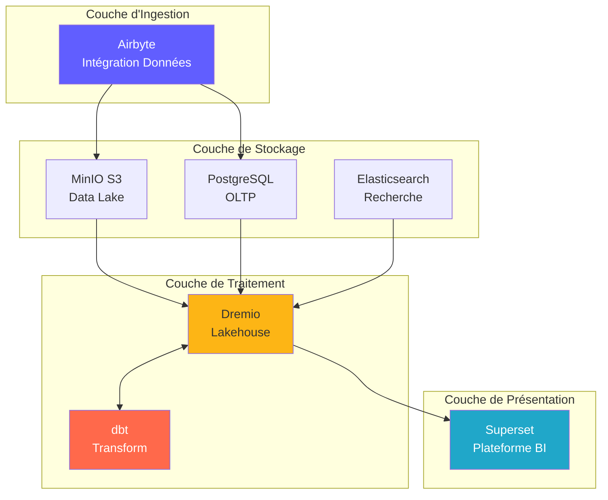
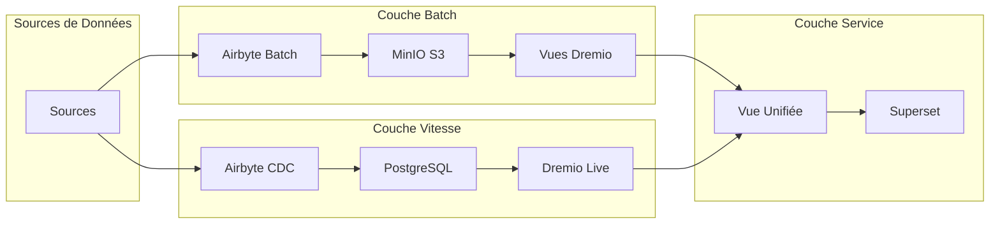
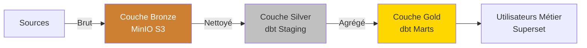
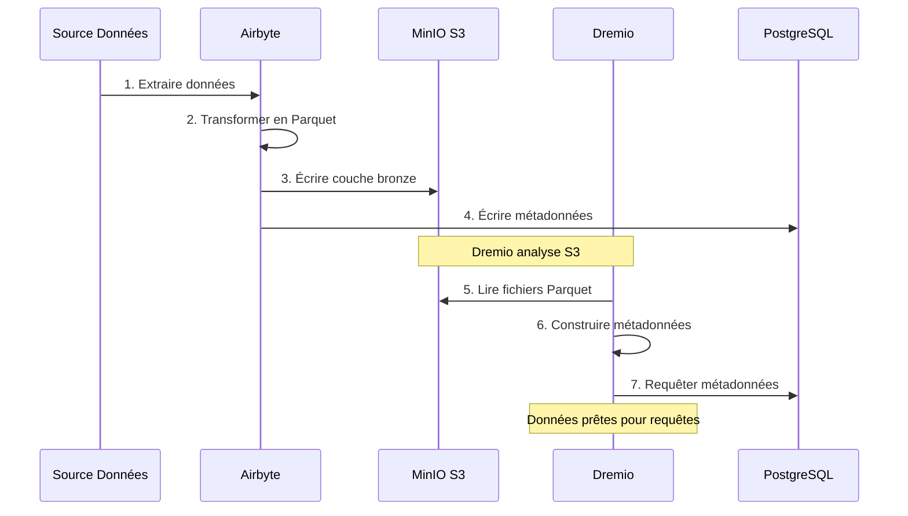
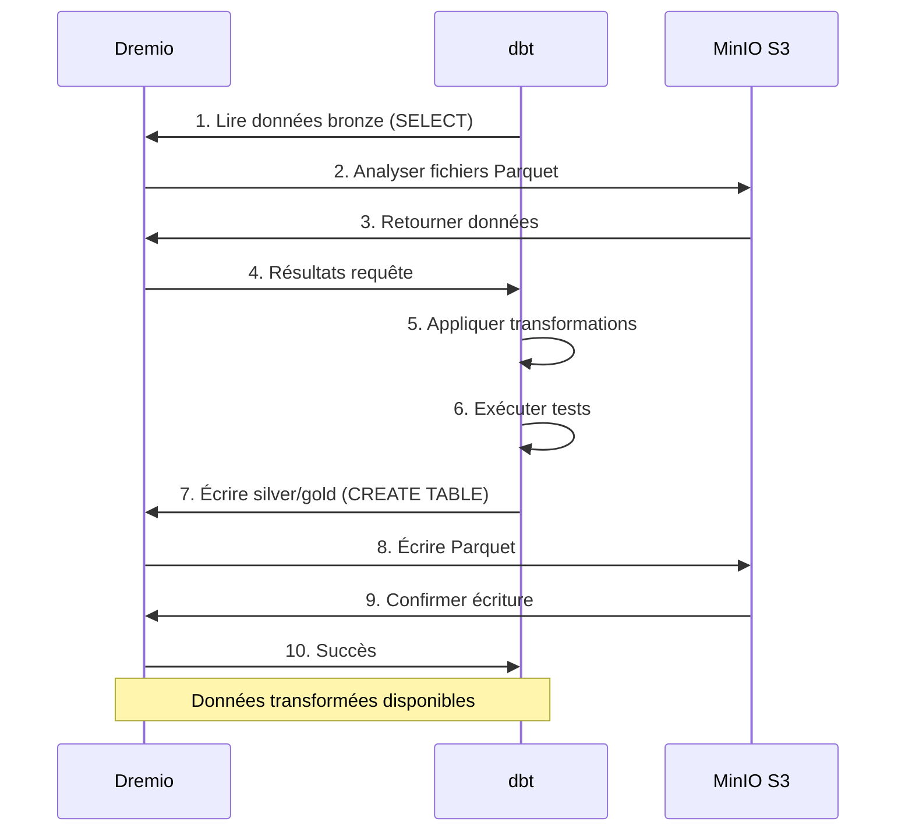
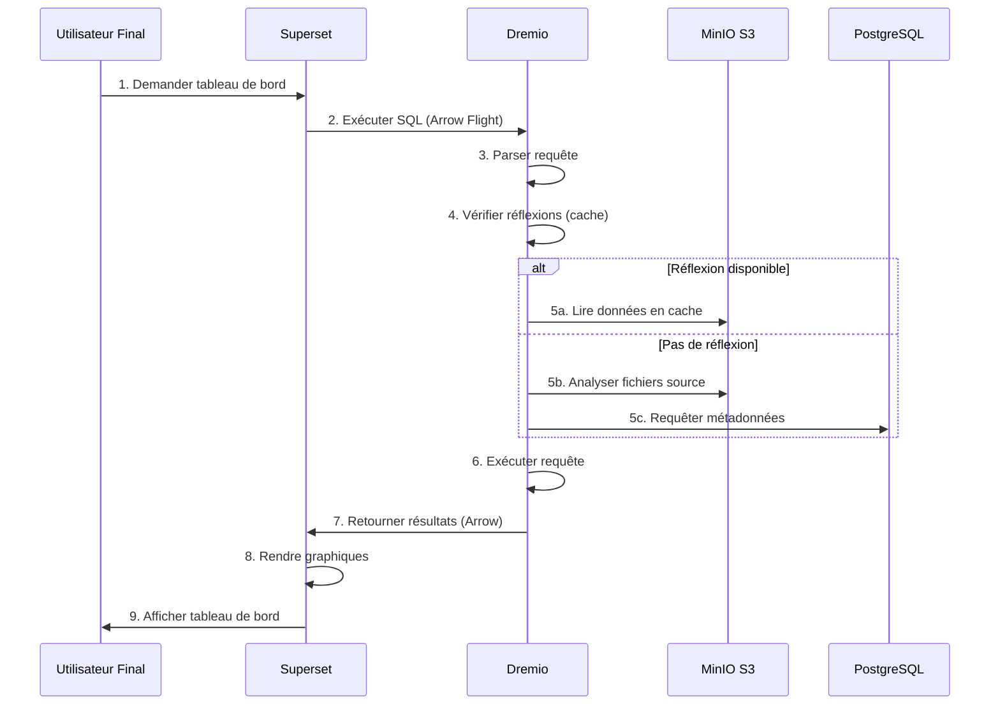
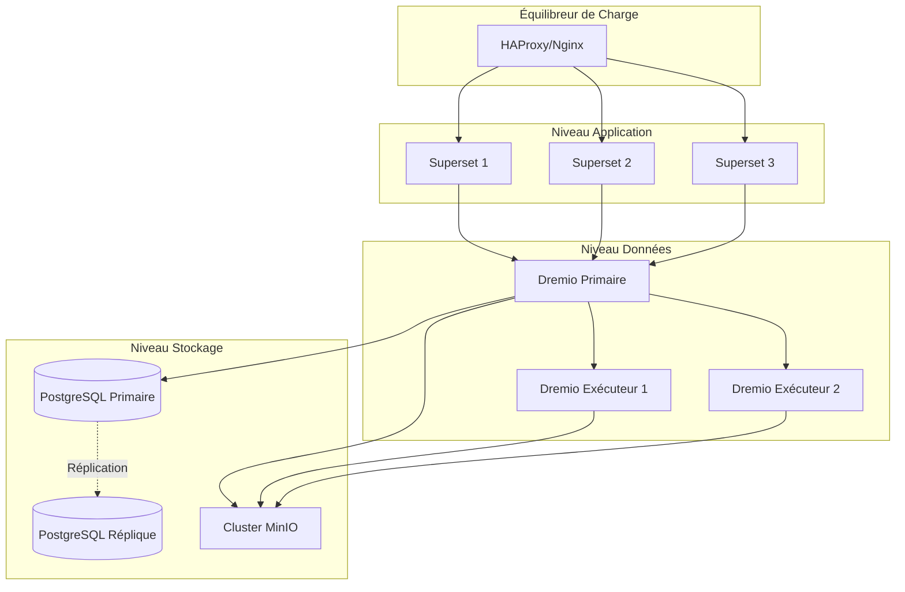
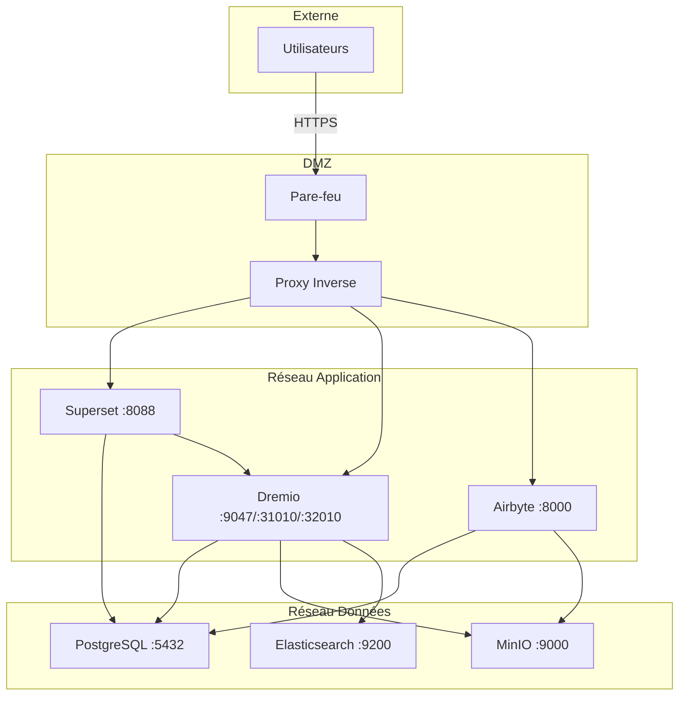
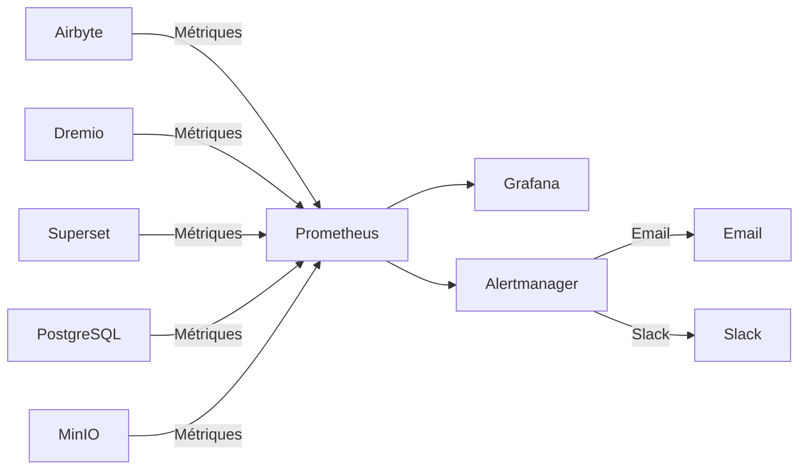

# Descripción general de la arquitectura

**Versión**: 3.2.0  
**Última actualización**: 2025-10-16  
**Idioma**: Francés

---

## Introducción

La plataforma de datos es una arquitectura moderna nativa de la nube construida sobre tecnologías de código abierto. Proporciona una solución integral para la ingesta, el almacenamiento, la transformación y la visualización de datos, diseñada para cargas de trabajo analíticas a escala empresarial.



---

## Principios de diseño

### 1. Código abierto primero

**Filosofía**: Utilice tecnologías de código abierto para evitar la dependencia de proveedores y mantener la flexibilidad.

**Beneficios**:
- Sin costos de licencia
- Desarrollo comunitario
- Capacidad de personalización total
- Auditoría de seguridad transparente
- Amplia compatibilidad con ecosistemas

### 2. Arquitectura en capas

**Filosofía**: Separe las preocupaciones en distintas capas para lograr mantenibilidad y escalabilidad.

**Capas**:
```
┌─────────────────────────────────────┐
│     Couche de Présentation          │  Superset (BI & Tableaux de Bord)
├─────────────────────────────────────┤
│     Couche Sémantique               │  Dremio (Moteur de Requête)
├─────────────────────────────────────┤
│     Couche de Transformation        │  dbt (Transformation Données)
├─────────────────────────────────────┤
│     Couche de Stockage              │  MinIO, PostgreSQL, Elasticsearch
├─────────────────────────────────────┤
│     Couche d'Ingestion              │  Airbyte (Intégration Données)
└─────────────────────────────────────┘
```

### 3. ELT en lugar de ETL

**Filosofía**: cargar primero los datos sin procesar y transformarlos en destino (ELT).

**¿Por qué ELT?**
- **Flexibilidad**: transforme los datos de múltiples maneras sin volver a extraerlos
- **Rendimiento**: utilice el cálculo de destino para las transformaciones
- **Auditabilidad**: datos sin procesar siempre disponibles para verificación
- **Costo**: Reduzca la carga de extracción en los sistemas fuente

**Fluir**:
```
Extract → Load → Transform
(Airbyte) (MinIO/PostgreSQL) (dbt + Dremio)
```

### 4. Modelo de Lakehouse de datos

**Filosofía**: Combinar la flexibilidad del lago de datos con el rendimiento del almacén de datos.

**Características**:
- **Transacciones ACID**: Operaciones de datos confiables
- **Aplicación de esquema**: Garantías de calidad de datos
- **Viaje en el tiempo**: Consulta de versiones históricas
- **Formatos abiertos**: Parquet, Iceberg, Delta Lake
- **Acceso directo a archivos**: sin bloqueo de propiedad

### 5. Diseño nativo de la nube

**Filosofía**: Diseño para entornos distribuidos y en contenedores.

**Implementación**:
- Contenedores Docker para todos los servicios.
- Escalabilidad horizontal
- Infraestructura como código
- Apátridas siempre que sea posible
- Configuración mediante variables de entorno.

---

## Modelos de arquitectura

### Arquitectura Lambda (Lote + Transmisión)



**Capa por lotes** (datos históricos):
- Grandes volúmenes de datos
- Tratamiento periódico (hora/diario)
- Alta latencia aceptable
- Posibilidad de reprocesamiento completo

**Capa de velocidad** (Datos en tiempo real):
- Captura de datos modificados (CDC)
- Se requiere baja latencia
- Solo actualizaciones incrementales
- Gestiona datos recientes

**Capa de servicio**:
- Fusiona vistas por lotes y de velocidad
- Interfaz de consulta única (Dremio)
- Selección de vista automática

### Medallón de Arquitectura (Bronce → Plata → Oro)



**Capa de bronce** (Sin procesar):
- Datos tal cual de las fuentes.
- Sin transformación
- Historia completa preservada
- Airbyte se carga aquí

**Capa de plata** (Limpiada):
- Calidad de datos aplicada
- Formatos estandarizados
- plantillas de preparación dbt
- Análisis listo

**Capa Dorada** (Profesión):
- Métricas agregadas
- Lógica empresarial aplicada
- Modelos Marts dbt.
- Optimizado para el consumo

---

## Interacciones entre componentes

### Flujo de ingesta de datos



### Canal de transformación



### Ejecutando consultas



---

## Modelos de escalabilidad

### Escala horizontal

**Servicios sin estado** (pueden evolucionar libremente):
- Airbyte Workers: evoluciona para sincronizaciones paralelas
- Dremio Executors: escala para el rendimiento de consultas
- Web Superset: evolucione para usuarios competitivos

**Servicios con estado** (requiere coordinación):
- PostgreSQL: replicación de réplica primaria
- MinIO: modo distribuido (múltiples nodos)
- Elasticsearch: Clúster con fragmentación

### Escala vertical

**Intensivo en Memoria**:
- Dremio: aumenta el montón de JVM para consultas grandes
- PostgreSQL: más RAM para el búfer de caché
- Elasticsearch: Más montón para indexar

**CPU intensivo**:
- dbt: Más núcleos para modelos de construcción paralelos
- Airbyte: transformaciones de datos más rápidas

### Partición de datos

```sql
-- Exemple: Partitionner par date
CREATE TABLE orders_partitioned (
    order_id INT,
    customer_id INT,
    amount DECIMAL,
    order_date DATE
)
PARTITION BY (DATE_TRUNC('month', order_date))
STORED AS PARQUET;

-- La requête analyse uniquement les partitions pertinentes
SELECT SUM(amount)
FROM orders_partitioned
WHERE order_date >= '2025-01-01'
  AND order_date < '2025-02-01';
-- Analyse uniquement la partition de janvier
```

---

## Alta disponibilidad

### Redundancia de servicios



### Escenarios de fracaso

| Componente | Desglose | Recuperación |
|---------------|-------|---------|
| **Trabajador de Airbyte** | Accidente de contenedor | Reinicio automático, reanudar sincronización |
| **Ejecutor de Dremio** | Fallo del nodo | Solicitud redirigida a otros ejecutores |
| **PostgreSQL** | Primaria fuera de servicio | Promocionar réplica en primaria |
| **Nodo MinIO** | Fallo del disco | La codificación de borrado reconstruye datos |
| **Superconjunto** | Servicio fuera de servicio | Balancer redirige el tráfico |

### Estrategia de copia de seguridad

```bash
# Sauvegardes automatisées quotidiennes
0 2 * * * /scripts/backup_all.sh

# backup_all.sh
#!/bin/bash

# Sauvegarder PostgreSQL
pg_dumpall -U postgres > /backups/postgres_$(date +%Y%m%d).sql

# Sauvegarder métadonnées Dremio
tar czf /backups/dremio_$(date +%Y%m%d).tar.gz /opt/dremio/data

# Synchroniser MinIO vers S3 distant
mc mirror MinIOLake/datalake s3-offsite/datalake-backup

# Conserver 30 jours
find /backups -mtime +30 -delete
```

---

## Arquitectura de seguridad

### Seguridad de la red



### Autenticación y autorización

**Autenticación de servicio**:
- **Dremio**: LDAP/AD, OAuth2, integración SAML
- **Superconjunto**: autenticación de base de datos, LDAP, OAuth2
- **Airbyte**: autenticación básica, OAuth2 (empresarial)
- **MinIO**: políticas de IAM, tokens STS

**Niveles de autorización**:
```yaml
Rôles:
  - Admin:
      - Accès complet à tous les services
      - Gestion utilisateurs
      - Modifications configuration
  
  - Data Engineer:
      - Créer/modifier sources données
      - Exécuter syncs Airbyte
      - Exécuter modèles dbt
      - Créer datasets Dremio
  
  - Analyst:
      - Accès lecture seule données
      - Créer tableaux de bord Superset
      - Requêter datasets Dremio
  
  - Viewer:
      - Voir tableaux de bord uniquement
      - Pas d'accès données
```

### Cifrado de datos

**En paz**:
- MinIO: cifrado del lado del servidor (AES-256)
- PostgreSQL: cifrado de datos transparente (TDE)
- Elasticsearch: índices cifrados

**En tránsito**:
- TLS 1.3 para todas las comunicaciones entre servicios
- Arrow Flight con TLS para Dremio ↔ Superset
- HTTPS para interfaces web

---

## Monitoreo y observabilidad

### Colección de métricas



**Métricas clave**:
- **Airbyte**: tasa de éxito de sincronización, grabaciones sincronizadas, bytes transferidos
- **Dremio**: latencia de solicitud, tasa de aciertos de caché, uso de recursos
- **dbt**: tiempo de construcción del modelo, fallos en las pruebas.
- **Superconjunto**: tiempo de carga del panel, usuarios activos
- **Infraestructura**: CPU, memoria, disco, red

### Registro

**Registro centralizado**:
```yaml
Stack ELK:
  - Elasticsearch: Stocker logs
  - Logstash: Traiter logs
  - Kibana: Visualiser logs

Sources de Logs:
  - Logs application (format JSON)
  - Logs d'accès
  - Logs d'audit
  - Logs d'erreur
```

### Seguimiento

**Seguimiento distribuido**:
- Integración Jaeger o Zipkin
- Seguimiento de solicitudes entre servicios.
- Identificar cuellos de botella
- Depurar problemas de rendimiento

---

## Topologías de implementación

### Entorno de desarrollo

```yaml
Hôte Unique:
  Ressources: 8 Go RAM, 4 CPUs
  Services: Tous sur une machine
  Stockage: Volumes locaux
  Réseau: Réseau bridge
  Cas d'usage: Développement, tests
```

### Entorno de puesta en escena

```yaml
Multi-Hôtes:
  Ressources: 16 Go RAM, 8 CPUs par hôte
  Services: Répartis sur 2-3 hôtes
  Stockage: NFS partagé ou MinIO distribué
  Réseau: Réseau overlay
  Cas d'usage: Tests pré-production, UAT
```

### Entorno de producción

```yaml
Cluster Kubernetes:
  Ressources: Auto-scaling selon charge
  Services: Conteneurisés, répliqués
  Stockage: Volumes persistants (SSD)
  Réseau: Service mesh (Istio)
  Haute Disponibilité: Déploiement multi-zones
  Cas d'usage: Charges production
```

---

## Justificación de las elecciones tecnológicas

### ¿Por qué Airbyte?

- **Más de 300 conectores**: integraciones prediseñadas
- **Código abierto**: sin dependencia del proveedor
- **Comunidad activa**: más de 12.000 estrellas de GitHub
- **Soporte CDC**: captura de datos en tiempo real
- **Estandarización**: integración dbt incorporada

### ¿Por qué Dremio?

- **Aceleración de consultas**: consultas entre 10 y 100 veces más rápidas
- **Arrow Flight**: transferencia de datos de alto rendimiento
- **Compatibilidad con lago de datos**: sin movimiento de datos
- **Autoservicio**: los usuarios empresariales exploran los datos
- **Rentable**: Reduzca los costos de almacén

### ¿Por qué dbt?

- **Basado en SQL**: familiar para los analistas
- **Control de versiones**: integración de Git
- **Pruebas**: pruebas de calidad de datos integradas
- **Documentación**: Documentos generados automáticamente
- **Comunidad**: más de 5.000 paquetes disponibles

### ¿Por qué superconjunto?

- **IU moderna**: interfaz intuitiva
- **SQL IDE**: capacidades de consulta avanzadas
- **Visualizaciones enriquecidas**: más de 50 tipos de gráficos
- **Extensible**: complementos personalizados
- **Código abierto**: Compatible con la Fundación Apache

### ¿Por qué PostgreSQL?

- **Confiabilidad**: Cumplimiento ACID
- **Rendimiento**: probado a escala
- **Características**: JSON, búsqueda de texto completo, extensiones
- **Comunidad**: ecosistema maduro
- **Costo**: Gratis y de código abierto

### ¿Por qué MinIO?

- **Compatibilidad S3**: API estándar de la industria
- **Rendimiento**: Alto caudal
- **Códificación de borrado**: Durabilidad de los datos
- **Nube múltiple**: implementación en todas partes
- **Rentable**: alternativa autohospedada

---

## Evolución futura de la arquitectura

### Mejoras planificadas

1. **Catálogo de datos** (Integración de OpenMetadata)
   - Gestión de metadatos
   - Seguimiento de linaje
   - Descubrimiento de datos

2. **Calidad de los datos** (grandes expectativas)
   - Validación automatizada
   - Detección de anomalías
   - Paneles de calidad

3. **Operaciones de aprendizaje automático** (MLflow)
   - Canalizaciones de formación modelo
   - Registro de modelos
   - Automatización de la implementación

4. **Procesamiento de transmisión** (Apache Flink)
   - Transformaciones en tiempo real
   - Procesamiento de eventos complejos
   - Análisis de transmisión

5. **Gobernanza de datos** (Apache Atlas)
   - Aplicación de políticas
   - Auditoría de acceso
   - Informes de cumplimiento

---

## Referencias

- [Detalles del componente](components.md)
- [Flujo de datos](flujo de datos.md)
- [Guía de implementación] (deployment.md)
- [Integración de Airbyte] (../guides/airbyte-integration.md)

---

**Versión de descripción general de la arquitectura**: 3.2.0  
**Última actualización**: 2025-10-16  
**Mantenido por**: Equipo de plataforma de datos