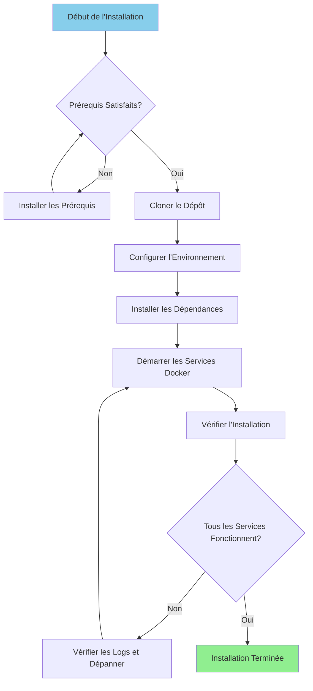

# Guía de instalación

**Versión**: 3.2.0  
**Última actualización**: 2025-10-16  
**Idioma**: Francés

---

## Descripción general

Esta guía proporciona instrucciones paso a paso para instalar y configurar la plataforma de datos completa, incluidos Airbyte, Dremio, dbt, Apache Superset y la infraestructura de soporte.



---

## Requisitos previos

### Requisitos del sistema

**Requisitos mínimos:**
- **CPU**: 4 núcleos (se recomiendan 8+)
- **RAM**: 8 GB (se recomiendan más de 16 GB)
- **Espacio en disco**: 20 GB disponibles (se recomiendan más de 50 GB)
- **Red**: conexión a Internet estable para imágenes de Docker

**Sistemas operativos:**
- Linux (Ubuntu 20.04+, CentOS 8+, Debian 11+)
- Mac OS (11.0+)
- Windows 10/11 con WSL2

### Software requerido

#### 1. Ventana acoplable

**Versión**: 20.10 o superior

**Instalación:**

**Linux:**
```bash
# Installer Docker
curl -fsSL https://get.docker.com -o get-docker.sh
sudo sh get-docker.sh

# Ajouter l'utilisateur au groupe docker
sudo usermod -aG docker $USER

# Démarrer le service Docker
sudo systemctl start docker
sudo systemctl enable docker

# Vérifier l'installation
docker --version
```

**macOS:**
```bash
# Télécharger et installer Docker Desktop depuis:
# https://www.docker.com/products/docker-desktop

# Vérifier l'installation
docker --version
```

**Windows:**
```powershell
# Installer WSL2 d'abord
wsl --install

# Télécharger et installer Docker Desktop depuis:
# https://www.docker.com/products/docker-desktop

# Vérifier l'installation
docker --version
```

#### 2. Redacción de Docker

**Versión**: 2.0 o superior

**Instalación:**

```bash
# Linux
sudo curl -L "https://github.com/docker/compose/releases/latest/download/docker-compose-$(uname -s)-$(uname -m)" -o /usr/local/bin/docker-compose
sudo chmod +x /usr/local/bin/docker-compose

# Vérifier l'installation
docker-compose --version
```

**Nota**: Docker Desktop para macOS y Windows incluye Docker Compose.

#### 3. Pitón

**Versión**: 3.11 o superior

**Instalación:**

**Linux (Ubuntu/Debian):**
```bash
sudo apt update
sudo apt install python3.11 python3.11-venv python3-pip
```

**macOS:**
```bash
brew install python@3.11
```

**Windows:**
```powershell
# Télécharger l'installateur depuis python.org
# Ou utiliser winget:
winget install Python.Python.3.11
```

**Verificación:**
```bash
python --version  # ou python3 --version
pip --version     # ou pip3 --version
```

#### 4.Git

**Instalación:**

```bash
# Linux
sudo apt install git  # Ubuntu/Debian
sudo yum install git  # CentOS/RHEL

# macOS
brew install git

# Windows
winget install Git.Git
```

**Verificación:**
```bash
git --version
```

---

## Pasos de instalación

### Paso 1: clonar el repositorio

```bash
# Cloner le dépôt
git clone https://github.com/your-org/dremiodbt.git

# Naviguer vers le répertoire du projet
cd dremiodbt

# Vérifier le contenu
ls -la
```

**Estructura esperada:**
```
dremiodbt/
├── docker-compose.yml
├── docker-compose-airbyte.yml
├── README.md
├── requirements.txt
├── dbt/
├── dremio_connector/
├── docs/
└── scripts/
```

### Paso 2: Configurar el entorno

#### Crear archivo de entorno

```bash
# Copier le fichier d'environnement exemple
cp .env.example .env

# Éditer la configuration (optionnel)
nano .env  # ou utiliser votre éditeur préféré
```

#### Variables de entorno

**Configuración básica:**
```bash
# Projet
PROJECT_NAME=dremiodbt
ENVIRONMENT=development

# Réseau Docker
NETWORK_NAME=dremio_network

# PostgreSQL
POSTGRES_HOST=postgres
POSTGRES_PORT=5432
POSTGRES_DB=dremio_db
POSTGRES_USER=postgres
POSTGRES_PASSWORD=postgres123

# Dremio
DREMIO_VERSION=26.0
DREMIO_HTTP_PORT=9047
DREMIO_FLIGHT_PORT=32010
DREMIO_ADMIN_USER=admin
DREMIO_ADMIN_PASSWORD=admin123

# Airbyte
AIRBYTE_VERSION=0.50.33
AIRBYTE_HTTP_PORT=8000
AIRBYTE_API_PORT=8001

# Superset
SUPERSET_VERSION=3.0
SUPERSET_HTTP_PORT=8088
SUPERSET_ADMIN_USER=admin
SUPERSET_ADMIN_PASSWORD=admin

# MinIO
MINIO_VERSION=latest
MINIO_API_PORT=9000
MINIO_CONSOLE_PORT=9001
MINIO_ROOT_USER=minioadmin
MINIO_ROOT_PASSWORD=minioadmin123

# Elasticsearch
ELASTIC_VERSION=8.15.0
ELASTIC_HTTP_PORT=9200
```

### Paso 3: Instalar las dependencias de Python

#### Crear el entorno virtual

```bash
# Créer l'environnement virtuel
python -m venv venv

# Activer l'environnement virtuel
# Linux/macOS:
source venv/bin/activate

# Windows:
.\venv\Scripts\activate
```

#### Requisitos de instalación

```bash
# Mettre à jour pip
pip install --upgrade pip

# Installer les dépendances
pip install -r requirements.txt

# Vérifier l'installation
pip list
```

**Paquetes clave instalados:**
- `pyarrow>=21.0.0` - Cliente de Arrow Flight
- `pandas>=2.3.0` - Manipulación de datos
- `dbt-core>=1.10.0` - Transformación de datos
- `sqlalchemy>=2.0.0` - Conectividad de base de datos
- `pyyaml>=6.0.0` - Gestión de configuración

### Paso 4: iniciar los servicios de Docker

#### Iniciar servicios principales

```bash
# Démarrer tous les services
docker-compose up -d

# Ou utiliser Makefile (si disponible)
make up
```

**Servicios iniciados:**
- PostgreSQL (puerto 5432)
- Dremio (puertos 9047, 32010)
- Superconjunto de Apache (puerto 8088)
- MinIO (puertos 9000, 9001)
- Elasticsearch (puerto 9200)

#### Iniciar Airbyte (redactar por separado)

```bash
# Démarrer les services Airbyte
docker-compose -f docker-compose-airbyte.yml up -d
```

**Servicios de Airbyte iniciados:**
- Servidor Airbyte (puerto 8001)
- Interfaz de usuario web de Airbyte (puerto 8000)
- Trabajador de Airbyte
- Airbyte temporal
- Base de datos de Airbytes

#### Verificar el estado de los servicios

```bash
# Voir les conteneurs en cours d'exécution
docker-compose ps

# Voir tous les conteneurs (incluant Airbyte)
docker ps

# Voir les logs
docker-compose logs -f

# Voir les logs Airbyte
docker-compose -f docker-compose-airbyte.yml logs -f
```

---

## Verificación

### Paso 5: Verificar servicios

#### 1. PostgreSQL

```bash
# Tester la connexion
docker exec -it postgres psql -U postgres -d dremio_db -c "SELECT version();"
```

**Resultado esperado:**
```
PostgreSQL 16.x on x86_64-pc-linux-gnu
```

#### 2. Dremio

**Interfaz Web:**
```
http://localhost:9047
```

**Primera conexión:**
- Nombre de usuario: `admin`
- Contraseña: `admin123`
- Se le pedirá que cree una cuenta de administrador en el primer acceso.

**Prueba la conexión:**
```bash
# Tester le point de terminaison HTTP
curl http://localhost:9047/apiv2/login
```

#### 3. Byte de aire

**Interfaz Web:**
```
http://localhost:8000
```

**Identificadores predeterminados:**
- Correo electrónico: `airbyte@example.com`
- Contraseña: `password`

**Prueba la API:**
```bash
# Vérification de santé
curl http://localhost:8001/health
```

**Respuesta esperada:**
```json
{
  "status": "ok",
  "timestamp": "2025-10-16T12:00:00Z"
}
```

#### 4. Superconjunto de Apache

**Interfaz Web:**
```
http://localhost:8088
```

**Identificadores predeterminados:**
- Nombre de usuario: `admin`
- Contraseña: `admin`

**Prueba la conexión:**
```bash
curl http://localhost:8088/health
```

#### 5. MinIO

**Interfaz de usuario de consola:**
```
http://localhost:9001
```

**Cartas credenciales:**
- Nombre de usuario: `minioadmin`
- Contraseña: `minioadmin123`

**Pruebe la API de S3:**
```bash
# Installer le client MinIO
wget https://dl.min.io/client/mc/release/linux-amd64/mc
chmod +x mc

# Configurer
./mc alias set local http://localhost:9000 minioadmin minioadmin123

# Tester
./mc ls local
```

#### 6. Búsqueda elástica

**Prueba la conexión:**
```bash
# Vérification de santé
curl http://localhost:9200/_cluster/health

# Obtenir les informations
curl http://localhost:9200
```

**Respuesta esperada:**
```json
{
  "name": "elasticsearch",
  "cluster_name": "docker-cluster",
  "version": {
    "number": "8.15.0"
  }
}
```

### Paso 6: ejecutar comprobaciones de estado

```bash
# Exécuter le script de vérification de santé complet
python scripts/health_check.py

# Ou utiliser Makefile
make health-check
```

**Resultado esperado:**
```
✓ PostgreSQL: En cours d'exécution (port 5432)
✓ Dremio: En cours d'exécution (ports 9047, 32010)
✓ Airbyte: En cours d'exécution (ports 8000, 8001)
✓ Superset: En cours d'exécution (port 8088)
✓ MinIO: En cours d'exécution (ports 9000, 9001)
✓ Elasticsearch: En cours d'exécution (port 9200)

Tous les services sont opérationnels!
```

---

## Configuración posterior a la instalación

### 1. Inicializar Dremio

```bash
# Exécuter le script d'initialisation
python scripts/init_dremio.py
```

**Crea:**
- Usuario administrador
- Fuentes predeterminadas (PostgreSQL, MinIO)
- Conjuntos de datos de ejemplo

### 2. Inicializar superconjunto

```bash
# Initialiser la base de données
docker exec -it superset superset db upgrade

# Créer un utilisateur administrateur (si inexistant)
docker exec -it superset superset fab create-admin \
    --username admin \
    --firstname Admin \
    --lastname User \
    --email admin@example.com \
    --password admin

# Initialiser Superset
docker exec -it superset superset init
```

### 3. Configurar dbt

```bash
# Naviguer vers le répertoire dbt
cd dbt

# Tester la connexion
dbt debug

# Exécuter les modèles initiaux
dbt run

# Exécuter les tests
dbt test
```

### 4. Configurar Airbyte

**A través de la interfaz web (http://localhost:8000):**

1. Complete el asistente de configuración
2. Configure la primera fuente (por ejemplo: PostgreSQL)
3. Configure el destino (por ejemplo: MinIO S3)
4. Crea la conexión
5. Ejecute la primera sincronización.

**A través de API:**
```bash
# Voir docs/i18n/fr/guides/airbyte-integration.md pour les détails
python scripts/configure_airbyte.py
```

---

## Estructura del directorio después de la instalación

```
dremiodbt/
├── venv/                          # Environnement virtuel Python
├── data/                          # Stockage de données local
│   ├── dremio/                    # Métadonnées Dremio
│   ├── postgres/                  # Données PostgreSQL
│   └── minio/                     # Données MinIO
├── logs/                          # Logs applicatifs
│   ├── dremio.log
│   ├── airbyte.log
│   ├── superset.log
│   └── dbt.log
├── dbt/
│   ├── models/                    # Modèles dbt
│   ├── tests/                     # Tests dbt
│   ├── target/                    # SQL compilé
│   └── logs/                      # Logs dbt
└── docker-volume/                 # Volumes persistants Docker
    ├── db-data/                   # Données de base de données
    ├── minio-data/                # Stockage objet
    └── elastic-data/              # Index de recherche
```

---

## Solución de problemas

### Problemas comunes

#### 1. Puerto ya utilizado

**Error:**
```
Error: bind: address already in use
```

**Solución:**
```bash
# Trouver le processus utilisant le port (exemple: 9047)
sudo lsof -i :9047

# Terminer le processus
sudo kill -9 <PID>

# Ou changer le port dans docker-compose.yml
```

#### 2. Memoria insuficiente

**Error:**
```
ERROR: Insufficient memory available
```

**Solución:**
```bash
# Augmenter l'allocation mémoire Docker
# Docker Desktop: Paramètres > Ressources > Mémoire (16Go recommandés)

# Linux: Éditer /etc/docker/daemon.json
{
  "default-ulimits": {
    "memlock": {
      "Hard": -1,
      "Name": "memlock",
      "Soft": -1
    }
  }
}

# Redémarrer Docker
sudo systemctl restart docker
```

#### 3. Los servicios no se inician

**Verificar registros:**
```bash
# Voir tous les logs des services
docker-compose logs

# Voir un service spécifique
docker-compose logs dremio
docker-compose logs airbyte-server

# Suivre les logs en temps réel
docker-compose logs -f
```

#### 4. Problemas de red

**Restablecer la red Docker:**
```bash
# Arrêter tous les services
docker-compose down
docker-compose -f docker-compose-airbyte.yml down

# Supprimer le réseau
docker network rm dremio_network

# Redémarrer les services
docker-compose up -d
docker-compose -f docker-compose-airbyte.yml up -d
```

#### 5. Problemas de permisos (Linux)

**Solución:**
```bash
# Corriger les permissions des répertoires de données
sudo chown -R $USER:$USER data/ docker-volume/

# Corriger les permissions du socket Docker
sudo chmod 666 /var/run/docker.sock
```

---

## Desinstalación

### Detener los servicios

```bash
# Arrêter les services principaux
docker-compose down

# Arrêter Airbyte
docker-compose -f docker-compose-airbyte.yml down
```

### Eliminar datos (opcional)

```bash
# Supprimer les volumes (ATTENTION: Supprime toutes les données)
docker-compose down -v
docker-compose -f docker-compose-airbyte.yml down -v

# Supprimer les répertoires de données locaux
rm -rf data/ docker-volume/ logs/
```

### Eliminar imágenes de Docker

```bash
# Lister les images
docker images | grep dremio

# Supprimer des images spécifiques
docker rmi dremio/dremio-oss:24.0
docker rmi airbyte/server:0.50.33
docker rmi apache/superset:3.0

# Supprimer toutes les images non utilisées
docker image prune -a
```

---

## Próximos pasos

Después de una instalación exitosa:

1. **Configurar fuentes de datos** - Consulte la [Guía de configuración](configuration.md)
2. **Tutorial de primeros pasos** - Consulte [Primeros pasos](first-steps.md)
3. **Configuración de Airbyte** - Consulte la [Guía de integración de Airbyte](../guides/airbyte-integration.md)
4. **Configuración de Dremio** - Consulte la [Guía de configuración de Dremio](../guides/dremio-setup.md)
5. **Crear modelos dbt** - Consulte la [Guía de desarrollo de dbt](../guides/dbt-development.md)
6. **Crear paneles**: consulte la [Guía de paneles de superconjunto](../guides/superset-dashboards.md)

---

## Apoyo

Para problemas de instalación:

- **Documentación**: [Guía de solución de problemas](../guides/troubleshooting.md)
- **Problemas de GitHub**: https://github.com/your-org/dremiodbt/issues
- **Comunidad**: https://github.com/your-org/dremiodbt/discussions

---

**Versión de la guía de instalación**: 3.2.0  
**Última actualización**: 2025-10-16  
**Mantenido por**: Equipo de plataforma de datos