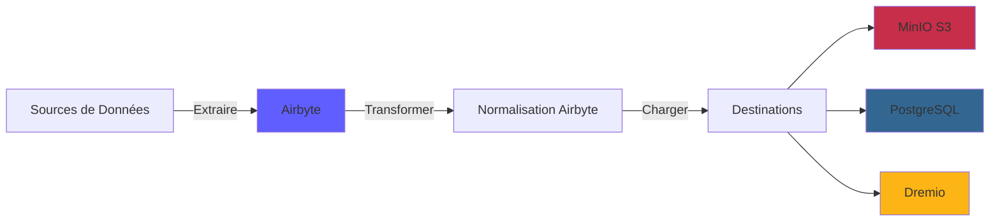
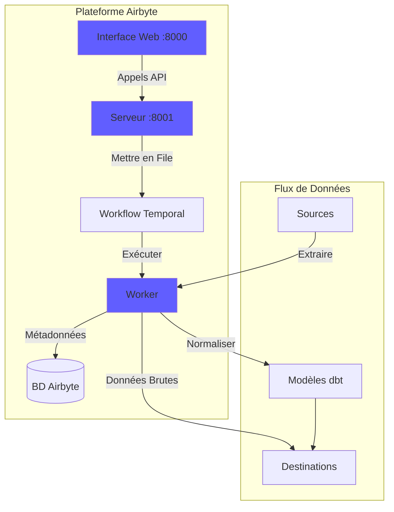
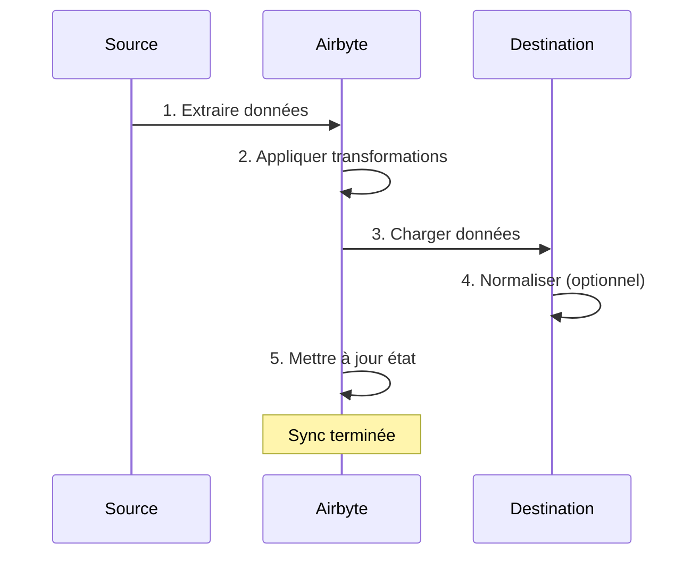
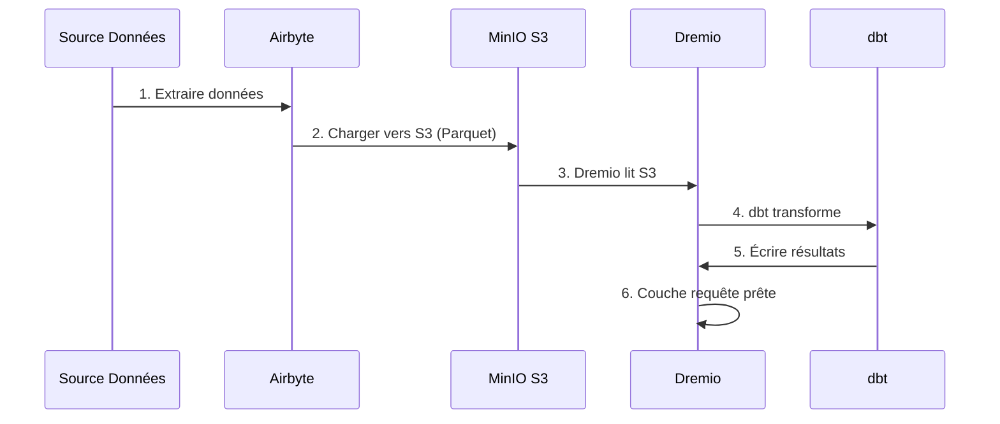

# Guía de integración de Airbyte

**Versión**: 3.2.0  
**Última actualización**: 16 de octubre de 2025  
**Idioma**: Francés

---

## Descripción general

Airbyte es una plataforma de integración de datos de código abierto que simplifica la transferencia de datos desde diversas fuentes a destinos. Esta guía cubre la integración de Airbyte en la plataforma de datos, la configuración de conectores y el establecimiento de canalizaciones de datos.



---

## ¿Qué es Airbyte?

### Características clave

- **Más de 300 conectores prediseñados**: API, bases de datos, archivos, aplicaciones SaaS
- **Código abierto**: autohospedado con control total de datos
- **Captura de datos modificados (CDC)**: sincronización de datos en tiempo real
- **Conectores personalizados**: cree conectores con Python o CDK de código bajo
- **Normalización de datos**: transforma JSON sin formato en tablas estructuradas
- **Monitoreo y alertas**: realice un seguimiento del estado de sincronización y la calidad de los datos

### Arquitectura



---

## Instalación

### Inicio rápido

Airbyte está incluido en la plataforma. Empiece con:

```bash
# Démarrer services Airbyte
docker-compose -f docker-compose-airbyte.yml up -d

# Vérifier statut
docker-compose -f docker-compose-airbyte.yml ps

# Voir logs
docker-compose -f docker-compose-airbyte.yml logs -f
```

### Servicios iniciados

| Servicios | Puerto | Descripción |
|--------|------|-------------|
| **airbyte-webapp** | 8000 | Interfaz de usuario web |
| **servidor-airbyte** | 8001 | Servidor API |
| **airbyte-trabajador** | - | Motor de ejecución de trabajos |
| **airbyte-temporal** | 7233 | Orquestación del flujo de trabajo |
| **airbyte-db** | 5432 | Base de datos de metadatos (PostgreSQL) |

### Primer acceso

**Interfaz Web:**
```
http://localhost:8000
```

**Identificadores predeterminados:**
- **Correo electrónico**: `airbyte@example.com`
- **Contraseña**: `password`

**Cambie la contraseña** al iniciar sesión por primera vez por seguridad.

---

## Configuración

### Asistente de configuración

En el primer acceso, complete el asistente de configuración:

1. **Preferencias de correo electrónico**: configurar notificaciones
2. **Residencia de datos**: seleccione la ubicación de almacenamiento de datos
3. **Estadísticas de uso anónimo**: aceptar/rechazar telemetría

### Configuración del espacio de trabajo

Vaya a **Configuración > Espacio de trabajo**:

```yaml
Nom Workspace: Production Data Platform
ID Workspace: default
Définition Namespace: Destination Default
Format Namespace: ${SOURCE_NAMESPACE}
```

### Límites de recursos

**Archivo**: `config/airbyte/config.yaml`

```yaml
# Allocation ressources par connecteur
resources:
  source:
    cpu_limit: "1.0"
    memory_limit: "1Gi"
    cpu_request: "0.25"
    memory_request: "256Mi"
  
  destination:
    cpu_limit: "1.0"
    memory_limit: "1Gi"
    cpu_request: "0.25"
    memory_request: "256Mi"
  
  orchestrator:
    cpu_limit: "0.5"
    memory_limit: "512Mi"
```

---

## Conectores

### Conectores de fuente

#### Fuente PostgreSQL

**Caso de uso**: extraer datos de una base de datos transaccional

**Configuración:**

1. Vaya a **Fuentes > Nueva fuente**
2. Seleccione **PostgreSQL**
3. Configure la conexión:

```yaml
Host: postgres
Port: 5432
Database: source_db
Username: readonly_user
Password: [MOT_DE_PASSE_SÉCURISÉ]
SSL Mode: prefer

Méthode Réplication: Standard
  # Ou CDC pour changements temps réel:
  # Méthode Réplication: Logical Replication (CDC)
```

**Probar conexión** → **Configurar fuente**

#### Fuente de API REST

**Caso de uso**: extraer datos de las API

**Configuración:**

```yaml
Name: External API
URL Base: https://api.example.com/v1
Authentication:
  Type: Bearer Token
  Token: [API_TOKEN]

Endpoints:
  - name: customers
    path: /customers
    http_method: GET
    
  - name: orders
    path: /orders
    http_method: GET
    params:
      start_date: "{{ config['start_date'] }}"
```

#### Archivo fuente (CSV)

**Caso de uso**: Importar archivos CSV

**Configuración:**

```yaml
Dataset Name: sales_data
URL: https://storage.example.com/sales.csv
Format: CSV
Provider:
  Storage: HTTPS
  User Provided Storage:
    URL: https://storage.example.com/sales.csv
```

#### Fuentes comunes

| Fuente | Casos de uso | Soporte de los CDC |
|--------|--------|-------------|
| **PostgreSQL** | Cómics transaccionales | ✅ Sí |
| **MySQL** | Cómics transaccionales | ✅ Sí |
| **MongoDB** | Documentos NoSQL | ✅ Sí |
| **Fuerza de ventas** | Datos de CRM | ❌ No |
| **Hojas de cálculo de Google** | Hojas de cálculo | ❌ No |
| **Raya** | Datos de pago | ❌ No |
| **API RESTO** | API personalizadas | ❌ No |
| **T3** | Almacenamiento de archivos | ❌ No |

### Conectores de destino

#### Destino MinIO S3

**Caso de uso**: almacenar datos sin procesar en un lago de datos

**Configuración:**

1. Navegue a **Destinos > Nuevo destino**
2. Seleccione **S3**
3. Configure la conexión:

```yaml
S3 Bucket Name: datalake
S3 Bucket Path: airbyte-data/${NAMESPACE}/${STREAM_NAME}
S3 Bucket Region: us-east-1

# Point de terminaison MinIO
S3 Endpoint: http://minio:9000
Access Key ID: [MINIO_ROOT_USER]
Secret Access Key: [MINIO_ROOT_PASSWORD]

Output Format:
  Format Type: Parquet
  Compression: GZIP
  Block Size: 128MB
```

**Probar conexión** → **Configurar destino**

#### Destino PostgreSQL

**Caso de uso**: cargar datos transformados para análisis

**Configuración:**

```yaml
Host: postgres
Port: 5432
Database: analytics_db
Username: analytics_user
Password: [MOT_DE_PASSE_SÉCURISÉ]
Default Schema: public

Normalization:
  Mode: Basic
  # Crée tables normalisées depuis JSON imbriqué
```

#### Destino Dremio

**Caso de uso**: carga directa en data lakehouse

**Configuración:**

```yaml
Host: dremio
Port: 32010
Project: Production
Dataset: airbyte_data
Username: dremio_user
Password: [DREMIO_PASSWORD]

Connection Type: Arrow Flight
SSL: false
```

---

## Conexiones

### Crear una conexión

Una conexión vincula un origen con un destino.



#### Paso a paso

1. **Navegue a Conexiones > Nueva conexión**

2. **Seleccione fuente**: elija la fuente configurada (por ejemplo, PostgreSQL)

3. **Seleccione destino**: elija el destino (por ejemplo: MinIO S3)

4. **Configurar sincronización**:

```yaml
Nom Connexion: PostgreSQL → MinIO
Fréquence Réplication: Every 24 hours
Namespace Destination: Custom
  Format Namespace: production_${SOURCE_NAMESPACE}

Streams:
  - customers
    Mode Sync: Full Refresh | Overwrite
    Champ Curseur: updated_at
    Clé Primaire: customer_id
    
  - orders
    Mode Sync: Incremental | Append
    Champ Curseur: created_at
    Clé Primaire: order_id
    
  - products
    Mode Sync: Full Refresh | Overwrite
    Clé Primaire: product_id
```

5. **Configurar normalización** (opcional):

```yaml
Normalization:
  Enable: true
  Option: Basic Normalization
  # Convertit JSON imbriqué en tables plates
```

6. **Probar conexión** → **Configurar conexión**

### Modos de sincronización

| Moda | Descripción | Casos de uso |
|------|-------------|-------------|
| **Actualización completa\| Sobrescribir** | Reemplazar todos los datos | Tablas de dimensiones |
| **Actualización completa\| Agregar** | Agregar todos los registros | Seguimiento histórico |
| **Incremental\| Agregar** | Agregar registros nuevos/actualizados | Tablas de hechos |
| **Incremental\| Deduplicado** | Actualizar registros existentes | SCD tipo 1 |

### Planificación

**Opciones de frecuencia:**
- **Manual**: Activar manualmente
- **Cada hora**: cada hora
- **Diariamente**: Cada 24 horas (especificar hora)
- **Semanal**: días específicos de la semana
- **Cron**: programación personalizada (por ejemplo: `0 2 * * *`)

**Ejemplos de Horarios:**
```yaml
# Toutes les 6 heures
Cron: 0 */6 * * *

# Jours de semaine à 2h du matin
Cron: 0 2 * * 1-5

# Premier jour du mois
Cron: 0 0 1 * *
```

---

## Transformación de datos

### Normalización básica

Airbyte incluye **Normalización básica** usando dbt:

**Qué hace ella:**
- Convierte JSON anidado en tablas planas
- Crear tablas `_airbyte_raw_*` (JSON sin formato)
- Crea tablas estandarizadas (estructuradas)
- Agregar columnas de metadatos (`_airbyte_emitted_at`, `_airbyte_normalized_at`)

**Ejemplo:**

**JSON sin formato** (`_airbyte_raw_customers`):
```json
{
  "_airbyte_ab_id": "uuid-123",
  "_airbyte_emitted_at": "2025-10-16T10:00:00Z",
  "_airbyte_data": {
    "id": 1,
    "name": "Acme Corp",
    "contact": {
      "email": "info@acme.com",
      "phone": "+1234567890"
    },
    "addresses": [
      {"type": "billing", "city": "New York"},
      {"type": "shipping", "city": "Boston"}
    ]
  }
}
```

**Tablas estandarizadas:**

`customers`:
```sql
id | name | contact_email | contact_phone | _airbyte_normalized_at
1 | Acme Corp | info@acme.com | +1234567890 | 2025-10-16 10:05:00
```

`customers_addresses`:
```sql
_airbyte_customers_hashid | type | city
hash-123 | billing | New York
hash-123 | shipping | Boston
```

### Transformaciones personalizadas (dbt)

Para transformaciones avanzadas, use dbt:

1. **Desactivar la normalización de Airbyte**
2. **Crear modelos dbt** tablas de referencia `_airbyte_raw_*`
3. **Ejecutar dbt** después de sincronizar Airbyte

**Ejemplo de modelo dbt:**
```sql
-- models/staging/stg_customers.sql
with source as (
    select * from {{ source('airbyte_raw', '_airbyte_raw_customers') }}
),

parsed as (
    select
        _airbyte_ab_id,
        _airbyte_emitted_at,
        (_airbyte_data->>'id')::int as customer_id,
        _airbyte_data->>'name' as customer_name,
        _airbyte_data->'contact'->>'email' as email,
        _airbyte_data->'contact'->>'phone' as phone
    from source
)

select * from parsed
```

---

## Monitoreo

### Estado de sincronización

**Interfaz web del panel de control:**
- **Conexiones**: Ver todas las conexiones
- **Historial de sincronización**: trabajos de sincronización anteriores
- **Registros de sincronización**: registros detallados por trabajo

**Indicadores de estado:**
- 🟢 **Exitoso**: la sincronización se completó correctamente
- 🔴 **Error**: Error de sincronización (verifique los registros)
- 🟡 **En ejecución**: sincronización en curso
- ⚪ **Cancelado**: sincronización cancelada por el usuario

### Registros

**Ver registros de sincronización:**
```bash
# Logs serveur Airbyte
docker-compose -f docker-compose-airbyte.yml logs airbyte-server

# Logs worker (exécution sync réelle)
docker-compose -f docker-compose-airbyte.yml logs airbyte-worker

# Logs job spécifique
# Disponible dans Interface Web: Connections > [Connection] > Job History > [Job]
```

### Métricas

**Métricas clave a monitorear:**
- **Grabaciones sincronizadas**: número de grabaciones por sincronización
- **Bytes sincronizados**: Volumen de datos transferidos
- **Duración de la sincronización**: tiempo necesario por sincronización
- **Tasa de errores**: porcentaje de sincronizaciones fallidas

**Métricas de exportación:**
```bash
# API Airbyte
curl -X GET "http://localhost:8001/api/v1/jobs/list" \
  -H "Content-Type: application/json" \
  -d '{
    "configTypes": ["sync"],
    "configId": "connection-id"
  }'
```

### Alertas

**Configure alertas** en **Configuración > Notificaciones**:

```yaml
Type Notification: Slack
URL Webhook: https://hooks.slack.com/services/VOTRE/WEBHOOK/URL

Événements:
  - Échec Sync
  - Succès Sync (optionnel)
  - Connexion Désactivée

Conditions:
  - Seuil échec: 3 échecs consécutifs
```

---

## Uso de API

### Autenticación

```bash
# Pas d'authentification requise pour localhost
# Pour production, configurez auth dans docker-compose-airbyte.yml
```

### Llamadas API comunes

#### Listar fuentes

```bash
curl -X POST "http://localhost:8001/api/v1/sources/list" \
  -H "Content-Type: application/json" \
  -d '{
    "workspaceId": "workspace-id"
  }'
```

#### Crear conexión

```bash
curl -X POST "http://localhost:8001/api/v1/connections/create" \
  -H "Content-Type: application/json" \
  -d '{
    "sourceId": "source-id",
    "destinationId": "destination-id",
    "syncCatalog": {
      "streams": [
        {
          "stream": {
            "name": "customers",
            "jsonSchema": {...}
          },
          "config": {
            "syncMode": "incremental",
            "destinationSyncMode": "append",
            "cursorField": ["updated_at"]
          }
        }
      ]
    },
    "schedule": {
      "units": 24,
      "timeUnit": "hours"
    }
  }'
```

#### Sincronización del disparador

```bash
curl -X POST "http://localhost:8001/api/v1/connections/sync" \
  -H "Content-Type: application/json" \
  -d '{
    "connectionId": "connection-id"
  }'
```

#### Obtener estado del trabajo

```bash
curl -X POST "http://localhost:8001/api/v1/jobs/get" \
  -H "Content-Type: application/json" \
  -d '{
    "id": "job-id"
  }'
```

---

## Integración con Dremio

### Flujo de trabajo



### Pasos de configuración

1. **Configure Airbyte para cargar en MinIO S3** (ver arriba)

2. **Agregar fuente S3 en Dremio:**

```sql
-- Dans Interface Dremio: Sources > Add Source > S3
Nom Source: AirbyteData
Authentication: AWS Access Key
Clé Accès: [MINIO_ROOT_USER]
Clé Secrète: [MINIO_ROOT_PASSWORD]
Chemin Racine: /
Propriétés Connexion:
  fs.s3a.endpoint: minio:9000
  fs.s3a.path.style.access: true
  dremio.s3.compat: true
```

3. **Consultar datos de Airbyte en Dremio:**

```sql
-- Parcourir structure S3
SELECT * FROM AirbyteData.datalake."airbyte-data"

-- Requête table spécifique
SELECT *
FROM AirbyteData.datalake."airbyte-data".production_public.customers
LIMIT 100
```

4. **Crear conjunto de datos virtuales de Dremio:**

```sql
CREATE VDS airbyte_customers AS
SELECT
  id as customer_id,
  name as customer_name,
  contact_email as email,
  contact_phone as phone,
  _airbyte_emitted_at as last_updated
FROM AirbyteData.datalake."airbyte-data".production_public.customers
```

5. **Uso en modelos dbt:**

```yaml
# dbt/models/sources.yml
sources:
  - name: airbyte
    schema: AirbyteData.datalake."airbyte-data".production_public
    tables:
      - name: customers
      - name: orders
      - name: products
```

---

## Mejores prácticas

### Actuación

1. **Utilice sincronizaciones incrementales** siempre que sea posible
2. **Programar sincronizaciones durante las horas de menor actividad**
3. **Utilice el formato Parquet** para una mejor compresión
4. **Particionar tablas grandes** por fecha
5. **Monitorear el uso de recursos** y ajustar los límites

### Calidad de los datos

1. **Habilitar validación de datos** en conectores de origen
2. **Utilice claves primarias** para detectar duplicados
3. **Configurar alertas** para errores de sincronización
4. Métricas de **supervisión de la actualización de los datos**
5. **Implementar pruebas dbt** en datos sin procesar

### Seguridad

1. **Utilice identificadores de solo lectura** para las fuentes
2. **Almacenar secretos** en variables de entorno
3. **Habilite SSL/TLS** para conexiones
4. **Renueva tus identificadores** periódicamente
5. **Registros de acceso de auditoría** periódicamente

### Optimización de costos

1. **Usar compresión** (GZIP, SNAPPY)
2. **Deduplicar datos** en origen
3. **Archivar datos antiguos** en almacenamiento en frío
4. **Frecuencia de sincronización del monitor** frente a los requisitos
5. **Limpiar datos de sincronización fallida**

---

## Solución de problemas

### Problemas comunes

#### Error de sincronización: tiempo de espera de conexión

**Síntoma:**
```
Failed to connect to source: Connection timeout
```

**Solución:**
```bash
# Vérifier connectivité réseau
docker exec airbyte-worker ping postgres

# Vérifier règles pare-feu
# Vérifier hôte/port source dans configuration
```

#### Error de falta de memoria

**Síntoma:**
```
OOMKilled: Container exceeded memory limit
```

**Solución:**
```yaml
# Augmenter limites mémoire dans docker-compose-airbyte.yml
services:
  airbyte-worker:
    environment:
      - JOB_MAIN_CONTAINER_MEMORY_LIMIT=2Gi
      - JOB_MAIN_CONTAINER_MEMORY_REQUEST=1Gi
```

#### Error de normalización

**Síntoma:**
```
Normalization failed: dbt compilation error
```

**Solución:**
```bash
# Vérifier logs dbt
docker-compose -f docker-compose-airbyte.yml logs airbyte-worker | grep dbt

# Désactiver normalisation et utiliser dbt personnalisé
# Meilleur contrôle sur logique transformation
```

#### Rendimiento de sincronización lenta

**Diagnóstico:**
```bash
# Vérifier logs sync pour goulot d'étranglement
# Causes courantes:
# - Grand volume données
# - Requête source lente
# - Latence réseau
# - Ressources insuffisantes
```

**Soluciones:**
- Aumentar la frecuencia de sincronización incremental
- Agregar índice a los campos del cursor
- Utilice CDC para fuentes en tiempo real
- Escalar los recursos de los trabajadores

---

## Temas avanzados

### Conectores personalizados

Cree conectores personalizados con Airbyte CDK:

```bash
# Cloner modèle connecteur
git clone https://github.com/airbytehq/airbyte.git
cd airbyte/airbyte-integrations/connector-templates/python

# Créer nouveau connecteur
./create_connector.sh MyCustomAPI

# Implémenter logique connecteur
# Éditer source.py, spec.yaml, schemas/

# Tester localement
python main.py check --config secrets/config.json
python main.py discover --config secrets/config.json
python main.py read --config secrets/config.json --catalog integration_tests/configured_catalog.json
```

### Orquestación API

Automatiza Airbyte con Python:

```python
import requests

AIRBYTE_API = "http://localhost:8001/api/v1"

def trigger_sync(connection_id: str):
    """Déclencher sync manuelle pour connexion"""
    response = requests.post(
        f"{AIRBYTE_API}/connections/sync",
        json={"connectionId": connection_id}
    )
    return response.json()

def get_sync_status(job_id: str):
    """Vérifier statut job sync"""
    response = requests.post(
        f"{AIRBYTE_API}/jobs/get",
        json={"id": job_id}
    )
    return response.json()

# Utilisation
job = trigger_sync("my-connection-id")
status = get_sync_status(job["job"]["id"])
print(f"Statut sync: {status['job']['status']}")
```

---

## Recursos

### Documentación

- **Documentos de Airbyte**: https://docs.airbyte.com
- **Catálogo de conectores**: https://docs.airbyte.com/integrations
- **Referencia de API**: https://airbyte-public-api-docs.s3.us-east-2.amazonaws.com/rapidoc-api-docs.html

### Comunidad

- **Slack**: https://slack.airbyte.io
- **GitHub**: https://github.com/airbytehq/airbyte
- **Foro**: https://discuss.airbyte.io

---

## Próximos pasos

Después de configurar Airbyte:

1. **Configurar Dremio** - [Guía de configuración de Dremio](dremio-setup.md)
2. **Crear modelos dbt** - [Guía de desarrollo dbt](dbt-development.md)
3. **Crear paneles** - [Guía de paneles de control Superset](superset-dashboards.md)
4. **Supervisar la calidad** - [Guía de calidad de datos](data-quality.md)

---

**Versión de la Guía de integración de Airbyte**: 3.2.0  
**Última actualización**: 16 de octubre de 2025  
**Mantenido por**: Equipo de plataforma de datos