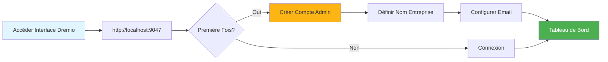
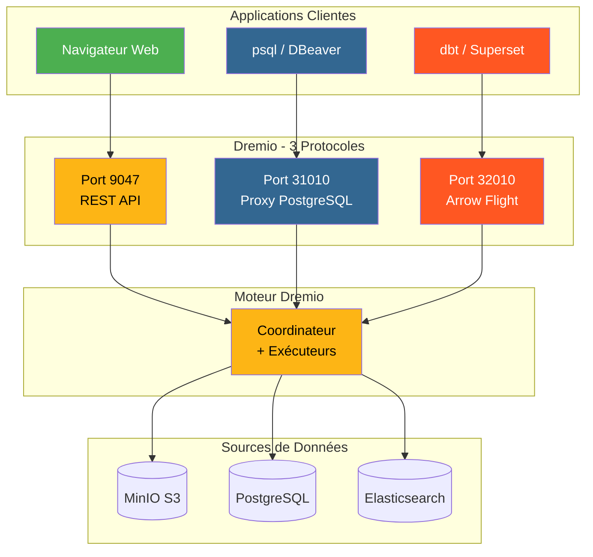
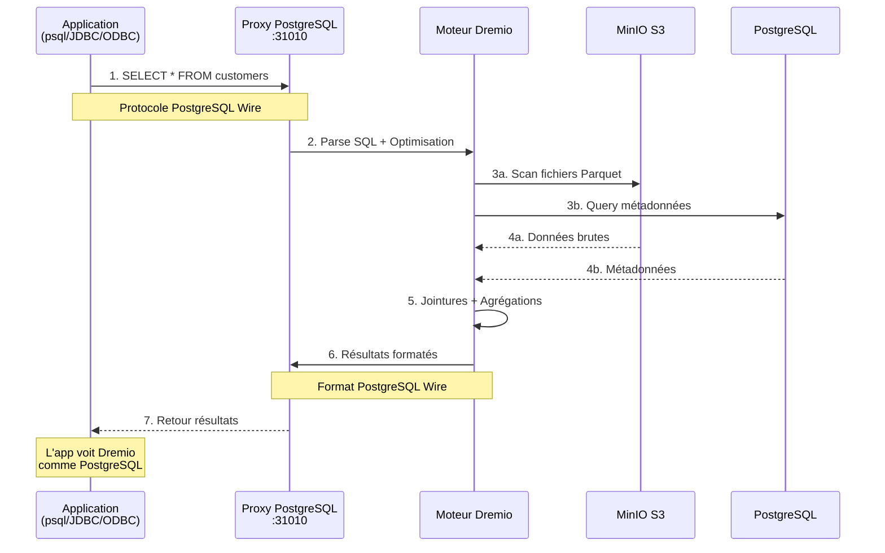
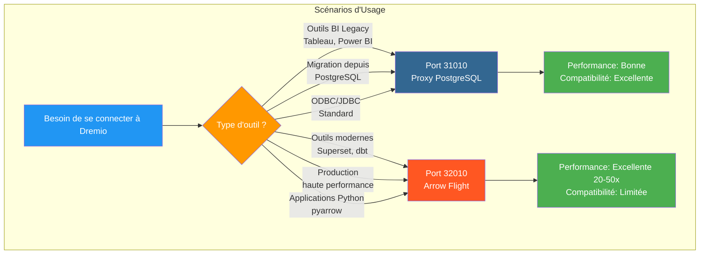
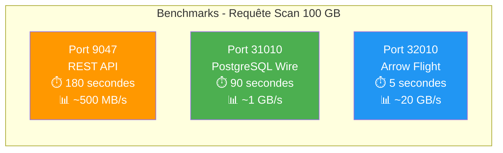
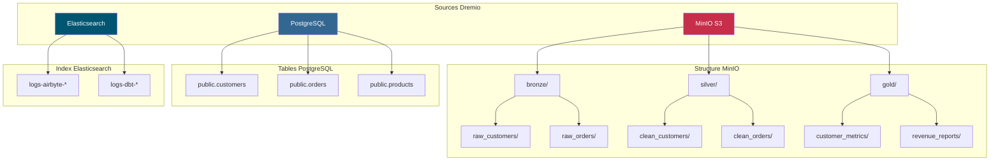
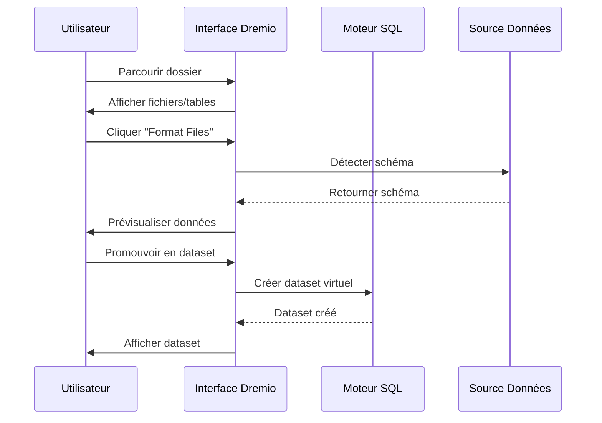
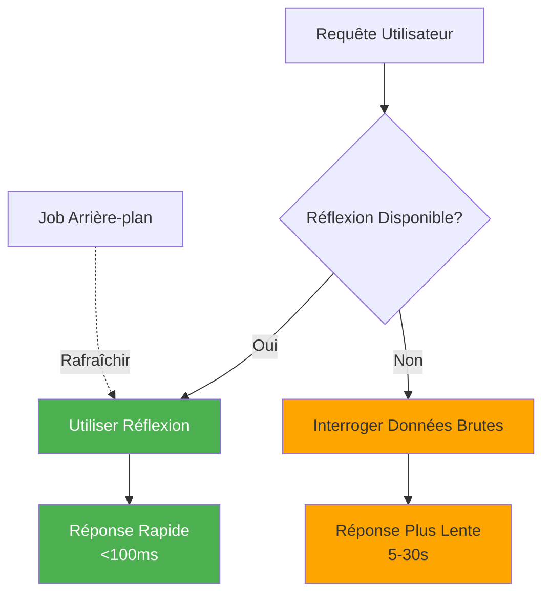

# Guía de configuración de Dremio

**Versión**: 3.2.0  
**Última actualización**: 16 de octubre de 2025  
**Idioma**: Francés

## Tabla de contenido

1. [Resumen](#resumen)
2. [Configuración inicial](#configuración-inicial)
3. [Configuración de fuente de datos](#data-source-configuration)
4. [Conjuntos de datos virtuales](#conjuntos-de-datos-virtuales)
5. [Pensamientos (Consultas de aceleración)](#pensamientos-consultas-de aceleración)
6. [Seguridad y control de acceso](#seguridad-y-control-de-acceso)
7. [Optimización del rendimiento] (#optimización del rendimiento)
8. [Integración con dbt](#integración-con-dbt)
9. [Monitoreo y Mantenimiento](#monitoreo-y-mantenimiento)
10. [Solución de problemas](#solución de problemas)

---

## Descripción general

Dremio es la plataforma de data lakehouse que proporciona una interfaz unificada para consultar datos de múltiples fuentes. Esta guía cubre todo, desde la configuración inicial hasta técnicas de optimización avanzadas.

### ¿Qué es Dremio?

Dremio combina la flexibilidad de un lago de datos con el rendimiento de un almacén de datos:

- **Virtualización de datos**: Consulta datos sin moverlos ni copiarlos
- **Aceleración de consultas**: almacenamiento en caché automático con reflejos
- **Análisis de autoservicio**: los usuarios empresariales pueden explorar directamente los datos
- **Estándar SQL**: sin lenguaje de consulta propietario
- **Apache Arrow**: formato en columnas de alto rendimiento

### Características clave

| Característica | Descripción | Beneficio |
|----------------|---------|---------|
| **Pensamientos** | Aceleración inteligente de consultas | Consultas entre 10 y 100 veces más rápidas |
| **Virtualización de datos** | Vista unificada de las fuentes | Sin duplicación de datos |
| **Vuelo de flecha** | Transferencia de datos de alta velocidad | 20-50 veces más rápido que ODBC/JDBC |
| **Capa semántica** | Nombres de campos orientados a los negocios | Análisis de autoservicio |
| **Git para datos** | Control de versiones del conjunto de datos | Colaboración y retroceso |

---

## Configuración inicial

### Requisitos previos

Antes de comenzar, asegúrese de tener:
- Contenedor Dremio ejecutándose (consulte [Guía de instalación](../getting-started/installation.md))
- Acceso a fuentes de datos (MinIO, PostgreSQL, etc.)
- Credenciales de administrador

### Primera conexión



#### Paso 1: Acceda a la interfaz de Dremio

Abra su navegador y navegue hasta:
```
http://localhost:9047
```

#### Paso 2: crear una cuenta de administrador

En el primer inicio, se le pedirá que cree una cuenta de administrador:

```
Nom d'utilisateur: admin
Prénom: Admin
Nom: Utilisateur
Email: admin@example.com
Mot de passe: [mot de passe sécurisé]
```

**Nota de seguridad**: Utilice una contraseña segura con al menos 12 caracteres, incluidas mayúsculas, minúsculas, números y caracteres especiales.

#### Paso 3: Configuración inicial

```json
{
  "companyName": "Votre Organisation",
  "supportEmail": "support@talentys.eu",
  "supportKey": "votre-clé-support-si-entreprise"
}
```

### Archivos de configuración

La configuración de Dremio se gestiona a través de `dremio.conf`:

```conf
# dremio.conf

paths: {
  local: "/opt/dremio/data"
  dist: "dremioS3:///dremio-data"
}

services: {
  coordinator.enabled: true
  coordinator.master.enabled: true
  
  executor.enabled: true
  
  # Paramètres mémoire
  coordinator.master.heap_memory_mb: 4096
  executor.heap_memory_mb: 8192
}

# Configuration réseau
services.coordinator.web.port: 9047
services.coordinator.client.port: 31010
services.coordinator.flight.port: 32010

# Ajustement performance
store.plugin.max_metadata_leaf_columns: 800
planner.enable_broadcast_join: true
planner.slice_target: 100000
```

### Variables de entorno

```bash
# Section environment de docker-compose.yml
environment:
  - DREMIO_JAVA_SERVER_EXTRA_OPTS=-Xms2g -Xmx4g
  - DREMIO_JAVA_FLIGHT_EXTRA_OPTS=-Xms1g -Xmx2g
  - DREMIO_MAX_MEMORY_SIZE_MB=8192
  - DREMIO_HOME=/opt/dremio
```

### Conexión a través del proxy PostgreSQL

Dremio expone una interfaz compatible con PostgreSQL en el puerto 31010, lo que permite que las herramientas compatibles con PostgreSQL se conecten sin modificaciones.

#### Arquitectura de conexiones Dremio



#### Flujo de consultas a través del proxy PostgreSQL



#### Configuración de proxy

El proxy PostgreSQL se habilita automáticamente en `dremio.conf`:

```conf
# Configuration du proxy PostgreSQL (ODBC/JDBC)
services.coordinator.client.port: 31010
```

#### Conexión con psql

```bash
# Connexion directe avec psql
psql -h localhost -p 31010 -U admin -d datalake

# Exemple de requête
psql -h localhost -p 31010 -U admin -d datalake -c "SELECT * FROM MinIO.datalake.customers LIMIT 10;"
```

#### Conexión con DBeaver / pgAdmin

Configuración de conexión:

```yaml
Type: PostgreSQL
Host: localhost
Port: 31010
Database: datalake
Username: admin
Password: <votre-mot-de-passe>
SSL: Désactivé (en développement)
```

#### Canales de conexión

**JDBC:**
```java
String url = "jdbc:postgresql://localhost:31010/datalake";
Properties props = new Properties();
props.setProperty("user", "admin");
props.setProperty("password", "votre-mot-de-passe");
Connection conn = DriverManager.getConnection(url, props);
```

**ODBC (DSN):**
```ini
[Dremio via PostgreSQL]
Driver=PostgreSQL Unicode
Server=localhost
Port=31010
Database=datalake
Username=admin
Password=<votre-mot-de-passe>
SSLMode=disable
```

**Python (psycopg2):**
```python
import psycopg2

conn = psycopg2.connect(
    host="localhost",
    port=31010,
    database="datalake",
    user="admin",
    password="votre-mot-de-passe"
)

cursor = conn.cursor()
cursor.execute("SELECT * FROM MinIO.datalake.customers LIMIT 10")
rows = cursor.fetchall()
```

#### Cuándo utilizar el proxy PostgreSQL



| Escenario | Utilice el proxy PostgreSQL | Utilice el vuelo de flecha |
|---------|----------------------|----------------------|
| **Herramientas heredadas de BI** (no son compatibles con Arrow Flight) | ✅ Sí | ❌ No |
| **Migración desde PostgreSQL** (código JDBC/ODBC existente) | ✅ Sí | ❌ No |
| **Producción de alto rendimiento** | ❌ No | ✅ Sí (20-50 veces más rápido) |
| **Superconjunto, dbt, herramientas modernas** | ❌ No | ✅ Sí |
| **Desarrollo/prueba rápido** | ✅ Sí (familiarizado) | ⚠️ Ambos están bien |

#### Comparación de rendimiento de los 3 puertos



**Recomendación**: Utilice el proxy PostgreSQL (puerto 31010) para **compatibilidad** y Arrow Flight (puerto 32010) para **rendimiento de producción**.

---

## Configurar fuentes de datos

### Agregar fuente MinIO S3

MinIO es su principal almacenamiento de lago de datos.

#### Paso 1: Navegar a Fuentes

```
Interface Dremio → Datasets → Add Source → Object Storage → Amazon S3
```

#### Paso 2: Configurar la conexión S3

```json
{
  "name": "MinIO",
  "config": {
    "credentialType": "ACCESS_KEY",
    "accessKey": "minioadmin",
    "accessSecret": "minioadmin",
    "secure": false,
    "externalBucketList": [
      "datalake"
    ],
    "enableAsync": true,
    "compatibilityMode": true,
    "rootPath": "/",
    "defaultCtasFormat": "PARQUET",
    "propertyList": [
      {
        "name": "fs.s3a.path.style.access",
        "value": "true"
      },
      {
        "name": "fs.s3a.endpoint",
        "value": "minio:9000"
      },
      {
        "name": "dremio.s3.compat",
        "value": "true"
      }
    ]
  }
}
```

#### Paso 3: Probar la conexión

```sql
-- Requête test pour vérifier connexion MinIO
SELECT * FROM MinIO.datalake.bronze.customers LIMIT 10;
```

**Resultado esperado**:
```
customer_id | name           | email
------------|----------------|------------------
1           | John Doe       | john@example.com
2           | Jane Smith     | jane@example.com
...
```

### Agregar fuente PostgreSQL

#### Configuración

```
Interface Dremio → Datasets → Add Source → Relational → PostgreSQL
```

```json
{
  "name": "PostgreSQL",
  "config": {
    "hostname": "postgres",
    "port": "5432",
    "databaseName": "datawarehouse",
    "username": "postgres",
    "password": "postgres",
    "authenticationType": "MASTER",
    "fetchSize": 2000,
    "encryptionValidationMode": "CERTIFICATE_AND_HOSTNAME_VALIDATION"
  }
}
```

### Agregar fuente de Elasticsearch

```json
{
  "name": "Elasticsearch",
  "config": {
    "hostList": [
      {"hostname": "elasticsearch", "port": 9200}
    ],
    "authenticationType": "ANONYMOUS",
    "scrollSize": 4000,
    "scrollTimeout": 60000,
    "scriptsEnabled": true,
    "showHiddenIndices": false,
    "showIdColumn": false
  }
}
```

### Organización de fuentes



---

## Conjuntos de datos virtuales

Los conjuntos de datos virtuales le permiten crear vistas transformadas y reutilizables de sus datos.

### Crear conjuntos de datos virtuales

#### Desde el editor SQL

```sql
-- Créer dataset jointif
SELECT 
    c.customer_id,
    c.name,
    c.email,
    c.state,
    COUNT(o.order_id) as total_orders,
    SUM(o.amount) as lifetime_value
FROM MinIO.datalake.silver.customers c
LEFT JOIN MinIO.datalake.silver.orders o
    ON c.customer_id = o.customer_id
GROUP BY c.customer_id, c.name, c.email, c.state;

-- Sauvegarder comme dataset virtuel: "customer_summary"
```

**Guardar ubicación**:
```
@username → customer_summary
```

#### Desde la interfaz



**Pasos**:
1. Navegue a la fuente MinIO
2. Vaya a `datalake/bronze/customers/`
3. Haga clic en el botón "Formatear archivos"
4. Examinar el patrón detectado
5. Haga clic en "Guardar" para promocionar al conjunto de datos.

### Organización de conjuntos de datos

Cree una estructura lógica con espacios y carpetas:

```
Dremio
├── @admin (Espace Personnel)
│   └── dev (Dossier)
│       ├── test_customers
│       └── test_orders
├── Production (Espace Partagé)
│   ├── Dimensions (Dossier)
│   │   ├── dim_customers
│   │   ├── dim_products
│   │   └── dim_dates
│   └── Facts (Dossier)
│       ├── fct_orders
│       ├── fct_revenue
│       └── fct_customer_lifetime_value
└── Analytics (Espace Partagé)
    ├── customer_metrics
    ├── sales_dashboard_data
    └── marketing_attribution
```

### Capa semántica

Agregue nombres y descripciones orientados al negocio:

```sql
-- Noms colonnes techniques originaux
SELECT
    cust_id,
    cust_nm,
    cust_em,
    crt_dt
FROM raw.customers;

-- Créer dataset virtuel avec noms sémantiques
SELECT
    cust_id AS "ID Client",
    cust_nm AS "Nom Client",
    cust_em AS "Adresse Email",
    crt_dt AS "Date Inscription"
FROM raw.customers;
```

**Agregar descripciones**:
```
Interface → Dataset → Colonne → Éditer Description

ID Client: Identifiant unique pour chaque client
Nom Client: Nom complet du client
Adresse Email: Email principal pour communication
Date Inscription: Date inscription client sur plateforme
```

---

## Reflexiones (Consultas de Aceleración)

Los reflejos son el mecanismo de almacenamiento en caché inteligente de Dremio que mejora significativamente el rendimiento de las consultas.

### Tipos de reflejos

#### 1. Reflejos crudos

Almacene un subconjunto de columnas para una recuperación rápida:

```sql
-- Créer réflexion brute
CREATE REFLECTION raw_customer_base
ON Production.Dimensions.dim_customers
USING DISPLAY (
    customer_id,
    name,
    email,
    state,
    registration_date
);
```

**Caso de uso**:
- Paneles de control que consultan columnas específicas
- Informes con subconjuntos de columnas.
- Consultas exploratorias

#### 2. Reflexiones de agregación

Calcule previamente las agregaciones para obtener resultados instantáneos:

```sql
-- Créer réflexion agrégation
CREATE REFLECTION agg_daily_revenue
ON Production.Facts.fct_orders
USING 
  DIMENSIONS (order_date, product_id, region)
  MEASURES (
    SUM(amount),
    COUNT(*),
    AVG(amount),
    MIN(amount),
    MAX(amount)
  );
```

**Caso de uso**:
- Paneles ejecutivos
- Informes resumidos
- Análisis de tendencias

### Reflexión de configuración



#### Política de refrigerios

```
Interface → Dataset → Settings → Reflections → Refresh Policy
```

**Opciones**:
- **Nunca actualizar**: datos estáticos (por ejemplo, archivos históricos)
- **Actualizar cada [1 hora]**: actualizaciones periódicas
- **Actualizar cuando cambia el conjunto de datos**: sincronización en tiempo real

```json
{
  "refreshPolicy": {
    "method": "PERIOD",
    "refreshPeriod": 3600000,  // 1 heure en millisecondes
    "gracePeriod": 10800000    // 3 heures
  }
}
```

#### Política de vencimiento

```json
{
  "expirationPolicy": {
    "method": "NEVER",
    // ou
    "method": "AFTER_PERIOD",
    "expirationPeriod": 604800000  // 7 jours
  }
}
```

### Buenas prácticas para las reflexiones

#### 1. Comience con consultas de alto valor

Identifique consultas lentas del historial:

```sql
-- Interroger historique jobs pour trouver requêtes lentes
SELECT 
    query_text,
    execution_time_ms,
    dataset_path
FROM sys.jobs
WHERE execution_time_ms > 5000  -- Plus lent que 5 secondes
ORDER BY execution_time_ms DESC
LIMIT 100;
```

#### 2. Cree reflejos específicos

```sql
-- Mauvais: Réflexion avec trop de dimensions
CREATE REFLECTION too_broad
USING DIMENSIONS (col1, col2, col3, col4, col5, col6)
MEASURES (SUM(amount));

-- Bon: Réflexion ciblée pour cas d'usage spécifique
CREATE REFLECTION targeted
USING DIMENSIONS (order_date, product_category)
MEASURES (SUM(revenue), COUNT(DISTINCT customer_id));
```

#### 3. Monitorear la reflexión sobre la cobertura

```sql
-- Vérifier quelles requêtes sont accélérées
SELECT 
    query_text,
    acceleration_profile.accelerated,
    acceleration_profile.reflection_ids
FROM sys.jobs
WHERE start_time > CURRENT_DATE - INTERVAL '7' DAY;
```

### Pensamientos sobre el impacto en el rendimiento

| Tamaño del conjunto de datos | Escriba consulta | Sin reflexión | Con reflexión | Aceleración |
|----------------|----------------------|----------------|----------------|-------------|
| 1 millón de líneas | SELECCIONAR Sencillo | 500 ms | 50 ms | 10x |
| 10 millones de líneas | Agregación | 15 | 200 ms | 75x |
| 100 millones de líneas | Complejo ÚNETE | 2 minutos | 1s | 120x |
| 1B líneas | Agrupar por | 10 minutos | 5s | 120x |

---

## Seguridad y Control de Acceso

### Gestión de usuarios

#### Crear usuarios

```
Interface → Account Settings → Users → Add User
```

```json
{
  "username": "analyst_user",
  "firstName": "Data",
  "lastName": "Analyst",
  "email": "analyst@example.com",
  "password": "secure_password"
}
```

#### Roles de usuario

| Rol | Permisos | Casos de uso |
|------|-------------|-------------|
| **Administrador** | Acceso completo | Administración del sistema |
| **Usuario** | Consultar, crear conjuntos de datos personales | Analistas, científicos de datos |
| **Usuario limitado** | Solo consulta, no creación de conjuntos de datos | Usuarios empresariales, espectadores |

### Permisos de espacio

```
Interface → Space → Settings → Privileges
```

**Tipos de permiso**:
- **Ver**: puede ver y consultar conjuntos de datos
- **Modificar**: puede editar definiciones de conjuntos de datos
- **Administrar subvenciones**: puede administrar permisos
- **Propietario**: control total

**Ejemplo**:
```
Espace: Production
├── Équipe Analytics → View, Modify
├── Data Engineers → Owner
└── Exécutifs → View
```

### Seguridad a nivel de línea

Implementar filtrado a nivel de fila:

```sql
-- Créer vue avec filtre niveau ligne
CREATE VDS customer_data_filtered AS
SELECT *
FROM Production.Dimensions.dim_customers
WHERE 
  CASE 
    WHEN CURRENT_USER = 'admin' THEN TRUE
    WHEN region = (
      SELECT home_region 
      FROM users 
      WHERE username = CURRENT_USER
    ) THEN TRUE
    ELSE FALSE
  END;
```

### Columna de nivel de seguridad

Ocultar columnas confidenciales:

```sql
-- Masquer données sensibles pour utilisateurs non-admin
CREATE VDS customer_data_masked AS
SELECT
    customer_id,
    name,
    CASE 
      WHEN CURRENT_USER IN ('admin', 'data_engineer')
      THEN email
      ELSE CONCAT(SUBSTRING(email, 1, 3), '***@***.com')
    END AS email,
    state
FROM Production.Dimensions.dim_customers;
```

### Integración de OAuth

```conf
# dremio.conf
services.coordinator.web.auth.type: "oauth"
services.coordinator.web.auth.oauth.providerId: "okta"
services.coordinator.web.auth.oauth.clientId: "your-client-id"
services.coordinator.web.auth.oauth.clientSecret: "your-client-secret"
services.coordinator.web.auth.oauth.authorizeUrl: "https://your-domain.okta.com/oauth2/v1/authorize"
services.coordinator.web.auth.oauth.tokenUrl: "https://your-domain.okta.com/oauth2/v1/token"
```

---

## Optimización del rendimiento

### Técnicas de optimización de consultas

#### 1. Poda de partición

```sql
-- Mauvais: Scanne toutes les données
SELECT * FROM orders
WHERE amount > 100;

-- Bon: Élague partitions
SELECT * FROM orders
WHERE order_date >= '2025-10-01'
  AND order_date < '2025-11-01'
  AND amount > 100;
```

#### 2. Poda de columnas

```sql
-- Mauvais: Lit toutes les colonnes
SELECT * FROM large_table LIMIT 100;

-- Bon: Lit uniquement colonnes nécessaires
SELECT customer_id, name, email 
FROM large_table 
LIMIT 100;
```

#### 3. Empuje de predicado

```sql
-- Filtres poussés vers couche stockage
SELECT c.name, o.amount
FROM customers c
JOIN orders o ON c.customer_id = o.customer_id
WHERE o.order_date >= CURRENT_DATE - INTERVAL '30' DAY;
-- Filtre appliqué avant jointure
```

#### 4. Únase a la optimización

```sql
-- Utiliser broadcast join pour petites dimensions
SELECT /*+ BROADCAST(d) */
    f.order_id,
    d.product_name,
    f.amount
FROM facts.orders f
JOIN dimensions.products d
    ON f.product_id = d.product_id;
```

### Configuración de memoria

```conf
# dremio.conf

# Augmenter mémoire pour grandes requêtes
services.executor.heap_memory_mb: 32768

# Configurer spill to disk
spill.directory: "/opt/dremio/spill"
spill.enable: true

# Limites mémoire requête
planner.memory.max_query_memory_per_node: 10737418240  # 10GB
planner.memory.query_max_cost: 1000000000
```

### Tamaño del clúster

| Tipo de carga | Coordinador | Ejecutores | Grupo total |
|-------------|---------|------------|---------------|
| **Pequeño** | 4 CPU, 16 GB | 2x (8 CPU, 32 GB) | 20 CPU, 80 GB |
| **Medio** | 8 CPU, 32 GB | 4x (16 CPU, 64 GB) | 72 CPU, 288 GB |
| **Grande** | 16 CPU, 64 GB | 8x (32 CPU, 128 GB) | 272 procesadores, 1088 GB |

### Monitoreo del desempeño

```sql
-- Analyser performance requête
SELECT 
    query_id,
    query_text,
    start_time,
    execution_time_ms / 1000.0 AS execution_time_seconds,
    planner_estimated_cost,
    rows_returned,
    acceleration_profile.accelerated
FROM sys.jobs
WHERE start_time > CURRENT_DATE - INTERVAL '1' DAY
ORDER BY execution_time_ms DESC
LIMIT 20;
```

---

## Integración con dbt

### Dremio como objetivo dbt

Configurar `profiles.yml`:

```yaml
# profiles.yml
dremio_project:
  target: dev
  outputs:
    dev:
      type: dremio
      threads: 4
      host: localhost
      port: 9047
      username: admin
      password: "{{ env_var('DREMIO_PASSWORD') }}"
      use_ssl: false
      space: "@admin"
      
    prod:
      type: dremio
      threads: 8
      host: dremio.example.com
      port: 443
      username: dbt_service_account
      password: "{{ env_var('DREMIO_PASSWORD') }}"
      use_ssl: true
      space: "Production"
```

### modelos dbt en Dremio

```sql
-- models/staging/stg_customers.sql
{{
    config(
        materialized='view',
        alias='stg_customers'
    )
}}

SELECT
    customer_id,
    TRIM(UPPER(name)) AS customer_name,
    LOWER(email) AS email,
    state,
    created_at
FROM {{ source('minio', 'raw_customers') }}
WHERE customer_id IS NOT NULL
```

### Explotar reflejos en dbt

```sql
-- models/marts/fct_customer_metrics.sql
{{
    config(
        materialized='table',
        post_hook=[
            "ALTER VDS {{ this }} ENABLE RAW REFLECTION",
            "ALTER VDS {{ this }} ENABLE AGGREGATION REFLECTION 
             USING DIMENSIONS (customer_id, registration_month) 
             MEASURES (SUM(lifetime_value), COUNT(*))"
        ]
    )
}}

SELECT
    customer_id,
    DATE_TRUNC('month', registration_date) AS registration_month,
    COUNT(DISTINCT order_id) AS total_orders,
    SUM(order_amount) AS lifetime_value
FROM {{ ref('int_customer_orders') }}
GROUP BY customer_id, DATE_TRUNC('month', registration_date)
```

---

## Monitoreo y Mantenimiento

### Métricas clave para monitorear

```yaml
metrics:
  - name: Performance Requête
    query: "SELECT AVG(execution_time_ms) FROM sys.jobs WHERE start_time > NOW() - INTERVAL '1' HOUR"
    threshold: 5000  # Alerte si moyenne > 5 secondes
    
  - name: Couverture Réflexion
    query: "SELECT COUNT(*) FILTER (WHERE accelerated = true) * 100.0 / COUNT(*) FROM sys.jobs WHERE start_time > NOW() - INTERVAL '1' DAY"
    threshold: 80  # Alerte si couverture < 80%
    
  - name: Requêtes Échouées
    query: "SELECT COUNT(*) FROM sys.jobs WHERE query_state = 'FAILED' AND start_time > NOW() - INTERVAL '1' HOUR"
    threshold: 10  # Alerte si > 10 échecs par heure
```

### Tareas de mantenimiento

#### 1. Actualizar pensamientos

```sql
-- Rafraîchir manuellement réflexion
ALTER REFLECTION reflection_id REFRESH;

-- Reconstruire toutes réflexions pour dataset
ALTER VDS Production.Facts.fct_orders 
REFRESH ALL REFLECTIONS;
```

#### 2. Limpiar datos antiguos

```sql
-- Nettoyer historique requêtes
DELETE FROM sys.jobs
WHERE start_time < CURRENT_DATE - INTERVAL '90' DAY;

-- Compacter métadonnées (Enterprise uniquement)
VACUUM CATALOG;
```

#### 3. Actualizar estadísticas

```sql
-- Rafraîchir statistiques table
ANALYZE TABLE MinIO.datalake.silver.customers;

-- Mettre à jour métadonnées dataset
REFRESH DATASET MinIO.datalake.silver.customers;
```

---

## Solución de problemas

### Problemas comunes

#### Problema 1: Rendimiento de consulta lento

**Síntomas**: las consultas tardan minutos en lugar de segundos

**Diagnóstico**:
```sql
-- Vérifier profil requête
SELECT * FROM sys.jobs WHERE job_id = 'your-job-id';

-- Vérifier si réflexion utilisée
SELECT acceleration_profile FROM sys.jobs WHERE job_id = 'your-job-id';
```

**Soluciones**:
1. Crea pensamientos apropiados
2. Agregar filtros de poda de particiones
3. Aumentar la memoria del ejecutor.
4. Habilitar cola de cola

#### Problema 2: La reflexión no construye

**Síntomas**: Reflejo atascado en estado “REFRESCANTE”

**Diagnóstico**:
```sql
-- Vérifier statut réflexion
SELECT * FROM sys.reflections WHERE status != 'ACTIVE';

-- Vérifier erreurs réflexion
SELECT * FROM sys.reflection_dependencies;
```

**Soluciones**:
1. Verifique los datos de origen para ver si hay cambios en el esquema.
2. Verifique que haya suficiente espacio en disco
3. Aumentar el tiempo de espera de la reflexión de la construcción.
4. Deshabilite y vuelva a habilitar la reflexión.

#### Problema 3: Tiempo de espera de conexión

**Síntomas**: errores de "tiempo de espera de conexión" al consultar fuentes

**Soluciones**:
```conf
# dremio.conf
store.plugin.keep_alive_ms: 30000
store.plugin.timeout_ms: 120000
```

#### Problema 4: Falta de memoria

**Síntomas**: "OutOfMemoryError" en los registros

**Soluciones**:
```conf
# Augmenter taille heap
services.executor.heap_memory_mb: 65536

# Activer spill to disk
spill.enable: true
spill.directory: "/opt/dremio/spill"
```

### Consultas de diagnóstico

```sql
-- Requêtes actives
SELECT query_id, query_text, start_time, user_name
FROM sys.jobs
WHERE query_state = 'RUNNING';

-- Utilisation ressources par utilisateur
SELECT 
    user_name,
    COUNT(*) as query_count,
    AVG(execution_time_ms) as avg_execution_ms,
    SUM(rows_returned) as total_rows
FROM sys.jobs
WHERE start_time > CURRENT_DATE
GROUP BY user_name;

-- Modèles accès dataset
SELECT 
    dataset_path,
    COUNT(*) as access_count,
    COUNT(DISTINCT user_name) as unique_users
FROM sys.jobs
WHERE start_time > CURRENT_DATE - INTERVAL '7' DAY
GROUP BY dataset_path
ORDER BY access_count DESC
LIMIT 20;
```

---

## Resumen

Esta guía completa cubre:

- **Configuración inicial**: configuración por primera vez, creación de cuenta de administrador, archivos de configuración
- **Fuentes de datos**: Conexión MinIO, PostgreSQL y Elasticsearch
- **Conjuntos de datos virtuales**: Creación de vistas transformadas reutilizables con capa semántica
- **Reflexiones**: reflexiones sin procesar y agregación para una aceleración de consultas de 10 a 100 veces
- **Seguridad**: gestión de usuarios, permisos de espacio, seguridad a nivel de fila/columna
- **Rendimiento**: optimización de consultas, configuración de memoria, tamaño del clúster
- **integración dbt**: utilice Dremio como objetivo dbt con gestión de reflejos
- **Monitoreo**: Métricas clave, tareas de mantenimiento, solicitudes de diagnóstico
- **Solución de problemas**: problemas comunes y soluciones

Puntos clave para recordar:
- Dremio proporciona una interfaz SQL unificada en todas las fuentes de datos
- Pensamientos esenciales para el desempeño de la producción.
- La configuración de seguridad adecuada permite el análisis de autoservicio
- El seguimiento regular garantiza un rendimiento óptimo

**Documentación relacionada:**
- [Componentes de arquitectura](../architecture/components.md)
- [Flujo de datos](../arquitectura/data-flow.md)
- [Guía de desarrollo de dbt] (./dbt-development.md)
- [Integración de Airbyte] (./airbyte-integration.md)

---

**Versión**: 3.2.0  
**Última actualización**: 16 de octubre de 2025