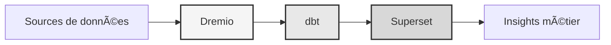

# Plateforme de données

<p align="center">
  <a href="https://talentys.eu" target="_blank">
    
  </a>
  <br/>
  <em>Supported by <a href="https://talentys.eu">Talentys</a> | <a href="https://www.linkedin.com/company/talentysdata">LinkedIn</a> - Data Engineering & Analytics Excellence</em>
</p>


**Solution d'entreprise pour lakehouse de données**

**Langue** : Français (FR)  
**Version**: 3.3.1  
**Dernière mise à jour** : 19 octobre 2025

---

## Vue d'ensemble

Plateforme de données professionnelle combinant Dremio, dbt et Apache Superset pour la transformation de données, l'assurance qualité et l'intelligence d'affaires de niveau entreprise.

Cette plateforme fournit une solution complète pour l'ingénierie de données moderne, comprenant des pipelines de données automatisés, des tests de qualité et des tableaux de bord interactifs.



---

## Fonctionnalités clés

- Architecture de lakehouse de données avec Dremio
- Transformations automatisées avec dbt
- Intelligence d'affaires avec Apache Superset
- Tests complets de qualité des données
- Synchronisation en temps réel via Arrow Flight

---

## Guide de démarrage rapide

### Prérequis

- Docker 20.10 ou supérieur
- Docker Compose 2.0 ou supérieur
- Python 3.11 ou supérieur
- Minimum 8 Go de RAM

### Installation

```bash
# Installer les dépendances
pip install -r requirements.txt

# Démarrer les services
make up

# Vérifier l'installation
make status

# Exécuter les tests de qualité
make dbt-test
```

---

## Architecture

### Composants du système

| Composant | Port | Description |
|-----------|------|-------------|
| Dremio | 9047, 31010, 32010 | Plateforme de lakehouse de données |
| dbt | - | Outil de transformation de données |
| Superset | 8088 | Plateforme d'intelligence d'affaires |
| PostgreSQL | 5432 | Base de données transactionnelle |
| MinIO | 9000, 9001 | Stockage objet (compatible S3) |
| Elasticsearch | 9200 | Moteur de recherche et d'analyse |

Consultez la [documentation d'architecture](architecture/) pour la conception détaillée du système.

---

## Documentation

### Démarrage
- [Guide d'installation](getting-started/)
- [Configuration](getting-started/)
- [Premiers pas](getting-started/)

### Guides utilisateur
- [Ingénierie des données](guides/)
- [Création de dashboards](guides/)
- [Intégration API](guides/)

### Documentation API
- [Référence API REST](api/)
- [Authentification](api/)
- [Exemples de code](api/)

### Documentation d'architecture
- [Conception du système](architecture/)
- [Flux de données](architecture/)
- [Guide de déploiement](architecture/)
- [🎯 Guide visuel des ports Dremio](architecture/dremio-ports-visual.md) ⭐ NOUVEAU

---

## Langues disponibles

| Langue | Code | Documentation |
|--------|------|---------------|
| English | EN | [README.md](../../../README.md) |
| Français | FR | [docs/i18n/fr/](../fr/README.md) |
| Español | ES | [docs/i18n/es/](../es/README.md) |
| Português | PT | [docs/i18n/pt/](../pt/README.md) |
| العربية | AR | [docs/i18n/ar/](../ar/README.md) |
| 中文 | CN | [docs/i18n/cn/](../cn/README.md) |
| 日本語 | JP | [docs/i18n/jp/](../jp/README.md) |
| Русский | RU | [docs/i18n/ru/](../ru/README.md) |

---

## Support

Pour l'assistance technique :
- Documentation : [README principal](../../../README.md)
- Suivi des problèmes : GitHub Issues
- Forum communautaire : GitHub Discussions
- Email : support@example.com

---

**[Retour à la documentation principale](../../../README.md)**

