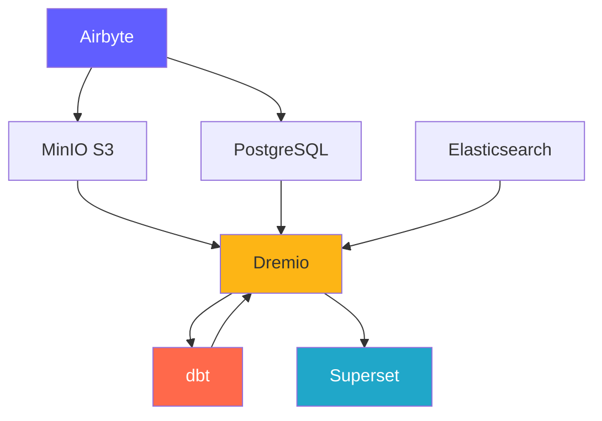
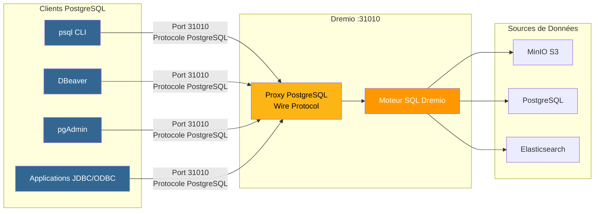
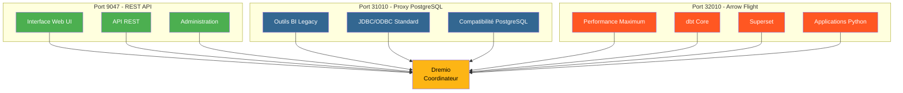
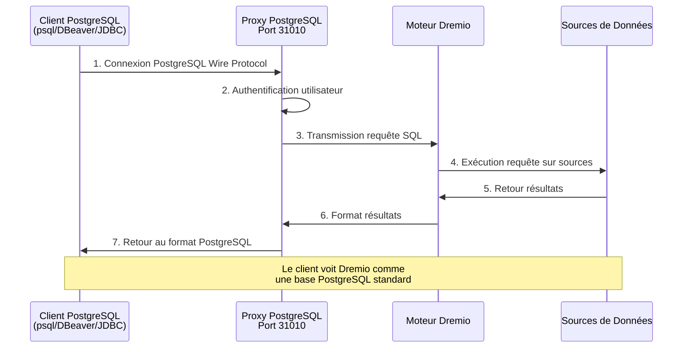
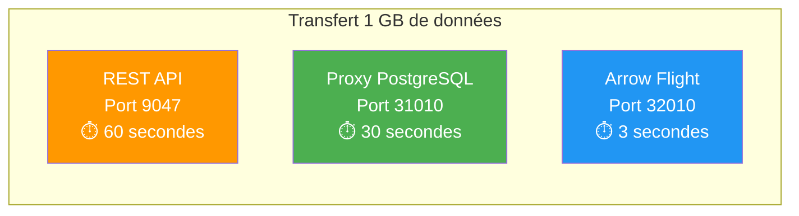

# Composants de la Plateforme

**Version**: 3.2.0  
**Dernière mise à jour**: 2025-10-16  
**Langue**: Français

---

## Vue d'ensemble des Composants

La plateforme de données se compose de 7 composants principaux travaillant ensemble pour fournir une solution complète.



---

## 1. Airbyte - Plateforme d'Intégration de Données

### Vue d'ensemble

Airbyte est un moteur d'intégration de données open source qui consolide les données de multiples sources vers des destinations.

**Version**: 0.50.33  
**Licence**: MIT  
**Site web**: https://airbyte.com

### Fonctionnalités Clés

- **300+ Connecteurs Pré-construits**: Bases de données, APIs, fichiers, applications SaaS
- **Change Data Capture (CDC)**: Réplication données temps réel
- **Connecteurs Personnalisés**: Construire avec Python ou CDK low-code
- **Normalisation**: Transformer JSON en tables relationnelles
- **Synchronisation Incrémentale**: Synchroniser uniquement nouvelles/modifiées données
- **Surveillance**: Suivi intégré statut synchronisation

### Architecture

```yaml
Composants:
  airbyte-webapp:
    Port: 8000
    Objectif: Interface utilisateur web
    
  airbyte-server:
    Port: 8001
    Objectif: Serveur API REST
    
  airbyte-worker:
    Objectif: Exécuter tâches synchronisation
    Scalabilité: Horizontale
    
  airbyte-temporal:
    Port: 7233
    Objectif: Orchestration workflows
    
  airbyte-db:
    Port: 5432
    Objectif: Stockage métadonnées (PostgreSQL)
```

### Cas d'Usage

- **Pipelines ELT**: Workflows Extract-Load-Transform
- **Réplication Base de Données**: Maintenir bases synchronisées
- **Intégration API**: Extraire données d'APIs REST
- **Ingestion Data Lake**: Charger données dans S3/MinIO
- **Migration Cloud**: Déplacer données on-premise vers cloud

### Configuration

```yaml
# Variables d'Environnement
AIRBYTE_VERSION: "0.50.33"
AIRBYTE_HTTP_PORT: 8000
AIRBYTE_API_PORT: 8001
AIRBYTE_WORKSPACE_ROOT: /tmp/airbyte_local

# Limites Ressources
CPU_LIMIT: "2.0"
MEMORY_LIMIT: "2Gi"
```

### Points d'Intégration

- **Sorties vers**: MinIO S3, PostgreSQL, Dremio
- **Orchestration**: Peut être déclenché par Airflow, Prefect
- **Surveillance**: Point de terminaison métriques Prometheus

---

## 2. Dremio - Plateforme Data Lakehouse

### Vue d'ensemble

Dremio fournit une interface SQL unifiée pour toutes les sources de données avec accélération de requêtes.

**Version**: 26.0 OSS  
**Licence**: Apache 2.0  
**Site web**: https://www.dremio.com

### Fonctionnalités Clés

- **Data Lakehouse**: Combiner flexibilité lake avec performance warehouse
- **Réflexions**: Accélération automatique requêtes (jusqu'à 100x plus rapide)
- **Arrow Flight**: Transfert données haute performance
- **Virtualisation Données**: Requêter sans déplacer données
- **Couche Sémantique**: Définitions données conviviales métier
- **Time Travel**: Requêter versions historiques données

### Architecture

```yaml
Composants:
  Coordinateur:
    Port: 9047 (HTTP), 31010 (ODBC), 32010 (Arrow Flight)
    Objectif: Planification requêtes, gestion métadonnées
    Mémoire: 8Go heap + 8Go direct
    
  Exécuteur:
    Objectif: Exécution requêtes
    Mémoire: 4Go heap + 8Go direct
    Scalabilité: Horizontale (ajouter plus d'exécuteurs)
    
  Stockage:
    Type: Distribué (MinIO, S3, HDFS)
    Format: Parquet, Iceberg
```

### Cas d'Usage

- **Analytique Self-Service**: Permettre utilisateurs métier explorer données
- **Data Mesh**: Accès fédéré aux données
- **Accélération Requêtes**: Accélérer requêtes tableaux de bord
- **Catalogue Données**: Découvrir et gouverner données
- **Activation BI**: Alimenter Tableau, Power BI, Superset

### Configuration

```conf
# dremio.conf
paths.local: "/opt/dremio/data"
services.coordinator.enabled: true
services.executor.enabled: true

services.coordinator.web.port: 9047
services.flight.endpoint.port: 32010

services.executor.cache.pct.max: 70
```

### Points d'Intégration

- **Lit depuis**: MinIO S3, PostgreSQL, Elasticsearch
- **Transforme avec**: dbt
- **Sert à**: Superset, Tableau, Power BI

### Proxy PostgreSQL pour Dremio

Dremio peut émuler un serveur PostgreSQL, permettant aux outils compatibles PostgreSQL de se connecter à Dremio comme s'il s'agissait d'une base de données PostgreSQL standard.

#### Architecture du Proxy PostgreSQL



#### Comparaison des 3 Ports Dremio



#### Configuration du Proxy

```yaml
Proxy PostgreSQL:
  Port: 31010 (ODBC/JDBC)
  Protocole: PostgreSQL Wire Protocol
  Compatibilité: Outils compatibles PostgreSQL (psql, pgAdmin, DBeaver)
  
Avantages:
  - Aucune modification du code client
  - Support des pilotes PostgreSQL existants
  - Connexion via JDBC/ODBC standard
  - Compatible avec la plupart des outils BI
```

#### Cas d'Usage du Proxy

1. **Outils BI Legacy**: Connecter des outils ne supportant pas Arrow Flight
2. **Migration Facile**: Remplacer PostgreSQL par Dremio sans modifier le code
3. **Compatibilité ODBC/JDBC**: Utiliser pilotes standard PostgreSQL
4. **Développement**: Tester avec des outils PostgreSQL familiers (psql, pgAdmin)

#### Exemple de Connexion

```bash
# Via psql
psql -h localhost -p 31010 -U admin -d datalake

# Via DBeaver / pgAdmin
Host: localhost
Port: 31010
Database: datalake
Username: admin
Password: <votre-mot-de-passe>

# Chaîne JDBC
jdbc:postgresql://localhost:31010/datalake

# Chaîne ODBC
Driver=PostgreSQL Unicode;
Server=localhost;
Port=31010;
Database=datalake;
Uid=admin;
Pwd=<votre-mot-de-passe>;
```

#### Limitations

- **Performance**: Arrow Flight (port 32010) est 20-50x plus rapide
- **Fonctionnalités**: Certaines fonctions PostgreSQL avancées non supportées
- **Recommandation**: Utiliser Arrow Flight pour production, proxy PostgreSQL pour compatibilité

#### Flux de Connexion via Proxy PostgreSQL



#### Comparaison des Protocoles

| Protocole | Port | Performance | Latence | Cas d'Usage |
|-----------|------|-------------|---------|-------------|
| **REST API** | 9047 | Standard | ~50-100ms | UI Web, administration |
| **ODBC/JDBC (Proxy PostgreSQL)** | 31010 | Bonne | ~20-50ms | Outils BI legacy, compatibilité |
| **Arrow Flight** | 32010 | Excellente (20-50x) | ~5-10ms | Production, Superset, dbt |

#### Performance Comparative



---

## 3. dbt - Outil de Transformation de Données

### Vue d'ensemble

dbt (data build tool) permet aux ingénieurs analytiques de transformer les données en utilisant SQL.

**Version**: 1.10+  
**Licence**: Apache 2.0  
**Site web**: https://www.getdbt.com

### Fonctionnalités Clés

- **Basé SQL**: Écrire transformations en SQL
- **Contrôle de Version**: Intégration Git pour collaboration
- **Tests**: Tests qualité données intégrés
- **Documentation**: Auto-générer dictionnaires données
- **Modularité**: Macros et packages réutilisables
- **Modèles Incrémentaux**: Traiter uniquement nouvelles données

### Architecture

```yaml
Composants:
  dbt Core:
    Objectif: Outil CLI pour exécuter transformations
    Langage: Python
    
  Modèles:
    Objectif: Instructions SQL SELECT
    Types: Vues, Tables, Incrémental, Snapshots
    
  Tests:
    Objectif: Validation qualité données
    Types: Unique, Not Null, Relations, Personnalisés
    
  Macros:
    Objectif: Fonctions SQL réutilisables
    Langage: Jinja2
```

### Cas d'Usage

- **Modélisation Données**: Construire schémas étoile/flocon
- **Qualité Données**: Valider intégrité données
- **Dimensions à Évolution Lente**: Suivre changements historiques
- **Agrégation Données**: Créer tables récapitulatives
- **Documentation Données**: Générer catalogues données

### Configuration

```yaml
# dbt_project.yml
name: 'dremio_dbt'
version: '1.0.0'
profile: 'dremio'

models:
  dremio_dbt:
    staging:
      +materialized: view
      +schema: staging
    marts:
      +materialized: table
      +schema: marts
```

### Points d'Intégration

- **Lit depuis**: Datasets Dremio
- **Écrit vers**: Dremio (via Arrow Flight)
- **Orchestré par**: Airflow, cron, post-sync Airbyte

---

## 4. Apache Superset - Plateforme Business Intelligence

### Vue d'ensemble

Superset est une plateforme moderne d'exploration et visualisation de données.

**Version**: 3.0  
**Licence**: Apache 2.0  
**Site web**: https://superset.apache.org

### Fonctionnalités Clés

- **IDE SQL**: Éditeur SQL avancé avec autocomplétion
- **Visualisations Riches**: 50+ types de graphiques
- **Tableaux de Bord Interactifs**: Drill-down, filtres, filtrage croisé
- **SQL Lab**: Interface requêtes ad-hoc
- **Alertes**: Rapports et alertes planifiés
- **Mise en Cache**: Cache résultats requêtes pour performance

### Architecture

```yaml
Composants:
  Serveur Web:
    Port: 8088
    Objectif: Servir interface web
    Framework: Flask
    
  Workers Celery:
    Objectif: Exécution requêtes asynchrone
    File: Redis/RabbitMQ
    
  Celery Beat:
    Objectif: Tâches planifiées (préchauffage cache, alertes)
    
  Base de Données:
    Objectif: Stocker tableaux de bord, utilisateurs, logs requêtes
    Type: PostgreSQL
```

### Cas d'Usage

- **Tableaux de Bord Exécutifs**: Suivi KPI
- **Analytique Opérationnelle**: Surveillance temps réel
- **BI Self-Service**: Autonomiser analystes
- **Analytique Embarquée**: Intégration iframe dans applications
- **Exploration Données**: Analyse ad-hoc

### Configuration

```python
# superset_config.py
SQLALCHEMY_DATABASE_URI = 'postgresql://...'
SECRET_KEY = '...'

FEATURE_FLAGS = {
    'DASHBOARD_NATIVE_FILTERS': True,
    'DASHBOARD_CROSS_FILTERS': True,
    'ENABLE_TEMPLATE_PROCESSING': True
}

CACHE_CONFIG = {
    'CACHE_TYPE': 'redis',
    'CACHE_DEFAULT_TIMEOUT': 300
}
```

### Points d'Intégration

- **Requêtes**: Dremio (via Arrow Flight)
- **Authentification**: LDAP, OAuth2, Base de données
- **Alertes**: Email, Slack

---

## 5. PostgreSQL - Base de Données Relationnelle

### Vue d'ensemble

PostgreSQL est un système de gestion de base de données relationnelle open source avancé.

**Version**: 16  
**Licence**: Licence PostgreSQL  
**Site web**: https://www.postgresql.org

### Fonctionnalités Clés

- **Conformité ACID**: Transactions fiables
- **Support JSON**: Types JSON/JSONB natifs
- **Recherche Texte Complet**: Capacités recherche intégrées
- **Extensions**: PostGIS, pg_stat_statements, TimescaleDB
- **Réplication**: Réplication streaming, réplication logique
- **Partitionnement**: Partitionnement tables natif

### Architecture

```yaml
Composants:
  Serveur PostgreSQL:
    Port: 5432
    Protocole: Protocole wire PostgreSQL
    
  Bases de Données:
    - dremio_db: Métadonnées Dremio
    - superset_db: Configuration Superset
    - airbyte_db: Métadonnées Airbyte
    
  Connexions:
    Max: 200
    Pooling: PgBouncer (optionnel)
```

### Cas d'Usage

- **Stockage Métadonnées**: Stocker métadonnées système
- **Charges Transactionnelles**: Applications OLTP
- **Tables de Staging**: Traitement données temporaire
- **Stockage Configuration**: Paramètres application
- **Logs Audit**: Suivre changements système

### Configuration

```conf
# postgresql.conf
max_connections = 200
shared_buffers = 256MB
effective_cache_size = 1GB
maintenance_work_mem = 64MB
work_mem = 4MB

# Performance
random_page_cost = 1.1
effective_io_concurrency = 200

# Journalisation
log_statement = 'mod'
log_duration = on
```

### Points d'Intégration

- **Lu par**: Dremio, Superset, Airbyte
- **Écrit par**: Airbyte, dbt, applications
- **Géré par**: Sauvegardes automatisées, réplication

---

## 6. MinIO - Stockage Objet Compatible S3

### Vue d'ensemble

MinIO est un système de stockage objet haute performance compatible S3.

**Version**: Latest  
**Licence**: AGPLv3  
**Site web**: https://min.io

### Fonctionnalités Clés

- **API S3**: 100% compatible avec Amazon S3
- **Haute Performance**: Débit multi-Go/s
- **Erasure Coding**: Durabilité et disponibilité données
- **Versioning**: Contrôle version objet
- **Chiffrement**: Côté serveur et côté client
- **Multi-Cloud**: Déployer partout

### Architecture

```yaml
Composants:
  Serveur MinIO:
    Port: 9000 (API S3), 9001 (Console)
    Mode: Nœud unique ou distribué
    
  Stockage:
    Format: Erasure coded ou brut
    Redondance: Configurable (ex: 4+2)
    
  Buckets:
    - datalake: Stockage données principal
    - raw-data: Ingestion Airbyte
    - processed-data: Sorties dbt
    - backups: Sauvegardes système
```

### Cas d'Usage

- **Data Lake**: Stocker données brutes et traitées
- **Stockage Objet**: Fichiers, images, vidéos
- **Stockage Sauvegarde**: Sauvegardes base de données et système
- **Archive**: Rétention données long terme
- **Staging Données**: Stockage traitement temporaire

### Configuration

```yaml
# Variables d'Environnement
MINIO_ROOT_USER: minioadmin
MINIO_ROOT_PASSWORD: minioadmin123
MINIO_VOLUMES: /data

# Politiques Buckets
- datalake: Lecture-écriture pour plateforme données
- raw-data: Écriture par Airbyte, lecture par Dremio
- processed-data: Écriture par dbt, lecture tous
```

### Points d'Intégration

- **Écrit par**: Airbyte, dbt, applications
- **Lu par**: Dremio, data scientists
- **Géré par**: mc (Client MinIO), s3cmd

---

## 7. Elasticsearch - Moteur de Recherche et Analytique

### Vue d'ensemble

Elasticsearch est un moteur de recherche et analytique distribué construit sur Apache Lucene.

**Version**: 8.15  
**Licence**: Elastic License 2.0  
**Site web**: https://www.elastic.co

### Fonctionnalités Clés

- **Recherche Texte Complet**: Capacités recherche avancées
- **Indexation Temps Réel**: Disponibilité données quasi temps réel
- **Distribué**: Scalabilité horizontale
- **Agrégations**: Analytique complexe
- **API RESTful**: API HTTP simple
- **Machine Learning**: Détection anomalies

### Architecture

```yaml
Composants:
  Nœud Elasticsearch:
    Port: 9200 (HTTP), 9300 (Transport)
    Rôles: Master, Data, Ingest, ML
    
  Index:
    Objectif: Stocker documents recherchables
    Shards: Distribués entre nœuds
    Répliques: Pour haute disponibilité
    
  Cycle de Vie Index:
    Hot: Données récentes (SSD)
    Warm: Données anciennes (HDD)
    Cold: Archive (S3)
```

### Cas d'Usage

- **Analytique Logs**: Journalisation centralisée (pile ELK)
- **Recherche Application**: Catalogues produits, recherche site
- **Analytique Sécurité**: Cas d'usage SIEM
- **Observabilité**: Métriques et traces
- **Analytique Texte**: NLP et analyse sentiment

### Configuration

```yaml
# elasticsearch.yml
cluster.name: "dremio-search-cluster"
node.name: "node-1"
network.host: 0.0.0.0
http.port: 9200

# Sécurité
xpack.security.enabled: true
xpack.security.transport.ssl.enabled: false

# Mémoire
bootstrap.memory_lock: true
```

### Points d'Intégration

- **Indexé par**: Logstash, Filebeat
- **Requêté par**: Dremio, Kibana
- **Surveillé par**: Surveillance Elasticsearch

---

## Comparaison des Composants

| Composant | Type | Usage Principal | Scalabilité | État |
|-----------|------|-----------------|-------------|------|
| **Airbyte** | Intégration | Ingestion données | Horizontale (workers) | Sans état |
| **Dremio** | Moteur Requête | Accès données | Horizontale (exécuteurs) | Sans état |
| **dbt** | Transformation | Modélisation données | Verticale (cœurs) | Sans état |
| **Superset** | Plateforme BI | Visualisation | Horizontale (web) | Sans état |
| **PostgreSQL** | Base Données | Stockage métadonnées | Verticale (+ réplication) | Avec état |
| **MinIO** | Stockage Objet | Data lake | Horizontale (distribué) | Avec état |
| **Elasticsearch** | Moteur Recherche | Recherche texte complet | Horizontale (cluster) | Avec état |

---

## Exigences en Ressources

### Configuration Minimale (Développement)

```yaml
Total: 8 Go RAM, 4 CPUs, 50 Go Disque

Allocation:
  Airbyte: 1 Go RAM, 0.5 CPU
  Dremio: 2 Go RAM, 1 CPU
  Superset: 1 Go RAM, 0.5 CPU
  PostgreSQL: 1 Go RAM, 0.5 CPU
  MinIO: 1 Go RAM, 0.5 CPU
  Elasticsearch: 2 Go RAM, 1 CPU
```

### Configuration Recommandée (Production)

```yaml
Total: 64 Go RAM, 16 CPUs, 500 Go SSD

Allocation:
  Airbyte: 4 Go RAM, 2 CPUs
  Dremio: 16 Go RAM, 4 CPUs
  Superset: 8 Go RAM, 2 CPUs
  PostgreSQL: 8 Go RAM, 2 CPUs
  MinIO: 16 Go RAM, 2 CPUs
  Elasticsearch: 12 Go RAM, 4 CPUs
```

---

## Matrice de Compatibilité des Versions

| Composant | Version | Compatible Avec |
|-----------|---------|-----------------|
| Airbyte | 0.50+ | Toutes destinations |
| Dremio | 26.0 | dbt 1.8+, clients Arrow Flight |
| dbt | 1.10+ | Dremio 23.0+ |
| Superset | 3.0+ | Dremio 22.0+, PostgreSQL 12+ |
| PostgreSQL | 16 | Tous composants |
| MinIO | Latest | Clients compatibles S3 |
| Elasticsearch | 8.15 | Dremio 26.0+, Logstash 8.x |

---

**Version Guide Composants**: 3.2.0  
**Dernière Mise à Jour**: 2025-10-16  
**Maintenu Par**: Équipe Plateforme de Données
