# Architecture du Flux de Données

**Version**: 3.2.0  
**Dernière Mise à Jour**: 16 octobre 2025  
**Langue**: Français

## Table des Matières

1. [Vue d'ensemble](#vue-densemble)
2. [Flux de Données de Bout en Bout](#flux-de-données-de-bout-en-bout)
3. [Couche d'Ingestion](#couche-dingestion)
4. [Couche de Stockage](#couche-de-stockage)
5. [Couche de Traitement](#couche-de-traitement)
6. [Couche de Présentation](#couche-de-présentation)
7. [Modèles de Flux de Données](#modèles-de-flux-de-données)
8. [Considérations de Performance](#considérations-de-performance)
9. [Surveillance du Flux de Données](#surveillance-du-flux-de-données)
10. [Bonnes Pratiques](#bonnes-pratiques)

---

## Vue d'ensemble

Ce document détaille l'architecture complète du flux de données de la plateforme, depuis l'ingestion initiale des données jusqu'à leur consommation finale. La compréhension de ces flux est essentielle pour optimiser les performances, résoudre les problèmes et concevoir des pipelines de données efficaces.

### Principes du Flux de Données

Notre architecture suit ces principes fondamentaux :

1. **Flux Unidirectionnel**: Les données se déplacent dans une direction claire et prévisible
2. **Traitement en Couches**: Chaque couche a une responsabilité spécifique
3. **Composants Découplés**: Les services communiquent via des interfaces bien définies
4. **Idempotence**: Les opérations peuvent être répétées en toute sécurité
5. **Observabilité**: Chaque étape est journalisée et surveillée

### Couches d'Architecture

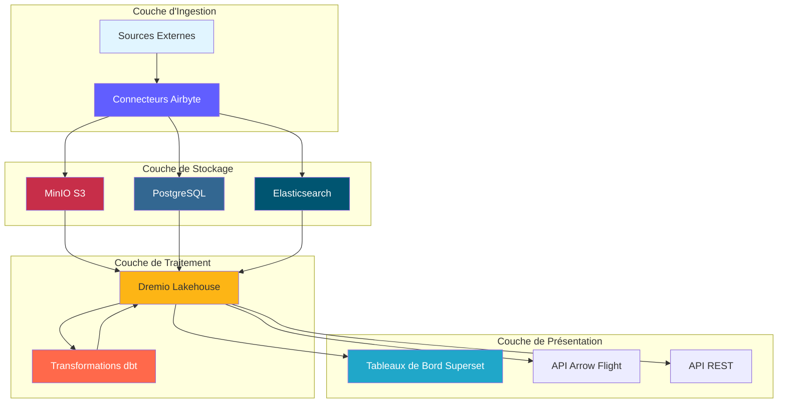

---

## Flux de Données de Bout en Bout

### Séquence Complète du Pipeline

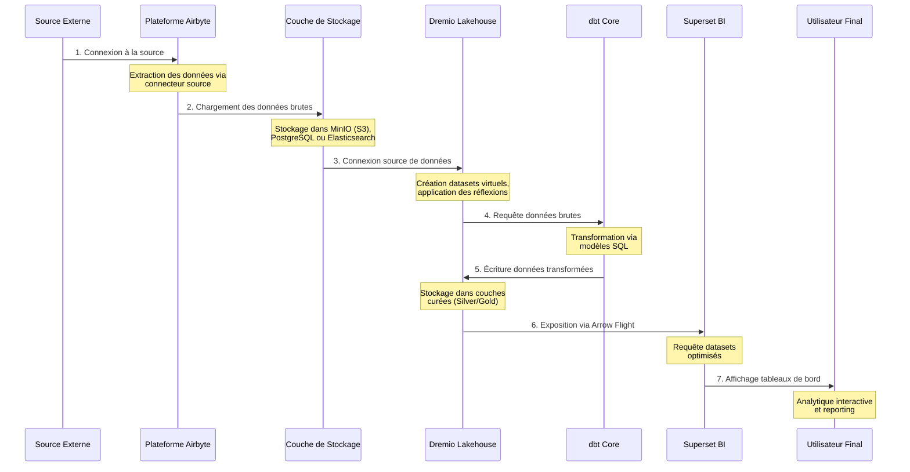

### Étapes du Flux de Données

| Étape | Composant | Entrée | Sortie | Latence |
|-------|-----------|--------|--------|---------|
| **Extraction** | Airbyte | APIs/BD externes | JSON/CSV brut | 1-60 min |
| **Chargement** | Couche Stockage | Fichiers bruts | Buckets organisés | <1 min |
| **Catalogage** | Dremio | Chemins stockage | Datasets virtuels | <1 min |
| **Transformation** | dbt | Tables Bronze | Tables Silver/Gold | 5-30 min |
| **Optimisation** | Réflexions Dremio | Requêtes brutes | Résultats cachés | Temps réel |
| **Visualisation** | Superset | Requêtes SQL | Graphiques/Tableaux de bord | <5 sec |

---

## Couche d'Ingestion

### Extraction de Données Airbyte

Airbyte gère toute l'ingestion de données depuis les sources externes.

#### Flux de Connexion Source

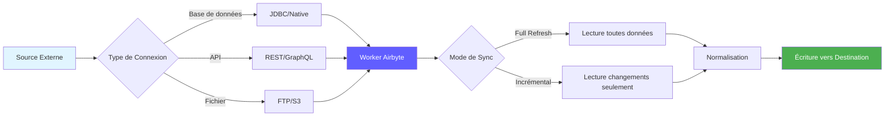

#### Méthodes d'Extraction de Données

**1. Full Refresh**
```yaml
# Full refresh extrait toutes les données à chaque sync
sync_mode: full_refresh
destination_sync_mode: overwrite

# Cas d'usage:
# - Petits datasets (<1M lignes)
# - Pas de suivi fiable des changements
# - Snapshots complets nécessaires
```

**2. Sync Incrémental**
```yaml
# Sync incrémental extrait uniquement les données nouvelles/modifiées
sync_mode: incremental
destination_sync_mode: append_dedup
cursor_field: updated_at

# Cas d'usage:
# - Grands datasets (>1M lignes)
# - Possède champ timestamp ou curseur
# - Optimisation performance sync
```

**3. Change Data Capture (CDC)**
```yaml
# CDC utilise les logs de transaction de la base de données
method: CDC
replication_method: LOG_BASED

# Bases de données supportées:
# - PostgreSQL (WAL)
# - MySQL (binlog)
# - MongoDB (change streams)
# - SQL Server (change tracking)
```

### Intégration API Airbyte

```bash
# Déclencher sync via API
curl -X POST http://localhost:8001/api/v1/connections/sync \
  -H "Content-Type: application/json" \
  -d '{
    "connectionId": "your-connection-id"
  }'

# Vérifier statut sync
curl -X POST http://localhost:8001/api/v1/jobs/get \
  -H "Content-Type: application/json" \
  -d '{
    "id": "job-id"
  }'
```

### Performance d'Extraction

| Type de Source | Débit | Fréquence Recommandée |
|----------------|-------|----------------------|
| PostgreSQL | 50-100k lignes/sec | Toutes les 15-60 min |
| API REST | 1-10k req/sec | Toutes les 5-30 min |
| Fichiers CSV | 100-500 MB/sec | Quotidien |
| MongoDB | 10-50k docs/sec | Toutes les 15-60 min |
| MySQL CDC | Temps réel | Continu |

---

## Couche de Stockage

### Stockage MinIO S3

MinIO stocke les données brutes et traitées dans une structure hiérarchique.

#### Organisation des Buckets

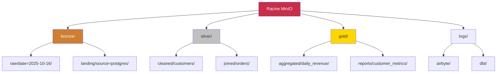

#### Structure des Chemins de Données

```
s3://datalake/
├── bronze/                      # Données brutes d'Airbyte
│   ├── postgres/
│   │   ├── customers/
│   │   │   └── date=2025-10-16/
│   │   │       └── data.parquet
│   │   └── orders/
│   │       └── date=2025-10-16/
│   │           └── data.parquet
│   ├── api/
│   │   └── rest_endpoint/
│   │       └── timestamp=20251016_120000/
│   │           └── response.json
│   └── files/
│       └── csv_import/
│           └── batch_001.csv
│
├── silver/                      # Données nettoyées et validées
│   ├── customers/
│   │   └── version=v2/
│   │       └── customers_cleaned.parquet
│   └── orders/
│       └── version=v2/
│           └── orders_enriched.parquet
│
└── gold/                        # Agrégats prêts pour le métier
    ├── daily_revenue/
    │   └── year=2025/month=10/
    │       └── day=16/
    │           └── revenue.parquet
    └── customer_metrics/
        └── snapshot=2025-10-16/
            └── metrics.parquet
```

### Stratégie de Format de Stockage

| Couche | Format | Compression | Partitionnement | Raison |
|--------|--------|-------------|-----------------|--------|
| **Bronze** | Parquet | Snappy | Par date | Écriture rapide, bonne compression |
| **Silver** | Parquet | Snappy | Par clé métier | Requêtes efficaces |
| **Gold** | Parquet | ZSTD | Par période temps | Compression maximale |
| **Logs** | JSON | Gzip | Par service/date | Lisible par humains |

### Stockage des Métadonnées PostgreSQL

PostgreSQL stocke :
- Configuration et état Airbyte
- Métadonnées et historique d'exécution dbt
- Tableaux de bord et utilisateurs Superset
- Logs et métriques d'application

```sql
-- Structure table état Airbyte
CREATE TABLE airbyte_state (
    connection_id UUID PRIMARY KEY,
    state JSONB NOT NULL,
    updated_at TIMESTAMP DEFAULT NOW()
);

-- Historique exécution dbt
CREATE TABLE dbt_run_history (
    run_id UUID PRIMARY KEY,
    project_name VARCHAR(255),
    started_at TIMESTAMP,
    completed_at TIMESTAMP,
    status VARCHAR(50),
    models_run INTEGER,
    tests_run INTEGER,
    metadata JSONB
);
```

### Stockage de Documents Elasticsearch

Elasticsearch indexe les logs et permet la recherche plein texte.

```json
{
  "index": "airbyte-logs-2025.10.16",
  "mappings": {
    "properties": {
      "timestamp": {"type": "date"},
      "level": {"type": "keyword"},
      "service": {"type": "keyword"},
      "message": {"type": "text"},
      "job_id": {"type": "keyword"},
      "connection_id": {"type": "keyword"},
      "records_synced": {"type": "integer"},
      "bytes_synced": {"type": "long"}
    }
  }
}
```

---

## Couche de Traitement

### Virtualisation de Données Dremio

Dremio crée une vue unifiée sur toutes les sources de stockage.

#### Création de Dataset Virtuel

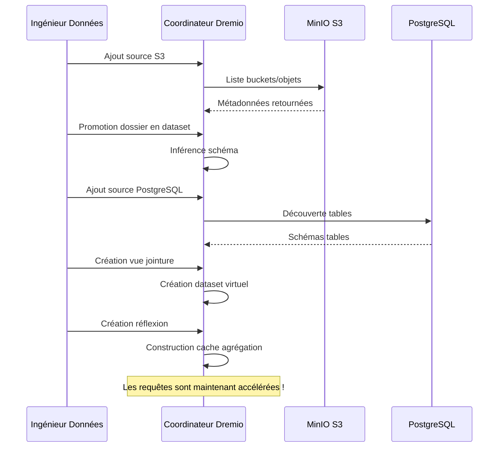

#### Accélération par Réflexions

Les réflexions Dremio pré-calculent les résultats de requêtes pour des performances instantanées.

```sql
-- Créer réflexion brute (sous-ensemble colonnes)
CREATE REFLECTION raw_customers
ON bronze.customers
USING DISPLAY (customer_id, name, email, created_at);

-- Créer réflexion agrégation
CREATE REFLECTION agg_daily_revenue
ON gold.orders
USING DIMENSIONS (order_date)
MEASURES (SUM(amount), COUNT(*), AVG(amount));

-- Les réflexions se rafraîchissent automatiquement selon la politique
ALTER REFLECTION agg_daily_revenue
SET REFRESH EVERY 1 HOUR;
```

**Impact Performance des Réflexions:**

| Type de Requête | Sans Réflexion | Avec Réflexion | Accélération |
|-----------------|----------------|----------------|--------------|
| SELECT Simple | 500ms | 50ms | 10x |
| Agrégations | 5s | 100ms | 50x |
| JOINs Complexes | 30s | 500ms | 60x |
| Scans Larges | 120s | 2s | 60x |

### Transformations dbt

dbt transforme les données brutes en modèles prêts pour le métier.

#### Flux de Transformation

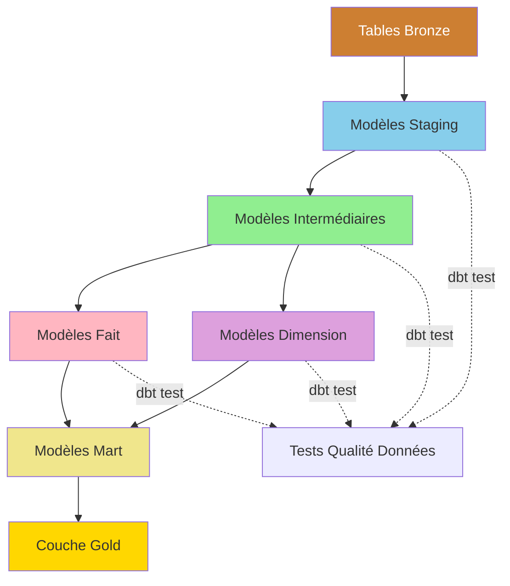

#### Exemple de Pipeline de Transformation

```sql
-- models/staging/stg_customers.sql
-- Étape 1: Nettoyage et standardisation
WITH source AS (
    SELECT * FROM bronze.raw_customers
),

cleaned AS (
    SELECT
        customer_id,
        TRIM(UPPER(name)) AS customer_name,
        LOWER(email) AS email,
        phone,
        address,
        city,
        state,
        zip_code,
        created_at,
        updated_at
    FROM source
    WHERE customer_id IS NOT NULL
)

SELECT * FROM cleaned;
```

```sql
-- models/intermediate/int_customer_orders.sql
-- Étape 2: Jointure et enrichissement
WITH customers AS (
    SELECT * FROM {{ ref('stg_customers') }}
),

orders AS (
    SELECT * FROM {{ ref('stg_orders') }}
),

joined AS (
    SELECT
        c.customer_id,
        c.customer_name,
        c.email,
        o.order_id,
        o.order_date,
        o.amount,
        o.status
    FROM customers c
    INNER JOIN orders o
        ON c.customer_id = o.customer_id
)

SELECT * FROM joined;
```

```sql
-- models/marts/fct_customer_lifetime_value.sql
-- Étape 3: Agrégation pour métriques métier
WITH customer_orders AS (
    SELECT * FROM {{ ref('int_customer_orders') }}
),

metrics AS (
    SELECT
        customer_id,
        customer_name,
        email,
        COUNT(DISTINCT order_id) AS total_orders,
        SUM(amount) AS lifetime_value,
        AVG(amount) AS average_order_value,
        MIN(order_date) AS first_order_date,
        MAX(order_date) AS last_order_date,
        DATEDIFF('day', MIN(order_date), MAX(order_date)) AS customer_lifespan_days
    FROM customer_orders
    WHERE status = 'completed'
    GROUP BY customer_id, customer_name, email
)

SELECT * FROM metrics;
```

#### Flux d'Exécution dbt

```bash
# Exécution pipeline complète
dbt run --select staging        # Exécuter modèles staging
dbt test --select staging       # Tester modèles staging
dbt run --select intermediate   # Exécuter modèles intermédiaires
dbt test --select intermediate  # Tester modèles intermédiaires
dbt run --select marts          # Exécuter modèles mart
dbt test --select marts         # Tester modèles mart

# Générer documentation
dbt docs generate
dbt docs serve
```

### Traçabilité du Lignage des Données

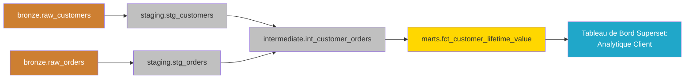

---

## Couche de Présentation

### Flux d'Exécution de Requête

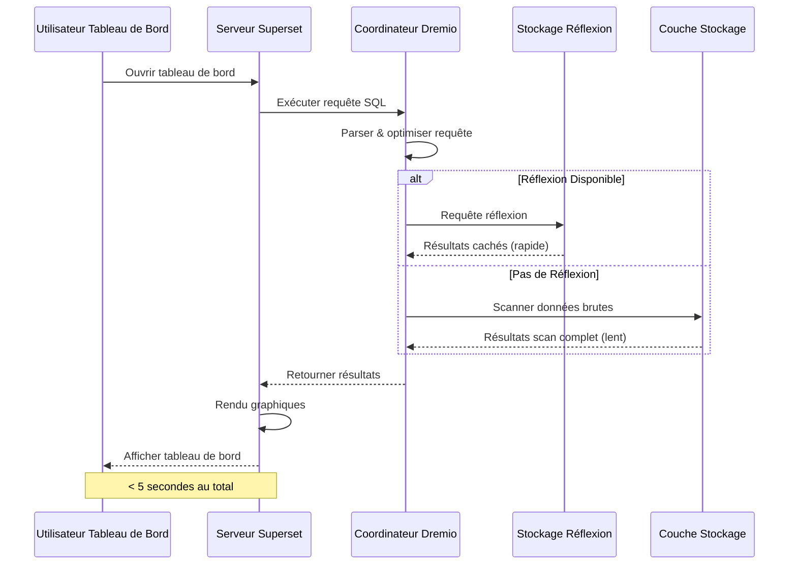

### Modèles d'Accès API

#### 1. Tableaux de Bord Superset (BI Interactive)

```python
# Superset exécute SQL via SQLAlchemy
from superset import db

query = """
SELECT 
    order_date,
    SUM(amount) as daily_revenue
FROM gold.fct_daily_revenue
WHERE order_date >= CURRENT_DATE - INTERVAL '30 days'
GROUP BY order_date
ORDER BY order_date
"""

results = db.session.execute(query)
```

#### 2. API Arrow Flight (Haute Performance)

```python
# Connexion Arrow Flight directe pour outils analytiques
from pyarrow import flight

client = flight.FlightClient("grpc://localhost:32010")

# Authentification
token = client.authenticate_basic_token("admin", "password123")

# Exécuter requête
descriptor = flight.FlightDescriptor.for_command(
    b"SELECT * FROM gold.customer_metrics LIMIT 1000"
)

flight_info = client.get_flight_info(descriptor)
reader = client.do_get(flight_info.endpoints[0].ticket)

# Lire comme Table Arrow (zero-copy)
table = reader.read_all()
df = table.to_pandas()
```

#### 3. API REST (Intégrations Externes)

```bash
# API REST Dremio pour automatisation
curl -X POST http://localhost:9047/api/v3/sql \
  -H "Authorization: Bearer $TOKEN" \
  -H "Content-Type: application/json" \
  -d '{
    "sql": "SELECT COUNT(*) FROM gold.customers"
  }'
```

---

## Modèles de Flux de Données

### Modèle 1: Pipeline ETL Batch

```mermaid
gantt
    title Planification ETL Batch Quotidien
    dateFormat HH:mm
    axisFormat %H:%M
    
    section Ingestion
    Extraction Airbyte (PostgreSQL)     :01:00, 30m
    Extraction Airbyte (APIs)           :01:30, 45m
    
    section Chargement
    Chargement vers Bronze MinIO        :02:15, 15m
    
    section Transformation
    Modèles Staging dbt                 :02:30, 20m
    Modèles Intermédiaires dbt          :02:50, 30m
    Modèles Mart dbt                    :03:20, 40m
    
    section Tests
    Tests Qualité Données dbt           :04:00, 15m
    
    section Optimisation
    Rafraîchissement Réflexions Dremio  :04:15, 20m
    
    section Présentation
    Préchauffage Cache Tableau de Bord  :04:35, 10m
```

### Modèle 2: Streaming Temps Réel


### Modèle 3: Mises à Jour Incrémentielles

```sql
-- Modèle incrémental dbt
{{ config(
    materialized='incremental',
    unique_key='order_id',
    on_schema_change='sync_all_columns'
) }}

SELECT
    order_id,
    customer_id,
    order_date,
    amount,
    status,
    updated_at
FROM {{ source('bronze', 'orders') }}


    -- Traiter uniquement les enregistrements nouveaux ou mis à jour
    WHERE updated_at > (SELECT MAX(updated_at) FROM {{ this }})

```

### Modèle 4: Architecture Lambda (Batch + Stream)

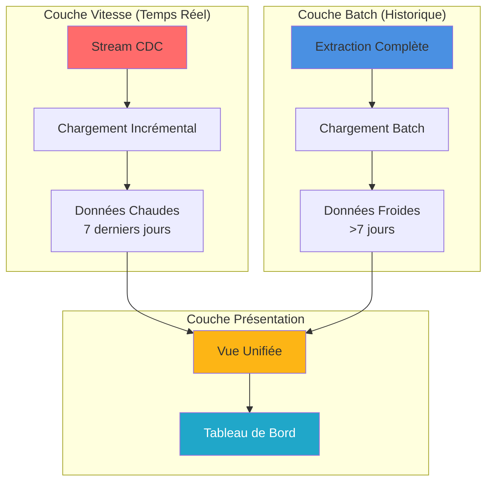

---

## Considérations de Performance

### Optimisation de l'Ingestion

```yaml
# Configuration connexion Airbyte
sync_mode: incremental
destination_sync_mode: append_dedup
cursor_field: updated_at

# Ajustement performance
batch_size: 10000              # Enregistrements par batch
threads: 4                     # Workers parallèles
timeout_minutes: 60           # Timeout sync
retry_on_failure: true
max_retries: 3

# Optimisation réseau
compression: gzip
buffer_size_mb: 256
```

### Optimisation du Stockage

```python
# Options écriture Parquet pour compression optimale
import pyarrow.parquet as pq

pq.write_table(
    table,
    'output.parquet',
    compression='snappy',      # Compression rapide
    use_dictionary=True,       # Activer encodage dictionnaire
    row_group_size=1000000,    # 1M lignes par row group
    data_page_size=1048576,    # 1MB taille page
    write_statistics=True      # Activer statistiques pour pruning
)
```

### Optimisation des Requêtes

```sql
-- Bonnes pratiques requêtes Dremio

-- 1. Utiliser partition pruning
SELECT * FROM gold.orders
WHERE order_date >= '2025-10-01'  -- Élague partitions
  AND order_date < '2025-11-01';

-- 2. Exploiter les réflexions
-- Créer réflexion une fois, requêtes auto-accélérées
ALTER REFLECTION agg_orders SET ENABLED = TRUE;

-- 3. Utiliser column pruning
SELECT order_id, amount       -- Seulement colonnes nécessaires
FROM gold.orders
LIMIT 1000;

-- 4. Pousser les filtres
SELECT *
FROM gold.customers
WHERE state = 'CA'            -- Filtre poussé vers stockage
  AND lifetime_value > 1000;
```

### Optimisation des Transformations

```sql
-- Techniques optimisation dbt

-- 1. Modèles incrémentaux pour grandes tables
{{ config(materialized='incremental') }}

-- 2. Tables partitionnées
{{ config(
    materialized='table',
    partition_by={
        'field': 'order_date',
        'data_type': 'date',
        'granularity': 'day'
    }
) }}

-- 3. Tables clusterisées pour meilleures jointures
{{ config(
    materialized='table',
    cluster_by=['customer_id']
) }}
```

### Benchmarks de Performance

| Opération | Petit Dataset<br/>(1M lignes) | Dataset Moyen<br/>(100M lignes) | Grand Dataset<br/>(1B lignes) |
|-----------|---------------------------|-------------------------------|---------------------------|
| **Sync Airbyte** | 2 min | 30 min | 5 heures |
| **Exécution dbt** | 30 sec | 10 min | 2 heures |
| **Construction Réflexion** | 10 sec | 5 min | 30 min |
| **Requête Tableau de Bord** | <100ms | <500ms | <2s |

---

## Surveillance du Flux de Données

### Métriques Clés à Suivre

```yaml
# Configuration métriques Prometheus
metrics:
  ingestion:
    - airbyte_records_synced_total
    - airbyte_sync_duration_seconds
    - airbyte_sync_failures_total
    
  storage:
    - minio_disk_usage_bytes
    - minio_objects_total
    - postgres_connections_active
    
  processing:
    - dremio_query_duration_seconds
    - dremio_reflection_refresh_seconds
    - dbt_model_execution_time
    
  serving:
    - superset_dashboard_load_time
    - superset_query_cache_hit_rate
    - api_requests_per_second
```

### Tableau de Bord de Surveillance

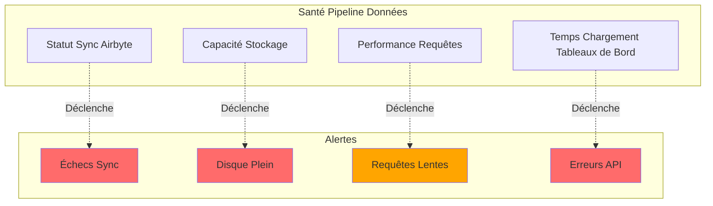

### Agrégation des Logs

```bash
# Requête Elasticsearch pour surveillance pipeline
curl -X GET "localhost:9200/airbyte-logs-*/_search" \
  -H 'Content-Type: application/json' \
  -d '{
    "query": {
      "bool": {
        "filter": [
          {"range": {"timestamp": {"gte": "now-1h"}}},
          {"term": {"level": "ERROR"}}
        ]
      }
    },
    "aggs": {
      "by_service": {
        "terms": {"field": "service"}
      }
    }
  }'
```

---

## Bonnes Pratiques

### Conception du Flux de Données

1. **Concevoir pour l'Idempotence**
   - Garantir que les opérations peuvent être répétées en toute sécurité
   - Utiliser clés uniques pour déduplication
   - Implémenter gestion d'erreurs appropriée

2. **Implémenter Contrôles Qualité Données**
   ```sql
   -- Exemple test dbt
   -- tests/assert_positive_amounts.sql
   SELECT *
   FROM {{ ref('fct_orders') }}
   WHERE amount <= 0
   ```

3. **Partitionner Grands Datasets**
   ```python
   # Partitionner par date pour requêtes efficaces
   df.write.partitionBy('order_date').parquet('s3://bucket/orders/')
   ```

4. **Utiliser Modes de Sync Appropriés**
   - Full Refresh: Petites tables de dimension
   - Incrémental: Grandes tables de fait
   - CDC: Exigences temps réel

### Ajustement Performance

1. **Optimiser Planification Sync Airbyte**
   ```yaml
   # Équilibrer fraîcheur vs utilisation ressources
   small_tables:
     frequency: every_15_minutes
   
   large_tables:
     frequency: every_6_hours
   
   dimension_tables:
     frequency: daily
   ```

2. **Créer Réflexions Stratégiques**
   ```sql
   -- Focus sur agrégations fréquemment requêtées
   CREATE REFLECTION common_metrics
   ON gold.orders
   USING DIMENSIONS (product_id, date_trunc('day', order_date))
   MEASURES (SUM(amount), COUNT(*));
   ```

3. **Optimiser Modèles dbt**
   ```yaml
   # models/schema.yml
   models:
     - name: fct_large_table
       config:
         materialized: incremental
         incremental_strategy: merge
         unique_key: id
         partition_by: {field: date, data_type: date}
   ```

### Résolution de Problèmes Courants

| Problème | Symptôme | Solution |
|----------|---------|----------|
| **Sync Airbyte Lent** | Heures pour synchroniser | Augmenter batch size, utiliser mode incrémental |
| **Manque Mémoire** | Échec modèles dbt | Matérialiser en incrémental, ajouter partitionnement |
| **Requêtes Lentes** | Timeout tableau de bord | Créer réflexions, ajouter index |
| **Stockage Plein** | Échecs écriture | Implémenter rétention données, compresser données anciennes |
| **Données Obsolètes** | Anciennes métriques | Augmenter fréquence sync, vérifier planifications |

### Bonnes Pratiques de Sécurité

1. **Chiffrer Données en Transit**
   ```yaml
   # docker-compose.yml
   minio:
     environment:
       MINIO_SERVER_URL: https://minio:9000
       MINIO_BROWSER_REDIRECT_URL: https://console.minio.local
   ```

2. **Implémenter Contrôles d'Accès**
   ```sql
   -- ACLs Dremio
   GRANT SELECT ON gold.customer_metrics TO ROLE analyst;
   GRANT ALL ON bronze.* TO ROLE data_engineer;
   ```

3. **Auditer Accès aux Données**
   ```json
   {
     "audit_log": {
       "enabled": true,
       "log_queries": true,
       "log_user_actions": true,
       "retention_days": 90
     }
   }
   ```

---

## Résumé

Ce document détaille l'architecture complète du flux de données :

- **Couche d'Ingestion**: Airbyte extrait les données depuis diverses sources via full refresh, incrémental ou CDC
- **Couche de Stockage**: MinIO, PostgreSQL et Elasticsearch stockent les données brutes et traitées dans des couches organisées
- **Couche de Traitement**: Dremio virtualise les données et dbt les transforme via modèles staging, intermédiaires et mart
- **Couche de Présentation**: Tableaux de bord Superset et APIs fournissent accès aux données prêtes pour le métier

Points clés à retenir :
- Les données circulent de manière unidirectionnelle à travers des couches clairement définies
- Chaque composant a des responsabilités et interfaces spécifiques
- La performance est optimisée via réflexions, partitionnement et mise en cache
- La surveillance et l'observabilité sont intégrées dans chaque couche
- Les bonnes pratiques garantissent fiabilité, performance et sécurité

**Documentation Associée:**
- [Vue d'Ensemble Architecture](./overview.md)
- [Composants](./components.md)
- [Déploiement](./deployment.md)
- [Guide Intégration Airbyte](../guides/airbyte-integration.md)
- [Guide Développement dbt](../guides/dbt-development.md)

---

**Version**: 3.2.0  
**Dernière Mise à Jour**: 16 octobre 2025
