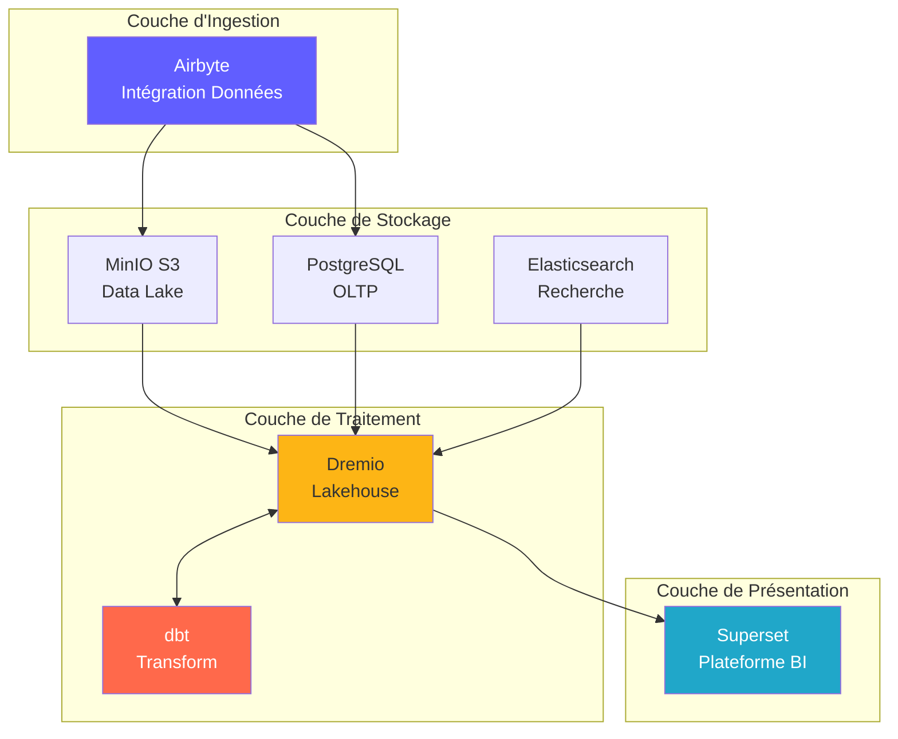
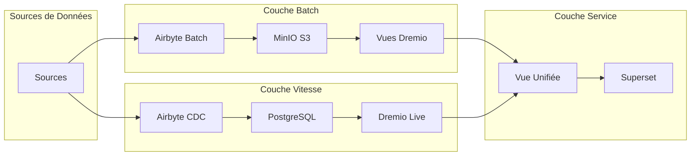
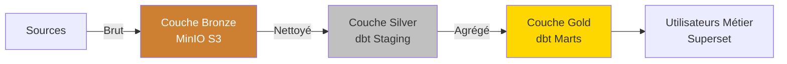
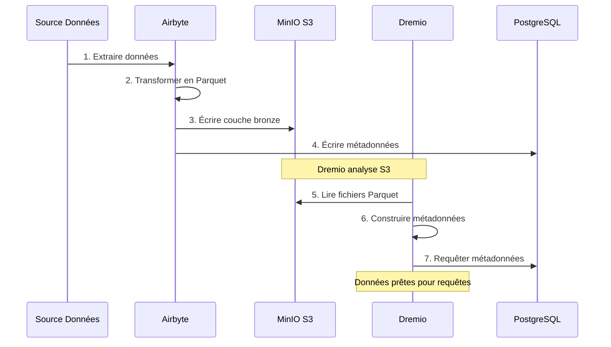
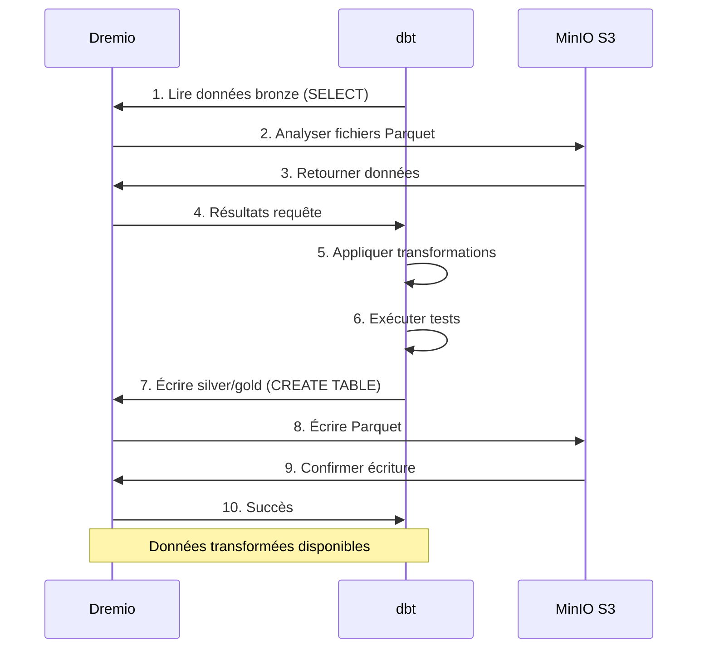
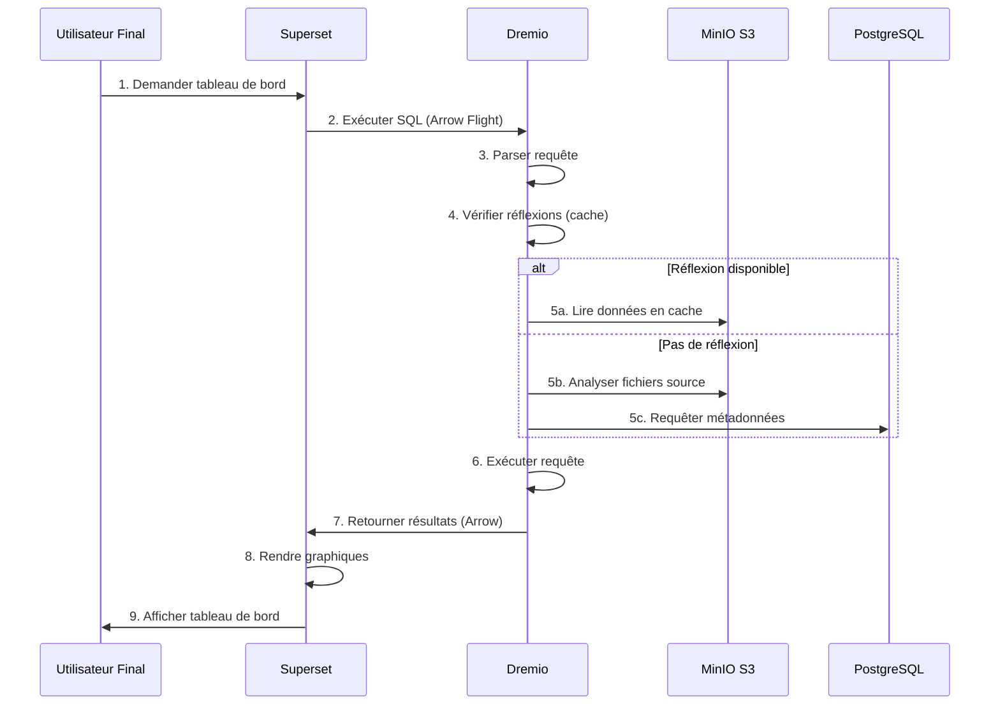
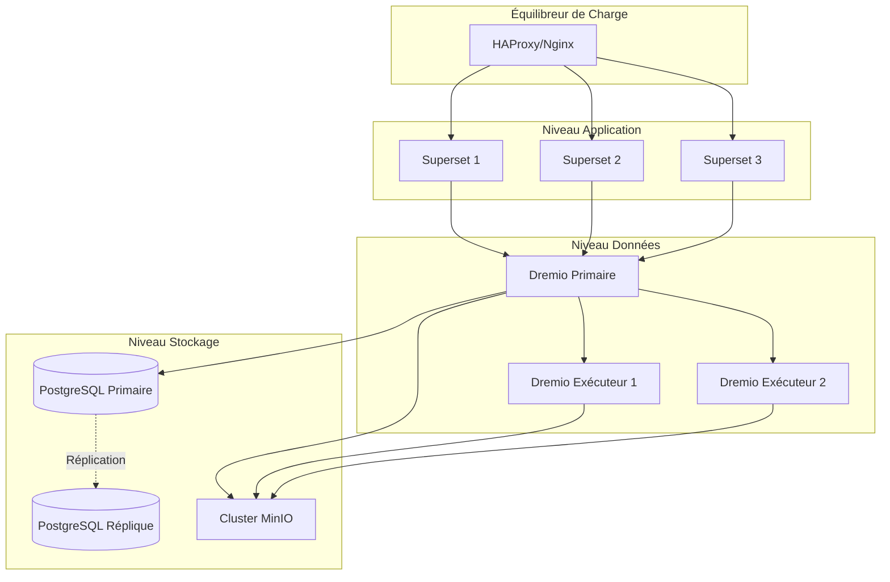
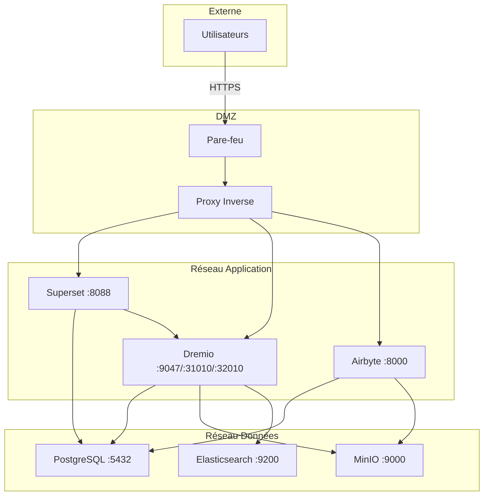
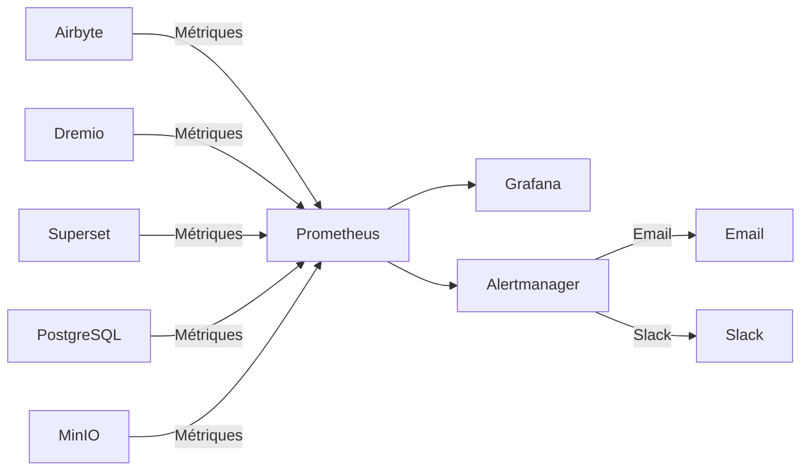

# Vue d'ensemble de l'Architecture

**Version**: 3.2.0  
**Dernière mise à jour**: 2025-10-16  
**Langue**: Français

---

## Introduction

La plateforme de données est une architecture moderne cloud-native construite sur des technologies open source. Elle fournit une solution complète pour l'ingestion, le stockage, la transformation et la visualisation des données, conçue pour des charges de travail analytiques à l'échelle d'entreprise.



---

## Principes de Conception

### 1. Open Source en Premier

**Philosophie**: Utiliser des technologies open source pour éviter le verrouillage fournisseur et maintenir la flexibilité.

**Avantages**:
- Aucun coût de licence
- Développement communautaire
- Capacité de personnalisation complète
- Audit de sécurité transparent
- Large compatibilité d'écosystème

### 2. Architecture en Couches

**Philosophie**: Séparer les préoccupations en couches distinctes pour la maintenabilité et la scalabilité.

**Couches**:
```
┌─────────────────────────────────────┐
│     Couche de Présentation          │  Superset (BI & Tableaux de Bord)
├─────────────────────────────────────┤
│     Couche Sémantique               │  Dremio (Moteur de Requête)
├─────────────────────────────────────┤
│     Couche de Transformation        │  dbt (Transformation Données)
├─────────────────────────────────────┤
│     Couche de Stockage              │  MinIO, PostgreSQL, Elasticsearch
├─────────────────────────────────────┤
│     Couche d'Ingestion              │  Airbyte (Intégration Données)
└─────────────────────────────────────┘
```

### 3. ELT plutôt que ETL

**Philosophie**: Charger les données brutes d'abord, transformer dans la destination (ELT).

**Pourquoi ELT?**
- **Flexibilité**: Transformer les données de plusieurs façons sans ré-extraction
- **Performance**: Exploiter le calcul de destination pour les transformations
- **Auditabilité**: Données brutes toujours disponibles pour vérification
- **Coût**: Réduire la charge d'extraction sur les systèmes sources

**Flux**:
```
Extract → Load → Transform
(Airbyte) (MinIO/PostgreSQL) (dbt + Dremio)
```

### 4. Modèle Data Lakehouse

**Philosophie**: Combiner la flexibilité du data lake avec les performances du data warehouse.

**Caractéristiques**:
- **Transactions ACID**: Opérations de données fiables
- **Application de schéma**: Garanties de qualité des données
- **Voyage dans le temps**: Requêter les versions historiques
- **Formats ouverts**: Parquet, Iceberg, Delta Lake
- **Accès direct aux fichiers**: Pas de verrouillage propriétaire

### 5. Conception Cloud-Native

**Philosophie**: Concevoir pour des environnements conteneurisés et distribués.

**Implémentation**:
- Conteneurs Docker pour tous les services
- Scalabilité horizontale
- Infrastructure as code
- Sans état dans la mesure du possible
- Configuration via variables d'environnement

---

## Modèles d'Architecture

### Architecture Lambda (Batch + Stream)



**Couche Batch** (Données Historiques):
- Grands volumes de données
- Traitement périodique (horaire/quotidien)
- Latence élevée acceptable
- Retraitement complet possible

**Couche Vitesse** (Données Temps Réel):
- Change Data Capture (CDC)
- Faible latence requise
- Mises à jour incrémentales uniquement
- Gère les données récentes

**Couche Service**:
- Fusionne les vues batch et vitesse
- Interface de requête unique (Dremio)
- Sélection automatique de vue

### Architecture Medallion (Bronze → Silver → Gold)



**Couche Bronze** (Brut):
- Données telles quelles des sources
- Aucune transformation
- Historique complet conservé
- Airbyte charge ici

**Couche Silver** (Nettoyé):
- Qualité des données appliquée
- Formats standardisés
- Modèles de staging dbt
- Prêt pour l'analytique

**Couche Gold** (Métier):
- Métriques agrégées
- Logique métier appliquée
- Modèles marts dbt
- Optimisé pour la consommation

---

## Interactions entre Composants

### Flux d'Ingestion de Données



### Pipeline de Transformation



### Exécution de Requêtes



---

## Modèles de Scalabilité

### Mise à l'Échelle Horizontale

**Services Sans État** (peuvent évoluer librement):
- Airbyte Workers: Évoluer pour synchronisations parallèles
- Dremio Executors: Évoluer pour performances requêtes
- Superset Web: Évoluer pour concurrence utilisateurs

**Services Avec État** (nécessitent coordination):
- PostgreSQL: Réplication primaire-réplique
- MinIO: Mode distribué (nœuds multiples)
- Elasticsearch: Cluster avec sharding

### Mise à l'Échelle Verticale

**Intensif en Mémoire**:
- Dremio: Augmenter heap JVM pour grandes requêtes
- PostgreSQL: Plus de RAM pour cache buffer
- Elasticsearch: Plus de heap pour indexation

**Intensif en CPU**:
- dbt: Plus de cœurs pour construction parallèle modèles
- Airbyte: Transformations données plus rapides

### Partitionnement de Données

```sql
-- Exemple: Partitionner par date
CREATE TABLE orders_partitioned (
    order_id INT,
    customer_id INT,
    amount DECIMAL,
    order_date DATE
)
PARTITION BY (DATE_TRUNC('month', order_date))
STORED AS PARQUET;

-- La requête analyse uniquement les partitions pertinentes
SELECT SUM(amount)
FROM orders_partitioned
WHERE order_date >= '2025-01-01'
  AND order_date < '2025-02-01';
-- Analyse uniquement la partition de janvier
```

---

## Haute Disponibilité

### Redondance des Services



### Scénarios de Panne

| Composant | Panne | Récupération |
|-----------|-------|--------------|
| **Airbyte Worker** | Crash conteneur | Redémarrage auto, reprendre sync |
| **Dremio Executor** | Panne nœud | Requête redirigée vers autres exécuteurs |
| **PostgreSQL** | Primaire hors service | Promouvoir réplique en primaire |
| **MinIO Node** | Panne disque | Erasure coding reconstruit données |
| **Superset** | Service hors service | Équilibreur redirige trafic |

### Stratégie de Sauvegarde

```bash
# Sauvegardes automatisées quotidiennes
0 2 * * * /scripts/backup_all.sh

# backup_all.sh
#!/bin/bash

# Sauvegarder PostgreSQL
pg_dumpall -U postgres > /backups/postgres_$(date +%Y%m%d).sql

# Sauvegarder métadonnées Dremio
tar czf /backups/dremio_$(date +%Y%m%d).tar.gz /opt/dremio/data

# Synchroniser MinIO vers S3 distant
mc mirror MinIOLake/datalake s3-offsite/datalake-backup

# Conserver 30 jours
find /backups -mtime +30 -delete
```

---

## Architecture de Sécurité

### Sécurité Réseau



### Authentification et Autorisation

**Authentification des Services**:
- **Dremio**: Intégration LDAP/AD, OAuth2, SAML
- **Superset**: Auth base de données, LDAP, OAuth2
- **Airbyte**: Auth basique, OAuth2 (entreprise)
- **MinIO**: Politiques IAM, tokens STS

**Niveaux d'Autorisation**:
```yaml
Rôles:
  - Admin:
      - Accès complet à tous les services
      - Gestion utilisateurs
      - Modifications configuration
  
  - Data Engineer:
      - Créer/modifier sources données
      - Exécuter syncs Airbyte
      - Exécuter modèles dbt
      - Créer datasets Dremio
  
  - Analyst:
      - Accès lecture seule données
      - Créer tableaux de bord Superset
      - Requêter datasets Dremio
  
  - Viewer:
      - Voir tableaux de bord uniquement
      - Pas d'accès données
```

### Chiffrement des Données

**Au Repos**:
- MinIO: Chiffrement côté serveur (AES-256)
- PostgreSQL: Chiffrement transparent données (TDE)
- Elasticsearch: Index chiffrés

**En Transit**:
- TLS 1.3 pour toute communication inter-services
- Arrow Flight avec TLS pour Dremio ↔ Superset
- HTTPS pour interfaces web

---

## Surveillance et Observabilité

### Collecte de Métriques



**Métriques Clés**:
- **Airbyte**: Taux succès sync, enregistrements synchronisés, octets transférés
- **Dremio**: Latence requête, taux hit cache, utilisation ressources
- **dbt**: Temps construction modèle, échecs tests
- **Superset**: Temps chargement tableau de bord, utilisateurs actifs
- **Infrastructure**: CPU, mémoire, disque, réseau

### Journalisation

**Journalisation Centralisée**:
```yaml
Stack ELK:
  - Elasticsearch: Stocker logs
  - Logstash: Traiter logs
  - Kibana: Visualiser logs

Sources de Logs:
  - Logs application (format JSON)
  - Logs d'accès
  - Logs d'audit
  - Logs d'erreur
```

### Traçage

**Traçage Distribué**:
- Intégration Jaeger ou Zipkin
- Tracer requêtes entre services
- Identifier goulots d'étranglement
- Déboguer problèmes performance

---

## Topologies de Déploiement

### Environnement de Développement

```yaml
Hôte Unique:
  Ressources: 8 Go RAM, 4 CPUs
  Services: Tous sur une machine
  Stockage: Volumes locaux
  Réseau: Réseau bridge
  Cas d'usage: Développement, tests
```

### Environnement de Staging

```yaml
Multi-Hôtes:
  Ressources: 16 Go RAM, 8 CPUs par hôte
  Services: Répartis sur 2-3 hôtes
  Stockage: NFS partagé ou MinIO distribué
  Réseau: Réseau overlay
  Cas d'usage: Tests pré-production, UAT
```

### Environnement de Production

```yaml
Cluster Kubernetes:
  Ressources: Auto-scaling selon charge
  Services: Conteneurisés, répliqués
  Stockage: Volumes persistants (SSD)
  Réseau: Service mesh (Istio)
  Haute Disponibilité: Déploiement multi-zones
  Cas d'usage: Charges production
```

---

## Justification des Choix Technologiques

### Pourquoi Airbyte?

- **300+ connecteurs**: Intégrations pré-construites
- **Open source**: Pas de verrouillage fournisseur
- **Communauté active**: 12k+ étoiles GitHub
- **Support CDC**: Capture données temps réel
- **Normalisation**: Intégration dbt intégrée

### Pourquoi Dremio?

- **Accélération requêtes**: Requêtes 10-100x plus rapides
- **Arrow Flight**: Transfert données haute performance
- **Compatibilité data lake**: Pas de déplacement données
- **Self-service**: Utilisateurs métier explorent données
- **Rentable**: Réduire coûts warehouse

### Pourquoi dbt?

- **Basé SQL**: Familier aux analystes
- **Contrôle version**: Intégration Git
- **Tests**: Tests qualité données intégrés
- **Documentation**: Docs auto-générées
- **Communauté**: 5k+ packages disponibles

### Pourquoi Superset?

- **UI moderne**: Interface intuitive
- **IDE SQL**: Capacités requêtes avancées
- **Visualisations riches**: 50+ types graphiques
- **Extensible**: Plugins personnalisés
- **Open source**: Soutenu fondation Apache

### Pourquoi PostgreSQL?

- **Fiabilité**: Conformité ACID
- **Performance**: Prouvé à l'échelle
- **Fonctionnalités**: JSON, recherche texte complet, extensions
- **Communauté**: Écosystème mature
- **Coût**: Gratuit et open source

### Pourquoi MinIO?

- **Compatibilité S3**: API standard industrie
- **Performance**: Débit élevé
- **Erasure coding**: Durabilité données
- **Multi-cloud**: Déployer partout
- **Rentable**: Alternative auto-hébergée

---

## Évolution Future de l'Architecture

### Améliorations Prévues

1. **Catalogue de Données** (Intégration OpenMetadata)
   - Gestion métadonnées
   - Suivi lignage
   - Découverte données

2. **Qualité des Données** (Great Expectations)
   - Validation automatisée
   - Détection anomalies
   - Tableaux de bord qualité

3. **Opérations ML** (MLflow)
   - Pipelines entraînement modèles
   - Registre modèles
   - Automatisation déploiement

4. **Traitement Stream** (Apache Flink)
   - Transformations temps réel
   - Traitement événements complexes
   - Analytique streaming

5. **Gouvernance Données** (Apache Atlas)
   - Application politiques
   - Audit accès
   - Rapports conformité

---

## Références

- [Détails Composants](components.md)
- [Flux de Données](data-flow.md)
- [Guide Déploiement](deployment.md)
- [Intégration Airbyte](../guides/airbyte-integration.md)

---

**Version Vue d'ensemble Architecture**: 3.2.0  
**Dernière Mise à Jour**: 2025-10-16  
**Maintenu Par**: Équipe Plateforme de Données
