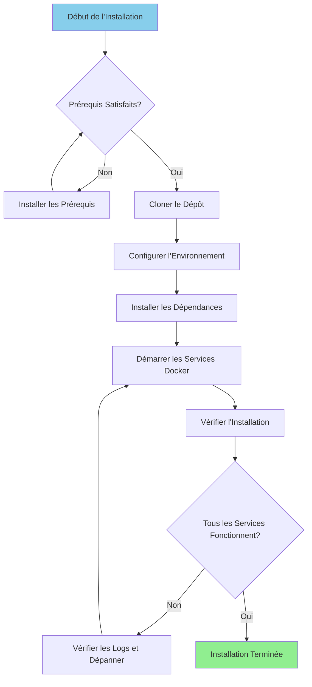

# Guide d'Installation

**Version**: 3.2.0  
**Dernière mise à jour**: 2025-10-16  
**Langue**: Français

---

## Vue d'ensemble

Ce guide fournit des instructions étape par étape pour l'installation et la configuration de la plateforme de données complète, incluant Airbyte, Dremio, dbt, Apache Superset et l'infrastructure de support.



---

## Prérequis

### Configuration Système Requise

**Configuration Minimale:**
- **CPU**: 4 cœurs (8+ recommandés)
- **RAM**: 8 Go (16+ Go recommandés)
- **Espace Disque**: 20 Go disponibles (50+ Go recommandés)
- **Réseau**: Connexion Internet stable pour les images Docker

**Systèmes d'exploitation:**
- Linux (Ubuntu 20.04+, CentOS 8+, Debian 11+)
- macOS (11.0+)
- Windows 10/11 avec WSL2

### Logiciels Requis

#### 1. Docker

**Version**: 20.10 ou supérieure

**Installation:**

**Linux:**
```bash
# Installer Docker
curl -fsSL https://get.docker.com -o get-docker.sh
sudo sh get-docker.sh

# Ajouter l'utilisateur au groupe docker
sudo usermod -aG docker $USER

# Démarrer le service Docker
sudo systemctl start docker
sudo systemctl enable docker

# Vérifier l'installation
docker --version
```

**macOS:**
```bash
# Télécharger et installer Docker Desktop depuis:
# https://www.docker.com/products/docker-desktop

# Vérifier l'installation
docker --version
```

**Windows:**
```powershell
# Installer WSL2 d'abord
wsl --install

# Télécharger et installer Docker Desktop depuis:
# https://www.docker.com/products/docker-desktop

# Vérifier l'installation
docker --version
```

#### 2. Docker Compose

**Version**: 2.0 ou supérieure

**Installation:**

```bash
# Linux
sudo curl -L "https://github.com/docker/compose/releases/latest/download/docker-compose-$(uname -s)-$(uname -m)" -o /usr/local/bin/docker-compose
sudo chmod +x /usr/local/bin/docker-compose

# Vérifier l'installation
docker-compose --version
```

**Note**: Docker Desktop pour macOS et Windows inclut Docker Compose.

#### 3. Python

**Version**: 3.11 ou supérieure

**Installation:**

**Linux (Ubuntu/Debian):**
```bash
sudo apt update
sudo apt install python3.11 python3.11-venv python3-pip
```

**macOS:**
```bash
brew install python@3.11
```

**Windows:**
```powershell
# Télécharger l'installateur depuis python.org
# Ou utiliser winget:
winget install Python.Python.3.11
```

**Vérification:**
```bash
python --version  # ou python3 --version
pip --version     # ou pip3 --version
```

#### 4. Git

**Installation:**

```bash
# Linux
sudo apt install git  # Ubuntu/Debian
sudo yum install git  # CentOS/RHEL

# macOS
brew install git

# Windows
winget install Git.Git
```

**Vérification:**
```bash
git --version
```

---

## Étapes d'Installation

### Étape 1: Cloner le Dépôt

```bash
# Cloner le dépôt
git clone https://github.com/your-org/dremiodbt.git

# Naviguer vers le répertoire du projet
cd dremiodbt

# Vérifier le contenu
ls -la
```

**Structure attendue:**
```
dremiodbt/
├── docker-compose.yml
├── docker-compose-airbyte.yml
├── README.md
├── requirements.txt
├── dbt/
├── dremio_connector/
├── docs/
└── scripts/
```

### Étape 2: Configurer l'Environnement

#### Créer le Fichier d'Environnement

```bash
# Copier le fichier d'environnement exemple
cp .env.example .env

# Éditer la configuration (optionnel)
nano .env  # ou utiliser votre éditeur préféré
```

#### Variables d'Environnement

**Configuration de Base:**
```bash
# Projet
PROJECT_NAME=dremiodbt
ENVIRONMENT=development

# Réseau Docker
NETWORK_NAME=dremio_network

# PostgreSQL
POSTGRES_HOST=postgres
POSTGRES_PORT=5432
POSTGRES_DB=dremio_db
POSTGRES_USER=postgres
POSTGRES_PASSWORD=postgres123

# Dremio
DREMIO_VERSION=26.0
DREMIO_HTTP_PORT=9047
DREMIO_FLIGHT_PORT=32010
DREMIO_ADMIN_USER=admin
DREMIO_ADMIN_PASSWORD=admin123

# Airbyte
AIRBYTE_VERSION=0.50.33
AIRBYTE_HTTP_PORT=8000
AIRBYTE_API_PORT=8001

# Superset
SUPERSET_VERSION=3.0
SUPERSET_HTTP_PORT=8088
SUPERSET_ADMIN_USER=admin
SUPERSET_ADMIN_PASSWORD=admin

# MinIO
MINIO_VERSION=latest
MINIO_API_PORT=9000
MINIO_CONSOLE_PORT=9001
MINIO_ROOT_USER=minioadmin
MINIO_ROOT_PASSWORD=minioadmin123

# Elasticsearch
ELASTIC_VERSION=8.15.0
ELASTIC_HTTP_PORT=9200
```

### Étape 3: Installer les Dépendances Python

#### Créer l'Environnement Virtuel

```bash
# Créer l'environnement virtuel
python -m venv venv

# Activer l'environnement virtuel
# Linux/macOS:
source venv/bin/activate

# Windows:
.\venv\Scripts\activate
```

#### Installer les Requirements

```bash
# Mettre à jour pip
pip install --upgrade pip

# Installer les dépendances
pip install -r requirements.txt

# Vérifier l'installation
pip list
```

**Packages clés installés:**
- `pyarrow>=21.0.0` - Client Arrow Flight
- `pandas>=2.3.0` - Manipulation de données
- `dbt-core>=1.10.0` - Transformation de données
- `sqlalchemy>=2.0.0` - Connectivité base de données
- `pyyaml>=6.0.0` - Gestion de configuration

### Étape 4: Démarrer les Services Docker

#### Démarrer les Services Principaux

```bash
# Démarrer tous les services
docker-compose up -d

# Ou utiliser Makefile (si disponible)
make up
```

**Services démarrés:**
- PostgreSQL (port 5432)
- Dremio (ports 9047, 32010)
- Apache Superset (port 8088)
- MinIO (ports 9000, 9001)
- Elasticsearch (port 9200)

#### Démarrer Airbyte (Compose Séparé)

```bash
# Démarrer les services Airbyte
docker-compose -f docker-compose-airbyte.yml up -d
```

**Services Airbyte démarrés:**
- Airbyte Server (port 8001)
- Airbyte Web UI (port 8000)
- Airbyte Worker
- Airbyte Temporal
- Airbyte Database

#### Vérifier le Statut des Services

```bash
# Voir les conteneurs en cours d'exécution
docker-compose ps

# Voir tous les conteneurs (incluant Airbyte)
docker ps

# Voir les logs
docker-compose logs -f

# Voir les logs Airbyte
docker-compose -f docker-compose-airbyte.yml logs -f
```

---

## Vérification

### Étape 5: Vérifier les Services

#### 1. PostgreSQL

```bash
# Tester la connexion
docker exec -it postgres psql -U postgres -d dremio_db -c "SELECT version();"
```

**Sortie attendue:**
```
PostgreSQL 16.x on x86_64-pc-linux-gnu
```

#### 2. Dremio

**Interface Web:**
```
http://localhost:9047
```

**Première connexion:**
- Nom d'utilisateur: `admin`
- Mot de passe: `admin123`
- Vous serez invité à créer un compte administrateur lors du premier accès

**Tester la connexion:**
```bash
# Tester le point de terminaison HTTP
curl http://localhost:9047/apiv2/login
```

#### 3. Airbyte

**Interface Web:**
```
http://localhost:8000
```

**Identifiants par défaut:**
- Email: `airbyte@example.com`
- Mot de passe: `password`

**Tester l'API:**
```bash
# Vérification de santé
curl http://localhost:8001/health
```

**Réponse attendue:**
```json
{
  "status": "ok",
  "timestamp": "2025-10-16T12:00:00Z"
}
```

#### 4. Apache Superset

**Interface Web:**
```
http://localhost:8088
```

**Identifiants par défaut:**
- Nom d'utilisateur: `admin`
- Mot de passe: `admin`

**Tester la connexion:**
```bash
curl http://localhost:8088/health
```

#### 5. MinIO

**Console UI:**
```
http://localhost:9001
```

**Identifiants:**
- Nom d'utilisateur: `minioadmin`
- Mot de passe: `minioadmin123`

**Tester l'API S3:**
```bash
# Installer le client MinIO
wget https://dl.min.io/client/mc/release/linux-amd64/mc
chmod +x mc

# Configurer
./mc alias set local http://localhost:9000 minioadmin minioadmin123

# Tester
./mc ls local
```

#### 6. Elasticsearch

**Tester la connexion:**
```bash
# Vérification de santé
curl http://localhost:9200/_cluster/health

# Obtenir les informations
curl http://localhost:9200
```

**Réponse attendue:**
```json
{
  "name": "elasticsearch",
  "cluster_name": "docker-cluster",
  "version": {
    "number": "8.15.0"
  }
}
```

### Étape 6: Exécuter les Vérifications de Santé

```bash
# Exécuter le script de vérification de santé complet
python scripts/health_check.py

# Ou utiliser Makefile
make health-check
```

**Sortie attendue:**
```
✓ PostgreSQL: En cours d'exécution (port 5432)
✓ Dremio: En cours d'exécution (ports 9047, 32010)
✓ Airbyte: En cours d'exécution (ports 8000, 8001)
✓ Superset: En cours d'exécution (port 8088)
✓ MinIO: En cours d'exécution (ports 9000, 9001)
✓ Elasticsearch: En cours d'exécution (port 9200)

Tous les services sont opérationnels!
```

---

## Configuration Post-Installation

### 1. Initialiser Dremio

```bash
# Exécuter le script d'initialisation
python scripts/init_dremio.py
```

**Crée:**
- Utilisateur administrateur
- Sources par défaut (PostgreSQL, MinIO)
- Jeux de données exemples

### 2. Initialiser Superset

```bash
# Initialiser la base de données
docker exec -it superset superset db upgrade

# Créer un utilisateur administrateur (si inexistant)
docker exec -it superset superset fab create-admin \
    --username admin \
    --firstname Admin \
    --lastname User \
    --email admin@example.com \
    --password admin

# Initialiser Superset
docker exec -it superset superset init
```

### 3. Configurer dbt

```bash
# Naviguer vers le répertoire dbt
cd dbt

# Tester la connexion
dbt debug

# Exécuter les modèles initiaux
dbt run

# Exécuter les tests
dbt test
```

### 4. Configurer Airbyte

**Via l'Interface Web (http://localhost:8000):**

1. Compléter l'assistant de configuration
2. Configurer la première source (ex: PostgreSQL)
3. Configurer la destination (ex: MinIO S3)
4. Créer la connexion
5. Exécuter la première synchronisation

**Via l'API:**
```bash
# Voir docs/i18n/fr/guides/airbyte-integration.md pour les détails
python scripts/configure_airbyte.py
```

---

## Structure des Répertoires Après Installation

```
dremiodbt/
├── venv/                          # Environnement virtuel Python
├── data/                          # Stockage de données local
│   ├── dremio/                    # Métadonnées Dremio
│   ├── postgres/                  # Données PostgreSQL
│   └── minio/                     # Données MinIO
├── logs/                          # Logs applicatifs
│   ├── dremio.log
│   ├── airbyte.log
│   ├── superset.log
│   └── dbt.log
├── dbt/
│   ├── models/                    # Modèles dbt
│   ├── tests/                     # Tests dbt
│   ├── target/                    # SQL compilé
│   └── logs/                      # Logs dbt
└── docker-volume/                 # Volumes persistants Docker
    ├── db-data/                   # Données de base de données
    ├── minio-data/                # Stockage objet
    └── elastic-data/              # Index de recherche
```

---

## Dépannage

### Problèmes Courants

#### 1. Port Déjà Utilisé

**Erreur:**
```
Error: bind: address already in use
```

**Solution:**
```bash
# Trouver le processus utilisant le port (exemple: 9047)
sudo lsof -i :9047

# Terminer le processus
sudo kill -9 <PID>

# Ou changer le port dans docker-compose.yml
```

#### 2. Mémoire Insuffisante

**Erreur:**
```
ERROR: Insufficient memory available
```

**Solution:**
```bash
# Augmenter l'allocation mémoire Docker
# Docker Desktop: Paramètres > Ressources > Mémoire (16Go recommandés)

# Linux: Éditer /etc/docker/daemon.json
{
  "default-ulimits": {
    "memlock": {
      "Hard": -1,
      "Name": "memlock",
      "Soft": -1
    }
  }
}

# Redémarrer Docker
sudo systemctl restart docker
```

#### 3. Services ne Démarrent Pas

**Vérifier les logs:**
```bash
# Voir tous les logs des services
docker-compose logs

# Voir un service spécifique
docker-compose logs dremio
docker-compose logs airbyte-server

# Suivre les logs en temps réel
docker-compose logs -f
```

#### 4. Problèmes Réseau

**Réinitialiser le réseau Docker:**
```bash
# Arrêter tous les services
docker-compose down
docker-compose -f docker-compose-airbyte.yml down

# Supprimer le réseau
docker network rm dremio_network

# Redémarrer les services
docker-compose up -d
docker-compose -f docker-compose-airbyte.yml up -d
```

#### 5. Problèmes de Permissions (Linux)

**Solution:**
```bash
# Corriger les permissions des répertoires de données
sudo chown -R $USER:$USER data/ docker-volume/

# Corriger les permissions du socket Docker
sudo chmod 666 /var/run/docker.sock
```

---

## Désinstallation

### Arrêter les Services

```bash
# Arrêter les services principaux
docker-compose down

# Arrêter Airbyte
docker-compose -f docker-compose-airbyte.yml down
```

### Supprimer les Données (Optionnel)

```bash
# Supprimer les volumes (ATTENTION: Supprime toutes les données)
docker-compose down -v
docker-compose -f docker-compose-airbyte.yml down -v

# Supprimer les répertoires de données locaux
rm -rf data/ docker-volume/ logs/
```

### Supprimer les Images Docker

```bash
# Lister les images
docker images | grep dremio

# Supprimer des images spécifiques
docker rmi dremio/dremio-oss:24.0
docker rmi airbyte/server:0.50.33
docker rmi apache/superset:3.0

# Supprimer toutes les images non utilisées
docker image prune -a
```

---

## Prochaines Étapes

Après une installation réussie:

1. **Configurer les Sources de Données** - Voir [Guide de Configuration](configuration.md)
2. **Tutoriel Premiers Pas** - Voir [Premiers Pas](first-steps.md)
3. **Configuration Airbyte** - Voir [Guide d'Intégration Airbyte](../guides/airbyte-integration.md)
4. **Configuration Dremio** - Voir [Guide de Configuration Dremio](../guides/dremio-setup.md)
5. **Créer des Modèles dbt** - Voir [Guide de Développement dbt](../guides/dbt-development.md)
6. **Créer des Tableaux de Bord** - Voir [Guide Tableaux de Bord Superset](../guides/superset-dashboards.md)

---

## Support

Pour les problèmes d'installation:

- **Documentation**: [Guide de Dépannage](../guides/troubleshooting.md)
- **GitHub Issues**: https://github.com/your-org/dremiodbt/issues
- **Communauté**: https://github.com/your-org/dremiodbt/discussions

---

**Version du Guide d'Installation**: 3.2.0  
**Dernière Mise à Jour**: 2025-10-16  
**Maintenu Par**: Équipe Plateforme de Données
