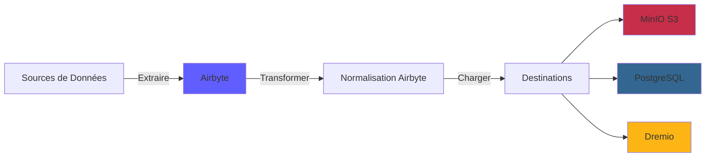
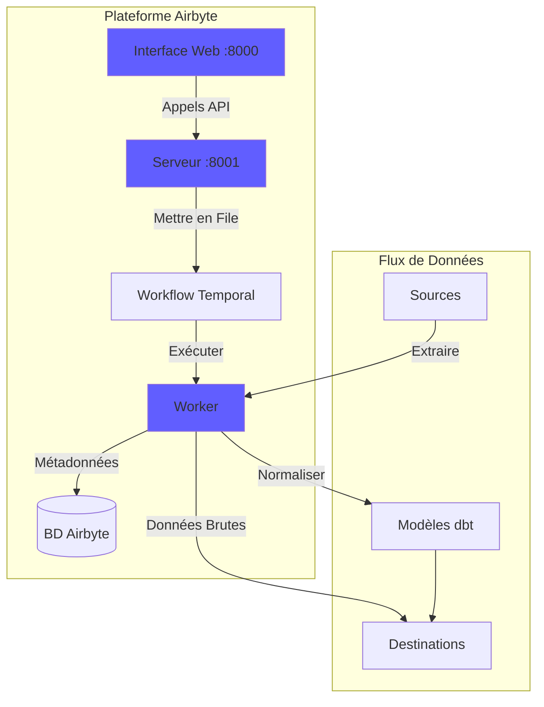
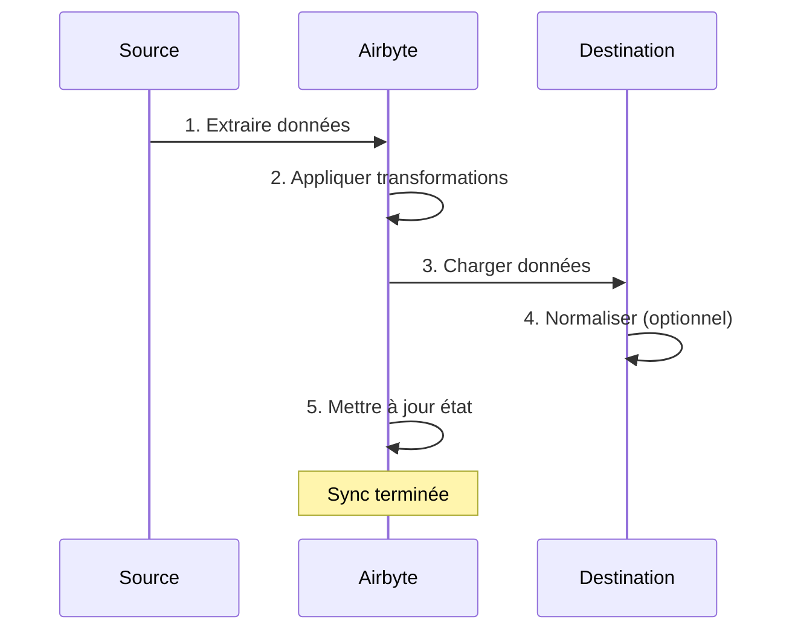
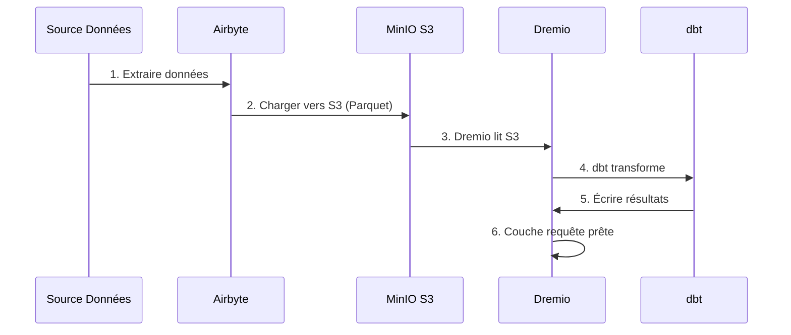

# Guide d'Intégration Airbyte

**Version**: 3.2.0  
**Dernière Mise à Jour**: 16 octobre 2025  
**Langue**: Français

---

## Vue d'ensemble

Airbyte est une plateforme d'intégration de données open source qui simplifie le déplacement des données depuis diverses sources vers des destinations. Ce guide couvre l'intégration d'Airbyte dans la plateforme de données, la configuration des connecteurs et l'établissement de pipelines de données.



---

## Qu'est-ce qu'Airbyte ?

### Fonctionnalités Clés

- **300+ Connecteurs Pré-construits**: APIs, bases de données, fichiers, applications SaaS
- **Open Source**: Auto-hébergé avec contrôle total des données
- **Change Data Capture (CDC)**: Synchronisation de données en temps réel
- **Connecteurs Personnalisés**: Construire des connecteurs avec Python ou CDK low-code
- **Normalisation des Données**: Transformer JSON brut en tables structurées
- **Surveillance & Alertes**: Suivre le statut de synchronisation et la qualité des données

### Architecture



---

## Installation

### Démarrage Rapide

Airbyte est inclus dans la plateforme. Démarrez-le avec :

```bash
# Démarrer services Airbyte
docker-compose -f docker-compose-airbyte.yml up -d

# Vérifier statut
docker-compose -f docker-compose-airbyte.yml ps

# Voir logs
docker-compose -f docker-compose-airbyte.yml logs -f
```

### Services Démarrés

| Service | Port | Description |
|---------|------|-------------|
| **airbyte-webapp** | 8000 | Interface utilisateur web |
| **airbyte-server** | 8001 | Serveur API |
| **airbyte-worker** | - | Moteur d'exécution de jobs |
| **airbyte-temporal** | 7233 | Orchestration workflow |
| **airbyte-db** | 5432 | Base de données métadonnées (PostgreSQL) |

### Premier Accès

**Interface Web:**
```
http://localhost:8000
```

**Identifiants par défaut:**
- **Email**: `airbyte@example.com`
- **Mot de passe**: `password`

**Changez le mot de passe** lors de la première connexion pour la sécurité.

---

## Configuration

### Assistant de Configuration

Lors du premier accès, complétez l'assistant de configuration :

1. **Préférences Email**: Configurer les notifications
2. **Résidence des Données**: Sélectionner l'emplacement de stockage des données
3. **Statistiques d'Usage Anonyme**: Accepter/refuser la télémétrie

### Paramètres Workspace

Naviguez vers **Settings > Workspace**:

```yaml
Nom Workspace: Production Data Platform
ID Workspace: default
Définition Namespace: Destination Default
Format Namespace: ${SOURCE_NAMESPACE}
```

### Limites de Ressources

**Fichier**: `config/airbyte/config.yaml`

```yaml
# Allocation ressources par connecteur
resources:
  source:
    cpu_limit: "1.0"
    memory_limit: "1Gi"
    cpu_request: "0.25"
    memory_request: "256Mi"
  
  destination:
    cpu_limit: "1.0"
    memory_limit: "1Gi"
    cpu_request: "0.25"
    memory_request: "256Mi"
  
  orchestrator:
    cpu_limit: "0.5"
    memory_limit: "512Mi"
```

---

## Connecteurs

### Connecteurs Source

#### Source PostgreSQL

**Cas d'Usage**: Extraire données depuis base de données transactionnelle

**Configuration:**

1. Naviguez vers **Sources > New Source**
2. Sélectionnez **PostgreSQL**
3. Configurez la connexion:

```yaml
Host: postgres
Port: 5432
Database: source_db
Username: readonly_user
Password: [MOT_DE_PASSE_SÉCURISÉ]
SSL Mode: prefer

Méthode Réplication: Standard
  # Ou CDC pour changements temps réel:
  # Méthode Réplication: Logical Replication (CDC)
```

**Test Connection** → **Set up source**

#### Source API REST

**Cas d'Usage**: Extraire données depuis APIs

**Configuration:**

```yaml
Name: External API
URL Base: https://api.example.com/v1
Authentication:
  Type: Bearer Token
  Token: [API_TOKEN]

Endpoints:
  - name: customers
    path: /customers
    http_method: GET
    
  - name: orders
    path: /orders
    http_method: GET
    params:
      start_date: "{{ config['start_date'] }}"
```

#### Source Fichier (CSV)

**Cas d'Usage**: Importer fichiers CSV

**Configuration:**

```yaml
Dataset Name: sales_data
URL: https://storage.example.com/sales.csv
Format: CSV
Provider:
  Storage: HTTPS
  User Provided Storage:
    URL: https://storage.example.com/sales.csv
```

#### Sources Courantes

| Source | Cas d'Usage | Support CDC |
|--------|-------------|-------------|
| **PostgreSQL** | BD transactionnelle | ✅ Oui |
| **MySQL** | BD transactionnelle | ✅ Oui |
| **MongoDB** | Documents NoSQL | ✅ Oui |
| **Salesforce** | Données CRM | ❌ Non |
| **Google Sheets** | Tableurs | ❌ Non |
| **Stripe** | Données paiement | ❌ Non |
| **API REST** | APIs personnalisées | ❌ Non |
| **S3** | Stockage fichiers | ❌ Non |

### Connecteurs Destination

#### Destination MinIO S3

**Cas d'Usage**: Stocker données brutes dans data lake

**Configuration:**

1. Naviguez vers **Destinations > New Destination**
2. Sélectionnez **S3**
3. Configurez la connexion:

```yaml
S3 Bucket Name: datalake
S3 Bucket Path: airbyte-data/${NAMESPACE}/${STREAM_NAME}
S3 Bucket Region: us-east-1

# Point de terminaison MinIO
S3 Endpoint: http://minio:9000
Access Key ID: [MINIO_ROOT_USER]
Secret Access Key: [MINIO_ROOT_PASSWORD]

Output Format:
  Format Type: Parquet
  Compression: GZIP
  Block Size: 128MB
```

**Test Connection** → **Set up destination**

#### Destination PostgreSQL

**Cas d'Usage**: Charger données transformées pour analytique

**Configuration:**

```yaml
Host: postgres
Port: 5432
Database: analytics_db
Username: analytics_user
Password: [MOT_DE_PASSE_SÉCURISÉ]
Default Schema: public

Normalization:
  Mode: Basic
  # Crée tables normalisées depuis JSON imbriqué
```

#### Destination Dremio

**Cas d'Usage**: Chargement direct dans data lakehouse

**Configuration:**

```yaml
Host: dremio
Port: 32010
Project: Production
Dataset: airbyte_data
Username: dremio_user
Password: [DREMIO_PASSWORD]

Connection Type: Arrow Flight
SSL: false
```

---

## Connexions

### Créer une Connexion

Une connexion lie une source à une destination.



#### Étape par Étape

1. **Naviguez vers Connections > New Connection**

2. **Sélectionnez Source**: Choisissez source configurée (ex: PostgreSQL)

3. **Sélectionnez Destination**: Choisissez destination (ex: MinIO S3)

4. **Configurez Sync**:

```yaml
Nom Connexion: PostgreSQL → MinIO
Fréquence Réplication: Every 24 hours
Namespace Destination: Custom
  Format Namespace: production_${SOURCE_NAMESPACE}

Streams:
  - customers
    Mode Sync: Full Refresh | Overwrite
    Champ Curseur: updated_at
    Clé Primaire: customer_id
    
  - orders
    Mode Sync: Incremental | Append
    Champ Curseur: created_at
    Clé Primaire: order_id
    
  - products
    Mode Sync: Full Refresh | Overwrite
    Clé Primaire: product_id
```

5. **Configurez Normalisation** (optionnel):

```yaml
Normalization:
  Enable: true
  Option: Basic Normalization
  # Convertit JSON imbriqué en tables plates
```

6. **Test Connection** → **Set up connection**

### Modes de Synchronisation

| Mode | Description | Cas d'Usage |
|------|-------------|-------------|
| **Full Refresh \| Overwrite** | Remplacer toutes les données | Tables de dimension |
| **Full Refresh \| Append** | Ajouter tous les enregistrements | Suivi historique |
| **Incremental \| Append** | Ajouter enregistrements nouveaux/mis à jour | Tables de fait |
| **Incremental \| Deduped** | Mettre à jour enregistrements existants | SCD Type 1 |

### Planification

**Options de Fréquence:**
- **Manual**: Déclencher manuellement
- **Hourly**: Toutes les heures
- **Daily**: Toutes les 24 heures (spécifier heure)
- **Weekly**: Jours spécifiques de la semaine
- **Cron**: Planification personnalisée (ex: `0 2 * * *`)

**Exemples de Planifications:**
```yaml
# Toutes les 6 heures
Cron: 0 */6 * * *

# Jours de semaine à 2h du matin
Cron: 0 2 * * 1-5

# Premier jour du mois
Cron: 0 0 1 * *
```

---

## Transformation de Données

### Normalisation Basique

Airbyte inclut **Basic Normalization** utilisant dbt:

**Ce qu'elle fait:**
- Convertit JSON imbriqué en tables plates
- Crée tables `_airbyte_raw_*` (JSON brut)
- Crée tables normalisées (structurées)
- Ajoute colonnes métadonnées (`_airbyte_emitted_at`, `_airbyte_normalized_at`)

**Exemple:**

**JSON Brut** (`_airbyte_raw_customers`):
```json
{
  "_airbyte_ab_id": "uuid-123",
  "_airbyte_emitted_at": "2025-10-16T10:00:00Z",
  "_airbyte_data": {
    "id": 1,
    "name": "Acme Corp",
    "contact": {
      "email": "info@acme.com",
      "phone": "+1234567890"
    },
    "addresses": [
      {"type": "billing", "city": "New York"},
      {"type": "shipping", "city": "Boston"}
    ]
  }
}
```

**Tables Normalisées:**

`customers`:
```sql
id | name | contact_email | contact_phone | _airbyte_normalized_at
1 | Acme Corp | info@acme.com | +1234567890 | 2025-10-16 10:05:00
```

`customers_addresses`:
```sql
_airbyte_customers_hashid | type | city
hash-123 | billing | New York
hash-123 | shipping | Boston
```

### Transformations Personnalisées (dbt)

Pour transformations avancées, utilisez dbt:

1. **Désactivez Normalisation Airbyte**
2. **Créez modèles dbt** référençant tables `_airbyte_raw_*`
3. **Exécutez dbt** après sync Airbyte

**Exemple de modèle dbt:**
```sql
-- models/staging/stg_customers.sql
with source as (
    select * from {{ source('airbyte_raw', '_airbyte_raw_customers') }}
),

parsed as (
    select
        _airbyte_ab_id,
        _airbyte_emitted_at,
        (_airbyte_data->>'id')::int as customer_id,
        _airbyte_data->>'name' as customer_name,
        _airbyte_data->'contact'->>'email' as email,
        _airbyte_data->'contact'->>'phone' as phone
    from source
)

select * from parsed
```

---

## Surveillance

### Statut de Synchronisation

**Tableau de Bord Interface Web:**
- **Connections**: Voir toutes les connexions
- **Historique Sync**: Jobs sync passés
- **Logs Sync**: Logs détaillés par job

**Indicateurs de Statut:**
- 🟢 **Succeeded**: Sync terminée avec succès
- 🔴 **Failed**: Sync échouée (vérifier logs)
- 🟡 **Running**: Sync en cours
- ⚪ **Cancelled**: Sync annulée par utilisateur

### Logs

**Voir logs sync:**
```bash
# Logs serveur Airbyte
docker-compose -f docker-compose-airbyte.yml logs airbyte-server

# Logs worker (exécution sync réelle)
docker-compose -f docker-compose-airbyte.yml logs airbyte-worker

# Logs job spécifique
# Disponible dans Interface Web: Connections > [Connection] > Job History > [Job]
```

### Métriques

**Métriques clés à surveiller:**
- **Enregistrements Synchronisés**: Nombre d'enregistrements par sync
- **Octets Synchronisés**: Volume de données transféré
- **Durée Sync**: Temps pris par sync
- **Taux d'Échec**: Pourcentage de syncs échouées

**Exporter métriques:**
```bash
# API Airbyte
curl -X GET "http://localhost:8001/api/v1/jobs/list" \
  -H "Content-Type: application/json" \
  -d '{
    "configTypes": ["sync"],
    "configId": "connection-id"
  }'
```

### Alertes

**Configurez alertes** dans **Settings > Notifications**:

```yaml
Type Notification: Slack
URL Webhook: https://hooks.slack.com/services/VOTRE/WEBHOOK/URL

Événements:
  - Échec Sync
  - Succès Sync (optionnel)
  - Connexion Désactivée

Conditions:
  - Seuil échec: 3 échecs consécutifs
```

---

## Utilisation API

### Authentification

```bash
# Pas d'authentification requise pour localhost
# Pour production, configurez auth dans docker-compose-airbyte.yml
```

### Appels API Courants

#### Lister Sources

```bash
curl -X POST "http://localhost:8001/api/v1/sources/list" \
  -H "Content-Type: application/json" \
  -d '{
    "workspaceId": "workspace-id"
  }'
```

#### Créer Connexion

```bash
curl -X POST "http://localhost:8001/api/v1/connections/create" \
  -H "Content-Type: application/json" \
  -d '{
    "sourceId": "source-id",
    "destinationId": "destination-id",
    "syncCatalog": {
      "streams": [
        {
          "stream": {
            "name": "customers",
            "jsonSchema": {...}
          },
          "config": {
            "syncMode": "incremental",
            "destinationSyncMode": "append",
            "cursorField": ["updated_at"]
          }
        }
      ]
    },
    "schedule": {
      "units": 24,
      "timeUnit": "hours"
    }
  }'
```

#### Déclencher Sync

```bash
curl -X POST "http://localhost:8001/api/v1/connections/sync" \
  -H "Content-Type: application/json" \
  -d '{
    "connectionId": "connection-id"
  }'
```

#### Obtenir Statut Job

```bash
curl -X POST "http://localhost:8001/api/v1/jobs/get" \
  -H "Content-Type: application/json" \
  -d '{
    "id": "job-id"
  }'
```

---

## Intégration avec Dremio

### Workflow



### Étapes de Configuration

1. **Configurez Airbyte pour charger vers MinIO S3** (voir ci-dessus)

2. **Ajoutez source S3 dans Dremio:**

```sql
-- Dans Interface Dremio: Sources > Add Source > S3
Nom Source: AirbyteData
Authentication: AWS Access Key
Clé Accès: [MINIO_ROOT_USER]
Clé Secrète: [MINIO_ROOT_PASSWORD]
Chemin Racine: /
Propriétés Connexion:
  fs.s3a.endpoint: minio:9000
  fs.s3a.path.style.access: true
  dremio.s3.compat: true
```

3. **Requêtez données Airbyte dans Dremio:**

```sql
-- Parcourir structure S3
SELECT * FROM AirbyteData.datalake."airbyte-data"

-- Requête table spécifique
SELECT *
FROM AirbyteData.datalake."airbyte-data".production_public.customers
LIMIT 100
```

4. **Créez Dataset Virtuel Dremio:**

```sql
CREATE VDS airbyte_customers AS
SELECT
  id as customer_id,
  name as customer_name,
  contact_email as email,
  contact_phone as phone,
  _airbyte_emitted_at as last_updated
FROM AirbyteData.datalake."airbyte-data".production_public.customers
```

5. **Utilisez dans modèles dbt:**

```yaml
# dbt/models/sources.yml
sources:
  - name: airbyte
    schema: AirbyteData.datalake."airbyte-data".production_public
    tables:
      - name: customers
      - name: orders
      - name: products
```

---

## Bonnes Pratiques

### Performance

1. **Utilisez Syncs Incrémentales** dans la mesure du possible
2. **Planifiez syncs pendant heures creuses**
3. **Utilisez format Parquet** pour meilleure compression
4. **Partitionnez grandes tables** par date
5. **Surveillez utilisation ressources** et ajustez limites

### Qualité des Données

1. **Activez validation données** dans connecteurs source
2. **Utilisez clés primaires** pour détecter doublons
3. **Configurez alertes** pour échecs sync
4. **Surveillez métriques fraîcheur** données
5. **Implémentez tests dbt** sur données brutes

### Sécurité

1. **Utilisez identifiants lecture seule** pour sources
2. **Stockez secrets** dans variables environnement
3. **Activez SSL/TLS** pour connexions
4. **Renouvelez identifiants** régulièrement
5. **Auditez logs d'accès** périodiquement

### Optimisation Coûts

1. **Utilisez compression** (GZIP, SNAPPY)
2. **Dédupliquez données** à la source
3. **Archivez anciennes données** vers stockage froid
4. **Surveillez fréquence sync** vs exigences
5. **Nettoyez données sync échouées**

---

## Dépannage

### Problèmes Courants

#### Échec Sync: Timeout Connexion

**Symptôme:**
```
Failed to connect to source: Connection timeout
```

**Solution:**
```bash
# Vérifier connectivité réseau
docker exec airbyte-worker ping postgres

# Vérifier règles pare-feu
# Vérifier hôte/port source dans configuration
```

#### Erreur Manque de Mémoire

**Symptôme:**
```
OOMKilled: Container exceeded memory limit
```

**Solution:**
```yaml
# Augmenter limites mémoire dans docker-compose-airbyte.yml
services:
  airbyte-worker:
    environment:
      - JOB_MAIN_CONTAINER_MEMORY_LIMIT=2Gi
      - JOB_MAIN_CONTAINER_MEMORY_REQUEST=1Gi
```

#### Échec Normalisation

**Symptôme:**
```
Normalization failed: dbt compilation error
```

**Solution:**
```bash
# Vérifier logs dbt
docker-compose -f docker-compose-airbyte.yml logs airbyte-worker | grep dbt

# Désactiver normalisation et utiliser dbt personnalisé
# Meilleur contrôle sur logique transformation
```

#### Performance Sync Lente

**Diagnostic:**
```bash
# Vérifier logs sync pour goulot d'étranglement
# Causes courantes:
# - Grand volume données
# - Requête source lente
# - Latence réseau
# - Ressources insuffisantes
```

**Solutions:**
- Augmenter fréquence sync incrémentale
- Ajouter index sur champs curseur
- Utiliser CDC pour sources temps réel
- Mettre à l'échelle ressources worker

---

## Sujets Avancés

### Connecteurs Personnalisés

Construire connecteurs personnalisés avec Airbyte CDK:

```bash
# Cloner modèle connecteur
git clone https://github.com/airbytehq/airbyte.git
cd airbyte/airbyte-integrations/connector-templates/python

# Créer nouveau connecteur
./create_connector.sh MyCustomAPI

# Implémenter logique connecteur
# Éditer source.py, spec.yaml, schemas/

# Tester localement
python main.py check --config secrets/config.json
python main.py discover --config secrets/config.json
python main.py read --config secrets/config.json --catalog integration_tests/configured_catalog.json
```

### Orchestration API

Automatiser Airbyte avec Python:

```python
import requests

AIRBYTE_API = "http://localhost:8001/api/v1"

def trigger_sync(connection_id: str):
    """Déclencher sync manuelle pour connexion"""
    response = requests.post(
        f"{AIRBYTE_API}/connections/sync",
        json={"connectionId": connection_id}
    )
    return response.json()

def get_sync_status(job_id: str):
    """Vérifier statut job sync"""
    response = requests.post(
        f"{AIRBYTE_API}/jobs/get",
        json={"id": job_id}
    )
    return response.json()

# Utilisation
job = trigger_sync("my-connection-id")
status = get_sync_status(job["job"]["id"])
print(f"Statut sync: {status['job']['status']}")
```

---

## Ressources

### Documentation

- **Docs Airbyte**: https://docs.airbyte.com
- **Catalogue Connecteurs**: https://docs.airbyte.com/integrations
- **Référence API**: https://airbyte-public-api-docs.s3.us-east-2.amazonaws.com/rapidoc-api-docs.html

### Communauté

- **Slack**: https://slack.airbyte.io
- **GitHub**: https://github.com/airbytehq/airbyte
- **Forum**: https://discuss.airbyte.io

---

## Prochaines Étapes

Après configuration d'Airbyte:

1. **Configurez Dremio** - [Guide Configuration Dremio](dremio-setup.md)
2. **Créez Modèles dbt** - [Guide Développement dbt](dbt-development.md)
3. **Construisez Tableaux de Bord** - [Guide Tableaux de Bord Superset](superset-dashboards.md)
4. **Surveillez Qualité** - [Guide Qualité Données](data-quality.md)

---

**Version Guide Intégration Airbyte**: 3.2.0  
**Dernière Mise à Jour**: 16 octobre 2025  
**Maintenu Par**: Équipe Plateforme Données
