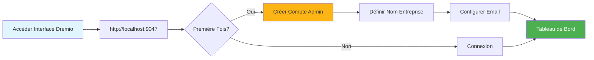
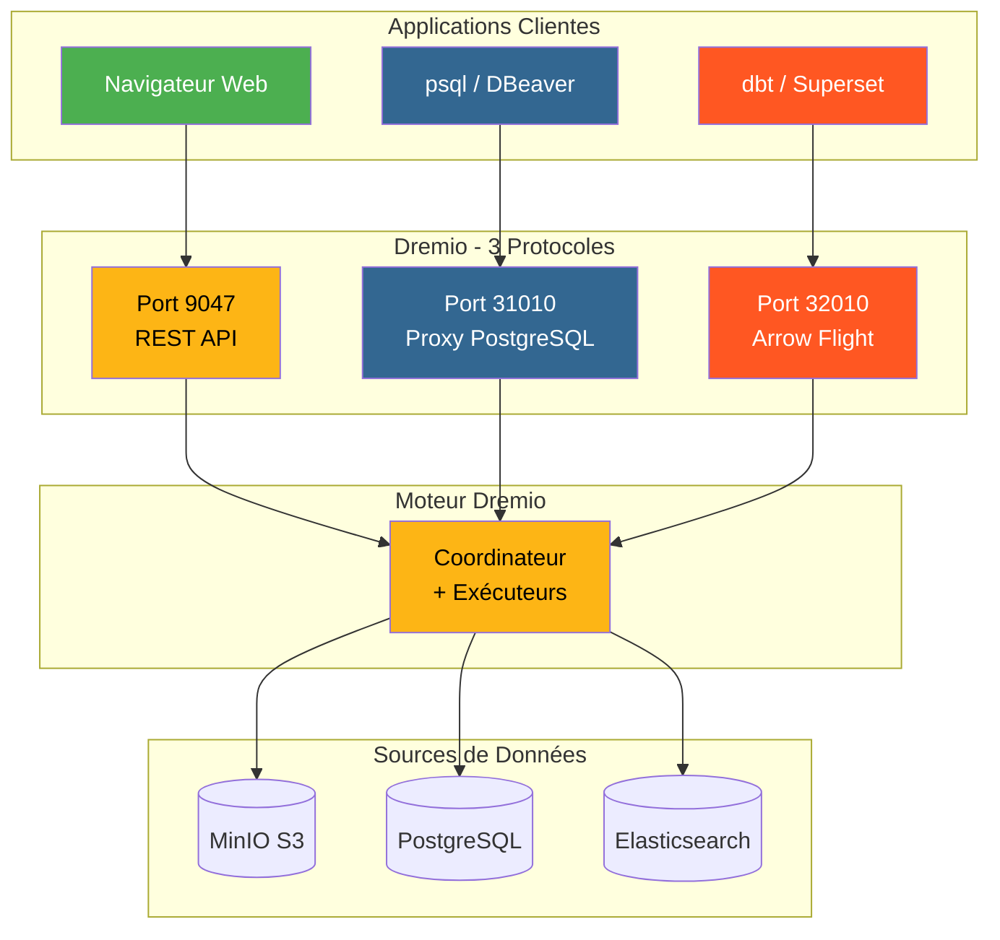
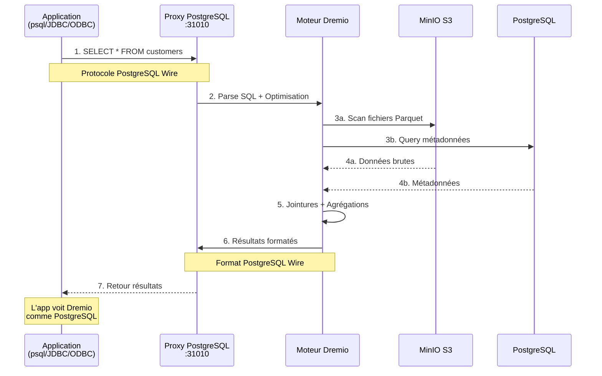
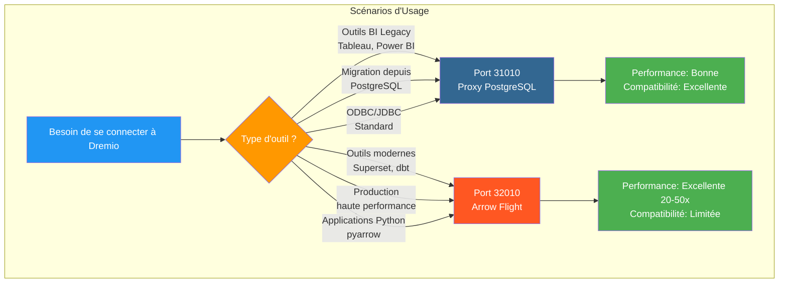
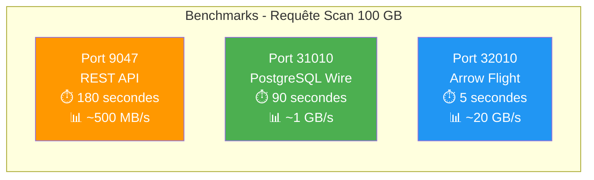
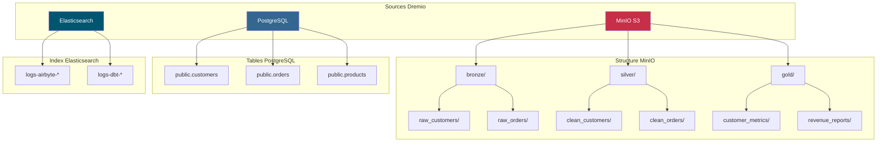
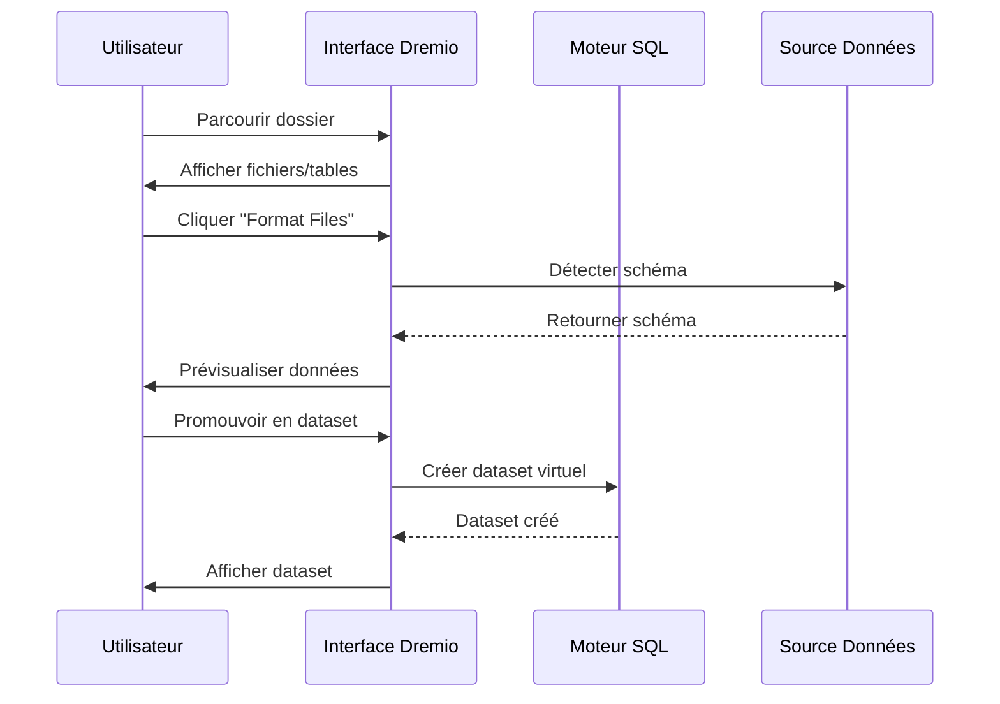
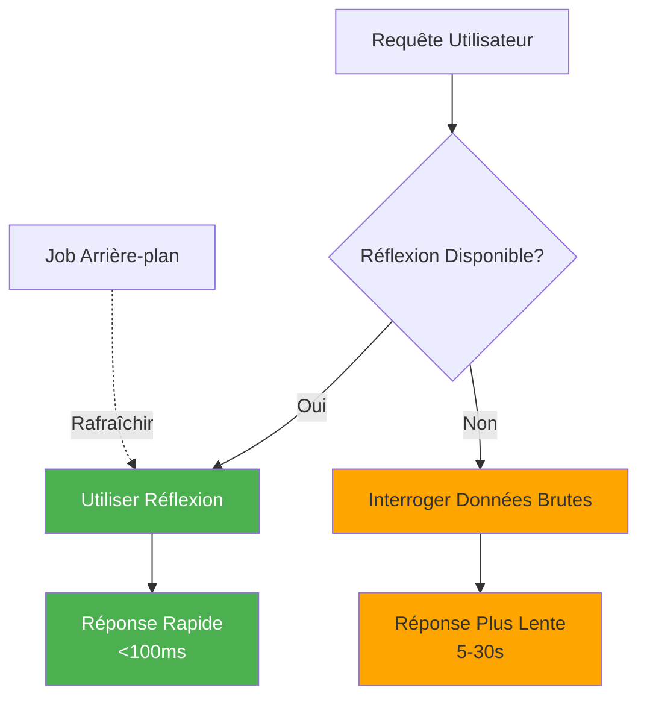

# Guide de Configuration Dremio

**Version**: 3.2.0  
**Dernière Mise à Jour**: 16 octobre 2025  
**Langue**: Français

## Table des Matières

1. [Vue d'ensemble](#vue-densemble)
2. [Configuration Initiale](#configuration-initiale)
3. [Configuration des Sources de Données](#configuration-des-sources-de-données)
4. [Datasets Virtuels](#datasets-virtuels)
5. [Réflexions (Accélération Requêtes)](#réflexions-accélération-requêtes)
6. [Sécurité et Contrôle d'Accès](#sécurité-et-contrôle-daccès)
7. [Optimisation Performance](#optimisation-performance)
8. [Intégration avec dbt](#intégration-avec-dbt)
9. [Surveillance et Maintenance](#surveillance-et-maintenance)
10. [Dépannage](#dépannage)

---

## Vue d'ensemble

Dremio est la plateforme data lakehouse qui fournit une interface unifiée pour interroger les données à travers plusieurs sources. Ce guide couvre tout, depuis la configuration initiale jusqu'aux techniques d'optimisation avancées.

### Qu'est-ce que Dremio ?

Dremio combine la flexibilité d'un data lake avec la performance d'un data warehouse :

- **Virtualisation des Données**: Interroger les données sans les déplacer ou les copier
- **Accélération des Requêtes**: Mise en cache automatique avec réflexions
- **Analytique en Self-Service**: Les utilisateurs métiers peuvent explorer directement les données
- **SQL Standard**: Pas de langage de requête propriétaire
- **Apache Arrow**: Format colonnaire haute performance

### Fonctionnalités Clés

| Fonctionnalité | Description | Bénéfice |
|----------------|-------------|----------|
| **Réflexions** | Accélération intelligente des requêtes | Requêtes 10-100x plus rapides |
| **Virtualisation Données** | Vue unifiée sur les sources | Pas de duplication données |
| **Arrow Flight** | Transfert données haute vitesse | 20-50x plus rapide que ODBC/JDBC |
| **Couche Sémantique** | Noms de champs orientés métier | Analytique self-service |
| **Git pour Données** | Contrôle version datasets | Collaboration et rollback |

---

## Configuration Initiale

### Prérequis

Avant de commencer, assurez-vous d'avoir :
- Conteneur Dremio en cours d'exécution (voir [Guide Installation](../getting-started/installation.md))
- Accès aux sources de données (MinIO, PostgreSQL, etc.)
- Identifiants admin

### Première Connexion



#### Étape 1: Accéder Interface Dremio

Ouvrez votre navigateur et accédez à :
```
http://localhost:9047
```

#### Étape 2: Créer Compte Admin

Au premier lancement, vous serez invité à créer un compte admin :

```
Nom d'utilisateur: admin
Prénom: Admin
Nom: Utilisateur
Email: admin@example.com
Mot de passe: [mot de passe sécurisé]
```

**Note de Sécurité**: Utilisez un mot de passe fort avec au moins 12 caractères, incluant majuscules, minuscules, chiffres et caractères spéciaux.

#### Étape 3: Configuration Initiale

```json
{
  "companyName": "Votre Organisation",
  "supportEmail": "support@example.com",
  "supportKey": "votre-clé-support-si-entreprise"
}
```

### Fichiers de Configuration

La configuration de Dremio est gérée via `dremio.conf`:

```conf
# dremio.conf

paths: {
  local: "/opt/dremio/data"
  dist: "dremioS3:///dremio-data"
}

services: {
  coordinator.enabled: true
  coordinator.master.enabled: true
  
  executor.enabled: true
  
  # Paramètres mémoire
  coordinator.master.heap_memory_mb: 4096
  executor.heap_memory_mb: 8192
}

# Configuration réseau
services.coordinator.web.port: 9047
services.coordinator.client.port: 31010
services.coordinator.flight.port: 32010

# Ajustement performance
store.plugin.max_metadata_leaf_columns: 800
planner.enable_broadcast_join: true
planner.slice_target: 100000
```

### Variables d'Environnement

```bash
# Section environment de docker-compose.yml
environment:
  - DREMIO_JAVA_SERVER_EXTRA_OPTS=-Xms2g -Xmx4g
  - DREMIO_JAVA_FLIGHT_EXTRA_OPTS=-Xms1g -Xmx2g
  - DREMIO_MAX_MEMORY_SIZE_MB=8192
  - DREMIO_HOME=/opt/dremio
```

### Connexion via Proxy PostgreSQL

Dremio expose une interface compatible PostgreSQL sur le port 31010, permettant aux outils compatibles PostgreSQL de se connecter sans modifications.

#### Architecture des Connexions Dremio



#### Flux de Requête via Proxy PostgreSQL



#### Configuration du Proxy

Le proxy PostgreSQL est automatiquement activé dans `dremio.conf`:

```conf
# Configuration du proxy PostgreSQL (ODBC/JDBC)
services.coordinator.client.port: 31010
```

#### Connexion avec psql

```bash
# Connexion directe avec psql
psql -h localhost -p 31010 -U admin -d datalake

# Exemple de requête
psql -h localhost -p 31010 -U admin -d datalake -c "SELECT * FROM MinIO.datalake.customers LIMIT 10;"
```

#### Connexion avec DBeaver / pgAdmin

Configuration de connexion:

```yaml
Type: PostgreSQL
Host: localhost
Port: 31010
Database: datalake
Username: admin
Password: <votre-mot-de-passe>
SSL: Désactivé (en développement)
```

#### Chaînes de Connexion

**JDBC:**
```java
String url = "jdbc:postgresql://localhost:31010/datalake";
Properties props = new Properties();
props.setProperty("user", "admin");
props.setProperty("password", "votre-mot-de-passe");
Connection conn = DriverManager.getConnection(url, props);
```

**ODBC (DSN):**
```ini
[Dremio via PostgreSQL]
Driver=PostgreSQL Unicode
Server=localhost
Port=31010
Database=datalake
Username=admin
Password=<votre-mot-de-passe>
SSLMode=disable
```

**Python (psycopg2):**
```python
import psycopg2

conn = psycopg2.connect(
    host="localhost",
    port=31010,
    database="datalake",
    user="admin",
    password="votre-mot-de-passe"
)

cursor = conn.cursor()
cursor.execute("SELECT * FROM MinIO.datalake.customers LIMIT 10")
rows = cursor.fetchall()
```

#### Quand Utiliser le Proxy PostgreSQL



| Scénario | Utiliser Proxy PostgreSQL | Utiliser Arrow Flight |
|----------|---------------------------|----------------------|
| **Outils BI Legacy** (ne supportant pas Arrow Flight) | ✅ Oui | ❌ Non |
| **Migration depuis PostgreSQL** (code existant JDBC/ODBC) | ✅ Oui | ❌ Non |
| **Production haute performance** | ❌ Non | ✅ Oui (20-50x plus rapide) |
| **Superset, dbt, outils modernes** | ❌ Non | ✅ Oui |
| **Développement/test rapide** | ✅ Oui (familier) | ⚠️ Les deux OK |

#### Comparaison Performance des 3 Ports



**Recommandation**: Utilisez le proxy PostgreSQL (port 31010) pour la **compatibilité** et Arrow Flight (port 32010) pour la **performance en production**.

---

## Configuration des Sources de Données

### Ajouter Source MinIO S3

MinIO est votre stockage principal de data lake.

#### Étape 1: Naviguer vers Sources

```
Interface Dremio → Datasets → Add Source → Object Storage → Amazon S3
```

#### Étape 2: Configurer Connexion S3

```json
{
  "name": "MinIO",
  "config": {
    "credentialType": "ACCESS_KEY",
    "accessKey": "minioadmin",
    "accessSecret": "minioadmin",
    "secure": false,
    "externalBucketList": [
      "datalake"
    ],
    "enableAsync": true,
    "compatibilityMode": true,
    "rootPath": "/",
    "defaultCtasFormat": "PARQUET",
    "propertyList": [
      {
        "name": "fs.s3a.path.style.access",
        "value": "true"
      },
      {
        "name": "fs.s3a.endpoint",
        "value": "minio:9000"
      },
      {
        "name": "dremio.s3.compat",
        "value": "true"
      }
    ]
  }
}
```

#### Étape 3: Tester Connexion

```sql
-- Requête test pour vérifier connexion MinIO
SELECT * FROM MinIO.datalake.bronze.customers LIMIT 10;
```

**Résultat Attendu**:
```
customer_id | name           | email
------------|----------------|------------------
1           | John Doe       | john@example.com
2           | Jane Smith     | jane@example.com
...
```

### Ajouter Source PostgreSQL

#### Configuration

```
Interface Dremio → Datasets → Add Source → Relational → PostgreSQL
```

```json
{
  "name": "PostgreSQL",
  "config": {
    "hostname": "postgres",
    "port": "5432",
    "databaseName": "datawarehouse",
    "username": "postgres",
    "password": "postgres",
    "authenticationType": "MASTER",
    "fetchSize": 2000,
    "encryptionValidationMode": "CERTIFICATE_AND_HOSTNAME_VALIDATION"
  }
}
```

### Ajouter Source Elasticsearch

```json
{
  "name": "Elasticsearch",
  "config": {
    "hostList": [
      {"hostname": "elasticsearch", "port": 9200}
    ],
    "authenticationType": "ANONYMOUS",
    "scrollSize": 4000,
    "scrollTimeout": 60000,
    "scriptsEnabled": true,
    "showHiddenIndices": false,
    "showIdColumn": false
  }
}
```

### Organisation des Sources



---

## Datasets Virtuels

Les datasets virtuels vous permettent de créer des vues transformées et réutilisables de vos données.

### Créer des Datasets Virtuels

#### Depuis Éditeur SQL

```sql
-- Créer dataset jointif
SELECT 
    c.customer_id,
    c.name,
    c.email,
    c.state,
    COUNT(o.order_id) as total_orders,
    SUM(o.amount) as lifetime_value
FROM MinIO.datalake.silver.customers c
LEFT JOIN MinIO.datalake.silver.orders o
    ON c.customer_id = o.customer_id
GROUP BY c.customer_id, c.name, c.email, c.state;

-- Sauvegarder comme dataset virtuel: "customer_summary"
```

**Emplacement Sauvegarde**:
```
@username → customer_summary
```

#### Depuis Interface



**Étapes**:
1. Naviguer vers source MinIO
2. Parcourir vers `datalake/bronze/customers/`
3. Cliquer bouton "Format Files"
4. Examiner schéma détecté
5. Cliquer "Save" pour promouvoir en dataset

### Organisation des Datasets

Créer structure logique avec Spaces et Folders :

```
Dremio
├── @admin (Espace Personnel)
│   └── dev (Dossier)
│       ├── test_customers
│       └── test_orders
├── Production (Espace Partagé)
│   ├── Dimensions (Dossier)
│   │   ├── dim_customers
│   │   ├── dim_products
│   │   └── dim_dates
│   └── Facts (Dossier)
│       ├── fct_orders
│       ├── fct_revenue
│       └── fct_customer_lifetime_value
└── Analytics (Espace Partagé)
    ├── customer_metrics
    ├── sales_dashboard_data
    └── marketing_attribution
```

### Couche Sémantique

Ajouter noms et descriptions orientés métier :

```sql
-- Noms colonnes techniques originaux
SELECT
    cust_id,
    cust_nm,
    cust_em,
    crt_dt
FROM raw.customers;

-- Créer dataset virtuel avec noms sémantiques
SELECT
    cust_id AS "ID Client",
    cust_nm AS "Nom Client",
    cust_em AS "Adresse Email",
    crt_dt AS "Date Inscription"
FROM raw.customers;
```

**Ajouter Descriptions**:
```
Interface → Dataset → Colonne → Éditer Description

ID Client: Identifiant unique pour chaque client
Nom Client: Nom complet du client
Adresse Email: Email principal pour communication
Date Inscription: Date inscription client sur plateforme
```

---

## Réflexions (Accélération Requêtes)

Les réflexions sont le mécanisme de mise en cache intelligent de Dremio qui améliore considérablement les performances des requêtes.

### Types de Réflexions

#### 1. Réflexions Brutes

Stockent sous-ensemble de colonnes pour récupération rapide :

```sql
-- Créer réflexion brute
CREATE REFLECTION raw_customer_base
ON Production.Dimensions.dim_customers
USING DISPLAY (
    customer_id,
    name,
    email,
    state,
    registration_date
);
```

**Cas d'Usage**:
- Tableaux de bord interrogeant colonnes spécifiques
- Rapports avec sous-ensembles colonnes
- Requêtes exploratoires

#### 2. Réflexions d'Agrégation

Pré-calculent agrégations pour résultats instantanés :

```sql
-- Créer réflexion agrégation
CREATE REFLECTION agg_daily_revenue
ON Production.Facts.fct_orders
USING 
  DIMENSIONS (order_date, product_id, region)
  MEASURES (
    SUM(amount),
    COUNT(*),
    AVG(amount),
    MIN(amount),
    MAX(amount)
  );
```

**Cas d'Usage**:
- Tableaux de bord exécutifs
- Rapports synthétiques
- Analyse de tendances

### Configuration Réflexion



#### Politique de Rafraîchissement

```
Interface → Dataset → Settings → Reflections → Refresh Policy
```

**Options**:
- **Never Refresh**: Données statiques (ex: archives historiques)
- **Refresh Every [1 hour]**: Mises à jour périodiques
- **Refresh When Dataset Changes**: Sync temps réel

```json
{
  "refreshPolicy": {
    "method": "PERIOD",
    "refreshPeriod": 3600000,  // 1 heure en millisecondes
    "gracePeriod": 10800000    // 3 heures
  }
}
```

#### Politique d'Expiration

```json
{
  "expirationPolicy": {
    "method": "NEVER",
    // ou
    "method": "AFTER_PERIOD",
    "expirationPeriod": 604800000  // 7 jours
  }
}
```

### Bonnes Pratiques pour Réflexions

#### 1. Commencer par Requêtes Haute Valeur

Identifier requêtes lentes depuis historique :

```sql
-- Interroger historique jobs pour trouver requêtes lentes
SELECT 
    query_text,
    execution_time_ms,
    dataset_path
FROM sys.jobs
WHERE execution_time_ms > 5000  -- Plus lent que 5 secondes
ORDER BY execution_time_ms DESC
LIMIT 100;
```

#### 2. Créer Réflexions Ciblées

```sql
-- Mauvais: Réflexion avec trop de dimensions
CREATE REFLECTION too_broad
USING DIMENSIONS (col1, col2, col3, col4, col5, col6)
MEASURES (SUM(amount));

-- Bon: Réflexion ciblée pour cas d'usage spécifique
CREATE REFLECTION targeted
USING DIMENSIONS (order_date, product_category)
MEASURES (SUM(revenue), COUNT(DISTINCT customer_id));
```

#### 3. Surveiller Couverture Réflexion

```sql
-- Vérifier quelles requêtes sont accélérées
SELECT 
    query_text,
    acceleration_profile.accelerated,
    acceleration_profile.reflection_ids
FROM sys.jobs
WHERE start_time > CURRENT_DATE - INTERVAL '7' DAY;
```

### Impact Performance Réflexions

| Taille Dataset | Type Requête | Sans Réflexion | Avec Réflexion | Accélération |
|----------------|--------------|----------------|----------------|--------------|
| 1M lignes | SELECT Simple | 500ms | 50ms | 10x |
| 10M lignes | Agrégation | 15s | 200ms | 75x |
| 100M lignes | JOIN Complexe | 2 min | 1s | 120x |
| 1B lignes | GROUP BY | 10 min | 5s | 120x |

---

## Sécurité et Contrôle d'Accès

### Gestion des Utilisateurs

#### Créer Utilisateurs

```
Interface → Account Settings → Users → Add User
```

```json
{
  "username": "analyst_user",
  "firstName": "Data",
  "lastName": "Analyst",
  "email": "analyst@example.com",
  "password": "secure_password"
}
```

#### Rôles Utilisateur

| Rôle | Permissions | Cas d'Usage |
|------|-------------|-------------|
| **Admin** | Accès complet | Administration système |
| **User** | Requêter, créer datasets personnels | Analystes, data scientists |
| **Limited User** | Requête uniquement, pas création dataset | Utilisateurs métier, viewers |

### Permissions Espace

```
Interface → Space → Settings → Privileges
```

**Types de Permission**:
- **View**: Peut voir et interroger datasets
- **Modify**: Peut éditer définitions dataset
- **Manage Grants**: Peut gérer permissions
- **Owner**: Contrôle complet

**Exemple**:
```
Espace: Production
├── Équipe Analytics → View, Modify
├── Data Engineers → Owner
└── Exécutifs → View
```

### Sécurité Niveau Ligne

Implémenter filtrage niveau ligne :

```sql
-- Créer vue avec filtre niveau ligne
CREATE VDS customer_data_filtered AS
SELECT *
FROM Production.Dimensions.dim_customers
WHERE 
  CASE 
    WHEN CURRENT_USER = 'admin' THEN TRUE
    WHEN region = (
      SELECT home_region 
      FROM users 
      WHERE username = CURRENT_USER
    ) THEN TRUE
    ELSE FALSE
  END;
```

### Sécurité Niveau Colonne

Masquer colonnes sensibles :

```sql
-- Masquer données sensibles pour utilisateurs non-admin
CREATE VDS customer_data_masked AS
SELECT
    customer_id,
    name,
    CASE 
      WHEN CURRENT_USER IN ('admin', 'data_engineer')
      THEN email
      ELSE CONCAT(SUBSTRING(email, 1, 3), '***@***.com')
    END AS email,
    state
FROM Production.Dimensions.dim_customers;
```

### Intégration OAuth

```conf
# dremio.conf
services.coordinator.web.auth.type: "oauth"
services.coordinator.web.auth.oauth.providerId: "okta"
services.coordinator.web.auth.oauth.clientId: "your-client-id"
services.coordinator.web.auth.oauth.clientSecret: "your-client-secret"
services.coordinator.web.auth.oauth.authorizeUrl: "https://your-domain.okta.com/oauth2/v1/authorize"
services.coordinator.web.auth.oauth.tokenUrl: "https://your-domain.okta.com/oauth2/v1/token"
```

---

## Optimisation Performance

### Techniques d'Optimisation Requête

#### 1. Partition Pruning

```sql
-- Mauvais: Scanne toutes les données
SELECT * FROM orders
WHERE amount > 100;

-- Bon: Élague partitions
SELECT * FROM orders
WHERE order_date >= '2025-10-01'
  AND order_date < '2025-11-01'
  AND amount > 100;
```

#### 2. Column Pruning

```sql
-- Mauvais: Lit toutes les colonnes
SELECT * FROM large_table LIMIT 100;

-- Bon: Lit uniquement colonnes nécessaires
SELECT customer_id, name, email 
FROM large_table 
LIMIT 100;
```

#### 3. Predicate Pushdown

```sql
-- Filtres poussés vers couche stockage
SELECT c.name, o.amount
FROM customers c
JOIN orders o ON c.customer_id = o.customer_id
WHERE o.order_date >= CURRENT_DATE - INTERVAL '30' DAY;
-- Filtre appliqué avant jointure
```

#### 4. Optimisation Jointure

```sql
-- Utiliser broadcast join pour petites dimensions
SELECT /*+ BROADCAST(d) */
    f.order_id,
    d.product_name,
    f.amount
FROM facts.orders f
JOIN dimensions.products d
    ON f.product_id = d.product_id;
```

### Configuration Mémoire

```conf
# dremio.conf

# Augmenter mémoire pour grandes requêtes
services.executor.heap_memory_mb: 32768

# Configurer spill to disk
spill.directory: "/opt/dremio/spill"
spill.enable: true

# Limites mémoire requête
planner.memory.max_query_memory_per_node: 10737418240  # 10GB
planner.memory.query_max_cost: 1000000000
```

### Dimensionnement Cluster

| Type Charge | Coordinateur | Exécuteurs | Cluster Total |
|-------------|--------------|------------|---------------|
| **Petit** | 4 CPU, 16 Go | 2x (8 CPU, 32 Go) | 20 CPU, 80 Go |
| **Moyen** | 8 CPU, 32 Go | 4x (16 CPU, 64 Go) | 72 CPU, 288 Go |
| **Grand** | 16 CPU, 64 Go | 8x (32 CPU, 128 Go) | 272 CPU, 1088 Go |

### Surveillance Performance

```sql
-- Analyser performance requête
SELECT 
    query_id,
    query_text,
    start_time,
    execution_time_ms / 1000.0 AS execution_time_seconds,
    planner_estimated_cost,
    rows_returned,
    acceleration_profile.accelerated
FROM sys.jobs
WHERE start_time > CURRENT_DATE - INTERVAL '1' DAY
ORDER BY execution_time_ms DESC
LIMIT 20;
```

---

## Intégration avec dbt

### Dremio comme Cible dbt

Configurer `profiles.yml`:

```yaml
# profiles.yml
dremio_project:
  target: dev
  outputs:
    dev:
      type: dremio
      threads: 4
      host: localhost
      port: 9047
      username: admin
      password: "{{ env_var('DREMIO_PASSWORD') }}"
      use_ssl: false
      space: "@admin"
      
    prod:
      type: dremio
      threads: 8
      host: dremio.example.com
      port: 443
      username: dbt_service_account
      password: "{{ env_var('DREMIO_PASSWORD') }}"
      use_ssl: true
      space: "Production"
```

### Modèles dbt sur Dremio

```sql
-- models/staging/stg_customers.sql
{{
    config(
        materialized='view',
        alias='stg_customers'
    )
}}

SELECT
    customer_id,
    TRIM(UPPER(name)) AS customer_name,
    LOWER(email) AS email,
    state,
    created_at
FROM {{ source('minio', 'raw_customers') }}
WHERE customer_id IS NOT NULL
```

### Exploiter Réflexions dans dbt

```sql
-- models/marts/fct_customer_metrics.sql
{{
    config(
        materialized='table',
        post_hook=[
            "ALTER VDS {{ this }} ENABLE RAW REFLECTION",
            "ALTER VDS {{ this }} ENABLE AGGREGATION REFLECTION 
             USING DIMENSIONS (customer_id, registration_month) 
             MEASURES (SUM(lifetime_value), COUNT(*))"
        ]
    )
}}

SELECT
    customer_id,
    DATE_TRUNC('month', registration_date) AS registration_month,
    COUNT(DISTINCT order_id) AS total_orders,
    SUM(order_amount) AS lifetime_value
FROM {{ ref('int_customer_orders') }}
GROUP BY customer_id, DATE_TRUNC('month', registration_date)
```

---

## Surveillance et Maintenance

### Métriques Clés à Surveiller

```yaml
metrics:
  - name: Performance Requête
    query: "SELECT AVG(execution_time_ms) FROM sys.jobs WHERE start_time > NOW() - INTERVAL '1' HOUR"
    threshold: 5000  # Alerte si moyenne > 5 secondes
    
  - name: Couverture Réflexion
    query: "SELECT COUNT(*) FILTER (WHERE accelerated = true) * 100.0 / COUNT(*) FROM sys.jobs WHERE start_time > NOW() - INTERVAL '1' DAY"
    threshold: 80  # Alerte si couverture < 80%
    
  - name: Requêtes Échouées
    query: "SELECT COUNT(*) FROM sys.jobs WHERE query_state = 'FAILED' AND start_time > NOW() - INTERVAL '1' HOUR"
    threshold: 10  # Alerte si > 10 échecs par heure
```

### Tâches de Maintenance

#### 1. Rafraîchir Réflexions

```sql
-- Rafraîchir manuellement réflexion
ALTER REFLECTION reflection_id REFRESH;

-- Reconstruire toutes réflexions pour dataset
ALTER VDS Production.Facts.fct_orders 
REFRESH ALL REFLECTIONS;
```

#### 2. Nettoyer Anciennes Données

```sql
-- Nettoyer historique requêtes
DELETE FROM sys.jobs
WHERE start_time < CURRENT_DATE - INTERVAL '90' DAY;

-- Compacter métadonnées (Enterprise uniquement)
VACUUM CATALOG;
```

#### 3. Mettre à Jour Statistiques

```sql
-- Rafraîchir statistiques table
ANALYZE TABLE MinIO.datalake.silver.customers;

-- Mettre à jour métadonnées dataset
REFRESH DATASET MinIO.datalake.silver.customers;
```

---

## Dépannage

### Problèmes Courants

#### Problème 1: Performance Requête Lente

**Symptômes**: Requêtes prenant minutes au lieu de secondes

**Diagnostic**:
```sql
-- Vérifier profil requête
SELECT * FROM sys.jobs WHERE job_id = 'your-job-id';

-- Vérifier si réflexion utilisée
SELECT acceleration_profile FROM sys.jobs WHERE job_id = 'your-job-id';
```

**Solutions**:
1. Créer réflexions appropriées
2. Ajouter filtres partition pruning
3. Augmenter mémoire exécuteur
4. Activer mise en file requêtes

#### Problème 2: Réflexion Ne Se Construit Pas

**Symptômes**: Réflexion bloquée en état "REFRESHING"

**Diagnostic**:
```sql
-- Vérifier statut réflexion
SELECT * FROM sys.reflections WHERE status != 'ACTIVE';

-- Vérifier erreurs réflexion
SELECT * FROM sys.reflection_dependencies;
```

**Solutions**:
1. Vérifier données source pour changements schéma
2. Vérifier espace disque suffisant
3. Augmenter timeout construction réflexion
4. Désactiver et réactiver réflexion

#### Problème 3: Timeout Connexion

**Symptômes**: Erreurs "Connection timeout" lors interrogation sources

**Solutions**:
```conf
# dremio.conf
store.plugin.keep_alive_ms: 30000
store.plugin.timeout_ms: 120000
```

#### Problème 4: Manque de Mémoire

**Symptômes**: "OutOfMemoryError" dans logs

**Solutions**:
```conf
# Augmenter taille heap
services.executor.heap_memory_mb: 65536

# Activer spill to disk
spill.enable: true
spill.directory: "/opt/dremio/spill"
```

### Requêtes Diagnostic

```sql
-- Requêtes actives
SELECT query_id, query_text, start_time, user_name
FROM sys.jobs
WHERE query_state = 'RUNNING';

-- Utilisation ressources par utilisateur
SELECT 
    user_name,
    COUNT(*) as query_count,
    AVG(execution_time_ms) as avg_execution_ms,
    SUM(rows_returned) as total_rows
FROM sys.jobs
WHERE start_time > CURRENT_DATE
GROUP BY user_name;

-- Modèles accès dataset
SELECT 
    dataset_path,
    COUNT(*) as access_count,
    COUNT(DISTINCT user_name) as unique_users
FROM sys.jobs
WHERE start_time > CURRENT_DATE - INTERVAL '7' DAY
GROUP BY dataset_path
ORDER BY access_count DESC
LIMIT 20;
```

---

## Résumé

Ce guide complet couvre :

- **Configuration Initiale**: Configuration première fois, création compte admin, fichiers configuration
- **Sources de Données**: Connexion MinIO, PostgreSQL et Elasticsearch
- **Datasets Virtuels**: Création vues transformées réutilisables avec couche sémantique
- **Réflexions**: Réflexions brutes et agrégation pour accélération requête 10-100x
- **Sécurité**: Gestion utilisateurs, permissions espace, sécurité niveau ligne/colonne
- **Performance**: Optimisation requête, configuration mémoire, dimensionnement cluster
- **Intégration dbt**: Utilisation Dremio comme cible dbt avec gestion réflexions
- **Surveillance**: Métriques clés, tâches maintenance, requêtes diagnostic
- **Dépannage**: Problèmes courants et solutions

Points clés à retenir :
- Dremio fournit interface SQL unifiée sur toutes sources données
- Réflexions essentielles pour performance production
- Configuration sécurité appropriée permet analytique self-service
- Surveillance régulière garantit performance optimale

**Documentation Associée:**
- [Composants Architecture](../architecture/components.md)
- [Flux de Données](../architecture/data-flow.md)
- [Guide Développement dbt](./dbt-development.md)
- [Intégration Airbyte](./airbyte-integration.md)

---

**Version**: 3.2.0  
**Dernière Mise à Jour**: 16 octobre 2025
