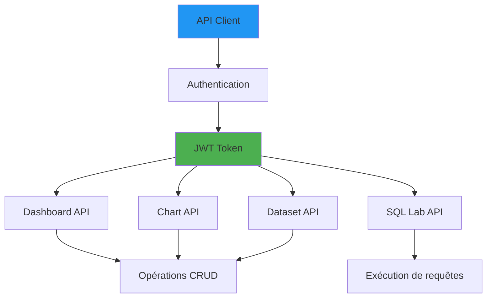

# सुपरसेट एपीआई संदर्भ

**संस्करण**: 3.2.0  
**अंतिम अद्यतन**: 16 अक्टूबर, 2025  
**भाषा**: फ्रेंच

## विषयसूची

1. [अवलोकन](#अवलोकन)
2. [प्रमाणीकरण](#प्रमाणीकरण)
3. [डैशबोर्ड](#डैशबोर्ड)
4. [ग्राफिक्स](#ग्राफिक्स)
5. [डेटासेट](#डेटासेट)
6. [एसक्यूएल लैब](#एसक्यूएल-लैब)
7. [सुरक्षा](#सुरक्षा)
8. [पायथन उदाहरण](#पायथन-उदाहरण)

---

## अवलोकन

अपाचे सुपरसेट प्रोग्रामेटिक एक्सेस के लिए एक REST API प्रदान करता है।

**बेस यूआरएल**: `http://localhost:8088/api/v1`

### एपीआई आर्किटेक्चर



---

## प्रमाणीकरण

### लॉग इन करें

**समाप्ति बिंदु**: `POST /api/v1/security/login`

```bash
curl -X POST http://localhost:8088/api/v1/security/login \
  -H "Content-Type: application/json" \
  -d '{
    "username": "admin",
    "password": "admin",
    "provider": "db",
    "refresh": true
  }'
```

**उत्तर** :
```json
{
  "access_token": "eyJhbGciOiJIUzI1NiIsInR5cCI6IkpXVCJ9...",
  "refresh_token": "eyJhbGciOiJIUzI1NiIsInR5cCI6IkpXVCJ9..."
}
```

### टोकन ताज़ा करें

**समाप्ति बिंदु**: `POST /api/v1/security/refresh`

```bash
curl -X POST http://localhost:8088/api/v1/security/refresh \
  -H "Content-Type: application/json" \
  -H "Authorization: Bearer <refresh_token>"
```

### पायथन प्रमाणीकरण सहायक

```python
import requests

class SupersetClient:
    """Client API Superset avec authentification"""
    
    def __init__(self, base_url: str = "http://localhost:8088",
                 username: str = "admin", password: str = "admin"):
        self.base_url = base_url
        self.username = username
        self.password = password
        self.access_token = None
        self.refresh_token = None
        
        self._authenticate()
    
    def _authenticate(self):
        """S'authentifier et obtenir les tokens"""
        response = requests.post(
            f"{self.base_url}/api/v1/security/login",
            json={
                "username": self.username,
                "password": self.password,
                "provider": "db",
                "refresh": True
            }
        )
        
        response.raise_for_status()
        data = response.json()
        
        self.access_token = data["access_token"]
        self.refresh_token = data["refresh_token"]
    
    def _get_headers(self):
        """Obtenir les headers avec le token d'authentification"""
        return {
            "Authorization": f"Bearer {self.access_token}",
            "Content-Type": "application/json"
        }
    
    def get(self, endpoint: str):
        """Requête GET"""
        response = requests.get(
            f"{self.base_url}{endpoint}",
            headers=self._get_headers()
        )
        response.raise_for_status()
        return response.json()
    
    def post(self, endpoint: str, data: dict):
        """Requête POST"""
        response = requests.post(
            f"{self.base_url}{endpoint}",
            headers=self._get_headers(),
            json=data
        )
        response.raise_for_status()
        return response.json()
    
    def put(self, endpoint: str, data: dict):
        """Requête PUT"""
        response = requests.put(
            f"{self.base_url}{endpoint}",
            headers=self._get_headers(),
            json=data
        )
        response.raise_for_status()
        return response.json()
    
    def delete(self, endpoint: str):
        """Requête DELETE"""
        response = requests.delete(
            f"{self.base_url}{endpoint}",
            headers=self._get_headers()
        )
        response.raise_for_status()
        return response.json()

# Utilisation
client = SupersetClient()
```

---

## डैशबोर्ड

### सूची डैशबोर्ड

**समाप्ति बिंदु**: `GET /api/v1/dashboard/`

```bash
curl -X GET "http://localhost:8088/api/v1/dashboard/?q=(page_size:20)" \
  -H "Authorization: Bearer $TOKEN"
```

**उत्तर** :
```json
{
  "count": 5,
  "result": [
    {
      "id": 1,
      "dashboard_title": "Sales Overview",
      "slug": "sales-overview",
      "published": true,
      "owners": [{"id": 1, "username": "admin"}]
    }
  ]
}
```

### एक डैशबोर्ड प्राप्त करें

**समाप्ति बिंदु**: `GET /api/v1/dashboard/{id}`

```bash
curl -X GET http://localhost:8088/api/v1/dashboard/1 \
  -H "Authorization: Bearer $TOKEN"
```

**उत्तर** :
```json
{
  "id": 1,
  "dashboard_title": "Sales Overview",
  "position_json": {...},
  "json_metadata": {...},
  "slices": [
    {"id": 10, "slice_name": "Revenue Trend"},
    {"id": 11, "slice_name": "Top Products"}
  ]
}
```

### एक डैशबोर्ड बनाएं

**समाप्ति बिंदु**: `POST /api/v1/dashboard/`

```bash
curl -X POST http://localhost:8088/api/v1/dashboard/ \
  -H "Authorization: Bearer $TOKEN" \
  -H "Content-Type: application/json" \
  -d '{
    "dashboard_title": "New Dashboard",
    "slug": "new-dashboard",
    "published": false,
    "owners": [1]
  }'
```

### पायथन उदाहरण

```python
def create_dashboard(client: SupersetClient, title: str, charts: list):
    """Créer un dashboard avec des graphiques"""
    
    # Créer le dashboard
    dashboard = client.post("/api/v1/dashboard/", {
        "dashboard_title": title,
        "slug": title.lower().replace(" ", "-"),
        "published": False,
        "owners": [1]
    })
    
    dashboard_id = dashboard["id"]
    
    # Positionner les graphiques (grille de 12 colonnes)
    position_json = {
        "DASHBOARD_VERSION_KEY": "v2",
        "GRID_ID": {
            "type": "GRID",
            "id": "GRID_ID",
            "children": []
        }
    }
    
    # Ajouter chaque graphique
    row = 0
    for i, chart_id in enumerate(charts):
        chart_key = f"CHART-{chart_id}"
        position_json["GRID_ID"]["children"].append(chart_key)
        position_json[chart_key] = {
            "type": "CHART",
            "id": chart_id,
            "meta": {
                "width": 6,  # Demi-largeur
                "height": 50,
                "chartId": chart_id
            },
            "parents": ["ROOT_ID", "GRID_ID"]
        }
        
        if i % 2 == 0:
            row += 50
    
    # Mettre à jour le dashboard avec les positions
    client.put(f"/api/v1/dashboard/{dashboard_id}", {
        "position_json": position_json
    })
    
    return dashboard

# Utilisation
dashboard = create_dashboard(
    client,
    title="Sales Dashboard",
    charts=[10, 11, 12]
)
```

### डैशबोर्ड अपडेट करें

**समाप्ति बिंदु**: `PUT /api/v1/dashboard/{id}`

```python
def publish_dashboard(client: SupersetClient, dashboard_id: int):
    """Publier un dashboard"""
    return client.put(f"/api/v1/dashboard/{dashboard_id}", {
        "published": True
    })
```

### डैशबोर्ड हटाएं

**समाप्ति बिंदु**: `DELETE /api/v1/dashboard/{id}`

```bash
curl -X DELETE http://localhost:8088/api/v1/dashboard/1 \
  -H "Authorization: Bearer $TOKEN"
```

### एक डैशबोर्ड निर्यात करें

**समाप्ति बिंदु**: `GET /api/v1/dashboard/export/`

```bash
curl -X GET "http://localhost:8088/api/v1/dashboard/export/?q=!(1,2,3)" \
  -H "Authorization: Bearer $TOKEN" \
  -o dashboards.zip
```

### एक डैशबोर्ड आयात करें

**समाप्ति बिंदु**: `POST /api/v1/dashboard/import/`

```bash
curl -X POST http://localhost:8088/api/v1/dashboard/import/ \
  -H "Authorization: Bearer $TOKEN" \
  -F "formData=@dashboards.zip"
```

---

## ग्राफ़िक्स

### सूची ग्राफ़िक्स

**समाप्ति बिंदु**: `GET /api/v1/chart/`

```bash
curl -X GET "http://localhost:8088/api/v1/chart/?q=(page_size:20)" \
  -H "Authorization: Bearer $TOKEN"
```

### एक चार्ट प्राप्त करें

**समाप्ति बिंदु**: `GET /api/v1/chart/{id}`

```bash
curl -X GET http://localhost:8088/api/v1/chart/10 \
  -H "Authorization: Bearer $TOKEN"
```

**उत्तर** :
```json
{
  "id": 10,
  "slice_name": "Revenue Trend",
  "viz_type": "line",
  "datasource_id": 5,
  "datasource_type": "table",
  "params": {
    "metrics": ["sum__amount"],
    "groupby": ["order_date"],
    "time_range": "Last 30 days"
  }
}
```

### एक चार्ट बनाएं

**समाप्ति बिंदु**: `POST /api/v1/chart/`

```python
def create_line_chart(client: SupersetClient, dataset_id: int, 
                      name: str, metric: str, dimension: str):
    """Créer un graphique en courbes"""
    
    chart_config = {
        "slice_name": name,
        "viz_type": "line",
        "datasource_id": dataset_id,
        "datasource_type": "table",
        "params": json.dumps({
            "metrics": [metric],
            "groupby": [dimension],
            "time_range": "Last 30 days",
            "row_limit": 10000,
            "x_axis_format": "smart_date",
            "show_legend": True,
            "line_interpolation": "linear"
        })
    }
    
    return client.post("/api/v1/chart/", chart_config)

# Utilisation
chart = create_line_chart(
    client,
    dataset_id=5,
    name="Daily Revenue",
    metric="sum__amount",
    dimension="order_date"
)
```

### चार्ट से डेटा प्राप्त करें

**समाप्ति बिंदु**: `POST /api/v1/chart/data`

```bash
curl -X POST http://localhost:8088/api/v1/chart/data \
  -H "Authorization: Bearer $TOKEN" \
  -H "Content-Type: application/json" \
  -d '{
    "datasource": {
      "id": 5,
      "type": "table"
    },
    "queries": [{
      "columns": ["category"],
      "metrics": ["sum__amount"],
      "filters": [],
      "row_limit": 10
    }]
  }'
```

**उत्तर** :
```json
{
  "result": [{
    "data": [
      {"category": "Electronics", "sum__amount": 150000},
      {"category": "Clothing", "sum__amount": 95000}
    ],
    "colnames": ["category", "sum__amount"],
    "rowcount": 2
  }]
}
```

---

## डेटासेट

### सूची डेटासेट

**समाप्ति बिंदु**: `GET /api/v1/dataset/`

```bash
curl -X GET "http://localhost:8088/api/v1/dataset/" \
  -H "Authorization: Bearer $TOKEN"
```

### एक डेटासेट प्राप्त करें

**समाप्ति बिंदु**: `GET /api/v1/dataset/{id}`

```bash
curl -X GET http://localhost:8088/api/v1/dataset/5 \
  -H "Authorization: Bearer $TOKEN"
```

**उत्तर** :
```json
{
  "id": 5,
  "table_name": "fct_orders",
  "schema": "Production",
  "database": {
    "id": 1,
    "database_name": "Dremio"
  },
  "columns": [
    {
      "column_name": "order_id",
      "type": "INTEGER",
      "is_dttm": false
    },
    {
      "column_name": "order_date",
      "type": "DATE",
      "is_dttm": true
    }
  ],
  "metrics": [
    {
      "metric_name": "count",
      "expression": "COUNT(*)"
    }
  ]
}
```

### एक डेटासेट बनाएं

**समाप्ति बिंदु**: `POST /api/v1/dataset/`

```python
def create_dataset(client: SupersetClient, database_id: int,
                   schema: str, table: str):
    """Créer un dataset à partir d'une table"""
    
    dataset_config = {
        "database": database_id,
        "schema": schema,
        "table_name": table
    }
    
    dataset = client.post("/api/v1/dataset/", dataset_config)
    
    # Rafraîchir les colonnes
    dataset_id = dataset["id"]
    client.put(f"/api/v1/dataset/{dataset_id}/refresh", {})
    
    return dataset

# Utilisation
dataset = create_dataset(
    client,
    database_id=1,
    schema="Production",
    table="fct_orders"
)
```

### एक परिकलित मीट्रिक जोड़ें

**समाप्ति बिंदु**: `POST /api/v1/dataset/{id}/metric`

```python
def add_metric(client: SupersetClient, dataset_id: int,
               name: str, expression: str):
    """Ajouter une métrique calculée au dataset"""
    
    metric_config = {
        "metric_name": name,
        "expression": expression,
        "metric_type": "simple",
        "verbose_name": name,
        "description": f"Metric: {name}"
    }
    
    return client.post(
        f"/api/v1/dataset/{dataset_id}/metric",
        metric_config
    )

# Utilisation
add_metric(
    client,
    dataset_id=5,
    name="total_revenue",
    expression="SUM(amount)"
)

add_metric(
    client,
    dataset_id=5,
    name="avg_order_value",
    expression="AVG(amount)"
)
```

---

## एसक्यूएल लैब

### SQL क्वेरी निष्पादित करें

**समाप्ति बिंदु**: `POST /api/v1/sqllab/execute/`

```bash
curl -X POST http://localhost:8088/api/v1/sqllab/execute/ \
  -H "Authorization: Bearer $TOKEN" \
  -H "Content-Type: application/json" \
  -d '{
    "database_id": 1,
    "sql": "SELECT * FROM Production.Facts.fct_orders LIMIT 10",
    "schema": "Production",
    "runAsync": false
  }'
```

**उत्तर** :
```json
{
  "query_id": 123,
  "status": "success",
  "data": [
    {"order_id": 1, "amount": 99.99},
    {"order_id": 2, "amount": 149.99}
  ],
  "columns": [
    {"name": "order_id", "type": "INTEGER"},
    {"name": "amount", "type": "DECIMAL"}
  ]
}
```

### पायथन एसक्यूएल निष्पादन

```python
def execute_sql(client: SupersetClient, database_id: int, sql: str):
    """Exécuter une requête SQL"""
    
    payload = {
        "database_id": database_id,
        "sql": sql,
        "runAsync": False,
        "schema": "Production"
    }
    
    response = client.post("/api/v1/sqllab/execute/", payload)
    
    return response["data"]

# Utilisation
results = execute_sql(
    client,
    database_id=1,
    sql="""
        SELECT 
            DATE_TRUNC('month', order_date) as month,
            SUM(amount) as revenue
        FROM Production.Facts.fct_orders
        WHERE order_date >= '2025-01-01'
        GROUP BY 1
        ORDER BY 1
    """
)

for row in results:
    print(f"{row['month']}: ${row['revenue']:,.2f}")
```

### क्वेरी परिणाम प्राप्त करें

**समाप्ति बिंदु**: `GET /api/v1/sqllab/results/{query_id}`

```bash
curl -X GET http://localhost:8088/api/v1/sqllab/results/123 \
  -H "Authorization: Bearer $TOKEN"
```

---

## सुरक्षा

### अतिथि टोकन

**समाप्ति बिंदु**: `POST /api/v1/security/guest_token/`

```python
def create_guest_token(client: SupersetClient, dashboard_id: int,
                      user: dict, rls: list = None):
    """Créer un token invité pour un dashboard embarqué"""
    
    payload = {
        "user": user,
        "resources": [{
            "type": "dashboard",
            "id": str(dashboard_id)
        }],
        "rls": rls or []
    }
    
    response = client.post("/api/v1/security/guest_token/", payload)
    
    return response["token"]

# Utilisation
token = create_guest_token(
    client,
    dashboard_id=1,
    user={
        "username": "guest_user",
        "first_name": "Guest",
        "last_name": "User"
    },
    rls=[
        {
            "clause": "customer_id = 12345"
        }
    ]
)

# URL d'intégration
embed_url = f"http://localhost:8088/embedded/1?standalone=1&guest_token={token}"
```

### भूमिकाओं की सूची बनाएं

**समाप्ति बिंदु**: `GET /api/v1/security/roles/`

```bash
curl -X GET http://localhost:8088/api/v1/security/roles/ \
  -H "Authorization: Bearer $TOKEN"
```

### एक उपयोगकर्ता बनाएं

**समाप्ति बिंदु**: `POST /api/v1/security/users/`

```python
def create_user(client: SupersetClient, username: str, email: str,
                first_name: str, last_name: str, role_ids: list):
    """Créer un nouvel utilisateur"""
    
    user_config = {
        "username": username,
        "email": email,
        "first_name": first_name,
        "last_name": last_name,
        "active": True,
        "roles": role_ids,
        "password": "default_password"  # L'utilisateur devrait changer
    }
    
    return client.post("/api/v1/security/users/", user_config)

# Utilisation
user = create_user(
    client,
    username="analyst1",
    email="analyst1@company.com",
    first_name="Data",
    last_name="Analyst",
    role_ids=[2]  # Rôle Alpha
)
```

---

## पायथन उदाहरण

### पूर्ण डैशबोर्ड स्वचालन

```python
#!/usr/bin/env python3
"""
Création automatisée de dashboard Superset
"""
import json

def create_sales_dashboard():
    """Créer un dashboard de ventes complet"""
    client = SupersetClient()
    
    # 1. Créer le dataset
    dataset = create_dataset(
        client,
        database_id=1,
        schema="Production",
        table="fct_orders"
    )
    dataset_id = dataset["id"]
    
    # 2. Ajouter les métriques
    add_metric(client, dataset_id, "total_revenue", "SUM(amount)")
    add_metric(client, dataset_id, "order_count", "COUNT(*)")
    add_metric(client, dataset_id, "avg_order_value", "AVG(amount)")
    
    # 3. Créer les graphiques
    chart_ids = []
    
    # Graphique en courbes des revenus
    revenue_chart = create_line_chart(
        client,
        dataset_id=dataset_id,
        name="Revenue Trend",
        metric="total_revenue",
        dimension="order_date"
    )
    chart_ids.append(revenue_chart["id"])
    
    # Graphique en barres du nombre de commandes
    orders_chart = client.post("/api/v1/chart/", {
        "slice_name": "Daily Orders",
        "viz_type": "bar",
        "datasource_id": dataset_id,
        "datasource_type": "table",
        "params": json.dumps({
            "metrics": ["order_count"],
            "groupby": ["order_date"],
            "row_limit": 30
        })
    })
    chart_ids.append(orders_chart["id"])
    
    # Grand nombre pour le revenu total
    big_number = client.post("/api/v1/chart/", {
        "slice_name": "Total Revenue",
        "viz_type": "big_number_total",
        "datasource_id": dataset_id,
        "datasource_type": "table",
        "params": json.dumps({
            "metric": "total_revenue",
            "time_range": "Last 30 days"
        })
    })
    chart_ids.append(big_number["id"])
    
    # 4. Créer le dashboard
    dashboard = create_dashboard(
        client,
        title="Sales Dashboard",
        charts=chart_ids
    )
    
    # 5. Publier
    publish_dashboard(client, dashboard["id"])
    
    print(f"Dashboard created: http://localhost:8088/superset/dashboard/{dashboard['id']}")

if __name__ == "__main__":
    create_sales_dashboard()
```

### डैशबोर्ड का बैच निर्यात

```python
def export_all_dashboards(client: SupersetClient, output_dir: str):
    """Exporter tous les dashboards vers des fichiers"""
    import os
    
    # Obtenir tous les dashboards
    dashboards = client.get("/api/v1/dashboard/")["result"]
    
    for dashboard in dashboards:
        dashboard_id = dashboard["id"]
        title = dashboard["dashboard_title"]
        
        # Exporter le dashboard
        export_data = client.get(
            f"/api/v1/dashboard/export/?q=!({dashboard_id})"
        )
        
        # Sauvegarder dans un fichier
        filename = f"{title.replace(' ', '_')}.zip"
        filepath = os.path.join(output_dir, filename)
        
        with open(filepath, 'wb') as f:
            f.write(export_data)
        
        print(f"Exported: {title} → {filepath}")

# Utilisation
export_all_dashboards(client, "./dashboard_backups")
```

---

## सारांश

इस एपीआई संदर्भ में शामिल है:

- **प्रमाणीकरण**: JWT टोकन पर आधारित प्रमाणीकरण
- **डैशबोर्ड**: सीआरयूडी संचालन, निर्यात/आयात
- **चार्ट**: डेटा बनाएं, अपडेट करें, क्वेरी करें
- **डेटासेट**: तालिकाओं/दृश्यों, मेट्रिक्स का प्रबंधन
- **एसक्यूएल लैब**: क्वेरीज़ को प्रोग्रामेटिक रूप से चलाएँ
- **सुरक्षा**: अतिथि टोकन, उपयोगकर्ता, भूमिकाएँ
- **पायथन उदाहरण**: पूर्ण स्वचालन स्क्रिप्ट

**प्रमुख बिंदु**:
- डैशबोर्ड स्वचालन के लिए एपीआई का उपयोग करें
- अतिथि टोकन सुरक्षित एकीकरण सक्षम करते हैं
- तदर्थ प्रश्नों के लिए एसक्यूएल लैब एपीआई
- संस्करण नियंत्रण के लिए निर्यात/आयात
- परिकलित मेट्रिक्स के साथ डेटासेट बनाएं

**संबंधित दस्तावेज़**:
- [सुपरसेट डैशबोर्ड गाइड](../guides/superset-dashboards.md)
- [आर्किटेक्चर: डेटा प्रवाह](../आर्किटेक्चर/डेटा-फ्लो.एमडी)
- [समस्या निवारण मार्गदर्शिका](../guides/troubleshooting.md)

---

**संस्करण**: 3.2.0  
**अंतिम अद्यतन**: 16 अक्टूबर, 2025