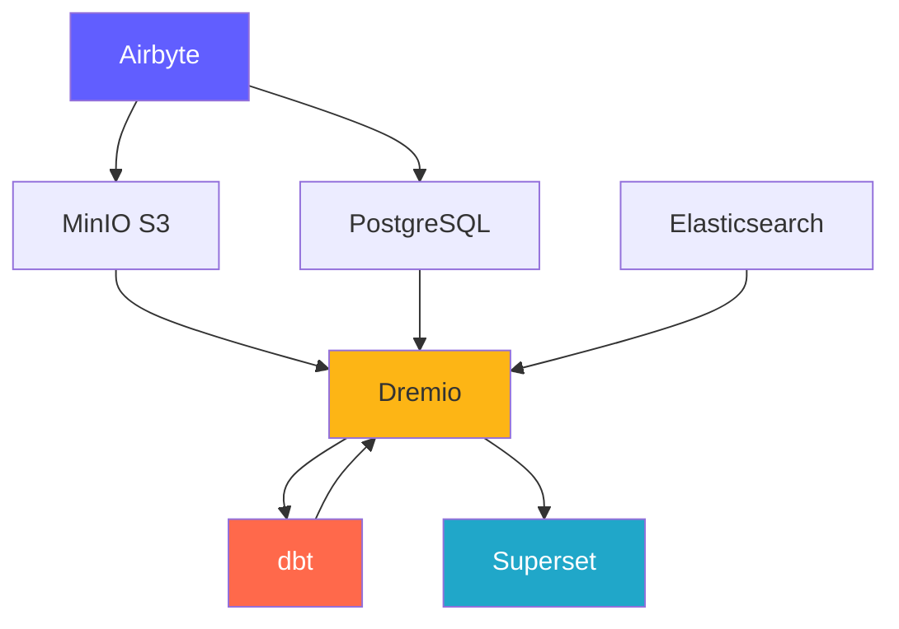
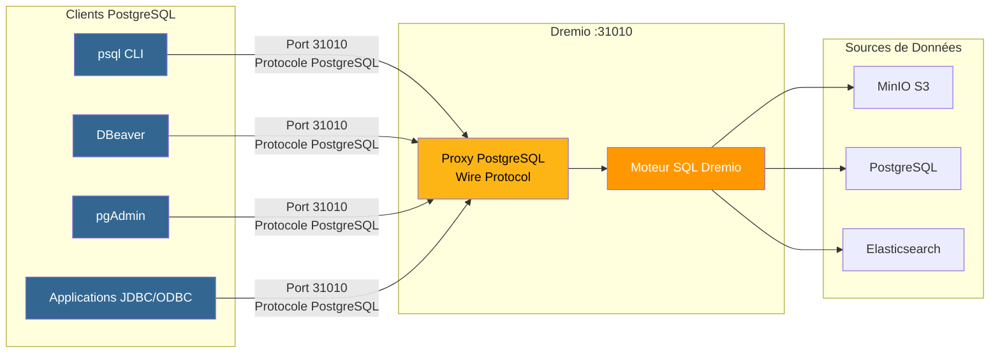
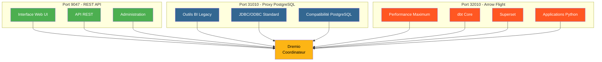
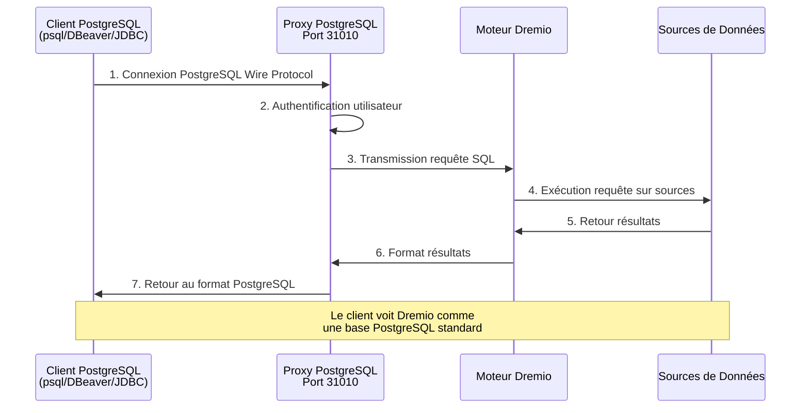
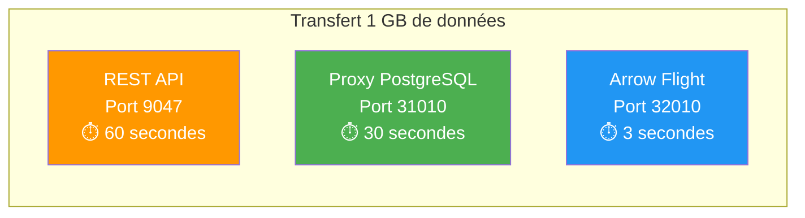

# प्लेटफ़ॉर्म घटक

**संस्करण**: 3.2.0  
**अंतिम अद्यतन**: 2025-10-16  
**भाषा**: फ्रेंच

---

## घटक अवलोकन

डेटा प्लेटफ़ॉर्म में 7 मुख्य घटक शामिल हैं जो संपूर्ण समाधान प्रदान करने के लिए एक साथ काम करते हैं।



---

## 1. एयरबाइट - डेटा इंटीग्रेशन प्लेटफ़ॉर्म

### अवलोकन

एयरबाइट एक खुला स्रोत डेटा एकीकरण इंजन है जो कई स्रोतों से गंतव्यों तक डेटा को समेकित करता है।

**संस्करण**: 0.50.33  
**लाइसेंस**: एमआईटी  
**वेबसाइट**: https://airbyte.com

### प्रमुख विशेषताऐं

- **300+ पूर्व-निर्मित कनेक्टर**: डेटाबेस, एपीआई, फ़ाइलें, SaaS एप्लिकेशन
- **डेटा कैप्चर बदलें (सीडीसी)**: वास्तविक समय डेटा प्रतिकृति
- **कस्टम कनेक्टर्स**: पायथन या लो-कोड सीडीके के साथ बनाएं
- **सामान्यीकरण**: JSON को संबंधपरक तालिकाओं में बदलें
- **वृद्धिशील सिंक्रोनाइज़ेशन**: केवल नए/संशोधित डेटा को सिंक्रोनाइज़ करें
- **निगरानी**: एकीकृत ट्रैकिंग स्थिति सिंक्रनाइज़ेशन

### वास्तुकला

```yaml
Composants:
  airbyte-webapp:
    Port: 8000
    Objectif: Interface utilisateur web
    
  airbyte-server:
    Port: 8001
    Objectif: Serveur API REST
    
  airbyte-worker:
    Objectif: Exécuter tâches synchronisation
    Scalabilité: Horizontale
    
  airbyte-temporal:
    Port: 7233
    Objectif: Orchestration workflows
    
  airbyte-db:
    Port: 5432
    Objectif: Stockage métadonnées (PostgreSQL)
```

### उदाहरण

- **ईएलटी पाइपलाइन**: एक्सट्रैक्ट-लोड-ट्रांसफ़ॉर्म वर्कफ़्लोज़
- **डेटाबेस प्रतिकृति**: डेटाबेस को सिंक्रनाइज़ रखें
- **एपीआई एकीकरण**: REST API से डेटा निकालें
- **डेटा लेक अंतर्ग्रहण**: डेटा को S3/MinIO में लोड करें
- **क्लाउड माइग्रेशन**: ऑन-प्रिमाइसेस डेटा को क्लाउड पर ले जाएं

### स्थापित करना

```yaml
# Variables d'Environnement
AIRBYTE_VERSION: "0.50.33"
AIRBYTE_HTTP_PORT: 8000
AIRBYTE_API_PORT: 8001
AIRBYTE_WORKSPACE_ROOT: /tmp/airbyte_local

# Limites Ressources
CPU_LIMIT: "2.0"
MEMORY_LIMIT: "2Gi"
```

### एकीकरण बिंदु

- **आउटपुट**: मिनिओ एस3, पोस्टग्रेएसक्यूएल, ड्रेमियो
- **ऑर्केस्ट्रेशन**: एयरफ्लो, प्रीफेक्ट द्वारा ट्रिगर किया जा सकता है
- **निगरानी**: प्रोमेथियस मेट्रिक्स समापन बिंदु

---

## 2. ड्रेमियो - डेटा लेकहाउस प्लेटफ़ॉर्म

### अवलोकन

ड्रेमियो क्वेरी त्वरण के साथ सभी डेटा स्रोतों के लिए एक एकीकृत SQL इंटरफ़ेस प्रदान करता है।

**संस्करण**: 26.0 ओएसएस  
**लाइसेंस**: अपाचे 2.0  
**वेबसाइट**: https://www.dremio.com

### प्रमुख विशेषताऐं

- **डेटा लेकहाउस**: गोदाम के प्रदर्शन के साथ झील के लचीलेपन को मिलाएं
- **विचार**: स्वचालित क्वेरी त्वरण (100x तक तेज़)
- **एरो फ़्लाइट**: उच्च प्रदर्शन डेटा स्थानांतरण
- **डेटा वर्चुअलाइजेशन**: डेटा को स्थानांतरित किए बिना क्वेरी
- **सिमेंटिक लेयर**: व्यवसाय-अनुकूल डेटा परिभाषाएँ
- **समय यात्रा**: ऐतिहासिक संस्करण दिए गए प्रश्न

### वास्तुकला

```yaml
Composants:
  Coordinateur:
    Port: 9047 (HTTP), 31010 (ODBC), 32010 (Arrow Flight)
    Objectif: Planification requêtes, gestion métadonnées
    Mémoire: 8Go heap + 8Go direct
    
  Exécuteur:
    Objectif: Exécution requêtes
    Mémoire: 4Go heap + 8Go direct
    Scalabilité: Horizontale (ajouter plus d'exécuteurs)
    
  Stockage:
    Type: Distribué (MinIO, S3, HDFS)
    Format: Parquet, Iceberg
```

### उदाहरण

- **स्वयं-सेवा विश्लेषण**: व्यावसायिक उपयोगकर्ताओं को डेटा एक्सप्लोर करने की अनुमति दें
- **डेटा मेश**: डेटा तक फ़ेडरेटेड पहुंच
- **क्वेरी एक्सेलेरेशन**: डैशबोर्ड क्वेरीज़ को तेज़ करें
- **डेटा कैटलॉग**: डेटा खोजें और प्रबंधित करें
- **बीआई सक्रियण**: पावर टेबलू, पावर बीआई, सुपरसेट

### स्थापित करना

```conf
# dremio.conf
paths.local: "/opt/dremio/data"
services.coordinator.enabled: true
services.executor.enabled: true

services.coordinator.web.port: 9047
services.flight.endpoint.port: 32010

services.executor.cache.pct.max: 70
```

### एकीकरण बिंदु

- **से पढ़ें**: मिनियो एस3, पोस्टग्रेएसक्यूएल, इलास्टिक्सर्च
- **के साथ रूपांतरित करें**: dbt
- **इनके लिए उपयोग किया जाता है**: सुपरसेट, टेबलू, पावर बीआई

### ड्रेमियो के लिए पोस्टग्रेएसक्यूएल प्रॉक्सी

Dremio एक PostgreSQL सर्वर का अनुकरण कर सकता है, जिससे PostgreSQL-संगत उपकरण Dremio से कनेक्ट हो सकते हैं जैसे कि यह एक मानक PostgreSQL डेटाबेस हो।

#### PostgreSQL प्रॉक्सी आर्किटेक्चर



#### 3 ड्रेमियो बंदरगाहों की तुलना



#### प्रॉक्सी कॉन्फ़िगरेशन

```yaml
Proxy PostgreSQL:
  Port: 31010 (ODBC/JDBC)
  Protocole: PostgreSQL Wire Protocol
  Compatibilité: Outils compatibles PostgreSQL (psql, pgAdmin, DBeaver)
  
Avantages:
  - Aucune modification du code client
  - Support des pilotes PostgreSQL existants
  - Connexion via JDBC/ODBC standard
  - Compatible avec la plupart des outils BI
```

#### प्रॉक्सी उपयोग के मामले

1. **बीआई लिगेसी टूल्स**: ऐसे टूल कनेक्ट करें जो एरो फ़्लाइट का समर्थन नहीं करते हैं
2. **आसान माइग्रेशन**: कोड बदले बिना PostgreSQL को Dremio से बदलें
3. **ओडीबीसी/जेडीबीसी संगतता**: मानक पोस्टग्रेएसक्यूएल ड्राइवरों का उपयोग करें
4. **विकास**: परिचित PostgreSQL टूल (psql, pgAdmin) के साथ परीक्षण करें

#### कनेक्शन उदाहरण

```bash
# Via psql
psql -h localhost -p 31010 -U admin -d datalake

# Via DBeaver / pgAdmin
Host: localhost
Port: 31010
Database: datalake
Username: admin
Password: <votre-mot-de-passe>

# Chaîne JDBC
jdbc:postgresql://localhost:31010/datalake

# Chaîne ODBC
Driver=PostgreSQL Unicode;
Server=localhost;
Port=31010;
Database=datalake;
Uid=admin;
Pwd=<votre-mot-de-passe>;
```

#### सीमाएं

- **प्रदर्शन**: एरो फ़्लाइट (पोर्ट 32010) 20-50 गुना तेज़ है
- **विशेषताएं**: कुछ उन्नत PostgreSQL फ़ंक्शन समर्थित नहीं हैं
- **सिफारिश**: उत्पादन के लिए एरो फ़्लाइट का उपयोग करें, अनुकूलता के लिए PostgreSQL प्रॉक्सी का उपयोग करें

#### PostgreSQL प्रॉक्सी के माध्यम से कनेक्शन प्रवाह



#### प्रोटोकॉल तुलना

| प्रोटोकॉल | बंदरगाह | प्रदर्शन | विलंबता | उपयोग के मामले |
|----------------------|------|---|-------|--------|
| **रेस्ट एपीआई** | 9047 | मानक | ~50-100ms | वेब यूआई, प्रशासन |
| **ओडीबीसी/जेडीबीसी (पोस्टग्रेएसक्यूएल प्रॉक्सी)** | 31010 | अच्छा | ~20-50ms | लीगेसी बीआई उपकरण, अनुकूलता |
| **तीर की उड़ान** | 32010 | उत्कृष्ट (20-50x) | ~5-10ms | उत्पादन, सुपरसेट, डीबीटी |

#### तुलनात्मक प्रदर्शन



---

## 3. डीबीटी - डेटा ट्रांसफॉर्मेशन टूल

### अवलोकन

डीबीटी (डेटा बिल्ड टूल) विश्लेषणात्मक इंजीनियरों को एसक्यूएल का उपयोग करके डेटा को बदलने की अनुमति देता है।

**संस्करण**: 1.10+  
**लाइसेंस**: अपाचे 2.0  
**वेबसाइट**: https://www.getdbt.com

### प्रमुख विशेषताऐं

- **एसक्यूएल आधारित**: एसक्यूएल में परिवर्तन लिखें
- **संस्करण नियंत्रण**: सहयोग के लिए गिट एकीकरण
- **परीक्षण**: एकीकृत डेटा गुणवत्ता परीक्षण
- **दस्तावेज़ीकरण**: डेटा शब्दकोश स्वतः उत्पन्न करें
- **मॉड्यूलैरिटी**: पुन: प्रयोज्य मैक्रोज़ और पैकेज
- **वृद्धिशील मॉडल**: केवल नए डेटा को प्रोसेस करें

### वास्तुकला

```yaml
Composants:
  dbt Core:
    Objectif: Outil CLI pour exécuter transformations
    Langage: Python
    
  Modèles:
    Objectif: Instructions SQL SELECT
    Types: Vues, Tables, Incrémental, Snapshots
    
  Tests:
    Objectif: Validation qualité données
    Types: Unique, Not Null, Relations, Personnalisés
    
  Macros:
    Objectif: Fonctions SQL réutilisables
    Langage: Jinja2
```

### उदाहरण

- **डेटा मॉडलिंग**: स्टार/फ्लेक आरेख बनाएं
- **डेटा गुणवत्ता**: डेटा अखंडता को मान्य करें
- **धीरे-धीरे बदलते आयाम**: ऐतिहासिक परिवर्तनों को ट्रैक करें
- **डेटा एकत्रीकरण**: सारांश तालिकाएँ बनाएँ
- **डेटा दस्तावेज़ीकरण**: डेटा कैटलॉग तैयार करें

### स्थापित करना

```yaml
# dbt_project.yml
name: 'dremio_dbt'
version: '1.0.0'
profile: 'dremio'

models:
  dremio_dbt:
    staging:
      +materialized: view
      +schema: staging
    marts:
      +materialized: table
      +schema: marts
```

### एकीकरण बिंदु

- **से पढ़ना**: ड्रेमियो डेटासेट
- **लिखित**: ड्रेमियो (एरो फ़्लाइट के माध्यम से)
- **द्वारा ऑर्केस्ट्रेटेड**: एयरफ्लो, क्रॉन, एयरबाइट पोस्ट-सिंक

---

## 4. अपाचे सुपरसेट - बिजनेस इंटेलिजेंस प्लेटफॉर्म

### अवलोकन

सुपरसेट एक आधुनिक डेटा अन्वेषण और विज़ुअलाइज़ेशन प्लेटफ़ॉर्म है।

**संस्करण**: 3.0  
**लाइसेंस**: अपाचे 2.0  
**वेबसाइट**: https://superset.apache.org

### प्रमुख विशेषताऐं

- **एसक्यूएल आईडीई**: स्वत: पूर्णता के साथ उन्नत एसक्यूएल संपादक
- **समृद्ध विज़ुअलाइज़ेशन**: 50+ चार्ट प्रकार
- **इंटरैक्टिव डैशबोर्ड**: ड्रिल-डाउन, फ़िल्टर, क्रॉस-फ़िल्टरिंग
- **एसक्यूएल लैब**: तदर्थ क्वेरी इंटरफ़ेस
- **अलर्ट**: अनुसूचित रिपोर्ट और अलर्ट
- **कैशिंग**: प्रदर्शन के लिए कैश क्वेरी परिणाम

### वास्तुकला

```yaml
Composants:
  Serveur Web:
    Port: 8088
    Objectif: Servir interface web
    Framework: Flask
    
  Workers Celery:
    Objectif: Exécution requêtes asynchrone
    File: Redis/RabbitMQ
    
  Celery Beat:
    Objectif: Tâches planifiées (préchauffage cache, alertes)
    
  Base de Données:
    Objectif: Stocker tableaux de bord, utilisateurs, logs requêtes
    Type: PostgreSQL
```

### उदाहरण

- **कार्यकारी डैशबोर्ड**: KPI निगरानी
- **ऑपरेशनल एनालिटिक्स**: वास्तविक समय की निगरानी
- **बीआई सेल्फ-सर्विस**: विश्लेषकों को सशक्त बनाएं
- **एंबेडेड एनालिटिक्स**: अनुप्रयोगों में आईफ्रेम एकीकरण
- **डेटा अन्वेषण**: तदर्थ विश्लेषण

### स्थापित करना

```python
# superset_config.py
SQLALCHEMY_DATABASE_URI = 'postgresql://...'
SECRET_KEY = '...'

FEATURE_FLAGS = {
    'DASHBOARD_NATIVE_FILTERS': True,
    'DASHBOARD_CROSS_FILTERS': True,
    'ENABLE_TEMPLATE_PROCESSING': True
}

CACHE_CONFIG = {
    'CACHE_TYPE': 'redis',
    'CACHE_DEFAULT_TIMEOUT': 300
}
```

### एकीकरण बिंदु

- **अनुरोध**: ड्रेमियो (एरो फ़्लाइट के माध्यम से)
- **प्रमाणीकरण**: एलडीएपी, OAuth2, डेटाबेस
- **अलर्ट**: ईमेल, स्लैक

---

## 5. PostgreSQL - रिलेशनल डेटाबेस

### अवलोकन

PostgreSQL एक उन्नत ओपन सोर्स रिलेशनल डेटाबेस प्रबंधन प्रणाली है।

**संस्करण**: 16  
**लाइसेंस**: पोस्टग्रेएसक्यूएल लाइसेंस  
**वेबसाइट**: https://www.postgresql.org

### प्रमुख विशेषताऐं

- **एसिड अनुपालन**: विश्वसनीय लेनदेन
- **JSON समर्थन**: मूल JSON/JSONB प्रकार
- **पूर्ण पाठ खोज**: एकीकृत खोज क्षमताएं
- **एक्सटेंशन**: पोस्टजीआईएस, पीजी_स्टैट_स्टेटमेंट्स, टाइमस्केलडीबी
- **प्रतिकृति**: स्ट्रीमिंग प्रतिकृति, तार्किक प्रतिकृति
- **विभाजन**: मूल तालिका विभाजन

### वास्तुकला

```yaml
Composants:
  Serveur PostgreSQL:
    Port: 5432
    Protocole: Protocole wire PostgreSQL
    
  Bases de Données:
    - dremio_db: Métadonnées Dremio
    - superset_db: Configuration Superset
    - airbyte_db: Métadonnées Airbyte
    
  Connexions:
    Max: 200
    Pooling: PgBouncer (optionnel)
```

### उदाहरण

- **मेटाडेटा स्टोरेज**: सिस्टम मेटाडेटा स्टोर करें
- **लेन-देन भार**: ओएलटीपी अनुप्रयोग
- **स्टेजिंग टेबल्स**: अस्थायी डेटा प्रोसेसिंग
- **भंडारण कॉन्फ़िगरेशन**: एप्लिकेशन सेटिंग्स
- **ऑडिट लॉग**: सिस्टम परिवर्तन को ट्रैक करें

### स्थापित करना

```conf
# postgresql.conf
max_connections = 200
shared_buffers = 256MB
effective_cache_size = 1GB
maintenance_work_mem = 64MB
work_mem = 4MB

# Performance
random_page_cost = 1.1
effective_io_concurrency = 200

# Journalisation
log_statement = 'mod'
log_duration = on
```

### एकीकरण बिंदु

- **इनके द्वारा पढ़ें**: ड्रेमियो, सुपरसेट, एयरबाइट
- **लिखित**: एयरबाइट, डीबीटी, एप्लिकेशन
- **द्वारा प्रबंधित**: स्वचालित बैकअप, प्रतिकृति

---

## 6. मिनिओ - एस3 संगत ऑब्जेक्ट स्टोरेज

### अवलोकन

MiniIO एक उच्च-प्रदर्शन, S3-संगत ऑब्जेक्ट स्टोरेज सिस्टम है।

**संस्करण**: नवीनतम  
**लाइसेंस**: AGPLv3  
**वेबसाइट**: https://min.io

### प्रमुख विशेषताऐं

- **एस3 एपीआई**: अमेज़ॅन एस3 के साथ 100% संगत
- **उच्च प्रदर्शन**: मल्टी-जीबी/एस थ्रूपुट
- **इरेज़र कोडिंग**: स्थिरता और उपलब्धता डेटा
- **संस्करण**: ऑब्जेक्ट संस्करण नियंत्रण
- **एन्क्रिप्शन**: सर्वर साइड और क्लाइंट साइड
- **मल्टी-क्लाउड**: हर जगह तैनात करें

### वास्तुकला

```yaml
Composants:
  Serveur MinIO:
    Port: 9000 (API S3), 9001 (Console)
    Mode: Nœud unique ou distribué
    
  Stockage:
    Format: Erasure coded ou brut
    Redondance: Configurable (ex: 4+2)
    
  Buckets:
    - datalake: Stockage données principal
    - raw-data: Ingestion Airbyte
    - processed-data: Sorties dbt
    - backups: Sauvegardes système
```

### उदाहरण

- **डेटा लेक**: कच्चा और संसाधित डेटा संग्रहीत करें
- **ऑब्जेक्ट स्टोरेज**: फ़ाइलें, चित्र, वीडियो
- **स्टोरेज बैकअप**: डेटाबेस और सिस्टम बैकअप
- **संग्रह**: दीर्घकालिक डेटा प्रतिधारण
- **डेटा स्टेजिंग**: अस्थायी प्रसंस्करण भंडारण

### स्थापित करना

```yaml
# Variables d'Environnement
MINIO_ROOT_USER: minioadmin
MINIO_ROOT_PASSWORD: minioadmin123
MINIO_VOLUMES: /data

# Politiques Buckets
- datalake: Lecture-écriture pour plateforme données
- raw-data: Écriture par Airbyte, lecture par Dremio
- processed-data: Écriture par dbt, lecture tous
```

### एकीकरण बिंदु

- **लिखित**: एयरबाइट, डीबीटी, एप्लिकेशन
- **इनके द्वारा पढ़ें**: ड्रेमियो, डेटा वैज्ञानिक
- **द्वारा प्रबंधित**: एमसी (मिनियो क्लाइंट), एस3सीएमडी

---

## 7. इलास्टिक्स खोज - खोज और विश्लेषण इंजन

### अवलोकन

इलास्टिक्स खोज अपाचे ल्यूसीन पर निर्मित एक वितरित खोज और विश्लेषण इंजन है।

**संस्करण**: 8.15  
**लाइसेंस**: इलास्टिक लाइसेंस 2.0  
**वेबसाइट**: https://www.elastic.co

### प्रमुख विशेषताऐं

- **पूर्ण पाठ खोज**: उन्नत खोज क्षमताएं
- **वास्तविक समय अनुक्रमण**: वास्तविक समय डेटा उपलब्धता के करीब
- **वितरित**: क्षैतिज मापनीयता
- **एकत्रीकरण**: जटिल विश्लेषण
- **रेस्टफुल एपीआई**: सरल HTTP एपीआई
- **मशीन लर्निंग**: विसंगति का पता लगाना

### वास्तुकला

```yaml
Composants:
  Nœud Elasticsearch:
    Port: 9200 (HTTP), 9300 (Transport)
    Rôles: Master, Data, Ingest, ML
    
  Index:
    Objectif: Stocker documents recherchables
    Shards: Distribués entre nœuds
    Répliques: Pour haute disponibilité
    
  Cycle de Vie Index:
    Hot: Données récentes (SSD)
    Warm: Données anciennes (HDD)
    Cold: Archive (S3)
```

### उदाहरण

- **विश्लेषणात्मक लॉग**: केंद्रीकृत लॉगिंग (ईएलके स्टैक)
- **एप्लिकेशन खोज**: उत्पाद कैटलॉग, साइट खोज
- **सुरक्षा विश्लेषण**: सिएम उपयोग के मामले
- **अवलोकनशीलता**: मेट्रिक्स और ट्रेस
- **पाठ विश्लेषण**: एनएलपी और भावना विश्लेषण

### स्थापित करना

```yaml
# elasticsearch.yml
cluster.name: "dremio-search-cluster"
node.name: "node-1"
network.host: 0.0.0.0
http.port: 9200

# Sécurité
xpack.security.enabled: true
xpack.security.transport.ssl.enabled: false

# Mémoire
bootstrap.memory_lock: true
```

### एकीकरण बिंदु

- **द्वारा अनुक्रमित**: लॉगस्टैश, फाइलबीट
- **निवेदनकर्ता**: ड्रेमियो, किबाना
- **द्वारा निगरानी**: इलास्टिक्स खोज मॉनिटरिंग

---

## घटकों की तुलना

| घटक | प्रकार | मुख्य उपयोग | स्केलेबिलिटी | राज्य |
|----------------------|------|-----------------|---|------|
| **एयरबाइट** | एकीकरण | डेटा अंतर्ग्रहण | क्षैतिज (श्रमिक) | राज्यविहीन |
| **ड्रेमियो** | क्वेरी इंजन | डेटा एक्सेस | क्षैतिज (निष्पादक) | राज्यविहीन |
| **डीबीटी** | परिवर्तन | डेटा मॉडलिंग | लंबवत (दिल) | राज्यविहीन |
| **सुपरसेट** | बीआई प्लेटफार्म | विज़ुअलाइज़ेशन | क्षैतिज (वेब) | राज्यविहीन |
| **पोस्टग्रेएसक्यूएल** | डेटाबेस | मेटाडेटा भंडारण | लंबवत (+ प्रतिकृति) | स्टेटफुल |
| **मिनियो** | वस्तु भंडारण | डेटा लेक | क्षैतिज (वितरित) | स्टेटफुल |
| **इलास्टिक्सखोज** | खोज इंजन | पूर्ण पाठ खोज | क्षैतिज (क्लस्टर) | स्टेटफुल |

---

## संसाधन आवश्यकताएँ

### न्यूनतम विन्यास (विकास)

```yaml
Total: 8 Go RAM, 4 CPUs, 50 Go Disque

Allocation:
  Airbyte: 1 Go RAM, 0.5 CPU
  Dremio: 2 Go RAM, 1 CPU
  Superset: 1 Go RAM, 0.5 CPU
  PostgreSQL: 1 Go RAM, 0.5 CPU
  MinIO: 1 Go RAM, 0.5 CPU
  Elasticsearch: 2 Go RAM, 1 CPU
```

### अनुशंसित कॉन्फ़िगरेशन (उत्पादन)

```yaml
Total: 64 Go RAM, 16 CPUs, 500 Go SSD

Allocation:
  Airbyte: 4 Go RAM, 2 CPUs
  Dremio: 16 Go RAM, 4 CPUs
  Superset: 8 Go RAM, 2 CPUs
  PostgreSQL: 8 Go RAM, 2 CPUs
  MinIO: 16 Go RAM, 2 CPUs
  Elasticsearch: 12 Go RAM, 4 CPUs
```

---

## संस्करण संगतता मैट्रिक्स

| घटक | रिलीज | के साथ संगत |
|---|------------|
| एयरबाइट | 0.50+ | सभी गंतव्य |
| ड्रेमियो | 26.0 | डीबीटी 1.8+, एरो फ़्लाइट ग्राहक |
| डीबीटी | 1.10+ | ड्रेमियो 23.0+ |
| सुपरसेट | 3.0+ | ड्रेमियो 22.0+, पोस्टग्रेएसक्यूएल 12+ |
| पोस्टग्रेएसक्यूएल | 16 | सभी घटक |
| मिनिओ | नवीनतम | S3 संगत क्लाइंट |
| इलास्टिक्स खोज | 8.15 | ड्रेमियो 26.0+, लॉगस्टैश 8.x |

---

**घटक गाइड संस्करण**: 3.2.0  
**अंतिम अद्यतन**: 2025-10-16  
**द्वारा रखरखाव**: डेटा प्लेटफ़ॉर्म टीम