# डेटा फ़्लो आर्किटेक्चर

**संस्करण**: 3.2.0  
**आखिरी अपडेट**: 16 अक्टूबर, 2025  
**भाषा**: फ्रेंच

## विषयसूची

1. [अवलोकन](#अवलोकन)
2. [एंड-टू-एंड डेटा फ्लो](#एंड-टू-एंड-डेटाफ्लो)
3. [अंतर्ग्रहण परत](#अंतर्ग्रहण-परत)
4. [भंडारण परत](#भंडारण-परत)
5. [प्रसंस्करण परत](#प्रसंस्करण-परत)
6. [प्रस्तुति परत](#प्रस्तुति-परत)
7. [डेटा प्रवाह मॉडल](#डेटा प्रवाह-मॉडल)
8. [प्रदर्शन संबंधी विचार](#प्रदर्शन-विचार)
9. [डेटा प्रवाह निगरानी](#डेटा प्रवाह-निगरानी)
10. [अच्छी प्रथाएं](#अच्छी प्रथाएं)

---

## अवलोकन

यह दस्तावेज़ प्रारंभिक डेटा अंतर्ग्रहण से लेकर अंतिम उपभोग तक, प्लेटफ़ॉर्म के संपूर्ण डेटा प्रवाह आर्किटेक्चर का विवरण देता है। प्रदर्शन को अनुकूलित करने, समस्याओं का निवारण करने और प्रभावी डेटा पाइपलाइनों को डिजाइन करने के लिए इन प्रवाहों को समझना महत्वपूर्ण है।

### डेटा प्रवाह सिद्धांत

हमारी वास्तुकला इन मूलभूत सिद्धांतों का पालन करती है:

1. **यूनिडायरेक्शनल प्रवाह**: डेटा स्पष्ट और पूर्वानुमानित दिशा में चलता है
2. **स्तरित प्रसंस्करण**: प्रत्येक परत की एक विशिष्ट जिम्मेदारी होती है
3. **विघटित घटक**: सेवाएँ अच्छी तरह से परिभाषित इंटरफेस के माध्यम से संचार करती हैं
4. **निष्क्रियता**: ऑपरेशन को सुरक्षित रूप से दोहराया जा सकता है
5. **अवलोकन**: प्रत्येक चरण को लॉग किया जाता है और निगरानी की जाती है

### वास्तुकला परतें


---

## एंड-टू-एंड डेटा प्रवाह

### पूरा पाइपलाइन अनुक्रम


### डेटा प्रवाह चरण

| कदम | घटक | प्रवेश | बाहर निकलें | विलंबता |
|-------|-------|--------|--------|---------|
| **निकालें** | एयरबाइट | बाहरी एपीआई/बीडी | कच्चा JSON/CSV | 1-60 मिनट |
| **लोड हो रहा है** | भंडारण परत | कच्ची फ़ाइलें | क्यूरेटेड बाल्टी | <1 मिनट |
| **कैटलॉगिंग** | ड्रेमियो | भंडारण पथ | वर्चुअल डेटासेट | <1 मिनट |
| **परिवर्तन** | डीबीटी | कांस्य टेबल्स | चाँदी/सोने की टेबलें | 5-30 मिनट |
| **अनुकूलन** | ड्रेमियो विचार | कच्ची प्रश्न | छिपे हुए परिणाम | वास्तविक समय |
| **विज़ुअलाइज़ेशन** | सुपरसेट | एसक्यूएल प्रश्न | चार्ट/डैशबोर्ड | <5 सेकंड |

---

## अंतर्ग्रहण परत

### एयरबाइट डेटा निष्कर्षण

एयरबाइट बाहरी स्रोतों से प्राप्त सभी डेटा का प्रबंधन करता है।

#### स्रोत कनेक्शन प्रवाह


#### डेटा निष्कर्षण के तरीके

**1. पूर्ण ताज़ा**
```yaml
# Full refresh extrait toutes les données à chaque sync
sync_mode: full_refresh
destination_sync_mode: overwrite

# Cas d'usage:
# - Petits datasets (<1M lignes)
# - Pas de suivi fiable des changements
# - Snapshots complets nécessaires
```

**2. वृद्धिशील सिंक**
```yaml
# Sync incrémental extrait uniquement les données nouvelles/modifiées
sync_mode: incremental
destination_sync_mode: append_dedup
cursor_field: updated_at

# Cas d'usage:
# - Grands datasets (>1M lignes)
# - Possède champ timestamp ou curseur
# - Optimisation performance sync
```

**3. डेटा कैप्चर बदलें (सीडीसी)**
```yaml
# CDC utilise les logs de transaction de la base de données
method: CDC
replication_method: LOG_BASED

# Bases de données supportées:
# - PostgreSQL (WAL)
# - MySQL (binlog)
# - MongoDB (change streams)
# - SQL Server (change tracking)
```

### एयरबाइट एपीआई एकीकरण

```bash
# Déclencher sync via API
curl -X POST http://localhost:8001/api/v1/connections/sync \
  -H "Content-Type: application/json" \
  -d '{
    "connectionId": "your-connection-id"
  }'

# Vérifier statut sync
curl -X POST http://localhost:8001/api/v1/jobs/get \
  -H "Content-Type: application/json" \
  -d '{
    "id": "job-id"
  }'
```

### निष्कर्षण प्रदर्शन

| स्रोत प्रकार | प्रवाह | अनुशंसित आवृत्ति |
|----------------|-------|----------------------|
| पोस्टग्रेएसक्यूएल | 50-100k लाइनें/सेकंड | हर 15-60 मिनट में |
| बाकी एपीआई | 1-10k अनुरोध/सेकंड | हर 5-30 मिनट में |
| सीएसवी फ़ाइलें | 100-500 एमबी/सेकंड | दैनिक |
| मोंगोडीबी | 10-50k दस्तावेज़/सेकंड | हर 15-60 मिनट में |
| MySQL सीडीसी | वास्तविक समय | सतत |

---

## भंडारण परत

### मिनियो एस3 स्टोरेज

मिनिआईओ कच्चे और संसाधित डेटा को एक पदानुक्रमित संरचना में संग्रहीत करता है।

#### बकेट संगठन


#### डेटा पथ संरचना

```
s3://datalake/
├── bronze/                      # Données brutes d'Airbyte
│   ├── postgres/
│   │   ├── customers/
│   │   │   └── date=2025-10-16/
│   │   │       └── data.parquet
│   │   └── orders/
│   │       └── date=2025-10-16/
│   │           └── data.parquet
│   ├── api/
│   │   └── rest_endpoint/
│   │       └── timestamp=20251016_120000/
│   │           └── response.json
│   └── files/
│       └── csv_import/
│           └── batch_001.csv
│
├── silver/                      # Données nettoyées et validées
│   ├── customers/
│   │   └── version=v2/
│   │       └── customers_cleaned.parquet
│   └── orders/
│       └── version=v2/
│           └── orders_enriched.parquet
│
└── gold/                        # Agrégats prêts pour le métier
    ├── daily_revenue/
    │   └── year=2025/month=10/
    │       └── day=16/
    │           └── revenue.parquet
    └── customer_metrics/
        └── snapshot=2025-10-16/
            └── metrics.parquet
```

### भंडारण प्रारूप रणनीति

| परत | प्रारूप | संपीड़न | विभाजन | कारण |
|--------|--------|----|----|--------|
| **कांस्य** | लकड़ी की छत | तड़क-भड़क | तिथि के अनुसार | तेज़ लेखन, अच्छा संपीड़न |
| **रजत** | लकड़ी की छत | तड़क-भड़क | व्यवसाय कुंजी द्वारा | प्रभावी प्रश्न |
| **सोना** | लकड़ी की छत | ZSTD | समय अवधि के अनुसार | अधिकतम संपीड़न |
| **लॉग्स** | जेएसओएन | गज़िप | सेवा/तिथि के अनुसार | मनुष्य द्वारा पठनीय |

### PostgreSQL मेटाडेटा संग्रहण

PostgreSQL स्टोर:
- एयरबाइट कॉन्फ़िगरेशन और स्थिति
- मेटाडेटा और डीबीटी निष्पादन इतिहास
- सुपरसेट डैशबोर्ड और उपयोगकर्ता
- एप्लिकेशन लॉग और मेट्रिक्स

```sql
-- Structure table état Airbyte
CREATE TABLE airbyte_state (
    connection_id UUID PRIMARY KEY,
    state JSONB NOT NULL,
    updated_at TIMESTAMP DEFAULT NOW()
);

-- Historique exécution dbt
CREATE TABLE dbt_run_history (
    run_id UUID PRIMARY KEY,
    project_name VARCHAR(255),
    started_at TIMESTAMP,
    completed_at TIMESTAMP,
    status VARCHAR(50),
    models_run INTEGER,
    tests_run INTEGER,
    metadata JSONB
);
```

### इलास्टिक्स खोज दस्तावेज़ भंडारण

Elasticsearch लॉग को अनुक्रमित करता है और पूर्ण-पाठ खोज की अनुमति देता है।

```json
{
  "index": "airbyte-logs-2025.10.16",
  "mappings": {
    "properties": {
      "timestamp": {"type": "date"},
      "level": {"type": "keyword"},
      "service": {"type": "keyword"},
      "message": {"type": "text"},
      "job_id": {"type": "keyword"},
      "connection_id": {"type": "keyword"},
      "records_synced": {"type": "integer"},
      "bytes_synced": {"type": "long"}
    }
  }
}
```

---

## प्रसंस्करण परत

### ड्रेमियो डेटा वर्चुअलाइजेशन

ड्रेमियो सभी भंडारण स्रोतों में एक एकीकृत दृश्य बनाता है।

#### वर्चुअल डेटासेट का निर्माण


#### परावर्तन द्वारा त्वरण

ड्रेमियो प्रतिबिंब त्वरित प्रदर्शन के लिए क्वेरी परिणामों की पूर्व-गणना करता है।

```sql
-- Créer réflexion brute (sous-ensemble colonnes)
CREATE REFLECTION raw_customers
ON bronze.customers
USING DISPLAY (customer_id, name, email, created_at);

-- Créer réflexion agrégation
CREATE REFLECTION agg_daily_revenue
ON gold.orders
USING DIMENSIONS (order_date)
MEASURES (SUM(amount), COUNT(*), AVG(amount));

-- Les réflexions se rafraîchissent automatiquement selon la politique
ALTER REFLECTION agg_daily_revenue
SET REFRESH EVERY 1 HOUR;
```

**प्रतिबिंबों का प्रदर्शन प्रभाव:**

| क्वेरी प्रकार | बिना प्रतिबिम्ब के | प्रतिबिम्ब के साथ | त्वरण |
|-----------------|----------------|----------------|---------|
| सरल चुनें | 500ms | 50 एमएस | 10x |
| एकत्रीकरण | 5s | 100ms | 50x |
| कॉम्प्लेक्स जॉइन्स | 30s | 500ms | 60x |
| बड़े स्कैन | 120s | 2s | 60x |

### डीबीटी परिवर्तन

डीबीटी कच्चे डेटा को व्यवसाय के लिए तैयार मॉडल में बदल देता है।

#### परिवर्तन प्रवाह


#### परिवर्तन पाइपलाइन उदाहरण

```sql
-- models/staging/stg_customers.sql
-- Étape 1: Nettoyage et standardisation
WITH source AS (
    SELECT * FROM bronze.raw_customers
),

cleaned AS (
    SELECT
        customer_id,
        TRIM(UPPER(name)) AS customer_name,
        LOWER(email) AS email,
        phone,
        address,
        city,
        state,
        zip_code,
        created_at,
        updated_at
    FROM source
    WHERE customer_id IS NOT NULL
)

SELECT * FROM cleaned;
```

```sql
-- models/intermediate/int_customer_orders.sql
-- Étape 2: Jointure et enrichissement
WITH customers AS (
    SELECT * FROM {{ ref('stg_customers') }}
),

orders AS (
    SELECT * FROM {{ ref('stg_orders') }}
),

joined AS (
    SELECT
        c.customer_id,
        c.customer_name,
        c.email,
        o.order_id,
        o.order_date,
        o.amount,
        o.status
    FROM customers c
    INNER JOIN orders o
        ON c.customer_id = o.customer_id
)

SELECT * FROM joined;
```

```sql
-- models/marts/fct_customer_lifetime_value.sql
-- Étape 3: Agrégation pour métriques métier
WITH customer_orders AS (
    SELECT * FROM {{ ref('int_customer_orders') }}
),

metrics AS (
    SELECT
        customer_id,
        customer_name,
        email,
        COUNT(DISTINCT order_id) AS total_orders,
        SUM(amount) AS lifetime_value,
        AVG(amount) AS average_order_value,
        MIN(order_date) AS first_order_date,
        MAX(order_date) AS last_order_date,
        DATEDIFF('day', MIN(order_date), MAX(order_date)) AS customer_lifespan_days
    FROM customer_orders
    WHERE status = 'completed'
    GROUP BY customer_id, customer_name, email
)

SELECT * FROM metrics;
```

#### डीबीटी निष्पादन प्रवाह

```bash
# Exécution pipeline complète
dbt run --select staging        # Exécuter modèles staging
dbt test --select staging       # Tester modèles staging
dbt run --select intermediate   # Exécuter modèles intermédiaires
dbt test --select intermediate  # Tester modèles intermédiaires
dbt run --select marts          # Exécuter modèles mart
dbt test --select marts         # Tester modèles mart

# Générer documentation
dbt docs generate
dbt docs serve
```

### डेटा वंशावली ट्रैसेबिलिटी


---

## प्रेजेंटेशन लेयर

### क्वेरी निष्पादन प्रवाह


### एपीआई एक्सेस मॉडल

#### 1. सुपरसेट डैशबोर्ड (बीआई इंटरैक्टिव)

```python
# Superset exécute SQL via SQLAlchemy
from superset import db

query = """
SELECT 
    order_date,
    SUM(amount) as daily_revenue
FROM gold.fct_daily_revenue
WHERE order_date >= CURRENT_DATE - INTERVAL '30 days'
GROUP BY order_date
ORDER BY order_date
"""

results = db.session.execute(query)
```

#### 2. एरो फ्लाइट एपीआई (उच्च प्रदर्शन)

```python
# Connexion Arrow Flight directe pour outils analytiques
from pyarrow import flight

client = flight.FlightClient("grpc://localhost:32010")

# Authentification
token = client.authenticate_basic_token("admin", "password123")

# Exécuter requête
descriptor = flight.FlightDescriptor.for_command(
    b"SELECT * FROM gold.customer_metrics LIMIT 1000"
)

flight_info = client.get_flight_info(descriptor)
reader = client.do_get(flight_info.endpoints[0].ticket)

# Lire comme Table Arrow (zero-copy)
table = reader.read_all()
df = table.to_pandas()
```

#### 3. रेस्ट एपीआई (बाहरी एकीकरण)

```bash
# API REST Dremio pour automatisation
curl -X POST http://localhost:9047/api/v3/sql \
  -H "Authorization: Bearer $TOKEN" \
  -H "Content-Type: application/json" \
  -d '{
    "sql": "SELECT COUNT(*) FROM gold.customers"
  }'
```

---

## डेटा प्रवाह मॉडल

### मॉडल 1: ईटीएल बैच पाइपलाइन

```mermaid
gantt
    title Planification ETL Batch Quotidien
    dateFormat HH:mm
    axisFormat %H:%M
    
    section Ingestion
    Extraction Airbyte (PostgreSQL)     :01:00, 30m
    Extraction Airbyte (APIs)           :01:30, 45m
    
    section Chargement
    Chargement vers Bronze MinIO        :02:15, 15m
    
    section Transformation
    Modèles Staging dbt                 :02:30, 20m
    Modèles Intermédiaires dbt          :02:50, 30m
    Modèles Mart dbt                    :03:20, 40m
    
    section Tests
    Tests Qualité Données dbt           :04:00, 15m
    
    section Optimisation
    Rafraîchissement Réflexions Dremio  :04:15, 20m
    
    section Présentation
    Préchauffage Cache Tableau de Bord  :04:35, 10m
```



### मॉडल 2: रीयल-टाइम स्ट्रीमिंग


### पैटर्न 3: वृद्धिशील अद्यतन

```sql
-- Modèle incrémental dbt
{{ config(
    materialized='incremental',
    unique_key='order_id',
    on_schema_change='sync_all_columns'
) }}

SELECT
    order_id,
    customer_id,
    order_date,
    amount,
    status,
    updated_at
FROM {{ source('bronze', 'orders') }}


    -- Traiter uniquement les enregistrements nouveaux ou mis à jour
    WHERE updated_at > (SELECT MAX(updated_at) FROM {{ this }})

```

### मॉडल 4: लैम्ब्डा आर्किटेक्चर (बैच + स्ट्रीम)


---

## प्रदर्शन संबंधी विचार

### अंतर्ग्रहण अनुकूलन

```yaml
# Configuration connexion Airbyte
sync_mode: incremental
destination_sync_mode: append_dedup
cursor_field: updated_at

# Ajustement performance
batch_size: 10000              # Enregistrements par batch
threads: 4                     # Workers parallèles
timeout_minutes: 60           # Timeout sync
retry_on_failure: true
max_retries: 3

# Optimisation réseau
compression: gzip
buffer_size_mb: 256
```

### भंडारण अनुकूलन

```python
# Options écriture Parquet pour compression optimale
import pyarrow.parquet as pq

pq.write_table(
    table,
    'output.parquet',
    compression='snappy',      # Compression rapide
    use_dictionary=True,       # Activer encodage dictionnaire
    row_group_size=1000000,    # 1M lignes par row group
    data_page_size=1048576,    # 1MB taille page
    write_statistics=True      # Activer statistiques pour pruning
)
```

### क्वेरी अनुकूलन

```sql
-- Bonnes pratiques requêtes Dremio

-- 1. Utiliser partition pruning
SELECT * FROM gold.orders
WHERE order_date >= '2025-10-01'  -- Élague partitions
  AND order_date < '2025-11-01';

-- 2. Exploiter les réflexions
-- Créer réflexion une fois, requêtes auto-accélérées
ALTER REFLECTION agg_orders SET ENABLED = TRUE;

-- 3. Utiliser column pruning
SELECT order_id, amount       -- Seulement colonnes nécessaires
FROM gold.orders
LIMIT 1000;

-- 4. Pousser les filtres
SELECT *
FROM gold.customers
WHERE state = 'CA'            -- Filtre poussé vers stockage
  AND lifetime_value > 1000;
```

### परिवर्तनों का अनुकूलन

```sql
-- Techniques optimisation dbt

-- 1. Modèles incrémentaux pour grandes tables
{{ config(materialized='incremental') }}

-- 2. Tables partitionnées
{{ config(
    materialized='table',
    partition_by={
        'field': 'order_date',
        'data_type': 'date',
        'granularity': 'day'
    }
) }}

-- 3. Tables clusterisées pour meilleures jointures
{{ config(
    materialized='table',
    cluster_by=['customer_id']
) }}
```

### प्रदर्शन बेंचमार्क

| ऑपरेशन | छोटा डेटासेट<br/>(1एम लाइनें) | मध्यम डेटासेट<br/>(100M पंक्तियाँ) | बड़ा डेटासेट<br/>(1बी लाइनें) |
|--------------------------------|--------------------------------|--------------------------------------|--------------------------------|
| **सिंक एयरबाइट** | 2 मिनट | 30 मिनट | 5 घंटे |
| **डीबीटी निष्पादन** | 30 सेकंड | 10 मिनट | 2 घंटे |
| **निर्माण प्रतिबिंब** | 10 सेकंड | 5 मिनट | 30 मिनट |
| **डैशबोर्ड क्वेरी** | <100ms | <500ms | <2s |

---

## डेटा प्रवाह की निगरानी

### ट्रैक करने के लिए मुख्य मेट्रिक्स

```yaml
# Configuration métriques Prometheus
metrics:
  ingestion:
    - airbyte_records_synced_total
    - airbyte_sync_duration_seconds
    - airbyte_sync_failures_total
    
  storage:
    - minio_disk_usage_bytes
    - minio_objects_total
    - postgres_connections_active
    
  processing:
    - dremio_query_duration_seconds
    - dremio_reflection_refresh_seconds
    - dbt_model_execution_time
    
  serving:
    - superset_dashboard_load_time
    - superset_query_cache_hit_rate
    - api_requests_per_second
```

### मॉनिटरिंग डैशबोर्ड


### लॉग एकत्रीकरण

```bash
# Requête Elasticsearch pour surveillance pipeline
curl -X GET "localhost:9200/airbyte-logs-*/_search" \
  -H 'Content-Type: application/json' \
  -d '{
    "query": {
      "bool": {
        "filter": [
          {"range": {"timestamp": {"gte": "now-1h"}}},
          {"term": {"level": "ERROR"}}
        ]
      }
    },
    "aggs": {
      "by_service": {
        "terms": {"field": "service"}
      }
    }
  }'
```

---

## सर्वोत्तम प्रथाएं

### डेटा प्रवाह डिज़ाइन

1. **निष्क्रियता के लिए डिज़ाइन**
   - गारंटी दें कि ऑपरेशन सुरक्षित रूप से दोहराया जा सकता है
   - डिडुप्लीकेशन के लिए अद्वितीय कुंजियों का उपयोग करें
   - उचित त्रुटि प्रबंधन लागू करें

2. **डेटा गुणवत्ता नियंत्रण लागू करें**
   ```sql
   -- Exemple test dbt
   -- tests/assert_positive_amounts.sql
   SELECT *
   FROM {{ ref('fct_orders') }}
   WHERE amount <= 0
   ```

3. **विभाजन बड़े डेटासेट**
   ```python
   # Partitionner par date pour requêtes efficaces
   df.write.partitionBy('order_date').parquet('s3://bucket/orders/')
   ```

4. **उचित सिंक मोड का उपयोग करें**
   - पूर्ण ताज़ा: छोटे आयाम तालिकाएँ
   - वृद्धिशील: बड़ी तथ्य तालिकाएँ
   - सीडीसी: वास्तविक समय की आवश्यकताएं

### प्रदर्शन समायोजन

1. **एयरबाइट सिंक शेड्यूलिंग को अनुकूलित करें**
   ```yaml
   # Équilibrer fraîcheur vs utilisation ressources
   small_tables:
     frequency: every_15_minutes
   
   large_tables:
     frequency: every_6_hours
   
   dimension_tables:
     frequency: daily
   ```

2. **रणनीतिक विचार बनाएं**
   ```sql
   -- Focus sur agrégations fréquemment requêtées
   CREATE REFLECTION common_metrics
   ON gold.orders
   USING DIMENSIONS (product_id, date_trunc('day', order_date))
   MEASURES (SUM(amount), COUNT(*));
   ```

3. **डीबीटी मॉडल अनुकूलित करें**
   ```yaml
   # models/schema.yml
   models:
     - name: fct_large_table
       config:
         materialized: incremental
         incremental_strategy: merge
         unique_key: id
         partition_by: {field: date, data_type: date}
   ```

### सामान्य समस्या का समाधान

| समस्या | लक्षण | समाधान |
|---------|---------|----------|
| **एयरबाइट सिंक धीमा** | सिंक्रनाइज़ करने का समय | बैच का आकार बढ़ाएँ, वृद्धिशील मोड का उपयोग करें |
| **याददाश्त की कमी** | विफल डीबीटी मॉडल | क्रमिक रूप से भौतिकीकरण करें, विभाजन जोड़ें |
| **धीमी क्वेरी** | टाइमआउट डैशबोर्ड | प्रतिबिंब बनाएं, अनुक्रमणिका जोड़ें |
| **भंडारण पूर्ण** | लेखन विफलताएँ | डेटा प्रतिधारण लागू करें, पुराने डेटा को संपीड़ित करें |
| **डेटा अप्रचलित** | पुराने मेट्रिक्स | सिंक आवृत्ति बढ़ाएँ, शेड्यूल जाँचें |

### अच्छी सुरक्षा प्रथाएँ

1. **ट्रांज़िट में डेटा एन्क्रिप्ट करें**
   ```yaml
   # docker-compose.yml
   minio:
     environment:
       MINIO_SERVER_URL: https://minio:9000
       MINIO_BROWSER_REDIRECT_URL: https://console.minio.local
   ```

2. **एक्सेस नियंत्रण लागू करें**
   ```sql
   -- ACLs Dremio
   GRANT SELECT ON gold.customer_metrics TO ROLE analyst;
   GRANT ALL ON bronze.* TO ROLE data_engineer;
   ```

3. **ऑडिट डेटा एक्सेस**
   ```json
   {
     "audit_log": {
       "enabled": true,
       "log_queries": true,
       "log_user_actions": true,
       "retention_days": 90
     }
   }
   ```

---

## सारांश

यह दस्तावेज़ संपूर्ण डेटा प्रवाह वास्तुकला का विवरण देता है:

- **अंतर्ग्रहण परत**: एयरबाइट पूर्ण रिफ्रेश, वृद्धिशील या सीडीसी के माध्यम से विभिन्न स्रोतों से डेटा निकालता है
- **भंडारण परत**: मिनिओ, पोस्टग्रेएसक्यूएल और एलेस्टिक्सखोज कच्चे और संसाधित डेटा को संगठित परतों में संग्रहीत करते हैं
- **प्रसंस्करण परत**: ड्रेमियो डेटा को वर्चुअलाइज करता है और डीबीटी इसे स्टेजिंग, इंटरमीडिएट और मार्ट मॉडल के माध्यम से परिवर्तित करता है
- **प्रस्तुति परत**: सुपरसेट डैशबोर्ड और एपीआई व्यवसाय के लिए तैयार डेटा तक पहुंच प्रदान करते हैं

याद रखने योग्य मुख्य बिंदु:
- डेटा स्पष्ट रूप से परिभाषित परतों के माध्यम से यूनिडायरेक्शनल रूप से प्रवाहित होता है
- प्रत्येक घटक की विशिष्ट जिम्मेदारियां और इंटरफेस हैं
- प्रदर्शन को प्रतिबिंब, विभाजन और कैशिंग के माध्यम से अनुकूलित किया जाता है
- निगरानी और अवलोकन प्रत्येक परत में एकीकृत हैं
- अच्छी प्रथाएं विश्वसनीयता, प्रदर्शन और सुरक्षा की गारंटी देती हैं

**संबंधित दस्तावेज:**
- [वास्तुकला अवलोकन](./overview.md)
- [घटक](./components.md)
- [तैनाती](./तैनाती.md)
- [एयरबाइट इंटीग्रेशन गाइड](../guides/airbyte-integration.md)
- [डीबीटी विकास गाइड](../guides/dbt-development.md)

---

**संस्करण**: 3.2.0  
**आखिरी अपडेट**: 16 अक्टूबर, 2025