# परिनियोजन वास्तुकला

**संस्करण**: 3.2.0  
**आखिरी अपडेट**: 16 अक्टूबर, 2025  
**भाषा**: फ्रेंच

## विषयसूची

1. [अवलोकन](#अवलोकन)
2. [परिनियोजन टोपोलॉजी](#परिनियोजन-टोपोलॉजी)
3. [डॉकर कंपोज़ परिनियोजन](#डॉकर-कंपोज़ परिनियोजन)
4. [कुबेरनेट्स परिनियोजन](#कुबेरनेट्स-परिनियोजन)
5. [क्लाउड परिनियोजन](#क्लाउड-परिनियोजन)
6. [उच्च उपलब्धता कॉन्फ़िगरेशन](#उच्च उपलब्धता-कॉन्फ़िगरेशन)
7. [स्केलिंग रणनीतियाँ](#स्केलिंग-रणनीतियाँ)
8. [सुरक्षा कॉन्फ़िगरेशन](#सुरक्षा-कॉन्फ़िगरेशन)
9. [निगरानी और लॉगिंग](#निगरानी-और-लॉगिंग)
10. [आपदा-पुनर्प्राप्ति](#आपदा-पुनर्प्राप्ति)
11. [अच्छी प्रथाएं](#अच्छी प्रथाएं)

---

## अवलोकन

यह दस्तावेज़ विकास से लेकर उत्पादन तक, विभिन्न परिवेशों में डेटा प्लेटफ़ॉर्म को तैनात करने पर व्यापक मार्गदर्शन प्रदान करता है। हम विभिन्न परिनियोजन टोपोलॉजी, ऑर्केस्ट्रेशन रणनीतियों और परिचालन सर्वोत्तम प्रथाओं को कवर करते हैं।

### परिनियोजन उद्देश्य

- **विश्वसनीयता**: उत्पादन कार्यभार के लिए 99.9% अपटाइम
- **स्केलेबिलिटी**: वास्तु परिवर्तन के बिना 10 गुना वृद्धि प्रबंधित करें
- **सुरक्षा**: सुरक्षा की कई परतों के साथ गहराई से रक्षा
- **रखरखाव**: आसान अपडेट और कॉन्फ़िगरेशन प्रबंधन
- **लाभप्रदता**: संसाधनों के उपयोग को अनुकूलित करें

### पर्यावरण के प्रकार

| पर्यावरण | उद्देश्य | स्केल | उपलब्धता |
|----------------------|---------|------|------------|
| **विकास** | सुविधाएँ विकास, परीक्षण | एकल नोड | <95% |
| **मंचन** | प्री-प्रोडक्शन सत्यापन | मल्टी-नोड | 95-99% |
| **उत्पादन** | लाइव डेटा वर्कलोड | गुच्छित | >99.9% |
| **डॉ** | आपदा पुनर्प्राप्ति स्थल | उत्पादन दर्पण | स्टैंडबाय |

---

## परिनियोजन टोपोलॉजी

### टोपोलॉजी 1: एकल-मेजबान विकास


**उपयोग मामला**: स्थानीय विकास, परीक्षण, प्रदर्शन

**विशेष विवरण**:
- सीपीयू: 4-8 कोर
- रैम: 16-32 जीबी
- डिस्क: 100-500 जीबी एसएसडी
- नेटवर्क: केवल लोकलहोस्ट

**फ़ायदे**:
- सरल विन्यास (डॉकर-कंपोज़ अप)
- कम लागत
- तीव्र पुनरावृत्ति

**नुकसान**:
- कोई अतिरेक नहीं
- सीमित प्रदर्शन
-उत्पादन के लिए उपयुक्त नहीं

### टोपोलॉजी 2: डॉकर झुंड मल्टी-होस्ट


**उपयोग का मामला**: स्टेजिंग और छोटे उत्पादन परिनियोजन

**विशेष विवरण**:
- प्रबंधक नोड्स: 3x (2 सीपीयू, 4 जीबी रैम)
- वर्कर नोड्स: 3+ (8-16 सीपीयू, 32-64 जीबी रैम)
- डेटाबेस नोड: 1-2 (4 सीपीयू, 16 जीबी रैम, एसएसडी)
- स्टोरेज नोड्स: 4+ (2 सीपीयू, 8 जीबी रैम, एचडीडी/एसएसडी)

**फ़ायदे**:
- उच्च उपलब्धता
- आसान स्केलिंग
- एकीकृत लोड संतुलन
- स्वास्थ्य की निगरानी

**नुकसान**:
- सिंगल-होस्ट से अधिक जटिल
- साझा भंडारण या वॉल्यूम की आवश्यकता है
- नेटवर्क कॉन्फ़िगरेशन जटिलता

### टोपोलॉजी 3: कुबेरनेट्स क्लस्टर


**उपयोग का मामला**: बड़े पैमाने पर उत्पादन परिनियोजन

**विशेष विवरण**:
- नियंत्रण विमान: 3+ नोड्स (प्रबंधित या स्व-होस्टेड)
- वर्कर नोड्स: 10+ नोड्स (16-32 सीपीयू, 64-128 जीबी रैम)
- भंडारण: सीएसआई ड्राइवर (ईबीएस, जीसीपी पीडी, एज़्योर डिस्क)
- नेटवर्क: सीएनआई प्लगइन (कैलिको, सिलियम)

**फ़ायदे**:
- उद्यम स्तर का ऑर्केस्ट्रेशन
- स्वचालित स्केलिंग और मरम्मत
- उन्नत नेटवर्क (सेवा जाल)
- GitOps संगत
- बहु-किरायेदार समर्थन

**नुकसान**:
- जटिल विन्यास और प्रबंधन
- तीव्र सीखने की अवस्था
- उच्च परिचालन ओवरहेड

---

## डॉकर कंपोज़ परिनियोजन

### विकास का माहौल

स्थानीय विकास के लिए हमारा `docker-compose.yml` मानक:

```yaml
version: '3.8'

services:
  # Airbyte Platform
  airbyte-server:
    image: airbyte/server:0.50.33
    container_name: airbyte-server
    ports:
      - "8001:8001"
    environment:
      - DATABASE_USER=airbyte
      - DATABASE_PASSWORD=airbyte
      - DATABASE_DB=airbyte
      - DATABASE_HOST=postgres
      - DATABASE_PORT=5432
      - WORKSPACE_ROOT=/tmp/workspace
      - CONFIG_ROOT=/data
      - TRACKING_STRATEGY=logging
    volumes:
      - airbyte-data:/data
      - airbyte-workspace:/tmp/workspace
    depends_on:
      - postgres
    networks:
      - data-platform

  airbyte-webapp:
    image: airbyte/webapp:0.50.33
    container_name: airbyte-webapp
    ports:
      - "8000:80"
    environment:
      - AIRBYTE_SERVER_HOST=airbyte-server
      - AIRBYTE_SERVER_PORT=8001
    depends_on:
      - airbyte-server
    networks:
      - data-platform

  airbyte-worker:
    image: airbyte/worker:0.50.33
    container_name: airbyte-worker
    environment:
      - DATABASE_USER=airbyte
      - DATABASE_PASSWORD=airbyte
      - DATABASE_DB=airbyte
      - DATABASE_HOST=postgres
      - DATABASE_PORT=5432
      - WORKSPACE_ROOT=/tmp/workspace
      - LOCAL_ROOT=/tmp/airbyte_local
    volumes:
      - airbyte-workspace:/tmp/workspace
      - /var/run/docker.sock:/var/run/docker.sock
    depends_on:
      - postgres
      - airbyte-server
    networks:
      - data-platform

  # Dremio Lakehouse
  dremio:
    image: dremio/dremio-oss:26.0
    container_name: dremio
    ports:
      - "9047:9047"   # Web UI
      - "31010:31010" # ODBC/JDBC
      - "32010:32010" # Arrow Flight
    environment:
      - DREMIO_JAVA_SERVER_EXTRA_OPTS=-Xms2g -Xmx4g
    volumes:
      - dremio-data:/opt/dremio/data
      - ./config/dremio.conf:/opt/dremio/conf/dremio.conf
    networks:
      - data-platform

  # Apache Superset
  superset:
    image: apache/superset:3.0.0
    container_name: superset
    ports:
      - "8088:8088"
    environment:
      - SUPERSET_SECRET_KEY=your-secret-key-here
      - SUPERSET_LOAD_EXAMPLES=yes
    volumes:
      - superset-data:/app/superset_home
    command: >
      sh -c "superset db upgrade &&
             superset fab create-admin 
               --username admin 
               --firstname Admin 
               --lastname User 
               --email admin@example.com 
               --password admin &&
             superset init &&
             superset run -h 0.0.0.0 -p 8088"
    depends_on:
      - postgres
    networks:
      - data-platform

  # PostgreSQL Database
  postgres:
    image: postgres:16
    container_name: postgres
    ports:
      - "5432:5432"
    environment:
      - POSTGRES_USER=postgres
      - POSTGRES_PASSWORD=postgres
      - POSTGRES_DB=postgres
      - PGDATA=/var/lib/postgresql/data/pgdata
    volumes:
      - postgres-data:/var/lib/postgresql/data
      - ./scripts/init-databases.sql:/docker-entrypoint-initdb.d/init.sql
    networks:
      - data-platform
    healthcheck:
      test: ["CMD-SHELL", "pg_isready -U postgres"]
      interval: 10s
      timeout: 5s
      retries: 5

  # MinIO Object Storage
  minio:
    image: minio/minio:latest
    container_name: minio
    ports:
      - "9000:9000"  # API
      - "9001:9001"  # Console
    environment:
      - MINIO_ROOT_USER=minioadmin
      - MINIO_ROOT_PASSWORD=minioadmin
    volumes:
      - minio-data:/data
    command: server /data --console-address ":9001"
    networks:
      - data-platform
    healthcheck:
      test: ["CMD", "curl", "-f", "http://localhost:9000/minio/health/live"]
      interval: 30s
      timeout: 20s
      retries: 3

  # Elasticsearch
  elasticsearch:
    image: docker.elastic.co/elasticsearch/elasticsearch:8.15.0
    container_name: elasticsearch
    ports:
      - "9200:9200"
      - "9300:9300"
    environment:
      - discovery.type=single-node
      - xpack.security.enabled=false
      - "ES_JAVA_OPTS=-Xms1g -Xmx1g"
    volumes:
      - es-data:/usr/share/elasticsearch/data
    networks:
      - data-platform
    healthcheck:
      test: ["CMD-SHELL", "curl -f http://localhost:9200/_cluster/health || exit 1"]
      interval: 30s
      timeout: 10s
      retries: 5

volumes:
  airbyte-data:
  airbyte-workspace:
  dremio-data:
  superset-data:
  postgres-data:
  minio-data:
  es-data:

networks:
  data-platform:
    driver: bridge
```

### डॉकर कंपोज़ प्रोडक्शन ओवरहेड्स

```yaml
# docker-compose.prod.yml
version: '3.8'

services:
  # Surcharge avec paramètres production
  dremio:
    environment:
      - DREMIO_JAVA_SERVER_EXTRA_OPTS=-Xms8g -Xmx16g
    deploy:
      resources:
        limits:
          cpus: '8'
          memory: 16G
        reservations:
          cpus: '4'
          memory: 8G

  postgres:
    environment:
      - POSTGRES_PASSWORD=${POSTGRES_PASSWORD}  # Depuis .env
    volumes:
      - /mnt/data/postgres:/var/lib/postgresql/data
    deploy:
      resources:
        limits:
          cpus: '4'
          memory: 8G

  minio:
    environment:
      - MINIO_ROOT_USER=${MINIO_ROOT_USER}
      - MINIO_ROOT_PASSWORD=${MINIO_ROOT_PASSWORD}
    volumes:
      - /mnt/data/minio:/data
    deploy:
      replicas: 4  # MinIO distribué
      resources:
        limits:
          cpus: '2'
          memory: 4G
```

**उत्पादन पर तैनाती**:
```bash
docker-compose -f docker-compose.yml -f docker-compose.prod.yml up -d
```

---

## कुबेरनेट्स परिनियोजन

### नेमस्पेस कॉन्फ़िगरेशन

```yaml
# namespaces.yaml
apiVersion: v1
kind: Namespace
metadata:
  name: data-platform
  labels:
    name: data-platform
    environment: production
---
apiVersion: v1
kind: Namespace
metadata:
  name: data-storage
  labels:
    name: data-storage
    environment: production
```

### एयरबाइट परिनियोजन

```yaml
# airbyte-deployment.yaml
apiVersion: apps/v1
kind: Deployment
metadata:
  name: airbyte-server
  namespace: data-platform
spec:
  replicas: 2
  selector:
    matchLabels:
      app: airbyte-server
  template:
    metadata:
      labels:
        app: airbyte-server
    spec:
      containers:
      - name: server
        image: airbyte/server:0.50.33
        ports:
        - containerPort: 8001
        env:
        - name: DATABASE_USER
          valueFrom:
            secretKeyRef:
              name: airbyte-secrets
              key: db-user
        - name: DATABASE_PASSWORD
          valueFrom:
            secretKeyRef:
              name: airbyte-secrets
              key: db-password
        - name: DATABASE_HOST
          value: postgres-service.data-storage.svc.cluster.local
        resources:
          requests:
            memory: "1Gi"
            cpu: "500m"
          limits:
            memory: "2Gi"
            cpu: "1000m"
        livenessProbe:
          httpGet:
            path: /health
            port: 8001
          initialDelaySeconds: 60
          periodSeconds: 30
        readinessProbe:
          httpGet:
            path: /health
            port: 8001
          initialDelaySeconds: 30
          periodSeconds: 10
---
apiVersion: v1
kind: Service
metadata:
  name: airbyte-server
  namespace: data-platform
spec:
  selector:
    app: airbyte-server
  ports:
  - protocol: TCP
    port: 8001
    targetPort: 8001
  type: ClusterIP
```

### स्टेटफुलसेट ड्रेमियो

```yaml
# dremio-statefulset.yaml
apiVersion: apps/v1
kind: StatefulSet
metadata:
  name: dremio-executor
  namespace: data-platform
spec:
  serviceName: dremio-executor
  replicas: 3
  selector:
    matchLabels:
      app: dremio
      role: executor
  template:
    metadata:
      labels:
        app: dremio
        role: executor
    spec:
      containers:
      - name: dremio
        image: dremio/dremio-oss:26.0
        ports:
        - containerPort: 9047
        - containerPort: 31010
        - containerPort: 32010
        env:
        - name: DREMIO_JAVA_SERVER_EXTRA_OPTS
          value: "-Xms8g -Xmx16g"
        - name: DREMIO_COORDINATOR
          value: "false"
        - name: DREMIO_MASTER_HOST
          value: dremio-coordinator.data-platform.svc.cluster.local
        resources:
          requests:
            memory: "16Gi"
            cpu: "4000m"
          limits:
            memory: "32Gi"
            cpu: "8000m"
        volumeMounts:
        - name: dremio-data
          mountPath: /opt/dremio/data
  volumeClaimTemplates:
  - metadata:
      name: dremio-data
    spec:
      accessModes: ["ReadWriteOnce"]
      storageClassName: fast-ssd
      resources:
        requests:
          storage: 100Gi
```

### क्षैतिज पॉड ऑटोस्केलर

```yaml
# hpa.yaml
apiVersion: autoscaling/v2
kind: HorizontalPodAutoscaler
metadata:
  name: airbyte-worker-hpa
  namespace: data-platform
spec:
  scaleTargetRef:
    apiVersion: apps/v1
    kind: Deployment
    name: airbyte-worker
  minReplicas: 2
  maxReplicas: 10
  metrics:
  - type: Resource
    resource:
      name: cpu
      target:
        type: Utilization
        averageUtilization: 70
  - type: Resource
    resource:
      name: memory
      target:
        type: Utilization
        averageUtilization: 80
  behavior:
    scaleUp:
      stabilizationWindowSeconds: 60
      policies:
      - type: Percent
        value: 100
        periodSeconds: 60
    scaleDown:
      stabilizationWindowSeconds: 300
      policies:
      - type: Pods
        value: 1
        periodSeconds: 60
```

### प्रवेश सेटअप

```yaml
# ingress.yaml
apiVersion: networking.k8s.io/v1
kind: Ingress
metadata:
  name: data-platform-ingress
  namespace: data-platform
  annotations:
    kubernetes.io/ingress.class: nginx
    cert-manager.io/cluster-issuer: letsencrypt-prod
    nginx.ingress.kubernetes.io/ssl-redirect: "true"
    nginx.ingress.kubernetes.io/proxy-body-size: "500m"
spec:
  tls:
  - hosts:
    - airbyte.example.com
    - dremio.example.com
    - superset.example.com
    secretName: data-platform-tls
  rules:
  - host: airbyte.example.com
    http:
      paths:
      - path: /
        pathType: Prefix
        backend:
          service:
            name: airbyte-webapp
            port:
              number: 80
  - host: dremio.example.com
    http:
      paths:
      - path: /
        pathType: Prefix
        backend:
          service:
            name: dremio-coordinator
            port:
              number: 9047
  - host: superset.example.com
    http:
      paths:
      - path: /
        pathType: Prefix
        backend:
          service:
            name: superset-web
            port:
              number: 8088
```

### सतत भंडारण

```yaml
# storage-class.yaml
apiVersion: storage.k8s.io/v1
kind: StorageClass
metadata:
  name: fast-ssd
provisioner: kubernetes.io/aws-ebs
parameters:
  type: gp3
  iops: "3000"
  throughput: "125"
  fsType: ext4
allowVolumeExpansion: true
volumeBindingMode: WaitForFirstConsumer
---
apiVersion: storage.k8s.io/v1
kind: StorageClass
metadata:
  name: standard
provisioner: kubernetes.io/aws-ebs
parameters:
  type: gp2
  fsType: ext4
allowVolumeExpansion: true
volumeBindingMode: WaitForFirstConsumer
```

---

## क्लाउड परिनियोजन

### एडब्ल्यूएस आर्किटेक्चर


**प्रयुक्त AWS सेवाएँ**:
- **ईकेएस**: प्रबंधित कुबेरनेट्स क्लस्टर
- **आरडीएस**: मेटाडेटा के लिए पोस्टग्रेएसक्यूएल मल्टी-एज़ेड
- **S3**: डेटा लेक के लिए ऑब्जेक्ट स्टोरेज
- **ALB**: लोड बैलेंसर एप्लिकेशन
- **क्लाउडवॉच**: निगरानी और लॉगिंग
- **रहस्य प्रबंधक**: पहचानकर्ता प्रबंधन
- **ईसीआर**: कंटेनर रजिस्टर
- **वीपीसी**: नेटवर्क अलगाव

**टेराफ़ॉर्म उदाहरण**:
```hcl
# main.tf
module "eks" {
  source  = "terraform-aws-modules/eks/aws"
  version = "~> 19.0"

  cluster_name    = "data-platform-prod"
  cluster_version = "1.27"

  vpc_id     = module.vpc.vpc_id
  subnet_ids = module.vpc.private_subnets

  eks_managed_node_groups = {
    general = {
      min_size     = 3
      max_size     = 10
      desired_size = 5

      instance_types = ["m5.2xlarge"]
      capacity_type  = "ON_DEMAND"
    }
  }
}

module "rds" {
  source = "terraform-aws-modules/rds/aws"

  identifier = "data-platform-db"

  engine               = "postgres"
  engine_version       = "16.1"
  family               = "postgres16"
  major_engine_version = "16"
  instance_class       = "db.r6g.xlarge"

  allocated_storage     = 100
  max_allocated_storage = 1000

  multi_az               = true
  db_subnet_group_name   = module.vpc.database_subnet_group
  vpc_security_group_ids = [module.security_group.security_group_id]

  backup_retention_period = 30
  backup_window          = "03:00-04:00"
  maintenance_window     = "sun:04:00-sun:05:00"
}

module "s3_bucket" {
  source = "terraform-aws-modules/s3-bucket/aws"

  bucket = "data-platform-datalake-prod"

  versioning = {
    enabled = true
  }

  lifecycle_rule = [
    {
      id      = "bronze-to-glacier"
      enabled = true

      transition = [
        {
          days          = 90
          storage_class = "GLACIER"
        }
      ]
    }
  ]
}
```

### नीला वास्तुकला

**एज़्योर सेवाएँ**:
- **एकेएस**: एज़्योर कुबेरनेट्स सेवा
- **PostgreSQL के लिए Azure डेटाबेस**: लचीला सर्वर
- **एज़्योर ब्लॉब स्टोरेज**: डेटा लेक जेन2
- **एप्लिकेशन गेटवे**: लोड बैलेंसर
- **एज़्योर मॉनिटर**: निगरानी और लॉगिंग
- **कुंजी तिजोरी**: गुप्त प्रबंधन
- **एसीआर**: एज़्योर कंटेनर रजिस्ट्री

### जीसीपी आर्किटेक्चर

**जीसीपी सेवाएँ**:
- **जीकेई**: गूगल कुबेरनेट्स इंजन
- **क्लाउड एसक्यूएल**: एचए के साथ पोस्टग्रेएसक्यूएल
- **क्लाउड स्टोरेज**: ऑब्जेक्ट स्टोरेज
- **क्लाउड लोड बैलेंसिंग**: ग्लोबल लोड बैलेंसर
- **क्लाउड लॉगिंग**: केंद्रीकृत लॉगिंग
- **गुप्त प्रबंधक**: पहचानकर्ता प्रबंधन
- **आर्टिफैक्ट रजिस्ट्री**: कंटेनर रजिस्ट्री

---

## उच्च उपलब्धता कॉन्फ़िगरेशन

### उच्च उपलब्धता डेटाबेस


**PostgreSQL HA कॉन्फ़िगरेशन**:
```yaml
# postgresql.conf pour primaire
wal_level = replica
max_wal_senders = 10
wal_keep_size = 1GB
synchronous_commit = on
synchronous_standby_names = 'standby1'

# pg_hba.conf
host replication replicator standby1-ip/32 md5
host replication replicator standby2-ip/32 md5
```

### वितरित मिनियो कॉन्फ़िगरेशन

```bash
# MinIO distribué 4 nœuds
docker run -d \
  -p 9000:9000 -p 9001:9001 \
  -e "MINIO_ROOT_USER=admin" \
  -e "MINIO_ROOT_PASSWORD=password" \
  minio/minio server \
  http://minio-{1...4}.example.com/data{1...4} \
  --console-address ":9001"
```

**इरेज़र कोडिंग**: मिनिओ स्वचालित रूप से इरेज़र कोडिंग (4+ नोड्स के लिए EC:4) के साथ डेटा की सुरक्षा करता है।

### ड्रेमियो क्लस्टर कॉन्फ़िगरेशन

```conf
# dremio.conf pour coordinateur
coordinator.enabled: true
coordinator.master.enabled: true

# dremio.conf pour exécuteur
coordinator.enabled: false
executor.enabled: true

# Connexion au coordinateur
zookeeper: "coordinator1:2181,coordinator2:2181,coordinator3:2181"
```

---

## स्केलिंग रणनीतियाँ

### लंबवत स्केलिंग

**कब उपयोग करें**: संसाधन सीमा तक पहुंचने वाले अद्वितीय घटक

| घटक | प्रारंभिक | स्केल्ड | सुधार |
|---|---|---|---|
| ड्रेमियो निष्पादक | 8 सीपीयू, 16 जीबी | 16 सीपीयू, 32 जीबी | 2x क्वेरी प्रदर्शन |
| पोस्टग्रेएसक्यूएल | 4 सीपीयू, 8 जीबी | 8 सीपीयू, 16 जीबी | 2x लेनदेन डेबिट |
| वर्कर एयरबाइट | 2 सीपीयू, 4 जीबी | 4 सीपीयू, 8 जीबी | 2x सिंक समानता |

```yaml
# Mise à jour ressources Kubernetes
kubectl set resources deployment airbyte-worker \
  --limits=cpu=4,memory=8Gi \
  --requests=cpu=2,memory=4Gi
```

### क्षैतिज स्केलिंग

**कब उपयोग करें**: अधिक समवर्ती कार्यभार को संभालने की आवश्यकता है

```yaml
# Mettre à l'échelle exécuteurs Dremio
kubectl scale statefulset dremio-executor --replicas=6

# Mettre à l'échelle workers Airbyte
kubectl scale deployment airbyte-worker --replicas=5

# Mettre à l'échelle serveurs web Superset
kubectl scale deployment superset-web --replicas=4
```

**ऑटोस्केलिंग नीति**:
```yaml
# Cibler 70% utilisation CPU
kubectl autoscale deployment airbyte-worker \
  --cpu-percent=70 \
  --min=2 \
  --max=10
```

### स्केलिंग भंडारण

**मिनियो**: वितरित क्लस्टर में नोड्स जोड़ें
```bash
# Étendre de 4 à 8 nœuds
minio server \
  http://minio-{1...8}.example.com/data{1...4}
```

**PostgreSQL**: पूलिंग कनेक्शन का उपयोग करें (PgBouncer)
```ini
# pgbouncer.ini
[databases]
* = host=postgres port=5432

[pgbouncer]
listen_addr = *
listen_port = 6432
max_client_conn = 1000
default_pool_size = 25
```

---

## सुरक्षा विन्यास

### नेटवर्क सुरक्षा

```yaml
# NetworkPolicy: Restreindre trafic
apiVersion: networking.k8s.io/v1
kind: NetworkPolicy
metadata:
  name: data-platform-network-policy
  namespace: data-platform
spec:
  podSelector:
    matchLabels:
      app: dremio
  policyTypes:
  - Ingress
  - Egress
  ingress:
  - from:
    - podSelector:
        matchLabels:
          app: superset
    - podSelector:
        matchLabels:
          app: airbyte
    ports:
    - protocol: TCP
      port: 9047
    - protocol: TCP
      port: 32010
  egress:
  - to:
    - podSelector:
        matchLabels:
          app: postgres
    ports:
    - protocol: TCP
      port: 5432
  - to:
    - podSelector:
        matchLabels:
          app: minio
    ports:
    - protocol: TCP
      port: 9000
```

### रहस्य प्रबंधन

```yaml
# Secret Kubernetes
apiVersion: v1
kind: Secret
metadata:
  name: data-platform-secrets
  namespace: data-platform
type: Opaque
stringData:
  postgres-password: "change-me-in-production"
  minio-root-password: "change-me-in-production"
  superset-secret-key: "change-me-in-production"
---
# Utiliser dans déploiement
env:
- name: POSTGRES_PASSWORD
  valueFrom:
    secretKeyRef:
      name: data-platform-secrets
      key: postgres-password
```

**बाहरी रहस्य संचालक** (उत्पादन के लिए अनुशंसित):
```yaml
apiVersion: external-secrets.io/v1beta1
kind: ExternalSecret
metadata:
  name: data-platform-secrets
spec:
  secretStoreRef:
    name: aws-secrets-manager
    kind: SecretStore
  target:
    name: data-platform-secrets
  data:
  - secretKey: postgres-password
    remoteRef:
      key: prod/data-platform/postgres
      property: password
```

### टीएलएस/एसएसएल कॉन्फ़िगरेशन

```yaml
# Certificat cert-manager
apiVersion: cert-manager.io/v1
kind: Certificate
metadata:
  name: data-platform-tls
  namespace: data-platform
spec:
  secretName: data-platform-tls
  issuerRef:
    name: letsencrypt-prod
    kind: ClusterIssuer
  dnsNames:
  - airbyte.example.com
  - dremio.example.com
  - superset.example.com
```

---

## निगरानी और लॉगिंग

### प्रोमेथियस मेट्रिक्स

```yaml
# ServiceMonitor pour Dremio
apiVersion: monitoring.coreos.com/v1
kind: ServiceMonitor
metadata:
  name: dremio-metrics
  namespace: data-platform
spec:
  selector:
    matchLabels:
      app: dremio
  endpoints:
  - port: metrics
    interval: 30s
    path: /metrics
```

### ग्राफाना डैशबोर्ड

**मुख्य मेट्रिक्स**:
- एयरबाइट: सिंक सफलता दर, सिंक्रनाइज़ रिकॉर्डिंग, सिंक अवधि
- ड्रेमियो: अनुरोधों की संख्या, अनुरोधों की अवधि, प्रतिबिंबों की ताजगी
- PostgreSQL: कनेक्शन की संख्या, लेनदेन दर, कैश हिट दर
- मिनिओ: अनुरोध दर, बैंडविड्थ, त्रुटि दर

### केंद्रीकृत लॉगिंग

```yaml
# DaemonSet Fluentd
apiVersion: apps/v1
kind: DaemonSet
metadata:
  name: fluentd
  namespace: kube-system
spec:
  selector:
    matchLabels:
      app: fluentd
  template:
    metadata:
      labels:
        app: fluentd
    spec:
      containers:
      - name: fluentd
        image: fluent/fluentd-kubernetes-daemonset:v1-debian-elasticsearch
        env:
        - name: FLUENT_ELASTICSEARCH_HOST
          value: "elasticsearch.data-storage.svc.cluster.local"
        - name: FLUENT_ELASTICSEARCH_PORT
          value: "9200"
        volumeMounts:
        - name: varlog
          mountPath: /var/log
        - name: varlibdockercontainers
          mountPath: /var/lib/docker/containers
          readOnly: true
      volumes:
      - name: varlog
        hostPath:
          path: /var/log
      - name: varlibdockercontainers
        hostPath:
          path: /var/lib/docker/containers
```

---

## आपदा से उबरना

### बैकअप रणनीति

```mermaid
gantt
    title Planification Sauvegarde
    dateFormat HH:mm
    axisFormat %H:%M
    
    section Base de Données
    Sauvegarde Complète           :00:00, 2h
    Sauvegarde Incrémentielle     :06:00, 30m
    Sauvegarde Incrémentielle     :12:00, 30m
    Sauvegarde Incrémentielle     :18:00, 30m
    
    section Stockage Objet
    Snapshot Quotidien            :01:00, 1h
    
    section Métadonnées
    Sauvegarde Configuration      :02:00, 30m
```



**पोस्टग्रेएसक्यूएल बैकअप**:
```bash
# Sauvegarde complète avec pg_basebackup
pg_basebackup -h postgres -U postgres -D /backup/full -Ft -z -P

# Archivage continu (WAL)
archive_mode = on
archive_command = 'cp %p /backup/wal/%f'
```

**मिनियो बैकअप**:
```bash
# Réplication bucket vers site DR
mc admin bucket remote add minio/datalake \
  https://dr-minio.example.com/datalake \
  --service replication

mc replicate add minio/datalake \
  --remote-bucket datalake \
  --replicate delete,delete-marker
```

### पुनर्प्राप्ति प्रक्रियाएँ

**आरटीओ/आरपीओ उद्देश्य**:
| पर्यावरण | आरटीओ (रिकवरी टाइम ऑब्जेक्टिव) | आरपीओ (रिकवरी प्वाइंट ऑब्जेक्टिव) |
|----------------------|------------------------------------------------|---------------------------------|
| विकास | 24 घंटे | 24 घंटे |
| मंचन | 4 घंटे | 4 घंटे |
| उत्पादन | 1 घंटा | 15 मिनट |

**पुनर्प्राप्ति चरण**:
1. विफलता की गुंजाइश का आकलन करें
2. पिछले बैकअप से डेटाबेस पुनर्स्थापित करें
3. विफलता के बिंदु तक वाल लॉग लागू करें
4. स्नैपशॉट से ऑब्जेक्ट संग्रहण पुनर्स्थापित करें
5. निर्भरता क्रम में सेवाओं को पुनरारंभ करें
6. डेटा अखंडता की जाँच करें
7. परिचालन फिर से शुरू करें

---

## सर्वोत्तम प्रथाएं

### परिनियोजन चेकलिस्ट

- [ ] बुनियादी ढांचे को कोड के रूप में उपयोग करें (टेराफॉर्म/हेल्म)
- [ ] GitOps वर्कफ़्लो लागू करें (ArgoCD/Flux)
- [ ] सभी सेवाओं के लिए स्वास्थ्य जांच कॉन्फ़िगर करें
- [ ] संसाधन सीमा और अनुरोधों को परिभाषित करें
- [ ] जहां उपयुक्त हो, ऑटोस्केलिंग सक्षम करें
- [ ] नेटवर्क नीतियां लागू करें
- [ ] बाहरी गुप्त प्रबंधन का प्रयोग करें
- [ ] सभी बाहरी समापन बिंदुओं के लिए टीएलएस कॉन्फ़िगर करें
- [ ] निगरानी और अलर्ट सेट करें
- [ ] लॉग एकत्रीकरण लागू करें
- [ ] स्वचालित बैकअप कॉन्फ़िगर करें
- [ ] आपदा पुनर्प्राप्ति प्रक्रियाओं का परीक्षण करें
- [ ] सामान्य मुद्दों के लिए दस्तावेज़ रनबुक
- [ ] सीआई/सीडी पाइपलाइन स्थापित करें
- [ ] नीला-हरा या कैनरी परिनियोजन लागू करें

### प्रदर्शन समायोजन

**ड्रेमियो**:
```conf
# Augmenter mémoire pour grandes requêtes
services.coordinator.master.heap_memory_mb: 16384
services.executor.heap_memory_mb: 32768

# Ajuster rafraîchissement réflexion
reflection.refresh.threads: 8
reflection.refresh.schedule.interval: 3600000  # 1 heure
```

**पोस्टग्रेएसक्यूएल**:
```conf
# Optimiser pour charge de travail lecture intensive
shared_buffers = 4GB
effective_cache_size = 12GB
work_mem = 64MB
maintenance_work_mem = 1GB

# Pooling connexions
max_connections = 200
```

**मिनियो**:
```bash
# Définir classe stockage optimale pour objets
mc mb --with-lock minio/datalake
mc retention set --default GOVERNANCE 30d minio/datalake
```

### लागत अनुकूलन

1. **संसाधनों का सही आकार**: वास्तविक उपयोग की निगरानी करें और सीमाएं समायोजित करें
2. **स्पॉट/प्रीमेप्टेबल इंस्टेंसेस का उपयोग करें**: गैर-महत्वपूर्ण कार्यभार के लिए
3. **डेटा जीवनचक्र नीतियों को लागू करें**: ठंडे डेटा को सस्ते भंडारण स्तर पर ले जाएं
4. **संसाधन स्केलिंग की योजना बनाएं**: ऑफ-पीक घंटों के दौरान कम करें
5. **आरक्षित उदाहरणों का उपयोग करें**: बुनियादी क्षमता के लिए (40-60% बचत)

---

## सारांश

इस परिनियोजन आर्किटेक्चर गाइड में शामिल हैं:

- **टोपोलॉजीज़**: सिंगल-होस्ट डेवलपमेंट, मल्टी-होस्ट डॉकर झुंड, कुबेरनेट्स क्लस्टर
- **ऑर्केस्ट्रेशन**: देव के लिए डॉकर कंपोज़, उत्पादन के लिए कुबेरनेट्स
- **क्लाउड परिनियोजन**: AWS, Azure और GCP संदर्भ आर्किटेक्चर
- **उच्च उपलब्धता**: डेटाबेस प्रतिकृति, वितरित भंडारण, क्लस्टर्ड सेवाएँ
- **स्केलिंग**: ऑटोस्केलिंग के साथ लंबवत और क्षैतिज स्केलिंग रणनीतियाँ
- **सुरक्षा**: नेटवर्क नीतियां, रहस्य प्रबंधन, टीएलएस/एसएसएल कॉन्फ़िगरेशन
- **निगरानी**: प्रोमेथियस मेट्रिक्स, ग्राफाना डैशबोर्ड, केंद्रीकृत लॉगिंग
- **आपदा रिकवरी**: बैकअप रणनीतियाँ, आरटीओ/आरपीओ उद्देश्य, पुनर्प्राप्ति प्रक्रियाएँ

याद रखने योग्य मुख्य बिंदु:
- सरल शुरुआत करें (एकल-होस्ट) और आवश्यकतानुसार स्केल करें
- कुबेरनेट्स उत्पादन के लिए अधिक लचीलापन प्रदान करता है
- पहले दिन से ही पूरी मॉनिटरिंग लागू करें
- कोड के रूप में बुनियादी ढांचे के साथ सब कुछ स्वचालित करें
- आपदा पुनर्प्राप्ति प्रक्रियाओं का नियमित रूप से परीक्षण करें

**संबंधित दस्तावेज:**
- [वास्तुकला अवलोकन](./overview.md)
- [घटक](./components.md)
- [डेटा प्रवाह](./data-flow.md)
- [इंस्टालेशन गाइड](../getting-started/installation.md)

---

**संस्करण**: 3.2.0  
**आखिरी अपडेट**: 16 अक्टूबर, 2025