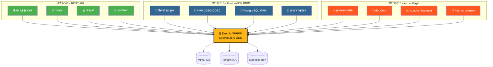
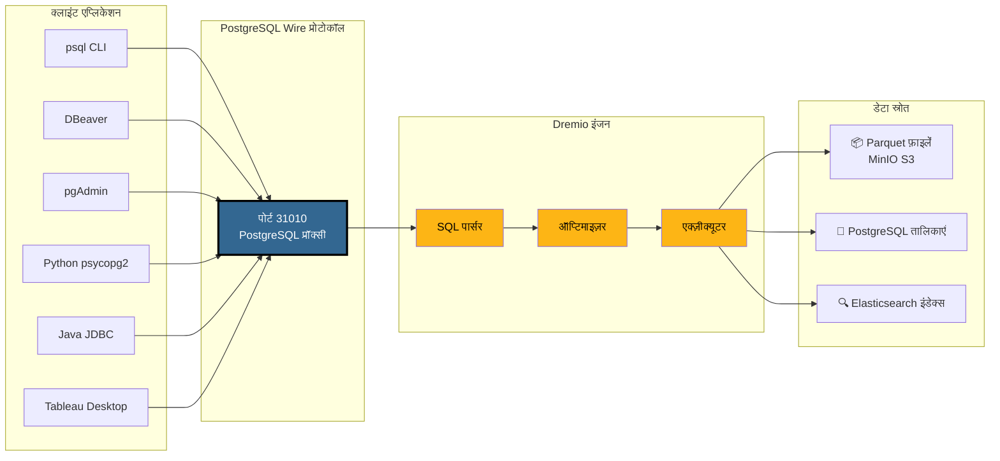
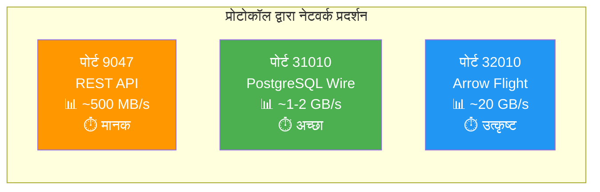
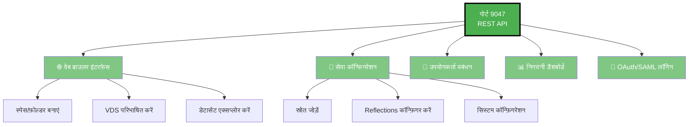
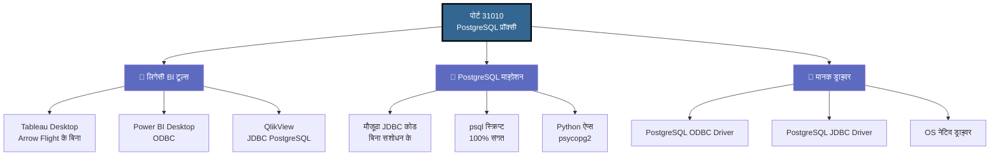
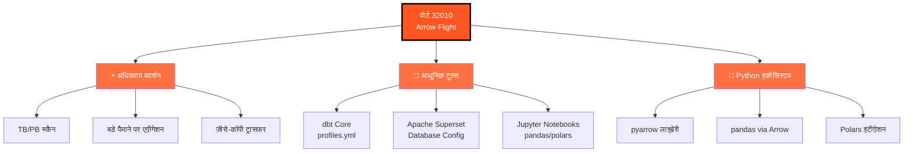
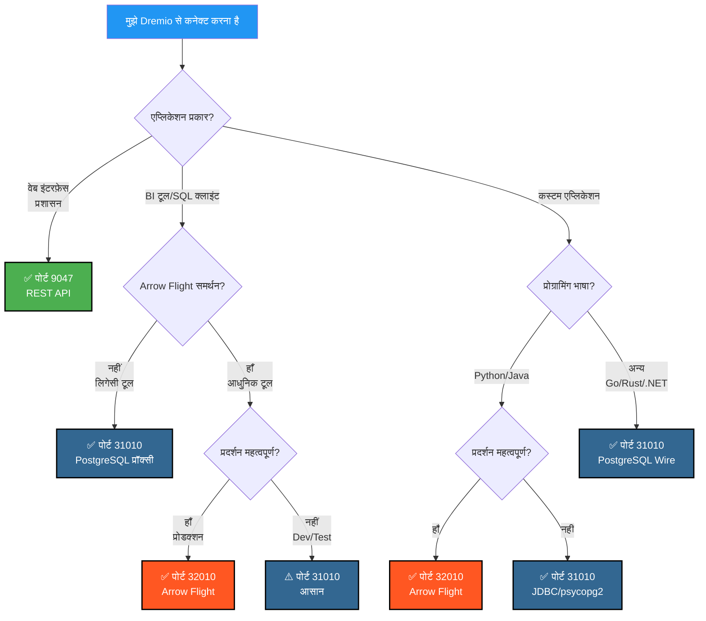
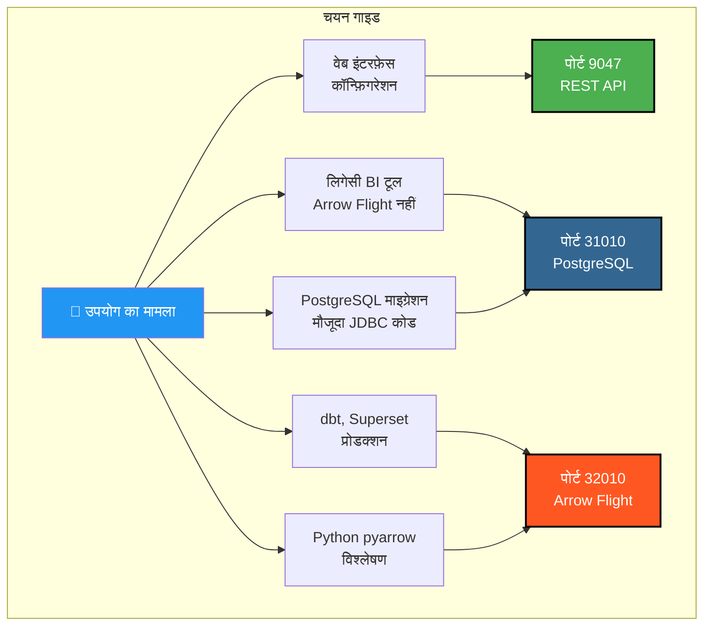

# Dremio पोर्ट्स के लिए विज़ुअल गाइड

**संस्करण**: 3.2.5  
**अंतिम अपडेट**: 16 अक्टूबर 2025  
**भाषा**: हिन्दी

---

## Dremio के 3 पोर्ट्स का अवलोकन



---

## PostgreSQL प्रॉक्सी विस्तृत आर्किटेक्चर

### क्लाइंट → Dremio कनेक्शन प्रवाह



---

## प्रदर्शन तुलना

### बेंचमार्क: 100 GB डेटा स्कैन

```mermaid
gantt
    title प्रोटोकॉल द्वारा निष्पादन समय (सेकंड)
    dateFormat X
    axisFormat %s सेकंड
    
    section REST API :9047
    100 GB स्थानांतरण     :0, 180
    
    section PostgreSQL :31010
    100 GB स्थानांतरण     :0, 90
    
    section Arrow Flight :32010
    100 GB स्थानांतरण     :0, 5
```



### डेटा थ्रूपुट



### सरल क्वेरी लेटेंसी

| प्रोटोकॉल | पोर्ट | औसत लेटेंसी | नेटवर्क ओवरहेड |
|----------|------|----------------|------------------|
| **REST API** | 9047 | 50-100 ms | JSON (विस्तृत) |
| **PostgreSQL प्रॉक्सी** | 31010 | 20-50 ms | Wire Protocol (संक्षिप्त) |
| **Arrow Flight** | 32010 | 5-10 ms | Apache Arrow (बाइनरी कॉलमर) |

---

## पोर्ट द्वारा उपयोग के मामले

### पोर्ट 9047 - REST API



### पोर्ट 31010 - PostgreSQL प्रॉक्सी



### पोर्ट 32010 - Arrow Flight



---

## निर्णय वृक्ष: किस पोर्ट का उपयोग करें?



---

## PostgreSQL प्रॉक्सी कनेक्शन उदाहरण

### 1. psql CLI

```bash
# सरल कनेक्शन
psql -h localhost -p 31010 -U admin -d datalake

# सीधी क्वेरी
psql -h localhost -p 31010 -U admin -d datalake \
  -c "SELECT COUNT(*) FROM MinIO.datalake.customers;"

# इंटरैक्टिव मोड
$ psql -h localhost -p 31010 -U admin -d datalake
Password for user admin: ****
psql (16.0, server 26.0)
Type "help" for help.

datalake=> \dt
           List of relations
 Schema |   Name    | Type  | Owner 
--------+-----------+-------+-------
 public | customers | table | admin
 public | orders    | table | admin
(2 rows)

datalake=> SELECT customer_id, name, state FROM customers LIMIT 5;
```

### 2. DBeaver कॉन्फ़िगरेशन

```yaml
कनेक्शन प्रकार: PostgreSQL
कनेक्शन नाम: Dremio via PostgreSQL Proxy

मुख्य:
  होस्ट: localhost
  पोर्ट: 31010
  डेटाबेस: datalake
  उपयोगकर्ता: admin
  पासवर्ड: [your-password]
  
ड्राइवर गुण:
  ssl: false
  
उन्नत:
  कनेक्शन टाइमआउट: 30000
  क्वेरी टाइमआउट: 0
```

### 3. Python psycopg2 के साथ

```python
import psycopg2
from psycopg2 import sql

# कनेक्शन
conn = psycopg2.connect(
    host="localhost",
    port=31010,
    database="datalake",
    user="admin",
    password="your-password"
)

# कर्सर
cursor = conn.cursor()

# सरल क्वेरी
cursor.execute("SELECT * FROM MinIO.datalake.customers LIMIT 10")
rows = cursor.fetchall()

for row in rows:
    print(row)

# पैरामीटराइज़्ड क्वेरी
query = sql.SQL("SELECT * FROM {} WHERE state = %s").format(
    sql.Identifier("MinIO", "datalake", "customers")
)
cursor.execute(query, ("CA",))

# बंद करें
cursor.close()
conn.close()
```

### 4. Java JDBC

```java
import java.sql.*;

public class DremioPostgreSQLProxy {
    public static void main(String[] args) {
        String url = "jdbc:postgresql://localhost:31010/datalake";
        String user = "admin";
        String password = "your-password";
        
        try (Connection conn = DriverManager.getConnection(url, user, password)) {
            Statement stmt = conn.createStatement();
            ResultSet rs = stmt.executeQuery(
                "SELECT customer_id, name, state FROM MinIO.datalake.customers LIMIT 10"
            );
            
            while (rs.next()) {
                int id = rs.getInt("customer_id");
                String name = rs.getString("name");
                String state = rs.getString("state");
                System.out.printf("ID: %d, Name: %s, State: %s%n", id, name, state);
            }
            
            rs.close();
            stmt.close();
        } catch (SQLException e) {
            e.printStackTrace();
        }
    }
}
```

### 5. ODBC कनेक्शन स्ट्रिंग (DSN)

```ini
[ODBC Data Sources]
Dremio_PostgreSQL=PostgreSQL Unicode Driver

[Dremio_PostgreSQL]
Driver=PostgreSQL Unicode
Description=Dremio via PostgreSQL Proxy
Server=localhost
Port=31010
Database=datalake
Username=admin
Password=your-password
SSLMode=disable
Protocol=7.4
```

---

## Docker Compose कॉन्फ़िगरेशन

### Dremio पोर्ट मैपिंग

```yaml
services:
  dremio:
    image: dremio/dremio-oss:26.0
    container_name: dremio
    ports:
      # पोर्ट 9047 - REST API / Web UI
      - "9047:9047"
      
      # पोर्ट 31010 - PostgreSQL प्रॉक्सी (ODBC/JDBC)
      - "31010:31010"
      
      # पोर्ट 32010 - Arrow Flight (प्रदर्शन)
      - "32010:32010"
    environment:
      - DREMIO_JAVA_SERVER_EXTRA_OPTS=-Xms4g -Xmx8g
    volumes:
      - ./docker-volume/dremio:/opt/dremio/data
    networks:
      - data-platform
```

### पोर्ट सत्यापन

```bash
# तीनों पोर्ट खुले हैं या नहीं जाँचें
netstat -an | grep -E '9047|31010|32010'

# REST API परीक्षण
curl -v http://localhost:9047

# PostgreSQL प्रॉक्सी परीक्षण
psql -h localhost -p 31010 -U admin -d datalake -c "SELECT 1;"

# Arrow Flight परीक्षण (Python के साथ)
python3 -c "
from pyarrow import flight
client = flight.connect('grpc://localhost:32010')
print('Arrow Flight OK')
"
```

---

## त्वरित दृश्य सारांश

### एक नज़र में 3 पोर्ट

| पोर्ट | प्रोटोकॉल | मुख्य उपयोग | प्रदर्शन | संगतता |
|------|-----------|-------------|------------|----------------|
| **9047** | REST API | 🌐 Web UI, Admin | ⭐⭐ मानक | ⭐⭐⭐ सार्वभौमिक |
| **31010** | PostgreSQL Wire | 💼 BI टूल्स, माइग्रेशन | ⭐⭐⭐ अच्छा | ⭐⭐⭐ उत्कृष्ट |
| **32010** | Arrow Flight | ⚡ प्रोडक्शन, dbt, Superset | ⭐⭐⭐⭐⭐ अधिकतम | ⭐⭐ सीमित |

### चयन मैट्रिक्स



---

## अतिरिक्त संसाधन

### संबंधित दस्तावेज़ीकरण

- [आर्किटेक्चर - घटक](./components.md) - "Dremio के लिए PostgreSQL प्रॉक्सी" अनुभाग
- [गाइड - Dremio सेटअप](../guides/dremio-setup.md) - "PostgreSQL प्रॉक्सी के माध्यम से कनेक्शन" अनुभाग
- [कॉन्फ़िगरेशन - Dremio](../getting-started/configuration.md) - `dremio.conf` कॉन्फ़िगरेशन

### आधिकारिक लिंक

- **Dremio दस्तावेज़ीकरण**: https://docs.dremio.com/
- **PostgreSQL Wire प्रोटोकॉल**: https://www.postgresql.org/docs/current/protocol.html
- **Apache Arrow Flight**: https://arrow.apache.org/docs/format/Flight.html

---

**संस्करण**: 3.2.5  
**अंतिम अपडेट**: 16 अक्टूबर 2025  
**स्थिति**: ✅ पूर्ण
