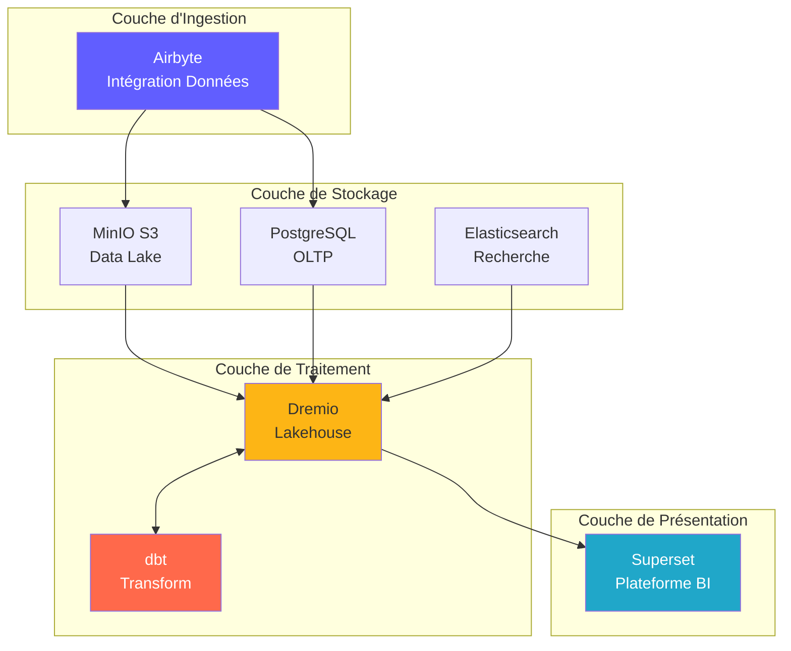
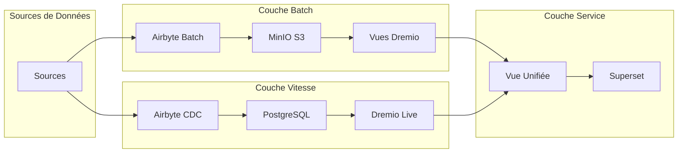
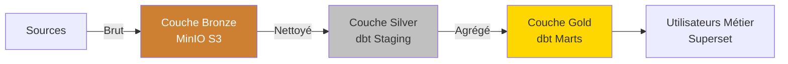
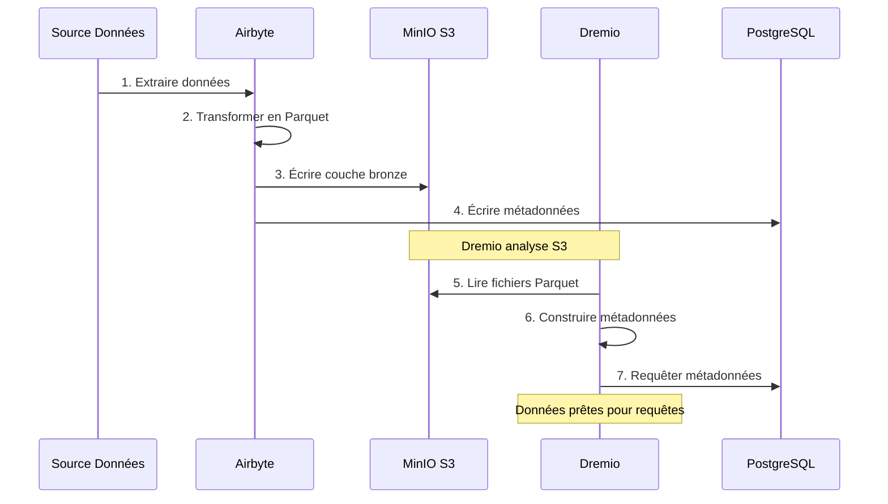
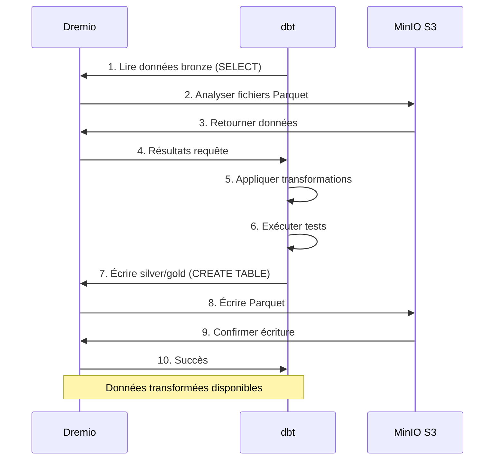
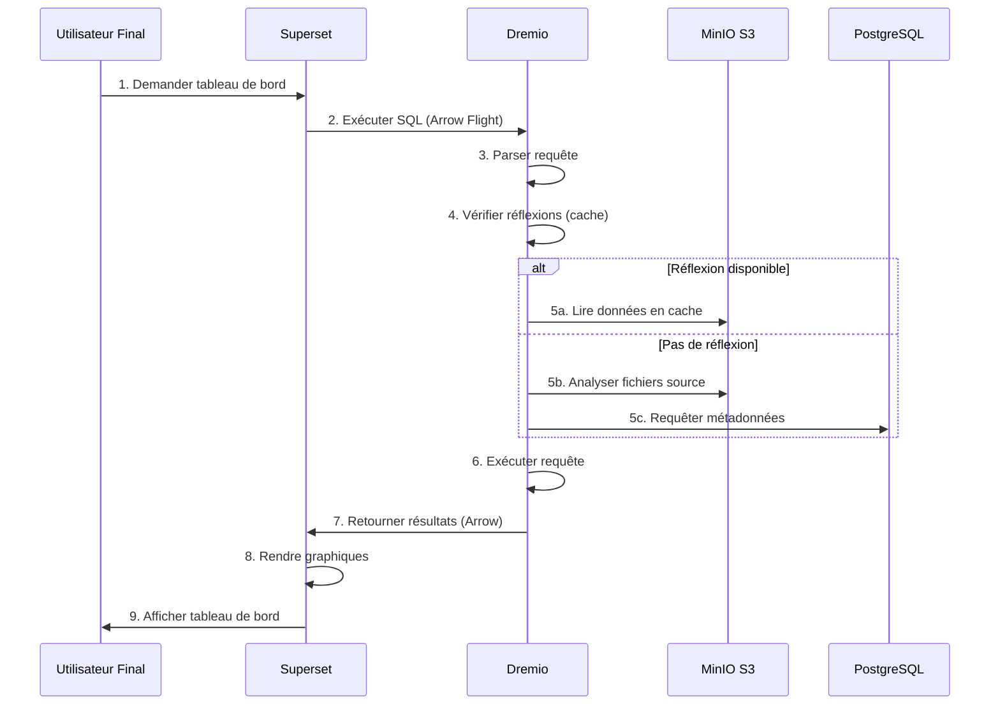
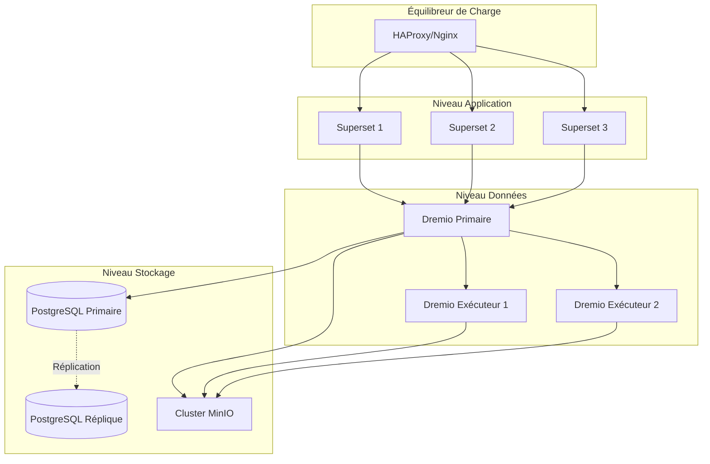
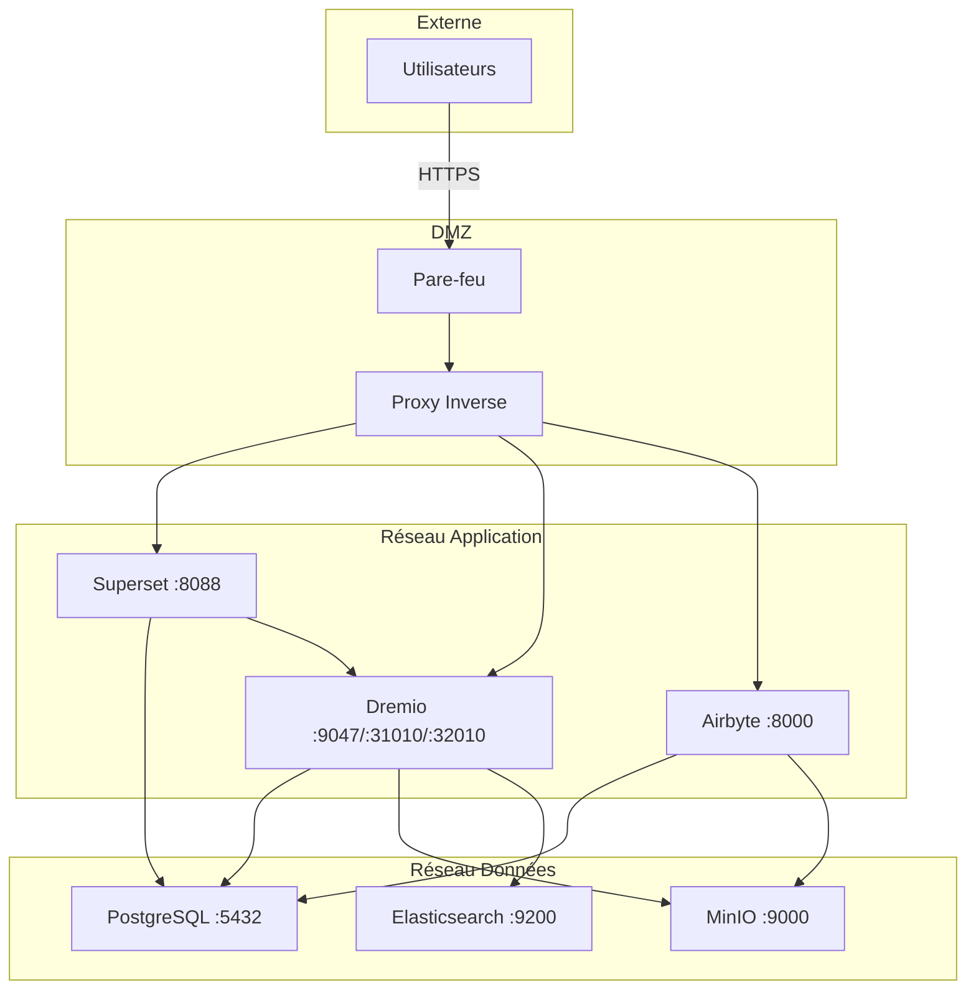
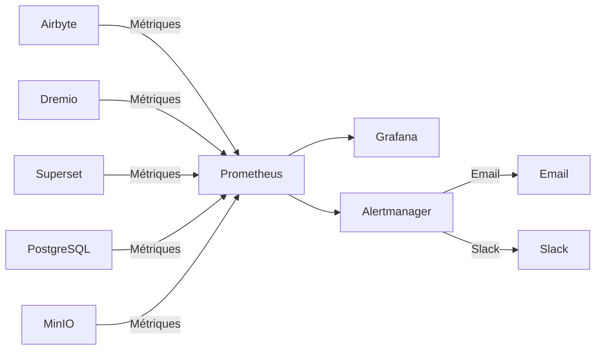

#वास्तुकला सिंहावलोकन

**संस्करण**: 3.2.0  
**अंतिम अद्यतन**: 2025-10-16  
**भाषा**: फ्रेंच

---

## परिचय

डेटा प्लेटफ़ॉर्म एक आधुनिक क्लाउड-नेटिव आर्किटेक्चर है जो ओपन सोर्स प्रौद्योगिकियों पर बनाया गया है। यह डेटा अंतर्ग्रहण, भंडारण, परिवर्तन और विज़ुअलाइज़ेशन के लिए एक व्यापक समाधान प्रदान करता है, जिसे एंटरप्राइज़-स्केल विश्लेषणात्मक कार्यभार के लिए डिज़ाइन किया गया है।



---

## डिज़ाइन सिद्धांत

### 1. सबसे पहले ओपन सोर्स

**दर्शन**: विक्रेता लॉक-इन से बचने और लचीलापन बनाए रखने के लिए ओपन सोर्स प्रौद्योगिकियों का उपयोग करें।

**फ़ायदे**:
- कोई लाइसेंस शुल्क नहीं
- सामुदायिक विकास
- पूर्ण अनुकूलन क्षमता
- पारदर्शी सुरक्षा ऑडिट
- व्यापक पारिस्थितिकी तंत्र अनुकूलता

### 2. स्तरित वास्तुकला

**दर्शन**: रख-रखाव और मापनीयता के लिए चिंताओं को अलग-अलग परतों में अलग करें।

**परतें**:
```
┌─────────────────────────────────────┐
│     Couche de Présentation          │  Superset (BI & Tableaux de Bord)
├─────────────────────────────────────┤
│     Couche Sémantique               │  Dremio (Moteur de Requête)
├─────────────────────────────────────┤
│     Couche de Transformation        │  dbt (Transformation Données)
├─────────────────────────────────────┤
│     Couche de Stockage              │  MinIO, PostgreSQL, Elasticsearch
├─────────────────────────────────────┤
│     Couche d'Ingestion              │  Airbyte (Intégration Données)
└─────────────────────────────────────┘
```

### 3. ईटीएल के बजाय ईएलटी

**दर्शन**: पहले कच्चे डेटा को लोड करें, गंतव्य (ईएलटी) में बदलें।

**ईएलटी क्यों?**
- **लचीलापन**: डेटा को दोबारा निकाले बिना कई तरीकों से रूपांतरित करें
- **प्रदर्शन**: परिवर्तनों के लिए गंतव्य गणना का उपयोग करें
- **ऑडिटेबिलिटी**: कच्चा डेटा सत्यापन के लिए हमेशा उपलब्ध रहता है
- **लागत**: स्रोत प्रणालियों पर निष्कर्षण भार कम करें

**प्रवाह**:
```
Extract → Load → Transform
(Airbyte) (MinIO/PostgreSQL) (dbt + Dremio)
```

### 4. डेटा लेकहाउस मॉडल

**दर्शन**: डेटा लेक के लचीलेपन को डेटा वेयरहाउस के प्रदर्शन के साथ मिलाएं।

**विशेषताएँ**:
- **एसिड लेनदेन**: विश्वसनीय डेटा संचालन
- **स्कीमा एप्लिकेशन**: डेटा गुणवत्ता की गारंटी
- **समय यात्रा**: ऐतिहासिक संस्करण पूछें
- **खुले प्रारूप**: लकड़ी की छत, हिमशैल, डेल्टा झील
- **सीधी फ़ाइल पहुंच**: कोई मालिकाना लॉकिंग नहीं

### 5. क्लाउड-नेटिव डिज़ाइन

**दर्शन**: कंटेनरीकृत और वितरित वातावरण के लिए डिज़ाइन।

**कार्यान्वयन**:
- सभी सेवाओं के लिए डॉकर कंटेनर
- क्षैतिज मापनीयता
- कोड के रूप में इंफ्रास्ट्रक्चर
- जहां भी संभव हो राज्यविहीन
- पर्यावरण चर के माध्यम से विन्यास

---

## वास्तुकला मॉडल

### लैम्ब्डा आर्किटेक्चर (बैच + स्ट्रीम)



**बैच परत** (ऐतिहासिक डेटा):
- बड़ी मात्रा में डेटा
- आवधिक उपचार (प्रति घंटा/दैनिक)
- स्वीकार्य उच्च विलंबता
- पूर्ण पुनर्प्रसंस्करण संभव

**स्पीड लेयर** (वास्तविक समय डेटा):
- डेटा कैप्चर बदलें (सीडीसी)
- कम विलंबता की आवश्यकता
- केवल वृद्धिशील अद्यतन
- हाल के डेटा का प्रबंधन करता है

**सेवा परत**:
- बैच और स्पीड व्यू को मर्ज करता है
- एकल क्वेरी इंटरफ़ेस (ड्रेमियो)
- स्वचालित दृश्य चयन

### वास्तुकला पदक (कांस्य → रजत → स्वर्ण)



**कांस्य परत** (कच्चा):
- डेटा जैसा कि स्रोतों से है
- कोई परिवर्तन नहीं
- पूरा इतिहास संरक्षित
- एयरबाइट यहां लोड होता है

**चांदी की परत** (साफ):
- लागू डेटा गुणवत्ता
- मानकीकृत प्रारूप
- डीबीटी स्टेजिंग टेम्प्लेट
- एनालिटिक्स तैयार

**सोने की परत** (पेशा):
- एकत्रित मेट्रिक्स
- लागू व्यावसायिक तर्क
- मार्ट डीबीटी मॉडल
- उपभोग के लिए अनुकूलित

---

## घटकों के बीच परस्पर क्रिया

### डेटा अंतर्ग्रहण प्रवाह



### परिवर्तन पाइपलाइन



### क्वेरी निष्पादित करना



---

## स्केलेबिलिटी मॉडल

### क्षैतिज स्केलिंग

**राज्यविहीन सेवाएँ** (स्वतंत्र रूप से विकसित हो सकती हैं):
- एयरबाइट वर्कर्स: समानांतर सिंक्रनाइज़ेशन के लिए विकसित करें
- ड्रेमियो एक्ज़ीक्यूटर्स: क्वेरी प्रदर्शन के लिए पैमाना
- वेब सुपरसेट: प्रतिस्पर्धी उपयोगकर्ताओं के लिए विकसित करें

**राज्यव्यापी सेवाएँ** (समन्वय की आवश्यकता):
- PostgreSQL: प्राथमिक-प्रतिकृति प्रतिकृति
- मिनिओ: वितरित मोड (एकाधिक नोड्स)
- इलास्टिक्स खोज: शार्डिंग के साथ क्लस्टर

### लंबवत स्केलिंग

**याददाश्त में गहन**:
- ड्रेमियो: बड़े प्रश्नों के लिए जेवीएम ढेर बढ़ाएँ
- PostgreSQL: कैश बफ़र के लिए अधिक RAM
- इलास्टिक्स खोज: अनुक्रमण के लिए अधिक ढेर

**सीपीयू गहन**:
- डीबीटी: समानांतर निर्माण मॉडल के लिए अधिक कोर
- एयरबाइट: तेज़ डेटा परिवर्तन

### डेटा विभाजन

```sql
-- Exemple: Partitionner par date
CREATE TABLE orders_partitioned (
    order_id INT,
    customer_id INT,
    amount DECIMAL,
    order_date DATE
)
PARTITION BY (DATE_TRUNC('month', order_date))
STORED AS PARQUET;

-- La requête analyse uniquement les partitions pertinentes
SELECT SUM(amount)
FROM orders_partitioned
WHERE order_date >= '2025-01-01'
  AND order_date < '2025-02-01';
-- Analyse uniquement la partition de janvier
```

---

## उच्च उपलब्धता

### सेवाओं का अतिरेक



### विफलता परिदृश्य

| घटक | ब्रेकडाउन | पुनर्प्राप्ति |
|----------------------|------|------|
| **एयरबाइट वर्कर** | कंटेनर दुर्घटना | स्वतः पुनः आरंभ, सिंक फिर से शुरू करें |
| **ड्रेमियो एक्ज़ीक्यूटर** | नोड विफलता | अनुरोध अन्य निष्पादकों को पुनर्निर्देशित किया गया |
| **पोस्टग्रेएसक्यूएल** | प्राथमिक रूप से सेवा से बाहर | प्राथमिक में प्रतिकृति को बढ़ावा दें |
| **मिनियो नोड** | डिस्क विफलता | इरेज़र कोडिंग डेटा का पुनर्निर्माण करती है |
| **सुपरसेट** | सेवा सेवा से बाहर | बैलेंसर ट्रैफ़िक को पुनर्निर्देशित करता है |

### बैकअप रणनीति

```bash
# Sauvegardes automatisées quotidiennes
0 2 * * * /scripts/backup_all.sh

# backup_all.sh
#!/bin/bash

# Sauvegarder PostgreSQL
pg_dumpall -U postgres > /backups/postgres_$(date +%Y%m%d).sql

# Sauvegarder métadonnées Dremio
tar czf /backups/dremio_$(date +%Y%m%d).tar.gz /opt/dremio/data

# Synchroniser MinIO vers S3 distant
mc mirror MinIOLake/datalake s3-offsite/datalake-backup

# Conserver 30 jours
find /backups -mtime +30 -delete
```

---

## सुरक्षा वास्तुकला

### नेटवर्क सुरक्षा



### सत्यापन और प्राधिकरण

**सेवा प्रमाणीकरण**:
- **ड्रेमियो**: एलडीएपी/एडी, ओएथ2, एसएएमएल एकीकरण
- **सुपरसेट**: डेटाबेस प्रामाणिक, एलडीएपी, OAuth2
- **एयरबाइट**: बेसिक ऑथ, OAuth2 (उद्यम)
- **मिनियो**: आईएएम नीतियां, एसटीएस टोकन

**प्राधिकरण स्तर**:
```yaml
Rôles:
  - Admin:
      - Accès complet à tous les services
      - Gestion utilisateurs
      - Modifications configuration
  
  - Data Engineer:
      - Créer/modifier sources données
      - Exécuter syncs Airbyte
      - Exécuter modèles dbt
      - Créer datasets Dremio
  
  - Analyst:
      - Accès lecture seule données
      - Créer tableaux de bord Superset
      - Requêter datasets Dremio
  
  - Viewer:
      - Voir tableaux de bord uniquement
      - Pas d'accès données
```

### डेटा एन्क्रिप्शन

**आराम से**:
- मिनिओ: सर्वर-साइड एन्क्रिप्शन (एईएस-256)
- PostgreSQL: पारदर्शी डेटा एन्क्रिप्शन (TDE)
- इलास्टिक्स खोज: एन्क्रिप्टेड इंडेक्स

**पारगमन में**:
- सभी अंतर-सेवा संचार के लिए टीएलएस 1.3
- ड्रेमियो ↔ सुपरसेट के लिए टीएलएस के साथ एरो फ़्लाइट
- वेब इंटरफेस के लिए HTTPS

---

## निगरानी और अवलोकन

### मेट्रिक्स संग्रह



**मुख्य मेट्रिक्स**:
- **एयरबाइट**: सिंक सफलता दर, रिकॉर्डिंग सिंक्रनाइज़, बाइट्स स्थानांतरित
- **ड्रेमियो**: अनुरोध विलंबता, कैश हिट दर, संसाधन उपयोग
- **डीबीटी**: मॉडल निर्माण समय, परीक्षण विफलताएं
- **सुपरसेट**: डैशबोर्ड लोडिंग समय, सक्रिय उपयोगकर्ता
- **इंफ्रास्ट्रक्चर**: सीपीयू, मेमोरी, डिस्क, नेटवर्क

### लॉगिंग

**केंद्रीकृत लॉगिंग**:
```yaml
Stack ELK:
  - Elasticsearch: Stocker logs
  - Logstash: Traiter logs
  - Kibana: Visualiser logs

Sources de Logs:
  - Logs application (format JSON)
  - Logs d'accès
  - Logs d'audit
  - Logs d'erreur
```

### ट्रेसिंग

**वितरित ट्रेसिंग**:
- जैगर या ज़िपकिन एकीकरण
- सेवाओं के बीच ट्रेस अनुरोध
- बाधाओं को पहचानें
- प्रदर्शन संबंधी समस्याओं को डीबग करें

---

## परिनियोजन टोपोलॉजी

### विकास का माहौल

```yaml
Hôte Unique:
  Ressources: 8 Go RAM, 4 CPUs
  Services: Tous sur une machine
  Stockage: Volumes locaux
  Réseau: Réseau bridge
  Cas d'usage: Développement, tests
```

### मंचन वातावरण

```yaml
Multi-Hôtes:
  Ressources: 16 Go RAM, 8 CPUs par hôte
  Services: Répartis sur 2-3 hôtes
  Stockage: NFS partagé ou MinIO distribué
  Réseau: Réseau overlay
  Cas d'usage: Tests pré-production, UAT
```

### उत्पादन वातावरण

```yaml
Cluster Kubernetes:
  Ressources: Auto-scaling selon charge
  Services: Conteneurisés, répliqués
  Stockage: Volumes persistants (SSD)
  Réseau: Service mesh (Istio)
  Haute Disponibilité: Déploiement multi-zones
  Cas d'usage: Charges production
```

---

## तकनीकी विकल्पों का औचित्य

### एयरबाइट क्यों?

- **300+ कनेक्टर**: पूर्व-निर्मित एकीकरण
- **खुला स्रोत**: कोई आपूर्तिकर्ता लॉक-इन नहीं
- **सक्रिय समुदाय**: 12k+ GitHub सितारे
- **सीडीसी समर्थन**: वास्तविक समय डेटा कैप्चर
- **मानकीकरण**: अंतर्निहित डीबीटी एकीकरण

### ड्रेमियो क्यों?

- **क्वेरी त्वरण**: क्वेरीज़ 10-100 गुना तेज़
- **एरो फ़्लाइट**: उच्च प्रदर्शन डेटा स्थानांतरण
- **डेटा लेक अनुकूलता**: कोई डेटा मूवमेंट नहीं
- **स्वयं-सेवा**: व्यावसायिक उपयोगकर्ता डेटा का अन्वेषण करते हैं
- **लाभदायक**: गोदाम की लागत कम करें

### डीबीटी क्यों?

- **एसक्यूएल आधारित**: विश्लेषकों से परिचित
- **संस्करण नियंत्रण**: गिट एकीकरण
- **परीक्षण**: एकीकृत डेटा गुणवत्ता परीक्षण
- **दस्तावेज़ीकरण**: स्वतः उत्पन्न दस्तावेज़
- **समुदाय**: 5k+ पैकेज उपलब्ध हैं

### सुपरसेट क्यों?

- **आधुनिक यूआई**: सहज इंटरफ़ेस
- **एसक्यूएल आईडीई**: उन्नत क्वेरी क्षमताएं
- **समृद्ध विज़ुअलाइज़ेशन**: 50+ ग्राफ़िक प्रकार
- **एक्स्टेंसिबल**: कस्टम प्लगइन्स
- **खुला स्रोत**: समर्थित अपाचे फाउंडेशन

### PostgreSQL क्यों?

- **विश्वसनीयता**: एसिड अनुपालन
- **प्रदर्शन**: पैमाने पर सिद्ध
- **विशेषताएं**: JSON, पूर्ण पाठ खोज, एक्सटेंशन
- **समुदाय**: परिपक्व पारिस्थितिकी तंत्र
- **लागत**: निःशुल्क और खुला स्रोत

### मिनियो क्यों?

- **S3 अनुकूलता**: उद्योग मानक एपीआई
- **प्रदर्शन**: उच्च प्रवाह दर
- **इरेज़र कोडिंग**: डेटा टिकाऊपन
- **मल्टी-क्लाउड**: हर जगह तैनात करें
- **लागत प्रभावी**: स्व-होस्टेड विकल्प

---

## वास्तुकला का भविष्य का विकास

### नियोजित सुधार

1. **डेटा कैटलॉग** (ओपनमेटाडेटा इंटीग्रेशन)
   - मेटाडेटा प्रबंधन
   - वंश ट्रैकिंग
   - डेटा खोज

2. **डेटा गुणवत्ता** (बड़ी उम्मीदें)
   - स्वचालित सत्यापन
   - विसंगति का पता लगाना
   - गुणवत्ता वाले डैशबोर्ड

3. **एमएल ऑपरेशंस** (एमएलफ्लो)
   - मॉडल प्रशिक्षण पाइपलाइन
   - मॉडल रजिस्टर
   - परिनियोजन स्वचालन

4. **स्ट्रीम प्रोसेसिंग** (अपाचे फ्लिंक)
   - वास्तविक समय परिवर्तन
   - जटिल घटना प्रसंस्करण
   - स्ट्रीमिंग एनालिटिक्स

5. **डेटा गवर्नेंस** (अपाचे एटलस)
   - नीति आवेदन
   - एक्सेस ऑडिट
   - अनुपालन रिपोर्ट

---

## सन्दर्भ

- [घटक विवरण](components.md)
- [डेटा प्रवाह](डेटा-प्रवाह.एमडी)
- [परिनियोजन गाइड](परिनियोजन.एमडी)
- [एयरबाइट इंटीग्रेशन](../guides/airbyte-integration.md)

---

**आर्किटेक्चर अवलोकन संस्करण**: 3.2.0  
**अंतिम अद्यतन**: 2025-10-16  
**द्वारा रखरखाव**: डेटा प्लेटफ़ॉर्म टीम