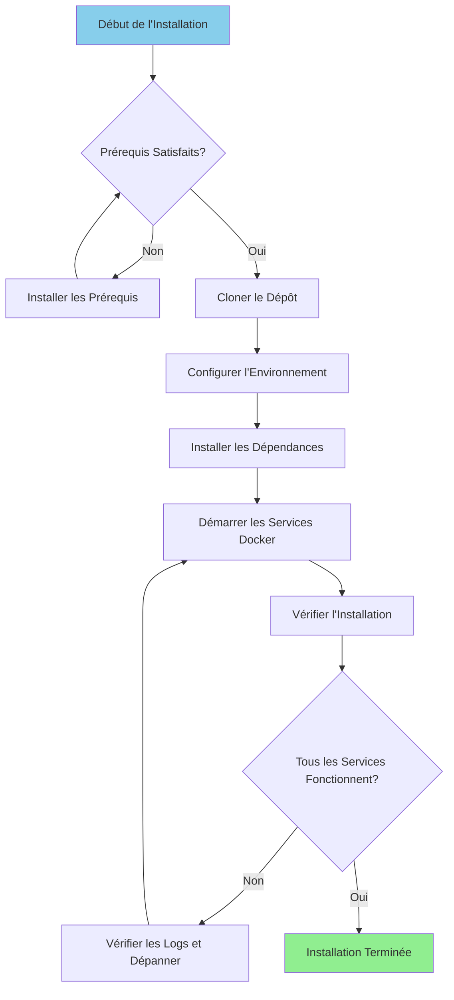

# इंस्टालेशन गाइड

**संस्करण**: 3.2.0  
**अंतिम अद्यतन**: 2025-10-16  
**भाषा**: फ्रेंच

---

## अवलोकन

यह मार्गदर्शिका एयरबाइट, ड्रेमियो, डीबीटी, अपाचे सुपरसेट और सहायक बुनियादी ढांचे सहित संपूर्ण डेटा प्लेटफ़ॉर्म को स्थापित और कॉन्फ़िगर करने के लिए चरण-दर-चरण निर्देश प्रदान करती है।



---

## पूर्वावश्यकताएँ

### सिस्टम आवश्यकताएं

**न्यूनतम आवश्यकताओं:**
- **सीपीयू**: 4 कोर (8+ अनुशंसित)
- **रैम**: 8 जीबी (16+ जीबी अनुशंसित)
- **डिस्क स्थान**: 20 जीबी उपलब्ध (50+ जीबी अनुशंसित)
- **नेटवर्क**: डॉकर छवियों के लिए स्थिर इंटरनेट कनेक्शन

**ऑपरेटिंग सिस्टम:**
- लिनक्स (उबंटू 20.04+, सेंटओएस 8+, डेबियन 11+)
- मैकओएस (11.0+)
- WSL2 के साथ विंडोज़ 10/11

### आवश्यक सॉफ्टवेयर

#### 1. डॉकर

**संस्करण**: 20.10 या उच्चतर

**सुविधा:**

**लिनक्स:**
```bash
# Installer Docker
curl -fsSL https://get.docker.com -o get-docker.sh
sudo sh get-docker.sh

# Ajouter l'utilisateur au groupe docker
sudo usermod -aG docker $USER

# Démarrer le service Docker
sudo systemctl start docker
sudo systemctl enable docker

# Vérifier l'installation
docker --version
```

**मैक ओएस:**
```bash
# Télécharger et installer Docker Desktop depuis:
# https://www.docker.com/products/docker-desktop

# Vérifier l'installation
docker --version
```

**विंडोज़:**
```powershell
# Installer WSL2 d'abord
wsl --install

# Télécharger et installer Docker Desktop depuis:
# https://www.docker.com/products/docker-desktop

# Vérifier l'installation
docker --version
```

#### 2. डॉकर कंपोज़

**संस्करण**: 2.0 या उच्चतर

**सुविधा:**

```bash
# Linux
sudo curl -L "https://github.com/docker/compose/releases/latest/download/docker-compose-$(uname -s)-$(uname -m)" -o /usr/local/bin/docker-compose
sudo chmod +x /usr/local/bin/docker-compose

# Vérifier l'installation
docker-compose --version
```

**ध्यान दें**: macOS और Windows के लिए डॉकर डेस्कटॉप में डॉकर कंपोज़ शामिल है।

#### 3. अजगर

**संस्करण**: 3.11 या उच्चतर

**सुविधा:**

**लिनक्स (उबंटू/डेबियन):**
```bash
sudo apt update
sudo apt install python3.11 python3.11-venv python3-pip
```

**मैक ओएस:**
```bash
brew install python@3.11
```

**विंडोज़:**
```powershell
# Télécharger l'installateur depuis python.org
# Ou utiliser winget:
winget install Python.Python.3.11
```

**सत्यापन:**
```bash
python --version  # ou python3 --version
pip --version     # ou pip3 --version
```

#### 4. गिट

**सुविधा:**

```bash
# Linux
sudo apt install git  # Ubuntu/Debian
sudo yum install git  # CentOS/RHEL

# macOS
brew install git

# Windows
winget install Git.Git
```

**सत्यापन:**
```bash
git --version
```

---

## स्थापना चरण

### चरण 1: रिपॉजिटरी को क्लोन करें

```bash
# Cloner le dépôt
git clone https://github.com/your-org/dremiodbt.git

# Naviguer vers le répertoire du projet
cd dremiodbt

# Vérifier le contenu
ls -la
```

**अपेक्षित संरचना:**
```
dremiodbt/
├── docker-compose.yml
├── docker-compose-airbyte.yml
├── README.md
├── requirements.txt
├── dbt/
├── dremio_connector/
├── docs/
└── scripts/
```

### चरण 2: पर्यावरण कॉन्फ़िगर करें

#### पर्यावरण फ़ाइल बनाएँ

```bash
# Copier le fichier d'environnement exemple
cp .env.example .env

# Éditer la configuration (optionnel)
nano .env  # ou utiliser votre éditeur préféré
```

#### पर्यावरण चर

**बुनियादी कॉन्फ़िगरेशन:**
```bash
# Projet
PROJECT_NAME=dremiodbt
ENVIRONMENT=development

# Réseau Docker
NETWORK_NAME=dremio_network

# PostgreSQL
POSTGRES_HOST=postgres
POSTGRES_PORT=5432
POSTGRES_DB=dremio_db
POSTGRES_USER=postgres
POSTGRES_PASSWORD=postgres123

# Dremio
DREMIO_VERSION=26.0
DREMIO_HTTP_PORT=9047
DREMIO_FLIGHT_PORT=32010
DREMIO_ADMIN_USER=admin
DREMIO_ADMIN_PASSWORD=admin123

# Airbyte
AIRBYTE_VERSION=0.50.33
AIRBYTE_HTTP_PORT=8000
AIRBYTE_API_PORT=8001

# Superset
SUPERSET_VERSION=3.0
SUPERSET_HTTP_PORT=8088
SUPERSET_ADMIN_USER=admin
SUPERSET_ADMIN_PASSWORD=admin

# MinIO
MINIO_VERSION=latest
MINIO_API_PORT=9000
MINIO_CONSOLE_PORT=9001
MINIO_ROOT_USER=minioadmin
MINIO_ROOT_PASSWORD=minioadmin123

# Elasticsearch
ELASTIC_VERSION=8.15.0
ELASTIC_HTTP_PORT=9200
```

### चरण 3: पायथन निर्भरताएँ स्थापित करें

#### आभासी वातावरण बनाएं

```bash
# Créer l'environnement virtuel
python -m venv venv

# Activer l'environnement virtuel
# Linux/macOS:
source venv/bin/activate

# Windows:
.\venv\Scripts\activate
```

#### इंस्टॉल आवश्यकताएँ

```bash
# Mettre à jour pip
pip install --upgrade pip

# Installer les dépendances
pip install -r requirements.txt

# Vérifier l'installation
pip list
```

**कुंजी स्थापित पैकेज:**
- `pyarrow>=21.0.0` - एरो फ्लाइट ग्राहक
- `pandas>=2.3.0` - डेटा हेरफेर
- `dbt-core>=1.10.0` - डेटा परिवर्तन
- `sqlalchemy>=2.0.0` - डेटाबेस कनेक्टिविटी
- `pyyaml>=6.0.0` - कॉन्फ़िगरेशन प्रबंधन

### चरण 4: डॉकर सेवाएँ प्रारंभ करें

#### मुख्य सेवाएँ प्रारंभ करें

```bash
# Démarrer tous les services
docker-compose up -d

# Ou utiliser Makefile (si disponible)
make up
```

**सेवाएँ प्रारंभ:**
- पोस्टग्रेएसक्यूएल (पोर्ट 5432)
- ड्रेमियो (पोर्ट 9047, 32010)
- अपाचे सुपरसेट (पोर्ट 8088)
- मिनिओ (पोर्ट 9000, 9001)
- इलास्टिक्स खोज (पोर्ट 9200)

#### एयरबाइट प्रारंभ करें (अलग लिखें)

```bash
# Démarrer les services Airbyte
docker-compose -f docker-compose-airbyte.yml up -d
```

**एयरबाइट सेवाएं शुरू:**
- एयरबाइट सर्वर (पोर्ट 8001)
- एयरबाइट वेब यूआई (पोर्ट 8000)
- एयरबाइट वर्कर
- एयरबाइट टेम्पोरल
- एयरबाइट डेटाबेस

#### सेवाओं की स्थिति जांचें

```bash
# Voir les conteneurs en cours d'exécution
docker-compose ps

# Voir tous les conteneurs (incluant Airbyte)
docker ps

# Voir les logs
docker-compose logs -f

# Voir les logs Airbyte
docker-compose -f docker-compose-airbyte.yml logs -f
```

---

## सत्यापन

### चरण 5: सेवाओं की जाँच करें

#### 1. पोस्टग्रेएसक्यूएल

```bash
# Tester la connexion
docker exec -it postgres psql -U postgres -d dremio_db -c "SELECT version();"
```

**अपेक्षित आउटपुट:**
```
PostgreSQL 16.x on x86_64-pc-linux-gnu
```

#### 2. ड्रेमियो

**वेब इंटरफ़ेस:**
```
http://localhost:9047
```

**पहला कनेक्शन:**
- उपयोगकर्ता नाम: `admin`
- पासवर्ड: `admin123`
- पहली बार एक्सेस करने पर आपको एक व्यवस्थापक खाता बनाने के लिए प्रेरित किया जाएगा

**कनेक्शन का परीक्षण करें:**
```bash
# Tester le point de terminaison HTTP
curl http://localhost:9047/apiv2/login
```

#### 3. एयरबाइट

**वेब इंटरफ़ेस:**
```
http://localhost:8000
```

**डिफ़ॉल्ट पहचानकर्ता:**
- ईमेल: `airbyte@example.com`
- पासवर्ड: `password`

**एपीआई का परीक्षण करें:**
```bash
# Vérification de santé
curl http://localhost:8001/health
```

**अपेक्षित प्रतिक्रिया:**
```json
{
  "status": "ok",
  "timestamp": "2025-10-16T12:00:00Z"
}
```

#### 4. अपाचे सुपरसेट

**वेब इंटरफ़ेस:**
```
http://localhost:8088
```

**डिफ़ॉल्ट पहचानकर्ता:**
- उपयोगकर्ता नाम: `admin`
- पासवर्ड: `admin`

**कनेक्शन का परीक्षण करें:**
```bash
curl http://localhost:8088/health
```

#### 5. मिनियो

**कंसोल यूआई:**
```
http://localhost:9001
```

**साख:**
- उपयोगकर्ता नाम: `minioadmin`
- पासवर्ड: `minioadmin123`

**S3 API का परीक्षण करें:**
```bash
# Installer le client MinIO
wget https://dl.min.io/client/mc/release/linux-amd64/mc
chmod +x mc

# Configurer
./mc alias set local http://localhost:9000 minioadmin minioadmin123

# Tester
./mc ls local
```

#### 6. इलास्टिक्स खोज

**कनेक्शन का परीक्षण करें:**
```bash
# Vérification de santé
curl http://localhost:9200/_cluster/health

# Obtenir les informations
curl http://localhost:9200
```

**अपेक्षित प्रतिक्रिया:**
```json
{
  "name": "elasticsearch",
  "cluster_name": "docker-cluster",
  "version": {
    "number": "8.15.0"
  }
}
```

### चरण 6: स्वास्थ्य जांच चलाएँ

```bash
# Exécuter le script de vérification de santé complet
python scripts/health_check.py

# Ou utiliser Makefile
make health-check
```

**अपेक्षित आउटपुट:**
```
✓ PostgreSQL: En cours d'exécution (port 5432)
✓ Dremio: En cours d'exécution (ports 9047, 32010)
✓ Airbyte: En cours d'exécution (ports 8000, 8001)
✓ Superset: En cours d'exécution (port 8088)
✓ MinIO: En cours d'exécution (ports 9000, 9001)
✓ Elasticsearch: En cours d'exécution (port 9200)

Tous les services sont opérationnels!
```

---

## इंस्टालेशन के बाद का कॉन्फ़िगरेशन

### 1. ड्रेमियो को आरंभ करें

```bash
# Exécuter le script d'initialisation
python scripts/init_dremio.py
```

**बनाता है:**
- व्यवस्थापक उपयोगकर्ता
- डिफ़ॉल्ट स्रोत (पोस्टग्रेएसक्यूएल, मिनिओ)
- उदाहरण डेटासेट

### 2. सुपरसेट प्रारंभ करें

```bash
# Initialiser la base de données
docker exec -it superset superset db upgrade

# Créer un utilisateur administrateur (si inexistant)
docker exec -it superset superset fab create-admin \
    --username admin \
    --firstname Admin \
    --lastname User \
    --email admin@example.com \
    --password admin

# Initialiser Superset
docker exec -it superset superset init
```

### 3. डीबीटी कॉन्फ़िगर करें

```bash
# Naviguer vers le répertoire dbt
cd dbt

# Tester la connexion
dbt debug

# Exécuter les modèles initiaux
dbt run

# Exécuter les tests
dbt test
```

### 4. एयरबाइट कॉन्फ़िगर करें

**वेब इंटरफ़ेस के माध्यम से (http://localhost:8000):**

1. सेटअप विज़ार्ड पूरा करें
2. पहला स्रोत कॉन्फ़िगर करें (उदाहरण: PostgreSQL)
3. गंतव्य कॉन्फ़िगर करें (उदा: मिनिओ S3)
4. कनेक्शन बनाएं
5. पहला सिंक चलाएँ

**एपीआई के माध्यम से:**
```bash
# Voir docs/i18n/fr/guides/airbyte-integration.md pour les détails
python scripts/configure_airbyte.py
```

---

## स्थापना के बाद निर्देशिका संरचना

```
dremiodbt/
├── venv/                          # Environnement virtuel Python
├── data/                          # Stockage de données local
│   ├── dremio/                    # Métadonnées Dremio
│   ├── postgres/                  # Données PostgreSQL
│   └── minio/                     # Données MinIO
├── logs/                          # Logs applicatifs
│   ├── dremio.log
│   ├── airbyte.log
│   ├── superset.log
│   └── dbt.log
├── dbt/
│   ├── models/                    # Modèles dbt
│   ├── tests/                     # Tests dbt
│   ├── target/                    # SQL compilé
│   └── logs/                      # Logs dbt
└── docker-volume/                 # Volumes persistants Docker
    ├── db-data/                   # Données de base de données
    ├── minio-data/                # Stockage objet
    └── elastic-data/              # Index de recherche
```

---

## समस्या निवारण

### सामान्य समस्या

#### 1. पोर्ट पहले से ही प्रयुक्त है

**गलती:**
```
Error: bind: address already in use
```

**समाधान:**
```bash
# Trouver le processus utilisant le port (exemple: 9047)
sudo lsof -i :9047

# Terminer le processus
sudo kill -9 <PID>

# Ou changer le port dans docker-compose.yml
```

#### 2. अपर्याप्त स्मृति

**गलती:**
```
ERROR: Insufficient memory available
```

**समाधान:**
```bash
# Augmenter l'allocation mémoire Docker
# Docker Desktop: Paramètres > Ressources > Mémoire (16Go recommandés)

# Linux: Éditer /etc/docker/daemon.json
{
  "default-ulimits": {
    "memlock": {
      "Hard": -1,
      "Name": "memlock",
      "Soft": -1
    }
  }
}

# Redémarrer Docker
sudo systemctl restart docker
```

#### 3. सेवाएँ प्रारंभ नहीं हो रही हैं

**लॉग जांचें:**
```bash
# Voir tous les logs des services
docker-compose logs

# Voir un service spécifique
docker-compose logs dremio
docker-compose logs airbyte-server

# Suivre les logs en temps réel
docker-compose logs -f
```

#### 4. नेटवर्क समस्याएँ

**डॉकर नेटवर्क रीसेट करें:**
```bash
# Arrêter tous les services
docker-compose down
docker-compose -f docker-compose-airbyte.yml down

# Supprimer le réseau
docker network rm dremio_network

# Redémarrer les services
docker-compose up -d
docker-compose -f docker-compose-airbyte.yml up -d
```

#### 5. अनुमतियाँ समस्याएँ (लिनक्स)

**समाधान:**
```bash
# Corriger les permissions des répertoires de données
sudo chown -R $USER:$USER data/ docker-volume/

# Corriger les permissions du socket Docker
sudo chmod 666 /var/run/docker.sock
```

---

## अनइंस्टॉलेशन

### सेवाएँ रोकें

```bash
# Arrêter les services principaux
docker-compose down

# Arrêter Airbyte
docker-compose -f docker-compose-airbyte.yml down
```

### डेटा हटाएं (वैकल्पिक)

```bash
# Supprimer les volumes (ATTENTION: Supprime toutes les données)
docker-compose down -v
docker-compose -f docker-compose-airbyte.yml down -v

# Supprimer les répertoires de données locaux
rm -rf data/ docker-volume/ logs/
```

### डॉकर छवियाँ हटाएँ

```bash
# Lister les images
docker images | grep dremio

# Supprimer des images spécifiques
docker rmi dremio/dremio-oss:24.0
docker rmi airbyte/server:0.50.33
docker rmi apache/superset:3.0

# Supprimer toutes les images non utilisées
docker image prune -a
```

---

## अगले कदम

सफल स्थापना के बाद:

1. **डेटा स्रोत कॉन्फ़िगर करें** - देखें [कॉन्फ़िगरेशन गाइड](configuration.md)
2. **प्रथम चरण ट्यूटोरियल** - देखें [प्रथम चरण](first-steps.md)
3. **एयरबाइट कॉन्फ़िगरेशन** - देखें [एयरबाइट इंटीग्रेशन गाइड](../guides/airbyte-integration.md)
4. **ड्रेमियो सेटअप** - देखें [ड्रेमियो सेटअप गाइड](../guides/dremio-setup.md)
5. **डीबीटी मॉडल बनाएं** - देखें [डीबीटी डेवलपमेंट गाइड](../guides/dbt-development.md)
6. **डैशबोर्ड बनाएं** - देखें [सुपरसेट डैशबोर्ड गाइड](../guides/superset-dashboards.md)

---

## सहायता

स्थापना संबंधी समस्याओं के लिए:

- **दस्तावेज़ीकरण**: [समस्या निवारण मार्गदर्शिका](../guides/troubleshooting.md)
- **गिटहब मुद्दे**: https://github.com/your-org/dremiodbt/issues
- **समुदाय**: https://github.com/your-org/dremiodbt/discussions

---

**इंस्टॉलेशन गाइड संस्करण**: 3.2.0  
**अंतिम अद्यतन**: 2025-10-16  
**द्वारा रखरखाव**: डेटा प्लेटफ़ॉर्म टीम