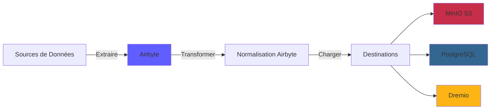
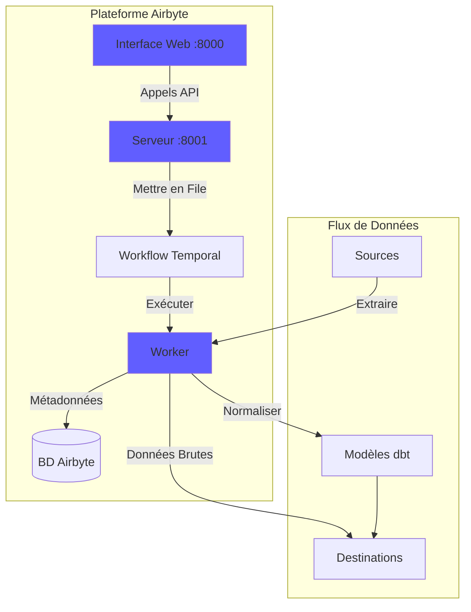
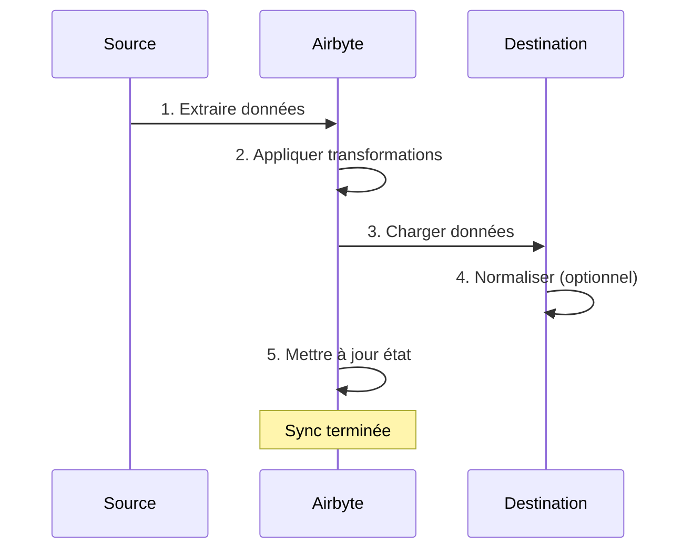
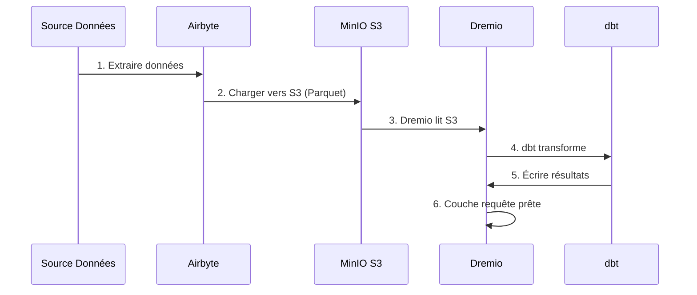

# एयरबाइट इंटीग्रेशन गाइड

**संस्करण**: 3.2.0  
**आखिरी अपडेट**: 16 अक्टूबर, 2025  
**भाषा**: फ्रेंच

---

## अवलोकन

एयरबाइट एक खुला स्रोत डेटा एकीकरण प्लेटफ़ॉर्म है जो विभिन्न स्रोतों से गंतव्यों तक डेटा ले जाना सरल बनाता है। यह मार्गदर्शिका एयरबाइट को डेटा प्लेटफ़ॉर्म में एकीकृत करने, कनेक्टर्स को कॉन्फ़िगर करने और डेटा पाइपलाइन स्थापित करने को कवर करती है।



---

## एयरबाइट क्या है?

### प्रमुख विशेषताऐं

- **300+ पूर्व-निर्मित कनेक्टर**: एपीआई, डेटाबेस, फ़ाइलें, SaaS एप्लिकेशन
- **ओपन सोर्स**: पूर्ण डेटा नियंत्रण के साथ स्व-होस्टेड
- **डेटा कैप्चर बदलें (सीडीसी)**: वास्तविक समय डेटा सिंक्रनाइज़ेशन
- **कस्टम कनेक्टर**: पायथन या लो-कोड सीडीके के साथ कनेक्टर बनाएं
- **डेटा सामान्यीकरण**: कच्चे JSON को संरचित तालिकाओं में बदलें
- **निगरानी और अलर्ट**: सिंक स्थिति और डेटा गुणवत्ता को ट्रैक करें

### वास्तुकला



---

## सुविधा

### त्वरित शुरुआत

एयरबाइट प्लेटफॉर्म में शामिल है। इसे इससे प्रारंभ करें:

```bash
# Démarrer services Airbyte
docker-compose -f docker-compose-airbyte.yml up -d

# Vérifier statut
docker-compose -f docker-compose-airbyte.yml ps

# Voir logs
docker-compose -f docker-compose-airbyte.yml logs -f
```

### सेवाएँ प्रारंभ

| सेवाएँ | बंदरगाह | विवरण |
|--------|------|----|
| **एयरबाइट-वेबएप** | 8000 | वेब यूजर इंटरफ़ेस |
| **एयरबाइट-सर्वर** | 8001 | एपीआई सर्वर |
| **एयरबाइट-वर्कर** | - | कार्य निष्पादन इंजन |
| **एयरबाइट-टेम्पोरल** | 7233 | वर्कफ़्लो ऑर्केस्ट्रेशन |
| **एयरबाइट-डीबी** | 5432 | मेटाडेटा डेटाबेस (पोस्टग्रेएसक्यूएल) |

### पहली पहुंच

**वेब इंटरफ़ेस:**
```
http://localhost:8000
```

**डिफ़ॉल्ट पहचानकर्ता:**
- **ईमेल**: `airbyte@example.com`
- **पासवर्ड**: `password`

सुरक्षा के लिए पहली बार लॉग इन करते समय **पासवर्ड बदलें**।

---

## विन्यास

### कॉन्फ़िगरेशन विज़ार्ड

पहली पहुंच पर, कॉन्फ़िगरेशन विज़ार्ड पूरा करें:

1. **ईमेल प्राथमिकताएँ**: सूचनाएं कॉन्फ़िगर करें
2. **डेटा रेजीडेंसी**: डेटा भंडारण स्थान का चयन करें
3. **गुमनाम उपयोग आँकड़े**: टेलीमेट्री स्वीकार/अस्वीकार करें

### कार्यस्थान सेटिंग्स

**सेटिंग्स > कार्यक्षेत्र** पर नेविगेट करें:

```yaml
Nom Workspace: Production Data Platform
ID Workspace: default
Définition Namespace: Destination Default
Format Namespace: ${SOURCE_NAMESPACE}
```

### संसाधन सीमाएँ

**फ़ाइल**: `config/airbyte/config.yaml`

```yaml
# Allocation ressources par connecteur
resources:
  source:
    cpu_limit: "1.0"
    memory_limit: "1Gi"
    cpu_request: "0.25"
    memory_request: "256Mi"
  
  destination:
    cpu_limit: "1.0"
    memory_limit: "1Gi"
    cpu_request: "0.25"
    memory_request: "256Mi"
  
  orchestrator:
    cpu_limit: "0.5"
    memory_limit: "512Mi"
```

---

## कनेक्टर्स

### स्रोत कनेक्टर्स

#### स्रोत पोस्टग्रेएसक्यूएल

**उपयोग मामला**: लेनदेन संबंधी डेटाबेस से डेटा निकालें

**विन्यास:**

1. **स्रोत > नये स्रोत** पर नेविगेट करें
2. **PostgreSQL** चुनें
3. कनेक्शन कॉन्फ़िगर करें:

```yaml
Host: postgres
Port: 5432
Database: source_db
Username: readonly_user
Password: [MOT_DE_PASSE_SÉCURISÉ]
SSL Mode: prefer

Méthode Réplication: Standard
  # Ou CDC pour changements temps réel:
  # Méthode Réplication: Logical Replication (CDC)
```

**टेस्ट कनेक्शन** → **स्रोत सेट करें**

#### REST API स्रोत

**उपयोग का मामला**: एपीआई से डेटा निकालें

**विन्यास:**

```yaml
Name: External API
URL Base: https://api.example.com/v1
Authentication:
  Type: Bearer Token
  Token: [API_TOKEN]

Endpoints:
  - name: customers
    path: /customers
    http_method: GET
    
  - name: orders
    path: /orders
    http_method: GET
    params:
      start_date: "{{ config['start_date'] }}"
```

#### स्रोत फ़ाइल (सीएसवी)

**उपयोग का मामला**: सीएसवी फ़ाइलें आयात करें

**विन्यास:**

```yaml
Dataset Name: sales_data
URL: https://storage.example.com/sales.csv
Format: CSV
Provider:
  Storage: HTTPS
  User Provided Storage:
    URL: https://storage.example.com/sales.csv
```

#### सामान्य स्रोत

| स्रोत | उपयोग के मामले | सीडीसी समर्थन |
|--------|--------|--------|
| **पोस्टग्रेएसक्यूएल** | लेन-देन संबंधी कॉमिक्स | ✅ हाँ |
| **MySQL** | लेन-देन संबंधी कॉमिक्स | ✅ हाँ |
| **मोंगोडीबी** | NoSQL दस्तावेज़ | ✅ हाँ |
| **सेल्सफोर्स** | सीआरएम डेटा | ❌ नहीं |
| **गूगल शीट्स** | स्प्रेडशीट | ❌ नहीं |
| **धारी** | भुगतान डेटा | ❌ नहीं |
| **रेस्ट एपीआई** | कस्टम एपीआई | ❌ नहीं |
| **S3** | फ़ाइल भंडारण | ❌ नहीं |

### गंतव्य कनेक्टर्स

#### मिनियो एस3 गंतव्य

**उपयोग केस**: कच्चे डेटा को डेटा लेक में संग्रहीत करें

**विन्यास:**

1. **गंतव्य > नये गंतव्य** पर नेविगेट करें
2. **S3** चुनें
3. कनेक्शन कॉन्फ़िगर करें:

```yaml
S3 Bucket Name: datalake
S3 Bucket Path: airbyte-data/${NAMESPACE}/${STREAM_NAME}
S3 Bucket Region: us-east-1

# Point de terminaison MinIO
S3 Endpoint: http://minio:9000
Access Key ID: [MINIO_ROOT_USER]
Secret Access Key: [MINIO_ROOT_PASSWORD]

Output Format:
  Format Type: Parquet
  Compression: GZIP
  Block Size: 128MB
```

**टेस्ट कनेक्शन** → **गंतव्य सेट करें**

#### पोस्टग्रेएसक्यूएल गंतव्य

**उपयोग केस**: एनालिटिक्स के लिए रूपांतरित डेटा लोड करें

**विन्यास:**

```yaml
Host: postgres
Port: 5432
Database: analytics_db
Username: analytics_user
Password: [MOT_DE_PASSE_SÉCURISÉ]
Default Schema: public

Normalization:
  Mode: Basic
  # Crée tables normalisées depuis JSON imbriqué
```

#### गंतव्य ड्रेमियो

**उपयोग का मामला**: डेटा लेकहाउस में सीधे लोड हो रहा है

**विन्यास:**

```yaml
Host: dremio
Port: 32010
Project: Production
Dataset: airbyte_data
Username: dremio_user
Password: [DREMIO_PASSWORD]

Connection Type: Arrow Flight
SSL: false
```

---

## कनेक्शन

### एक कनेक्शन बनाएं

एक कनेक्शन एक स्रोत को एक गंतव्य से जोड़ता है।



#### क्रमशः

1. **कनेक्शन > नए कनेक्शन पर नेविगेट करें**

2. **स्रोत चुनें**: कॉन्फ़िगर किया गया स्रोत चुनें (उदा: PostgreSQL)

3. **गंतव्य चुनें**: गंतव्य चुनें (उदाहरण: मिनियो S3)

4. **सिंक कॉन्फ़िगर करें**:

```yaml
Nom Connexion: PostgreSQL → MinIO
Fréquence Réplication: Every 24 hours
Namespace Destination: Custom
  Format Namespace: production_${SOURCE_NAMESPACE}

Streams:
  - customers
    Mode Sync: Full Refresh | Overwrite
    Champ Curseur: updated_at
    Clé Primaire: customer_id
    
  - orders
    Mode Sync: Incremental | Append
    Champ Curseur: created_at
    Clé Primaire: order_id
    
  - products
    Mode Sync: Full Refresh | Overwrite
    Clé Primaire: product_id
```

5. **सामान्यीकरण कॉन्फ़िगर करें** (वैकल्पिक):

```yaml
Normalization:
  Enable: true
  Option: Basic Normalization
  # Convertit JSON imbriqué en tables plates
```

6. **टेस्ट कनेक्शन** → **कनेक्शन सेट करें**

### सिंक्रोनाइज़ेशन मोड

| फैशन | विवरण | उपयोग के मामले |
|------|----|---|
| **पूर्ण ताज़ा\| अधिलेखित करें** | सभी डेटा बदलें | आयाम तालिकाएँ |
| **पूर्ण ताज़ा\| संलग्न** | सभी रिकॉर्ड जोड़ें | ऐतिहासिक ट्रैकिंग |
| **वृद्धिशील\| संलग्न** | नए/अद्यतन रिकॉर्ड जोड़ें | तथ्य सारणी |
| **वृद्धिशील\| धोखा दिया** | मौजूदा रिकॉर्ड अपडेट करें | एससीडी टाइप 1 |

### योजना बनाना

**आवृत्ति विकल्प:**
- **मैनुअल**: मैन्युअल रूप से ट्रिगर करें
- **प्रति घंटा**: हर घंटे
- **दैनिक**: हर 24 घंटे (समय निर्दिष्ट करें)
- **साप्ताहिक**: सप्ताह के विशिष्ट दिन
- **क्रॉन**: कस्टम शेड्यूलिंग (उदा: `0 2 * * *`)

**अनुसूचियों के उदाहरण:**
```yaml
# Toutes les 6 heures
Cron: 0 */6 * * *

# Jours de semaine à 2h du matin
Cron: 0 2 * * 1-5

# Premier jour du mois
Cron: 0 0 1 * *
```

---

## डेटा परिवर्तन

### बुनियादी सामान्यीकरण

एयरबाइट में डीबीटी का उपयोग करके **बुनियादी सामान्यीकरण** शामिल है:

**वह क्या करती है:**
- नेस्टेड JSON को फ़्लैट टेबल में परिवर्तित करता है
- टेबल बनाएं `_airbyte_raw_*` (कच्चा JSON)
- मानकीकृत (संरचित) तालिकाएँ बनाता है
- मेटाडेटा कॉलम जोड़ें (`_airbyte_emitted_at`, `_airbyte_normalized_at`)

**उदाहरण:**

**रॉ JSON** (`_airbyte_raw_customers`):
```json
{
  "_airbyte_ab_id": "uuid-123",
  "_airbyte_emitted_at": "2025-10-16T10:00:00Z",
  "_airbyte_data": {
    "id": 1,
    "name": "Acme Corp",
    "contact": {
      "email": "info@acme.com",
      "phone": "+1234567890"
    },
    "addresses": [
      {"type": "billing", "city": "New York"},
      {"type": "shipping", "city": "Boston"}
    ]
  }
}
```

**मानकीकृत तालिकाएँ:**

`customers`:
```sql
id | name | contact_email | contact_phone | _airbyte_normalized_at
1 | Acme Corp | info@acme.com | +1234567890 | 2025-10-16 10:05:00
```

`customers_addresses`:
```sql
_airbyte_customers_hashid | type | city
hash-123 | billing | New York
hash-123 | shipping | Boston
```

### कस्टम परिवर्तन (डीबीटी)

उन्नत परिवर्तनों के लिए, dbt का उपयोग करें:

1. **एयरबाइट सामान्यीकरण अक्षम करें**
2. **डीबीटी मॉडल बनाएं** संदर्भ तालिकाएँ `_airbyte_raw_*`
3. एयरबाइट सिंक करने के बाद **dbt** चलाएँ

**डीबीटी मॉडल का उदाहरण:**
```sql
-- models/staging/stg_customers.sql
with source as (
    select * from {{ source('airbyte_raw', '_airbyte_raw_customers') }}
),

parsed as (
    select
        _airbyte_ab_id,
        _airbyte_emitted_at,
        (_airbyte_data->>'id')::int as customer_id,
        _airbyte_data->>'name' as customer_name,
        _airbyte_data->'contact'->>'email' as email,
        _airbyte_data->'contact'->>'phone' as phone
    from source
)

select * from parsed
```

---

## निगरानी

### सिंक स्थिति

**डैशबोर्ड वेब इंटरफ़ेस:**
- **कनेक्शन**: सभी कनेक्शन देखें
- **सिंक इतिहास**: पिछले सिंक कार्य
- **सिंक लॉग**: प्रति कार्य विस्तृत लॉग

**स्थिति संकेतक:**
- 🟢 **सफल**: सिंक सफलतापूर्वक पूरा हुआ
- 🔴 **विफल**: सिंक विफल (लॉग जांचें)
- 🟡 **चल रहा है**: सिंक प्रगति पर है
- ⚪ **रद्द**: उपयोगकर्ता द्वारा सिंक रद्द कर दिया गया

### लॉग

**सिंक लॉग देखें:**
```bash
# Logs serveur Airbyte
docker-compose -f docker-compose-airbyte.yml logs airbyte-server

# Logs worker (exécution sync réelle)
docker-compose -f docker-compose-airbyte.yml logs airbyte-worker

# Logs job spécifique
# Disponible dans Interface Web: Connections > [Connection] > Job History > [Job]
```

### मेट्रिक्स

**निगरानी के लिए मुख्य मेट्रिक्स:**
- **सिंक्रनाइज़्ड रिकॉर्डिंग**: प्रति सिंक रिकॉर्डिंग की संख्या
- **सिंक्रोनाइज़्ड बाइट्स**: स्थानांतरित किए गए डेटा की मात्रा
- **सिंक अवधि**: प्रति सिंक में लगने वाला समय
- **विफलता दर**: विफल सिंक का प्रतिशत

**निर्यात मेट्रिक्स:**
```bash
# API Airbyte
curl -X GET "http://localhost:8001/api/v1/jobs/list" \
  -H "Content-Type: application/json" \
  -d '{
    "configTypes": ["sync"],
    "configId": "connection-id"
  }'
```

### अलर्ट

**सेटिंग्स > नोटिफिकेशन** में अलर्ट कॉन्फ़िगर करें**:

```yaml
Type Notification: Slack
URL Webhook: https://hooks.slack.com/services/VOTRE/WEBHOOK/URL

Événements:
  - Échec Sync
  - Succès Sync (optionnel)
  - Connexion Désactivée

Conditions:
  - Seuil échec: 3 échecs consécutifs
```

---

## एपीआई उपयोग

### प्रमाणीकरण

```bash
# Pas d'authentification requise pour localhost
# Pour production, configurez auth dans docker-compose-airbyte.yml
```

### सामान्य एपीआई कॉल

#### सूची स्रोत

```bash
curl -X POST "http://localhost:8001/api/v1/sources/list" \
  -H "Content-Type: application/json" \
  -d '{
    "workspaceId": "workspace-id"
  }'
```

#### कनेक्शन बनाएं

```bash
curl -X POST "http://localhost:8001/api/v1/connections/create" \
  -H "Content-Type: application/json" \
  -d '{
    "sourceId": "source-id",
    "destinationId": "destination-id",
    "syncCatalog": {
      "streams": [
        {
          "stream": {
            "name": "customers",
            "jsonSchema": {...}
          },
          "config": {
            "syncMode": "incremental",
            "destinationSyncMode": "append",
            "cursorField": ["updated_at"]
          }
        }
      ]
    },
    "schedule": {
      "units": 24,
      "timeUnit": "hours"
    }
  }'
```

#### ट्रिगर सिंक

```bash
curl -X POST "http://localhost:8001/api/v1/connections/sync" \
  -H "Content-Type: application/json" \
  -d '{
    "connectionId": "connection-id"
  }'
```

#### नौकरी की स्थिति प्राप्त करें

```bash
curl -X POST "http://localhost:8001/api/v1/jobs/get" \
  -H "Content-Type: application/json" \
  -d '{
    "id": "job-id"
  }'
```

---

## ड्रेमियो के साथ एकीकरण

### कार्यप्रवाह



### कॉन्फ़िगरेशन चरण

1. **मिनियो S3 को चार्ज करने के लिए एयरबाइट को कॉन्फ़िगर करें** (ऊपर देखें)

2. **Dremio में S3 स्रोत जोड़ें:**

```sql
-- Dans Interface Dremio: Sources > Add Source > S3
Nom Source: AirbyteData
Authentication: AWS Access Key
Clé Accès: [MINIO_ROOT_USER]
Clé Secrète: [MINIO_ROOT_PASSWORD]
Chemin Racine: /
Propriétés Connexion:
  fs.s3a.endpoint: minio:9000
  fs.s3a.path.style.access: true
  dremio.s3.compat: true
```

3. **ड्रेमियो में एयरबाइट डेटा क्वेरी करें:**

```sql
-- Parcourir structure S3
SELECT * FROM AirbyteData.datalake."airbyte-data"

-- Requête table spécifique
SELECT *
FROM AirbyteData.datalake."airbyte-data".production_public.customers
LIMIT 100
```

4. **ड्रेमियो वर्चुअल डेटासेट बनाएं:**

```sql
CREATE VDS airbyte_customers AS
SELECT
  id as customer_id,
  name as customer_name,
  contact_email as email,
  contact_phone as phone,
  _airbyte_emitted_at as last_updated
FROM AirbyteData.datalake."airbyte-data".production_public.customers
```

5. **डीबीटी मॉडल में उपयोग करें:**

```yaml
# dbt/models/sources.yml
sources:
  - name: airbyte
    schema: AirbyteData.datalake."airbyte-data".production_public
    tables:
      - name: customers
      - name: orders
      - name: products
```

---

## सर्वोत्तम प्रथाएं

### प्रदर्शन

1. **जब भी संभव हो वृद्धिशील सिंक का उपयोग करें**
2. **ऑफ-पीक घंटों के दौरान शेड्यूल सिंक**
3. बेहतर संपीड़न के लिए **पैरक्वेट प्रारूप का उपयोग करें**
4. दिनांक के अनुसार **बड़ी तालिकाओं का विभाजन**
5. **संसाधन उपयोग की निगरानी करें** और सीमाएं समायोजित करें

### आधार सामग्री की गुणवत्ता

1. **स्रोत कनेक्टर्स में डेटा सत्यापन सक्षम करें**
2. **डुप्लिकेट का पता लगाने के लिए प्राथमिक कुंजी का उपयोग करें**
3. सिंक विफलताओं के लिए **अलर्ट कॉन्फ़िगर करें**
4. **डेटा ताज़ाता की निगरानी करें** मेट्रिक्स
5. कच्चे डेटा पर **डीबीटी परीक्षण लागू करें**

### सुरक्षा

1. स्रोतों के लिए **केवल पढ़ने योग्य पहचानकर्ताओं का उपयोग करें**
2. पर्यावरण चर में **भंडार रहस्य**
3. **कनेक्शन के लिए एसएसएल/टीएलएस सक्षम करें**
4. **अपने पहचानकर्ताओं को नियमित रूप से नवीनीकृत करें**
5. **ऑडिट एक्सेस लॉग** समय-समय पर

### लागत अनुकूलन

1. **संपीड़न का उपयोग करें** (GZIP, SNAPPY)
2. **स्रोत पर डेटा डुप्लिकेट करें**
3. **पुराने डेटा को कोल्ड स्टोरेज में संग्रहीत करें**
4. **सिंक आवृत्ति की निगरानी करें** बनाम आवश्यकताएँ
5. **विफल सिंक डेटा साफ़ करें**

---

## समस्या निवारण

### सामान्य समस्या

#### सिंक विफलता: कनेक्शन टाइमआउट

**लक्षण:**
```
Failed to connect to source: Connection timeout
```

**समाधान:**
```bash
# Vérifier connectivité réseau
docker exec airbyte-worker ping postgres

# Vérifier règles pare-feu
# Vérifier hôte/port source dans configuration
```

#### बाहर स्मृति त्रुटि

**लक्षण:**
```
OOMKilled: Container exceeded memory limit
```

**समाधान:**
```yaml
# Augmenter limites mémoire dans docker-compose-airbyte.yml
services:
  airbyte-worker:
    environment:
      - JOB_MAIN_CONTAINER_MEMORY_LIMIT=2Gi
      - JOB_MAIN_CONTAINER_MEMORY_REQUEST=1Gi
```

#### सामान्यीकरण विफल

**लक्षण:**
```
Normalization failed: dbt compilation error
```

**समाधान:**
```bash
# Vérifier logs dbt
docker-compose -f docker-compose-airbyte.yml logs airbyte-worker | grep dbt

# Désactiver normalisation et utiliser dbt personnalisé
# Meilleur contrôle sur logique transformation
```

#### धीमा सिंक प्रदर्शन

**निदान:**
```bash
# Vérifier logs sync pour goulot d'étranglement
# Causes courantes:
# - Grand volume données
# - Requête source lente
# - Latence réseau
# - Ressources insuffisantes
```

**समाधान:**
- वृद्धिशील सिंक आवृत्ति बढ़ाएँ
- कर्सर फ़ील्ड में इंडेक्स जोड़ें
- वास्तविक समय के स्रोतों के लिए सीडीसी का उपयोग करें
- स्केल कार्यकर्ता संसाधन

---

## उन्नत विषय

### कस्टम कनेक्टर्स

एयरबाइट सीडीके के साथ कस्टम कनेक्टर बनाएं:

```bash
# Cloner modèle connecteur
git clone https://github.com/airbytehq/airbyte.git
cd airbyte/airbyte-integrations/connector-templates/python

# Créer nouveau connecteur
./create_connector.sh MyCustomAPI

# Implémenter logique connecteur
# Éditer source.py, spec.yaml, schemas/

# Tester localement
python main.py check --config secrets/config.json
python main.py discover --config secrets/config.json
python main.py read --config secrets/config.json --catalog integration_tests/configured_catalog.json
```

### एपीआई ऑर्केस्ट्रेशन

पायथन के साथ एयरबाइट को स्वचालित करें:

```python
import requests

AIRBYTE_API = "http://localhost:8001/api/v1"

def trigger_sync(connection_id: str):
    """Déclencher sync manuelle pour connexion"""
    response = requests.post(
        f"{AIRBYTE_API}/connections/sync",
        json={"connectionId": connection_id}
    )
    return response.json()

def get_sync_status(job_id: str):
    """Vérifier statut job sync"""
    response = requests.post(
        f"{AIRBYTE_API}/jobs/get",
        json={"id": job_id}
    )
    return response.json()

# Utilisation
job = trigger_sync("my-connection-id")
status = get_sync_status(job["job"]["id"])
print(f"Statut sync: {status['job']['status']}")
```

---

## संसाधन

### दस्तावेज़ीकरण

- **एयरबाइट डॉक्स**: https://docs.airbyte.com
- **कनेक्टर्स कैटलॉग**: https://docs.airbyte.com/integrations
- **एपीआई संदर्भ**: https://airbyte-public-api-docs.s3.us-east-2.amazonaws.com/rapidoc-api-docs.html

### समुदाय

- **स्लैक**: https://slack.airbyte.io
- **गिटहब**: https://github.com/airbytehq/airbyte
- **फोरम**: https://discuss.airbyte.io

---

## अगले कदम

एयरबाइट को कॉन्फ़िगर करने के बाद:

1. **ड्रेमियो सेट करें** - [ड्रेमियो सेटअप गाइड](dremio-setup.md)
2. **डीबीटी मॉडल बनाएं** - [डीबीटी डेवलपमेंट गाइड](डीबीटी-डेवलपमेंट.एमडी)
3. **डैशबोर्ड बनाएं** - [सुपरसेट डैशबोर्ड गाइड](सुपरसेट-डैशबोर्ड.एमडी)
4. ** गुणवत्ता की निगरानी करें ** - [डेटा गुणवत्ता गाइड] (डेटा-गुणवत्ता.एमडी)

---

**एयरबाइट इंटीग्रेशन गाइड संस्करण**: 3.2.0  
**आखिरी अपडेट**: 16 अक्टूबर, 2025  
**द्वारा रखरखाव**: डेटा प्लेटफ़ॉर्म टीम