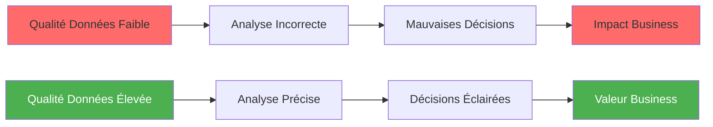
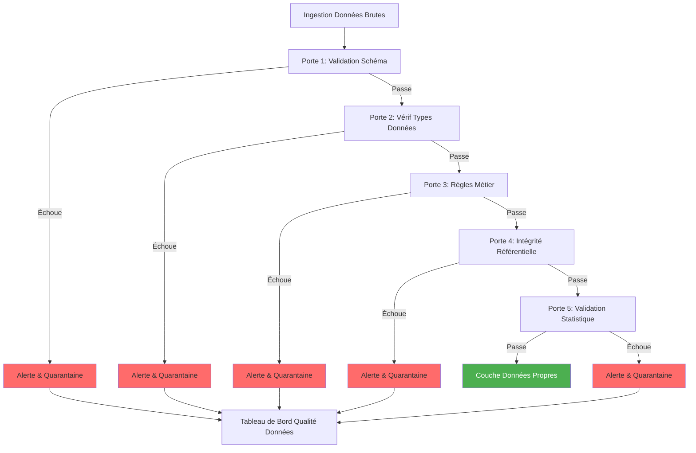

# डेटा गुणवत्ता गाइड

**संस्करण**: 3.2.0  
**आखिरी अपडेट**: 16 अक्टूबर, 2025  
**भाषा**: फ्रेंच

## विषयसूची

1. [अवलोकन](#अवलोकन)
2. [डेटा क्वालिटी फ्रेमवर्क](#डेटा-क्वालिटी-फ्रेमवर्क)
3. [डीबीटी परीक्षण](#डीबीटी-परीक्षण)
4. [ग्रेट एक्सपेक्टेशंस इंटीग्रेशन](# ग्रेट-अपेक्षाएं-एकीकरण)
5. [डेटा सत्यापन नियम](#डेटा-सत्यापन-नियम)
6. [निगरानी और अलर्ट](#निगरानी-और-अलर्ट)
7. [डेटा गुणवत्ता मेट्रिक्स](#डेटा-गुणवत्ता-मेट्रिक्स)
8. [उपचार रणनीतियाँ](#उपचार-रणनीतियाँ)
9. [अच्छी प्रथाएं](#अच्छी प्रथाएं)
10. [केस स्टडीज](#केस-स्टडीज)

---

## अवलोकन

विश्वसनीय विश्लेषण और निर्णय लेने के लिए डेटा गुणवत्ता आवश्यक है। यह मार्गदर्शिका संपूर्ण प्लेटफ़ॉर्म पर डेटा गुणवत्ता सुनिश्चित करने, निगरानी करने और सुधार करने के लिए व्यापक रणनीतियों को शामिल करती है।

### डेटा गुणवत्ता क्यों मायने रखती है



### आयाम गुणवत्ता डेटा

| आयाम | विवरण | उदाहरण सत्यापन |
|---|---|----------------------|
| **सटीकता** | डेटा वास्तविकता का सही प्रतिनिधित्व करता है | ईमेल प्रारूप सत्यापन |
| **सम्पूर्णता** | कोई लुप्त मान आवश्यक नहीं | पूर्ण जाँच नहीं |
| **संगति** | सिस्टम के बीच डेटा मेल खाता है | प्रमुख विदेशी संबंध |
| **समाचार** | डेटा चालू और जरूरत पड़ने पर उपलब्ध | ताज़गी की जाँच |
| **वैधता** | व्यावसायिक नियमों के अनुरूप डेटा | मूल्य सीमा की जाँच |
| **अद्वितीयता** | कोई डुप्लिकेट रिकॉर्ड नहीं | प्राथमिक कुंजी विशिष्टता |

---

## डेटा गुणवत्ता ढांचा

### वास्तुकला दरवाजे की गुणवत्ता



### गुणवत्तापूर्ण डायपर

```
Couche Bronze (Brute)
├── Validation schéma uniquement
└── Toutes données acceptées

Couche Silver (Nettoyée)
├── Validation type données
├── Standardisation format
├── Gestion null
└── Suppression doublons

Couche Gold (Curée)
├── Validation règles métier
├── Intégrité référentielle
├── Validation métriques
└── Scoring qualité
```

---

## डीबीटी परीक्षण

### एकीकृत परीक्षण

#### सामान्य परीक्षण

```yaml
# models/staging/schema.yml
version: 2

models:
  - name: stg_customers
    description: Données clients nettoyées
    columns:
      - name: customer_id
        description: Clé primaire
        tests:
          - unique:
              config:
                severity: error
                error_if: ">= 1"
          - not_null:
              config:
                severity: error
                
      - name: email
        description: Adresse email client
        tests:
          - not_null
          - unique
          - dbt_utils.expression_is_true:
              expression: "LIKE '%@%.%'"
              config:
                severity: warn
                
      - name: state
        description: Code état US
        tests:
          - accepted_values:
              values: ['AL', 'AK', 'AZ', 'AR', 'CA', 'CO', 'CT', 'DE', 'FL', 'GA',
                       'HI', 'ID', 'IL', 'IN', 'IA', 'KS', 'KY', 'LA', 'ME', 'MD',
                       'MA', 'MI', 'MN', 'MS', 'MO', 'MT', 'NE', 'NV', 'NH', 'NJ',
                       'NM', 'NY', 'NC', 'ND', 'OH', 'OK', 'OR', 'PA', 'RI', 'SC',
                       'SD', 'TN', 'TX', 'UT', 'VT', 'VA', 'WA', 'WV', 'WI', 'WY']
              quote: true
              config:
                severity: warn
                
      - name: created_at
        description: Horodatage création compte
        tests:
          - not_null
          - dbt_utils.expression_is_true:
              expression: ">= '2020-01-01'"
              config:
                severity: error
          - dbt_utils.expression_is_true:
              expression: "<= CURRENT_TIMESTAMP"
              config:
                severity: error
                
      - name: lifetime_value
        description: Dépenses totales client
        tests:
          - dbt_utils.expression_is_true:
              expression: ">= 0"
              config:
                severity: error
```

#### संबंध परीक्षण

```yaml
# models/staging/schema.yml
models:
  - name: stg_orders
    columns:
      - name: customer_id
        tests:
          - relationships:
              to: ref('stg_customers')
              field: customer_id
              config:
                severity: error
                error_if: ">= 1"
                warn_if: ">= 0"
```

### वैयक्तिकृत परीक्षण

#### एकवचन परीक्षण

```sql
-- tests/assert_positive_revenue.sql
-- Test que revenu quotidien est toujours positif

SELECT
    revenue_date,
    total_revenue
FROM {{ ref('mart_daily_revenue') }}
WHERE total_revenue < 0
```

```sql
-- tests/assert_order_amount_consistency.sql
-- Test que total commande correspond à somme composants

SELECT
    order_id,
    amount,
    tax,
    shipping,
    total_amount,
    (amount + tax + shipping) AS calculated_total
FROM {{ ref('fct_orders') }}
WHERE ABS(total_amount - (amount + tax + shipping)) > 0.01
```

```sql
-- tests/assert_no_future_orders.sql
-- Test qu'aucune commande n'a de date future

SELECT
    order_id,
    order_date
FROM {{ ref('fct_orders') }}
WHERE order_date > CURRENT_DATE
```

#### जेनेरिक टेस्ट मैक्रोज़

```sql
-- macros/tests/test_valid_email.sql


WITH validation AS (
    SELECT
        {{ column_name }} AS email
    FROM {{ model }}
    WHERE {{ column_name }} IS NOT NULL
)

SELECT email
FROM validation
WHERE email NOT LIKE '%@%.%'
   OR email LIKE '%..%'
   OR email LIKE '@%'
   OR email LIKE '%@'
   OR LENGTH(email) < 5
   OR LENGTH(email) > 254


```

```sql
-- macros/tests/test_within_range.sql


SELECT *
FROM {{ model }}
WHERE {{ column_name }} < {{ min_value }}
   OR {{ column_name }} > {{ max_value }}


```

```sql
-- macros/tests/test_no_gaps_in_sequence.sql


WITH numbered AS (
    SELECT
        {{ column_name }},
        ROW_NUMBER() OVER (
            
            PARTITION BY {{ partition_by }}
            
            ORDER BY {{ column_name }}
        ) AS row_num
    FROM {{ model }}
),

gaps AS (
    SELECT
        {{ column_name }},
        {{ column_name }} - row_num AS gap_check
    FROM numbered
    GROUP BY {{ column_name }}, gap_check
    HAVING COUNT(*) > 1
)

SELECT * FROM gaps


```

उपयोग:
```yaml
# models/schema.yml
columns:
  - name: email
    tests:
      - valid_email
      
  - name: age
    tests:
      - within_range:
          min_value: 18
          max_value: 120
          
  - name: order_sequence
    tests:
      - no_gaps_in_sequence:
          partition_by: customer_id
```

### परीक्षण निष्पादन

```bash
# Exécuter tous les tests
dbt test

# Exécuter tests pour modèle spécifique
dbt test --select stg_customers

# Exécuter uniquement tests schéma
dbt test --select test_type:schema

# Exécuter uniquement tests données
dbt test --select test_type:data

# Exécuter tests avec sévérité spécifique
dbt test --select test_type:schema,config.severity:error

# Exécuter tests et stocker échecs
dbt test --store-failures

# Exécuter tests en mode arrêt rapide
dbt test --fail-fast
```

### परीक्षण विन्यास

```yaml
# dbt_project.yml
tests:
  +store_failures: true
  +schema: dbt_test_failures
  
  data_quality:
    +severity: error
    +error_if: ">= 1"
    +warn_if: ">= 0"
```

---

## बड़ी उम्मीदें एकीकरण

### सुविधा

```bash
# Installer Great Expectations
pip install great-expectations

# Installer adaptateur dbt-Great Expectations
pip install dbt-expectations
```

### स्थापित करना

```yaml
# packages.yml
packages:
  - package: calogica/dbt_expectations
    version: 0.10.1
```

पैकेज स्थापित करें:
```bash
dbt deps
```

### परीक्षण उम्मीदें

```yaml
# models/staging/schema.yml
models:
  - name: stg_customers
    tests:
      # Expectations nombre lignes
      - dbt_expectations.expect_table_row_count_to_be_between:
          min_value: 1000
          max_value: 1000000
          
      # Expectations colonnes
      - dbt_expectations.expect_table_column_count_to_equal:
          value: 12
          
    columns:
      - name: email
        tests:
          # Expectations valeurs
          - dbt_expectations.expect_column_values_to_match_regex:
              regex: '^[a-zA-Z0-9_.+-]+@[a-zA-Z0-9-]+\.[a-zA-Z0-9-.]+$'
              
          - dbt_expectations.expect_column_values_to_not_be_null:
              row_condition: "customer_status = 'Active'"
              
      - name: lifetime_value
        tests:
          # Expectations numériques
          - dbt_expectations.expect_column_values_to_be_between:
              min_value: 0
              max_value: 1000000
              strictly: false
              
          - dbt_expectations.expect_column_mean_to_be_between:
              min_value: 100
              max_value: 5000
              
          - dbt_expectations.expect_column_quantile_values_to_be_between:
              quantile: 0.95
              min_value: 1000
              max_value: 50000
              
      - name: state
        tests:
          # Expectations catégorielles
          - dbt_expectations.expect_column_distinct_count_to_equal:
              value: 50
              
          - dbt_expectations.expect_column_proportion_of_unique_values_to_be_between:
              min_value: 0.01
              max_value: 0.1
              
      - name: order_count
        tests:
          # Expectations statistiques
          - dbt_expectations.expect_column_stdev_to_be_between:
              min_value: 0
              max_value: 100
              
  - name: stg_orders
    columns:
      - name: order_date
        tests:
          # Expectations dates
          - dbt_expectations.expect_column_values_to_be_between:
              min_value: "'2020-01-01'"
              max_value: "CURRENT_DATE"
              parse_strings_as_datetimes: true
              
          - dbt_expectations.expect_column_values_to_be_increasing:
              sort_column: created_at
              
      - name: amount
        tests:
          # Expectations multi-colonnes
          - dbt_expectations.expect_multicolumn_sum_to_equal:
              column_list: ["amount", "tax", "shipping"]
              sum_total: total_amount
              tolerance: 0.01
```

### वैयक्तिकृत अपेक्षाएँ

```sql
-- macros/custom_expectations/expect_column_values_to_be_on_weekend.sql


SELECT *
FROM {{ model }}
WHERE EXTRACT(DOW FROM {{ column_name }}) NOT IN (0, 6)  -- 0=Dimanche, 6=Samedi


```

---

## डेटा सत्यापन नियम

### व्यावसायिक तर्क सत्यापन

```sql
-- models/staging/stg_orders_with_validation.sql
{{
    config(
        materialized='view',
        tags=['staging', 'validated']
    )
}}

WITH source AS (
    SELECT * FROM {{ source('bronze', 'raw_orders') }}
),

validated AS (
    SELECT
        *,
        -- Drapeaux validation
        CASE WHEN order_id IS NULL THEN 1 ELSE 0 END AS missing_order_id,
        CASE WHEN customer_id IS NULL THEN 1 ELSE 0 END AS missing_customer_id,
        CASE WHEN order_date IS NULL THEN 1 ELSE 0 END AS missing_order_date,
        CASE WHEN amount < 0 THEN 1 ELSE 0 END AS negative_amount,
        CASE WHEN order_date > CURRENT_DATE THEN 1 ELSE 0 END AS future_order_date,
        CASE WHEN ABS(total_amount - (amount + tax + shipping)) > 0.01 THEN 1 ELSE 0 END AS amount_mismatch,
        
        -- Score qualité global (0-100)
        100 - (
            (CASE WHEN order_id IS NULL THEN 20 ELSE 0 END) +
            (CASE WHEN customer_id IS NULL THEN 20 ELSE 0 END) +
            (CASE WHEN order_date IS NULL THEN 15 ELSE 0 END) +
            (CASE WHEN amount < 0 THEN 15 ELSE 0 END) +
            (CASE WHEN order_date > CURRENT_DATE THEN 15 ELSE 0 END) +
            (CASE WHEN ABS(total_amount - (amount + tax + shipping)) > 0.01 THEN 15 ELSE 0 END)
        ) AS quality_score
        
    FROM source
),

final AS (
    SELECT
        *,
        CASE 
            WHEN quality_score >= 90 THEN 'Excellent'
            WHEN quality_score >= 70 THEN 'Good'
            WHEN quality_score >= 50 THEN 'Fair'
            ELSE 'Poor'
        END AS quality_grade
    FROM validated
)

SELECT * FROM final
```

### डेटा गुणवत्ता निगरानी तालिका

```sql
-- models/monitoring/data_quality_summary.sql
{{
    config(
        materialized='table',
        tags=['monitoring', 'data_quality']
    )
}}

WITH order_quality AS (
    SELECT
        'orders' AS table_name,
        COUNT(*) AS total_records,
        SUM(missing_order_id) AS missing_ids,
        SUM(negative_amount) AS negative_values,
        SUM(future_order_date) AS future_dates,
        SUM(amount_mismatch) AS calculation_errors,
        AVG(quality_score) AS avg_quality_score,
        CURRENT_TIMESTAMP AS checked_at
    FROM {{ ref('stg_orders_with_validation') }}
),

customer_quality AS (
    SELECT
        'customers' AS table_name,
        COUNT(*) AS total_records,
        SUM(CASE WHEN email IS NULL THEN 1 ELSE 0 END) AS missing_emails,
        SUM(CASE WHEN email NOT LIKE '%@%.%' THEN 1 ELSE 0 END) AS invalid_emails,
        SUM(CASE WHEN state NOT IN (SELECT state_code FROM ref('dim_states')) THEN 1 ELSE 0 END) AS invalid_states,
        0 AS calculation_errors,
        100 * (1 - (
            SUM(CASE WHEN email IS NULL THEN 1 ELSE 0 END) +
            SUM(CASE WHEN email NOT LIKE '%@%.%' THEN 1 ELSE 0 END)
        ) / NULLIF(COUNT(*), 0)) AS avg_quality_score,
        CURRENT_TIMESTAMP AS checked_at
    FROM {{ ref('stg_customers') }}
),

combined AS (
    SELECT * FROM order_quality
    UNION ALL
    SELECT 
        table_name,
        total_records,
        missing_emails AS missing_ids,
        invalid_emails AS negative_values,
        invalid_states AS future_dates,
        calculation_errors,
        avg_quality_score,
        checked_at
    FROM customer_quality
)

SELECT * FROM combined
```

---

## निगरानी और अलर्ट

### गुणवत्ता मेट्रिक्स डैशबोर्ड

```sql
-- models/monitoring/daily_quality_metrics.sql
WITH daily_summary AS (
    SELECT
        DATE_TRUNC('day', checked_at) AS check_date,
        table_name,
        AVG(avg_quality_score) AS daily_quality_score,
        SUM(total_records) AS daily_record_count,
        SUM(missing_ids + negative_values + future_dates + calculation_errors) AS daily_error_count
    FROM {{ ref('data_quality_summary') }}
    WHERE checked_at >= CURRENT_DATE - INTERVAL '30' DAY
    GROUP BY DATE_TRUNC('day', checked_at), table_name
)

SELECT
    check_date,
    table_name,
    daily_quality_score,
    daily_record_count,
    daily_error_count,
    daily_error_count * 100.0 / NULLIF(daily_record_count, 0) AS error_rate_pct
FROM daily_summary
ORDER BY check_date DESC, table_name
```

### स्वचालित अलर्ट

```python
# scripts/data_quality_alerts.py
import smtplib
from email.mime.text import MIMEText
from email.mime.multipart import MIMEMultipart

def check_data_quality_thresholds(connection):
    """Vérifier métriques qualité données et envoyer alertes"""
    
    query = """
    SELECT 
        table_name,
        avg_quality_score,
        total_records,
        (missing_ids + negative_values + future_dates + calculation_errors) AS total_errors
    FROM data_quality_summary
    WHERE checked_at >= CURRENT_DATE
    """
    
    results = connection.execute(query).fetchall()
    
    alerts = []
    for row in results:
        table_name, score, records, errors = row
        
        # Alerter si score qualité chute sous 80%
        if score < 80:
            alerts.append({
                'severity': 'HIGH',
                'table': table_name,
                'score': score,
                'message': f"Score qualité chuté à {score:.1f}%"
            })
        
        # Alerter si taux erreur > 5%
        error_rate = (errors / records * 100) if records > 0 else 0
        if error_rate > 5:
            alerts.append({
                'severity': 'MEDIUM',
                'table': table_name,
                'error_rate': error_rate,
                'message': f"Taux erreur augmenté à {error_rate:.1f}%"
            })
    
    if alerts:
        send_alert_email(alerts)
    
    return alerts

def send_alert_email(alerts):
    """Envoyer notification email pour problèmes qualité"""
    
    msg = MIMEMultipart()
    msg['From'] = 'data-quality@company.com'
    msg['To'] = 'data-team@company.com'
    msg['Subject'] = f'Alerte Qualité Données - {len(alerts)} Problèmes Détectés'
    
    body = "Problèmes Qualité Données Détectés:\n\n"
    for alert in alerts:
        body += f"[{alert['severity']}] {alert['table']}: {alert['message']}\n"
    
    msg.attach(MIMEText(body, 'plain'))
    
    server = smtplib.SMTP('smtp.company.com', 587)
    server.starttls()
    server.login('alerts@company.com', 'password')
    server.send_message(msg)
    server.quit()
```

### एयरफ्लो डेटा गुणवत्ता जांच

```python
# dags/data_quality_checks_dag.py
from airflow import DAG
from airflow.operators.python import PythonOperator
from airflow.providers.common.sql.operators.sql import SQLCheckOperator
from datetime import datetime, timedelta

default_args = {
    'owner': 'data-quality-team',
    'depends_on_past': False,
    'start_date': datetime(2025, 10, 1),
    'email_on_failure': True,
    'email': ['data-team@company.com'],
    'retries': 1,
    'retry_delay': timedelta(minutes=5),
}

dag = DAG(
    'data_quality_checks',
    default_args=default_args,
    description='Validation qualité données quotidienne',
    schedule_interval='0 6 * * *',  # 6h quotidien
    catchup=False,
    tags=['data-quality', 'monitoring'],
)

# Vérification 1: Pas de clés primaires null
check_null_pks = SQLCheckOperator(
    task_id='check_null_primary_keys',
    conn_id='dremio_connection',
    sql="""
        SELECT COUNT(*) = 0
        FROM staging.stg_customers
        WHERE customer_id IS NULL
    """,
    dag=dag,
)

# Vérification 2: Formats email valides
check_valid_emails = SQLCheckOperator(
    task_id='check_valid_emails',
    conn_id='dremio_connection',
    sql="""
        SELECT 
            SUM(CASE WHEN email NOT LIKE '%@%.%' THEN 1 ELSE 0 END) * 100.0 / COUNT(*) < 1
        FROM staging.stg_customers
    """,
    dag=dag,
)

# Vérification 3: Pas de dates commande futures
check_future_dates = SQLCheckOperator(
    task_id='check_future_dates',
    conn_id='dremio_connection',
    sql="""
        SELECT COUNT(*) = 0
        FROM staging.stg_orders
        WHERE order_date > CURRENT_DATE
    """,
    dag=dag,
)

# Vérification 4: Précision calcul revenu
check_revenue_calc = SQLCheckOperator(
    task_id='check_revenue_calculation',
    conn_id='dremio_connection',
    sql="""
        SELECT 
            SUM(CASE WHEN ABS(total_amount - (amount + tax + shipping)) > 0.01 THEN 1 ELSE 0 END) = 0
        FROM staging.stg_orders
    """,
    dag=dag,
)

# Exécuter vérifications en parallèle
[check_null_pks, check_valid_emails, check_future_dates, check_revenue_calc]
```

---

## डेटा गुणवत्ता मेट्रिक्स

### मुख्य निष्पादन संकेतक

```sql
-- models/monitoring/quality_kpis.sql
WITH latest_metrics AS (
    SELECT 
        table_name,
        avg_quality_score,
        total_records,
        (missing_ids + negative_values + future_dates + calculation_errors) AS total_errors
    FROM {{ ref('data_quality_summary') }}
    WHERE checked_at >= CURRENT_DATE
),

kpis AS (
    SELECT
        -- Métriques globales
        AVG(avg_quality_score) AS overall_quality_score,
        SUM(total_records) AS total_records_processed,
        SUM(total_errors) AS total_errors_found,
        
        -- Par table
        MAX(CASE WHEN table_name = 'orders' THEN avg_quality_score END) AS orders_quality_score,
        MAX(CASE WHEN table_name = 'customers' THEN avg_quality_score END) AS customers_quality_score,
        
        -- Taux erreur
        SUM(total_errors) * 100.0 / NULLIF(SUM(total_records), 0) AS overall_error_rate,
        
        -- Complétude données
        100 - (SUM(missing_ids) * 100.0 / NULLIF(SUM(total_records), 0)) AS completeness_score,
        
        CURRENT_TIMESTAMP AS calculated_at
    FROM latest_metrics
)

SELECT * FROM kpis
```

### प्रवृत्ति विश्लेषण

```sql
-- models/monitoring/quality_trends.sql
WITH daily_quality AS (
    SELECT
        DATE_TRUNC('day', checked_at) AS date,
        AVG(avg_quality_score) AS daily_score
    FROM {{ ref('data_quality_summary') }}
    WHERE checked_at >= CURRENT_DATE - INTERVAL '30' DAY
    GROUP BY DATE_TRUNC('day', checked_at)
),

with_lag AS (
    SELECT
        date,
        daily_score,
        LAG(daily_score, 1) OVER (ORDER BY date) AS previous_day_score,
        LAG(daily_score, 7) OVER (ORDER BY date) AS week_ago_score
    FROM daily_quality
)

SELECT
    date,
    daily_score,
    daily_score - previous_day_score AS day_over_day_change,
    daily_score - week_ago_score AS week_over_week_change,
    CASE 
        WHEN daily_score - previous_day_score > 5 THEN 'Improving'
        WHEN daily_score - previous_day_score < -5 THEN 'Degrading'
        ELSE 'Stable'
    END AS trend
FROM with_lag
WHERE date >= CURRENT_DATE - INTERVAL '30' DAY
ORDER BY date DESC
```

---

## निवारण रणनीतियाँ

### डेटा सफ़ाई नियम

```sql
-- models/staging/stg_customers_remediated.sql
WITH source AS (
    SELECT * FROM {{ ref('stg_customers_with_validation') }}
),

remediated AS (
    SELECT
        -- Corriger valeurs null
        COALESCE(customer_id, 'UNKNOWN_' || ROW_NUMBER() OVER ()) AS customer_id,
        
        -- Standardiser formats
        REGEXP_REPLACE(LOWER(TRIM(email)), '\s+', '') AS email,
        
        -- Corriger valeurs invalides
        CASE 
            WHEN phone ~ '^\d{10}$' THEN phone
            WHEN phone ~ '^\d{3}-\d{3}-\d{4}$' THEN REPLACE(phone, '-', '')
            ELSE NULL
        END AS phone,
        
        -- Standardiser codes états
        CASE
            WHEN LENGTH(state) = 2 THEN UPPER(state)
            WHEN state IN ('California') THEN 'CA'
            WHEN state IN ('New York') THEN 'NY'
            WHEN state IN ('Texas') THEN 'TX'
            ELSE NULL
        END AS state,
        
        -- Corriger problèmes dates
        CASE
            WHEN created_at > CURRENT_TIMESTAMP THEN CURRENT_TIMESTAMP
            WHEN created_at < '2020-01-01' THEN '2020-01-01'
            ELSE created_at
        END AS created_at,
        
        -- Signaler enregistrements corrigés
        CASE 
            WHEN quality_score < 90 THEN TRUE 
            ELSE FALSE 
        END AS was_remediated,
        
        quality_score,
        quality_grade
        
    FROM source
)

SELECT * FROM remediated
```

### संगरोध प्रक्रिया

```sql
-- models/monitoring/quarantined_records.sql
{{
    config(
        materialized='incremental',
        unique_key='quarantine_id'
    )
}}

WITH failed_quality AS (
    SELECT
        MD5(CAST(order_id AS VARCHAR) || CAST(CURRENT_TIMESTAMP AS VARCHAR)) AS quarantine_id,
        'orders' AS table_name,
        order_id AS record_id,
        'Score qualité sous seuil' AS reason,
        quality_score,
        CURRENT_TIMESTAMP AS quarantined_at
    FROM {{ ref('stg_orders_with_validation') }}
    WHERE quality_score < 50
    
    UNION ALL
    
    SELECT
        MD5(CAST(customer_id AS VARCHAR) || CAST(CURRENT_TIMESTAMP AS VARCHAR)) AS quarantine_id,
        'customers' AS table_name,
        customer_id AS record_id,
        'Format email invalide' AS reason,
        NULL AS quality_score,
        CURRENT_TIMESTAMP AS quarantined_at
    FROM {{ ref('stg_customers') }}
    WHERE email NOT LIKE '%@%.%'
)

SELECT * FROM failed_quality


    WHERE quarantined_at > (SELECT MAX(quarantined_at) FROM {{ this }})

```

---

## सर्वोत्तम प्रथाएं

### 1. जल्दी और बार-बार परीक्षण करें

```bash
# Exécuter tests après chaque changement modèle
dbt run --select +stg_customers
dbt test --select stg_customers
```

### 2. गंभीरता स्तरों का उपयोग करें

```yaml
tests:
  - not_null:
      config:
        severity: error  # Pipeline échoue
  - valid_email:
      config:
        severity: warn   # Pipeline continue, log avertissement
```

### 3. दस्तावेज़ डेटा गुणवत्ता नियम

```yaml
# models/schema.yml
columns:
  - name: lifetime_value
    description: |
      Dépenses totales client sur toutes commandes complètes.
      
      **Règles Qualité:**
      - Doit être >= 0
      - Devrait être <= 1 000 000$ (escalader si dépassé)
      - Doit égaler somme montants commandes
      
      **Remédiation:**
      - Valeurs négatives mises à 0
      - Valeurs manquantes calculées depuis commandes
```

### 4. रुझानों पर नज़र रखें, न कि केवल बिंदुओं पर

```sql
-- Alerter sur tendances dégradantes, pas échecs uniques
SELECT 
    AVG(quality_score) OVER (ORDER BY date ROWS BETWEEN 6 PRECEDING AND CURRENT ROW) AS rolling_7day_avg
FROM daily_quality
HAVING rolling_7day_avg < 85  -- Alerter si tendance chute
```

### 5. जब संभव हो तो स्वचालित निवारण

```sql
-- Corrections automatiques pour problèmes courants
CASE 
    WHEN email LIKE '% %' THEN REPLACE(email, ' ', '')  -- Supprimer espaces
    WHEN state IN ('California', 'Calif') THEN 'CA'     -- Standardiser
    WHEN amount < 0 THEN ABS(amount)                     -- Corriger signe
    ELSE original_value
END
```

---

## मामले का अध्ययन

### केस स्टडी 1: ईमेल सत्यापन

**समस्या**: 15% ग्राहक ईमेल अमान्य थे (@गायब, गलत प्रारूप)

**समाधान**:
```yaml
tests:
  - dbt_expectations.expect_column_values_to_match_regex:
      regex: '^[a-zA-Z0-9_.+-]+@[a-zA-Z0-9-]+\.[a-zA-Z0-9-.]+$'
```

**उपचार**:
```sql
-- Tenter de corriger erreurs communes
CASE
    WHEN email LIKE '% %' THEN REPLACE(email, ' ', '')
    WHEN email LIKE '%@@%' THEN REPLACE(email, '@@', '@')
    WHEN email NOT LIKE '%@%' AND email LIKE '%.%' 
        THEN SPLIT_PART(email, '.', 1) || '@' || SPLIT_PART(email, '.', 2) || '.' || SPLIT_PART(email, '.', 3)
    ELSE email
END
```

**परिणाम**: अमान्य ईमेल 15% से घटाकर 2% किया गया

### केस स्टडी 2: आय गणना त्रुटियाँ

**समस्या**: 5% ऑर्डर में कुल राशि ≠ राशि + कर + शिपिंग थी

**समाधान**:
```yaml
tests:
  - dbt_expectations.expect_multicolumn_sum_to_equal:
      column_list: ["amount", "tax", "shipping"]
      sum_total: total_amount
      tolerance: 0.01
```

**उपचार**:
```sql
-- Recalculer total depuis composants
CASE 
    WHEN ABS(total_amount - (amount + tax + shipping)) > 0.01
    THEN amount + tax + shipping
    ELSE total_amount
END AS total_amount_corrected
```

**परिणाम**: गणना त्रुटियां घटकर <0.1% हो गईं

---

## सारांश

इस व्यापक डेटा गुणवत्ता मार्गदर्शिका में शामिल हैं:

- **ढांचा**: गुणवत्तापूर्ण दरवाजे, परतें, वास्तुकला
- **डीबीटी परीक्षण**: एकीकृत परीक्षण, व्यक्तिगत परीक्षण, सामान्य मैक्रो परीक्षण
- **बड़ी उम्मीदें**: 50 से अधिक अपेक्षा प्रकारों के साथ उन्नत सत्यापन
- **सत्यापन नियम**: व्यावसायिक तर्क, गुणवत्ता स्कोरिंग, निगरानी तालिकाएँ
- **निगरानी**: स्वचालित अलर्ट, एयरफ्लो एकीकरण, डैशबोर्ड
- **मेट्रिक्स**: केपीआई, प्रवृत्ति विश्लेषण, गुणवत्ता स्कोरिंग
- **उपचार**: सफाई नियम, संगरोध प्रक्रिया, स्वचालित सुधार
- **अच्छे अभ्यास**: जल्दी परीक्षण करें, गंभीरता के स्तर का उपयोग करें, रुझानों की निगरानी करें
- **केस स्टडीज**: वास्तविक उदाहरण और समाधान

याद रखने योग्य मुख्य बिंदु:
- प्रत्येक परत पर गुणवत्ता जांच लागू करें (कांस्य → चांदी → सोना)
- संरचनात्मक सत्यापन के लिए डीबीटी परीक्षणों का उपयोग करें, सांख्यिकीय सत्यापन के लिए बड़ी उम्मीदें
- केवल पॉइंट-इन-टाइम मेट्रिक्स ही नहीं, बल्कि अस्थायी रुझानों पर भी नज़र रखें
- सामान्य और पूर्वानुमानित मुद्दों के लिए स्वचालित समाधान
- व्यवसाय पर असर पड़ने से पहले गुणवत्ता में गिरावट के बारे में सचेत करें
- दस्तावेज़ गुणवत्ता नियम और सुधारात्मक रणनीतियाँ

**संबंधित दस्तावेज:**
- [डीबीटी विकास गाइड](./dbt-development.md)
- [आर्किटेक्चर: डेटा प्रवाह](../आर्किटेक्चर/डेटा-फ्लो.एमडी)
- [ड्रेमियो सेटअप गाइड](./dremio-setup.md)
- [समस्या निवारण गाइड](./troubleshooting.md)

---

**संस्करण**: 3.2.0  
**आखिरी अपडेट**: 16 अक्टूबर, 2025