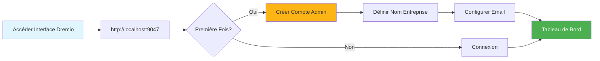
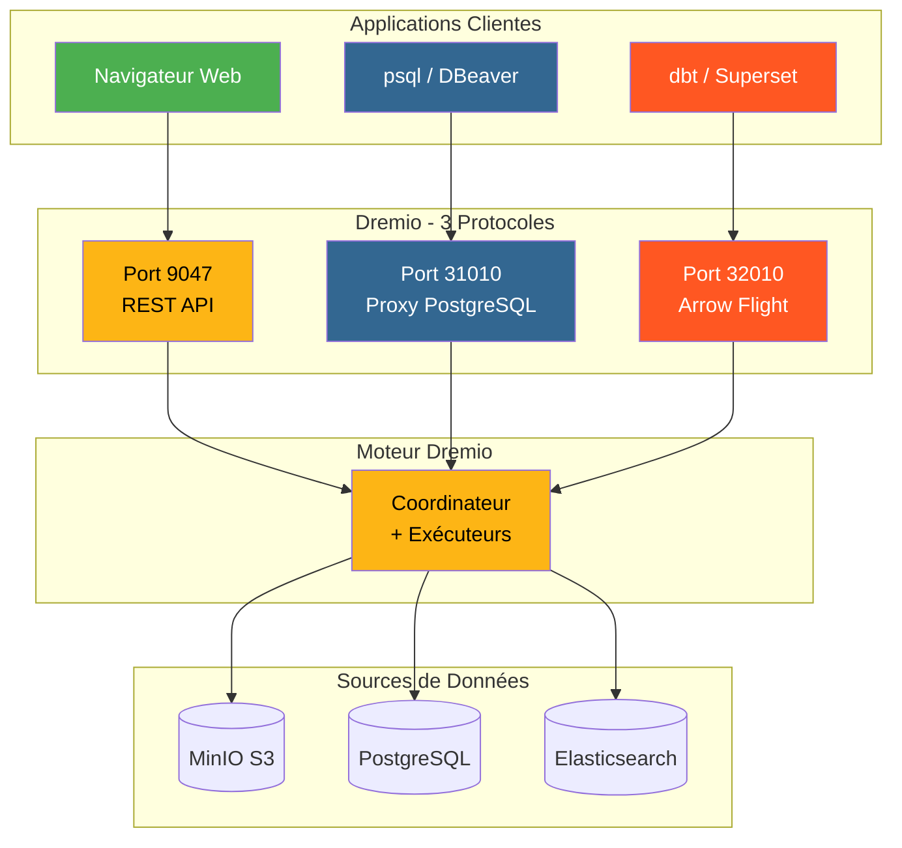
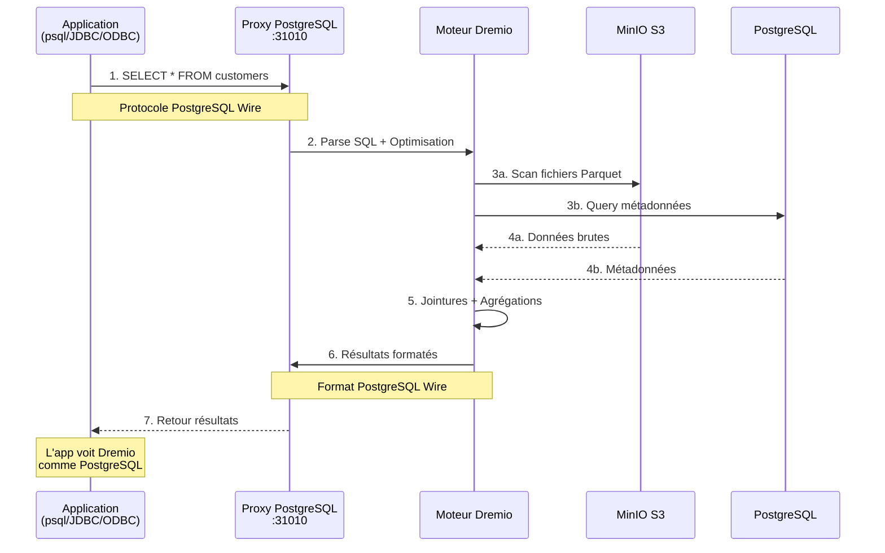
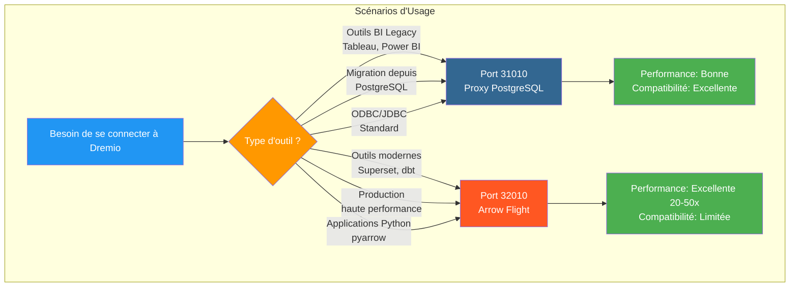
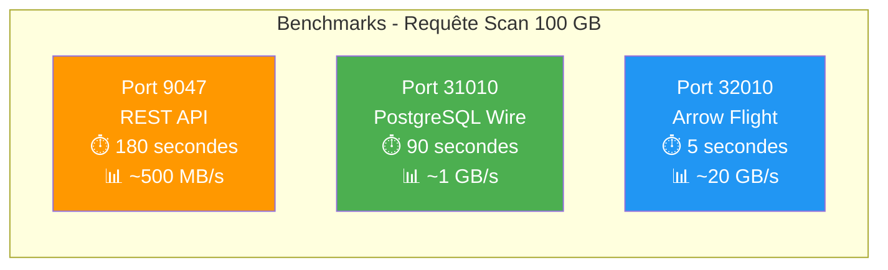
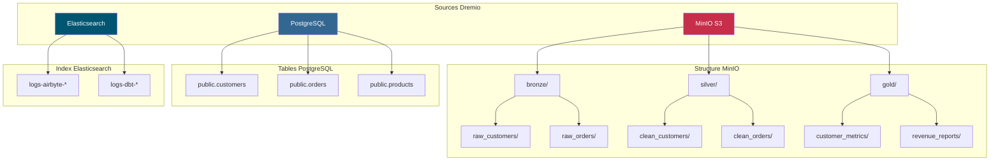
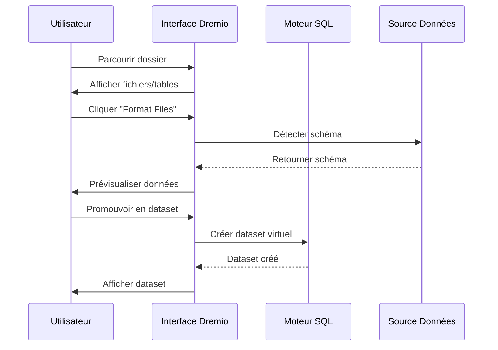
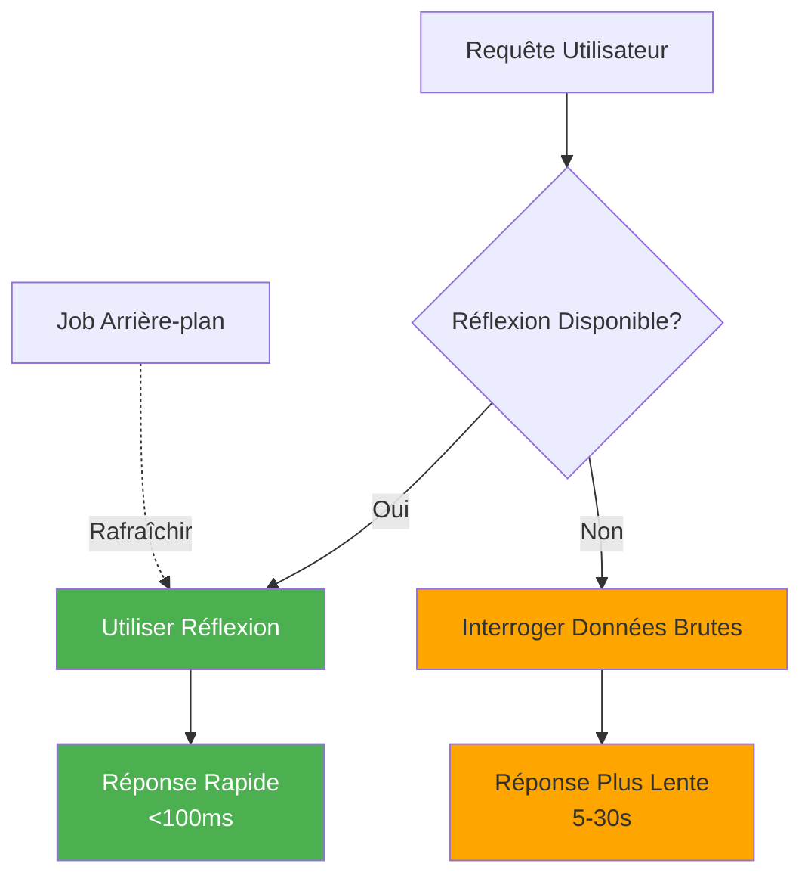

# ड्रेमियो कॉन्फ़िगरेशन गाइड

**संस्करण**: 3.2.0  
**आखिरी अपडेट**: 16 अक्टूबर, 2025  
**भाषा**: फ्रेंच

## विषयसूची

1. [अवलोकन](#अवलोकन)
2. [प्रारंभिक विन्यास](#प्रारंभिक-विन्यास)
3. [डेटा स्रोत कॉन्फ़िगरेशन](#डेटा-स्रोत-कॉन्फ़िगरेशन)
4. [वर्चुअल डेटासेट](#वर्चुअल-डेटासेट)
5. [विचार (त्वरण प्रश्न)](#विचार-त्वरण-प्रश्न)
6. [सुरक्षा और पहुंच नियंत्रण](#सुरक्षा-और-पहुंच-नियंत्रण)
7. [प्रदर्शन अनुकूलन](#प्रदर्शन-अनुकूलन)
8. [डीबीटी के साथ एकीकरण](#डीबीटी के साथ एकीकरण)
9. [निगरानी और रखरखाव](#निगरानी-और-रखरखाव)
10. [समस्या निवारण](#समस्या निवारण)

---

## अवलोकन

ड्रेमियो डेटा लेकहाउस प्लेटफ़ॉर्म है जो कई स्रोतों में डेटा को क्वेरी करने के लिए एक एकीकृत इंटरफ़ेस प्रदान करता है। यह मार्गदर्शिका प्रारंभिक सेटअप से लेकर उन्नत अनुकूलन तकनीकों तक सब कुछ कवर करती है।

### ड्रेमियो क्या है?

ड्रेमियो डेटा लेक के लचीलेपन को डेटा वेयरहाउस के प्रदर्शन के साथ जोड़ता है:

- **डेटा वर्चुअलाइजेशन**: डेटा को बिना हिलाए या कॉपी किए क्वेरी करें
- **क्वेरी त्वरण**: प्रतिबिंबों के साथ स्वचालित कैशिंग
- **स्वयं-सेवा विश्लेषण**: व्यावसायिक उपयोगकर्ता सीधे डेटा का पता लगा सकते हैं
- **एसक्यूएल मानक**: कोई मालिकाना क्वेरी भाषा नहीं
- **अपाचे एरो**: उच्च प्रदर्शन स्तंभ प्रारूप

### प्रमुख विशेषताऐं

| फ़ीचर | विवरण | मुनाफ़ा |
|----------------|------|---------|
| **विचार** | बुद्धिमान क्वेरी त्वरण | 10-100x तेज़ प्रश्न |
| **डेटा वर्चुअलाइजेशन** | स्रोतों पर एकीकृत दृष्टिकोण | कोई डेटा दोहराव नहीं |
| **तीर की उड़ान** | हाई स्पीड डेटा ट्रांसफर | ओडीबीसी/जेडीबीसी से 20-50 गुना तेज |
| **सिमेंटिक परत** | व्यवसाय-उन्मुख क्षेत्र के नाम | स्व-सेवा विश्लेषण |
| **डेटा के लिए गिट** | डेटासेट संस्करण नियंत्रण | सहयोग और रोलबैक |

---

## प्रारंभिक कॉन्फ़िगरेशन

### पूर्वावश्यकताएँ

शुरू करने से पहले, सुनिश्चित करें कि आपके पास:
- ड्रेमियो कंटेनर चल रहा है (देखें [इंस्टॉलेशन गाइड](../getting-started/installation.md))
- डेटा स्रोतों तक पहुंच (MinIO, PostgreSQL, आदि)
- व्यवस्थापक क्रेडेंशियल

### पहला कनेक्शन



#### चरण 1: ड्रेमियो इंटरफ़ेस तक पहुंचें

अपना ब्राउज़र खोलें और यहां नेविगेट करें:
```
http://localhost:9047
```

#### चरण 2: व्यवस्थापक खाता बनाएँ

पहले लॉन्च पर, आपको एक व्यवस्थापक खाता बनाने के लिए प्रेरित किया जाएगा:

```
Nom d'utilisateur: admin
Prénom: Admin
Nom: Utilisateur
Email: admin@example.com
Mot de passe: [mot de passe sécurisé]
```

**सुरक्षा नोट**: अपरकेस, लोअरकेस, संख्याएं और विशेष वर्णों सहित कम से कम 12 अक्षरों वाले एक मजबूत पासवर्ड का उपयोग करें।

#### चरण 3: प्रारंभिक सेटअप

```json
{
  "companyName": "Votre Organisation",
  "supportEmail": "support@talentys.eu",
  "supportKey": "votre-clé-support-si-entreprise"
}
```

### कॉन्फ़िगरेशन फ़ाइलें

ड्रेमियो कॉन्फ़िगरेशन को `dremio.conf` के माध्यम से प्रबंधित किया जाता है:

```conf
# dremio.conf

paths: {
  local: "/opt/dremio/data"
  dist: "dremioS3:///dremio-data"
}

services: {
  coordinator.enabled: true
  coordinator.master.enabled: true
  
  executor.enabled: true
  
  # Paramètres mémoire
  coordinator.master.heap_memory_mb: 4096
  executor.heap_memory_mb: 8192
}

# Configuration réseau
services.coordinator.web.port: 9047
services.coordinator.client.port: 31010
services.coordinator.flight.port: 32010

# Ajustement performance
store.plugin.max_metadata_leaf_columns: 800
planner.enable_broadcast_join: true
planner.slice_target: 100000
```

### पर्यावरण चर

```bash
# Section environment de docker-compose.yml
environment:
  - DREMIO_JAVA_SERVER_EXTRA_OPTS=-Xms2g -Xmx4g
  - DREMIO_JAVA_FLIGHT_EXTRA_OPTS=-Xms1g -Xmx2g
  - DREMIO_MAX_MEMORY_SIZE_MB=8192
  - DREMIO_HOME=/opt/dremio
```

### PostgreSQL प्रॉक्सी के माध्यम से कनेक्शन

Dremio पोर्ट 31010 पर एक PostgreSQL संगत इंटरफ़ेस प्रदर्शित करता है, जिससे PostgreSQL संगत उपकरण बिना किसी संशोधन के कनेक्ट हो सकते हैं।

#### ड्रेमियो कनेक्शन आर्किटेक्चर



#### PostgreSQL प्रॉक्सी के माध्यम से क्वेरी प्रवाह



#### प्रॉक्सी कॉन्फ़िगरेशन

PostgreSQL प्रॉक्सी स्वचालित रूप से `dremio.conf` में सक्षम है:

```conf
# Configuration du proxy PostgreSQL (ODBC/JDBC)
services.coordinator.client.port: 31010
```

#### psql के साथ कनेक्शन

```bash
# Connexion directe avec psql
psql -h localhost -p 31010 -U admin -d datalake

# Exemple de requête
psql -h localhost -p 31010 -U admin -d datalake -c "SELECT * FROM MinIO.datalake.customers LIMIT 10;"
```

#### DBeaver/pgAdmin के साथ कनेक्शन

कनेक्शन सेटअप:

```yaml
Type: PostgreSQL
Host: localhost
Port: 31010
Database: datalake
Username: admin
Password: <votre-mot-de-passe>
SSL: Désactivé (en développement)
```

#### कनेक्शन चैनल

**जेडीबीसी:**
```java
String url = "jdbc:postgresql://localhost:31010/datalake";
Properties props = new Properties();
props.setProperty("user", "admin");
props.setProperty("password", "votre-mot-de-passe");
Connection conn = DriverManager.getConnection(url, props);
```

**ओडीबीसी (डीएसएन):**
```ini
[Dremio via PostgreSQL]
Driver=PostgreSQL Unicode
Server=localhost
Port=31010
Database=datalake
Username=admin
Password=<votre-mot-de-passe>
SSLMode=disable
```

**पायथन (psycopg2):**
```python
import psycopg2

conn = psycopg2.connect(
    host="localhost",
    port=31010,
    database="datalake",
    user="admin",
    password="votre-mot-de-passe"
)

cursor = conn.cursor()
cursor.execute("SELECT * FROM MinIO.datalake.customers LIMIT 10")
rows = cursor.fetchall()
```

#### PostgreSQL प्रॉक्सी का उपयोग कब करें



| परिदृश्य | PostgreSQL प्रॉक्सी का उपयोग करें | तीर उड़ान का प्रयोग करें |
|------|--------------------------------|----------------------|
| **बीआई लीगेसी टूल्स** (एरो फ्लाइट का समर्थन नहीं) | ✅ हाँ | ❌ नहीं |
| **PostgreSQL से माइग्रेशन** (मौजूदा JDBC/ODBC कोड) | ✅ हाँ | ❌ नहीं |
| **उच्च प्रदर्शन उत्पादन** | ❌ नहीं | ✅ हां (20-50 गुना तेज) |
| **सुपरसेट, डीबीटी, आधुनिक उपकरण** | ❌ नहीं | ✅ हाँ |
| **तेजी से विकास/परीक्षण** | ✅ हाँ (परिचित) | ⚠️ दोनों ठीक है |

#### 3 बंदरगाहों की प्रदर्शन तुलना



**सिफारिश**: **संगतता** के लिए PostgreSQL प्रॉक्सी (पोर्ट 31010) और **उत्पादन प्रदर्शन** के लिए एरो फ़्लाइट (पोर्ट 32010) का उपयोग करें।

---

## डेटा स्रोतों को कॉन्फ़िगर करना

### स्रोत मिनियो S3 जोड़ें

मिनिआईओ आपका प्राथमिक डेटा लेक स्टोरेज है।

#### चरण 1: स्रोतों पर नेविगेट करें

```
Interface Dremio → Datasets → Add Source → Object Storage → Amazon S3
```

#### चरण 2: S3 कनेक्शन कॉन्फ़िगर करें

```json
{
  "name": "MinIO",
  "config": {
    "credentialType": "ACCESS_KEY",
    "accessKey": "minioadmin",
    "accessSecret": "minioadmin",
    "secure": false,
    "externalBucketList": [
      "datalake"
    ],
    "enableAsync": true,
    "compatibilityMode": true,
    "rootPath": "/",
    "defaultCtasFormat": "PARQUET",
    "propertyList": [
      {
        "name": "fs.s3a.path.style.access",
        "value": "true"
      },
      {
        "name": "fs.s3a.endpoint",
        "value": "minio:9000"
      },
      {
        "name": "dremio.s3.compat",
        "value": "true"
      }
    ]
  }
}
```

#### चरण 3: कनेक्शन का परीक्षण करें

```sql
-- Requête test pour vérifier connexion MinIO
SELECT * FROM MinIO.datalake.bronze.customers LIMIT 10;
```

**अपेक्षित परिणाम**:
```
customer_id | name           | email
------------|----------------|------------------
1           | John Doe       | john@example.com
2           | Jane Smith     | jane@example.com
...
```

### PostgreSQL स्रोत जोड़ें

#### स्थापित करना

```
Interface Dremio → Datasets → Add Source → Relational → PostgreSQL
```

```json
{
  "name": "PostgreSQL",
  "config": {
    "hostname": "postgres",
    "port": "5432",
    "databaseName": "datawarehouse",
    "username": "postgres",
    "password": "postgres",
    "authenticationType": "MASTER",
    "fetchSize": 2000,
    "encryptionValidationMode": "CERTIFICATE_AND_HOSTNAME_VALIDATION"
  }
}
```

### इलास्टिक्स खोज स्रोत जोड़ें

```json
{
  "name": "Elasticsearch",
  "config": {
    "hostList": [
      {"hostname": "elasticsearch", "port": 9200}
    ],
    "authenticationType": "ANONYMOUS",
    "scrollSize": 4000,
    "scrollTimeout": 60000,
    "scriptsEnabled": true,
    "showHiddenIndices": false,
    "showIdColumn": false
  }
}
```

### स्रोतों का संगठन



---

## वर्चुअल डेटासेट

वर्चुअल डेटासेट आपको अपने डेटा के रूपांतरित और पुन: प्रयोज्य दृश्य बनाने की अनुमति देते हैं।

### वर्चुअल डेटासेट बनाएं

#### SQL संपादक से

```sql
-- Créer dataset jointif
SELECT 
    c.customer_id,
    c.name,
    c.email,
    c.state,
    COUNT(o.order_id) as total_orders,
    SUM(o.amount) as lifetime_value
FROM MinIO.datalake.silver.customers c
LEFT JOIN MinIO.datalake.silver.orders o
    ON c.customer_id = o.customer_id
GROUP BY c.customer_id, c.name, c.email, c.state;

-- Sauvegarder comme dataset virtuel: "customer_summary"
```

**स्थान सहेजें**:
```
@username → customer_summary
```

#### इंटरफ़ेस से



**कदम**:
1. मिनिओ स्रोत पर नेविगेट करें
2. `datalake/bronze/customers/` पर ब्राउज़ करें
3. "फ़ाइलें फ़ॉर्मेट करें" बटन पर क्लिक करें
4. पता लगाए गए पैटर्न की जांच करें
5. डेटासेट को बढ़ावा देने के लिए "सहेजें" पर क्लिक करें

### डेटासेट का संगठन

रिक्त स्थान और फ़ोल्डरों के साथ तार्किक संरचना बनाएं:

```
Dremio
├── @admin (Espace Personnel)
│   └── dev (Dossier)
│       ├── test_customers
│       └── test_orders
├── Production (Espace Partagé)
│   ├── Dimensions (Dossier)
│   │   ├── dim_customers
│   │   ├── dim_products
│   │   └── dim_dates
│   └── Facts (Dossier)
│       ├── fct_orders
│       ├── fct_revenue
│       └── fct_customer_lifetime_value
└── Analytics (Espace Partagé)
    ├── customer_metrics
    ├── sales_dashboard_data
    └── marketing_attribution
```

### सिमेंटिक परत

व्यवसाय-उन्मुख नाम और विवरण जोड़ें:

```sql
-- Noms colonnes techniques originaux
SELECT
    cust_id,
    cust_nm,
    cust_em,
    crt_dt
FROM raw.customers;

-- Créer dataset virtuel avec noms sémantiques
SELECT
    cust_id AS "ID Client",
    cust_nm AS "Nom Client",
    cust_em AS "Adresse Email",
    crt_dt AS "Date Inscription"
FROM raw.customers;
```

**विवरण जोड़ें**:
```
Interface → Dataset → Colonne → Éditer Description

ID Client: Identifiant unique pour chaque client
Nom Client: Nom complet du client
Adresse Email: Email principal pour communication
Date Inscription: Date inscription client sur plateforme
```

---

## प्रतिबिंब (त्वरण प्रश्न)

रिफ्लेक्शन्स ड्रेमियो का बुद्धिमान कैशिंग तंत्र है जो क्वेरी प्रदर्शन में काफी सुधार करता है।

### प्रतिबिंब के प्रकार

#### 1. कच्चे विचार

त्वरित पुनर्प्राप्ति के लिए स्तंभों का सबसेट संग्रहीत करें:

```sql
-- Créer réflexion brute
CREATE REFLECTION raw_customer_base
ON Production.Dimensions.dim_customers
USING DISPLAY (
    customer_id,
    name,
    email,
    state,
    registration_date
);
```

**उदाहरण**:
- विशिष्ट कॉलमों पर क्वेरी करने वाले डैशबोर्ड
- कॉलम सबसेट के साथ रिपोर्ट
- खोजपूर्ण प्रश्न

#### 2. एकत्रीकरण प्रतिबिंब

तत्काल परिणामों के लिए एकत्रीकरण की पूर्व-गणना करें:

```sql
-- Créer réflexion agrégation
CREATE REFLECTION agg_daily_revenue
ON Production.Facts.fct_orders
USING 
  DIMENSIONS (order_date, product_id, region)
  MEASURES (
    SUM(amount),
    COUNT(*),
    AVG(amount),
    MIN(amount),
    MAX(amount)
  );
```

**उदाहरण**:
- कार्यकारी डैशबोर्ड
- सारांश रिपोर्ट
- प्रवृत्ति विश्लेषण

### कॉन्फ़िगरेशन प्रतिबिंब



#### जलपान नीति

```
Interface → Dataset → Settings → Reflections → Refresh Policy
```

**विकल्प**:
- **कभी ताज़ा न करें**: स्थिर डेटा (जैसे ऐतिहासिक अभिलेखागार)
- **हर [1 घंटे] ताज़ा करें**: आवधिक अपडेट
- **डेटासेट बदलने पर रिफ्रेश करें**: रीयल-टाइम सिंक

```json
{
  "refreshPolicy": {
    "method": "PERIOD",
    "refreshPeriod": 3600000,  // 1 heure en millisecondes
    "gracePeriod": 10800000    // 3 heures
  }
}
```

#### समाप्ति नीति

```json
{
  "expirationPolicy": {
    "method": "NEVER",
    // ou
    "method": "AFTER_PERIOD",
    "expirationPeriod": 604800000  // 7 jours
  }
}
```

### चिंतन के लिए अच्छे अभ्यास

#### 1. उच्च मूल्य वाले प्रश्नों से प्रारंभ करें

इतिहास से धीमी क्वेरी को पहचानें:

```sql
-- Interroger historique jobs pour trouver requêtes lentes
SELECT 
    query_text,
    execution_time_ms,
    dataset_path
FROM sys.jobs
WHERE execution_time_ms > 5000  -- Plus lent que 5 secondes
ORDER BY execution_time_ms DESC
LIMIT 100;
```

#### 2. लक्षित प्रतिबिंब बनाएं

```sql
-- Mauvais: Réflexion avec trop de dimensions
CREATE REFLECTION too_broad
USING DIMENSIONS (col1, col2, col3, col4, col5, col6)
MEASURES (SUM(amount));

-- Bon: Réflexion ciblée pour cas d'usage spécifique
CREATE REFLECTION targeted
USING DIMENSIONS (order_date, product_category)
MEASURES (SUM(revenue), COUNT(DISTINCT customer_id));
```

#### 3. मॉनिटर कवरेज प्रतिबिंब

```sql
-- Vérifier quelles requêtes sont accélérées
SELECT 
    query_text,
    acceleration_profile.accelerated,
    acceleration_profile.reflection_ids
FROM sys.jobs
WHERE start_time > CURRENT_DATE - INTERVAL '7' DAY;
```

### प्रभाव प्रदर्शन विचार

| डेटासेट आकार | क्वेरी टाइप करें | बिना प्रतिबिम्ब के | प्रतिबिम्ब के साथ | त्वरण |
|----------------|-----------------|----------------|----------------|----------------|
| 1M लाइनें | सरल चुनें | 500ms | 50 एमएस | 10x |
| 10एम लाइनें | एकत्रीकरण | 15s | 200ms | 75x |
| 100M लाइनें | कॉम्प्लेक्स जॉइन | 2 मिनट | 1s | 120x |
| 1बी लाइनें | समूह द्वारा | 10 मिनट | 5s | 120x |

---

## सुरक्षा और पहुंच नियंत्रण

### प्रयोक्ता प्रबंधन

#### उपयोगकर्ता बनाएं

```
Interface → Account Settings → Users → Add User
```

```json
{
  "username": "analyst_user",
  "firstName": "Data",
  "lastName": "Analyst",
  "email": "analyst@example.com",
  "password": "secure_password"
}
```

#### उपयोगकर्ता भूमिका

| भूमिका | अनुमतियाँ | उपयोग के मामले |
|------|----|---|
| **एडमिन** | पूर्ण पहुंच | सिस्टम प्रशासन |
| **उपयोगकर्ता** | क्वेरी करें, व्यक्तिगत डेटासेट बनाएं | विश्लेषक, डेटा वैज्ञानिक |
| **सीमित उपयोगकर्ता** | केवल क्वेरी, डेटासेट निर्माण नहीं | व्यावसायिक उपयोगकर्ता, दर्शक |

### स्थान अनुमतियाँ

```
Interface → Space → Settings → Privileges
```

**अनुमति प्रकार**:
- **देखें**: डेटासेट देख और क्वेरी कर सकते हैं
- **संशोधित करें**: डेटासेट परिभाषाओं को संपादित कर सकते हैं
- **अनुदान प्रबंधित करें**: अनुमतियाँ प्रबंधित कर सकते हैं
- **मालिक**: पूर्ण नियंत्रण

**उदाहरण**:
```
Espace: Production
├── Équipe Analytics → View, Modify
├── Data Engineers → Owner
└── Exécutifs → View
```

### लाइन स्तर की सुरक्षा

पंक्ति-स्तरीय फ़िल्टरिंग लागू करें:

```sql
-- Créer vue avec filtre niveau ligne
CREATE VDS customer_data_filtered AS
SELECT *
FROM Production.Dimensions.dim_customers
WHERE 
  CASE 
    WHEN CURRENT_USER = 'admin' THEN TRUE
    WHEN region = (
      SELECT home_region 
      FROM users 
      WHERE username = CURRENT_USER
    ) THEN TRUE
    ELSE FALSE
  END;
```

### सुरक्षा स्तर कॉलम

संवेदनशील कॉलम छिपाएँ:

```sql
-- Masquer données sensibles pour utilisateurs non-admin
CREATE VDS customer_data_masked AS
SELECT
    customer_id,
    name,
    CASE 
      WHEN CURRENT_USER IN ('admin', 'data_engineer')
      THEN email
      ELSE CONCAT(SUBSTRING(email, 1, 3), '***@***.com')
    END AS email,
    state
FROM Production.Dimensions.dim_customers;
```

### OAuth एकीकरण

```conf
# dremio.conf
services.coordinator.web.auth.type: "oauth"
services.coordinator.web.auth.oauth.providerId: "okta"
services.coordinator.web.auth.oauth.clientId: "your-client-id"
services.coordinator.web.auth.oauth.clientSecret: "your-client-secret"
services.coordinator.web.auth.oauth.authorizeUrl: "https://your-domain.okta.com/oauth2/v1/authorize"
services.coordinator.web.auth.oauth.tokenUrl: "https://your-domain.okta.com/oauth2/v1/token"
```

---

## प्रदर्शन अनुकूलन

### क्वेरी अनुकूलन तकनीकें

#### 1. विभाजन छंटाई

```sql
-- Mauvais: Scanne toutes les données
SELECT * FROM orders
WHERE amount > 100;

-- Bon: Élague partitions
SELECT * FROM orders
WHERE order_date >= '2025-10-01'
  AND order_date < '2025-11-01'
  AND amount > 100;
```

#### 2. कॉलम प्रूनिंग

```sql
-- Mauvais: Lit toutes les colonnes
SELECT * FROM large_table LIMIT 100;

-- Bon: Lit uniquement colonnes nécessaires
SELECT customer_id, name, email 
FROM large_table 
LIMIT 100;
```

#### 3. विधेय पुशडाउन

```sql
-- Filtres poussés vers couche stockage
SELECT c.name, o.amount
FROM customers c
JOIN orders o ON c.customer_id = o.customer_id
WHERE o.order_date >= CURRENT_DATE - INTERVAL '30' DAY;
-- Filtre appliqué avant jointure
```

#### 4. अनुकूलन से जुड़ें

```sql
-- Utiliser broadcast join pour petites dimensions
SELECT /*+ BROADCAST(d) */
    f.order_id,
    d.product_name,
    f.amount
FROM facts.orders f
JOIN dimensions.products d
    ON f.product_id = d.product_id;
```

### मेमोरी कॉन्फ़िगरेशन

```conf
# dremio.conf

# Augmenter mémoire pour grandes requêtes
services.executor.heap_memory_mb: 32768

# Configurer spill to disk
spill.directory: "/opt/dremio/spill"
spill.enable: true

# Limites mémoire requête
planner.memory.max_query_memory_per_node: 10737418240  # 10GB
planner.memory.query_max_cost: 1000000000
```

### क्लस्टर आकार

| लोड प्रकार | समन्वयक | निष्पादक | कुल क्लस्टर |
|---|---|--|-------|
| **छोटा** | 4 सीपीयू, 16 जीबी | 2x (8 सीपीयू, 32 जीबी) | 20 सीपीयू, 80 जीबी |
| **मध्यम** | 8 सीपीयू, 32 जीबी | 4x (16 सीपीयू, 64 जीबी) | 72 सीपीयू, 288 जीबी |
| **बड़ा** | 16 सीपीयू, 64 जीबी | 8x (32 सीपीयू, 128 जीबी) | 272 सीपीयू, 1088 जीबी |

### निष्पादन की निगरानी

```sql
-- Analyser performance requête
SELECT 
    query_id,
    query_text,
    start_time,
    execution_time_ms / 1000.0 AS execution_time_seconds,
    planner_estimated_cost,
    rows_returned,
    acceleration_profile.accelerated
FROM sys.jobs
WHERE start_time > CURRENT_DATE - INTERVAL '1' DAY
ORDER BY execution_time_ms DESC
LIMIT 20;
```

---

## डीबीटी के साथ एकीकरण

### लक्ष्य डीबीटी के रूप में ड्रेमियो

`profiles.yml` कॉन्फ़िगर करें:

```yaml
# profiles.yml
dremio_project:
  target: dev
  outputs:
    dev:
      type: dremio
      threads: 4
      host: localhost
      port: 9047
      username: admin
      password: "{{ env_var('DREMIO_PASSWORD') }}"
      use_ssl: false
      space: "@admin"
      
    prod:
      type: dremio
      threads: 8
      host: dremio.example.com
      port: 443
      username: dbt_service_account
      password: "{{ env_var('DREMIO_PASSWORD') }}"
      use_ssl: true
      space: "Production"
```

ड्रेमियो पर ### डीबीटी मॉडल

```sql
-- models/staging/stg_customers.sql
{{
    config(
        materialized='view',
        alias='stg_customers'
    )
}}

SELECT
    customer_id,
    TRIM(UPPER(name)) AS customer_name,
    LOWER(email) AS email,
    state,
    created_at
FROM {{ source('minio', 'raw_customers') }}
WHERE customer_id IS NOT NULL
```

### डीबीटी में शोषण प्रतिबिंब

```sql
-- models/marts/fct_customer_metrics.sql
{{
    config(
        materialized='table',
        post_hook=[
            "ALTER VDS {{ this }} ENABLE RAW REFLECTION",
            "ALTER VDS {{ this }} ENABLE AGGREGATION REFLECTION 
             USING DIMENSIONS (customer_id, registration_month) 
             MEASURES (SUM(lifetime_value), COUNT(*))"
        ]
    )
}}

SELECT
    customer_id,
    DATE_TRUNC('month', registration_date) AS registration_month,
    COUNT(DISTINCT order_id) AS total_orders,
    SUM(order_amount) AS lifetime_value
FROM {{ ref('int_customer_orders') }}
GROUP BY customer_id, DATE_TRUNC('month', registration_date)
```

---

## निगरानी और रखरखाव

### निगरानी के लिए मुख्य मेट्रिक्स

```yaml
metrics:
  - name: Performance Requête
    query: "SELECT AVG(execution_time_ms) FROM sys.jobs WHERE start_time > NOW() - INTERVAL '1' HOUR"
    threshold: 5000  # Alerte si moyenne > 5 secondes
    
  - name: Couverture Réflexion
    query: "SELECT COUNT(*) FILTER (WHERE accelerated = true) * 100.0 / COUNT(*) FROM sys.jobs WHERE start_time > NOW() - INTERVAL '1' DAY"
    threshold: 80  # Alerte si couverture < 80%
    
  - name: Requêtes Échouées
    query: "SELECT COUNT(*) FROM sys.jobs WHERE query_state = 'FAILED' AND start_time > NOW() - INTERVAL '1' HOUR"
    threshold: 10  # Alerte si > 10 échecs par heure
```

### रखरखाव कार्य

#### 1. विचारों को ताज़ा करें

```sql
-- Rafraîchir manuellement réflexion
ALTER REFLECTION reflection_id REFRESH;

-- Reconstruire toutes réflexions pour dataset
ALTER VDS Production.Facts.fct_orders 
REFRESH ALL REFLECTIONS;
```

#### 2. पुराना डेटा साफ़ करें

```sql
-- Nettoyer historique requêtes
DELETE FROM sys.jobs
WHERE start_time < CURRENT_DATE - INTERVAL '90' DAY;

-- Compacter métadonnées (Enterprise uniquement)
VACUUM CATALOG;
```

#### 3. अद्यतन आँकड़े

```sql
-- Rafraîchir statistiques table
ANALYZE TABLE MinIO.datalake.silver.customers;

-- Mettre à jour métadonnées dataset
REFRESH DATASET MinIO.datalake.silver.customers;
```

---

## समस्या निवारण

### सामान्य समस्या

#### अंक 1: धीमी क्वेरी प्रदर्शन

**लक्षण**: क्वेरी में सेकंड के बजाय मिनट लग रहे हैं

**निदान**:
```sql
-- Vérifier profil requête
SELECT * FROM sys.jobs WHERE job_id = 'your-job-id';

-- Vérifier si réflexion utilisée
SELECT acceleration_profile FROM sys.jobs WHERE job_id = 'your-job-id';
```

**समाधान**:
1. उचित विचार बनाएं
2. पार्टीशन प्रूनिंग फ़िल्टर जोड़ें
3. निष्पादक मेमोरी बढ़ाएँ
4. कतारबद्ध कतार सक्षम करें

#### समस्या 2: प्रतिबिंब नहीं बनता

**लक्षण**: प्रतिबिंब "ताज़ा" स्थिति में अटका हुआ है

**निदान**:
```sql
-- Vérifier statut réflexion
SELECT * FROM sys.reflections WHERE status != 'ACTIVE';

-- Vérifier erreurs réflexion
SELECT * FROM sys.reflection_dependencies;
```

**समाधान**:
1. स्कीमा परिवर्तनों के लिए स्रोत डेटा की जाँच करें
2. पर्याप्त डिस्क स्थान की जाँच करें
3. टाइमआउट निर्माण प्रतिबिंब बढ़ाएँ
4. प्रतिबिंब को अक्षम और पुनः सक्षम करें

#### समस्या 3: कनेक्शन का समय समाप्त

**लक्षण**: स्रोतों से पूछताछ करते समय "कनेक्शन टाइमआउट" त्रुटियाँ

**समाधान**:
```conf
# dremio.conf
store.plugin.keep_alive_ms: 30000
store.plugin.timeout_ms: 120000
```

#### समस्या 4: याददाश्त की कमी

**लक्षण**: लॉग में "OutOfMemoryError"।

**समाधान**:
```conf
# Augmenter taille heap
services.executor.heap_memory_mb: 65536

# Activer spill to disk
spill.enable: true
spill.directory: "/opt/dremio/spill"
```

### डायग्नोस्टिक प्रश्न

```sql
-- Requêtes actives
SELECT query_id, query_text, start_time, user_name
FROM sys.jobs
WHERE query_state = 'RUNNING';

-- Utilisation ressources par utilisateur
SELECT 
    user_name,
    COUNT(*) as query_count,
    AVG(execution_time_ms) as avg_execution_ms,
    SUM(rows_returned) as total_rows
FROM sys.jobs
WHERE start_time > CURRENT_DATE
GROUP BY user_name;

-- Modèles accès dataset
SELECT 
    dataset_path,
    COUNT(*) as access_count,
    COUNT(DISTINCT user_name) as unique_users
FROM sys.jobs
WHERE start_time > CURRENT_DATE - INTERVAL '7' DAY
GROUP BY dataset_path
ORDER BY access_count DESC
LIMIT 20;
```

---

## सारांश

इस व्यापक मार्गदर्शिका में शामिल हैं:

- **प्रारंभिक कॉन्फ़िगरेशन**: पहली बार कॉन्फ़िगरेशन, व्यवस्थापक खाता निर्माण, कॉन्फ़िगरेशन फ़ाइलें
- **डेटा स्रोत**: मिनिओ कनेक्शन, पोस्टग्रेएसक्यूएल और इलास्टिक्सर्च
- **वर्चुअल डेटासेट**: सिमेंटिक परत के साथ पुन: प्रयोज्य रूपांतरित दृश्यों का निर्माण
- **प्रतिबिंब**: 10-100x क्वेरी त्वरण के लिए कच्चे प्रतिबिंब और एकत्रीकरण
- **सुरक्षा**: उपयोगकर्ता प्रबंधन, स्थान अनुमतियाँ, पंक्ति/स्तंभ स्तर की सुरक्षा
- **प्रदर्शन**: क्वेरी अनुकूलन, मेमोरी कॉन्फ़िगरेशन, क्लस्टर आकार
- **डीबीटी एकीकरण**: प्रतिबिंब प्रबंधन के साथ डीबीटी लक्ष्य के रूप में ड्रेमियो का उपयोग करें
- **निगरानी**: मुख्य मेट्रिक्स, रखरखाव कार्य, नैदानिक ​​अनुरोध
- **समस्या निवारण**: सामान्य समस्याएं और समाधान

याद रखने योग्य मुख्य बिंदु:
- ड्रेमियो सभी डेटा स्रोतों में एकीकृत SQL इंटरफ़ेस प्रदान करता है
- उत्पादन प्रदर्शन के लिए आवश्यक विचार
- उचित सुरक्षा कॉन्फ़िगरेशन स्वयं-सेवा विश्लेषण को सक्षम बनाता है
- नियमित निगरानी सर्वोत्तम प्रदर्शन सुनिश्चित करती है

**संबंधित दस्तावेज:**
- [आर्किटेक्चर घटक](../आर्किटेक्चर/components.md)
- [डेटा प्रवाह](../आर्किटेक्चर/डेटा-फ्लो.एमडी)
- [डीबीटी विकास गाइड](./dbt-development.md)
- [एयरबाइट इंटीग्रेशन](./एयरबाइट-इंटीग्रेशन.एमडी)

---

**संस्करण**: 3.2.0  
**आखिरी अपडेट**: 16 अक्टूबर, 2025