# Panduan Visual Port Dremio

**Versi**: 3.2.5  
**Pembaruan Terakhir**: 16 Oktober 2025  
**Bahasa**: Indonesia

---

## Gambaran Umum 3 Port Dremio

```mermaid
graph TB
    subgraph "Port 9047 - REST API"
        direction TB
        A1[🌐 Antarmuka Web UI]
        A2[🔧 Administrasi]
        A3[📊 Monitoring]
        A4[🔐 Autentikasi]
    end
    
    subgraph "Port 31010 - PostgreSQL Proxy"
        direction TB
        B1[💼 Tools BI Legacy]
        B2[🔌 JDBC/ODBC Standar]
        B3[🐘 Kompatibilitas PostgreSQL]
        B4[🔄 Migrasi Mudah]
    end
    
    subgraph "Port 32010 - Arrow Flight"
        direction TB
        C1[⚡ Performa Maksimal]
        C2[🎯 dbt Core]
        C3[📈 Apache Superset]
        C4[🐍 Python pyarrow]
    end
    
    D[🗄️ Dremio Coordinator<br/>Dremio 26.0 OSS]
    
    A1 & A2 & A3 & A4 --> D
    B1 & B2 & B3 & B4 --> D
    C1 & C2 & C3 & C4 --> D
    
    E1[(MinIO S3)]
    E2[(PostgreSQL)]
    E3[(Elasticsearch)]
    
    D --> E1 & E2 & E3
    
    style D fill:#FDB515,color:#000,stroke:#000,stroke-width:3px
    style A1 fill:#4CAF50,color:#fff
    style A2 fill:#4CAF50,color:#fff
    style A3 fill:#4CAF50,color:#fff
    style A4 fill:#4CAF50,color:#fff
    style B1 fill:#336791,color:#fff
    style B2 fill:#336791,color:#fff
    style B3 fill:#336791,color:#fff
    style B4 fill:#336791,color:#fff
    style C1 fill:#FF5722,color:#fff
    style C2 fill:#FF5722,color:#fff
    style C3 fill:#FF5722,color:#fff
    style C4 fill:#FF5722,color:#fff
```



---

## Arsitektur Detail PostgreSQL Proxy

### Aliran Koneksi Klien → Dremio

```mermaid
graph LR
    subgraph "Aplikasi Klien"
        direction TB
        A1[psql CLI]
        A2[DBeaver]
        A3[pgAdmin]
        A4[Python psycopg2]
        A5[Java JDBC]
        A6[Tableau Desktop]
    end
    
    subgraph "Protokol PostgreSQL Wire"
        P[Port 31010<br/>PostgreSQL Proxy]
    end
    
    subgraph "Mesin Dremio"
        direction TB
        M1[SQL Parser]
        M2[Optimizer]
        M3[Executor]
    end
    
    subgraph "Sumber Data"
        direction TB
        S1[📦 File Parquet<br/>MinIO S3]
        S2[💾 Tabel PostgreSQL]
        S3[🔍 Index Elasticsearch]
    end
    
    A1 & A2 & A3 --> P
    A4 & A5 & A6 --> P
    
    P --> M1
    M1 --> M2
    M2 --> M3
    
    M3 --> S1 & S2 & S3
    
    style P fill:#336791,color:#fff,stroke:#000,stroke-width:3px
    style M1 fill:#FDB515,color:#000
    style M2 fill:#FDB515,color:#000
    style M3 fill:#FDB515,color:#000
```



---

## Perbandingan Performa

### Benchmark: Scan Data 100 GB


### Throughput Data

```mermaid
graph LR
    subgraph "Performa Jaringan per Protokol"
        A["Port 9047<br/>REST API<br/>📊 ~500 MB/s<br/>⏱️ Standar"]
        B["Port 31010<br/>PostgreSQL Wire<br/>📊 ~1-2 GB/s<br/>⏱️ Baik"]
        C["Port 32010<br/>Arrow Flight<br/>📊 ~20 GB/s<br/>⏱️ Sangat Baik"]
    end
    
    style A fill:#FF9800,color:#fff
    style B fill:#4CAF50,color:#fff
    style C fill:#2196F3,color:#fff
```



### Latensi Query Sederhana

| Protokol | Port | Latensi Rata-rata | Overhead Jaringan |
|----------|------|----------------|------------------|
| **REST API** | 9047 | 50-100 ms | JSON (verbose) |
| **PostgreSQL Proxy** | 31010 | 20-50 ms | Wire Protocol (ringkas) |
| **Arrow Flight** | 32010 | 5-10 ms | Apache Arrow (biner kolom) |

---

## Kasus Penggunaan per Port

### Port 9047 - REST API

```mermaid
graph TB
    A[Port 9047<br/>REST API]
    
    A --> B1[🌐 Antarmuka Web Browser]
    A --> B2[🔧 Konfigurasi Layanan]
    A --> B3[👤 Manajemen Pengguna]
    A --> B4[📊 Dashboard Monitoring]
    A --> B5[🔐 Login OAuth/SAML]
    
    B1 --> C1[Buat Space/Folder]
    B1 --> C2[Definisi VDS]
    B1 --> C3[Eksplorasi Dataset]
    
    B2 --> C4[Tambah Sumber]
    B2 --> C5[Konfigurasi Reflections]
    B2 --> C6[Konfigurasi Sistem]
    
    style A fill:#4CAF50,color:#fff,stroke:#000,stroke-width:3px
    style B1 fill:#81C784,color:#fff
    style B2 fill:#81C784,color:#fff
    style B3 fill:#81C784,color:#fff
    style B4 fill:#81C784,color:#fff
    style B5 fill:#81C784,color:#fff
```



### Port 31010 - PostgreSQL Proxy

```mermaid
graph TB
    A[Port 31010<br/>PostgreSQL Proxy]
    
    A --> B1[💼 Tools BI Legacy]
    A --> B2[🔄 Migrasi PostgreSQL]
    A --> B3[🔌 Driver Standar]
    
    B1 --> C1[Tableau Desktop<br/>Tanpa Arrow Flight]
    B1 --> C2[Power BI Desktop<br/>ODBC]
    B1 --> C3[QlikView<br/>JDBC PostgreSQL]
    
    B2 --> D1[Kode JDBC yang Ada<br/>Tanpa Modifikasi]
    B2 --> D2[Script psql<br/>100% Kompatibel]
    B2 --> D3[Aplikasi Python<br/>psycopg2]
    
    B3 --> E1[PostgreSQL ODBC Driver]
    B3 --> E2[PostgreSQL JDBC Driver]
    B3 --> E3[Driver Asli OS]
    
    style A fill:#336791,color:#fff,stroke:#000,stroke-width:3px
    style B1 fill:#5C6BC0,color:#fff
    style B2 fill:#5C6BC0,color:#fff
    style B3 fill:#5C6BC0,color:#fff
```



### Port 32010 - Arrow Flight


---

## Pohon Keputusan: Port Mana yang Digunakan?

```mermaid
graph TB
    Start[Perlu koneksi ke Dremio]
    
    Start --> Q1{Jenis aplikasi?}
    
    Q1 -->|Antarmuka web<br/>Admin| Port9047[✅ Port 9047<br/>REST API]
    
    Q1 -->|Tool BI/SQL Client| Q2{Dukungan Arrow Flight?}
    
    Q2 -->|Tidak<br/>Tool Legacy| Port31010[✅ Port 31010<br/>PostgreSQL Proxy]
    Q2 -->|Ya<br/>Tool Modern| Q3{Performa penting?}
    
    Q3 -->|Ya<br/>Production| Port32010[✅ Port 32010<br/>Arrow Flight]
    Q3 -->|Tidak<br/>Dev/Test| Port31010b[⚠️ Port 31010<br/>Lebih Mudah]
    
    Q1 -->|Aplikasi Kustom| Q4{Bahasa pemrograman?}
    
    Q4 -->|Python/Java| Q5{Performa penting?}
    Q5 -->|Ya| Port32010b[✅ Port 32010<br/>Arrow Flight]
    Q5 -->|Tidak| Port31010c[✅ Port 31010<br/>JDBC/psycopg2]
    
    Q4 -->|Lainnya<br/>Go/Rust/.NET| Port31010d[✅ Port 31010<br/>PostgreSQL Wire]
    
    style Start fill:#2196F3,color:#fff
    style Port9047 fill:#4CAF50,color:#fff,stroke:#000,stroke-width:2px
    style Port31010 fill:#336791,color:#fff,stroke:#000,stroke-width:2px
    style Port31010b fill:#336791,color:#fff,stroke:#000,stroke-width:2px
    style Port31010c fill:#336791,color:#fff,stroke:#000,stroke-width:2px
    style Port31010d fill:#336791,color:#fff,stroke:#000,stroke-width:2px
    style Port32010 fill:#FF5722,color:#fff,stroke:#000,stroke-width:2px
    style Port32010b fill:#FF5722,color:#fff,stroke:#000,stroke-width:2px
```



---

## Contoh Koneksi PostgreSQL Proxy

### 1. psql CLI

```bash
# Koneksi sederhana
psql -h localhost -p 31010 -U admin -d datalake

# Query langsung
psql -h localhost -p 31010 -U admin -d datalake \
  -c "SELECT COUNT(*) FROM MinIO.datalake.customers;"

# Mode interaktif
$ psql -h localhost -p 31010 -U admin -d datalake
Password for user admin: ****
psql (16.0, server 26.0)
Type "help" for help.

datalake=> \dt
           List of relations
 Schema |   Name    | Type  | Owner 
--------+-----------+-------+-------
 public | customers | table | admin
 public | orders    | table | admin
(2 rows)

datalake=> SELECT customer_id, name, state FROM customers LIMIT 5;
```

### 2. Konfigurasi DBeaver

```yaml
Tipe Koneksi: PostgreSQL
Nama Koneksi: Dremio via PostgreSQL Proxy

Utama:
  Host: localhost
  Port: 31010
  Database: datalake
  Username: admin
  Password: [your-password]
  
Properti Driver:
  ssl: false
  
Lanjutan:
  Timeout Koneksi: 30000
  Timeout Query: 0
```

### 3. Python dengan psycopg2

```python
import psycopg2
from psycopg2 import sql

# Koneksi
conn = psycopg2.connect(
    host="localhost",
    port=31010,
    database="datalake",
    user="admin",
    password="your-password"
)

# Cursor
cursor = conn.cursor()

# Query sederhana
cursor.execute("SELECT * FROM MinIO.datalake.customers LIMIT 10")
rows = cursor.fetchall()

for row in rows:
    print(row)

# Query dengan parameter
query = sql.SQL("SELECT * FROM {} WHERE state = %s").format(
    sql.Identifier("MinIO", "datalake", "customers")
)
cursor.execute(query, ("CA",))

# Tutup
cursor.close()
conn.close()
```

### 4. Java JDBC

```java
import java.sql.*;

public class DremioPostgreSQLProxy {
    public static void main(String[] args) {
        String url = "jdbc:postgresql://localhost:31010/datalake";
        String user = "admin";
        String password = "your-password";
        
        try (Connection conn = DriverManager.getConnection(url, user, password)) {
            Statement stmt = conn.createStatement();
            ResultSet rs = stmt.executeQuery(
                "SELECT customer_id, name, state FROM MinIO.datalake.customers LIMIT 10"
            );
            
            while (rs.next()) {
                int id = rs.getInt("customer_id");
                String name = rs.getString("name");
                String state = rs.getString("state");
                System.out.printf("ID: %d, Name: %s, State: %s%n", id, name, state);
            }
            
            rs.close();
            stmt.close();
        } catch (SQLException e) {
            e.printStackTrace();
        }
    }
}
```

### 5. String Koneksi ODBC (DSN)

```ini
[ODBC Data Sources]
Dremio_PostgreSQL=PostgreSQL Unicode Driver

[Dremio_PostgreSQL]
Driver=PostgreSQL Unicode
Description=Dremio via PostgreSQL Proxy
Server=localhost
Port=31010
Database=datalake
Username=admin
Password=your-password
SSLMode=disable
Protocol=7.4
```

---

## Konfigurasi Docker Compose

### Pemetaan Port Dremio

```yaml
services:
  dremio:
    image: dremio/dremio-oss:26.0
    container_name: dremio
    ports:
      # Port 9047 - REST API / Web UI
      - "9047:9047"
      
      # Port 31010 - PostgreSQL Proxy (ODBC/JDBC)
      - "31010:31010"
      
      # Port 32010 - Arrow Flight (Performance)
      - "32010:32010"
    environment:
      - DREMIO_JAVA_SERVER_EXTRA_OPTS=-Xms4g -Xmx8g
    volumes:
      - ./docker-volume/dremio:/opt/dremio/data
    networks:
      - data-platform
```

### Validasi Port

```bash
# Cek ketiga port terbuka
netstat -an | grep -E '9047|31010|32010'

# Test REST API
curl -v http://localhost:9047

# Test PostgreSQL Proxy
psql -h localhost -p 31010 -U admin -d datalake -c "SELECT 1;"

# Test Arrow Flight (dengan Python)
python3 -c "
from pyarrow import flight
client = flight.connect('grpc://localhost:32010')
print('Arrow Flight OK')
"
```

---

## Ringkasan Visual Cepat

### 3 Port Sekilas Pandang

| Port | Protokol | Penggunaan Utama | Performa | Kompatibilitas |
|------|-----------|-------------|------------|----------------|
| **9047** | REST API | 🌐 Web UI, Admin | ⭐⭐ Standar | ⭐⭐⭐ Universal |
| **31010** | PostgreSQL Wire | 💼 Tools BI, Migrasi | ⭐⭐⭐ Baik | ⭐⭐⭐ Sangat Baik |
| **32010** | Arrow Flight | ⚡ Production, dbt, Superset | ⭐⭐⭐⭐⭐ Maksimal | ⭐⭐ Terbatas |

### Matriks Pemilihan


---

## Sumber Daya Tambahan

### Dokumentasi Terkait

- [Arsitektur - Komponen](./components.md) - Bagian "PostgreSQL Proxy untuk Dremio"
- [Panduan - Setup Dremio](../guides/dremio-setup.md) - Bagian "Koneksi melalui PostgreSQL Proxy"
- [Konfigurasi - Dremio](../getting-started/configuration.md) - Konfigurasi `dremio.conf`

### Tautan Resmi

- **Dokumentasi Dremio**: https://docs.dremio.com/
- **Protokol PostgreSQL Wire**: https://www.postgresql.org/docs/current/protocol.html
- **Apache Arrow Flight**: https://arrow.apache.org/docs/format/Flight.html

---

**Versi**: 3.2.5  
**Pembaruan Terakhir**: 16 Oktober 2025  
**Status**: ✅ Lengkap
