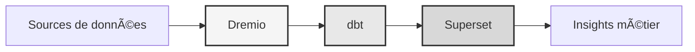

# Piattaforma dati

<p align="center">
  <a href="https://talentys.eu" target="_blank">
    
  </a>
  <br/>
  <em>Supported by <a href="https://talentys.eu">Talentys</a> | <a href="https://www.linkedin.com/company/talentysdata">LinkedIn</a> - Data Engineering & Analytics Excellence</em>
</p>


**Soluzione Lakehouse per dati aziendali**

**Lingua**: francese (FR)  
**Versione**: 3.3.1  
**Ultimo aggiornamento**: 19 ottobre 2025

---

## Panoramica

Piattaforma dati professionale che combina Dremio, dbt e Apache Superset per trasformazione dei dati, garanzia di qualità e business intelligence di livello aziendale.

Questa piattaforma fornisce una soluzione completa per la moderna ingegneria dei dati, comprese pipeline di dati automatizzate, test di qualità e dashboard interattivi.



---

## Caratteristiche principali

- Architettura di case sul lago di dati con Dremio
- Trasformazioni automatizzate con dbt
- Business intelligence con Apache Superset
- Test completi sulla qualità dei dati
- Sincronizzazione in tempo reale tramite Arrow Flight

---

## Guida rapida

### Prerequisiti

-Docker 20.10 o successiva
- Docker Compose 2.0 o successiva
-Python 3.11 o successiva
- Minimo 8 GB di RAM

### Facilità

```bash
# Installer les dépendances
pip install -r requirements.txt

# Démarrer les services
make up

# Vérifier l'installation
make status

# Exécuter les tests de qualité
make dbt-test
```

---

## Architettura

### Componenti del sistema

| Componente | Porto | Descrizione |
|------|------|-----|
| Dremio | 9047, 31010, 32010| Piattaforma dati Lakehouse |
| db | - | Strumento di trasformazione dei dati |
| Superinsieme | 8088| Piattaforma di business intelligence |
| PostgreSQL | 5432| Database transazionale |
| MiniIO | 9000, 9001| Archiviazione oggetti (compatibile S3) |
| Ricerca elastica | 9200| Motore di ricerca e analisi |

Consulta la [documentazione dell'architettura](architettura/) per la progettazione dettagliata del sistema.

---

## Documentazione

### Avvio
- [Guida all'installazione](per iniziare/)
- [Configurazione](per iniziare/)
- [Per iniziare](per iniziare/)

### Guide per l'utente
- [Ingegneria dei dati](guide/)
- [Creazione di dashboard](guide/)
- [Integrazione API](guide/)

### Documentazione API
- [Riferimento API REST](api/)
- [Autenticazione](api/)
- [Esempi di codice](api/)

### Documentazione sull'architettura
- [Progettazione del sistema](architettura/)
- [Flusso di dati](architettura/)
- [Guida alla distribuzione](architettura/)
- [🎯 Guida visiva di Dremio Ports](architecture/dremio-ports-visual.md) ⭐ NOVITÀ

---

## Lingue disponibili

| Lingua | Codice | Documentazione |
|--------|------|-------|
| Inglese | IT | [README.md](../../../README.md) |
| francese | IT | [docs/i18n/fr/](../fr/README.md) |
| spagnolo | ES | [docs/i18n/es/](../es/README.md) |
| Portoghese | P.T. | [docs/i18n/pt/](../pt/README.md) |
| العربية | AR | [docs/i18n/ar/](../ar/README.md) |
| 中文 | CN | [docs/i18n/cn/](../cn/README.md) |
| 日本語 | JP | [docs/i18n/jp/](../jp/README.md) |
| Russo | Regno Unito | [docs/i18n/ru/](../ru/README.md) |

---

## Supporto

Per assistenza tecnica:
- Documentazione: [README principale](../../../README.md)
- Tracker dei problemi: problemi di GitHub
- Forum della community: discussioni su GitHub
- E-mail: support@example.com

---

**[Torna alla documentazione principale](../../../README.md)**
