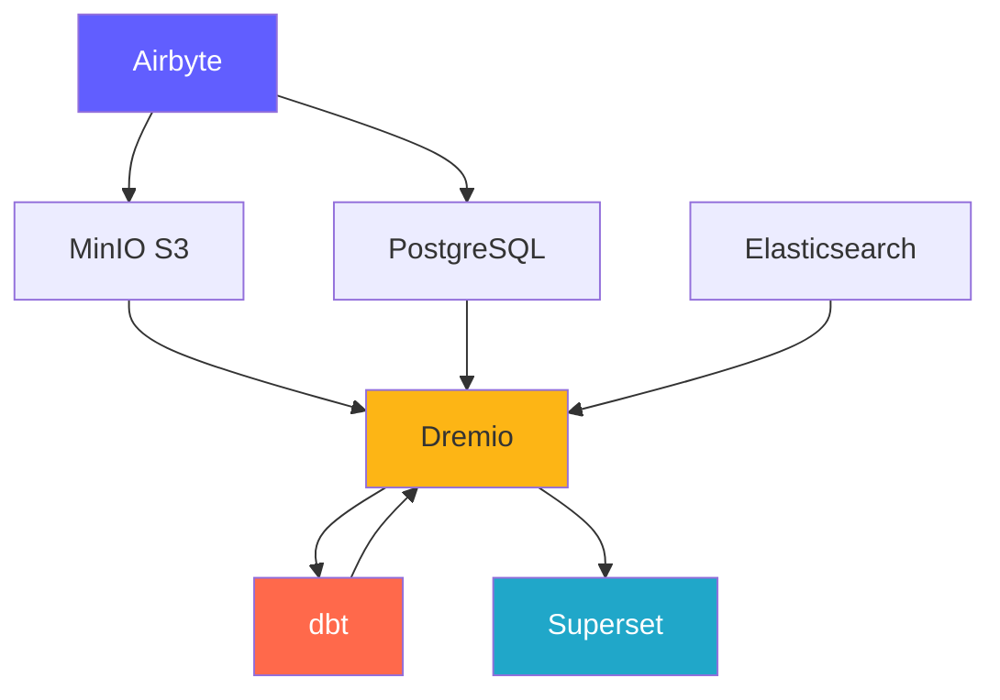
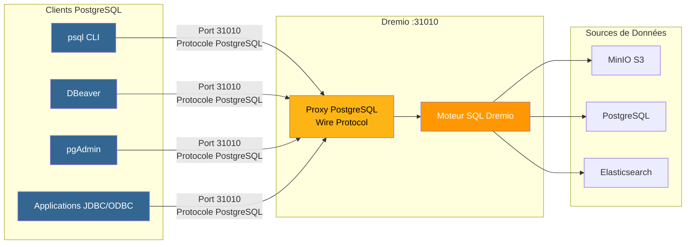
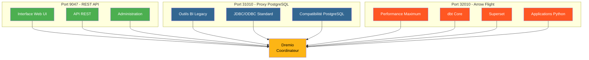
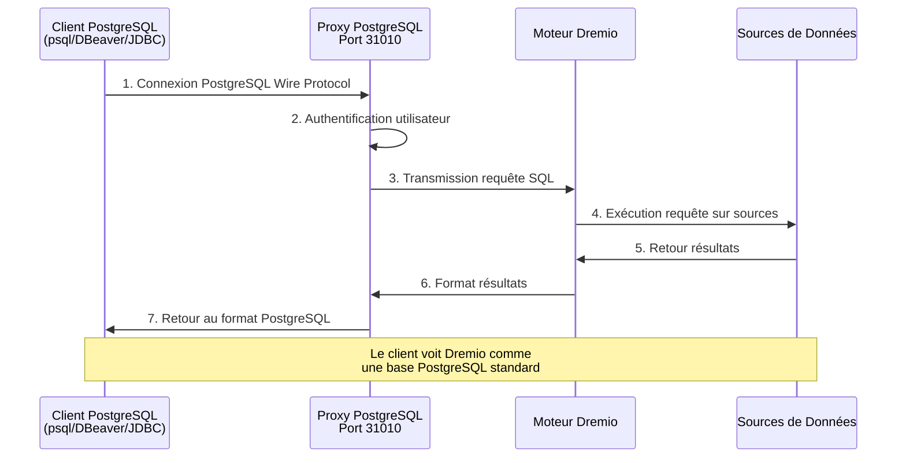
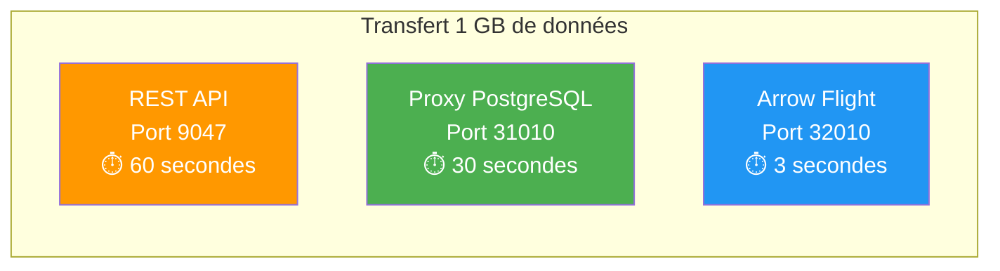

# Componenti della piattaforma

**Versione**: 3.2.0  
**Ultimo aggiornamento**: 2025-10-16  
**Lingua**: francese

---

## Panoramica dei componenti

La piattaforma dati è composta da 7 componenti principali che lavorano insieme per fornire una soluzione completa.



---

## 1. Airbyte – Piattaforma di integrazione dei dati

### Panoramica

Airbyte è un motore di integrazione dei dati open source che consolida i dati da più fonti a destinazioni.

**Versione**: 0.50.33  
**Licenza**: MIT  
**Sito web**: https://airbyte.com

### Caratteristiche principali

- **Oltre 300 connettori predefiniti**: database, API, file, applicazioni SaaS
- **Change Data Capture (CDC)**: replica dei dati in tempo reale
- **Connettori personalizzati**: crea con Python o CDK a basso codice
- **Normalizzazione**: trasforma JSON in tabelle relazionali
- **Sincronizzazione incrementale**: sincronizza solo i dati nuovi/modificati
- **Monitoraggio**: sincronizzazione integrata dello stato del monitoraggio

### Architettura

```yaml
Composants:
  airbyte-webapp:
    Port: 8000
    Objectif: Interface utilisateur web
    
  airbyte-server:
    Port: 8001
    Objectif: Serveur API REST
    
  airbyte-worker:
    Objectif: Exécuter tâches synchronisation
    Scalabilité: Horizontale
    
  airbyte-temporal:
    Port: 7233
    Objectif: Orchestration workflows
    
  airbyte-db:
    Port: 5432
    Objectif: Stockage métadonnées (PostgreSQL)
```

### Caso d'uso

- **Pipeline ELT**: flussi di lavoro di estrazione-caricamento-trasformazione
- **Replica del database**: mantieni i database sincronizzati
- **Integrazione API**: estrae i dati dalle API REST
- **Ingestione di Data Lake**: carica i dati in S3/MinIO
- **Migrazione al cloud**: sposta i dati on-premise nel cloud

### Impostare

```yaml
# Variables d'Environnement
AIRBYTE_VERSION: "0.50.33"
AIRBYTE_HTTP_PORT: 8000
AIRBYTE_API_PORT: 8001
AIRBYTE_WORKSPACE_ROOT: /tmp/airbyte_local

# Limites Ressources
CPU_LIMIT: "2.0"
MEMORY_LIMIT: "2Gi"
```

### Punti di integrazione

- **Uscite per**: MinIO S3, PostgreSQL, Dremio
- **Orchestrazione**: può essere attivata da Airflow, Prefetto
- **Monitoraggio**: endpoint delle metriche Prometheus

---

## 2. Dremio – Piattaforma Data Lakehouse

### Panoramica

Dremio fornisce un'interfaccia SQL unificata per tutte le origini dati con accelerazione delle query.

**Versione**: 26.0 OSS  
**Licenza**: Apache 2.0  
**Sito web**: https://www.dremio.com

### Caratteristiche principali

- **Data Lakehouse**: combina la flessibilità del lago con le prestazioni del magazzino
- **Pensieri**: accelerazione automatica delle query (fino a 100 volte più veloce)
- **Arrow Flight**: trasferimento dati ad alte prestazioni
- **Virtualizzazione dei dati**: esegui query senza spostare i dati
- **Livello semantico**: definizioni di dati di facile utilizzo
- **Viaggio nel tempo**: interroga le versioni storiche fornite

### Architettura

```yaml
Composants:
  Coordinateur:
    Port: 9047 (HTTP), 31010 (ODBC), 32010 (Arrow Flight)
    Objectif: Planification requêtes, gestion métadonnées
    Mémoire: 8Go heap + 8Go direct
    
  Exécuteur:
    Objectif: Exécution requêtes
    Mémoire: 4Go heap + 8Go direct
    Scalabilité: Horizontale (ajouter plus d'exécuteurs)
    
  Stockage:
    Type: Distribué (MinIO, S3, HDFS)
    Format: Parquet, Iceberg
```

### Caso d'uso

- **Analisi self-service**: consente agli utenti aziendali di esplorare i dati
- **Data Mesh**: accesso federato ai dati
- **Accelerazione delle query**: accelera le query del dashboard
- **Catalogo dati**: scopri e gestisci i dati
- **Attivazione BI**: Power Tableau, Power BI, Superset

### Impostare

```conf
# dremio.conf
paths.local: "/opt/dremio/data"
services.coordinator.enabled: true
services.executor.enabled: true

services.coordinator.web.port: 9047
services.flight.endpoint.port: 32010

services.executor.cache.pct.max: 70
```

### Punti di integrazione

- **Legge da**: MinIO S3, PostgreSQL, Elasticsearch
- **Trasforma con**: dbt
- **Utilizzato per**: Superset, Tableau, Power BI

### Proxy PostgreSQL per Dremio

Dremio può emulare un server PostgreSQL, consentendo agli strumenti compatibili con PostgreSQL di connettersi a Dremio come se fosse un database PostgreSQL standard.

#### Architettura proxy PostgreSQL



#### Confronto tra i 3 porti Dremio



#### Configurazione proxy

§§§CODICE_7§§§

#### Casi d'uso del proxy

1. **Strumenti BI Legacy**: collega gli strumenti che non supportano Arrow Flight
2. **Migrazione facile**: sostituisci PostgreSQL con Dremio senza modificare il codice
3. **Compatibilità ODBC/JDBC**: utilizza driver PostgreSQL standard
4. **Sviluppo**: test con strumenti PostgreSQL familiari (psql, pgAdmin)

#### Esempio di connessione

```bash
# Via psql
psql -h localhost -p 31010 -U admin -d datalake

# Via DBeaver / pgAdmin
Host: localhost
Port: 31010
Database: datalake
Username: admin
Password: <votre-mot-de-passe>

# Chaîne JDBC
jdbc:postgresql://localhost:31010/datalake

# Chaîne ODBC
Driver=PostgreSQL Unicode;
Server=localhost;
Port=31010;
Database=datalake;
Uid=admin;
Pwd=<votre-mot-de-passe>;
```

#### Limitazioni

- **Prestazioni**: Arrow Flight (porta 32010) è 20-50 volte più veloce
- **Caratteristiche**: alcune funzioni PostgreSQL avanzate non sono supportate
- **Raccomandazione**: utilizzare Arrow Flight per la produzione, proxy PostgreSQL per compatibilità

#### Flusso di connessione tramite proxy PostgreSQL



#### Confronto di protocolli

| Protocollo | Porto | Prestazioni | Latenza | Casi d'uso |
|------||------|-----|---------|--------|
| **API REST** | 9047| Norma | ~50-100 ms | Interfaccia utente Web, amministrazione |
| **ODBC/JDBC (proxy PostgreSQL)** | 31010| Buono | ~20-50ms | Strumenti BI legacy, compatibilità |
| **Volo della freccia** | 32010| Eccellente (20-50x) | ~5-10ms | Produzione, Superset, dbt |

#### Prestazioni comparative



---

## 3. dbt - Strumento di trasformazione dei dati

### Panoramica

dbt (strumento di creazione dati) consente agli ingegneri analitici di trasformare i dati utilizzando SQL.

**Versione**: 1.10+  
**Licenza**: Apache 2.0  
**Sito Web**: https://www.getdbt.com

### Caratteristiche principali

- **Basato su SQL**: scrive trasformazioni in SQL
- **Controllo della versione**: integrazione Git per la collaborazione
- **Test**: test integrati sulla qualità dei dati
- **Documentazione**: generazione automatica di dizionari di dati
- **Modularità**: macro e pacchetti riutilizzabili
- **Modelli incrementali**: elabora solo i nuovi dati

### Architettura

```yaml
Composants:
  dbt Core:
    Objectif: Outil CLI pour exécuter transformations
    Langage: Python
    
  Modèles:
    Objectif: Instructions SQL SELECT
    Types: Vues, Tables, Incrémental, Snapshots
    
  Tests:
    Objectif: Validation qualité données
    Types: Unique, Not Null, Relations, Personnalisés
    
  Macros:
    Objectif: Fonctions SQL réutilisables
    Langage: Jinja2
```

### Caso d'uso

- **Modellazione dei dati**: crea diagrammi a stella/fiocco
- **Qualità dei dati**: convalida l'integrità dei dati
- **Dimensioni che cambiano lentamente**: monitora i cambiamenti storici
- **Aggregazione dati**: crea tabelle di riepilogo
- **Documentazione dei dati**: genera cataloghi di dati

### Impostare

```yaml
# dbt_project.yml
name: 'dremio_dbt'
version: '1.0.0'
profile: 'dremio'

models:
  dremio_dbt:
    staging:
      +materialized: view
      +schema: staging
    marts:
      +materialized: table
      +schema: marts
```

### Punti di integrazione

- **Lettura da**: set di dati Dremio
- **Scritto a**: Dremio (tramite Arrow Flight)
- **Orchestrato da**: Airflow, cron, Airbyte post-sincronizzazione

---

## 4. Apache Superset: piattaforma di business intelligence

### Panoramica

Superset è una moderna piattaforma di esplorazione e visualizzazione dei dati.

**Versione**: 3.0  
**Licenza**: Apache 2.0  
**Sito Web**: https://superset.apache.org

### Caratteristiche principali

- **IDE SQL**: editor SQL avanzato con completamento automatico
- **Visualizzazioni avanzate**: oltre 50 tipi di grafici
- **Dashboard interattivi**: drill-down, filtri, filtri incrociati
- **SQL Lab**: interfaccia di query ad hoc
- **Avvisi**: rapporti e avvisi pianificati
- **Memoria nella cache**: memorizza nella cache i risultati delle query per migliorare le prestazioni

### Architettura

```yaml
Composants:
  Serveur Web:
    Port: 8088
    Objectif: Servir interface web
    Framework: Flask
    
  Workers Celery:
    Objectif: Exécution requêtes asynchrone
    File: Redis/RabbitMQ
    
  Celery Beat:
    Objectif: Tâches planifiées (préchauffage cache, alertes)
    
  Base de Données:
    Objectif: Stocker tableaux de bord, utilisateurs, logs requêtes
    Type: PostgreSQL
```

### Caso d'uso

- **Dashboard esecutivi**: monitoraggio KPI
- **Analisi operativa**: monitoraggio in tempo reale
- **BI Self-Service**: potenzia gli analisti
- **Analisi incorporata**: integrazione iframe nelle applicazioni
- **Esplorazione dei dati**: analisi ad hoc

### Impostare

```python
# superset_config.py
SQLALCHEMY_DATABASE_URI = 'postgresql://...'
SECRET_KEY = '...'

FEATURE_FLAGS = {
    'DASHBOARD_NATIVE_FILTERS': True,
    'DASHBOARD_CROSS_FILTERS': True,
    'ENABLE_TEMPLATE_PROCESSING': True
}

CACHE_CONFIG = {
    'CACHE_TYPE': 'redis',
    'CACHE_DEFAULT_TIMEOUT': 300
}
```

### Punti di integrazione

- **Richieste**: Dremio (tramite Arrow Flight)
- **Autenticazione**: LDAP, OAuth2, Database
- **Avvisi**: e-mail, Slack

---

## 5. PostgreSQL - Database relazionale

### Panoramica

PostgreSQL è un avanzato sistema di gestione di database relazionali open source.

**Versione**: 16  
**Licenza**: licenza PostgreSQL  
**Sito Web**: https://www.postgresql.org

### Caratteristiche principali

- **Conformità ACID**: transazioni affidabili
- **Supporto JSON**: tipi JSON/JSONB nativi
- **Ricerca testo completo**: funzionalità di ricerca integrate
- **Estensioni**: PostGIS, pg_stat_statements, TimescaleDB
- **Replica**: replica in streaming, replica logica
- **Partizionamento**: partizionamento nativo della tabella

### Architettura

```yaml
Composants:
  Serveur PostgreSQL:
    Port: 5432
    Protocole: Protocole wire PostgreSQL
    
  Bases de Données:
    - dremio_db: Métadonnées Dremio
    - superset_db: Configuration Superset
    - airbyte_db: Métadonnées Airbyte
    
  Connexions:
    Max: 200
    Pooling: PgBouncer (optionnel)
```

### Caso d'uso

- **Archiviazione di metadati**: archivia i metadati di sistema
- **Carichi transazionali**: applicazioni OLTP
- **Tabelle di staging**: elaborazione dati temporanea
- **Configurazione archiviazione**: impostazioni dell'applicazione
- **Log di controllo**: tieni traccia delle modifiche al sistema

### Impostare

```conf
# postgresql.conf
max_connections = 200
shared_buffers = 256MB
effective_cache_size = 1GB
maintenance_work_mem = 64MB
work_mem = 4MB

# Performance
random_page_cost = 1.1
effective_io_concurrency = 200

# Journalisation
log_statement = 'mod'
log_duration = on
```

### Punti di integrazione

- **Letto da**: Dremio, Superset, Airbyte
- **Scritto da**: Airbyte, dbt, applicazioni
- **Gestito da**: backup e replica automatizzati

---

## 6. MinIO – Archiviazione di oggetti compatibile con S3

### Panoramica

MinIO è un sistema di storage di oggetti ad alte prestazioni compatibile con S3.

**Versione**: la più recente  
**Licenza**: AGPLv3  
**Sito web**: https://min.io

### Caratteristiche principali

- **API S3**: compatibile al 100% con Amazon S3
- **Prestazioni elevate**: throughput multi GB/s
- **Erasure Coding**: dati su sostenibilità e disponibilità
- **Versioning**: controllo della versione dell'oggetto
- **Crittografia**: lato server e lato client
- **Multi-Cloud**: distribuzione ovunque

### Architettura

```yaml
Composants:
  Serveur MinIO:
    Port: 9000 (API S3), 9001 (Console)
    Mode: Nœud unique ou distribué
    
  Stockage:
    Format: Erasure coded ou brut
    Redondance: Configurable (ex: 4+2)
    
  Buckets:
    - datalake: Stockage données principal
    - raw-data: Ingestion Airbyte
    - processed-data: Sorties dbt
    - backups: Sauvegardes système
```

### Caso d'uso

- **Data Lake**: archivia dati grezzi ed elaborati
- **Archiviazione di oggetti**: file, immagini, video
- **Backup di archiviazione**: backup di database e sistema
- **Archivio**: conservazione dei dati a lungo termine
- **Data Staging**: archiviazione temporanea dell'elaborazione

### Impostare

```yaml
# Variables d'Environnement
MINIO_ROOT_USER: minioadmin
MINIO_ROOT_PASSWORD: minioadmin123
MINIO_VOLUMES: /data

# Politiques Buckets
- datalake: Lecture-écriture pour plateforme données
- raw-data: Écriture par Airbyte, lecture par Dremio
- processed-data: Écriture par dbt, lecture tous
```

### Punti di integrazione

- **Scritto da**: Airbyte, dbt, applicazioni
- **Letto da**: Dremio, data scientist
- **Gestito da**: mc (Client MinIO), s3cmd

---

## 7. Elasticsearch - Motore di ricerca e analisi

### Panoramica

Elasticsearch è un motore di ricerca e analisi distribuito basato su Apache Lucene.

**Versione**: 8.15  
**Licenza**: Licenza elastica 2.0  
**Sito web**: https://www.elastic.co

### Caratteristiche principali

- **Ricerca testo completo**: funzionalità di ricerca avanzate
- **Indicizzazione in tempo reale**: disponibilità dei dati quasi in tempo reale
- **Distribuito**: scalabilità orizzontale
- **Aggregazioni**: analisi complesse
- **API RESTful**: API HTTP semplice
- **Apprendimento automatico**: rilevamento di anomalie

### Architettura

```yaml
Composants:
  Nœud Elasticsearch:
    Port: 9200 (HTTP), 9300 (Transport)
    Rôles: Master, Data, Ingest, ML
    
  Index:
    Objectif: Stocker documents recherchables
    Shards: Distribués entre nœuds
    Répliques: Pour haute disponibilité
    
  Cycle de Vie Index:
    Hot: Données récentes (SSD)
    Warm: Données anciennes (HDD)
    Cold: Archive (S3)
```

### Caso d'uso

- **Log analitici**: registrazione centralizzata (stack ELK)
- **Ricerca applicazioni**: cataloghi di prodotti, ricerca nel sito
- **Analisi di sicurezza**: casi d'uso SIEM
- **Osservabilità**: Metriche e tracce
- **Analisi del testo**: PNL e analisi del sentiment

### Impostare

```yaml
# elasticsearch.yml
cluster.name: "dremio-search-cluster"
node.name: "node-1"
network.host: 0.0.0.0
http.port: 9200

# Sécurité
xpack.security.enabled: true
xpack.security.transport.ssl.enabled: false

# Mémoire
bootstrap.memory_lock: true
```

### Punti di integrazione

- **Indicizzato da**: Logstash, Filebeat
- **Richiesto da**: Dremio, Kibana
- **Monitorato da**: Monitoraggio Elasticsearch

---

## Confronto dei componenti

| Componente | Digitare | Uso principale | Scalabilità | Stato |
|---------------|------|-----------------|-------------|------|
| **Airbyte** | Integrazione | Ingestione dati | Orizzontale (lavoratori) | Apolide |
| **Dremio** | Motore di query | Accesso ai dati | Orizzontali (esecutori) | Apolide |
| **dbt** | Trasformazione | Modellazione dei dati | Verticale (cuori) | Apolide |
| **Superinsieme** | Piattaforma BI | Visualizzazione | Orizzontale (web) | Apolide |
| **PostgreSQL** | Banca dati | Archiviazione dei metadati | Verticale (+ replica) | Con stato |
| **MinIO** | Archiviazione oggetti | Lago dati | Orizzontale (distribuito) | Con stato |
| **Ricerca elastica** | Motore di ricerca | Ricerca nel testo completo | Orizzontale (cluster) | Con stato |

---

## Requisiti delle risorse

### Configurazione minima (sviluppo)

```yaml
Total: 8 Go RAM, 4 CPUs, 50 Go Disque

Allocation:
  Airbyte: 1 Go RAM, 0.5 CPU
  Dremio: 2 Go RAM, 1 CPU
  Superset: 1 Go RAM, 0.5 CPU
  PostgreSQL: 1 Go RAM, 0.5 CPU
  MinIO: 1 Go RAM, 0.5 CPU
  Elasticsearch: 2 Go RAM, 1 CPU
```

### Configurazione consigliata (produzione)

```yaml
Total: 64 Go RAM, 16 CPUs, 500 Go SSD

Allocation:
  Airbyte: 4 Go RAM, 2 CPUs
  Dremio: 16 Go RAM, 4 CPUs
  Superset: 8 Go RAM, 2 CPUs
  PostgreSQL: 8 Go RAM, 2 CPUs
  MinIO: 16 Go RAM, 2 CPUs
  Elasticsearch: 12 Go RAM, 4 CPUs
```

---

## Matrice di compatibilità delle versioni

| Componente | Rilascio | Compatibile con |
|----------|---------|----------------------|
| Airbyte | 0,50+ | Tutte le destinazioni |
| Dremio | 26.0| dbt 1.8+, clienti Arrow Flight |
| db | 1.10+ | Dremio 23.0+ |
| Superinsieme | 3.0+ | Dremio 22.0+, PostgreSQL 12+ |
| PostgreSQL | 16| Tutti i componenti |
| MiniIO | Ultimi | Client compatibili S3 |
| Ricerca elastica | 8.15| Dremio 26.0+, Logstash 8.x |

---

**Versione della guida ai componenti**: 3.2.0  
**Ultimo aggiornamento**: 2025-10-16  
**Mantenuto da**: Team della piattaforma dati