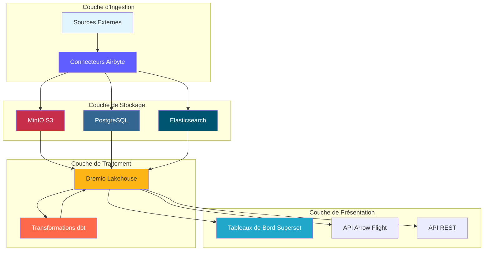
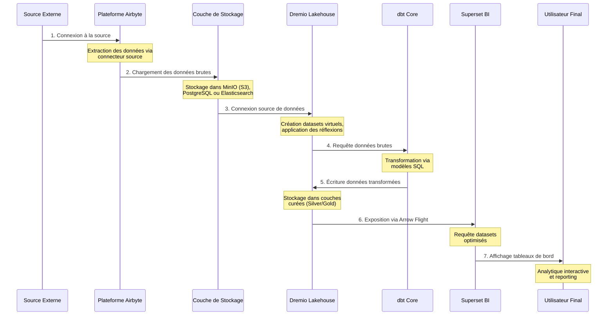
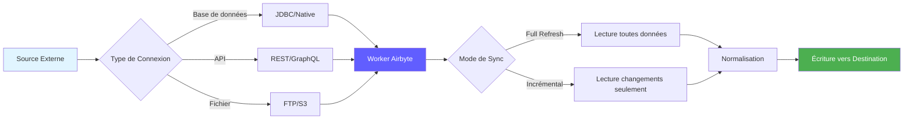
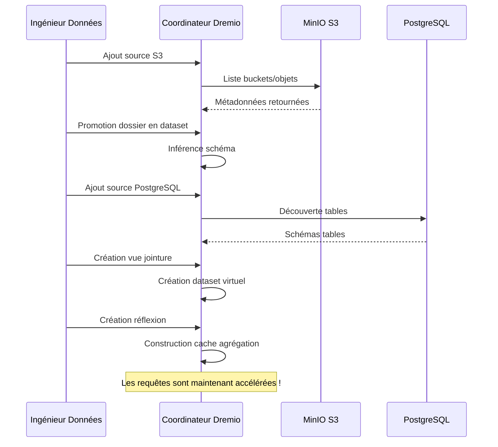
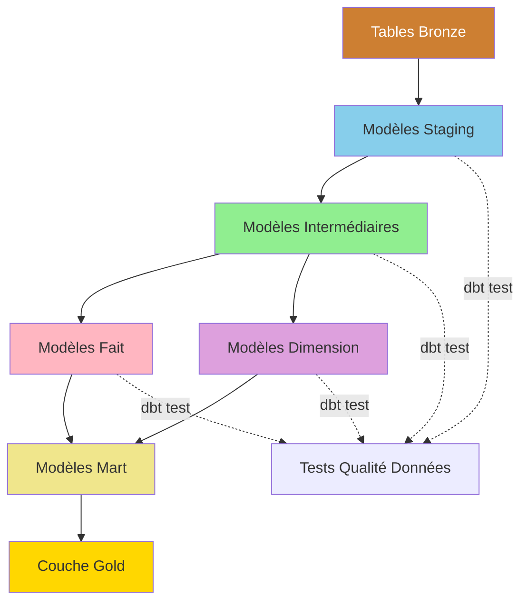
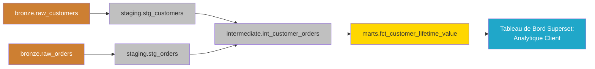
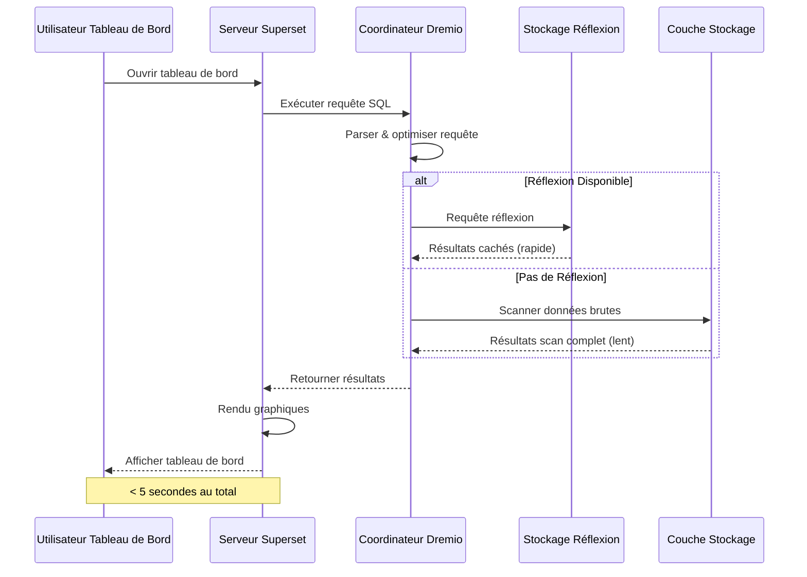
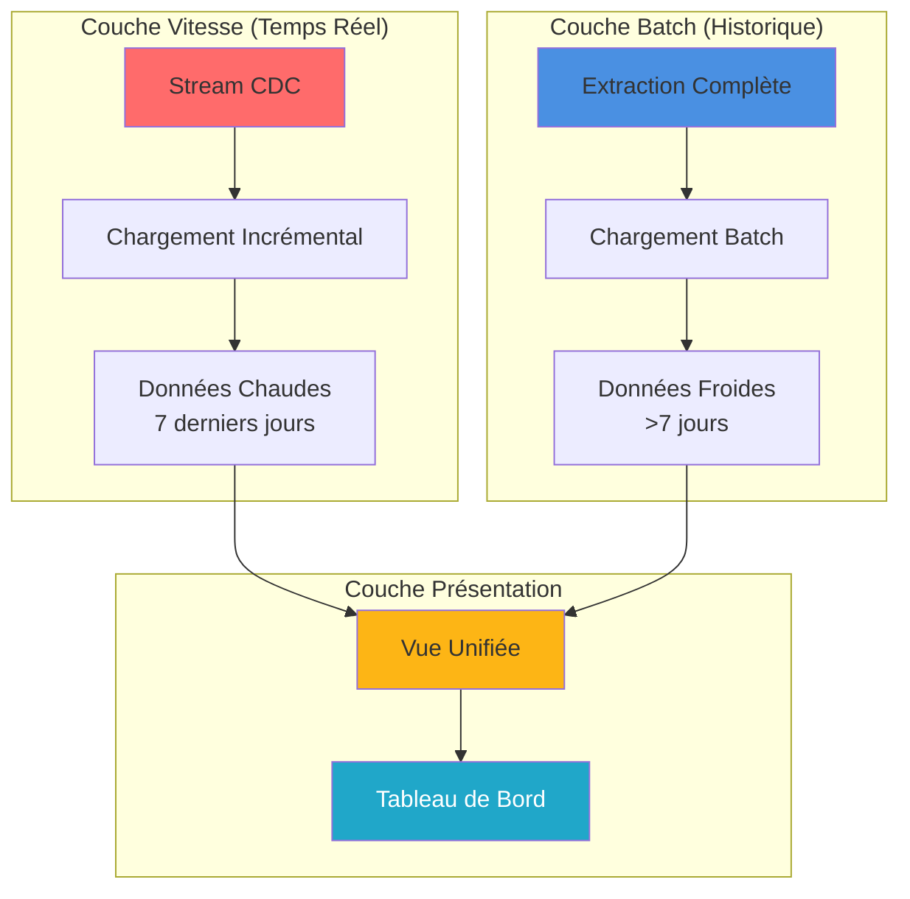
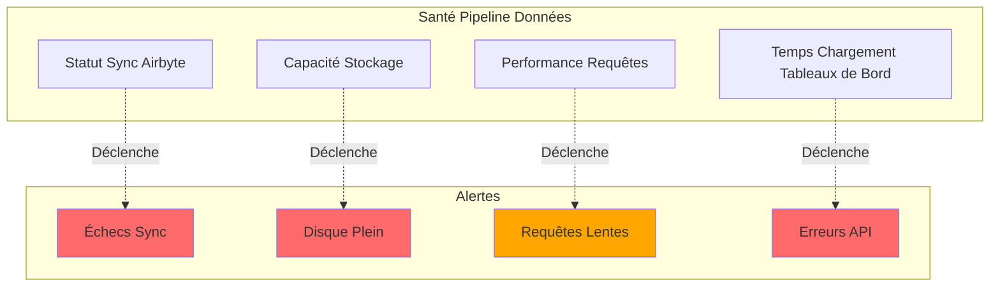

# Architettura del flusso di dati

**Versione**: 3.2.0  
**Ultimo aggiornamento**: 16 ottobre 2025  
**Lingua**: francese

## Sommario

1. [Panoramica](#panoramica)
2. [Flusso di dati end-to-end](#flusso-di-dati end-to-end)
3. [Livello di importazione](#livello di importazione)
4. [Livello di archiviazione](#livello di archiviazione)
5. [Livello di elaborazione](#livello di elaborazione)
6. [Livello presentazione](#livello-presentazione)
7. [Modelli di flusso di dati](#modelli di flusso di dati)
8. [Considerazioni sulle prestazioni](#considerazioni-sulle prestazioni)
9. [Monitoraggio del flusso di dati](#monitoraggio del flusso di dati)
10. [Buone pratiche](#buone-pratiche)

---

## Panoramica

Questo documento descrive in dettaglio l'architettura completa del flusso di dati della piattaforma, dall'acquisizione iniziale dei dati al consumo finale. Comprendere questi flussi è fondamentale per ottimizzare le prestazioni, risolvere i problemi e progettare pipeline di dati efficaci.

### Principi del flusso di dati

La nostra architettura segue questi principi fondamentali:

1. **Flusso unidirezionale**: i dati si muovono in una direzione chiara e prevedibile
2. **Elaborazione a più livelli**: ogni livello ha una responsabilità specifica
3. **Componenti disaccoppiati**: i servizi comunicano tramite interfacce ben definite
4. **Idempotenza**: le operazioni possono essere ripetute in sicurezza
5. **Osservabilità**: ogni passaggio viene registrato e monitorato

### Livelli di architettura



---

## Flusso di dati end-to-end

### Sequenza completa della pipeline



### Passaggi del flusso di dati

| Passo | Componente | Ingresso | Esci | Latenza |
|-------|----------|--------|--------|---------|
| **Estrai** | Airbyte | API/BD esterni | JSON/CSV non elaborato | 1-60 minuti |
| **Caricamento** | Livello di archiviazione | File grezzi | Secchi curati | <1 minuto |
| **Catalogazione** | Dremio | Percorsi di archiviazione | Set di dati virtuali | <1 minuto |
| **Trasformazione** | db | Tavoli in Bronzo | Tavoli Argento/Oro | 5-30 minuti |
| **Ottimizzazione** | Pensieri Dremio | Query grezze | Risultati nascosti | Tempo reale |
| **Visualizzazione** | Superinsieme | Query SQL | Grafici/Dashboard | <5 secondi |

---

## Livello di importazione

### Estrazione dati Airbyte

Airbyte gestisce tutta l'acquisizione di dati da fonti esterne.

#### Flusso di connessione di origine



#### Metodi di estrazione dei dati

**1. Aggiornamento completo**
```yaml
# Full refresh extrait toutes les données à chaque sync
sync_mode: full_refresh
destination_sync_mode: overwrite

# Cas d'usage:
# - Petits datasets (<1M lignes)
# - Pas de suivi fiable des changements
# - Snapshots complets nécessaires
```

**2. Sincronizzazione incrementale**
```yaml
# Sync incrémental extrait uniquement les données nouvelles/modifiées
sync_mode: incremental
destination_sync_mode: append_dedup
cursor_field: updated_at

# Cas d'usage:
# - Grands datasets (>1M lignes)
# - Possède champ timestamp ou curseur
# - Optimisation performance sync
```

**3. Modifica acquisizione dati (CDC)**
```yaml
# CDC utilise les logs de transaction de la base de données
method: CDC
replication_method: LOG_BASED

# Bases de données supportées:
# - PostgreSQL (WAL)
# - MySQL (binlog)
# - MongoDB (change streams)
# - SQL Server (change tracking)
```

### Integrazione dell'API Airbyte

```bash
# Déclencher sync via API
curl -X POST http://localhost:8001/api/v1/connections/sync \
  -H "Content-Type: application/json" \
  -d '{
    "connectionId": "your-connection-id"
  }'

# Vérifier statut sync
curl -X POST http://localhost:8001/api/v1/jobs/get \
  -H "Content-Type: application/json" \
  -d '{
    "id": "job-id"
  }'
```

### Prestazioni di estrazione

| Tipo di origine | Flusso | Frequenza consigliata |
|----------------|-------|----------------------|
| PostgreSQL | 50-100k linee/sec | Ogni 15-60 minuti |
| API REST | 1-10k richieste/sec | Ogni 5-30 minuti |
| File CSV | 100-500MB/sec | Giornaliero |
| MongoDB | 10-50.000 documenti/sec | Ogni 15-60 minuti |
| CDC MySQL | Tempo reale | Continuo |

---

## Livello di archiviazione

### Archiviazione MinIO S3

MinIO memorizza i dati grezzi ed elaborati in una struttura gerarchica.

#### Organizzazione del secchio

§§§CODICE_7§§§

#### Struttura del percorso dati

```
s3://datalake/
├── bronze/                      # Données brutes d'Airbyte
│   ├── postgres/
│   │   ├── customers/
│   │   │   └── date=2025-10-16/
│   │   │       └── data.parquet
│   │   └── orders/
│   │       └── date=2025-10-16/
│   │           └── data.parquet
│   ├── api/
│   │   └── rest_endpoint/
│   │       └── timestamp=20251016_120000/
│   │           └── response.json
│   └── files/
│       └── csv_import/
│           └── batch_001.csv
│
├── silver/                      # Données nettoyées et validées
│   ├── customers/
│   │   └── version=v2/
│   │       └── customers_cleaned.parquet
│   └── orders/
│       └── version=v2/
│           └── orders_enriched.parquet
│
└── gold/                        # Agrégats prêts pour le métier
    ├── daily_revenue/
    │   └── year=2025/month=10/
    │       └── day=16/
    │           └── revenue.parquet
    └── customer_metrics/
        └── snapshot=2025-10-16/
            └── metrics.parquet
```

### Strategia del formato di archiviazione

| Strato | Formato | Compressione | Partizionamento | Motivo |
|--------|--------|-----|-----------------|--------|
| **Bronzo** | Parquet | Scattante | Per data | Scrittura veloce, buona compressione |
| **Argento** | Parquet | Scattante | Per chiave aziendale | Query efficaci |
| **Oro** | Parquet | ZSTD | Per periodo | Compressione massima |
| **Registri** | JSON | Gzip | Per servizio/data | Leggibile dagli esseri umani |

### Archiviazione dei metadati PostgreSQL

Archivi PostgreSQL:
- Configurazione e stato di Airbyte
- Metadati e cronologia di esecuzione del database
- Dashboard e utenti superset
- Registri e metriche dell'applicazione

```sql
-- Structure table état Airbyte
CREATE TABLE airbyte_state (
    connection_id UUID PRIMARY KEY,
    state JSONB NOT NULL,
    updated_at TIMESTAMP DEFAULT NOW()
);

-- Historique exécution dbt
CREATE TABLE dbt_run_history (
    run_id UUID PRIMARY KEY,
    project_name VARCHAR(255),
    started_at TIMESTAMP,
    completed_at TIMESTAMP,
    status VARCHAR(50),
    models_run INTEGER,
    tests_run INTEGER,
    metadata JSONB
);
```

### Archiviazione documenti Elasticsearch

Elasticsearch indicizza i log e consente la ricerca full-text.

```json
{
  "index": "airbyte-logs-2025.10.16",
  "mappings": {
    "properties": {
      "timestamp": {"type": "date"},
      "level": {"type": "keyword"},
      "service": {"type": "keyword"},
      "message": {"type": "text"},
      "job_id": {"type": "keyword"},
      "connection_id": {"type": "keyword"},
      "records_synced": {"type": "integer"},
      "bytes_synced": {"type": "long"}
    }
  }
}
```

---

## Livello di elaborazione

### Virtualizzazione dei dati Dremio

Dremio crea una vista unificata su tutte le fonti di archiviazione.

#### Creazione del set di dati virtuale



#### Accelerazione tramite riflessioni

Le riflessioni di Dremio precalcolano i risultati delle query per prestazioni immediate.

```sql
-- Créer réflexion brute (sous-ensemble colonnes)
CREATE REFLECTION raw_customers
ON bronze.customers
USING DISPLAY (customer_id, name, email, created_at);

-- Créer réflexion agrégation
CREATE REFLECTION agg_daily_revenue
ON gold.orders
USING DIMENSIONS (order_date)
MEASURES (SUM(amount), COUNT(*), AVG(amount));

-- Les réflexions se rafraîchissent automatiquement selon la politique
ALTER REFLECTION agg_daily_revenue
SET REFRESH EVERY 1 HOUR;
```

**Impatto sulle prestazioni dei riflessi:**

| Tipo di query | Senza riflessione | Con riflessione | Accelerazione |
|-----------------|----------------|----------------|---------|
| SELEZIONA Semplice | 500 ms | 50 ms | 10 volte |
| Aggregazioni | 5 | 100 ms | 50x |
| JOIN complessi | Anni '30 | 500 ms | 60x |
| Scansioni di grandi dimensioni | 120 | 2s | 60x |

### trasformazioni dbt

dbt trasforma i dati grezzi in modelli pronti per il business.

#### Flusso di trasformazione



#### Esempio di pipeline di trasformazione

```sql
-- models/staging/stg_customers.sql
-- Étape 1: Nettoyage et standardisation
WITH source AS (
    SELECT * FROM bronze.raw_customers
),

cleaned AS (
    SELECT
        customer_id,
        TRIM(UPPER(name)) AS customer_name,
        LOWER(email) AS email,
        phone,
        address,
        city,
        state,
        zip_code,
        created_at,
        updated_at
    FROM source
    WHERE customer_id IS NOT NULL
)

SELECT * FROM cleaned;
```

```sql
-- models/intermediate/int_customer_orders.sql
-- Étape 2: Jointure et enrichissement
WITH customers AS (
    SELECT * FROM {{ ref('stg_customers') }}
),

orders AS (
    SELECT * FROM {{ ref('stg_orders') }}
),

joined AS (
    SELECT
        c.customer_id,
        c.customer_name,
        c.email,
        o.order_id,
        o.order_date,
        o.amount,
        o.status
    FROM customers c
    INNER JOIN orders o
        ON c.customer_id = o.customer_id
)

SELECT * FROM joined;
```

```sql
-- models/marts/fct_customer_lifetime_value.sql
-- Étape 3: Agrégation pour métriques métier
WITH customer_orders AS (
    SELECT * FROM {{ ref('int_customer_orders') }}
),

metrics AS (
    SELECT
        customer_id,
        customer_name,
        email,
        COUNT(DISTINCT order_id) AS total_orders,
        SUM(amount) AS lifetime_value,
        AVG(amount) AS average_order_value,
        MIN(order_date) AS first_order_date,
        MAX(order_date) AS last_order_date,
        DATEDIFF('day', MIN(order_date), MAX(order_date)) AS customer_lifespan_days
    FROM customer_orders
    WHERE status = 'completed'
    GROUP BY customer_id, customer_name, email
)

SELECT * FROM metrics;
```

#### Flusso di esecuzione dbt

```bash
# Exécution pipeline complète
dbt run --select staging        # Exécuter modèles staging
dbt test --select staging       # Tester modèles staging
dbt run --select intermediate   # Exécuter modèles intermédiaires
dbt test --select intermediate  # Tester modèles intermédiaires
dbt run --select marts          # Exécuter modèles mart
dbt test --select marts         # Tester modèles mart

# Générer documentation
dbt docs generate
dbt docs serve
```

### Tracciabilità della derivazione dei dati



---

## Livello di presentazione

### Flusso di esecuzione delle query



### Modelli di accesso API

#### 1. Dashboard superset (BI Interactive)

```python
# Superset exécute SQL via SQLAlchemy
from superset import db

query = """
SELECT 
    order_date,
    SUM(amount) as daily_revenue
FROM gold.fct_daily_revenue
WHERE order_date >= CURRENT_DATE - INTERVAL '30 days'
GROUP BY order_date
ORDER BY order_date
"""

results = db.session.execute(query)
```

#### 2. API Arrow Flight (alte prestazioni)

```python
# Connexion Arrow Flight directe pour outils analytiques
from pyarrow import flight

client = flight.FlightClient("grpc://localhost:32010")

# Authentification
token = client.authenticate_basic_token("admin", "password123")

# Exécuter requête
descriptor = flight.FlightDescriptor.for_command(
    b"SELECT * FROM gold.customer_metrics LIMIT 1000"
)

flight_info = client.get_flight_info(descriptor)
reader = client.do_get(flight_info.endpoints[0].ticket)

# Lire comme Table Arrow (zero-copy)
table = reader.read_all()
df = table.to_pandas()
```

#### 3. API REST (Integrazioni esterne)

```bash
# API REST Dremio pour automatisation
curl -X POST http://localhost:9047/api/v3/sql \
  -H "Authorization: Bearer $TOKEN" \
  -H "Content-Type: application/json" \
  -d '{
    "sql": "SELECT COUNT(*) FROM gold.customers"
  }'
```

---

## Modelli di flusso di dati

### Modello 1: pipeline batch ETL

```mermaid
gantt
    title Planification ETL Batch Quotidien
    dateFormat HH:mm
    axisFormat %H:%M
    
    section Ingestion
    Extraction Airbyte (PostgreSQL)     :01:00, 30m
    Extraction Airbyte (APIs)           :01:30, 45m
    
    section Chargement
    Chargement vers Bronze MinIO        :02:15, 15m
    
    section Transformation
    Modèles Staging dbt                 :02:30, 20m
    Modèles Intermédiaires dbt          :02:50, 30m
    Modèles Mart dbt                    :03:20, 40m
    
    section Tests
    Tests Qualité Données dbt           :04:00, 15m
    
    section Optimisation
    Rafraîchissement Réflexions Dremio  :04:15, 20m
    
    section Présentation
    Préchauffage Cache Tableau de Bord  :04:35, 10m
```



### Modello 2: streaming in tempo reale


### Modello 3: aggiornamenti incrementali

```sql
-- Modèle incrémental dbt
{{ config(
    materialized='incremental',
    unique_key='order_id',
    on_schema_change='sync_all_columns'
) }}

SELECT
    order_id,
    customer_id,
    order_date,
    amount,
    status,
    updated_at
FROM {{ source('bronze', 'orders') }}


    -- Traiter uniquement les enregistrements nouveaux ou mis à jour
    WHERE updated_at > (SELECT MAX(updated_at) FROM {{ this }})

```

### Modello 4: Architettura Lambda (Batch + Stream)



---

## Considerazioni sulle prestazioni

### Ottimizzazione dell'acquisizione

```yaml
# Configuration connexion Airbyte
sync_mode: incremental
destination_sync_mode: append_dedup
cursor_field: updated_at

# Ajustement performance
batch_size: 10000              # Enregistrements par batch
threads: 4                     # Workers parallèles
timeout_minutes: 60           # Timeout sync
retry_on_failure: true
max_retries: 3

# Optimisation réseau
compression: gzip
buffer_size_mb: 256
```

### Ottimizzazione dello spazio di archiviazione

```python
# Options écriture Parquet pour compression optimale
import pyarrow.parquet as pq

pq.write_table(
    table,
    'output.parquet',
    compression='snappy',      # Compression rapide
    use_dictionary=True,       # Activer encodage dictionnaire
    row_group_size=1000000,    # 1M lignes par row group
    data_page_size=1048576,    # 1MB taille page
    write_statistics=True      # Activer statistiques pour pruning
)
```

### Ottimizzazione delle query

```sql
-- Bonnes pratiques requêtes Dremio

-- 1. Utiliser partition pruning
SELECT * FROM gold.orders
WHERE order_date >= '2025-10-01'  -- Élague partitions
  AND order_date < '2025-11-01';

-- 2. Exploiter les réflexions
-- Créer réflexion une fois, requêtes auto-accélérées
ALTER REFLECTION agg_orders SET ENABLED = TRUE;

-- 3. Utiliser column pruning
SELECT order_id, amount       -- Seulement colonnes nécessaires
FROM gold.orders
LIMIT 1000;

-- 4. Pousser les filtres
SELECT *
FROM gold.customers
WHERE state = 'CA'            -- Filtre poussé vers stockage
  AND lifetime_value > 1000;
```

### Ottimizzazione delle trasformazioni

```sql
-- Techniques optimisation dbt

-- 1. Modèles incrémentaux pour grandes tables
{{ config(materialized='incremental') }}

-- 2. Tables partitionnées
{{ config(
    materialized='table',
    partition_by={
        'field': 'order_date',
        'data_type': 'date',
        'granularity': 'day'
    }
) }}

-- 3. Tables clusterisées pour meilleures jointures
{{ config(
    materialized='table',
    cluster_by=['customer_id']
) }}
```

### Benchmark delle prestazioni

| Operazione | Set di dati piccolo<br/>(1 milione di righe) | Set di dati medio<br/>(100 milioni di righe) | Set di dati di grandi dimensioni<br/>(righe 1B) |
|----------------------|---------------------||----------------------||----------------------|
| **Sincronizza Airbyte** | 2 minuti | 30 minuti | 5 ore |
| **esecuzione dbt** | 30 secondi | 10 minuti | 2 ore |
| **Riflessione sulla costruzione** | 10 secondi | 5 minuti | 30 minuti |
| **Query sulla dashboard** | <100 ms | <500 ms | <2s |

---

## Monitoraggio del flusso di dati

### Metriche chiave da monitorare

```yaml
# Configuration métriques Prometheus
metrics:
  ingestion:
    - airbyte_records_synced_total
    - airbyte_sync_duration_seconds
    - airbyte_sync_failures_total
    
  storage:
    - minio_disk_usage_bytes
    - minio_objects_total
    - postgres_connections_active
    
  processing:
    - dremio_query_duration_seconds
    - dremio_reflection_refresh_seconds
    - dbt_model_execution_time
    
  serving:
    - superset_dashboard_load_time
    - superset_query_cache_hit_rate
    - api_requests_per_second
```

### Pannello di monitoraggio



### Aggregazione dei registri

```bash
# Requête Elasticsearch pour surveillance pipeline
curl -X GET "localhost:9200/airbyte-logs-*/_search" \
  -H 'Content-Type: application/json' \
  -d '{
    "query": {
      "bool": {
        "filter": [
          {"range": {"timestamp": {"gte": "now-1h"}}},
          {"term": {"level": "ERROR"}}
        ]
      }
    },
    "aggs": {
      "by_service": {
        "terms": {"field": "service"}
      }
    }
  }'
```

---

## Migliori pratiche

### Progettazione del flusso di dati

1. **Progettazione per l'idempotenza**
   - Garantire che le operazioni possano essere ripetute in sicurezza
   - Utilizzare chiavi univoche per la deduplicazione
   - Implementare un'adeguata gestione degli errori

2. **Implementare controlli sulla qualità dei dati**
   ```sql
   -- Exemple test dbt
   -- tests/assert_positive_amounts.sql
   SELECT *
   FROM {{ ref('fct_orders') }}
   WHERE amount <= 0
   ```

3. **Partizionare set di dati di grandi dimensioni**
   ```python
   # Partitionner par date pour requêtes efficaces
   df.write.partitionBy('order_date').parquet('s3://bucket/orders/')
   ```

4. **Utilizzare modalità di sincronizzazione appropriate**
   - Aggiornamento completo: tabelle di piccole dimensioni
   - Incrementale: tabelle dei fatti di grandi dimensioni
   - CDC: requisiti in tempo reale

### Regolazione delle prestazioni

1. **Ottimizza la pianificazione della sincronizzazione di Airbyte**
   ```yaml
   # Équilibrer fraîcheur vs utilisation ressources
   small_tables:
     frequency: every_15_minutes
   
   large_tables:
     frequency: every_6_hours
   
   dimension_tables:
     frequency: daily
   ```

2. **Crea pensieri strategici**
   ```sql
   -- Focus sur agrégations fréquemment requêtées
   CREATE REFLECTION common_metrics
   ON gold.orders
   USING DIMENSIONS (product_id, date_trunc('day', order_date))
   MEASURES (SUM(amount), COUNT(*));
   ```

3. **Ottimizza i modelli dbt**
   ```yaml
   # models/schema.yml
   models:
     - name: fct_large_table
       config:
         materialized: incremental
         incremental_strategy: merge
         unique_key: id
         partition_by: {field: date, data_type: date}
   ```

### Risoluzione dei problemi comuni

| Problema | Sintomo | Soluzione |
|---------|---------|----------|
| **Sincronizzazione Airbyte lenta** | Tempi da sincronizzare | Aumenta la dimensione del batch, usa la modalità incrementale |
| **Mancanza di memoria** | Modelli dbt falliti | Materializza in modo incrementale, aggiungi il partizionamento |
| **Query lente** | Pannello di timeout | Crea riflessioni, aggiungi indice |
| **Memoria piena** | Errori di scrittura | Implementare la conservazione dei dati, comprimere i vecchi dati |
| **Dati obsoleti** | Vecchie metriche | Aumenta la frequenza di sincronizzazione, controlla gli orari |

### Buone pratiche di sicurezza

1. **Crittografare i dati in transito**
   ```yaml
   # docker-compose.yml
   minio:
     environment:
       MINIO_SERVER_URL: https://minio:9000
       MINIO_BROWSER_REDIRECT_URL: https://console.minio.local
   ```

2. **Implementare i controlli di accesso**
   ```sql
   -- ACLs Dremio
   GRANT SELECT ON gold.customer_metrics TO ROLE analyst;
   GRANT ALL ON bronze.* TO ROLE data_engineer;
   ```

3. **Controlla l'accesso ai dati**
   ```json
   {
     "audit_log": {
       "enabled": true,
       "log_queries": true,
       "log_user_actions": true,
       "retention_days": 90
     }
   }
   ```

---

## Riepilogo

Questo documento descrive in dettaglio l'architettura completa del flusso di dati:

- **Livello di acquisizione**: Airbyte estrae i dati da varie fonti tramite aggiornamento completo, incrementale o CDC
- **Livello di archiviazione**: MinIO, PostgreSQL ed Elasticsearch archiviano i dati grezzi ed elaborati in livelli organizzati
- **Processing Layer**: Dremio virtualizza i dati e dbt li trasforma tramite modelli staging, intermedi e mart
- **Livello presentazione**: dashboard e API superset forniscono l'accesso a dati pronti per il business

Punti chiave da ricordare:
- I dati fluiscono in modo unidirezionale attraverso livelli chiaramente definiti
- Ogni componente ha responsabilità e interfacce specifiche
- Le prestazioni sono ottimizzate tramite riflessioni, partizionamento e memorizzazione nella cache
- Monitoraggio e osservabilità sono integrati in ogni livello
- Le buone pratiche garantiscono affidabilità, prestazioni e sicurezza

**Documentazione correlata:**
- [Panoramica dell'architettura](./overview.md)
- [Componenti](./components.md)
- [Distribuzione](./deployment.md)
- [Guida all'integrazione di Airbyte](../guides/airbyte-integration.md)
- [Guida allo sviluppo di dbt](../guides/dbt-development.md)

---

**Versione**: 3.2.0  
**Ultimo aggiornamento**: 16 ottobre 2025