# Guida Visiva alle Porte Dremio

**Versione**: 3.2.5  
**Ultimo aggiornamento**: 16 ottobre 2025  
**Lingua**: Italiano

---

## Panoramica delle 3 Porte Dremio

```mermaid
graph TB
    subgraph "Porta 9047 - REST API"
        direction TB
        A1[🌐 Interfaccia Web UI]
        A2[🔧 Amministrazione]
        A3[📊 Monitoraggio]
        A4[🔐 Autenticazione]
    end
    
    subgraph "Porta 31010 - PostgreSQL Proxy"
        direction TB
        B1[💼 Strumenti BI legacy]
        B2[🔌 JDBC/ODBC standard]
        B3[🐘 Compatibilità PostgreSQL]
        B4[🔄 Migrazione facile]
    end
    
    subgraph "Porta 32010 - Arrow Flight"
        direction TB
        C1[⚡ Massime prestazioni]
        C2[🎯 dbt Core]
        C3[📈 Apache Superset]
        C4[🐍 Python pyarrow]
    end
    
    D[🗄️ Dremio Coordinator<br/>Dremio 26.0 OSS]
    
    A1 & A2 & A3 & A4 --> D
    B1 & B2 & B3 & B4 --> D
    C1 & C2 & C3 & C4 --> D
    
    E1[(MinIO S3)]
    E2[(PostgreSQL)]
    E3[(Elasticsearch)]
    
    D --> E1 & E2 & E3
    
    style D fill:#FDB515,color:#000,stroke:#000,stroke-width:3px
    style A1 fill:#4CAF50,color:#fff
    style A2 fill:#4CAF50,color:#fff
    style A3 fill:#4CAF50,color:#fff
    style A4 fill:#4CAF50,color:#fff
    style B1 fill:#336791,color:#fff
    style B2 fill:#336791,color:#fff
    style B3 fill:#336791,color:#fff
    style B4 fill:#336791,color:#fff
    style C1 fill:#FF5722,color:#fff
    style C2 fill:#FF5722,color:#fff
    style C3 fill:#FF5722,color:#fff
    style C4 fill:#FF5722,color:#fff
```



---

## Architettura Dettagliata PostgreSQL Proxy

### Flusso di Connessione Client → Dremio

```mermaid
graph LR
    subgraph "Applicazioni Client"
        direction TB
        A1[psql CLI]
        A2[DBeaver]
        A3[pgAdmin]
        A4[Python psycopg2]
        A5[Java JDBC]
        A6[Tableau Desktop]
    end
    
    subgraph "Protocollo PostgreSQL Wire"
        P[Porta 31010<br/>PostgreSQL Proxy]
    end
    
    subgraph "Motore Dremio"
        direction TB
        M1[SQL Parser]
        M2[Optimizer]
        M3[Executor]
    end
    
    subgraph "Sorgenti Dati"
        direction TB
        S1[📦 File Parquet<br/>MinIO S3]
        S2[💾 Tabelle PostgreSQL]
        S3[🔍 Indici Elasticsearch]
    end
    
    A1 & A2 & A3 --> P
    A4 & A5 & A6 --> P
    
    P --> M1
    M1 --> M2
    M2 --> M3
    
    M3 --> S1 & S2 & S3
    
    style P fill:#336791,color:#fff,stroke:#000,stroke-width:3px
    style M1 fill:#FDB515,color:#000
    style M2 fill:#FDB515,color:#000
    style M3 fill:#FDB515,color:#000
```



---

## Confronto Prestazioni

### Benchmark: Scansione 100 GB di Dati


### Throughput Dati

```mermaid
graph LR
    subgraph "Prestazioni di Rete per Protocollo"
        A["Porta 9047<br/>REST API<br/>📊 ~500 MB/s<br/>⏱️ Standard"]
        B["Porta 31010<br/>PostgreSQL Wire<br/>📊 ~1-2 GB/s<br/>⏱️ Buono"]
        C["Porta 32010<br/>Arrow Flight<br/>📊 ~20 GB/s<br/>⏱️ Eccellente"]
    end
    
    style A fill:#FF9800,color:#fff
    style B fill:#4CAF50,color:#fff
    style C fill:#2196F3,color:#fff
```



### Latenza Query Semplici

| Protocollo | Porta | Latenza Media | Overhead di Rete |
|----------|------|----------------|------------------|
| **REST API** | 9047 | 50-100 ms | JSON (verboso) |
| **PostgreSQL Proxy** | 31010 | 20-50 ms | Wire Protocol (compatto) |
| **Arrow Flight** | 32010 | 5-10 ms | Apache Arrow (binario colonnare) |

---

## Casi d'Uso per Porta

### Porta 9047 - REST API

```mermaid
graph TB
    A[Porta 9047<br/>REST API]
    
    A --> B1[🌐 Interfaccia Browser Web]
    A --> B2[🔧 Configurazione Servizi]
    A --> B3[👤 Gestione Utenti]
    A --> B4[📊 Dashboard Monitoraggio]
    A --> B5[🔐 Login OAuth/SAML]
    
    B1 --> C1[Crea Space/Cartelle]
    B1 --> C2[Definisci VDS]
    B1 --> C3[Esplora Dataset]
    
    B2 --> C4[Aggiungi Sorgenti]
    B2 --> C5[Configura Reflections]
    B2 --> C6[Configurazione Sistema]
    
    style A fill:#4CAF50,color:#fff,stroke:#000,stroke-width:3px
    style B1 fill:#81C784,color:#fff
    style B2 fill:#81C784,color:#fff
    style B3 fill:#81C784,color:#fff
    style B4 fill:#81C784,color:#fff
    style B5 fill:#81C784,color:#fff
```



### Porta 31010 - PostgreSQL Proxy

```mermaid
graph TB
    A[Porta 31010<br/>PostgreSQL Proxy]
    
    A --> B1[💼 Strumenti BI Legacy]
    A --> B2[🔄 Migrazione PostgreSQL]
    A --> B3[🔌 Driver Standard]
    
    B1 --> C1[Tableau Desktop<br/>Senza Arrow Flight]
    B1 --> C2[Power BI Desktop<br/>ODBC]
    B1 --> C3[QlikView<br/>JDBC PostgreSQL]
    
    B2 --> D1[Codice JDBC Esistente<br/>Senza Modifiche]
    B2 --> D2[Script psql<br/>100% Compatibili]
    B2 --> D3[App Python<br/>psycopg2]
    
    B3 --> E1[PostgreSQL ODBC Driver]
    B3 --> E2[PostgreSQL JDBC Driver]
    B3 --> E3[Driver Nativi SO]
    
    style A fill:#336791,color:#fff,stroke:#000,stroke-width:3px
    style B1 fill:#5C6BC0,color:#fff
    style B2 fill:#5C6BC0,color:#fff
    style B3 fill:#5C6BC0,color:#fff
```



### Porta 32010 - Arrow Flight

```mermaid
graph TB
    A[Porta 32010<br/>Arrow Flight]
    
    A --> B1[⚡ Massime Prestazioni]
    A --> B2[🎯 Strumenti Moderni]
    A --> B3[🐍 Ecosistema Python]
    
    B1 --> C1[Scansioni TB/PB]
    B1 --> C2[Aggregazioni Grandi]
    B1 --> C3[Trasferimento Zero-Copy]
    
    B2 --> D1[dbt Core<br/>profiles.yml]
    B2 --> D2[Apache Superset<br/>Configurazione Database]
    B2 --> D3[Jupyter Notebooks<br/>pandas/polars]
    
    B3 --> E1[Libreria pyarrow]
    B3 --> E2[pandas via Arrow]
    B3 --> E3[Integrazione Polars]
    
    style A fill:#FF5722,color:#fff,stroke:#000,stroke-width:3px
    style B1 fill:#FF7043,color:#fff
    style B2 fill:#FF7043,color:#fff
    style B3 fill:#FF7043,color:#fff
```



---

## Albero Decisionale: Quale Porta Usare?

```mermaid
graph TB
    Start[Devo connettermi a Dremio]
    
    Start --> Q1{Tipo di applicazione?}
    
    Q1 -->|Interfaccia web<br/>Amministrazione| Port9047[✅ Porta 9047<br/>REST API]
    
    Q1 -->|Strumento BI/SQL Client| Q2{Supporto Arrow Flight?}
    
    Q2 -->|No<br/>Strumento legacy| Port31010[✅ Porta 31010<br/>PostgreSQL Proxy]
    Q2 -->|Sì<br/>Strumento moderno| Q3{Prestazioni importanti?}
    
    Q3 -->|Sì<br/>Produzione| Port32010[✅ Porta 32010<br/>Arrow Flight]
    Q3 -->|No<br/>Dev/Test| Port31010b[⚠️ Porta 31010<br/>Più Facile]
    
    Q1 -->|Applicazione Personalizzata| Q4{Linguaggio di programmazione?}
    
    Q4 -->|Python/Java| Q5{Prestazioni importanti?}
    Q5 -->|Sì| Port32010b[✅ Porta 32010<br/>Arrow Flight]
    Q5 -->|No| Port31010c[✅ Porta 31010<br/>JDBC/psycopg2]
    
    Q4 -->|Altro<br/>Go/Rust/.NET| Port31010d[✅ Porta 31010<br/>PostgreSQL Wire]
    
    style Start fill:#2196F3,color:#fff
    style Port9047 fill:#4CAF50,color:#fff,stroke:#000,stroke-width:2px
    style Port31010 fill:#336791,color:#fff,stroke:#000,stroke-width:2px
    style Port31010b fill:#336791,color:#fff,stroke:#000,stroke-width:2px
    style Port31010c fill:#336791,color:#fff,stroke:#000,stroke-width:2px
    style Port31010d fill:#336791,color:#fff,stroke:#000,stroke-width:2px
    style Port32010 fill:#FF5722,color:#fff,stroke:#000,stroke-width:2px
    style Port32010b fill:#FF5722,color:#fff,stroke:#000,stroke-width:2px
```



---

## Esempi di Connessione PostgreSQL Proxy

### 1. psql CLI

```bash
# Connessione semplice
psql -h localhost -p 31010 -U admin -d datalake

# Query diretta
psql -h localhost -p 31010 -U admin -d datalake \
  -c "SELECT COUNT(*) FROM MinIO.datalake.customers;"

# Modalità interattiva
$ psql -h localhost -p 31010 -U admin -d datalake
Password for user admin: ****
psql (16.0, server 26.0)
Type "help" for help.

datalake=> \dt
           List of relations
 Schema |   Name    | Type  | Owner 
--------+-----------+-------+-------
 public | customers | table | admin
 public | orders    | table | admin
(2 rows)

datalake=> SELECT customer_id, name, state FROM customers LIMIT 5;
```

### 2. Configurazione DBeaver

```yaml
Tipo di Connessione: PostgreSQL
Nome Connessione: Dremio via PostgreSQL Proxy

Principale:
  Host: localhost
  Porta: 31010
  Database: datalake
  Utente: admin
  Password: [your-password]
  
Proprietà Driver:
  ssl: false
  
Avanzate:
  Timeout connessione: 30000
  Timeout query: 0
```

### 3. Python con psycopg2

```python
import psycopg2
from psycopg2 import sql

# Connessione
conn = psycopg2.connect(
    host="localhost",
    port=31010,
    database="datalake",
    user="admin",
    password="your-password"
)

# Cursore
cursor = conn.cursor()

# Query semplice
cursor.execute("SELECT * FROM MinIO.datalake.customers LIMIT 10")
rows = cursor.fetchall()

for row in rows:
    print(row)

# Query parametrizzata
query = sql.SQL("SELECT * FROM {} WHERE state = %s").format(
    sql.Identifier("MinIO", "datalake", "customers")
)
cursor.execute(query, ("CA",))

# Chiudi
cursor.close()
conn.close()
```

### 4. Java JDBC

```java
import java.sql.*;

public class DremioPostgreSQLProxy {
    public static void main(String[] args) {
        String url = "jdbc:postgresql://localhost:31010/datalake";
        String user = "admin";
        String password = "your-password";
        
        try (Connection conn = DriverManager.getConnection(url, user, password)) {
            Statement stmt = conn.createStatement();
            ResultSet rs = stmt.executeQuery(
                "SELECT customer_id, name, state FROM MinIO.datalake.customers LIMIT 10"
            );
            
            while (rs.next()) {
                int id = rs.getInt("customer_id");
                String name = rs.getString("name");
                String state = rs.getString("state");
                System.out.printf("ID: %d, Name: %s, State: %s%n", id, name, state);
            }
            
            rs.close();
            stmt.close();
        } catch (SQLException e) {
            e.printStackTrace();
        }
    }
}
```

### 5. Stringa di Connessione ODBC (DSN)

```ini
[ODBC Data Sources]
Dremio_PostgreSQL=PostgreSQL Unicode Driver

[Dremio_PostgreSQL]
Driver=PostgreSQL Unicode
Description=Dremio via PostgreSQL Proxy
Server=localhost
Port=31010
Database=datalake
Username=admin
Password=your-password
SSLMode=disable
Protocol=7.4
```

---

## Configurazione Docker Compose

### Mappatura Porte Dremio

```yaml
services:
  dremio:
    image: dremio/dremio-oss:26.0
    container_name: dremio
    ports:
      # Porta 9047 - REST API / Web UI
      - "9047:9047"
      
      # Porta 31010 - PostgreSQL Proxy (ODBC/JDBC)
      - "31010:31010"
      
      # Porta 32010 - Arrow Flight (Prestazioni)
      - "32010:32010"
    environment:
      - DREMIO_JAVA_SERVER_EXTRA_OPTS=-Xms4g -Xmx8g
    volumes:
      - ./docker-volume/dremio:/opt/dremio/data
    networks:
      - data-platform
```

### Verifica Porte

```bash
# Controlla che tutte e tre le porte siano aperte
netstat -an | grep -E '9047|31010|32010'

# Test REST API
curl -v http://localhost:9047

# Test PostgreSQL Proxy
psql -h localhost -p 31010 -U admin -d datalake -c "SELECT 1;"

# Test Arrow Flight (con Python)
python3 -c "
from pyarrow import flight
client = flight.connect('grpc://localhost:32010')
print('Arrow Flight OK')
"
```

---

## Riepilogo Visivo Rapido

### 3 Porte a Colpo d'Occhio

| Porta | Protocollo | Uso Principale | Prestazioni | Compatibilità |
|------|-----------|-------------|------------|----------------|
| **9047** | REST API | 🌐 Web UI, Admin | ⭐⭐ Standard | ⭐⭐⭐ Universale |
| **31010** | PostgreSQL Wire | 💼 Strumenti BI, Migrazione | ⭐⭐⭐ Buone | ⭐⭐⭐ Eccellente |
| **32010** | Arrow Flight | ⚡ Produzione, dbt, Superset | ⭐⭐⭐⭐⭐ Massime | ⭐⭐ Limitata |

### Matrice di Selezione

```mermaid
graph TB
    subgraph "Guida alla Selezione"
        A["🎯 Caso d'Uso"]
        
        A --> B1["Interfaccia Web<br/>Configurazione"]
        A --> B2["Strumento BI Legacy<br/>Senza Arrow Flight"]
        A --> B3["Migrazione PostgreSQL<br/>Codice JDBC Esistente"]
        A --> B4["dbt, Superset<br/>Produzione"]
        A --> B5["Python pyarrow<br/>Analytics"]
        
        B1 --> C1["Porta 9047<br/>REST API"]
        B2 --> C2["Porta 31010<br/>PostgreSQL"]
        B3 --> C2
        B4 --> C3["Porta 32010<br/>Arrow Flight"]
        B5 --> C3
    end
    
    style A fill:#2196F3,color:#fff
    style C1 fill:#4CAF50,color:#fff,stroke:#000,stroke-width:2px
    style C2 fill:#336791,color:#fff,stroke:#000,stroke-width:2px
    style C3 fill:#FF5722,color:#fff,stroke:#000,stroke-width:2px
```



---

## Risorse Aggiuntive

### Documentazione Correlata

- [Architettura - Componenti](./components.md) - Sezione "PostgreSQL Proxy per Dremio"
- [Guida - Setup Dremio](../guides/dremio-setup.md) - Sezione "Connessione tramite PostgreSQL Proxy"
- [Configurazione - Dremio](../getting-started/configuration.md) - Configurazione `dremio.conf`

### Link Ufficiali

- **Documentazione Dremio**: https://docs.dremio.com/
- **Protocollo PostgreSQL Wire**: https://www.postgresql.org/docs/current/protocol.html
- **Apache Arrow Flight**: https://arrow.apache.org/docs/format/Flight.html

---

**Versione**: 3.2.5  
**Ultimo aggiornamento**: 16 ottobre 2025  
**Stato**: ✅ Completato
