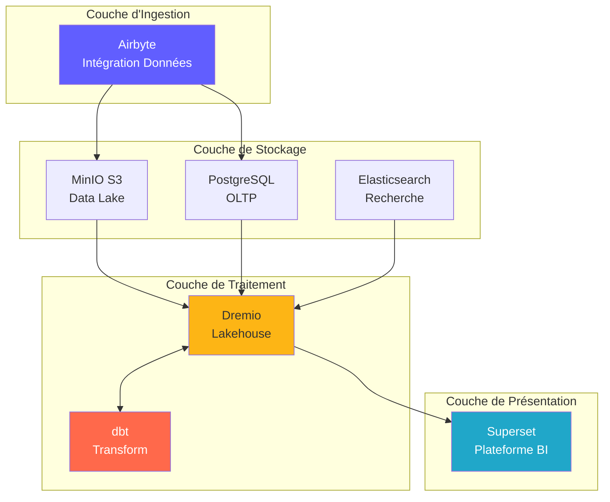
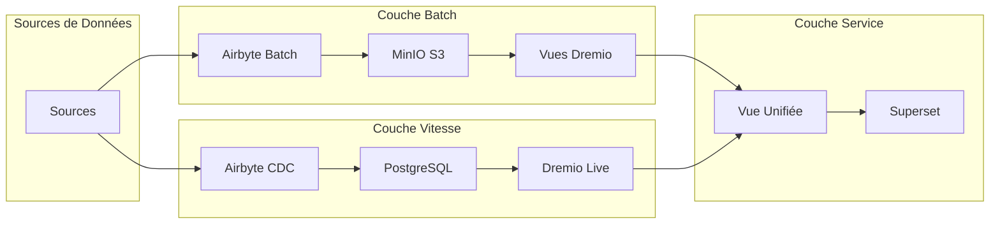
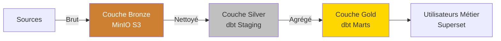
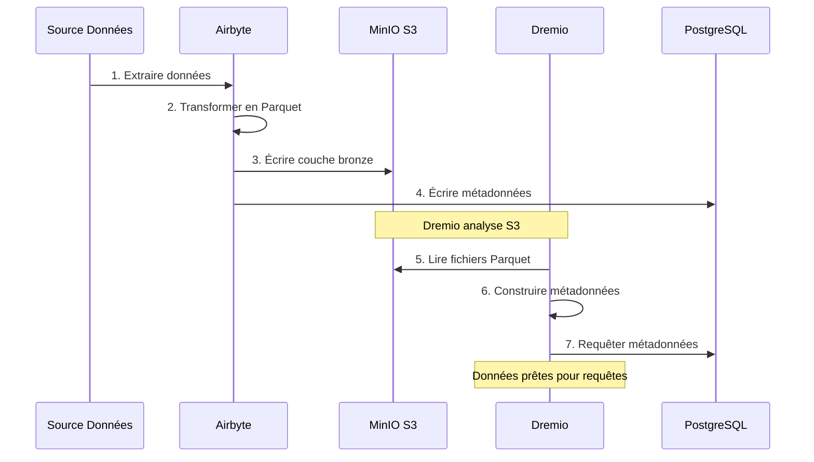
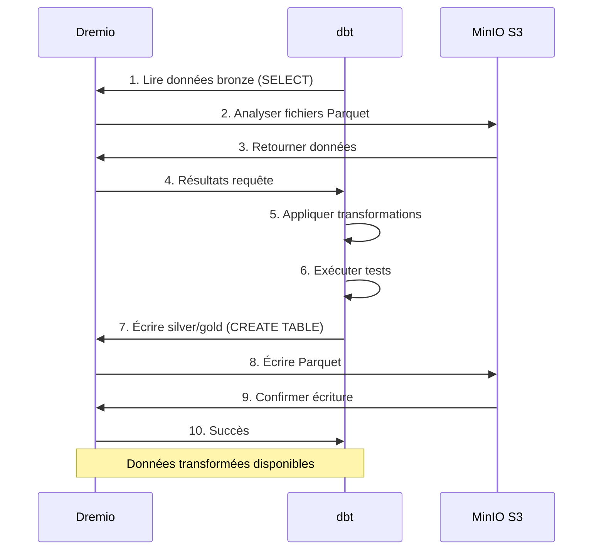
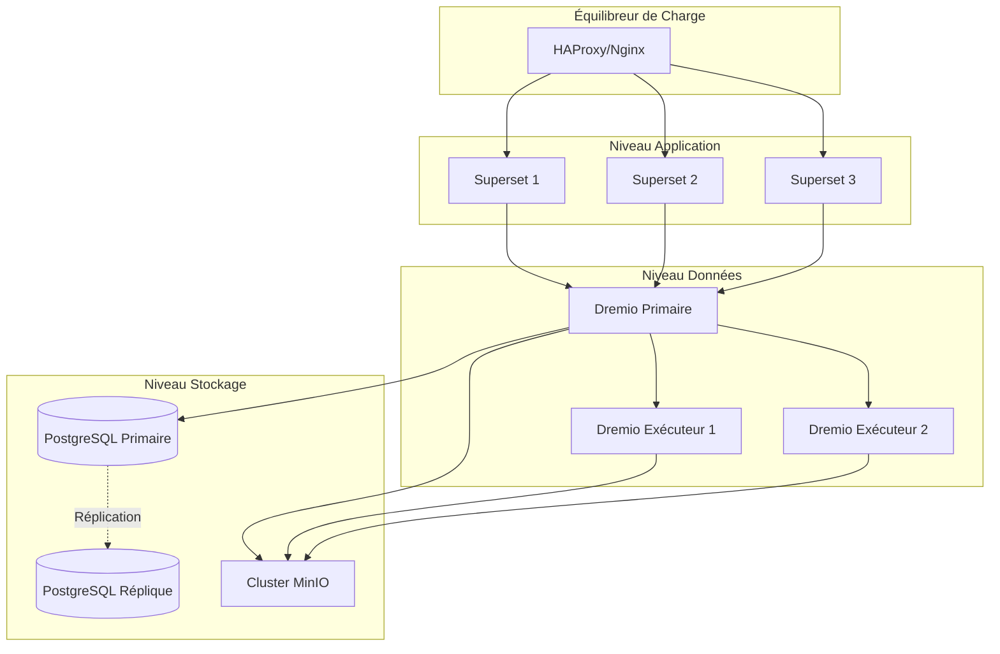
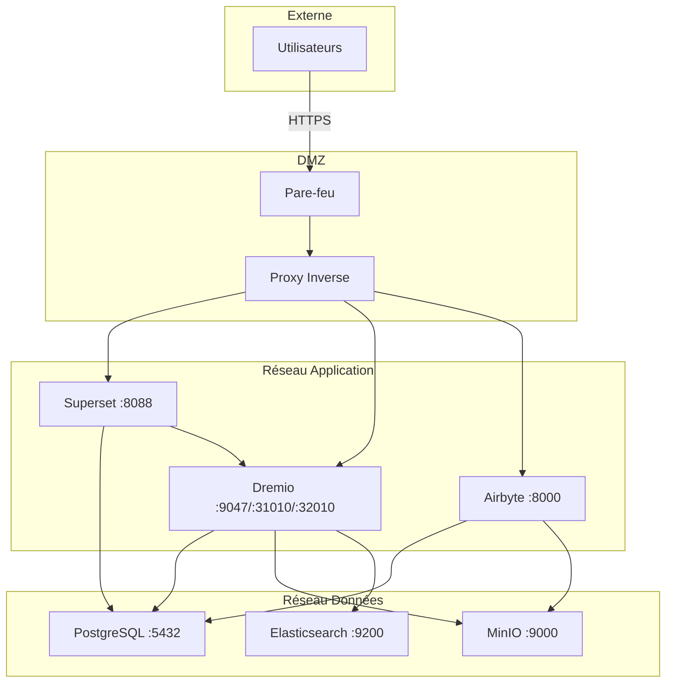
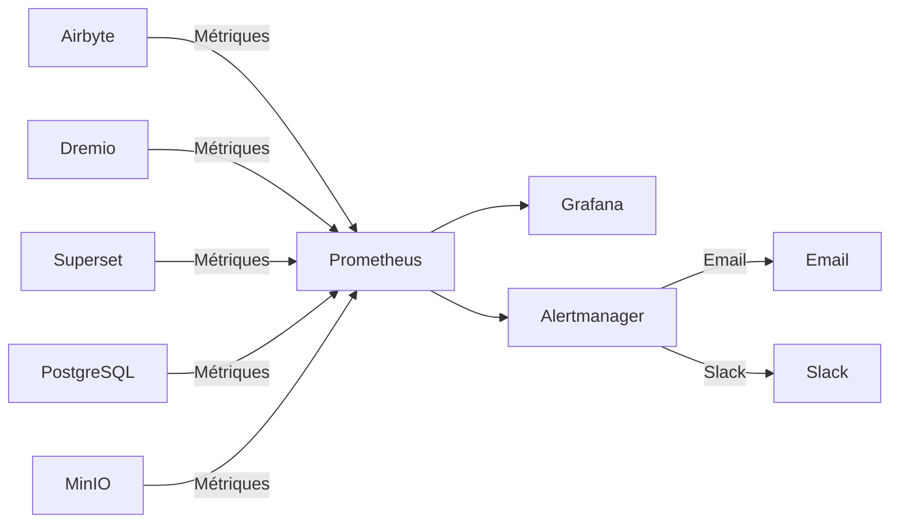

# Panoramica dell'architettura

**Versione**: 3.2.0  
**Ultimo aggiornamento**: 2025-10-16  
**Lingua**: francese

---

## Introduzione

La piattaforma dati è una moderna architettura nativa del cloud costruita su tecnologie open source. Fornisce una soluzione completa per l'acquisizione, l'archiviazione, la trasformazione e la visualizzazione dei dati, progettata per carichi di lavoro analitici su scala aziendale.



---

## Principi di progettazione

### 1. Innanzitutto l'Open Source

**Filosofia**: utilizzare tecnologie open source per evitare vincoli al fornitore e mantenere la flessibilità.

**Vantaggi**:
- Nessun costo di licenza
- Sviluppo comunitario
- Capacità di personalizzazione completa
- Controllo di sicurezza trasparente
- Ampia compatibilità dell'ecosistema

### 2. Architettura a più livelli

**Filosofia**: separare le preoccupazioni in livelli distinti per manutenibilità e scalabilità.

**Livelli**:
```
┌─────────────────────────────────────┐
│     Couche de Présentation          │  Superset (BI & Tableaux de Bord)
├─────────────────────────────────────┤
│     Couche Sémantique               │  Dremio (Moteur de Requête)
├─────────────────────────────────────┤
│     Couche de Transformation        │  dbt (Transformation Données)
├─────────────────────────────────────┤
│     Couche de Stockage              │  MinIO, PostgreSQL, Elasticsearch
├─────────────────────────────────────┤
│     Couche d'Ingestion              │  Airbyte (Intégration Données)
└─────────────────────────────────────┘
```

### 3. ELT anziché ETL

**Filosofia**: caricare prima i dati grezzi, trasformarli in destinazione (ELT).

**Perché ELT?**
- **Flessibilità**: trasforma i dati in più modi senza riestrarli
- **Prestazioni**: utilizza il calcolo della destinazione per le trasformazioni
- **Auditability**: dati grezzi sempre disponibili per la verifica
- **Costo**: riduce il carico di estrazione sui sistemi di origine

**Fluire**:
```
Extract → Load → Transform
(Airbyte) (MinIO/PostgreSQL) (dbt + Dremio)
```

### 4. Modello Data Lakehouse

**Filosofia**: combina la flessibilità del data Lake con le prestazioni del data warehouse.

**Caratteristiche**:
- **Transazioni ACID**: operazioni di dati attendibili
- **Applicazione dello schema**: garanzie sulla qualità dei dati
- **Viaggio nel tempo**: interroga le versioni storiche
- **Formati aperti**: Parquet, Iceberg, Delta Lake
- **Accesso diretto ai file**: nessun blocco proprietario

### 5. Design nativo del cloud

**Filosofia**: progettazione per ambienti containerizzati e distribuiti.

**Implementazione**:
- Contenitori Docker per tutti i servizi
- Scalabilità orizzontale
- Infrastrutture come codice
- Apolidi ove possibile
- Configurazione tramite variabili d'ambiente

---

## Modelli di architettura

### Architettura Lambda (Batch + Stream)



**Livello batch** (dati storici):
- Grandi volumi di dati
- Trattamento periodico (orario/giornaliero)
- Latenza elevata accettabile
- Possibilità di ritrattamento completo

**Livello velocità** (dati in tempo reale):
- Modifica acquisizione dati (CDC)
- È richiesta una bassa latenza
- Solo aggiornamenti incrementali
- Gestisce i dati recenti

**Livello di servizio**:
- Unisce visualizzazioni batch e velocità
- Interfaccia di query singola (Dremio)
- Selezione automatica della vista

### Medaglione dell'architettura (Bronzo → Argento → Oro)



**Strato bronzo** (grezzo):
- Dati così come provengono dalle fonti
- Nessuna trasformazione
- Storia completa conservata
- Airbyte viene caricato qui

**Strato argento** (pulito):
- Qualità dei dati applicata
- Formati standardizzati
- modelli di staging dbt
- Analisi pronta

**Strato d'Oro** (Professione):
- Metriche aggregate
- Logica aziendale applicata
- Modelli di debito di Marte
- Ottimizzato per il consumo

---

## Interazioni tra componenti

### Flusso di acquisizione dei dati



### Pipeline di trasformazione



### Esecuzione di query

§§§CODICE_7§§§

---

## Modelli di scalabilità

### Ridimensionamento orizzontale

**Servizi senza stato** (possono evolversi liberamente):
- Airbyte Workers: evolvi per sincronizzazioni parallele
- Esecutori Dremio: scala per le prestazioni delle query
- Web Superset: evolversi per gli utenti concorrenti

**Servizi con stato** (richiede coordinamento):
- PostgreSQL: replica della replica primaria
- MinIO: modalità distribuita (nodi multipli)
- Elasticsearch: cluster con sharding

### Ridimensionamento verticale

**Intensivo di memoria**:
- Dremio: aumenta l'heap JVM per query di grandi dimensioni
- PostgreSQL: più RAM per il buffer della cache
- Elasticsearch: più heap per l'indicizzazione

**Utilizzo intensivo della CPU**:
- dbt: più nuclei per modelli di costruzione parallela
- Airbyte: trasformazioni dei dati più veloci

### Partizionamento dei dati

```sql
-- Exemple: Partitionner par date
CREATE TABLE orders_partitioned (
    order_id INT,
    customer_id INT,
    amount DECIMAL,
    order_date DATE
)
PARTITION BY (DATE_TRUNC('month', order_date))
STORED AS PARQUET;

-- La requête analyse uniquement les partitions pertinentes
SELECT SUM(amount)
FROM orders_partitioned
WHERE order_date >= '2025-01-01'
  AND order_date < '2025-02-01';
-- Analyse uniquement la partition de janvier
```

---

## Alta disponibilità

### Ridondanza dei servizi



### Scenari di fallimento

| Componente | Ripartizione | Recupero |
|-------|-------|---------|
| **Lavoratore Airbyte** | Incidente del container | Riavvio automatico, riprendi la sincronizzazione |
| **Dremio Esecutore** | Guasto del nodo | Richiesta reindirizzata ad altri esecutori |
| **PostgreSQL** | Primario fuori servizio | Promuovere la replica in primario |
| **Nodo MinIO** | Guasto del disco | La codifica di cancellazione ricostruisce i dati |
| **Superinsieme** | Servizio fuori servizio | Il bilanciatore reindirizza il traffico |

### Strategia di backup

```bash
# Sauvegardes automatisées quotidiennes
0 2 * * * /scripts/backup_all.sh

# backup_all.sh
#!/bin/bash

# Sauvegarder PostgreSQL
pg_dumpall -U postgres > /backups/postgres_$(date +%Y%m%d).sql

# Sauvegarder métadonnées Dremio
tar czf /backups/dremio_$(date +%Y%m%d).tar.gz /opt/dremio/data

# Synchroniser MinIO vers S3 distant
mc mirror MinIOLake/datalake s3-offsite/datalake-backup

# Conserver 30 jours
find /backups -mtime +30 -delete
```

---

## Architettura di sicurezza

### Sicurezza della rete



### Autenticazione e autorizzazione

**Autenticazione del servizio**:
- **Dremio**: integrazione LDAP/AD, OAuth2, SAML
- **Superset**: autenticazione database, LDAP, OAuth2
- **Airbyte**: autenticazione di base, OAuth2 (aziendale)
- **MinIO**: policy IAM, token STS

**Livelli di autorizzazione**:
```yaml
Rôles:
  - Admin:
      - Accès complet à tous les services
      - Gestion utilisateurs
      - Modifications configuration
  
  - Data Engineer:
      - Créer/modifier sources données
      - Exécuter syncs Airbyte
      - Exécuter modèles dbt
      - Créer datasets Dremio
  
  - Analyst:
      - Accès lecture seule données
      - Créer tableaux de bord Superset
      - Requêter datasets Dremio
  
  - Viewer:
      - Voir tableaux de bord uniquement
      - Pas d'accès données
```

### Crittografia dei dati

**A riposo**:
- MinIO: crittografia lato server (AES-256)
- PostgreSQL: crittografia trasparente dei dati (TDE)
- Elasticsearch: indici crittografati

**In transito**:
- TLS 1.3 per tutte le comunicazioni tra servizi
- Volo Freccia con TLS per Dremio ↔ Superset
- HTTPS per interfacce web

---

## Monitoraggio e osservabilità

### Raccolta di metriche



**Metriche chiave**:
- **Airbyte**: percentuale di successo della sincronizzazione, registrazioni sincronizzate, byte trasferiti
- **Dremio**: latenza della richiesta, tasso di successo della cache, utilizzo delle risorse
- **dbt**: tempo di costruzione del modello, fallimenti dei test
- **Superset**: tempo di caricamento della dashboard, utenti attivi
- **Infrastruttura**: CPU, memoria, disco, rete

### Registrazione

**Registrazione centralizzata**:
```yaml
Stack ELK:
  - Elasticsearch: Stocker logs
  - Logstash: Traiter logs
  - Kibana: Visualiser logs

Sources de Logs:
  - Logs application (format JSON)
  - Logs d'accès
  - Logs d'audit
  - Logs d'erreur
```

### Tracciamento

**Tracciamento distribuito**:
- Integrazione Jaeger o Zipkin
- Tracciare le richieste tra i servizi
- Identificare i colli di bottiglia
- Problemi di prestazioni di debug

---

## Topologie di distribuzione

### Ambiente di sviluppo

```yaml
Hôte Unique:
  Ressources: 8 Go RAM, 4 CPUs
  Services: Tous sur une machine
  Stockage: Volumes locaux
  Réseau: Réseau bridge
  Cas d'usage: Développement, tests
```

### Ambiente di gestione temporanea

```yaml
Multi-Hôtes:
  Ressources: 16 Go RAM, 8 CPUs par hôte
  Services: Répartis sur 2-3 hôtes
  Stockage: NFS partagé ou MinIO distribué
  Réseau: Réseau overlay
  Cas d'usage: Tests pré-production, UAT
```

### Ambiente di produzione

```yaml
Cluster Kubernetes:
  Ressources: Auto-scaling selon charge
  Services: Conteneurisés, répliqués
  Stockage: Volumes persistants (SSD)
  Réseau: Service mesh (Istio)
  Haute Disponibilité: Déploiement multi-zones
  Cas d'usage: Charges production
```

---

## Giustificazione delle scelte tecnologiche

### Perché Airbyte?

- **Oltre 300 connettori**: integrazioni predefinite
- **Open source**: nessun vincolo al fornitore
- **Community attiva**: oltre 12.000 stelle GitHub
- **Supporto CDC**: acquisizione dati in tempo reale
- **Standardizzazione**: integrazione dbt integrata

### Perché Dremio?

- **Accelerazione delle query**: query 10-100 volte più veloci
- **Arrow Flight**: trasferimento dati ad alte prestazioni
- **Compatibilità data lake**: nessuno spostamento di dati
- **Self-service**: gli utenti aziendali esplorano i dati
- **Redditivo**: Riduci i costi di magazzino

### Perchè dbt?

- **Basato su SQL**: familiare agli analisti
- **Controllo della versione**: integrazione Git
- **Test**: test integrati sulla qualità dei dati
- **Documentazione**: documenti generati automaticamente
- **Community**: oltre 5.000 pacchetti disponibili

### Perché Superset?

- **Interfaccia utente moderna**: interfaccia intuitiva
- **IDE SQL**: funzionalità di query avanzate
- **Visualizzazioni avanzate**: oltre 50 tipi grafici
- **Estensibile**: plugin personalizzati
- **Open source**: Apache Foundation supportato

### Perché PostgreSQL?

- **Affidabilità**: conformità ACID
- **Prestazioni**: comprovate su larga scala
- **Caratteristiche**: JSON, ricerca full-text, estensioni
- **Comunità**: ecosistema maturo
- **Costo**: gratuito e open source

### Perché MiniIO?

- **Compatibilità S3**: API standard del settore
- **Prestazioni**: Portata elevata
- **Codifica di cancellazione**: durabilità dei dati
- **Multi-cloud**: distribuzione ovunque
- **Conveniente**: alternativa self-hosted

---

## Evoluzione futura dell'architettura

### Miglioramenti pianificati

1. **Catalogo dati** (integrazione OpenMetadata)
   - Gestione dei metadati
   - Monitoraggio del lignaggio
   - Scoperta dei dati

2. **Qualità dei dati** (Grandi aspettative)
   - Convalida automatizzata
   - Rilevamento anomalie
   - Cruscotti di qualità

3. **Operazioni ML** (MLflow)
   - Pipeline di formazione del modello
   - Registro dei modelli
   - Automazione della distribuzione

4. **Elaborazione del flusso** (Apache Flink)
   - Trasformazioni in tempo reale
   - Elaborazione di eventi complessi
   - Analisi dei flussi

5. **Governance dei dati** (Apache Atlas)
   - Applicazione delle politiche
   - Controllo degli accessi
   - Rapporti di conformità

---

## Riferimenti

- [Dettagli componente](components.md)
- [Flusso di dati](data-flow.md)
- [Guida alla distribuzione](deployment.md)
- [Integrazione Airbyte](../guides/airbyte-integration.md)

---

**Versione panoramica dell'architettura**: 3.2.0  
**Ultimo aggiornamento**: 2025-10-16  
**Mantenuto da**: Team della piattaforma dati