# Guida all'integrazione di Airbyte

**Versione**: 3.2.0  
**Ultimo aggiornamento**: 16 ottobre 2025  
**Lingua**: francese

---

## Panoramica

Airbyte è una piattaforma di integrazione dei dati open source che semplifica lo spostamento dei dati da varie fonti alle destinazioni. Questa guida tratta l'integrazione di Airbyte nella piattaforma dati, la configurazione dei connettori e la creazione di pipeline di dati.


---

## Cos'è Airbyte?

### Caratteristiche principali

- **Oltre 300 connettori predefiniti**: API, database, file, applicazioni SaaS
- **Open Source**: self-hosted con controllo completo dei dati
- **Change Data Capture (CDC)**: sincronizzazione dei dati in tempo reale
- **Connettori personalizzati**: crea connettori con Python o CDK a basso codice
- **Normalizzazione dei dati**: trasforma JSON non elaborato in tabelle strutturate
- **Monitoraggio e avvisi**: monitora lo stato di sincronizzazione e la qualità dei dati

### Architettura


---

## Facilità

### Avvio rapido

Airbyte è incluso nella piattaforma. Inizia con:

```bash
# Démarrer services Airbyte
docker-compose -f docker-compose-airbyte.yml up -d

# Vérifier statut
docker-compose -f docker-compose-airbyte.yml ps

# Voir logs
docker-compose -f docker-compose-airbyte.yml logs -f
```

### Servizi avviati

| Servizi | Porto | Descrizione |
|--------|------|-----|
| **airbyte-webapp** | 8000| Interfaccia utente Web |
| **server-airbyte** | 8001| Server API |
| **airbyte-lavoratore** | - | Motore di esecuzione del lavoro |
| **airbyte-temporale** | 7233| Orchestrazione del flusso di lavoro |
| **airbyte-db** | 5432| Database dei metadati (PostgreSQL) |

### Primo accesso

**Interfaccia Web:**
```
http://localhost:8000
```

**Identificatori predefiniti:**
- **E-mail**: `airbyte@example.com`
- **Password**: `password`

**Cambia password** quando accedi per la prima volta per sicurezza.

---

##Configurazione

### Procedura guidata di configurazione

Al primo accesso completare la procedura guidata di configurazione:

1. **Preferenze email**: configura le notifiche
2. **Residenza dei dati**: seleziona la posizione di archiviazione dei dati
3. **Statistiche di utilizzo anonime**: accetta/rifiuta la telemetria

### Impostazioni dell'area di lavoro

Vai a **Impostazioni > Area di lavoro**:

```yaml
Nom Workspace: Production Data Platform
ID Workspace: default
Définition Namespace: Destination Default
Format Namespace: ${SOURCE_NAMESPACE}
```

### Limiti delle risorse

**File**: `config/airbyte/config.yaml`

```yaml
# Allocation ressources par connecteur
resources:
  source:
    cpu_limit: "1.0"
    memory_limit: "1Gi"
    cpu_request: "0.25"
    memory_request: "256Mi"
  
  destination:
    cpu_limit: "1.0"
    memory_limit: "1Gi"
    cpu_request: "0.25"
    memory_request: "256Mi"
  
  orchestrator:
    cpu_limit: "0.5"
    memory_limit: "512Mi"
```

---

## Connettori

### Connettori di origine

#### Fonte PostgreSQL

**Caso d'uso**: estrazione dei dati dal database transazionale

**Configurazione:**

1. Vai a **Fonti > Nuova fonte**
2. Seleziona **PostgreSQL**
3. Configura la connessione:

```yaml
Host: postgres
Port: 5432
Database: source_db
Username: readonly_user
Password: [MOT_DE_PASSE_SÉCURISÉ]
SSL Mode: prefer

Méthode Réplication: Standard
  # Ou CDC pour changements temps réel:
  # Méthode Réplication: Logical Replication (CDC)
```

**Verifica connessione** → **Imposta sorgente**

#### Origine API REST

**Caso d'uso**: estrazione dei dati dalle API

**Configurazione:**

```yaml
Name: External API
URL Base: https://api.example.com/v1
Authentication:
  Type: Bearer Token
  Token: [API_TOKEN]

Endpoints:
  - name: customers
    path: /customers
    http_method: GET
    
  - name: orders
    path: /orders
    http_method: GET
    params:
      start_date: "{{ config['start_date'] }}"
```

#### File di origine (CSV)

**Caso d'uso**: importa file CSV

**Configurazione:**

```yaml
Dataset Name: sales_data
URL: https://storage.example.com/sales.csv
Format: CSV
Provider:
  Storage: HTTPS
  User Provided Storage:
    URL: https://storage.example.com/sales.csv
```

#### Fonti comuni

| Fonte | Casi d'uso | Supporto CDC |
|--------|--------|-----|
| **PostgreSQL** | Fumetti transazionali | ✅ Sì |
| **MySQL** | Fumetti transazionali | ✅ Sì |
| **MongoDB** | Documenti NoSQL | ✅ Sì |
| **ForzaSales** | Dati CRM | ❌No |
| **Fogli Google** | Fogli di calcolo | ❌No |
| **Striscia** | Dati di pagamento | ❌No |
| **API REST** | API personalizzate | ❌No |
| **S3** | Archiviazione file | ❌No |

### Connettori di destinazione

#### Destinazione MinIO S3

**Caso d'uso**: archiviare dati grezzi in data Lake

**Configurazione:**

1. Vai a **Destinazioni > Nuova destinazione**
2. Seleziona **S3**
3. Configura la connessione:

```yaml
S3 Bucket Name: datalake
S3 Bucket Path: airbyte-data/${NAMESPACE}/${STREAM_NAME}
S3 Bucket Region: us-east-1

# Point de terminaison MinIO
S3 Endpoint: http://minio:9000
Access Key ID: [MINIO_ROOT_USER]
Secret Access Key: [MINIO_ROOT_PASSWORD]

Output Format:
  Format Type: Parquet
  Compression: GZIP
  Block Size: 128MB
```

**Verifica connessione** → **Imposta destinazione**

#### Destinazione PostgreSQL

**Caso d'uso**: caricare i dati trasformati per l'analisi

**Configurazione:**

```yaml
Host: postgres
Port: 5432
Database: analytics_db
Username: analytics_user
Password: [MOT_DE_PASSE_SÉCURISÉ]
Default Schema: public

Normalization:
  Mode: Basic
  # Crée tables normalisées depuis JSON imbriqué
```

#### Destinazione Dremio

**Caso d'uso**: caricamento diretto in Data Lakehouse

**Configurazione:**

```yaml
Host: dremio
Port: 32010
Project: Production
Dataset: airbyte_data
Username: dremio_user
Password: [DREMIO_PASSWORD]

Connection Type: Arrow Flight
SSL: false
```

---

## Connessioni

### Crea una connessione

Una connessione collega una sorgente a una destinazione.

```mermaid
sequenceDiagram
    participant S as Source
    participant A as Airbyte
    participant D as Destination
    
    S->>A: 1. Extraire données
    A->>A: 2. Appliquer transformations
    A->>D: 3. Charger données
    D->>D: 4. Normaliser (optionnel)
    A->>A: 5. Mettre à jour état
    
    Note over A: Sync terminée
```



#### Passo dopo passo

1. **Vai a Connessioni > Nuova connessione**

2. **Seleziona sorgente**: scegli la sorgente configurata (es: PostgreSQL)

3. **Seleziona destinazione**: Scegli la destinazione (es: MinIO S3)

4. **Configura la sincronizzazione**:

```yaml
Nom Connexion: PostgreSQL → MinIO
Fréquence Réplication: Every 24 hours
Namespace Destination: Custom
  Format Namespace: production_${SOURCE_NAMESPACE}

Streams:
  - customers
    Mode Sync: Full Refresh | Overwrite
    Champ Curseur: updated_at
    Clé Primaire: customer_id
    
  - orders
    Mode Sync: Incremental | Append
    Champ Curseur: created_at
    Clé Primaire: order_id
    
  - products
    Mode Sync: Full Refresh | Overwrite
    Clé Primaire: product_id
```

5. **Configura la normalizzazione** (facoltativo):

```yaml
Normalization:
  Enable: true
  Option: Basic Normalization
  # Convertit JSON imbriqué en tables plates
```

6. **Verifica connessione** → **Imposta connessione**

### Modalità di sincronizzazione

| Moda | Descrizione | Casi d'uso |
|------|-------------|-----|
| **Aggiornamento completo\| Sovrascrivi** | Sostituisci tutti i dati | Tabelle dimensionali |
| **Aggiornamento completo\| Aggiungi** | Aggiungi tutti i record | Monitoraggio storico |
| **Incrementale\| Aggiungi** | Aggiungi record nuovi/aggiornati | Tabelle dei fatti |
| **Incrementale\| Deduplicato** | Aggiorna i record esistenti | SCD Tipo 1 |

### Pianificazione

**Opzioni di frequenza:**
- **Manuale**: attiva manualmente
- **Ogni ora**: ogni ora
- **Giornaliero**: Ogni 24 ore (specificare l'orario)
- **Settimanale**: giorni specifici della settimana
- **Cron**: Programmazione personalizzata (es: `0 2 * * *`)

**Esempi di orari:**
```yaml
# Toutes les 6 heures
Cron: 0 */6 * * *

# Jours de semaine à 2h du matin
Cron: 0 2 * * 1-5

# Premier jour du mois
Cron: 0 0 1 * *
```

---

## Trasformazione dei dati

### Normalizzazione di base

Airbyte include la **Normalizzazione di base** utilizzando dbt:

**Cosa fa:**
- Converte JSON nidificati in tabelle piatte
- Crea tabelle `_airbyte_raw_*` (JSON grezzo)
- Crea tabelle standardizzate (strutturate).
- Aggiungi colonne di metadati (`_airbyte_emitted_at`, `_airbyte_normalized_at`)

**Esempio:**

**JSON non elaborato** (`_airbyte_raw_customers`):
```json
{
  "_airbyte_ab_id": "uuid-123",
  "_airbyte_emitted_at": "2025-10-16T10:00:00Z",
  "_airbyte_data": {
    "id": 1,
    "name": "Acme Corp",
    "contact": {
      "email": "info@acme.com",
      "phone": "+1234567890"
    },
    "addresses": [
      {"type": "billing", "city": "New York"},
      {"type": "shipping", "city": "Boston"}
    ]
  }
}
```

**Tabelle standardizzate:**

`customers`:
```sql
id | name | contact_email | contact_phone | _airbyte_normalized_at
1 | Acme Corp | info@acme.com | +1234567890 | 2025-10-16 10:05:00
```

§§§CODICE_27§§§:
```sql
_airbyte_customers_hashid | type | city
hash-123 | billing | New York
hash-123 | shipping | Boston
```

### Trasformazioni personalizzate (dbt)

Per trasformazioni avanzate, utilizzare dbt:

1. **Disabilita la normalizzazione di Airbyte**
2. **Crea modelli dbt** facendo riferimento alle tabelle `_airbyte_raw_*`
3. **Esegui dbt** dopo la sincronizzazione di Airbyte

**Esempio di modello dbt:**
```sql
-- models/staging/stg_customers.sql
with source as (
    select * from {{ source('airbyte_raw', '_airbyte_raw_customers') }}
),

parsed as (
    select
        _airbyte_ab_id,
        _airbyte_emitted_at,
        (_airbyte_data->>'id')::int as customer_id,
        _airbyte_data->>'name' as customer_name,
        _airbyte_data->'contact'->>'email' as email,
        _airbyte_data->'contact'->>'phone' as phone
    from source
)

select * from parsed
```

---

## Monitoraggio

### Stato della sincronizzazione

**Interfaccia Web del dashboard:**
- **Connessioni**: vedi tutte le connessioni
- **Cronologia sincronizzazione**: processi di sincronizzazione passati
- **Sincronizza registri**: registri dettagliati per lavoro

**Indicatori di stato:**
- 🟢 **Riuscito**: sincronizzazione completata con successo
- 🔴 **Non riuscita**: sincronizzazione non riuscita (controlla i registri)
- 🟡 **In esecuzione**: sincronizzazione in corso
- ⚪ **Annullato**: sincronizzazione annullata dall'utente

### Registri

**Visualizza i log di sincronizzazione:**
```bash
# Logs serveur Airbyte
docker-compose -f docker-compose-airbyte.yml logs airbyte-server

# Logs worker (exécution sync réelle)
docker-compose -f docker-compose-airbyte.yml logs airbyte-worker

# Logs job spécifique
# Disponible dans Interface Web: Connections > [Connection] > Job History > [Job]
```

### Metriche

**Metriche chiave da monitorare:**
- **Registrazioni sincronizzate**: numero di registrazioni per sincronizzazione
- **Byte sincronizzati**: volume di dati trasferiti
- **Durata sincronizzazione**: tempo impiegato per sincronizzazione
- **Tasso di fallimento**: percentuale di sincronizzazioni fallite

**Metriche di esportazione:**
```bash
# API Airbyte
curl -X GET "http://localhost:8001/api/v1/jobs/list" \
  -H "Content-Type: application/json" \
  -d '{
    "configTypes": ["sync"],
    "configId": "connection-id"
  }'
```

### Avvisi

**Configura avvisi** in **Impostazioni > Notifiche**:

```yaml
Type Notification: Slack
URL Webhook: https://hooks.slack.com/services/VOTRE/WEBHOOK/URL

Événements:
  - Échec Sync
  - Succès Sync (optionnel)
  - Connexion Désactivée

Conditions:
  - Seuil échec: 3 échecs consécutifs
```

---

## Utilizzo dell'API

### Autenticazione

```bash
# Pas d'authentification requise pour localhost
# Pour production, configurez auth dans docker-compose-airbyte.yml
```

### Chiamate API comuni

#### Elenca le fonti

```bash
curl -X POST "http://localhost:8001/api/v1/sources/list" \
  -H "Content-Type: application/json" \
  -d '{
    "workspaceId": "workspace-id"
  }'
```

#### Crea connessione

```bash
curl -X POST "http://localhost:8001/api/v1/connections/create" \
  -H "Content-Type: application/json" \
  -d '{
    "sourceId": "source-id",
    "destinationId": "destination-id",
    "syncCatalog": {
      "streams": [
        {
          "stream": {
            "name": "customers",
            "jsonSchema": {...}
          },
          "config": {
            "syncMode": "incremental",
            "destinationSyncMode": "append",
            "cursorField": ["updated_at"]
          }
        }
      ]
    },
    "schedule": {
      "units": 24,
      "timeUnit": "hours"
    }
  }'
```

#### Attiva la sincronizzazione

```bash
curl -X POST "http://localhost:8001/api/v1/connections/sync" \
  -H "Content-Type: application/json" \
  -d '{
    "connectionId": "connection-id"
  }'
```

#### Ottieni lo stato del lavoro

```bash
curl -X POST "http://localhost:8001/api/v1/jobs/get" \
  -H "Content-Type: application/json" \
  -d '{
    "id": "job-id"
  }'
```

---

## Integrazione con Dremio

### Flusso di lavoro

```mermaid
sequenceDiagram
    participant Src as Source Données
    participant Ab as Airbyte
    participant S3 as MinIO S3
    participant Dr as Dremio
    participant Dbt as dbt
    
    Src->>Ab: 1. Extraire données
    Ab->>S3: 2. Charger vers S3 (Parquet)
    S3->>Dr: 3. Dremio lit S3
    Dr->>Dbt: 4. dbt transforme
    Dbt->>Dr: 5. Écrire résultats
    Dr->>Dr: 6. Couche requête prête
```



### Passaggi di configurazione

1. **Configura Airbyte per la ricarica su MinIO S3** (vedi sopra)

2. **Aggiungi sorgente S3 in Dremio:**

```sql
-- Dans Interface Dremio: Sources > Add Source > S3
Nom Source: AirbyteData
Authentication: AWS Access Key
Clé Accès: [MINIO_ROOT_USER]
Clé Secrète: [MINIO_ROOT_PASSWORD]
Chemin Racine: /
Propriétés Connexion:
  fs.s3a.endpoint: minio:9000
  fs.s3a.path.style.access: true
  dremio.s3.compat: true
```

3. **Esegui query sui dati Airbyte in Dremio:**

```sql
-- Parcourir structure S3
SELECT * FROM AirbyteData.datalake."airbyte-data"

-- Requête table spécifique
SELECT *
FROM AirbyteData.datalake."airbyte-data".production_public.customers
LIMIT 100
```

4. **Crea set di dati virtuali Dremio:**

```sql
CREATE VDS airbyte_customers AS
SELECT
  id as customer_id,
  name as customer_name,
  contact_email as email,
  contact_phone as phone,
  _airbyte_emitted_at as last_updated
FROM AirbyteData.datalake."airbyte-data".production_public.customers
```

5. **Utilizzo nei modelli dbt:**

```yaml
# dbt/models/sources.yml
sources:
  - name: airbyte
    schema: AirbyteData.datalake."airbyte-data".production_public
    tables:
      - name: customers
      - name: orders
      - name: products
```

---

## Migliori pratiche

### Prestazione

1. **Utilizzare sincronizzazioni incrementali** quando possibile
2. **Sincronizza la pianificazione durante le ore non di punta**
3. **Utilizza il formato Parquet** per una migliore compressione
4. **Partizionare tabelle di grandi dimensioni** per data
5. **Monitora l'utilizzo delle risorse** e modifica i limiti

### Qualità dei dati

1. **Abilita la convalida dei dati** nei connettori di origine
2. **Utilizza le chiavi primarie** per rilevare i duplicati
3. **Configura avvisi** per errori di sincronizzazione
4. Metriche di **Monitoraggio dell'aggiornamento dei dati**
5. **Implementare test dbt** sui dati grezzi

### Sicurezza

1. **Utilizza identificatori di sola lettura** per le fonti
2. **Memorizza i segreti** nelle variabili di ambiente
3. **Abilita SSL/TLS** per le connessioni
4. **Rinnova i tuoi identificatori** regolarmente
5. **Controllare i registri di accesso** periodicamente

### Ottimizzazione dei costi

1. **Utilizza la compressione** (GZIP, SNAPPY)
2. **Deduplica i dati** all'origine
3. **Archivia i vecchi dati** nella cella frigorifera
4. **Monitora la frequenza di sincronizzazione** rispetto ai requisiti
5. **Pulisci i dati di sincronizzazione non riuscita**

---

## Risoluzione dei problemi

### Problemi comuni

#### Errore di sincronizzazione: timeout della connessione

**Sintomo:**
```
Failed to connect to source: Connection timeout
```

**Soluzione:**
```bash
# Vérifier connectivité réseau
docker exec airbyte-worker ping postgres

# Vérifier règles pare-feu
# Vérifier hôte/port source dans configuration
```

#### Errore di memoria esaurita

**Sintomo:**
```
OOMKilled: Container exceeded memory limit
```

**Soluzione:**
```yaml
# Augmenter limites mémoire dans docker-compose-airbyte.yml
services:
  airbyte-worker:
    environment:
      - JOB_MAIN_CONTAINER_MEMORY_LIMIT=2Gi
      - JOB_MAIN_CONTAINER_MEMORY_REQUEST=1Gi
```

#### Normalizzazione non riuscita

**Sintomo:**
```
Normalization failed: dbt compilation error
```

**Soluzione:**
```bash
# Vérifier logs dbt
docker-compose -f docker-compose-airbyte.yml logs airbyte-worker | grep dbt

# Désactiver normalisation et utiliser dbt personnalisé
# Meilleur contrôle sur logique transformation
```

#### Prestazioni di sincronizzazione lente

**Diagnosi:**
```bash
# Vérifier logs sync pour goulot d'étranglement
# Causes courantes:
# - Grand volume données
# - Requête source lente
# - Latence réseau
# - Ressources insuffisantes
```

**Soluzioni:**
- Aumenta la frequenza di sincronizzazione incrementale
- Aggiungi indice ai campi cursore
- Utilizzare CDC per fonti in tempo reale
- Ridimensionare le risorse dei lavoratori

---

## Argomenti avanzati

### Connettori personalizzati

Crea connettori personalizzati con Airbyte CDK:

```bash
# Cloner modèle connecteur
git clone https://github.com/airbytehq/airbyte.git
cd airbyte/airbyte-integrations/connector-templates/python

# Créer nouveau connecteur
./create_connector.sh MyCustomAPI

# Implémenter logique connecteur
# Éditer source.py, spec.yaml, schemas/

# Tester localement
python main.py check --config secrets/config.json
python main.py discover --config secrets/config.json
python main.py read --config secrets/config.json --catalog integration_tests/configured_catalog.json
```

### Orchestrazione API

Automatizza Airbyte con Python:

```python
import requests

AIRBYTE_API = "http://localhost:8001/api/v1"

def trigger_sync(connection_id: str):
    """Déclencher sync manuelle pour connexion"""
    response = requests.post(
        f"{AIRBYTE_API}/connections/sync",
        json={"connectionId": connection_id}
    )
    return response.json()

def get_sync_status(job_id: str):
    """Vérifier statut job sync"""
    response = requests.post(
        f"{AIRBYTE_API}/jobs/get",
        json={"id": job_id}
    )
    return response.json()

# Utilisation
job = trigger_sync("my-connection-id")
status = get_sync_status(job["job"]["id"])
print(f"Statut sync: {status['job']['status']}")
```

---

## Risorse

### Documentazione

- **Documenti Airbyte**: https://docs.airbyte.com
- **Catalogo connettori**: https://docs.airbyte.com/integrations
- **Riferimento API**: https://airbyte-public-api-docs.s3.us-east-2.amazonaws.com/rapidoc-api-docs.html

### Comunità

- **Slack**: https://slack.airbyte.io
- **GitHub**: https://github.com/airbytehq/airbyte
- **Forum**: https://discuss.airbyte.io

---

## Passaggi successivi

Dopo aver configurato Airbyte:

1. **Configura Dremio** - [Guida all'installazione di Dremio](dremio-setup.md)
2. **Crea modelli dbt** - [Guida allo sviluppo di dbt](dbt-development.md)
3. **Crea dashboard** - [Guida Superset Dashboards](superset-dashboards.md)
4. **Qualità del monitoraggio** - [Guida alla qualità dei dati](data-quality.md)

---

**Versione della guida all'integrazione di Airbyte**: 3.2.0  
**Ultimo aggiornamento**: 16 ottobre 2025  
**Mantenuto da**: Team della piattaforma dati