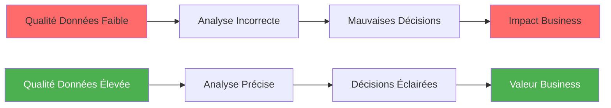
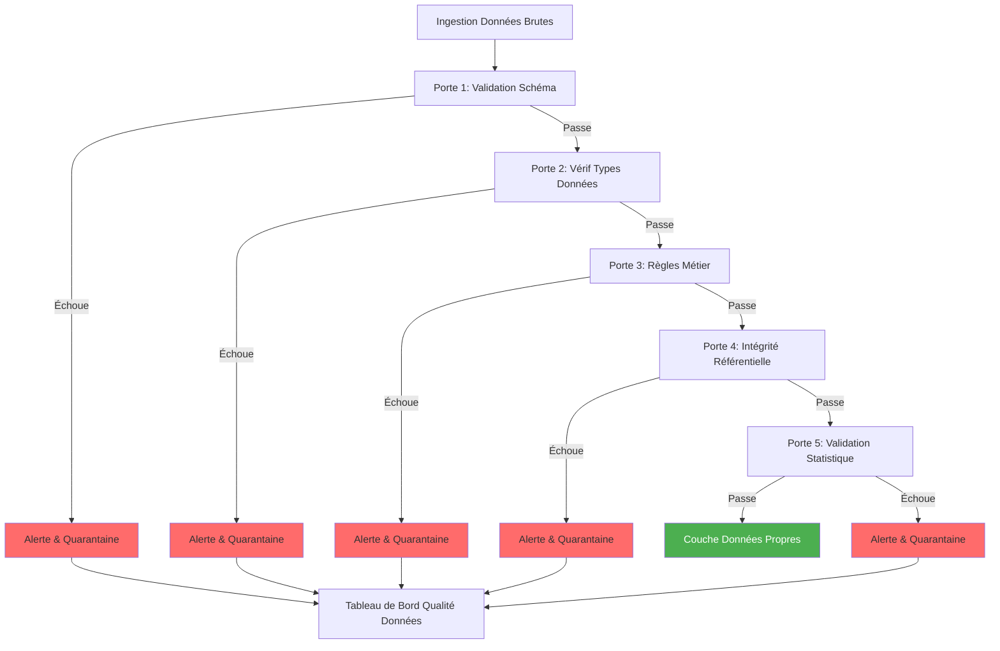

# Guida alla qualità dei dati

**Versione**: 3.2.0  
**Ultimo aggiornamento**: 16 ottobre 2025  
**Lingua**: francese

## Sommario

1. [Panoramica](#panoramica)
2. [Quadro per la qualità dei dati](#quadro-qualità-dei-dati)
3. [test dbt](#test-dbt)
4. [Integrazione delle grandi aspettative](#integrazione-delle-grandi-aspettative)
5. [Regole di convalida dei dati](#regole-di-validazione-dati)
6. [Monitoraggio e avvisi](#monitoraggio-e-avvisi)
7. [Metriche sulla qualità dei dati](#data-quality-metrics)
8. [Strategie di riparazione](#strategie-di riparazione)
9. [Buone pratiche](#buone-pratiche)
10. [Casi di studio](#casi di studio)

---

## Panoramica

La qualità dei dati è essenziale per un’analisi e un processo decisionale affidabili. Questa guida illustra strategie complete per garantire, monitorare e migliorare la qualità dei dati sull'intera piattaforma.

### Perché la qualità dei dati è importante



### Dimensioni Dati di qualità

| Dimensioni | Descrizione | Esempio di verifica |
|----------|-------------|----------------------|
| **Precisione** | I dati rappresentano correttamente la realtà | Convalida del formato email |
| **Completezza** | Nessun valore mancante richiesto | NOT NULL controlla |
| **Coerenza** | Corrispondenze dei dati tra sistemi | Principali relazioni estere |
| **Novità** | Dati aggiornati e disponibili quando necessario | Controlli di freschezza |
| **Validità** | Dati conformi alle regole aziendali | Controlli dell'intervallo di valori |
| **Unicità** | Nessun record duplicato | Unicità della chiave primaria |

---

## Quadro per la qualità dei dati

### Qualità delle Porte per l'Architettura



### Pannolini di qualità

```
Couche Bronze (Brute)
├── Validation schéma uniquement
└── Toutes données acceptées

Couche Silver (Nettoyée)
├── Validation type données
├── Standardisation format
├── Gestion null
└── Suppression doublons

Couche Gold (Curée)
├── Validation règles métier
├── Intégrité référentielle
├── Validation métriques
└── Scoring qualité
```

---

## test dbt

### Test integrati

#### Test generici

```yaml
# models/staging/schema.yml
version: 2

models:
  - name: stg_customers
    description: Données clients nettoyées
    columns:
      - name: customer_id
        description: Clé primaire
        tests:
          - unique:
              config:
                severity: error
                error_if: ">= 1"
          - not_null:
              config:
                severity: error
                
      - name: email
        description: Adresse email client
        tests:
          - not_null
          - unique
          - dbt_utils.expression_is_true:
              expression: "LIKE '%@%.%'"
              config:
                severity: warn
                
      - name: state
        description: Code état US
        tests:
          - accepted_values:
              values: ['AL', 'AK', 'AZ', 'AR', 'CA', 'CO', 'CT', 'DE', 'FL', 'GA',
                       'HI', 'ID', 'IL', 'IN', 'IA', 'KS', 'KY', 'LA', 'ME', 'MD',
                       'MA', 'MI', 'MN', 'MS', 'MO', 'MT', 'NE', 'NV', 'NH', 'NJ',
                       'NM', 'NY', 'NC', 'ND', 'OH', 'OK', 'OR', 'PA', 'RI', 'SC',
                       'SD', 'TN', 'TX', 'UT', 'VT', 'VA', 'WA', 'WV', 'WI', 'WY']
              quote: true
              config:
                severity: warn
                
      - name: created_at
        description: Horodatage création compte
        tests:
          - not_null
          - dbt_utils.expression_is_true:
              expression: ">= '2020-01-01'"
              config:
                severity: error
          - dbt_utils.expression_is_true:
              expression: "<= CURRENT_TIMESTAMP"
              config:
                severity: error
                
      - name: lifetime_value
        description: Dépenses totales client
        tests:
          - dbt_utils.expression_is_true:
              expression: ">= 0"
              config:
                severity: error
```

#### Test di relazione

```yaml
# models/staging/schema.yml
models:
  - name: stg_orders
    columns:
      - name: customer_id
        tests:
          - relationships:
              to: ref('stg_customers')
              field: customer_id
              config:
                severity: error
                error_if: ">= 1"
                warn_if: ">= 0"
```

### Test personalizzati

#### Test singolari

```sql
-- tests/assert_positive_revenue.sql
-- Test que revenu quotidien est toujours positif

SELECT
    revenue_date,
    total_revenue
FROM {{ ref('mart_daily_revenue') }}
WHERE total_revenue < 0
```

```sql
-- tests/assert_order_amount_consistency.sql
-- Test que total commande correspond à somme composants

SELECT
    order_id,
    amount,
    tax,
    shipping,
    total_amount,
    (amount + tax + shipping) AS calculated_total
FROM {{ ref('fct_orders') }}
WHERE ABS(total_amount - (amount + tax + shipping)) > 0.01
```

§§§CODICE_7§§§

#### Macro di test generiche

```sql
-- macros/tests/test_valid_email.sql


WITH validation AS (
    SELECT
        {{ column_name }} AS email
    FROM {{ model }}
    WHERE {{ column_name }} IS NOT NULL
)

SELECT email
FROM validation
WHERE email NOT LIKE '%@%.%'
   OR email LIKE '%..%'
   OR email LIKE '@%'
   OR email LIKE '%@'
   OR LENGTH(email) < 5
   OR LENGTH(email) > 254


```

```sql
-- macros/tests/test_within_range.sql


SELECT *
FROM {{ model }}
WHERE {{ column_name }} < {{ min_value }}
   OR {{ column_name }} > {{ max_value }}


```

```sql
-- macros/tests/test_no_gaps_in_sequence.sql


WITH numbered AS (
    SELECT
        {{ column_name }},
        ROW_NUMBER() OVER (
            
            PARTITION BY {{ partition_by }}
            
            ORDER BY {{ column_name }}
        ) AS row_num
    FROM {{ model }}
),

gaps AS (
    SELECT
        {{ column_name }},
        {{ column_name }} - row_num AS gap_check
    FROM numbered
    GROUP BY {{ column_name }}, gap_check
    HAVING COUNT(*) > 1
)

SELECT * FROM gaps


```

Utilizzo:
```yaml
# models/schema.yml
columns:
  - name: email
    tests:
      - valid_email
      
  - name: age
    tests:
      - within_range:
          min_value: 18
          max_value: 120
          
  - name: order_sequence
    tests:
      - no_gaps_in_sequence:
          partition_by: customer_id
```

### Esecuzione del test

```bash
# Exécuter tous les tests
dbt test

# Exécuter tests pour modèle spécifique
dbt test --select stg_customers

# Exécuter uniquement tests schéma
dbt test --select test_type:schema

# Exécuter uniquement tests données
dbt test --select test_type:data

# Exécuter tests avec sévérité spécifique
dbt test --select test_type:schema,config.severity:error

# Exécuter tests et stocker échecs
dbt test --store-failures

# Exécuter tests en mode arrêt rapide
dbt test --fail-fast
```

### Prova la configurazione

```yaml
# dbt_project.yml
tests:
  +store_failures: true
  +schema: dbt_test_failures
  
  data_quality:
    +severity: error
    +error_if: ">= 1"
    +warn_if: ">= 0"
```

---

## Integrazione di grandi aspettative

### Facilità

```bash
# Installer Great Expectations
pip install great-expectations

# Installer adaptateur dbt-Great Expectations
pip install dbt-expectations
```

### Impostare

```yaml
# packages.yml
packages:
  - package: calogica/dbt_expectations
    version: 0.10.1
```

Installa pacchetti:
```bash
dbt deps
```

### Verifica le aspettative

```yaml
# models/staging/schema.yml
models:
  - name: stg_customers
    tests:
      # Expectations nombre lignes
      - dbt_expectations.expect_table_row_count_to_be_between:
          min_value: 1000
          max_value: 1000000
          
      # Expectations colonnes
      - dbt_expectations.expect_table_column_count_to_equal:
          value: 12
          
    columns:
      - name: email
        tests:
          # Expectations valeurs
          - dbt_expectations.expect_column_values_to_match_regex:
              regex: '^[a-zA-Z0-9_.+-]+@[a-zA-Z0-9-]+\.[a-zA-Z0-9-.]+$'
              
          - dbt_expectations.expect_column_values_to_not_be_null:
              row_condition: "customer_status = 'Active'"
              
      - name: lifetime_value
        tests:
          # Expectations numériques
          - dbt_expectations.expect_column_values_to_be_between:
              min_value: 0
              max_value: 1000000
              strictly: false
              
          - dbt_expectations.expect_column_mean_to_be_between:
              min_value: 100
              max_value: 5000
              
          - dbt_expectations.expect_column_quantile_values_to_be_between:
              quantile: 0.95
              min_value: 1000
              max_value: 50000
              
      - name: state
        tests:
          # Expectations catégorielles
          - dbt_expectations.expect_column_distinct_count_to_equal:
              value: 50
              
          - dbt_expectations.expect_column_proportion_of_unique_values_to_be_between:
              min_value: 0.01
              max_value: 0.1
              
      - name: order_count
        tests:
          # Expectations statistiques
          - dbt_expectations.expect_column_stdev_to_be_between:
              min_value: 0
              max_value: 100
              
  - name: stg_orders
    columns:
      - name: order_date
        tests:
          # Expectations dates
          - dbt_expectations.expect_column_values_to_be_between:
              min_value: "'2020-01-01'"
              max_value: "CURRENT_DATE"
              parse_strings_as_datetimes: true
              
          - dbt_expectations.expect_column_values_to_be_increasing:
              sort_column: created_at
              
      - name: amount
        tests:
          # Expectations multi-colonnes
          - dbt_expectations.expect_multicolumn_sum_to_equal:
              column_list: ["amount", "tax", "shipping"]
              sum_total: total_amount
              tolerance: 0.01
```

### Aspettative personalizzate

```sql
-- macros/custom_expectations/expect_column_values_to_be_on_weekend.sql


SELECT *
FROM {{ model }}
WHERE EXTRACT(DOW FROM {{ column_name }}) NOT IN (0, 6)  -- 0=Dimanche, 6=Samedi


```

---

## Regole di convalida dei dati

### Convalida della logica aziendale

```sql
-- models/staging/stg_orders_with_validation.sql
{{
    config(
        materialized='view',
        tags=['staging', 'validated']
    )
}}

WITH source AS (
    SELECT * FROM {{ source('bronze', 'raw_orders') }}
),

validated AS (
    SELECT
        *,
        -- Drapeaux validation
        CASE WHEN order_id IS NULL THEN 1 ELSE 0 END AS missing_order_id,
        CASE WHEN customer_id IS NULL THEN 1 ELSE 0 END AS missing_customer_id,
        CASE WHEN order_date IS NULL THEN 1 ELSE 0 END AS missing_order_date,
        CASE WHEN amount < 0 THEN 1 ELSE 0 END AS negative_amount,
        CASE WHEN order_date > CURRENT_DATE THEN 1 ELSE 0 END AS future_order_date,
        CASE WHEN ABS(total_amount - (amount + tax + shipping)) > 0.01 THEN 1 ELSE 0 END AS amount_mismatch,
        
        -- Score qualité global (0-100)
        100 - (
            (CASE WHEN order_id IS NULL THEN 20 ELSE 0 END) +
            (CASE WHEN customer_id IS NULL THEN 20 ELSE 0 END) +
            (CASE WHEN order_date IS NULL THEN 15 ELSE 0 END) +
            (CASE WHEN amount < 0 THEN 15 ELSE 0 END) +
            (CASE WHEN order_date > CURRENT_DATE THEN 15 ELSE 0 END) +
            (CASE WHEN ABS(total_amount - (amount + tax + shipping)) > 0.01 THEN 15 ELSE 0 END)
        ) AS quality_score
        
    FROM source
),

final AS (
    SELECT
        *,
        CASE 
            WHEN quality_score >= 90 THEN 'Excellent'
            WHEN quality_score >= 70 THEN 'Good'
            WHEN quality_score >= 50 THEN 'Fair'
            ELSE 'Poor'
        END AS quality_grade
    FROM validated
)

SELECT * FROM final
```

### Tabella di monitoraggio della qualità dei dati

```sql
-- models/monitoring/data_quality_summary.sql
{{
    config(
        materialized='table',
        tags=['monitoring', 'data_quality']
    )
}}

WITH order_quality AS (
    SELECT
        'orders' AS table_name,
        COUNT(*) AS total_records,
        SUM(missing_order_id) AS missing_ids,
        SUM(negative_amount) AS negative_values,
        SUM(future_order_date) AS future_dates,
        SUM(amount_mismatch) AS calculation_errors,
        AVG(quality_score) AS avg_quality_score,
        CURRENT_TIMESTAMP AS checked_at
    FROM {{ ref('stg_orders_with_validation') }}
),

customer_quality AS (
    SELECT
        'customers' AS table_name,
        COUNT(*) AS total_records,
        SUM(CASE WHEN email IS NULL THEN 1 ELSE 0 END) AS missing_emails,
        SUM(CASE WHEN email NOT LIKE '%@%.%' THEN 1 ELSE 0 END) AS invalid_emails,
        SUM(CASE WHEN state NOT IN (SELECT state_code FROM ref('dim_states')) THEN 1 ELSE 0 END) AS invalid_states,
        0 AS calculation_errors,
        100 * (1 - (
            SUM(CASE WHEN email IS NULL THEN 1 ELSE 0 END) +
            SUM(CASE WHEN email NOT LIKE '%@%.%' THEN 1 ELSE 0 END)
        ) / NULLIF(COUNT(*), 0)) AS avg_quality_score,
        CURRENT_TIMESTAMP AS checked_at
    FROM {{ ref('stg_customers') }}
),

combined AS (
    SELECT * FROM order_quality
    UNION ALL
    SELECT 
        table_name,
        total_records,
        missing_emails AS missing_ids,
        invalid_emails AS negative_values,
        invalid_states AS future_dates,
        calculation_errors,
        avg_quality_score,
        checked_at
    FROM customer_quality
)

SELECT * FROM combined
```

---

## Monitoraggio e avvisi

### Pannello delle metriche di qualità

```sql
-- models/monitoring/daily_quality_metrics.sql
WITH daily_summary AS (
    SELECT
        DATE_TRUNC('day', checked_at) AS check_date,
        table_name,
        AVG(avg_quality_score) AS daily_quality_score,
        SUM(total_records) AS daily_record_count,
        SUM(missing_ids + negative_values + future_dates + calculation_errors) AS daily_error_count
    FROM {{ ref('data_quality_summary') }}
    WHERE checked_at >= CURRENT_DATE - INTERVAL '30' DAY
    GROUP BY DATE_TRUNC('day', checked_at), table_name
)

SELECT
    check_date,
    table_name,
    daily_quality_score,
    daily_record_count,
    daily_error_count,
    daily_error_count * 100.0 / NULLIF(daily_record_count, 0) AS error_rate_pct
FROM daily_summary
ORDER BY check_date DESC, table_name
```

### Avvisi automatizzati

```python
# scripts/data_quality_alerts.py
import smtplib
from email.mime.text import MIMEText
from email.mime.multipart import MIMEMultipart

def check_data_quality_thresholds(connection):
    """Vérifier métriques qualité données et envoyer alertes"""
    
    query = """
    SELECT 
        table_name,
        avg_quality_score,
        total_records,
        (missing_ids + negative_values + future_dates + calculation_errors) AS total_errors
    FROM data_quality_summary
    WHERE checked_at >= CURRENT_DATE
    """
    
    results = connection.execute(query).fetchall()
    
    alerts = []
    for row in results:
        table_name, score, records, errors = row
        
        # Alerter si score qualité chute sous 80%
        if score < 80:
            alerts.append({
                'severity': 'HIGH',
                'table': table_name,
                'score': score,
                'message': f"Score qualité chuté à {score:.1f}%"
            })
        
        # Alerter si taux erreur > 5%
        error_rate = (errors / records * 100) if records > 0 else 0
        if error_rate > 5:
            alerts.append({
                'severity': 'MEDIUM',
                'table': table_name,
                'error_rate': error_rate,
                'message': f"Taux erreur augmenté à {error_rate:.1f}%"
            })
    
    if alerts:
        send_alert_email(alerts)
    
    return alerts

def send_alert_email(alerts):
    """Envoyer notification email pour problèmes qualité"""
    
    msg = MIMEMultipart()
    msg['From'] = 'data-quality@company.com'
    msg['To'] = 'data-team@company.com'
    msg['Subject'] = f'Alerte Qualité Données - {len(alerts)} Problèmes Détectés'
    
    body = "Problèmes Qualité Données Détectés:\n\n"
    for alert in alerts:
        body += f"[{alert['severity']}] {alert['table']}: {alert['message']}\n"
    
    msg.attach(MIMEText(body, 'plain'))
    
    server = smtplib.SMTP('smtp.company.com', 587)
    server.starttls()
    server.login('alerts@company.com', 'password')
    server.send_message(msg)
    server.quit()
```

### Controlli sulla qualità dei dati del flusso d'aria

```python
# dags/data_quality_checks_dag.py
from airflow import DAG
from airflow.operators.python import PythonOperator
from airflow.providers.common.sql.operators.sql import SQLCheckOperator
from datetime import datetime, timedelta

default_args = {
    'owner': 'data-quality-team',
    'depends_on_past': False,
    'start_date': datetime(2025, 10, 1),
    'email_on_failure': True,
    'email': ['data-team@company.com'],
    'retries': 1,
    'retry_delay': timedelta(minutes=5),
}

dag = DAG(
    'data_quality_checks',
    default_args=default_args,
    description='Validation qualité données quotidienne',
    schedule_interval='0 6 * * *',  # 6h quotidien
    catchup=False,
    tags=['data-quality', 'monitoring'],
)

# Vérification 1: Pas de clés primaires null
check_null_pks = SQLCheckOperator(
    task_id='check_null_primary_keys',
    conn_id='dremio_connection',
    sql="""
        SELECT COUNT(*) = 0
        FROM staging.stg_customers
        WHERE customer_id IS NULL
    """,
    dag=dag,
)

# Vérification 2: Formats email valides
check_valid_emails = SQLCheckOperator(
    task_id='check_valid_emails',
    conn_id='dremio_connection',
    sql="""
        SELECT 
            SUM(CASE WHEN email NOT LIKE '%@%.%' THEN 1 ELSE 0 END) * 100.0 / COUNT(*) < 1
        FROM staging.stg_customers
    """,
    dag=dag,
)

# Vérification 3: Pas de dates commande futures
check_future_dates = SQLCheckOperator(
    task_id='check_future_dates',
    conn_id='dremio_connection',
    sql="""
        SELECT COUNT(*) = 0
        FROM staging.stg_orders
        WHERE order_date > CURRENT_DATE
    """,
    dag=dag,
)

# Vérification 4: Précision calcul revenu
check_revenue_calc = SQLCheckOperator(
    task_id='check_revenue_calculation',
    conn_id='dremio_connection',
    sql="""
        SELECT 
            SUM(CASE WHEN ABS(total_amount - (amount + tax + shipping)) > 0.01 THEN 1 ELSE 0 END) = 0
        FROM staging.stg_orders
    """,
    dag=dag,
)

# Exécuter vérifications en parallèle
[check_null_pks, check_valid_emails, check_future_dates, check_revenue_calc]
```

---

## Metriche sulla qualità dei dati

### Indicatori chiave di prestazione

```sql
-- models/monitoring/quality_kpis.sql
WITH latest_metrics AS (
    SELECT 
        table_name,
        avg_quality_score,
        total_records,
        (missing_ids + negative_values + future_dates + calculation_errors) AS total_errors
    FROM {{ ref('data_quality_summary') }}
    WHERE checked_at >= CURRENT_DATE
),

kpis AS (
    SELECT
        -- Métriques globales
        AVG(avg_quality_score) AS overall_quality_score,
        SUM(total_records) AS total_records_processed,
        SUM(total_errors) AS total_errors_found,
        
        -- Par table
        MAX(CASE WHEN table_name = 'orders' THEN avg_quality_score END) AS orders_quality_score,
        MAX(CASE WHEN table_name = 'customers' THEN avg_quality_score END) AS customers_quality_score,
        
        -- Taux erreur
        SUM(total_errors) * 100.0 / NULLIF(SUM(total_records), 0) AS overall_error_rate,
        
        -- Complétude données
        100 - (SUM(missing_ids) * 100.0 / NULLIF(SUM(total_records), 0)) AS completeness_score,
        
        CURRENT_TIMESTAMP AS calculated_at
    FROM latest_metrics
)

SELECT * FROM kpis
```

### Analisi delle tendenze

```sql
-- models/monitoring/quality_trends.sql
WITH daily_quality AS (
    SELECT
        DATE_TRUNC('day', checked_at) AS date,
        AVG(avg_quality_score) AS daily_score
    FROM {{ ref('data_quality_summary') }}
    WHERE checked_at >= CURRENT_DATE - INTERVAL '30' DAY
    GROUP BY DATE_TRUNC('day', checked_at)
),

with_lag AS (
    SELECT
        date,
        daily_score,
        LAG(daily_score, 1) OVER (ORDER BY date) AS previous_day_score,
        LAG(daily_score, 7) OVER (ORDER BY date) AS week_ago_score
    FROM daily_quality
)

SELECT
    date,
    daily_score,
    daily_score - previous_day_score AS day_over_day_change,
    daily_score - week_ago_score AS week_over_week_change,
    CASE 
        WHEN daily_score - previous_day_score > 5 THEN 'Improving'
        WHEN daily_score - previous_day_score < -5 THEN 'Degrading'
        ELSE 'Stable'
    END AS trend
FROM with_lag
WHERE date >= CURRENT_DATE - INTERVAL '30' DAY
ORDER BY date DESC
```

---

## Strategie di riparazione

### Regole per la pulizia dei dati

```sql
-- models/staging/stg_customers_remediated.sql
WITH source AS (
    SELECT * FROM {{ ref('stg_customers_with_validation') }}
),

remediated AS (
    SELECT
        -- Corriger valeurs null
        COALESCE(customer_id, 'UNKNOWN_' || ROW_NUMBER() OVER ()) AS customer_id,
        
        -- Standardiser formats
        REGEXP_REPLACE(LOWER(TRIM(email)), '\s+', '') AS email,
        
        -- Corriger valeurs invalides
        CASE 
            WHEN phone ~ '^\d{10}$' THEN phone
            WHEN phone ~ '^\d{3}-\d{3}-\d{4}$' THEN REPLACE(phone, '-', '')
            ELSE NULL
        END AS phone,
        
        -- Standardiser codes états
        CASE
            WHEN LENGTH(state) = 2 THEN UPPER(state)
            WHEN state IN ('California') THEN 'CA'
            WHEN state IN ('New York') THEN 'NY'
            WHEN state IN ('Texas') THEN 'TX'
            ELSE NULL
        END AS state,
        
        -- Corriger problèmes dates
        CASE
            WHEN created_at > CURRENT_TIMESTAMP THEN CURRENT_TIMESTAMP
            WHEN created_at < '2020-01-01' THEN '2020-01-01'
            ELSE created_at
        END AS created_at,
        
        -- Signaler enregistrements corrigés
        CASE 
            WHEN quality_score < 90 THEN TRUE 
            ELSE FALSE 
        END AS was_remediated,
        
        quality_score,
        quality_grade
        
    FROM source
)

SELECT * FROM remediated
```

### Processo di quarantena

```sql
-- models/monitoring/quarantined_records.sql
{{
    config(
        materialized='incremental',
        unique_key='quarantine_id'
    )
}}

WITH failed_quality AS (
    SELECT
        MD5(CAST(order_id AS VARCHAR) || CAST(CURRENT_TIMESTAMP AS VARCHAR)) AS quarantine_id,
        'orders' AS table_name,
        order_id AS record_id,
        'Score qualité sous seuil' AS reason,
        quality_score,
        CURRENT_TIMESTAMP AS quarantined_at
    FROM {{ ref('stg_orders_with_validation') }}
    WHERE quality_score < 50
    
    UNION ALL
    
    SELECT
        MD5(CAST(customer_id AS VARCHAR) || CAST(CURRENT_TIMESTAMP AS VARCHAR)) AS quarantine_id,
        'customers' AS table_name,
        customer_id AS record_id,
        'Format email invalide' AS reason,
        NULL AS quality_score,
        CURRENT_TIMESTAMP AS quarantined_at
    FROM {{ ref('stg_customers') }}
    WHERE email NOT LIKE '%@%.%'
)

SELECT * FROM failed_quality


    WHERE quarantined_at > (SELECT MAX(quarantined_at) FROM {{ this }})

```

---

## Migliori pratiche

### 1. Fai il test presto e spesso

```bash
# Exécuter tests après chaque changement modèle
dbt run --select +stg_customers
dbt test --select stg_customers
```

### 2. Utilizzare i livelli di gravità

```yaml
tests:
  - not_null:
      config:
        severity: error  # Pipeline échoue
  - valid_email:
      config:
        severity: warn   # Pipeline continue, log avertissement
```

### 3. Regole sulla qualità dei dati dei documenti

```yaml
# models/schema.yml
columns:
  - name: lifetime_value
    description: |
      Dépenses totales client sur toutes commandes complètes.
      
      **Règles Qualité:**
      - Doit être >= 0
      - Devrait être <= 1 000 000$ (escalader si dépassé)
      - Doit égaler somme montants commandes
      
      **Remédiation:**
      - Valeurs négatives mises à 0
      - Valeurs manquantes calculées depuis commandes
```

### 4. Monitora i trend, non solo i punti

```sql
-- Alerter sur tendances dégradantes, pas échecs uniques
SELECT 
    AVG(quality_score) OVER (ORDER BY date ROWS BETWEEN 6 PRECEDING AND CURRENT ROW) AS rolling_7day_avg
FROM daily_quality
HAVING rolling_7day_avg < 85  -- Alerter si tendance chute
```

### 5. Automatizzare la riparazione quando possibile

```sql
-- Corrections automatiques pour problèmes courants
CASE 
    WHEN email LIKE '% %' THEN REPLACE(email, ' ', '')  -- Supprimer espaces
    WHEN state IN ('California', 'Calif') THEN 'CA'     -- Standardiser
    WHEN amount < 0 THEN ABS(amount)                     -- Corriger signe
    ELSE original_value
END
```

---

## Casi di studio

### Caso di studio 1: convalida delle e-mail

**Problema**: il 15% delle email dei clienti non erano valide (@mancanti, formato errato)

**Soluzione**:
```yaml
tests:
  - dbt_expectations.expect_column_values_to_match_regex:
      regex: '^[a-zA-Z0-9_.+-]+@[a-zA-Z0-9-]+\.[a-zA-Z0-9-.]+$'
```

**Risanamento**:
```sql
-- Tenter de corriger erreurs communes
CASE
    WHEN email LIKE '% %' THEN REPLACE(email, ' ', '')
    WHEN email LIKE '%@@%' THEN REPLACE(email, '@@', '@')
    WHEN email NOT LIKE '%@%' AND email LIKE '%.%' 
        THEN SPLIT_PART(email, '.', 1) || '@' || SPLIT_PART(email, '.', 2) || '.' || SPLIT_PART(email, '.', 3)
    ELSE email
END
```

**Risultato**: email non valide ridotte dal 15% al ​​2%

### Caso di studio 2: errori di calcolo del reddito

**Problema**: il 5% degli ordini aveva total_amount ≠ importo + tasse + spedizione

**Soluzione**:
```yaml
tests:
  - dbt_expectations.expect_multicolumn_sum_to_equal:
      column_list: ["amount", "tax", "shipping"]
      sum_total: total_amount
      tolerance: 0.01
```

**Risanamento**:
```sql
-- Recalculer total depuis composants
CASE 
    WHEN ABS(total_amount - (amount + tax + shipping)) > 0.01
    THEN amount + tax + shipping
    ELSE total_amount
END AS total_amount_corrected
```

**Risultato**: errori di calcolo ridotti a <0,1%

---

## Riepilogo

Questa guida completa sulla qualità dei dati trattava:

- **Quadro**: Porte, strati, architettura di qualità
- **Test dbt**: Test integrati, test personalizzati, macro test generici
- **Grandi aspettative**: convalida avanzata con più di 50 tipi di aspettative
- **Regole di convalida**: logica aziendale, punteggio di qualità, tabelle di monitoraggio
- **Monitoraggio**: avvisi automatici, integrazione Airflow, dashboard
- **Metriche**: KPI, analisi dei trend, punteggi di qualità
- **Risanamento**: regole di pulizia, processo di quarantena, correzioni automatiche
- **Buone pratiche**: testare tempestivamente, utilizzare livelli di gravità, monitorare le tendenze
- **Casi di studio**: esempi e soluzioni reali

Punti chiave da ricordare:
- Implementare controlli di qualità su ogni livello (Bronzo → Argento → Oro)
- Utilizzare i test dbt per la validazione strutturale, Grandi Speranze per la validazione statistica
- Monitorare le tendenze temporali, non solo le metriche puntuali
- Automatizzare la risoluzione dei problemi comuni e prevedibili
- Avviso sul degrado della qualità prima dell'impatto sul business
- Regole di qualità dei documenti e strategie di rimedio

**Documentazione correlata:**
- [Guida allo sviluppo di dbt](./dbt-development.md)
- [Architettura: flusso di dati](../architecture/data-flow.md)
- [Guida all'installazione di Dremio](./dremio-setup.md)
- [Guida alla risoluzione dei problemi](./troubleshooting.md)

---

**Versione**: 3.2.0  
**Ultimo aggiornamento**: 16 ottobre 2025