# Guida alla configurazione di Dremio

**Versione**: 3.2.0  
**Ultimo aggiornamento**: 16 ottobre 2025  
**Lingua**: francese

## Sommario

1. [Panoramica](#panoramica)
2. [Configurazione iniziale](#configurazione-iniziale)
3. [Configurazione origine dati](#configurazione-origine-dati)
4. [Set di dati virtuali](#set di dati virtuali)
5. [Pensieri (query di accelerazione)](#pensieri-query-di-accelerazione)
6. [Sicurezza e controllo dell'accesso](#sicurezza-e-controllo-dell'accesso)
7. [Ottimizzazione delle prestazioni](#ottimizzazione-delle prestazioni)
8. [Integrazione con dbt](#integrazione-con-dbt)
9. [Monitoraggio e manutenzione](#monitoraggio-e-manutenzione)
10. [Risoluzione dei problemi](#risoluzione dei problemi)

---

## Panoramica

Dremio è la piattaforma Data Lakehouse che fornisce un'interfaccia unificata per eseguire query sui dati su più fonti. Questa guida copre tutto, dalla configurazione iniziale alle tecniche di ottimizzazione avanzate.

### Cos'è Dremio?

Dremio unisce la flessibilità di un data lake con le prestazioni di un data warehouse:

- **Virtualizzazione dei dati**: interroga i dati senza spostarli o copiarli
- **Accelerazione delle query**: memorizzazione nella cache automatica con riflessioni
- **Analisi self-service**: gli utenti aziendali possono esplorare direttamente i dati
- **SQL Standard**: nessun linguaggio di query proprietario
- **Apache Arrow**: formato colonnare ad alte prestazioni

### Caratteristiche principali

| Caratteristica | Descrizione | Profitto |
|----------------|---------|---------|
| **Pensieri** | Accelerazione intelligente delle query | Query 10-100 volte più veloci |
| **Virtualizzazione dei dati** | Visualizzazione unificata sulle fonti | Nessuna duplicazione dei dati |
| **Volo della freccia** | Trasferimento dati ad alta velocità | 20-50 volte più veloce di ODBC/JDBC |
| **Livello semantico** | Nomi dei campi orientati al business | Analisi self-service |
| **Git per i dati** | Controllo della versione del set di dati | Collaborazione e rollback |

---

## Configurazione iniziale

### Prerequisiti

Prima di iniziare, assicurati di avere:
- Contenitore Dremio in esecuzione (vedi [Guida all'installazione](../getting-started/installation.md))
- Accesso alle origini dati (MinIO, PostgreSQL, ecc.)
- Credenziali di amministratore

### Prima connessione

```mermaid
flowchart LR
    A[Accéder Interface Dremio] --> B[http://localhost:9047]
    B --> C{Première Fois?}
    C -->|Oui| D[Créer Compte Admin]
    C -->|Non| E[Connexion]
    D --> F[Définir Nom Entreprise]
    F --> G[Configurer Email]
    G --> H[Tableau de Bord]
    E --> H
    
    style A fill:#e1f5ff
    style D fill:#FDB515
    style H fill:#4CAF50,color:#fff
```



#### Passaggio 1: accedi all'interfaccia di Dremio

Apri il browser e vai a:
```
http://localhost:9047
```

#### Passaggio 2: crea un account amministratore

Al primo avvio ti verrà richiesto di creare un account amministratore:

```
Nom d'utilisateur: admin
Prénom: Admin
Nom: Utilisateur
Email: admin@example.com
Mot de passe: [mot de passe sécurisé]
```

**Nota sulla sicurezza**: utilizza una password complessa con almeno 12 caratteri, inclusi lettere maiuscole, minuscole, numeri e caratteri speciali.

#### Passaggio 3: configurazione iniziale

```json
{
  "companyName": "Votre Organisation",
  "supportEmail": "support@talentys.eu",
  "supportKey": "votre-clé-support-si-entreprise"
}
```

### File di configurazione

La configurazione di Dremio è gestita tramite `dremio.conf`:

```conf
# dremio.conf

paths: {
  local: "/opt/dremio/data"
  dist: "dremioS3:///dremio-data"
}

services: {
  coordinator.enabled: true
  coordinator.master.enabled: true
  
  executor.enabled: true
  
  # Paramètres mémoire
  coordinator.master.heap_memory_mb: 4096
  executor.heap_memory_mb: 8192
}

# Configuration réseau
services.coordinator.web.port: 9047
services.coordinator.client.port: 31010
services.coordinator.flight.port: 32010

# Ajustement performance
store.plugin.max_metadata_leaf_columns: 800
planner.enable_broadcast_join: true
planner.slice_target: 100000
```

### Variabili d'ambiente

```bash
# Section environment de docker-compose.yml
environment:
  - DREMIO_JAVA_SERVER_EXTRA_OPTS=-Xms2g -Xmx4g
  - DREMIO_JAVA_FLIGHT_EXTRA_OPTS=-Xms1g -Xmx2g
  - DREMIO_MAX_MEMORY_SIZE_MB=8192
  - DREMIO_HOME=/opt/dremio
```

### Connessione tramite proxy PostgreSQL

Dremio espone un'interfaccia compatibile con PostgreSQL sulla porta 31010, consentendo agli strumenti compatibili con PostgreSQL di connettersi senza modifiche.

#### Architettura delle connessioni Dremio

§§§CODICE_7§§§

#### Flusso di query tramite proxy PostgreSQL


#### Configurazione proxy

Il proxy PostgreSQL è abilitato automaticamente in `dremio.conf`:

```conf
# Configuration du proxy PostgreSQL (ODBC/JDBC)
services.coordinator.client.port: 31010
```

#### Connessione con psql

```bash
# Connexion directe avec psql
psql -h localhost -p 31010 -U admin -d datalake

# Exemple de requête
psql -h localhost -p 31010 -U admin -d datalake -c "SELECT * FROM MinIO.datalake.customers LIMIT 10;"
```

#### Connessione con DBeaver/pgAdmin

Configurazione della connessione:

```yaml
Type: PostgreSQL
Host: localhost
Port: 31010
Database: datalake
Username: admin
Password: <votre-mot-de-passe>
SSL: Désactivé (en développement)
```

#### Canali di connessione

**JDBC:**
```java
String url = "jdbc:postgresql://localhost:31010/datalake";
Properties props = new Properties();
props.setProperty("user", "admin");
props.setProperty("password", "votre-mot-de-passe");
Connection conn = DriverManager.getConnection(url, props);
```

**ODBC (DSN):**
```ini
[Dremio via PostgreSQL]
Driver=PostgreSQL Unicode
Server=localhost
Port=31010
Database=datalake
Username=admin
Password=<votre-mot-de-passe>
SSLMode=disable
```

**Python (psycopg2):**
```python
import psycopg2

conn = psycopg2.connect(
    host="localhost",
    port=31010,
    database="datalake",
    user="admin",
    password="votre-mot-de-passe"
)

cursor = conn.cursor()
cursor.execute("SELECT * FROM MinIO.datalake.customers LIMIT 10")
rows = cursor.fetchall()
```

#### Quando utilizzare il proxy PostgreSQL

```mermaid
graph TB
    subgraph "Scénarios d'Usage"
        A[Besoin de se connecter à Dremio]
        A --> B{Type d'outil ?}
        
        B -->|Outils BI Legacy<br/>Tableau, Power BI| C[Port 31010<br/>Proxy PostgreSQL]
        B -->|Migration depuis<br/>PostgreSQL| C
        B -->|ODBC/JDBC<br/>Standard| C
        
        B -->|Outils modernes<br/>Superset, dbt| D[Port 32010<br/>Arrow Flight]
        B -->|Production<br/>haute performance| D
        B -->|Applications Python<br/>pyarrow| D
        
        C --> E[Performance: Bonne<br/>Compatibilité: Excellente]
        D --> F[Performance: Excellente 20-50x<br/>Compatibilité: Limitée]
    end
    
    style A fill:#2196F3,color:#fff
    style B fill:#FF9800,color:#fff
    style C fill:#336791,color:#fff
    style D fill:#FF5722,color:#fff
    style E fill:#4CAF50,color:#fff
    style F fill:#4CAF50,color:#fff
```



| Scenario | Utilizza proxy PostgreSQL | Usa Freccia Volo |
|---------|----------------------|----------------------|
| **Strumenti legacy BI** (non supporta Arrow Flight) | ✅ Sì | ❌No |
| **Migrazione da PostgreSQL** (codice JDBC/ODBC esistente) | ✅ Sì | ❌No |
| **Produzione ad alte prestazioni** | ❌No | ✅ Sì (20-50 volte più veloce) |
| **Superset, dbt, strumenti moderni** | ❌No | ✅ Sì |
| **Sviluppo/test rapido** | ✅ Sì (familiare) | ⚠️ Entrambi OK |

#### Confronto delle prestazioni delle 3 porte

```mermaid
graph LR
    subgraph "Benchmarks - Requête Scan 100 GB"
        A[Port 9047<br/>REST API<br/>⏱️ 180 secondes<br/>📊 ~500 MB/s]
        B[Port 31010<br/>PostgreSQL Wire<br/>⏱️ 90 secondes<br/>📊 ~1 GB/s]
        C[Port 32010<br/>Arrow Flight<br/>⏱️ 5 secondes<br/>📊 ~20 GB/s]
    end
    
    style A fill:#FF9800,color:#fff
    style B fill:#4CAF50,color:#fff
    style C fill:#2196F3,color:#fff
```



**Raccomandazione**: utilizzare il proxy PostgreSQL (porta 31010) per la **compatibilità** e Arrow Flight (porta 32010) per le **prestazioni di produzione**.

---

## Configurazione delle origini dati

### Aggiungi sorgente MinIO S3

MinIO è lo storage principale del data Lake.

#### Passaggio 1: vai a Sorgenti

```
Interface Dremio → Datasets → Add Source → Object Storage → Amazon S3
```

#### Passaggio 2: configurare la connessione S3

```json
{
  "name": "MinIO",
  "config": {
    "credentialType": "ACCESS_KEY",
    "accessKey": "minioadmin",
    "accessSecret": "minioadmin",
    "secure": false,
    "externalBucketList": [
      "datalake"
    ],
    "enableAsync": true,
    "compatibilityMode": true,
    "rootPath": "/",
    "defaultCtasFormat": "PARQUET",
    "propertyList": [
      {
        "name": "fs.s3a.path.style.access",
        "value": "true"
      },
      {
        "name": "fs.s3a.endpoint",
        "value": "minio:9000"
      },
      {
        "name": "dremio.s3.compat",
        "value": "true"
      }
    ]
  }
}
```

#### Passaggio 3: verificare la connessione

```sql
-- Requête test pour vérifier connexion MinIO
SELECT * FROM MinIO.datalake.bronze.customers LIMIT 10;
```

**Risultato atteso**:
```
customer_id | name           | email
------------|----------------|------------------
1           | John Doe       | john@example.com
2           | Jane Smith     | jane@example.com
...
```

### Aggiungi sorgente PostgreSQL

#### Impostare

```
Interface Dremio → Datasets → Add Source → Relational → PostgreSQL
```

```json
{
  "name": "PostgreSQL",
  "config": {
    "hostname": "postgres",
    "port": "5432",
    "databaseName": "datawarehouse",
    "username": "postgres",
    "password": "postgres",
    "authenticationType": "MASTER",
    "fetchSize": 2000,
    "encryptionValidationMode": "CERTIFICATE_AND_HOSTNAME_VALIDATION"
  }
}
```

### Aggiungi la sorgente Elasticsearch

```json
{
  "name": "Elasticsearch",
  "config": {
    "hostList": [
      {"hostname": "elasticsearch", "port": 9200}
    ],
    "authenticationType": "ANONYMOUS",
    "scrollSize": 4000,
    "scrollTimeout": 60000,
    "scriptsEnabled": true,
    "showHiddenIndices": false,
    "showIdColumn": false
  }
}
```

### Organizzazione delle fonti


---

## Set di dati virtuali

I set di dati virtuali ti consentono di creare visualizzazioni trasformate e riutilizzabili dei tuoi dati.

### Crea set di dati virtuali

#### Dall'editor SQL

```sql
-- Créer dataset jointif
SELECT 
    c.customer_id,
    c.name,
    c.email,
    c.state,
    COUNT(o.order_id) as total_orders,
    SUM(o.amount) as lifetime_value
FROM MinIO.datalake.silver.customers c
LEFT JOIN MinIO.datalake.silver.orders o
    ON c.customer_id = o.customer_id
GROUP BY c.customer_id, c.name, c.email, c.state;

-- Sauvegarder comme dataset virtuel: "customer_summary"
```

**Salva posizione**:
```
@username → customer_summary
```

#### Dall'interfaccia

```mermaid
sequenceDiagram
    participant User as Utilisateur
    participant UI as Interface Dremio
    participant SQL as Moteur SQL
    participant Source as Source Données
    
    User->>UI: Parcourir dossier
    UI->>User: Afficher fichiers/tables
    User->>UI: Cliquer "Format Files"
    UI->>Source: Détecter schéma
    Source-->>UI: Retourner schéma
    UI->>User: Prévisualiser données
    User->>UI: Promouvoir en dataset
    UI->>SQL: Créer dataset virtuel
    SQL-->>UI: Dataset créé
    UI->>User: Afficher dataset
```



**Passaggi**:
1. Passare alla sorgente MinIO
2. Sfoglia fino a `datalake/bronze/customers/`
3. Fare clic sul pulsante "Formatta file".
4. Esaminare il modello rilevato
5. Fare clic su "Salva" per promuovere il set di dati

### Organizzazione dei set di dati

Crea una struttura logica con spazi e cartelle:

```
Dremio
├── @admin (Espace Personnel)
│   └── dev (Dossier)
│       ├── test_customers
│       └── test_orders
├── Production (Espace Partagé)
│   ├── Dimensions (Dossier)
│   │   ├── dim_customers
│   │   ├── dim_products
│   │   └── dim_dates
│   └── Facts (Dossier)
│       ├── fct_orders
│       ├── fct_revenue
│       └── fct_customer_lifetime_value
└── Analytics (Espace Partagé)
    ├── customer_metrics
    ├── sales_dashboard_data
    └── marketing_attribution
```

### Livello semantico

Aggiungi nomi e descrizioni orientati al business:

```sql
-- Noms colonnes techniques originaux
SELECT
    cust_id,
    cust_nm,
    cust_em,
    crt_dt
FROM raw.customers;

-- Créer dataset virtuel avec noms sémantiques
SELECT
    cust_id AS "ID Client",
    cust_nm AS "Nom Client",
    cust_em AS "Adresse Email",
    crt_dt AS "Date Inscription"
FROM raw.customers;
```

**Aggiungi descrizioni**:
```
Interface → Dataset → Colonne → Éditer Description

ID Client: Identifiant unique pour chaque client
Nom Client: Nom complet du client
Adresse Email: Email principal pour communication
Date Inscription: Date inscription client sur plateforme
```

---

## Riflessioni (query di accelerazione)

Le riflessioni sono il meccanismo di memorizzazione nella cache intelligente di Dremio che migliora significativamente le prestazioni delle query.

### Tipi di riflessioni

#### 1. Riflessioni crude

Memorizza il sottoinsieme di colonne per un recupero rapido:

```sql
-- Créer réflexion brute
CREATE REFLECTION raw_customer_base
ON Production.Dimensions.dim_customers
USING DISPLAY (
    customer_id,
    name,
    email,
    state,
    registration_date
);
```

**Caso d'uso**:
- Dashboard che interrogano colonne specifiche
- Report con sottoinsiemi di colonne
-Query esplorative

#### 2. Riflessioni sull'aggregazione

Precalcola le aggregazioni per risultati immediati:

```sql
-- Créer réflexion agrégation
CREATE REFLECTION agg_daily_revenue
ON Production.Facts.fct_orders
USING 
  DIMENSIONS (order_date, product_id, region)
  MEASURES (
    SUM(amount),
    COUNT(*),
    AVG(amount),
    MIN(amount),
    MAX(amount)
  );
```

**Caso d'uso**:
- Cruscotti esecutivi
- Rapporti riassuntivi
- Analisi delle tendenze

### Riflessione sulla configurazione

```mermaid
graph TB
    A[Requête Utilisateur] --> B{Réflexion Disponible?}
    B -->|Oui| C[Utiliser Réflexion]
    B -->|Non| D[Interroger Données Brutes]
    C --> E[Réponse Rapide<br/><100ms]
    D --> F[Réponse Plus Lente<br/>5-30s]
    
    G[Job Arrière-plan] -.->|Rafraîchir| C
    
    style C fill:#4CAF50,color:#fff
    style D fill:#FFA500
    style E fill:#4CAF50,color:#fff
    style F fill:#FFA500
```



#### Politica di ristoro

```
Interface → Dataset → Settings → Reflections → Refresh Policy
```

**Opzioni**:
- **Non aggiornare mai**: dati statici (es. archivi storici)
- **Aggiorna ogni [1 ora]**: aggiornamenti periodici
- **Aggiorna quando cambia il set di dati**: sincronizzazione in tempo reale

```json
{
  "refreshPolicy": {
    "method": "PERIOD",
    "refreshPeriod": 3600000,  // 1 heure en millisecondes
    "gracePeriod": 10800000    // 3 heures
  }
}
```

#### Politica di scadenza

```json
{
  "expirationPolicy": {
    "method": "NEVER",
    // ou
    "method": "AFTER_PERIOD",
    "expirationPeriod": 604800000  // 7 jours
  }
}
```

### Buone pratiche per riflettere

#### 1. Inizia con query di alto valore

Identifica le query lente dalla cronologia:

```sql
-- Interroger historique jobs pour trouver requêtes lentes
SELECT 
    query_text,
    execution_time_ms,
    dataset_path
FROM sys.jobs
WHERE execution_time_ms > 5000  -- Plus lent que 5 secondes
ORDER BY execution_time_ms DESC
LIMIT 100;
```

#### 2. Crea riflessioni mirate

```sql
-- Mauvais: Réflexion avec trop de dimensions
CREATE REFLECTION too_broad
USING DIMENSIONS (col1, col2, col3, col4, col5, col6)
MEASURES (SUM(amount));

-- Bon: Réflexion ciblée pour cas d'usage spécifique
CREATE REFLECTION targeted
USING DIMENSIONS (order_date, product_category)
MEASURES (SUM(revenue), COUNT(DISTINCT customer_id));
```

#### 3. Monitorare la riflessione della copertura

```sql
-- Vérifier quelles requêtes sont accélérées
SELECT 
    query_text,
    acceleration_profile.accelerated,
    acceleration_profile.reflection_ids
FROM sys.jobs
WHERE start_time > CURRENT_DATE - INTERVAL '7' DAY;
```

### Considerazioni sulle prestazioni di impatto

| Dimensioni del set di dati | Digitare Interrogazione | Senza riflessione | Con riflessione | Accelerazione |
|----------------|----|----------------|----------------|-----|
| Linee 1M | SELEZIONA Semplice | 500 ms | 50 ms | 10 volte |
| 10 milioni di linee | Aggregazione | 15 | 200 ms | 75x |
| 100 milioni di linee | Complesso UNISCITI | 2 minuti | 1s | 120x |
| Linee 1B | GRUPPO PER | 10 minuti | 5 | 120x |

---

## Sicurezza e controllo degli accessi

### Gestione utenti

#### Crea utenti

```
Interface → Account Settings → Users → Add User
```

```json
{
  "username": "analyst_user",
  "firstName": "Data",
  "lastName": "Analyst",
  "email": "analyst@example.com",
  "password": "secure_password"
}
```

#### Ruoli utente

| Ruolo | Autorizzazioni | Casi d'uso |
|------|-------------|-----|
| **Amministratore** | Accesso completo | Amministrazione del sistema |
| **Utente** | Interrogare, creare set di dati personali | Analisti, data scientist |
| **Utente limitato** | Solo query, non creazione di set di dati | Utenti aziendali, spettatori |

### Autorizzazioni spaziali

```
Interface → Space → Settings → Privileges
```

**Tipi di autorizzazione**:
- **Visualizza**: può visualizzare ed eseguire query su set di dati
- **Modifica**: può modificare le definizioni del set di dati
- **Gestisci sovvenzioni**: può gestire le autorizzazioni
- **Proprietario**: controllo completo

**Esempio**:
```
Espace: Production
├── Équipe Analytics → View, Modify
├── Data Engineers → Owner
└── Exécutifs → View
```

### Sicurezza a livello di linea

Implementa il filtro a livello di riga:

```sql
-- Créer vue avec filtre niveau ligne
CREATE VDS customer_data_filtered AS
SELECT *
FROM Production.Dimensions.dim_customers
WHERE 
  CASE 
    WHEN CURRENT_USER = 'admin' THEN TRUE
    WHEN region = (
      SELECT home_region 
      FROM users 
      WHERE username = CURRENT_USER
    ) THEN TRUE
    ELSE FALSE
  END;
```

### Colonna del livello di sicurezza

Nascondi colonne sensibili:

```sql
-- Masquer données sensibles pour utilisateurs non-admin
CREATE VDS customer_data_masked AS
SELECT
    customer_id,
    name,
    CASE 
      WHEN CURRENT_USER IN ('admin', 'data_engineer')
      THEN email
      ELSE CONCAT(SUBSTRING(email, 1, 3), '***@***.com')
    END AS email,
    state
FROM Production.Dimensions.dim_customers;
```

### Integrazione OAuth

```conf
# dremio.conf
services.coordinator.web.auth.type: "oauth"
services.coordinator.web.auth.oauth.providerId: "okta"
services.coordinator.web.auth.oauth.clientId: "your-client-id"
services.coordinator.web.auth.oauth.clientSecret: "your-client-secret"
services.coordinator.web.auth.oauth.authorizeUrl: "https://your-domain.okta.com/oauth2/v1/authorize"
services.coordinator.web.auth.oauth.tokenUrl: "https://your-domain.okta.com/oauth2/v1/token"
```

---

## Ottimizzazione delle prestazioni

### Tecniche di ottimizzazione delle query

#### 1. Eliminazione delle partizioni

```sql
-- Mauvais: Scanne toutes les données
SELECT * FROM orders
WHERE amount > 100;

-- Bon: Élague partitions
SELECT * FROM orders
WHERE order_date >= '2025-10-01'
  AND order_date < '2025-11-01'
  AND amount > 100;
```

#### 2. Potatura delle colonne

```sql
-- Mauvais: Lit toutes les colonnes
SELECT * FROM large_table LIMIT 100;

-- Bon: Lit uniquement colonnes nécessaires
SELECT customer_id, name, email 
FROM large_table 
LIMIT 100;
```

#### 3. Pushdown del predicato

```sql
-- Filtres poussés vers couche stockage
SELECT c.name, o.amount
FROM customers c
JOIN orders o ON c.customer_id = o.customer_id
WHERE o.order_date >= CURRENT_DATE - INTERVAL '30' DAY;
-- Filtre appliqué avant jointure
```

#### 4. Partecipa all'ottimizzazione

```sql
-- Utiliser broadcast join pour petites dimensions
SELECT /*+ BROADCAST(d) */
    f.order_id,
    d.product_name,
    f.amount
FROM facts.orders f
JOIN dimensions.products d
    ON f.product_id = d.product_id;
```

### Configurazione della memoria

```conf
# dremio.conf

# Augmenter mémoire pour grandes requêtes
services.executor.heap_memory_mb: 32768

# Configurer spill to disk
spill.directory: "/opt/dremio/spill"
spill.enable: true

# Limites mémoire requête
planner.memory.max_query_memory_per_node: 10737418240  # 10GB
planner.memory.query_max_cost: 1000000000
```

### Dimensionamento del cluster

| Tipo di carico | Coordinatore | Esecutori | Cluster totale |
|-------------|---------|------------|------|
| **Piccolo** | 4 CPU, 16 GB | 2x (8 CPU, 32 GB) | 20 CPU, 80 GB |
| **Medio** | 8 CPU, 32 GB | 4x (16 CPU, 64 GB) | 72 CPU, 288 GB |
| **Grande** | 16 CPU, 64 GB | 8x (32 CPU, 128 GB) | 272 CPU, 1088 GB |

### Monitoraggio delle prestazioni

```sql
-- Analyser performance requête
SELECT 
    query_id,
    query_text,
    start_time,
    execution_time_ms / 1000.0 AS execution_time_seconds,
    planner_estimated_cost,
    rows_returned,
    acceleration_profile.accelerated
FROM sys.jobs
WHERE start_time > CURRENT_DATE - INTERVAL '1' DAY
ORDER BY execution_time_ms DESC
LIMIT 20;
```

---

## Integrazione con dbt

### Dremio come dbt target

Configura `profiles.yml`:

```yaml
# profiles.yml
dremio_project:
  target: dev
  outputs:
    dev:
      type: dremio
      threads: 4
      host: localhost
      port: 9047
      username: admin
      password: "{{ env_var('DREMIO_PASSWORD') }}"
      use_ssl: false
      space: "@admin"
      
    prod:
      type: dremio
      threads: 8
      host: dremio.example.com
      port: 443
      username: dbt_service_account
      password: "{{ env_var('DREMIO_PASSWORD') }}"
      use_ssl: true
      space: "Production"
```

### modelli dbt su Dremio

```sql
-- models/staging/stg_customers.sql
{{
    config(
        materialized='view',
        alias='stg_customers'
    )
}}

SELECT
    customer_id,
    TRIM(UPPER(name)) AS customer_name,
    LOWER(email) AS email,
    state,
    created_at
FROM {{ source('minio', 'raw_customers') }}
WHERE customer_id IS NOT NULL
```

### Sfrutta le riflessioni in dbt

```sql
-- models/marts/fct_customer_metrics.sql
{{
    config(
        materialized='table',
        post_hook=[
            "ALTER VDS {{ this }} ENABLE RAW REFLECTION",
            "ALTER VDS {{ this }} ENABLE AGGREGATION REFLECTION 
             USING DIMENSIONS (customer_id, registration_month) 
             MEASURES (SUM(lifetime_value), COUNT(*))"
        ]
    )
}}

SELECT
    customer_id,
    DATE_TRUNC('month', registration_date) AS registration_month,
    COUNT(DISTINCT order_id) AS total_orders,
    SUM(order_amount) AS lifetime_value
FROM {{ ref('int_customer_orders') }}
GROUP BY customer_id, DATE_TRUNC('month', registration_date)
```

---

## Monitoraggio e Manutenzione

### Metriche chiave da monitorare

```yaml
metrics:
  - name: Performance Requête
    query: "SELECT AVG(execution_time_ms) FROM sys.jobs WHERE start_time > NOW() - INTERVAL '1' HOUR"
    threshold: 5000  # Alerte si moyenne > 5 secondes
    
  - name: Couverture Réflexion
    query: "SELECT COUNT(*) FILTER (WHERE accelerated = true) * 100.0 / COUNT(*) FROM sys.jobs WHERE start_time > NOW() - INTERVAL '1' DAY"
    threshold: 80  # Alerte si couverture < 80%
    
  - name: Requêtes Échouées
    query: "SELECT COUNT(*) FROM sys.jobs WHERE query_state = 'FAILED' AND start_time > NOW() - INTERVAL '1' HOUR"
    threshold: 10  # Alerte si > 10 échecs par heure
```

### Attività di manutenzione

#### 1. Aggiorna i pensieri

```sql
-- Rafraîchir manuellement réflexion
ALTER REFLECTION reflection_id REFRESH;

-- Reconstruire toutes réflexions pour dataset
ALTER VDS Production.Facts.fct_orders 
REFRESH ALL REFLECTIONS;
```

#### 2. Pulisci i vecchi dati

```sql
-- Nettoyer historique requêtes
DELETE FROM sys.jobs
WHERE start_time < CURRENT_DATE - INTERVAL '90' DAY;

-- Compacter métadonnées (Enterprise uniquement)
VACUUM CATALOG;
```

#### 3. Aggiorna statistiche

```sql
-- Rafraîchir statistiques table
ANALYZE TABLE MinIO.datalake.silver.customers;

-- Mettre à jour métadonnées dataset
REFRESH DATASET MinIO.datalake.silver.customers;
```

---

## Risoluzione dei problemi

### Problemi comuni

#### Problema 1: prestazioni lente delle query

**Sintomi**: le query richiedono minuti anziché secondi

**Diagnosi**:
```sql
-- Vérifier profil requête
SELECT * FROM sys.jobs WHERE job_id = 'your-job-id';

-- Vérifier si réflexion utilisée
SELECT acceleration_profile FROM sys.jobs WHERE job_id = 'your-job-id';
```

**Soluzioni**:
1. Crea pensieri appropriati
2. Aggiungere filtri di eliminazione delle partizioni
3. Aumentare la memoria dell'esecutore
4. Abilita Accodamento Accodamento

#### Problema 2: la riflessione non viene creata

**Sintomi**: riflessione bloccata nello stato “REFRESHING”.

**Diagnosi**:
```sql
-- Vérifier statut réflexion
SELECT * FROM sys.reflections WHERE status != 'ACTIVE';

-- Vérifier erreurs réflexion
SELECT * FROM sys.reflection_dependencies;
```

**Soluzioni**:
1. Controllare i dati di origine per eventuali modifiche allo schema
2. Verificare che lo spazio su disco sia sufficiente
3. Aumentare la riflessione sulla costruzione del timeout
4. Disabilitare e riabilitare la riflessione

#### Problema 3: timeout della connessione

**Sintomi**: errori di "timeout della connessione" durante l'interrogazione delle fonti

**Soluzioni**:
```conf
# dremio.conf
store.plugin.keep_alive_ms: 30000
store.plugin.timeout_ms: 120000
```

#### Problema 4: mancanza di memoria

**Sintomi**: "OutOfMemoryError" nei registri

**Soluzioni**:
```conf
# Augmenter taille heap
services.executor.heap_memory_mb: 65536

# Activer spill to disk
spill.enable: true
spill.directory: "/opt/dremio/spill"
```

### Query diagnostiche

```sql
-- Requêtes actives
SELECT query_id, query_text, start_time, user_name
FROM sys.jobs
WHERE query_state = 'RUNNING';

-- Utilisation ressources par utilisateur
SELECT 
    user_name,
    COUNT(*) as query_count,
    AVG(execution_time_ms) as avg_execution_ms,
    SUM(rows_returned) as total_rows
FROM sys.jobs
WHERE start_time > CURRENT_DATE
GROUP BY user_name;

-- Modèles accès dataset
SELECT 
    dataset_path,
    COUNT(*) as access_count,
    COUNT(DISTINCT user_name) as unique_users
FROM sys.jobs
WHERE start_time > CURRENT_DATE - INTERVAL '7' DAY
GROUP BY dataset_path
ORDER BY access_count DESC
LIMIT 20;
```

---

## Riepilogo

Questa guida completa copre:

- **Configurazione iniziale**: prima configurazione, creazione dell'account amministratore, file di configurazione
- **Origini dati**: connessione MinIO, PostgreSQL ed Elasticsearch
- **Set di dati virtuali**: creazione di viste trasformate riutilizzabili con livello semantico
- **Riflessioni**: riflessioni grezze e aggregazione per un'accelerazione delle query 10-100x
- **Sicurezza**: gestione degli utenti, autorizzazioni di spazio, sicurezza a livello di riga/colonna
- **Prestazioni**: ottimizzazione delle query, configurazione della memoria, dimensionamento del cluster
- **Integrazione dbt**: utilizza Dremio come destinazione dbt con gestione della riflessione
- **Monitoraggio**: parametri chiave, attività di manutenzione, richieste diagnostiche
- **Risoluzione dei problemi**: problemi comuni e soluzioni

Punti chiave da ricordare:
- Dremio fornisce un'interfaccia SQL unificata su tutte le origini dati
- Pensieri essenziali per le prestazioni di produzione
- Una corretta configurazione della sicurezza consente l'analisi self-service
- Il monitoraggio regolare garantisce prestazioni ottimali

**Documentazione correlata:**
- [Componenti dell'architettura](../architecture/components.md)
- [Flusso di dati](../architecture/data-flow.md)
- [Guida allo sviluppo di dbt](./dbt-development.md)
- [Integrazione Airbyte](./airbyte-integration.md)

---

**Versione**: 3.2.0  
**Ultimo aggiornamento**: 16 ottobre 2025