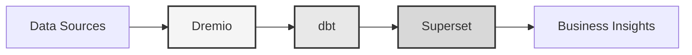

# データプラットフォーム

**エンタープライズデータレイクハウスソリューション**

**Language**: 日本語 (JP)  
**Version**: 3.2.5  
**Last Updated**: 2025-10-15

---

## 概要

Dremio、dbt、Apache Supersetを組み合わせた、エンタープライズグレードのデータ変換、品質保証、ビジネスインテリジェンスのためのプロフェッショナルデータプラットフォーム。

このプラットフォームは、自動化されたデータパイプライン、品質テスト、インタラクティブなダッシュボードを備えた、最新のデータエンジニアリングのための包括的なソリューションを提供します。



---

## 主な機能

- Dremioによるデータレイクハウスアーキテクチャ
- dbtによる自動変換
- Apache Supersetによるビジネスインテリジェンス
- 包括的なデータ品質テスト
- Arrow Flightによるリアルタイム同期

---

## クイックスタートガイド

### 前提条件

- Docker 20.10以上
- Docker Compose 2.0以上
- Python 3.11以上
- 最低8 GBのRAM

### インストール

```bash
# Install dependencies
pip install -r requirements.txt

# Start services
make up

# Verify installation
make status

# Run quality tests
make dbt-test
```

---

## アーキテクチャ

### システムコンポーネント

| コンポーネント | ポート | 説明 |
|-----------|------|-------------|
| Dremio | 9047, 31010, 32010 | データレイクハウスプラットフォーム |
| dbt | - | データ変換ツール |
| Superset | 8088 | Business intelligence platform |
| PostgreSQL | 5432 | Transactional database |
| MinIO | 9000, 9001 | Object storage (S3-compatible) |
| Elasticsearch | 9200 | Search and analytics engine |

### 📚 アーキテクチャドキュメント

- 📘 [アーキテクチャドキュメント](architecture/) - 詳細なシステム設計
- 🎯 [Dremio ポート ビジュアルガイド](architecture/dremio-ports-visual.md) ⭐ **新規** - Dremio の 3 つのポートの完全なビジュアルガイド

---

## ドキュメント

### 入門
- [Installation Guide](getting-started/)
- [Configuration](getting-started/)
- [First Steps](getting-started/)

### ユーザーガイド
- [Data Engineering](guides/)
- [Dashboard Creation](guides/)
- [API Integration](guides/)

### APIドキュメント
- [REST API Reference](api/)
- [Authentication](api/)
- [Code Examples](api/)

### アーキテクチャドキュメント
- [System Design](architecture/)
- [Data Flow](architecture/)
- [Deployment Guide](architecture/)

---

## 利用可能な言語

| Language | Code | Documentation |
|----------|------|---------------|
| English | EN | [README.md](../../../README.md) |
| Français | FR | [docs/i18n/fr/](../fr/README.md) |
| Español | ES | [docs/i18n/es/](../es/README.md) |
| Português | PT | [docs/i18n/pt/](../pt/README.md) |
| العربية | AR | [docs/i18n/ar/](../ar/README.md) |
| 中文 | CN | [docs/i18n/cn/](../cn/README.md) |
| 日本語 | JP | [docs/i18n/jp/](../jp/README.md) |
| Русский | RU | [docs/i18n/ru/](../ru/README.md) |

---

## サポート

For technical assistance:
- Documentation: [Main README](../../../README.md)
- Issue Tracking: GitHub Issues
- Community Forum: GitHub Discussions
- Email: support@example.com

---

**[メインドキュメントに戻る](../../../README.md)**
