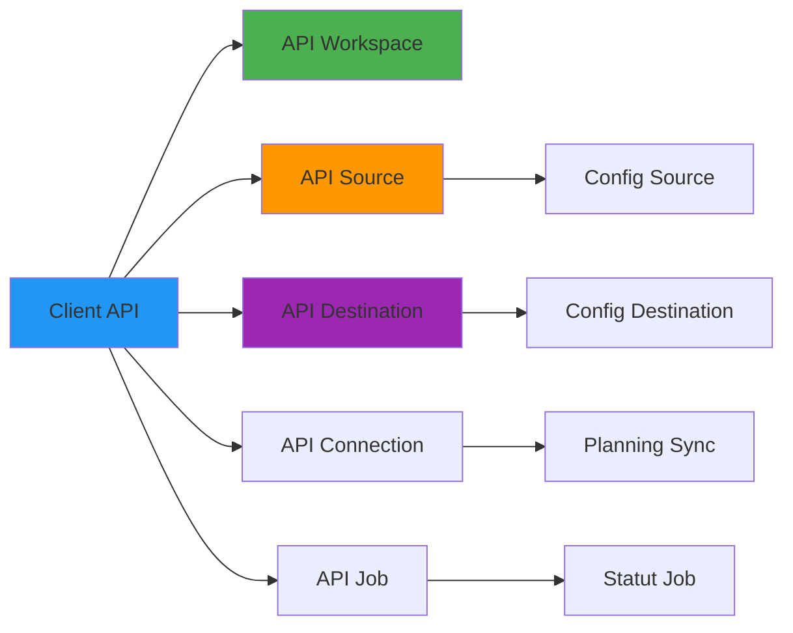

# Airbyte API リファレンス

**バージョン**: 3.2.0  
**最終更新日**: 2025 年 10 月 16 日  
**言語**: フランス語

＃＃ 目次

1. [概要](#overview)
2. [認証](#authentication)
3. [ワークスペース](#workspaces)
4. [ソース](#sources)
5. [目的地](#destinations)
6. [接続](#connections)
7. [ジョブと同期](#jobs-and-synchronizations)
8. [Python の例](#python-examples)

---

＃＃ 概要

Airbyte API を使用すると、データ パイプラインをプログラムで管理できます。

**ベース URL**: `http://localhost:8001/api/v1`

### API アーキテクチャ



---

## 認証

Airbyte は Docker デプロイメントで基本認証を使用します。

```python
import requests

BASE_URL = "http://localhost:8001/api/v1"
headers = {"Content-Type": "application/json"}

# No auth required for local Docker deployment
# For Airbyte Cloud, use API key:
# headers = {"Authorization": "Bearer YOUR_API_KEY"}
```

---

## ワークスペース

### ワークスペースのリストを表示する

```bash
curl -X POST http://localhost:8001/api/v1/workspaces/list \
  -H "Content-Type: application/json" \
  -d '{}'
```

**答え** ：
```json
{
  "workspaces": [
    {
      "workspaceId": "default-workspace-id",
      "name": "default",
      "slug": "default"
    }
  ]
}
```

### ワークスペースを取得する

```python
def get_workspace_id():
    """Get default workspace ID"""
    response = requests.post(
        f"{BASE_URL}/workspaces/list",
        headers=headers,
        json={}
    )
    workspaces = response.json()["workspaces"]
    return workspaces[0]["workspaceId"]

workspace_id = get_workspace_id()
```

---

## ソース

### ソース定義のリスト

```bash
curl -X POST http://localhost:8001/api/v1/source_definitions/list \
  -H "Content-Type: application/json" \
  -d '{"workspaceId": "default-workspace-id"}'
```

**回答**: 300 を超える利用可能なソース コネクタのリスト

### ソース定義を取得する

```python
def get_source_definition(name: str):
    """Get source definition by name"""
    response = requests.post(
        f"{BASE_URL}/source_definitions/list",
        headers=headers,
        json={"workspaceId": workspace_id}
    )
    
    definitions = response.json()["sourceDefinitions"]
    
    for defn in definitions:
        if name.lower() in defn["name"].lower():
            return defn
    
    return None

# Example: Find PostgreSQL definition
pg_definition = get_source_definition("postgres")
print(pg_definition["sourceDefinitionId"])
```

### ソースを作成する

#### ソース PostgreSQL

```bash
curl -X POST http://localhost:8001/api/v1/sources/create \
  -H "Content-Type: application/json" \
  -d '{
    "sourceDefinitionId": "postgres-definition-id",
    "connectionConfiguration": {
      "host": "postgres",
      "port": 5432,
      "database": "ecommerce",
      "username": "postgres",
      "password": "postgres",
      "ssl": false,
      "replication_method": {
        "method": "Standard"
      }
    },
    "workspaceId": "default-workspace-id",
    "name": "PostgreSQL - Ecommerce"
  }'
```

**答え** ：
```json
{
  "sourceId": "source-id-123",
  "sourceDefinitionId": "postgres-definition-id",
  "workspaceId": "default-workspace-id",
  "connectionConfiguration": {...},
  "name": "PostgreSQL - Ecommerce"
}
```

#### API ソース

```python
def create_api_source(name: str, api_url: str, api_key: str):
    """Create REST API source"""
    # Get API definition
    api_definition = get_source_definition("REST API")
    
    payload = {
        "sourceDefinitionId": api_definition["sourceDefinitionId"],
        "connectionConfiguration": {
            "url": api_url,
            "api_key": api_key,
            "method": "GET"
        },
        "workspaceId": workspace_id,
        "name": name
    }
    
    response = requests.post(
        f"{BASE_URL}/sources/create",
        headers=headers,
        json=payload
    )
    
    return response.json()

# Usage
api_source = create_api_source(
    name="CRM API",
    api_url="https://api.example.com/customers",
    api_key="your-api-key"
)
```

### ソース接続のテスト

```bash
curl -X POST http://localhost:8001/api/v1/sources/check_connection \
  -H "Content-Type: application/json" \
  -d '{
    "sourceId": "source-id-123"
  }'
```

**答え** ：
```json
{
  "status": "succeeded",
  "message": "Connection test succeeded"
}
```

### ソースをリストする

```python
def list_sources():
    """List all configured sources"""
    response = requests.post(
        f"{BASE_URL}/sources/list",
        headers=headers,
        json={"workspaceId": workspace_id}
    )
    
    return response.json()["sources"]

sources = list_sources()
for source in sources:
    print(f"{source['name']}: {source['sourceId']}")
```

---

## 目的地

### 宛先を作成する (S3/MinIO)

```bash
curl -X POST http://localhost:8001/api/v1/destinations/create \
  -H "Content-Type: application/json" \
  -d '{
    "destinationDefinitionId": "s3-definition-id",
    "connectionConfiguration": {
      "s3_bucket_name": "datalake",
      "s3_bucket_path": "bronze/",
      "s3_bucket_region": "us-east-1",
      "access_key_id": "minioadmin",
      "secret_access_key": "minioadmin",
      "s3_endpoint": "http://minio:9000",
      "format": {
        "format_type": "Parquet",
        "compression_codec": "snappy"
      }
    },
    "workspaceId": "default-workspace-id",
    "name": "MinIO - Bronze Layer"
  }'
```

### 宛先を作成する (PostgreSQL)

```python
def create_postgres_destination(name: str, schema: str):
    """Create PostgreSQL destination"""
    pg_definition = get_source_definition("postgres")  # Same as source
    
    payload = {
        "destinationDefinitionId": pg_definition["destinationDefinitionId"],
        "connectionConfiguration": {
            "host": "postgres",
            "port": 5432,
            "database": "datawarehouse",
            "username": "postgres",
            "password": "postgres",
            "schema": schema,
            "ssl": False
        },
        "workspaceId": workspace_id,
        "name": name
    }
    
    response = requests.post(
        f"{BASE_URL}/destinations/create",
        headers=headers,
        json=payload
    )
    
    return response.json()

# Usage
pg_dest = create_postgres_destination(
    name="PostgreSQL - Staging",
    schema="raw"
)
```

### 宛先接続をテストする

```python
def test_destination(destination_id: str):
    """Test destination connection"""
    response = requests.post(
        f"{BASE_URL}/destinations/check_connection",
        headers=headers,
        json={"destinationId": destination_id}
    )
    
    result = response.json()
    return result["status"] == "succeeded"
```

---

## 接続

### 図を発見する

```bash
curl -X POST http://localhost:8001/api/v1/sources/discover_schema \
  -H "Content-Type: application/json" \
  -d '{
    "sourceId": "source-id-123"
  }'
```

**答え** ：
```json
{
  "catalog": {
    "streams": [
      {
        "stream": {
          "name": "customers",
          "jsonSchema": {...},
          "supportedSyncModes": ["full_refresh", "incremental"]
        },
        "config": {
          "syncMode": "incremental",
          "cursorField": ["updated_at"],
          "destinationSyncMode": "append"
        }
      }
    ]
  }
}
```

### 接続を作成する

```bash
curl -X POST http://localhost:8001/api/v1/connections/create \
  -H "Content-Type: application/json" \
  -d '{
    "sourceId": "source-id-123",
    "destinationId": "dest-id-456",
    "syncCatalog": {
      "streams": [
        {
          "stream": {
            "name": "customers",
            "namespace": "public"
          },
          "config": {
            "syncMode": "incremental",
            "cursorField": ["updated_at"],
            "destinationSyncMode": "append",
            "selected": true
          }
        }
      ]
    },
    "schedule": {
      "units": 24,
      "timeUnit": "hours"
    },
    "name": "PostgreSQL → MinIO",
    "namespaceDefinition": "source",
    "status": "active"
  }'
```

### ヘルパー Python

```python
def create_connection(
    source_id: str,
    destination_id: str,
    streams: list,
    schedule_hours: int = 24
):
    """Create connection with configured streams"""
    
    payload = {
        "sourceId": source_id,
        "destinationId": destination_id,
        "syncCatalog": {
            "streams": streams
        },
        "schedule": {
            "units": schedule_hours,
            "timeUnit": "hours"
        },
        "name": f"Connection {source_id[:8]} → {destination_id[:8]}",
        "namespaceDefinition": "source",
        "status": "active"
    }
    
    response = requests.post(
        f"{BASE_URL}/connections/create",
        headers=headers,
        json=payload
    )
    
    return response.json()

# Example: Configure stream for incremental sync
stream_config = [
    {
        "stream": {
            "name": "orders",
            "namespace": "public"
        },
        "config": {
            "syncMode": "incremental",
            "cursorField": ["updated_at"],
            "destinationSyncMode": "append",
            "selected": True
        }
    }
]

connection = create_connection(
    source_id="source-id-123",
    destination_id="dest-id-456",
    streams=stream_config,
    schedule_hours=6  # Every 6 hours
)
```

### 接続を更新する

```python
def update_connection_schedule(connection_id: str, hours: int):
    """Update connection sync schedule"""
    
    # Get existing connection
    response = requests.post(
        f"{BASE_URL}/connections/get",
        headers=headers,
        json={"connectionId": connection_id}
    )
    
    connection = response.json()
    
    # Update schedule
    connection["schedule"]["units"] = hours
    
    # Update connection
    response = requests.post(
        f"{BASE_URL}/connections/update",
        headers=headers,
        json=connection
    )
    
    return response.json()
```

---

## ジョブと同期

### 手動同期をトリガーする

```bash
curl -X POST http://localhost:8001/api/v1/connections/sync \
  -H "Content-Type: application/json" \
  -d '{
    "connectionId": "connection-id-789"
  }'
```

**答え** ：
```json
{
  "job": {
    "id": 12345,
    "configType": "sync",
    "status": "pending",
    "createdAt": 1729108800
  }
}
```

### ジョブのステータスを取得する

```bash
curl -X POST http://localhost:8001/api/v1/jobs/get \
  -H "Content-Type: application/json" \
  -d '{
    "id": 12345
  }'
```

**答え** ：
```json
{
  "job": {
    "id": 12345,
    "configType": "sync",
    "status": "succeeded",
    "createdAt": 1729108800,
    "updatedAt": 1729108920,
    "summary": {
      "recordsSynced": 150000,
      "bytesSynced": 52428800
    }
  }
}
```

### ジョブの進行状況を監視する

```python
import time

def wait_for_job(job_id: int, timeout: int = 3600):
    """Wait for job to complete"""
    start_time = time.time()
    
    while time.time() - start_time < timeout:
        response = requests.post(
            f"{BASE_URL}/jobs/get",
            headers=headers,
            json={"id": job_id}
        )
        
        job = response.json()["job"]
        status = job["status"]
        
        print(f"Job {job_id}: {status}")
        
        if status in ["succeeded", "failed", "cancelled"]:
            return job
        
        time.sleep(10)  # Check every 10 seconds
    
    raise TimeoutError(f"Job {job_id} did not complete within {timeout}s")

# Usage
job_response = requests.post(
    f"{BASE_URL}/connections/sync",
    headers=headers,
    json={"connectionId": connection_id}
)

job_id = job_response.json()["job"]["id"]
final_job = wait_for_job(job_id)

print(f"Records synced: {final_job['summary']['recordsSynced']}")
```

### 接続のジョブをリストする

```python
def list_connection_jobs(connection_id: str, limit: int = 10):
    """List recent jobs for connection"""
    response = requests.post(
        f"{BASE_URL}/jobs/list",
        headers=headers,
        json={
            "configTypes": ["sync"],
            "configId": connection_id
        }
    )
    
    jobs = response.json()["jobs"][:limit]
    
    for job in jobs:
        print(f"Job {job['id']}: {job['status']}")
        if "summary" in job:
            print(f"  Records: {job['summary'].get('recordsSynced', 0)}")
            print(f"  Bytes: {job['summary'].get('bytesSynced', 0)}")
```

### ジョブをキャンセルする

```bash
curl -X POST http://localhost:8001/api/v1/jobs/cancel \
  -H "Content-Type: application/json" \
  -d '{
    "id": 12345
  }'
```

---

## Python の例

### 完全なパイプライン構成

```python
#!/usr/bin/env python3
"""
Complete Airbyte pipeline setup automation
"""
import requests
import time

class AirbyteClient:
    """Airbyte API client"""
    
    def __init__(self, base_url: str = "http://localhost:8001/api/v1"):
        self.base_url = base_url
        self.headers = {"Content-Type": "application/json"}
        self.workspace_id = self._get_workspace_id()
    
    def _get_workspace_id(self):
        """Get default workspace ID"""
        response = requests.post(
            f"{self.base_url}/workspaces/list",
            headers=self.headers,
            json={}
        )
        workspaces = response.json()["workspaces"]
        return workspaces[0]["workspaceId"]
    
    def create_postgres_source(self, name: str, config: dict):
        """Create PostgreSQL source"""
        # Get PostgreSQL definition
        response = requests.post(
            f"{self.base_url}/source_definitions/list",
            headers=self.headers,
            json={"workspaceId": self.workspace_id}
        )
        
        definitions = response.json()["sourceDefinitions"]
        pg_def = next(d for d in definitions if "postgres" in d["name"].lower())
        
        # Create source
        payload = {
            "sourceDefinitionId": pg_def["sourceDefinitionId"],
            "connectionConfiguration": config,
            "workspaceId": self.workspace_id,
            "name": name
        }
        
        response = requests.post(
            f"{self.base_url}/sources/create",
            headers=self.headers,
            json=payload
        )
        
        return response.json()
    
    def create_s3_destination(self, name: str, config: dict):
        """Create S3/MinIO destination"""
        # Get S3 definition
        response = requests.post(
            f"{self.base_url}/destination_definitions/list",
            headers=self.headers,
            json={"workspaceId": self.workspace_id}
        )
        
        definitions = response.json()["destinationDefinitions"]
        s3_def = next(d for d in definitions if d["name"] == "S3")
        
        # Create destination
        payload = {
            "destinationDefinitionId": s3_def["destinationDefinitionId"],
            "connectionConfiguration": config,
            "workspaceId": self.workspace_id,
            "name": name
        }
        
        response = requests.post(
            f"{self.base_url}/destinations/create",
            headers=self.headers,
            json=payload
        )
        
        return response.json()
    
    def create_connection(self, source_id: str, dest_id: str, 
                         streams: list, schedule_hours: int = 24):
        """Create connection"""
        payload = {
            "sourceId": source_id,
            "destinationId": dest_id,
            "syncCatalog": {"streams": streams},
            "schedule": {"units": schedule_hours, "timeUnit": "hours"},
            "name": f"{source_id[:8]} → {dest_id[:8]}",
            "namespaceDefinition": "source",
            "status": "active"
        }
        
        response = requests.post(
            f"{self.base_url}/connections/create",
            headers=self.headers,
            json=payload
        )
        
        return response.json()
    
    def trigger_sync(self, connection_id: str):
        """Trigger manual sync"""
        response = requests.post(
            f"{self.base_url}/connections/sync",
            headers=self.headers,
            json={"connectionId": connection_id}
        )
        
        return response.json()["job"]["id"]

# Usage example
if __name__ == "__main__":
    client = AirbyteClient()
    
    # Create PostgreSQL source
    pg_source = client.create_postgres_source(
        name="PostgreSQL - Ecommerce",
        config={
            "host": "postgres",
            "port": 5432,
            "database": "ecommerce",
            "username": "postgres",
            "password": "postgres",
            "ssl": False,
            "replication_method": {"method": "Standard"}
        }
    )
    
    # Create MinIO destination
    minio_dest = client.create_s3_destination(
        name="MinIO - Bronze",
        config={
            "s3_bucket_name": "datalake",
            "s3_bucket_path": "bronze/",
            "s3_bucket_region": "us-east-1",
            "access_key_id": "minioadmin",
            "secret_access_key": "minioadmin",
            "s3_endpoint": "http://minio:9000",
            "format": {
                "format_type": "Parquet",
                "compression_codec": "snappy"
            }
        }
    )
    
    # Create connection
    streams = [
        {
            "stream": {"name": "customers", "namespace": "public"},
            "config": {
                "syncMode": "incremental",
                "cursorField": ["updated_at"],
                "destinationSyncMode": "append",
                "selected": True
            }
        },
        {
            "stream": {"name": "orders", "namespace": "public"},
            "config": {
                "syncMode": "incremental",
                "cursorField": ["updated_at"],
                "destinationSyncMode": "append",
                "selected": True
            }
        }
    ]
    
    connection = client.create_connection(
        source_id=pg_source["sourceId"],
        dest_id=minio_dest["destinationId"],
        streams=streams,
        schedule_hours=6
    )
    
    # Trigger first sync
    job_id = client.trigger_sync(connection["connectionId"])
    print(f"Sync started: Job {job_id}")
```

---

＃＃ まとめ

この API リファレンスでは次の内容がカバーされています。

- **ワークスペース**: ワークスペースのコンテキストを取得します。
- **ソース**: 300 以上のコネクタ (PostgreSQL、API、データベース)
- **宛先**: S3/MinIO、PostgreSQL、データ ウェアハウス
- **接続**: スケジュールによる同期設定
- **ジョブ**: 同期のトリガー、監視、管理
- **Python クライアント**: 完全な自動化の例

**重要なポイント**:
- REST APIを使用して完全な自動化を実現
- 同期を作成する前に接続をテストする
- 本番パイプラインのジョブステータスを監視する
- カーソルフィールドとの増分同期を使用する
- データの鮮度のニーズに基づいて同期を計画する

**関連ドキュメント:**
- [Airbyte統合ガイド](../guides/airbyte-integration.md)
- [アーキテクチャ: データ フロー](../architecture/data-flow.md)
- [トラブルシューティング ガイド](../guides/troubleshooting.md)

---

**バージョン**: 3.2.0  
**最終更新日**: 2025 年 10 月 16 日