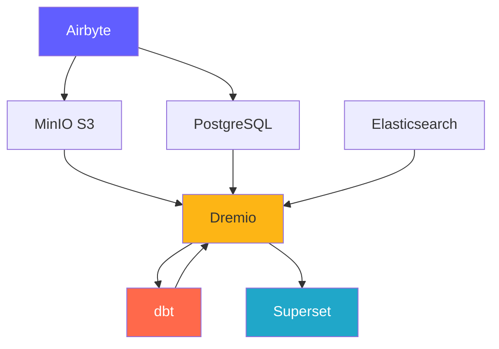
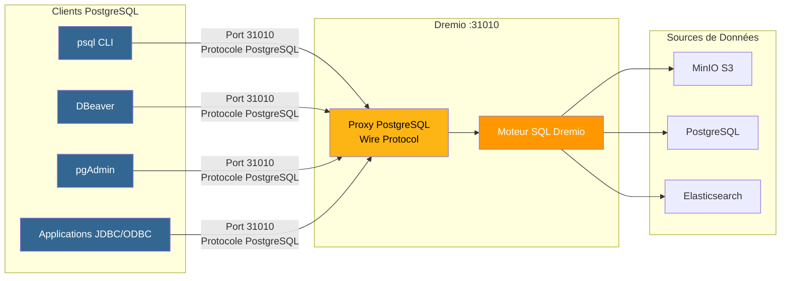
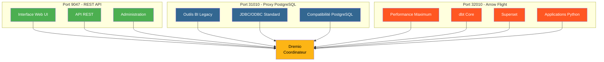
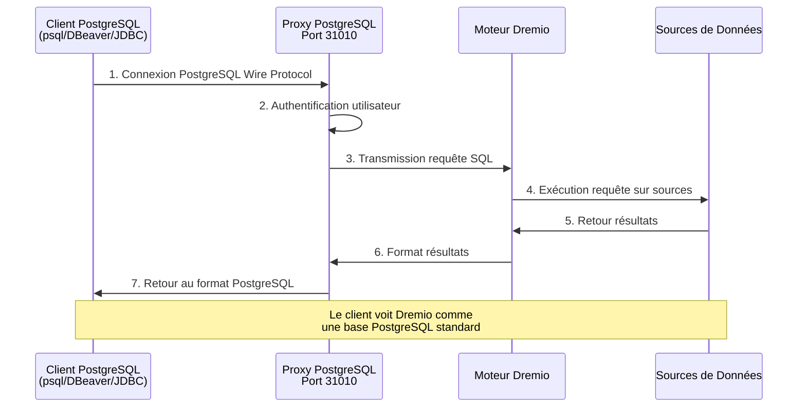
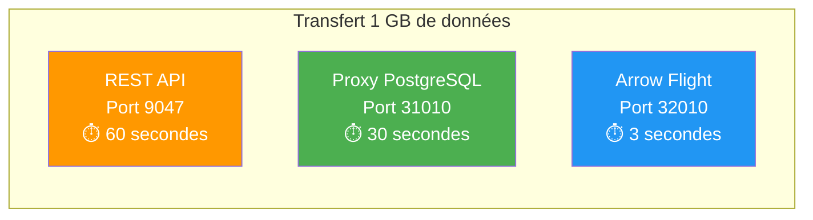

# プラットフォームコンポーネント

**バージョン**: 3.2.0  
**最終更新**: 2025-10-16  
**言語**: フランス語

---

## コンポーネントの概要

データ プラットフォームは、連携して完全なソリューションを提供する 7 つの主要コンポーネントで構成されています。



---

## 1. Airbyte – データ統合プラットフォーム

＃＃＃ 概要

Airbyte は、複数のソースから宛先にデータを統合するオープンソース データ統合エンジンです。

**バージョン**: 0.50.33  
**ライセンス**: MIT  
**ウェブサイト**: https://airbyte.com

### 主な機能

- **300 以上の構築済みコネクタ**: データベース、API、ファイル、SaaS アプリケーション
- **変更データ キャプチャ (CDC)**: リアルタイム データ レプリケーション
- **カスタム コネクタ**: Python またはローコード CDK を使用して構築します
- **正規化**: JSON をリレーショナル テーブルに変換します
- **増分同期**: 新しいデータまたは変更されたデータのみを同期します
- **モニタリング**: 統合された追跡ステータスの同期

＃＃＃ 建築

```yaml
Composants:
  airbyte-webapp:
    Port: 8000
    Objectif: Interface utilisateur web
    
  airbyte-server:
    Port: 8001
    Objectif: Serveur API REST
    
  airbyte-worker:
    Objectif: Exécuter tâches synchronisation
    Scalabilité: Horizontale
    
  airbyte-temporal:
    Port: 7233
    Objectif: Orchestration workflows
    
  airbyte-db:
    Port: 5432
    Objectif: Stockage métadonnées (PostgreSQL)
```

＃＃＃ 使用事例

- **ELT パイプライン**: 抽出、読み込み、変換のワークフロー
- **データベース レプリケーション**: データベースの同期を維持します。
- **API 統合**: REST API からデータを抽出
- **データ レイクの取り込み**: データを S3/MinIO にロードします
- **クラウド移行**: オンプレミスのデータをクラウドに移動します

＃＃＃ 設定

```yaml
# Variables d'Environnement
AIRBYTE_VERSION: "0.50.33"
AIRBYTE_HTTP_PORT: 8000
AIRBYTE_API_PORT: 8001
AIRBYTE_WORKSPACE_ROOT: /tmp/airbyte_local

# Limites Ressources
CPU_LIMIT: "2.0"
MEMORY_LIMIT: "2Gi"
```

### 統合ポイント

- **出力先**: MinIO S3、PostgreSQL、Dremio
- **オーケストレーション**: エアフロー、プリフェクトによってトリガー可能
- **モニタリング**: Prometheus メトリクス エンドポイント

---

## 2. Dremio – データ レイクハウス プラットフォーム

＃＃＃ 概要

Dremio は、クエリ アクセラレーションを備えた統合 SQL インターフェイスをすべてのデータ ソースに提供します。

**バージョン**: 26.0 OSS  
**ライセンス**: Apache 2.0  
**ウェブサイト**: https://www.dremio.com

### 主な機能

- **データ レイクハウス**: レイクの柔軟性とウェアハウスのパフォーマンスを組み合わせる
- **感想**: 自動クエリ高速化 (最大 100 倍高速)
- **Arrow Flight**: 高性能データ転送
- **データ仮想化**: データを移動せずにクエリを実行
- **セマンティック レイヤー**: ビジネスに適したデータ定義
- **タイムトラベル**: 指定された履歴バージョンをクエリします

＃＃＃ 建築

```yaml
Composants:
  Coordinateur:
    Port: 9047 (HTTP), 31010 (ODBC), 32010 (Arrow Flight)
    Objectif: Planification requêtes, gestion métadonnées
    Mémoire: 8Go heap + 8Go direct
    
  Exécuteur:
    Objectif: Exécution requêtes
    Mémoire: 4Go heap + 8Go direct
    Scalabilité: Horizontale (ajouter plus d'exécuteurs)
    
  Stockage:
    Type: Distribué (MinIO, S3, HDFS)
    Format: Parquet, Iceberg
```

＃＃＃ 使用事例

- **セルフサービス分析**: ビジネス ユーザーがデータを探索できるようにします
- **データ メッシュ**: データへのフェデレーション アクセス
- **クエリの高速化**: ダッシュボードのクエリを高速化します。
- **データ カタログ**: データの検出と管理
- **BI アクティベーション**: Power Tableau、Power BI、スーパーセット

＃＃＃ 設定

```conf
# dremio.conf
paths.local: "/opt/dremio/data"
services.coordinator.enabled: true
services.executor.enabled: true

services.coordinator.web.port: 9047
services.flight.endpoint.port: 32010

services.executor.cache.pct.max: 70
```

### 統合ポイント

- **読み取り元**: MinIO S3、PostgreSQL、Elasticsearch
- **変換**: dbt
- **使用用途**: スーパーセット、Tableau、Power BI

### Dremio 用 PostgreSQL プロキシ

Dremio は PostgreSQL サーバーをエミュレートできるため、PostgreSQL 互換ツールが標準の PostgreSQL データベースであるかのように Dremio に接続できるようになります。

#### PostgreSQL プロキシ アーキテクチャ



#### 3 つの Dremio ポートの比較



#### プロキシ構成

```yaml
Proxy PostgreSQL:
  Port: 31010 (ODBC/JDBC)
  Protocole: PostgreSQL Wire Protocol
  Compatibilité: Outils compatibles PostgreSQL (psql, pgAdmin, DBeaver)
  
Avantages:
  - Aucune modification du code client
  - Support des pilotes PostgreSQL existants
  - Connexion via JDBC/ODBC standard
  - Compatible avec la plupart des outils BI
```

#### プロキシの使用例

1. **BI レガシー ツール**: Arrow Flight をサポートしていない接続ツール
2. **簡単な移行**: コードを変更せずに PostgreSQL を Dremio に置き換えます
3. **ODBC/JDBC 互換性**: 標準の PostgreSQL ドライバーを使用します
4. **開発**: 使い慣れた PostgreSQL ツール (psql、pgAdmin) を使用したテスト

#### 接続例

```bash
# Via psql
psql -h localhost -p 31010 -U admin -d datalake

# Via DBeaver / pgAdmin
Host: localhost
Port: 31010
Database: datalake
Username: admin
Password: <votre-mot-de-passe>

# Chaîne JDBC
jdbc:postgresql://localhost:31010/datalake

# Chaîne ODBC
Driver=PostgreSQL Unicode;
Server=localhost;
Port=31010;
Database=datalake;
Uid=admin;
Pwd=<votre-mot-de-passe>;
```

#### 制限事項

- **パフォーマンス**: Arrow Flight (ポート 32010) は 20 ～ 50 倍高速です
- **機能**: 一部の高度な PostgreSQL 機能はサポートされていません
- **推奨事項**: 本番環境には Arrow Flight を使用し、互換性のために PostgreSQL プロキシを使用します。

#### PostgreSQL プロキシ経由の接続フロー



#### プロトコルの比較

|プロトコル |ポート |パフォーマンス |レイテンシ |使用例 |
|---------------|------|---------------|----------|----------|
| **REST API** | 9047 |標準 | ~50-100ms | Web UI、管理 |
| **ODBC/JDBC (PostgreSQL プロキシ)** | 31010 |良い | ~20-50ms |従来の BI ツール、互換性 |
| **アロー フライト** | 32010 |素晴らしい (20-50x) | ~5-10ms |プロダクション、スーパーセット、dbt |

#### パフォーマンスの比較



---

## 3. dbt - データ変換ツール

＃＃＃ 概要

dbt (データ構築ツール) を使用すると、分析エンジニアは SQL を使用してデータを変換できます。

**バージョン**: 1.10+  
**ライセンス**: Apache 2.0  
**ウェブサイト**: https://www.getdbt.com

### 主な機能

- **SQL ベース**: SQL で変換を書き込みます
- **バージョン管理**: コラボレーションのための Git 統合
- **テスト**: 統合されたデータ品質テスト
- **ドキュメント**: データ ディクショナリを自動生成します
- **モジュール性**: 再利用可能なマクロとパッケージ
- **増分モデル**: 新しいデータのみを処理します

＃＃＃ 建築

```yaml
Composants:
  dbt Core:
    Objectif: Outil CLI pour exécuter transformations
    Langage: Python
    
  Modèles:
    Objectif: Instructions SQL SELECT
    Types: Vues, Tables, Incrémental, Snapshots
    
  Tests:
    Objectif: Validation qualité données
    Types: Unique, Not Null, Relations, Personnalisés
    
  Macros:
    Objectif: Fonctions SQL réutilisables
    Langage: Jinja2
```

＃＃＃ 使用事例

- **データ モデリング**: スター/フレーク ダイアグラムを構築する
- **データ品質**: データの整合性を検証します。
- **ゆっくりと変化するディメンション**: 過去の変化を追跡する
- **データ集約**: 概要テーブルを作成します。
- **データ ドキュメント**: データ カタログを生成します。

＃＃＃ 設定

```yaml
# dbt_project.yml
name: 'dremio_dbt'
version: '1.0.0'
profile: 'dremio'

models:
  dremio_dbt:
    staging:
      +materialized: view
      +schema: staging
    marts:
      +materialized: table
      +schema: marts
```

### 統合ポイント

- **引用元**: Dremio データセット
- **宛先**: Dremio (Arrow Flight経由)
- **オーケストレーション**: Airflow、cron、Airbyte 事後同期

---

## 4. Apache スーパーセット – ビジネス インテリジェンス プラットフォーム

＃＃＃ 概要

Superset は、最新のデータ探索および視覚化プラットフォームです。

**バージョン**: 3.0  
**ライセンス**: Apache 2.0  
**ウェブサイト**: https://superset.apache.org

### 主な機能

- **SQL IDE**: オートコンプリート機能を備えた高度な SQL エディター
- **豊富なビジュアライゼーション**: 50 以上のグラフ タイプ
- **インタラクティブ ダッシュボード**: ドリルダウン、フィルタ、クロス フィルタリング
- **SQL ラボ**: アドホック クエリ インターフェイス
- **アラート**: スケジュールされたレポートとアラート
- **キャッシュ**: パフォーマンスのためにクエリ結果をキャッシュします。

＃＃＃ 建築

```yaml
Composants:
  Serveur Web:
    Port: 8088
    Objectif: Servir interface web
    Framework: Flask
    
  Workers Celery:
    Objectif: Exécution requêtes asynchrone
    File: Redis/RabbitMQ
    
  Celery Beat:
    Objectif: Tâches planifiées (préchauffage cache, alertes)
    
  Base de Données:
    Objectif: Stocker tableaux de bord, utilisateurs, logs requêtes
    Type: PostgreSQL
```

＃＃＃ 使用事例

- **エグゼクティブ ダッシュボード**: KPI モニタリング
- **運用分析**: リアルタイム監視
- **BI セルフサービス**: アナリストを支援する
- **埋め込み分析**: アプリケーションへの iframe の統合
- **データ探索**: アドホック分析

＃＃＃ 設定

```python
# superset_config.py
SQLALCHEMY_DATABASE_URI = 'postgresql://...'
SECRET_KEY = '...'

FEATURE_FLAGS = {
    'DASHBOARD_NATIVE_FILTERS': True,
    'DASHBOARD_CROSS_FILTERS': True,
    'ENABLE_TEMPLATE_PROCESSING': True
}

CACHE_CONFIG = {
    'CACHE_TYPE': 'redis',
    'CACHE_DEFAULT_TIMEOUT': 300
}
```

### 統合ポイント

- **リクエスト**: ドレミオ (アローフライト経由)
- **認証**: LDAP、OAuth2、データベース
- **アラート**: 電子メール、Slack

---

## 5. PostgreSQL - リレーショナル データベース

＃＃＃ 概要

PostgreSQL は、高度なオープンソースのリレーショナル データベース管理システムです。

**バージョン**: 16  
**ライセンス**: PostgreSQL ライセンス  
**ウェブサイト**: https://www.postgresql.org

### 主な機能

- **ACID 準拠**: 信頼できるトランザクション
- **JSON サポート**: ネイティブ JSON/JSONB タイプ
- **全文検索**: 統合された検索機能
- **拡張機能**: PostGIS、pg_stat_statements、TimescaleDB
- **レプリケーション**: ストリーミング レプリケーション、論理レプリケーション
- **パーティショニング**: ネイティブ テーブル パーティショニング

＃＃＃ 建築

```yaml
Composants:
  Serveur PostgreSQL:
    Port: 5432
    Protocole: Protocole wire PostgreSQL
    
  Bases de Données:
    - dremio_db: Métadonnées Dremio
    - superset_db: Configuration Superset
    - airbyte_db: Métadonnées Airbyte
    
  Connexions:
    Max: 200
    Pooling: PgBouncer (optionnel)
```

＃＃＃ 使用事例

- **メタデータ ストレージ**: システム メタデータを保存します
- **トランザクション負荷**: OLTP アプリケーション
- **ステージング テーブル**: 一時的なデータ処理
- **ストレージ構成**: アプリケーション設定
- **監査ログ**: システムの変更を追跡します。

＃＃＃ 設定

```conf
# postgresql.conf
max_connections = 200
shared_buffers = 256MB
effective_cache_size = 1GB
maintenance_work_mem = 64MB
work_mem = 4MB

# Performance
random_page_cost = 1.1
effective_io_concurrency = 200

# Journalisation
log_statement = 'mod'
log_duration = on
```

### 統合ポイント

- **お読みください**: Dremio、Superset、Airbyte
- **執筆者**: Airbyte、dbt、アプリケーション
- **管理者**: 自動バックアップ、レプリケーション

---

## 6. MinIO – S3 互換オブジェクトストレージ

＃＃＃ 概要

MinIO は、高性能の S3 互換オブジェクト ストレージ システムです。

**バージョン**: 最新  
**ライセンス**: AGPLv3  
**ウェブサイト**: https://min.io

### 主な機能

- **S3 API**: Amazon S3 と 100% 互換性があります
- **高性能**: マルチGB/秒のスループット
- **イレイジャーコーディング**: 持続可能性と可用性のデータ
- **バージョン管理**: オブジェクトのバージョン管理
- **暗号化**: サーバー側とクライアント側
- **マルチクラウド**: どこにでも展開

＃＃＃ 建築

```yaml
Composants:
  Serveur MinIO:
    Port: 9000 (API S3), 9001 (Console)
    Mode: Nœud unique ou distribué
    
  Stockage:
    Format: Erasure coded ou brut
    Redondance: Configurable (ex: 4+2)
    
  Buckets:
    - datalake: Stockage données principal
    - raw-data: Ingestion Airbyte
    - processed-data: Sorties dbt
    - backups: Sauvegardes système
```

＃＃＃ 使用事例

- **データ レイク**: 生のデータと処理されたデータを保存します
- **オブジェクト ストレージ**: ファイル、画像、ビデオ
- **ストレージ バックアップ**: データベースとシステムのバックアップ
- **アーカイブ**: データの長期保存
- **データ ステージング**: 一時処理ストレージ

＃＃＃ 設定

```yaml
# Variables d'Environnement
MINIO_ROOT_USER: minioadmin
MINIO_ROOT_PASSWORD: minioadmin123
MINIO_VOLUMES: /data

# Politiques Buckets
- datalake: Lecture-écriture pour plateforme données
- raw-data: Écriture par Airbyte, lecture par Dremio
- processed-data: Écriture par dbt, lecture tous
```

### 統合ポイント

- **執筆者**: Airbyte、dbt、アプリケーション
- **読み手**: Dremio、データサイエンティスト
- **管理者**: mc (MinIO クライアント)、s3cmd

---

## 7. Elasticsearch - 検索および分析エンジン

＃＃＃ 概要

Elasticsearch は、Apache Lucene 上に構築された分散検索および分析エンジンです。

**バージョン**: 8.15  
**ライセンス**: Elastic ライセンス 2.0  
**ウェブサイト**: https://www.elastic.co

### 主な機能

- **全文検索**: 高度な検索機能
- **リアルタイム インデックス作成**: ほぼリアルタイムのデータ可用性
- **分散**: 水平方向のスケーラビリティ
- **集計**: 複雑な分析
- **RESTful API**: シンプルな HTTP API
- **機械学習**: 異常検出

＃＃＃ 建築

```yaml
Composants:
  Nœud Elasticsearch:
    Port: 9200 (HTTP), 9300 (Transport)
    Rôles: Master, Data, Ingest, ML
    
  Index:
    Objectif: Stocker documents recherchables
    Shards: Distribués entre nœuds
    Répliques: Pour haute disponibilité
    
  Cycle de Vie Index:
    Hot: Données récentes (SSD)
    Warm: Données anciennes (HDD)
    Cold: Archive (S3)
```

＃＃＃ 使用事例

- **分析ログ**: 集中ログ (ELK スタック)
- **アプリケーション検索**: 製品カタログ、サイト検索
- **セキュリティ分析**: SIEM の使用例
- **可観測性**: メトリクスとトレース
- **テキスト分析**: NLP と感情分析

＃＃＃ 設定

```yaml
# elasticsearch.yml
cluster.name: "dremio-search-cluster"
node.name: "node-1"
network.host: 0.0.0.0
http.port: 9200

# Sécurité
xpack.security.enabled: true
xpack.security.transport.ssl.enabled: false

# Mémoire
bootstrap.memory_lock: true
```

### 統合ポイント

- **インデックス作成者**: Logstash、Filebeat
- **リクエスト者**: ドレミオ、キバナ
- **監視対象**: Elasticsearch Monitoring

---

## コンポーネントの比較

|コンポーネント |タイプ |主な用途 |スケーラビリティ |状態 |
|---------------|------|---------------|---------------|------|
| **エアバイト** |統合 |データの取り込み |横（労働者） |無国籍 |
| **ドレミオ** |クエリエンジン |データアクセス |水平 (実行者) |無国籍 |
| **dbt** |変換 |データモデリング |縦（ハート）｜無国籍 |
| **スーパーセット** | BIプラットフォーム |ビジュアライゼーション |横型 (ウェブ) |無国籍 |
| **PostgreSQL** |データベース |メタデータストレージ |垂直 (+ レプリケーション) |ステートフル |
| **MinIO** |オブジェクトストレージ |データレイク |水平 (分散) |ステートフル |
| **エラスティックサーチ** |検索エンジン |全文検索 |水平 (クラスター) |ステートフル |

---

## リソース要件

### 最小構成 (開発)

```yaml
Total: 8 Go RAM, 4 CPUs, 50 Go Disque

Allocation:
  Airbyte: 1 Go RAM, 0.5 CPU
  Dremio: 2 Go RAM, 1 CPU
  Superset: 1 Go RAM, 0.5 CPU
  PostgreSQL: 1 Go RAM, 0.5 CPU
  MinIO: 1 Go RAM, 0.5 CPU
  Elasticsearch: 2 Go RAM, 1 CPU
```

### 推奨構成 (実稼働)

```yaml
Total: 64 Go RAM, 16 CPUs, 500 Go SSD

Allocation:
  Airbyte: 4 Go RAM, 2 CPUs
  Dremio: 16 Go RAM, 4 CPUs
  Superset: 8 Go RAM, 2 CPUs
  PostgreSQL: 8 Go RAM, 2 CPUs
  MinIO: 16 Go RAM, 2 CPUs
  Elasticsearch: 12 Go RAM, 4 CPUs
```

---

## バージョン互換性マトリックス

|コンポーネント |リリース |と互換性があります |
|----------|-----------|-----------|
|エアバイト | 0.50以上 |すべての目的地 |
|ドレミオ | 26.0 | dbt 1.8+、Arrow Flight の顧客 |
| dbt | 1.10+ |ドレミオ 23.0+ |
|スーパーセット | 3.0+ | Dremio 22.0+、PostgreSQL 12+ |
|ポストグレSQL | 16 |すべてのコンポーネント |
|みにお |最新 | S3 互換クライアント |
|エラスティックサーチ | 8.15 | Dremio 26.0+、Logstash 8.x |

---

**コンポーネント ガイド バージョン**: 3.2.0  
**最終更新**: 2025-10-16  
**管理者**: データ プラットフォーム チーム