# データフローアーキテクチャ

**バージョン**: 3.2.0  
**最終更新**: 2025 年 10 月 16 日  
**言語**: フランス語

＃＃ 目次

1. [概要](#overview)
2. [エンドツーエンドのデータフロー](#end-to-end-dataflow)
3. [インジェストレイヤー](#ingestion-layer)
4. [ストレージ層](#storage-layer)
5. [処理層](#processing-layer)
6. [プレゼンテーション層](#presentation-layer)
7. [データフローモデル](#dataflow-models)
8. [パフォーマンスに関する考慮事項](#パフォーマンス-considerations)
9. [データフロー監視](#dataflow-monitoring)
10. [グッドプラクティス](#good-practices)

---

＃＃ 概要

このドキュメントでは、初期データの取り込みから最終的な消費まで、プラットフォームの完全なデータ フロー アーキテクチャについて詳しく説明します。これらのフローを理解することは、パフォーマンスの最適化、問題のトラブルシューティング、効果的なデータ パイプラインの設計にとって重要です。

### データ フローの原則

私たちのアーキテクチャは次の基本原則に従っています。

1. **一方向フロー**: データは明確で予測可能な方向に移動します
2. **レイヤード処理**: 各レイヤーには特定の責任があります
3. **分離されたコンポーネント**: サービスは明確に定義されたインターフェイスを介して通信します
4. **冪等**: 操作を安全に繰り返すことができます
5. **可観測性**: すべてのステップがログに記録され、監視されます。

### アーキテクチャ層

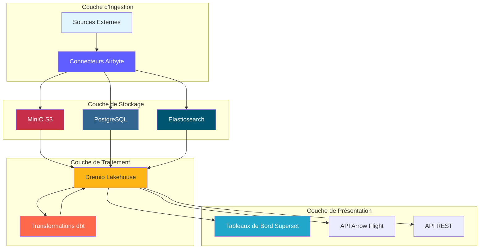

---

## エンドツーエンドのデータ フロー

### 完全なパイプライン シーケンス

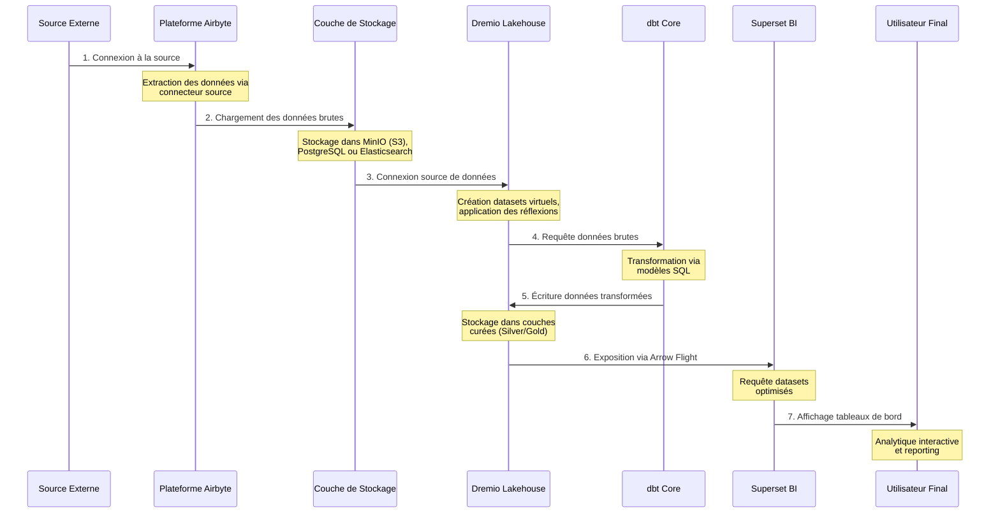

### データ フローのステップ

|ステップ |コンポーネント |入口 |終了 |レイテンシ |
|----------|----------|----------|----------|---------|
| **抜粋** |エアバイト |外部 API/BD |生の JSON/CSV | 1～60分 |
| **読み込み中** |ストレージ層 |未加工ファイル |厳選されたバケット | 1 分未満 |
| **カタログ作成** |ドレミオ |ストレージパス |仮想データセット | 1 分未満 |
| **変換** | dbt |ブロンズテーブル |シルバー/ゴールドテーブル | 5～30分 |
| **最適化** |ドレミオの感想 |生のクエリ |隠された結果 |リアルタイム |
| **視覚化** |スーパーセット | SQL クエリ |チャート/ダッシュボード | 5 秒未満 |

---

## インジェストレイヤー

### Airbyte データの抽出

Airbyte は、外部ソースからのすべてのデータ取り込みを管理します。

#### ソース接続フロー

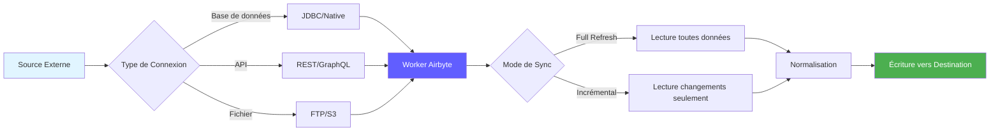

#### データ抽出方法

**1.フルリフレッシュ**
```yaml
# Full refresh extrait toutes les données à chaque sync
sync_mode: full_refresh
destination_sync_mode: overwrite

# Cas d'usage:
# - Petits datasets (<1M lignes)
# - Pas de suivi fiable des changements
# - Snapshots complets nécessaires
```

**2.増分同期**
```yaml
# Sync incrémental extrait uniquement les données nouvelles/modifiées
sync_mode: incremental
destination_sync_mode: append_dedup
cursor_field: updated_at

# Cas d'usage:
# - Grands datasets (>1M lignes)
# - Possède champ timestamp ou curseur
# - Optimisation performance sync
```

**3.変更データ キャプチャ (CDC)**
```yaml
# CDC utilise les logs de transaction de la base de données
method: CDC
replication_method: LOG_BASED

# Bases de données supportées:
# - PostgreSQL (WAL)
# - MySQL (binlog)
# - MongoDB (change streams)
# - SQL Server (change tracking)
```

### Airbyte APIの統合

```bash
# Déclencher sync via API
curl -X POST http://localhost:8001/api/v1/connections/sync \
  -H "Content-Type: application/json" \
  -d '{
    "connectionId": "your-connection-id"
  }'

# Vérifier statut sync
curl -X POST http://localhost:8001/api/v1/jobs/get \
  -H "Content-Type: application/json" \
  -d '{
    "id": "job-id"
  }'
```

### 抽出パフォーマンス

|ソースの種類 |フロー |推奨周波数 |
|--|------|-----------|
|ポストグレSQL | 50-100k 行/秒 | 15 ～ 60 分ごと |
| REST API | 1 ～ 10,000 リクエスト/秒 | 5 ～ 30 分ごと |
| CSV ファイル | 100 ～ 500 MB/秒 |毎日 |
|モンゴDB | 10 ～ 50,000 ドキュメント/秒 | 15 ～ 60 分ごと |
| MySQL CDC |リアルタイム |連続 |

---

## ストレージ層

### MinIO S3 ストレージ

MinIO は、生のデータと処理されたデータを階層構造に保存します。

#### バケット構成

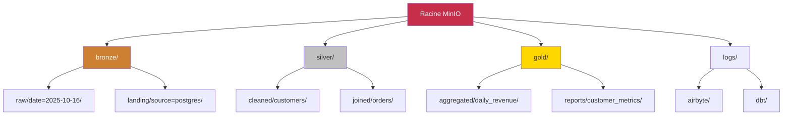

#### データ パス構造

```
s3://datalake/
├── bronze/                      # Données brutes d'Airbyte
│   ├── postgres/
│   │   ├── customers/
│   │   │   └── date=2025-10-16/
│   │   │       └── data.parquet
│   │   └── orders/
│   │       └── date=2025-10-16/
│   │           └── data.parquet
│   ├── api/
│   │   └── rest_endpoint/
│   │       └── timestamp=20251016_120000/
│   │           └── response.json
│   └── files/
│       └── csv_import/
│           └── batch_001.csv
│
├── silver/                      # Données nettoyées et validées
│   ├── customers/
│   │   └── version=v2/
│   │       └── customers_cleaned.parquet
│   └── orders/
│       └── version=v2/
│           └── orders_enriched.parquet
│
└── gold/                        # Agrégats prêts pour le métier
    ├── daily_revenue/
    │   └── year=2025/month=10/
    │       └── day=16/
    │           └── revenue.parquet
    └── customer_metrics/
        └── snapshot=2025-10-16/
            └── metrics.parquet
```

### ストレージ形式戦略

|レイヤー |フォーマット |圧縮 |パーティショニング |理由 |
|----------|----------|---------------|----------|----------|
| **ブロンズ** |寄木細工 |スナッピー |日付順 |高速書き込み、優れた圧縮 |
| **シルバー** |寄木細工 |スナッピー |ビジネスキー別 |効果的なクエリ |
| **ゴールド** |寄木細工 | ZSTD |期間別 |最大圧縮 |
| **ログ** | JSON | Gzip |サービス/日付別 |人間が読める |

### PostgreSQL メタデータ ストレージ

PostgreSQL ストア:
- Airbyの設定とステータス
- メタデータとdbt実行履歴
- スーパーセットのダッシュボードとユーザー
- アプリケーションのログとメトリクス

```sql
-- Structure table état Airbyte
CREATE TABLE airbyte_state (
    connection_id UUID PRIMARY KEY,
    state JSONB NOT NULL,
    updated_at TIMESTAMP DEFAULT NOW()
);

-- Historique exécution dbt
CREATE TABLE dbt_run_history (
    run_id UUID PRIMARY KEY,
    project_name VARCHAR(255),
    started_at TIMESTAMP,
    completed_at TIMESTAMP,
    status VARCHAR(50),
    models_run INTEGER,
    tests_run INTEGER,
    metadata JSONB
);
```

### Elasticsearch ドキュメント ストレージ

Elasticsearch はログにインデックスを付け、全文検索を可能にします。

```json
{
  "index": "airbyte-logs-2025.10.16",
  "mappings": {
    "properties": {
      "timestamp": {"type": "date"},
      "level": {"type": "keyword"},
      "service": {"type": "keyword"},
      "message": {"type": "text"},
      "job_id": {"type": "keyword"},
      "connection_id": {"type": "keyword"},
      "records_synced": {"type": "integer"},
      "bytes_synced": {"type": "long"}
    }
  }
}
```

---

## 処理層

### Dremio データ仮想化

Dremio は、すべてのストレージ ソースにわたる統合ビューを作成します。

#### 仮想データセットの作成

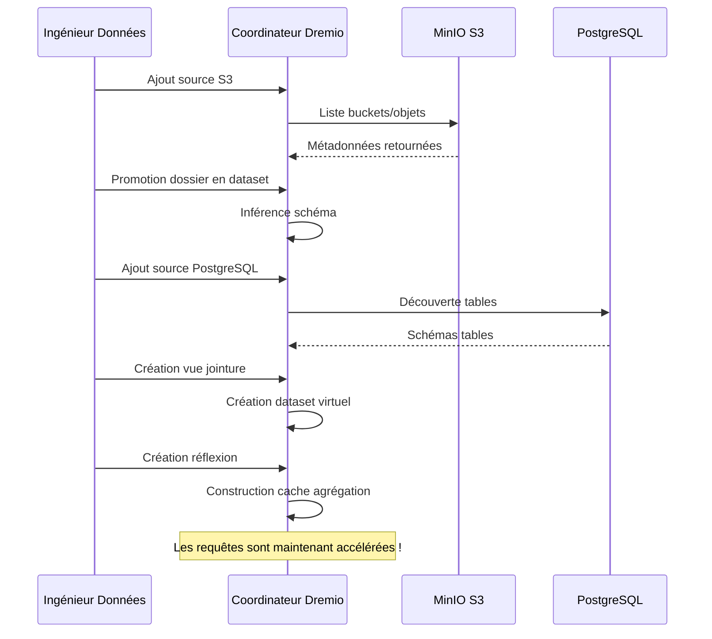

#### 反射による加速

Dremio リフレクションはクエリ結果を事前計算して、即時のパフォーマンスを実現します。

```sql
-- Créer réflexion brute (sous-ensemble colonnes)
CREATE REFLECTION raw_customers
ON bronze.customers
USING DISPLAY (customer_id, name, email, created_at);

-- Créer réflexion agrégation
CREATE REFLECTION agg_daily_revenue
ON gold.orders
USING DIMENSIONS (order_date)
MEASURES (SUM(amount), COUNT(*), AVG(amount));

-- Les réflexions se rafraîchissent automatiquement selon la politique
ALTER REFLECTION agg_daily_revenue
SET REFRESH EVERY 1 HOUR;
```

**反射によるパフォーマンスへの影響:**

|クエリの種類 |反射なし |反射あり |加速 |
|-----------------|----------------|----------------|----------|
|選択 シンプル | 500ミリ秒 | 50ミリ秒 | 10倍 |
|集計 | 5秒 | 100ミリ秒 | 50倍 |
|複雑な JOIN | 30代 | 500ミリ秒 | 60倍 |
|大規模なスキャン | 120代 | 2秒 | 60倍 |

### dbt 変換

dbt は生データをビジネス対応モデルに変換します。

#### 変換フロー

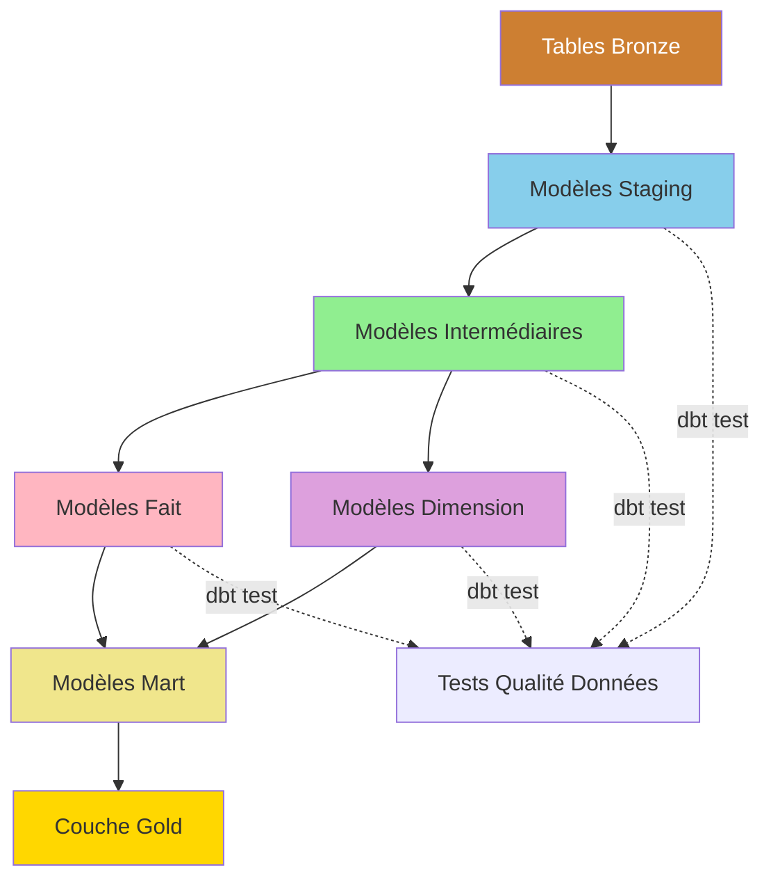

#### 変換パイプラインの例

```sql
-- models/staging/stg_customers.sql
-- Étape 1: Nettoyage et standardisation
WITH source AS (
    SELECT * FROM bronze.raw_customers
),

cleaned AS (
    SELECT
        customer_id,
        TRIM(UPPER(name)) AS customer_name,
        LOWER(email) AS email,
        phone,
        address,
        city,
        state,
        zip_code,
        created_at,
        updated_at
    FROM source
    WHERE customer_id IS NOT NULL
)

SELECT * FROM cleaned;
```

```sql
-- models/intermediate/int_customer_orders.sql
-- Étape 2: Jointure et enrichissement
WITH customers AS (
    SELECT * FROM {{ ref('stg_customers') }}
),

orders AS (
    SELECT * FROM {{ ref('stg_orders') }}
),

joined AS (
    SELECT
        c.customer_id,
        c.customer_name,
        c.email,
        o.order_id,
        o.order_date,
        o.amount,
        o.status
    FROM customers c
    INNER JOIN orders o
        ON c.customer_id = o.customer_id
)

SELECT * FROM joined;
```

```sql
-- models/marts/fct_customer_lifetime_value.sql
-- Étape 3: Agrégation pour métriques métier
WITH customer_orders AS (
    SELECT * FROM {{ ref('int_customer_orders') }}
),

metrics AS (
    SELECT
        customer_id,
        customer_name,
        email,
        COUNT(DISTINCT order_id) AS total_orders,
        SUM(amount) AS lifetime_value,
        AVG(amount) AS average_order_value,
        MIN(order_date) AS first_order_date,
        MAX(order_date) AS last_order_date,
        DATEDIFF('day', MIN(order_date), MAX(order_date)) AS customer_lifespan_days
    FROM customer_orders
    WHERE status = 'completed'
    GROUP BY customer_id, customer_name, email
)

SELECT * FROM metrics;
```

#### dbt の実行フロー

```bash
# Exécution pipeline complète
dbt run --select staging        # Exécuter modèles staging
dbt test --select staging       # Tester modèles staging
dbt run --select intermediate   # Exécuter modèles intermédiaires
dbt test --select intermediate  # Tester modèles intermédiaires
dbt run --select marts          # Exécuter modèles mart
dbt test --select marts         # Tester modèles mart

# Générer documentation
dbt docs generate
dbt docs serve
```

### データリネージのトレーサビリティ

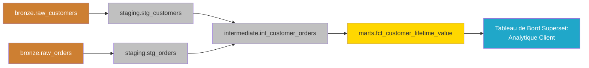

---

## プレゼンテーション層

### クエリ実行フロー

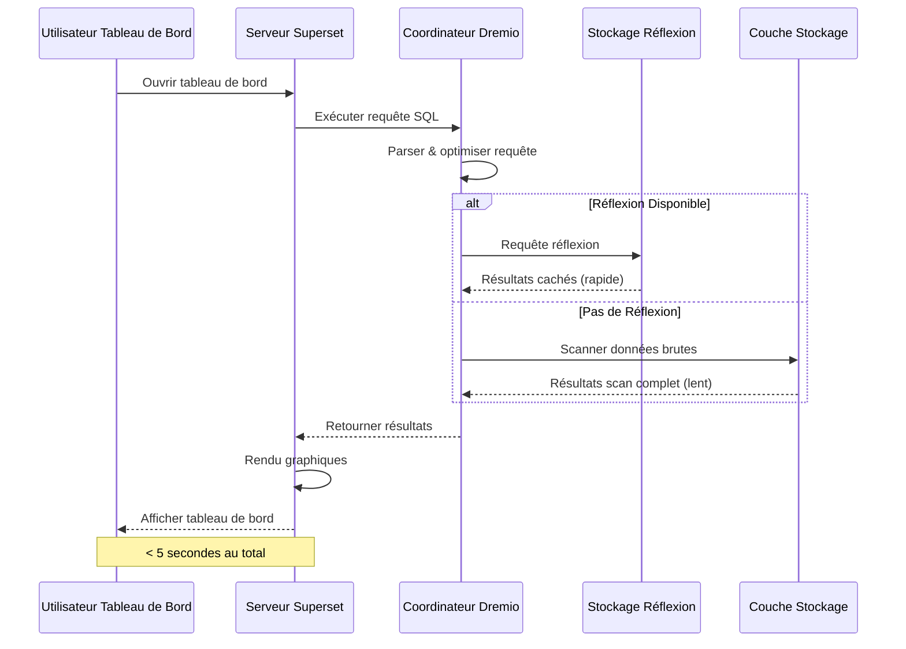

### API アクセス モデル

#### 1. スーパーセット ダッシュボード (BI インタラクティブ)

```python
# Superset exécute SQL via SQLAlchemy
from superset import db

query = """
SELECT 
    order_date,
    SUM(amount) as daily_revenue
FROM gold.fct_daily_revenue
WHERE order_date >= CURRENT_DATE - INTERVAL '30 days'
GROUP BY order_date
ORDER BY order_date
"""

results = db.session.execute(query)
```

#### 2. Arrow Flight API (高パフォーマンス)

```python
# Connexion Arrow Flight directe pour outils analytiques
from pyarrow import flight

client = flight.FlightClient("grpc://localhost:32010")

# Authentification
token = client.authenticate_basic_token("admin", "password123")

# Exécuter requête
descriptor = flight.FlightDescriptor.for_command(
    b"SELECT * FROM gold.customer_metrics LIMIT 1000"
)

flight_info = client.get_flight_info(descriptor)
reader = client.do_get(flight_info.endpoints[0].ticket)

# Lire comme Table Arrow (zero-copy)
table = reader.read_all()
df = table.to_pandas()
```

#### 3. REST API (外部統合)

```bash
# API REST Dremio pour automatisation
curl -X POST http://localhost:9047/api/v3/sql \
  -H "Authorization: Bearer $TOKEN" \
  -H "Content-Type: application/json" \
  -d '{
    "sql": "SELECT COUNT(*) FROM gold.customers"
  }'
```

---

## データ フロー モデル

### モデル 1: ETL バッチ パイプライン

```mermaid
gantt
    title Planification ETL Batch Quotidien
    dateFormat HH:mm
    axisFormat %H:%M
    
    section Ingestion
    Extraction Airbyte (PostgreSQL)     :01:00, 30m
    Extraction Airbyte (APIs)           :01:30, 45m
    
    section Chargement
    Chargement vers Bronze MinIO        :02:15, 15m
    
    section Transformation
    Modèles Staging dbt                 :02:30, 20m
    Modèles Intermédiaires dbt          :02:50, 30m
    Modèles Mart dbt                    :03:20, 40m
    
    section Tests
    Tests Qualité Données dbt           :04:00, 15m
    
    section Optimisation
    Rafraîchissement Réflexions Dremio  :04:15, 20m
    
    section Présentation
    Préchauffage Cache Tableau de Bord  :04:35, 10m
```

### モデル 2: リアルタイム ストリーミング


### パターン 3: 増分更新

```sql
-- Modèle incrémental dbt
{{ config(
    materialized='incremental',
    unique_key='order_id',
    on_schema_change='sync_all_columns'
) }}

SELECT
    order_id,
    customer_id,
    order_date,
    amount,
    status,
    updated_at
FROM {{ source('bronze', 'orders') }}


    -- Traiter uniquement les enregistrements nouveaux ou mis à jour
    WHERE updated_at > (SELECT MAX(updated_at) FROM {{ this }})

```

### モデル 4: Lambda アーキテクチャ (バッチ + ストリーム)

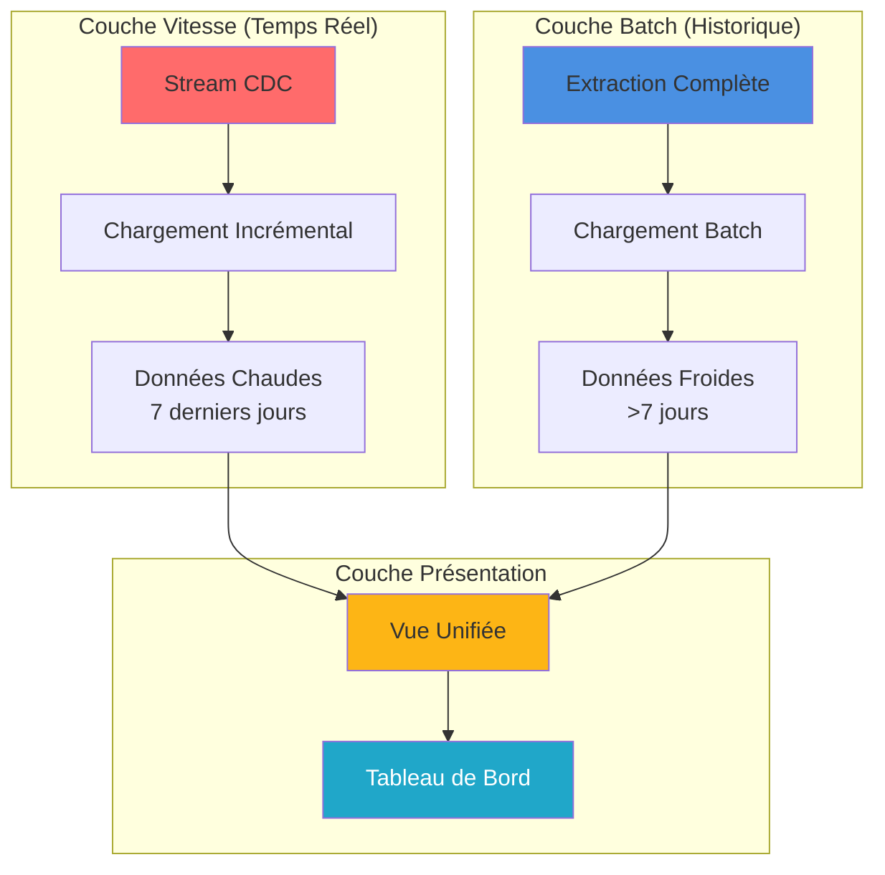

---

## パフォーマンスに関する考慮事項

### 取り込みの最適化

```yaml
# Configuration connexion Airbyte
sync_mode: incremental
destination_sync_mode: append_dedup
cursor_field: updated_at

# Ajustement performance
batch_size: 10000              # Enregistrements par batch
threads: 4                     # Workers parallèles
timeout_minutes: 60           # Timeout sync
retry_on_failure: true
max_retries: 3

# Optimisation réseau
compression: gzip
buffer_size_mb: 256
```

### ストレージの最適化

```python
# Options écriture Parquet pour compression optimale
import pyarrow.parquet as pq

pq.write_table(
    table,
    'output.parquet',
    compression='snappy',      # Compression rapide
    use_dictionary=True,       # Activer encodage dictionnaire
    row_group_size=1000000,    # 1M lignes par row group
    data_page_size=1048576,    # 1MB taille page
    write_statistics=True      # Activer statistiques pour pruning
)
```

### クエリの最適化

```sql
-- Bonnes pratiques requêtes Dremio

-- 1. Utiliser partition pruning
SELECT * FROM gold.orders
WHERE order_date >= '2025-10-01'  -- Élague partitions
  AND order_date < '2025-11-01';

-- 2. Exploiter les réflexions
-- Créer réflexion une fois, requêtes auto-accélérées
ALTER REFLECTION agg_orders SET ENABLED = TRUE;

-- 3. Utiliser column pruning
SELECT order_id, amount       -- Seulement colonnes nécessaires
FROM gold.orders
LIMIT 1000;

-- 4. Pousser les filtres
SELECT *
FROM gold.customers
WHERE state = 'CA'            -- Filtre poussé vers stockage
  AND lifetime_value > 1000;
```

### 変換の最適化

```sql
-- Techniques optimisation dbt

-- 1. Modèles incrémentaux pour grandes tables
{{ config(materialized='incremental') }}

-- 2. Tables partitionnées
{{ config(
    materialized='table',
    partition_by={
        'field': 'order_date',
        'data_type': 'date',
        'granularity': 'day'
    }
) }}

-- 3. Tables clusterisées pour meilleures jointures
{{ config(
    materialized='table',
    cluster_by=['customer_id']
) }}
```

### パフォーマンスのベンチマーク

|操作 |小規模データセット<br/>(100万行) |中規模のデータセット<br/>(1億行) |大規模なデータセット<br/>(1B 行) |
|----------------------------|----------------------------|----------------------------|----------------------------|
| **Airbyte を同期** | 2分 | 30分 | 5時間 |
| **dbt の実行** | 30秒 | 10分 | 2時間 |
| **建設の振り返り** | 10秒 | 5分 | 30分 |
| **ダッシュボード クエリ** | <100ms | <500ms | <2秒 |

---

## データ フローの監視

### 追跡すべき主要な指標

```yaml
# Configuration métriques Prometheus
metrics:
  ingestion:
    - airbyte_records_synced_total
    - airbyte_sync_duration_seconds
    - airbyte_sync_failures_total
    
  storage:
    - minio_disk_usage_bytes
    - minio_objects_total
    - postgres_connections_active
    
  processing:
    - dremio_query_duration_seconds
    - dremio_reflection_refresh_seconds
    - dbt_model_execution_time
    
  serving:
    - superset_dashboard_load_time
    - superset_query_cache_hit_rate
    - api_requests_per_second
```

### モニタリングダッシュボード

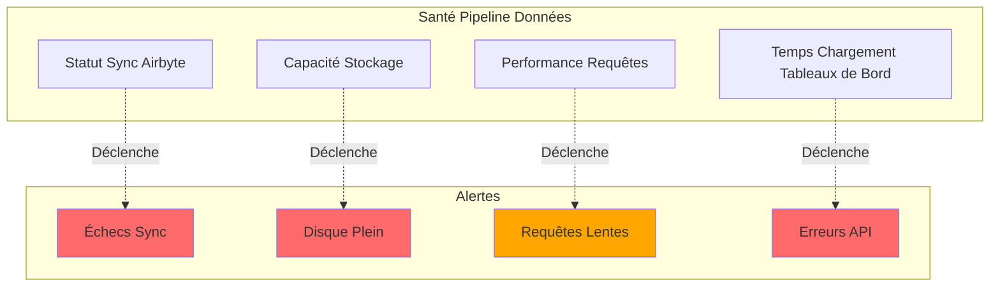

### ログの集約

```bash
# Requête Elasticsearch pour surveillance pipeline
curl -X GET "localhost:9200/airbyte-logs-*/_search" \
  -H 'Content-Type: application/json' \
  -d '{
    "query": {
      "bool": {
        "filter": [
          {"range": {"timestamp": {"gte": "now-1h"}}},
          {"term": {"level": "ERROR"}}
        ]
      }
    },
    "aggs": {
      "by_service": {
        "terms": {"field": "service"}
      }
    }
  }'
```

---

## ベストプラクティス

### データ フローの設計

1. **冪等性を考慮した設計**
   - 操作を安全に繰り返すことができることを保証する
   - 重複排除には一意のキーを使用する
   - 適切なエラー処理を実装する

2. **データ品質管理の実装**
   ```sql
   -- Exemple test dbt
   -- tests/assert_positive_amounts.sql
   SELECT *
   FROM {{ ref('fct_orders') }}
   WHERE amount <= 0
   ```

3. **大規模なデータセットの分割**
   ```python
   # Partitionner par date pour requêtes efficaces
   df.write.partitionBy('order_date').parquet('s3://bucket/orders/')
   ```

4. **適切な同期モードを使用する**
   - フルリフレッシュ: 小さなディメンションテーブル
   - インクリメンタル: 大きなファクト テーブル
   - CDC: リアルタイム要件

### パフォーマンス調整

1. **Airbyte 同期スケジュールの最適化**
   ```yaml
   # Équilibrer fraîcheur vs utilisation ressources
   small_tables:
     frequency: every_15_minutes
   
   large_tables:
     frequency: every_6_hours
   
   dimension_tables:
     frequency: daily
   ```

2. **戦略的思考を作成する**
   ```sql
   -- Focus sur agrégations fréquemment requêtées
   CREATE REFLECTION common_metrics
   ON gold.orders
   USING DIMENSIONS (product_id, date_trunc('day', order_date))
   MEASURES (SUM(amount), COUNT(*));
   ```

3. **dbt モデルの最適化**
   ```yaml
   # models/schema.yml
   models:
     - name: fct_large_table
       config:
         materialized: incremental
         incremental_strategy: merge
         unique_key: id
         partition_by: {field: date, data_type: date}
   ```

### 一般的な問題解決

|問題 |症状 |ソリューション |
|----------|----------|----------|
| **Airbyte 同期が遅い** |同期する時間 |バッチ サイズを増やし、増分モードを使用します。
| **メモリ不足** |失敗した dbt モデル |段階的にマテリアライズし、パーティショニングを追加します。
| **遅いクエリ** |タイムアウトダッシュボード |リフレクションを作成し、インデックスを追加します。
| **ストレージがいっぱいです** |書き込み失敗 |データ保持の実装、古いデータの圧縮 |
| **データが廃止されました** |古いメトリクス |同期頻度を増やし、スケジュールを確認する |

### 適切なセキュリティ慣行

1. **転送中のデータを暗号化**
   ```yaml
   # docker-compose.yml
   minio:
     environment:
       MINIO_SERVER_URL: https://minio:9000
       MINIO_BROWSER_REDIRECT_URL: https://console.minio.local
   ```

2. **アクセス制御の実装**
   ```sql
   -- ACLs Dremio
   GRANT SELECT ON gold.customer_metrics TO ROLE analyst;
   GRANT ALL ON bronze.* TO ROLE data_engineer;
   ```

3. **データアクセスの監査**
   ```json
   {
     "audit_log": {
       "enabled": true,
       "log_queries": true,
       "log_user_actions": true,
       "retention_days": 90
     }
   }
   ```

---

＃＃ まとめ

このドキュメントでは、完全なデータ フロー アーキテクチャについて詳しく説明します。

- **取り込みレイヤー**: Airbyte は、完全リフレッシュ、増分、または CDC を介してさまざまなソースからデータを抽出します。
- **ストレージ レイヤー**: MinIO、PostgreSQL、および Elasticsearch は、生のデータと処理されたデータを整理されたレイヤーに保存します
- **処理レイヤー**: Dremio はデータを仮想化し、dbt はステージング、中間、およびマート モデルを介してデータを変換します。
- **プレゼンテーション層**: スーパーセット ダッシュボードと API により、ビジネス対応データへのアクセスが提供されます。

覚えておくべき重要なポイント:
- データは明確に定義されたレイヤーを介して一方向に流れます
- 各コンポーネントには特定の役割とインターフェイスがあります
- リフレクション、パーティショニング、キャッシュを通じてパフォーマンスが最適化されます。
- 監視と可観測性が各レイヤーに統合されています
- 優れた実践により、信頼性、パフォーマンス、セキュリティが保証されます

**関連ドキュメント:**
- [アーキテクチャの概要](./overview.md)
- [コンポーネント](./components.md)
- [デプロイメント](./deployment.md)
- [Airbyte統合ガイド](../guides/airbyte-integration.md)
- [dbt 開発ガイド](../guides/dbt-development.md)

---

**バージョン**: 3.2.0  
**最終更新**: 2025 年 10 月 16 日