# デプロイメントアーキテクチャ

**バージョン**: 3.2.0  
**最終更新**: 2025 年 10 月 16 日  
**言語**: フランス語

＃＃ 目次

1. [概要](#overview)
2. [デプロイメントトポロジ](#deployment-topologies)
3. [Docker Compose デプロイメント](#docker-compose デプロイメント)
4. [Kubernetes デプロイメント](#kubernetes-deployment)
5. [クラウド展開](#cloud-deployments)
6. [高可用性構成](#high-availability-configuration)
7. [スケーリング戦略](#scaling-strategies)
8. [セキュリティ設定](#security-configuration)
9. [監視とロギング](#monitoring-and-logging)
10. [災害復旧](#disaster-recovery)
11. [グッドプラクティス](#good-practices)

---

＃＃ 概要

このドキュメントは、開発から運用まで、さまざまな環境にデータ プラットフォームを展開するための包括的なガイダンスを提供します。さまざまな導入トポロジ、オーケストレーション戦略、運用のベスト プラクティスについて説明します。

### 導入の目的

- **信頼性**: 運用ワークロードに対して 99.9% の稼働率
- **スケーラビリティ**: アーキテクチャを変更せずに 10 倍の成長を管理
- **セキュリティ**: 複数のセキュリティ層による多層防御
- **保守性**: 簡単なアップデートと構成管理
- **収益性**: リソースの使用を最適化します。

### 環境の種類

|環境 |目的 |スケール |可用性 |
|---------------|--------|-----------|--------------|
| **開発** |機能の開発、テスト |単一ノード | <95% |
| **ステージング** |実稼働前検証 |マルチノード | 95-99% |
| **生産** |ライブ データ ワークロード |クラスター化された | >99.9% |
| **DR** |災害復旧サイト |プロダクションミラー |スタンバイ |

---

## デプロイメントトポロジ

### トポロジ 1: 単一ホスト開発


**使用例**: ローカル開発、テスト、デモンストレーション

**仕様**:
- CPU: 4-8コア
- RAM: 16-32GB
- ディスク: 100-500 GB SSD
- ネットワーク: ローカルホストのみ

**利点**：
- シンプルな設定 (docker-compose up)
- 低コスト
- 迅速な反復

**短所**:
- 冗長性なし
- 限られたパフォーマンス
- 生産には適していません

### トポロジ 2: Docker Swarm マルチホスト


**使用例**: ステージングおよび小規模な運用環境のデプロイメント

**仕様**:
- マネージャー ノード: 3x (2 CPU、4 GB RAM)
- ワーカーノード: 3+ (8 ～ 16 CPU、32 ～ 64 GB RAM)
- データベース ノード: 1 ～ 2 (4 CPU、16 GB RAM、SSD)
- ストレージ ノード: 4+ (2 CPU、8 GB RAM、HDD/SSD)

**利点**：
- 高可用性
- 簡単なスケーリング
- 統合された負荷分散
- 健康状態の監視

**短所**:
- 単一ホストよりも複雑
- 共有ストレージまたはボリュームが必要です
- ネットワーク構成の複雑さ

### トポロジ 3: Kubernetes クラスター


**使用例**: 大規模な運用環境の展開

**仕様**:
- コントロール プレーン: 3 ノード以上 (マネージドまたはセルフホスト)
- ワーカーノード: 10 ノード以上 (16 ～ 32 CPU、64 ～ 128 GB RAM)
- ストレージ: CSI ドライバー (EBS、GCP PD、Azure ディスク)
- ネットワーク: CNI プラグイン (Calico、Cilium)

**利点**：
- エンタープライズレベルのオーケストレーション
- 自動スケーリングと修復
- 高度なネットワーク（サービスメッシュ）
- GitOps対応
- マルチテナントのサポート

**短所**:
- 複雑な構成と管理
- 急峻な学習曲線
- 運用上のオーバーヘッドが大きい

---

## Docker Compose のデプロイメント

### 開発環境

ローカル開発のための `docker-compose.yml` 標準:

```yaml
version: '3.8'

services:
  # Airbyte Platform
  airbyte-server:
    image: airbyte/server:0.50.33
    container_name: airbyte-server
    ports:
      - "8001:8001"
    environment:
      - DATABASE_USER=airbyte
      - DATABASE_PASSWORD=airbyte
      - DATABASE_DB=airbyte
      - DATABASE_HOST=postgres
      - DATABASE_PORT=5432
      - WORKSPACE_ROOT=/tmp/workspace
      - CONFIG_ROOT=/data
      - TRACKING_STRATEGY=logging
    volumes:
      - airbyte-data:/data
      - airbyte-workspace:/tmp/workspace
    depends_on:
      - postgres
    networks:
      - data-platform

  airbyte-webapp:
    image: airbyte/webapp:0.50.33
    container_name: airbyte-webapp
    ports:
      - "8000:80"
    environment:
      - AIRBYTE_SERVER_HOST=airbyte-server
      - AIRBYTE_SERVER_PORT=8001
    depends_on:
      - airbyte-server
    networks:
      - data-platform

  airbyte-worker:
    image: airbyte/worker:0.50.33
    container_name: airbyte-worker
    environment:
      - DATABASE_USER=airbyte
      - DATABASE_PASSWORD=airbyte
      - DATABASE_DB=airbyte
      - DATABASE_HOST=postgres
      - DATABASE_PORT=5432
      - WORKSPACE_ROOT=/tmp/workspace
      - LOCAL_ROOT=/tmp/airbyte_local
    volumes:
      - airbyte-workspace:/tmp/workspace
      - /var/run/docker.sock:/var/run/docker.sock
    depends_on:
      - postgres
      - airbyte-server
    networks:
      - data-platform

  # Dremio Lakehouse
  dremio:
    image: dremio/dremio-oss:26.0
    container_name: dremio
    ports:
      - "9047:9047"   # Web UI
      - "31010:31010" # ODBC/JDBC
      - "32010:32010" # Arrow Flight
    environment:
      - DREMIO_JAVA_SERVER_EXTRA_OPTS=-Xms2g -Xmx4g
    volumes:
      - dremio-data:/opt/dremio/data
      - ./config/dremio.conf:/opt/dremio/conf/dremio.conf
    networks:
      - data-platform

  # Apache Superset
  superset:
    image: apache/superset:3.0.0
    container_name: superset
    ports:
      - "8088:8088"
    environment:
      - SUPERSET_SECRET_KEY=your-secret-key-here
      - SUPERSET_LOAD_EXAMPLES=yes
    volumes:
      - superset-data:/app/superset_home
    command: >
      sh -c "superset db upgrade &&
             superset fab create-admin 
               --username admin 
               --firstname Admin 
               --lastname User 
               --email admin@example.com 
               --password admin &&
             superset init &&
             superset run -h 0.0.0.0 -p 8088"
    depends_on:
      - postgres
    networks:
      - data-platform

  # PostgreSQL Database
  postgres:
    image: postgres:16
    container_name: postgres
    ports:
      - "5432:5432"
    environment:
      - POSTGRES_USER=postgres
      - POSTGRES_PASSWORD=postgres
      - POSTGRES_DB=postgres
      - PGDATA=/var/lib/postgresql/data/pgdata
    volumes:
      - postgres-data:/var/lib/postgresql/data
      - ./scripts/init-databases.sql:/docker-entrypoint-initdb.d/init.sql
    networks:
      - data-platform
    healthcheck:
      test: ["CMD-SHELL", "pg_isready -U postgres"]
      interval: 10s
      timeout: 5s
      retries: 5

  # MinIO Object Storage
  minio:
    image: minio/minio:latest
    container_name: minio
    ports:
      - "9000:9000"  # API
      - "9001:9001"  # Console
    environment:
      - MINIO_ROOT_USER=minioadmin
      - MINIO_ROOT_PASSWORD=minioadmin
    volumes:
      - minio-data:/data
    command: server /data --console-address ":9001"
    networks:
      - data-platform
    healthcheck:
      test: ["CMD", "curl", "-f", "http://localhost:9000/minio/health/live"]
      interval: 30s
      timeout: 20s
      retries: 3

  # Elasticsearch
  elasticsearch:
    image: docker.elastic.co/elasticsearch/elasticsearch:8.15.0
    container_name: elasticsearch
    ports:
      - "9200:9200"
      - "9300:9300"
    environment:
      - discovery.type=single-node
      - xpack.security.enabled=false
      - "ES_JAVA_OPTS=-Xms1g -Xmx1g"
    volumes:
      - es-data:/usr/share/elasticsearch/data
    networks:
      - data-platform
    healthcheck:
      test: ["CMD-SHELL", "curl -f http://localhost:9200/_cluster/health || exit 1"]
      interval: 30s
      timeout: 10s
      retries: 5

volumes:
  airbyte-data:
  airbyte-workspace:
  dremio-data:
  superset-data:
  postgres-data:
  minio-data:
  es-data:

networks:
  data-platform:
    driver: bridge
```

### Docker Compose 本番環境のオーバーヘッド

```yaml
# docker-compose.prod.yml
version: '3.8'

services:
  # Surcharge avec paramètres production
  dremio:
    environment:
      - DREMIO_JAVA_SERVER_EXTRA_OPTS=-Xms8g -Xmx16g
    deploy:
      resources:
        limits:
          cpus: '8'
          memory: 16G
        reservations:
          cpus: '4'
          memory: 8G

  postgres:
    environment:
      - POSTGRES_PASSWORD=${POSTGRES_PASSWORD}  # Depuis .env
    volumes:
      - /mnt/data/postgres:/var/lib/postgresql/data
    deploy:
      resources:
        limits:
          cpus: '4'
          memory: 8G

  minio:
    environment:
      - MINIO_ROOT_USER=${MINIO_ROOT_USER}
      - MINIO_ROOT_PASSWORD=${MINIO_ROOT_PASSWORD}
    volumes:
      - /mnt/data/minio:/data
    deploy:
      replicas: 4  # MinIO distribué
      resources:
        limits:
          cpus: '2'
          memory: 4G
```

**本番環境へのデプロイ**:
```bash
docker-compose -f docker-compose.yml -f docker-compose.prod.yml up -d
```

---

## Kubernetes のデプロイメント

### 名前空間の構成

```yaml
# namespaces.yaml
apiVersion: v1
kind: Namespace
metadata:
  name: data-platform
  labels:
    name: data-platform
    environment: production
---
apiVersion: v1
kind: Namespace
metadata:
  name: data-storage
  labels:
    name: data-storage
    environment: production
```

### Airbyte の展開

```yaml
# airbyte-deployment.yaml
apiVersion: apps/v1
kind: Deployment
metadata:
  name: airbyte-server
  namespace: data-platform
spec:
  replicas: 2
  selector:
    matchLabels:
      app: airbyte-server
  template:
    metadata:
      labels:
        app: airbyte-server
    spec:
      containers:
      - name: server
        image: airbyte/server:0.50.33
        ports:
        - containerPort: 8001
        env:
        - name: DATABASE_USER
          valueFrom:
            secretKeyRef:
              name: airbyte-secrets
              key: db-user
        - name: DATABASE_PASSWORD
          valueFrom:
            secretKeyRef:
              name: airbyte-secrets
              key: db-password
        - name: DATABASE_HOST
          value: postgres-service.data-storage.svc.cluster.local
        resources:
          requests:
            memory: "1Gi"
            cpu: "500m"
          limits:
            memory: "2Gi"
            cpu: "1000m"
        livenessProbe:
          httpGet:
            path: /health
            port: 8001
          initialDelaySeconds: 60
          periodSeconds: 30
        readinessProbe:
          httpGet:
            path: /health
            port: 8001
          initialDelaySeconds: 30
          periodSeconds: 10
---
apiVersion: v1
kind: Service
metadata:
  name: airbyte-server
  namespace: data-platform
spec:
  selector:
    app: airbyte-server
  ports:
  - protocol: TCP
    port: 8001
    targetPort: 8001
  type: ClusterIP
```

### ステートフルセット Dremio

```yaml
# dremio-statefulset.yaml
apiVersion: apps/v1
kind: StatefulSet
metadata:
  name: dremio-executor
  namespace: data-platform
spec:
  serviceName: dremio-executor
  replicas: 3
  selector:
    matchLabels:
      app: dremio
      role: executor
  template:
    metadata:
      labels:
        app: dremio
        role: executor
    spec:
      containers:
      - name: dremio
        image: dremio/dremio-oss:26.0
        ports:
        - containerPort: 9047
        - containerPort: 31010
        - containerPort: 32010
        env:
        - name: DREMIO_JAVA_SERVER_EXTRA_OPTS
          value: "-Xms8g -Xmx16g"
        - name: DREMIO_COORDINATOR
          value: "false"
        - name: DREMIO_MASTER_HOST
          value: dremio-coordinator.data-platform.svc.cluster.local
        resources:
          requests:
            memory: "16Gi"
            cpu: "4000m"
          limits:
            memory: "32Gi"
            cpu: "8000m"
        volumeMounts:
        - name: dremio-data
          mountPath: /opt/dremio/data
  volumeClaimTemplates:
  - metadata:
      name: dremio-data
    spec:
      accessModes: ["ReadWriteOnce"]
      storageClassName: fast-ssd
      resources:
        requests:
          storage: 100Gi
```

### 水平ポッドオートスケーラー

```yaml
# hpa.yaml
apiVersion: autoscaling/v2
kind: HorizontalPodAutoscaler
metadata:
  name: airbyte-worker-hpa
  namespace: data-platform
spec:
  scaleTargetRef:
    apiVersion: apps/v1
    kind: Deployment
    name: airbyte-worker
  minReplicas: 2
  maxReplicas: 10
  metrics:
  - type: Resource
    resource:
      name: cpu
      target:
        type: Utilization
        averageUtilization: 70
  - type: Resource
    resource:
      name: memory
      target:
        type: Utilization
        averageUtilization: 80
  behavior:
    scaleUp:
      stabilizationWindowSeconds: 60
      policies:
      - type: Percent
        value: 100
        periodSeconds: 60
    scaleDown:
      stabilizationWindowSeconds: 300
      policies:
      - type: Pods
        value: 1
        periodSeconds: 60
```

### Ingress のセットアップ

```yaml
# ingress.yaml
apiVersion: networking.k8s.io/v1
kind: Ingress
metadata:
  name: data-platform-ingress
  namespace: data-platform
  annotations:
    kubernetes.io/ingress.class: nginx
    cert-manager.io/cluster-issuer: letsencrypt-prod
    nginx.ingress.kubernetes.io/ssl-redirect: "true"
    nginx.ingress.kubernetes.io/proxy-body-size: "500m"
spec:
  tls:
  - hosts:
    - airbyte.example.com
    - dremio.example.com
    - superset.example.com
    secretName: data-platform-tls
  rules:
  - host: airbyte.example.com
    http:
      paths:
      - path: /
        pathType: Prefix
        backend:
          service:
            name: airbyte-webapp
            port:
              number: 80
  - host: dremio.example.com
    http:
      paths:
      - path: /
        pathType: Prefix
        backend:
          service:
            name: dremio-coordinator
            port:
              number: 9047
  - host: superset.example.com
    http:
      paths:
      - path: /
        pathType: Prefix
        backend:
          service:
            name: superset-web
            port:
              number: 8088
```

### 永続ストレージ

```yaml
# storage-class.yaml
apiVersion: storage.k8s.io/v1
kind: StorageClass
metadata:
  name: fast-ssd
provisioner: kubernetes.io/aws-ebs
parameters:
  type: gp3
  iops: "3000"
  throughput: "125"
  fsType: ext4
allowVolumeExpansion: true
volumeBindingMode: WaitForFirstConsumer
---
apiVersion: storage.k8s.io/v1
kind: StorageClass
metadata:
  name: standard
provisioner: kubernetes.io/aws-ebs
parameters:
  type: gp2
  fsType: ext4
allowVolumeExpansion: true
volumeBindingMode: WaitForFirstConsumer
```

---

## クラウド展開

### AWS アーキテクチャ


**使用される AWS サービス**:
- **EKS**: マネージド Kubernetes クラスター
- **RDS**: メタデータ用の PostgreSQL マルチ AZ
- **S3**: データレイク用のオブジェクト ストレージ
- **ALB**: ロードバランサアプリケーション
- **CloudWatch**: モニタリングとロギング
- **Secret Manager**: 識別子の管理
- **ECR**: コンテナレジスタ
- **VPC**: ネットワーク分離

**テラフォームの例**:
```hcl
# main.tf
module "eks" {
  source  = "terraform-aws-modules/eks/aws"
  version = "~> 19.0"

  cluster_name    = "data-platform-prod"
  cluster_version = "1.27"

  vpc_id     = module.vpc.vpc_id
  subnet_ids = module.vpc.private_subnets

  eks_managed_node_groups = {
    general = {
      min_size     = 3
      max_size     = 10
      desired_size = 5

      instance_types = ["m5.2xlarge"]
      capacity_type  = "ON_DEMAND"
    }
  }
}

module "rds" {
  source = "terraform-aws-modules/rds/aws"

  identifier = "data-platform-db"

  engine               = "postgres"
  engine_version       = "16.1"
  family               = "postgres16"
  major_engine_version = "16"
  instance_class       = "db.r6g.xlarge"

  allocated_storage     = 100
  max_allocated_storage = 1000

  multi_az               = true
  db_subnet_group_name   = module.vpc.database_subnet_group
  vpc_security_group_ids = [module.security_group.security_group_id]

  backup_retention_period = 30
  backup_window          = "03:00-04:00"
  maintenance_window     = "sun:04:00-sun:05:00"
}

module "s3_bucket" {
  source = "terraform-aws-modules/s3-bucket/aws"

  bucket = "data-platform-datalake-prod"

  versioning = {
    enabled = true
  }

  lifecycle_rule = [
    {
      id      = "bronze-to-glacier"
      enabled = true

      transition = [
        {
          days          = 90
          storage_class = "GLACIER"
        }
      ]
    }
  ]
}
```

### Azure アーキテクチャ

**Azure サービス**:
- **AKS**: Azure Kubernetes サービス
- **Azure Database for PostgreSQL**: 柔軟なサーバー
- **Azure Blob Storage**: データ レイク Gen2
- **アプリケーション ゲートウェイ**: ロード バランサー
- **Azure Monitor**: 監視とログ記録
- **Key Vault**: シークレット管理
- **ACR**: Azure Container Registry

### GCP アーキテクチャ

**GCP サービス**:
- **GKE**: Google Kubernetes Engine
- **Cloud SQL**: HA を備えた PostgreSQL
- **クラウド ストレージ**: オブジェクト ストレージ
- **クラウド ロード バランシング**: グローバル ロード バランサー
- **Cloud Logging**: 一元化されたロギング
- **シークレットマネージャー**: 識別子管理
- **アーティファクト レジストリ**: コンテナ レジストリ

---

## 高可用性構成

### 高可用性データベース


**PostgreSQL HA 構成**:
```yaml
# postgresql.conf pour primaire
wal_level = replica
max_wal_senders = 10
wal_keep_size = 1GB
synchronous_commit = on
synchronous_standby_names = 'standby1'

# pg_hba.conf
host replication replicator standby1-ip/32 md5
host replication replicator standby2-ip/32 md5
```

### 分散型 MinIO 構成

```bash
# MinIO distribué 4 nœuds
docker run -d \
  -p 9000:9000 -p 9001:9001 \
  -e "MINIO_ROOT_USER=admin" \
  -e "MINIO_ROOT_PASSWORD=password" \
  minio/minio server \
  http://minio-{1...4}.example.com/data{1...4} \
  --console-address ":9001"
```

**イレイジャー コーディング**: MinIO は、イレイジャー コーディング (4 ノード以上の場合は EC:4) でデータを自動的に保護します。

### Dremio クラスター構成

```conf
# dremio.conf pour coordinateur
coordinator.enabled: true
coordinator.master.enabled: true

# dremio.conf pour exécuteur
coordinator.enabled: false
executor.enabled: true

# Connexion au coordinateur
zookeeper: "coordinator1:2181,coordinator2:2181,coordinator3:2181"
```

---

## スケーリング戦略

### 垂直スケーリング

**使用する場合**: リソース制限に達した固有のコンポーネント

|コンポーネント |イニシャル |拡大縮小 |改善 |
|----------|-----------|------|----------|
|ドレミオ・エグゼキューター | 8 CPU、16 GB | 16 CPU、32 GB | 2 倍のクエリ パフォーマンス |
|ポストグレSQL | 4 CPU、8 GB | 8 CPU、16 GB | 2x トランザクション デビット |
|ワーカーエアバイト | 2 CPU、4 GB | 4 CPU、8 GB | 2x 同期並列処理 |

```yaml
# Mise à jour ressources Kubernetes
kubectl set resources deployment airbyte-worker \
  --limits=cpu=4,memory=8Gi \
  --requests=cpu=2,memory=4Gi
```

### 水平方向のスケーリング

**使用する場合**: より多くの同時ワークロードを処理する必要がある場合

```yaml
# Mettre à l'échelle exécuteurs Dremio
kubectl scale statefulset dremio-executor --replicas=6

# Mettre à l'échelle workers Airbyte
kubectl scale deployment airbyte-worker --replicas=5

# Mettre à l'échelle serveurs web Superset
kubectl scale deployment superset-web --replicas=4
```

**自動スケーリング ポリシー**:
```yaml
# Cibler 70% utilisation CPU
kubectl autoscale deployment airbyte-worker \
  --cpu-percent=70 \
  --min=2 \
  --max=10
```

### ストレージのスケーリング

**MinIO**: 分散クラスターにノードを追加します
```bash
# Étendre de 4 à 8 nœuds
minio server \
  http://minio-{1...8}.example.com/data{1...4}
```

**PostgreSQL**: プーリング接続を使用する (PgBouncer)
```ini
# pgbouncer.ini
[databases]
* = host=postgres port=5432

[pgbouncer]
listen_addr = *
listen_port = 6432
max_client_conn = 1000
default_pool_size = 25
```

---

## セキュリティ構成

### ネットワークセキュリティ

```yaml
# NetworkPolicy: Restreindre trafic
apiVersion: networking.k8s.io/v1
kind: NetworkPolicy
metadata:
  name: data-platform-network-policy
  namespace: data-platform
spec:
  podSelector:
    matchLabels:
      app: dremio
  policyTypes:
  - Ingress
  - Egress
  ingress:
  - from:
    - podSelector:
        matchLabels:
          app: superset
    - podSelector:
        matchLabels:
          app: airbyte
    ports:
    - protocol: TCP
      port: 9047
    - protocol: TCP
      port: 32010
  egress:
  - to:
    - podSelector:
        matchLabels:
          app: postgres
    ports:
    - protocol: TCP
      port: 5432
  - to:
    - podSelector:
        matchLabels:
          app: minio
    ports:
    - protocol: TCP
      port: 9000
```

### 機密管理

```yaml
# Secret Kubernetes
apiVersion: v1
kind: Secret
metadata:
  name: data-platform-secrets
  namespace: data-platform
type: Opaque
stringData:
  postgres-password: "change-me-in-production"
  minio-root-password: "change-me-in-production"
  superset-secret-key: "change-me-in-production"
---
# Utiliser dans déploiement
env:
- name: POSTGRES_PASSWORD
  valueFrom:
    secretKeyRef:
      name: data-platform-secrets
      key: postgres-password
```

**外部シークレット オペレーター** (運用環境に推奨):
```yaml
apiVersion: external-secrets.io/v1beta1
kind: ExternalSecret
metadata:
  name: data-platform-secrets
spec:
  secretStoreRef:
    name: aws-secrets-manager
    kind: SecretStore
  target:
    name: data-platform-secrets
  data:
  - secretKey: postgres-password
    remoteRef:
      key: prod/data-platform/postgres
      property: password
```

### TLS/SSL 構成

```yaml
# Certificat cert-manager
apiVersion: cert-manager.io/v1
kind: Certificate
metadata:
  name: data-platform-tls
  namespace: data-platform
spec:
  secretName: data-platform-tls
  issuerRef:
    name: letsencrypt-prod
    kind: ClusterIssuer
  dnsNames:
  - airbyte.example.com
  - dremio.example.com
  - superset.example.com
```

---

## 監視とロギング

### プロメテウスのメトリクス

```yaml
# ServiceMonitor pour Dremio
apiVersion: monitoring.coreos.com/v1
kind: ServiceMonitor
metadata:
  name: dremio-metrics
  namespace: data-platform
spec:
  selector:
    matchLabels:
      app: dremio
  endpoints:
  - port: metrics
    interval: 30s
    path: /metrics
```

### Grafana ダッシュボード

**主要な指標**:
- Airbyte: 同期成功率、同期録音、同期期間
- Dremio: リクエストの数、リクエストの期間、反映の鮮度
- PostgreSQL: 接続数、トランザクション率、キャッシュヒット率
- MinIO: リクエストレート、帯域幅、エラーレート

### 集中ログ

```yaml
# DaemonSet Fluentd
apiVersion: apps/v1
kind: DaemonSet
metadata:
  name: fluentd
  namespace: kube-system
spec:
  selector:
    matchLabels:
      app: fluentd
  template:
    metadata:
      labels:
        app: fluentd
    spec:
      containers:
      - name: fluentd
        image: fluent/fluentd-kubernetes-daemonset:v1-debian-elasticsearch
        env:
        - name: FLUENT_ELASTICSEARCH_HOST
          value: "elasticsearch.data-storage.svc.cluster.local"
        - name: FLUENT_ELASTICSEARCH_PORT
          value: "9200"
        volumeMounts:
        - name: varlog
          mountPath: /var/log
        - name: varlibdockercontainers
          mountPath: /var/lib/docker/containers
          readOnly: true
      volumes:
      - name: varlog
        hostPath:
          path: /var/log
      - name: varlibdockercontainers
        hostPath:
          path: /var/lib/docker/containers
```

---

## 災害復旧

### バックアップ戦略

```mermaid
gantt
    title Planification Sauvegarde
    dateFormat HH:mm
    axisFormat %H:%M
    
    section Base de Données
    Sauvegarde Complète           :00:00, 2h
    Sauvegarde Incrémentielle     :06:00, 30m
    Sauvegarde Incrémentielle     :12:00, 30m
    Sauvegarde Incrémentielle     :18:00, 30m
    
    section Stockage Objet
    Snapshot Quotidien            :01:00, 1h
    
    section Métadonnées
    Sauvegarde Configuration      :02:00, 30m
```



**PostgreSQL バックアップ**:
```bash
# Sauvegarde complète avec pg_basebackup
pg_basebackup -h postgres -U postgres -D /backup/full -Ft -z -P

# Archivage continu (WAL)
archive_mode = on
archive_command = 'cp %p /backup/wal/%f'
```

**MinIO バックアップ**:
```bash
# Réplication bucket vers site DR
mc admin bucket remote add minio/datalake \
  https://dr-minio.example.com/datalake \
  --service replication

mc replicate add minio/datalake \
  --remote-bucket datalake \
  --replicate delete,delete-marker
```

### 回復手順

**RTO/RPO の目標**:
|環境 | RTO (目標復旧時間) | RPO (目標復旧時点) |
|--------------|--------------------------------------------|----------------------------|
|開発 | 24時間 | 24時間 |
|ステージング | 4時間 | 4時間 |
|制作 | 1時間 | 15分 |

**回復手順**:
1. 障害の範囲を評価する
2. 最後のバックアップからデータベースを復元する
3. 障害発生時点までの WAL ログを適用する
4. スナップショットからオブジェクトストレージを復元する
5. 依存関係の順序でサービスを再起動します
6. データの整合性をチェックする
7. 業務再開

---

## ベストプラクティス

### 導入チェックリスト

- [ ] インフラストラクチャをコードとして使用する (Terraform/Helm)
- [ ] GitOps ワークフローの実装 (ArgoCD/Flux)
- [ ] すべてのサービスのヘルスチェックを構成します
- [ ] リソース制限とリクエストを定義します
- [ ] 必要に応じて自動スケーリングを有効にします
- [ ] ネットワークポリシーを実装する
- [ ] 外部シークレット管理を使用する
- [ ] すべての外部エンドポイントに対して TLS を構成します
- [ ] 監視とアラートを設定します
- [ ] ログ集計の実装
- [ ] 自動バックアップを構成する
- [ ] 災害復旧手順をテストする
- [ ] 一般的な問題に関する文書化された運用手順書
- [ ] CI/CD パイプラインをセットアップする
- [ ] Blue-Green または Canary デプロイメントを実装する

### パフォーマンス調整

**ドレミオ**:
```conf
# Augmenter mémoire pour grandes requêtes
services.coordinator.master.heap_memory_mb: 16384
services.executor.heap_memory_mb: 32768

# Ajuster rafraîchissement réflexion
reflection.refresh.threads: 8
reflection.refresh.schedule.interval: 3600000  # 1 heure
```

**PostgreSQL**:
```conf
# Optimiser pour charge de travail lecture intensive
shared_buffers = 4GB
effective_cache_size = 12GB
work_mem = 64MB
maintenance_work_mem = 1GB

# Pooling connexions
max_connections = 200
```

**MinIO**:
```bash
# Définir classe stockage optimale pour objets
mc mb --with-lock minio/datalake
mc retention set --default GOVERNANCE 30d minio/datalake
```

### コストの最適化

1. **リソースのサイズを正しく設定する**: 実際の使用量を監視し、制限を調整します
2. **スポット/プリエンプティブル インスタンスを使用する**: 非クリティカルなワークロードの場合
3. **データ ライフサイクル ポリシーの実装**: コールド データをより安価なストレージ レベルに移動します。
4. **リソースのスケーリングを計画する**: オフピーク時間中に削減します
5. **リザーブドインスタンスを使用**: 基本容量の場合 (40 ～ 60% の節約)

---

＃＃ まとめ

この導入アーキテクチャ ガイドでは以下について説明します。

- **トポロジ**: 単一ホスト開発、マルチホスト Docker Swarm、Kubernetes クラスター
- **オーケストレーション**: 開発用には Docker Compose、本番用には Kubernetes
- **クラウド デプロイメント**: AWS、Azure、GCP リファレンス アーキテクチャ
- **高可用性**: データベース レプリケーション、分散ストレージ、クラスター化サービス
- **スケーリング**: 自動スケーリングを使用した垂直および水平スケーリング戦略
- **セキュリティ**: ネットワーク ポリシー、シークレット管理、TLS/SSL 構成
- **モニタリング**: Prometheus メトリクス、Grafana ダッシュボード、集中ログ
- **災害復旧**: バックアップ戦略、RTO/RPO 目標、復旧手順

覚えておくべき重要なポイント:
- シンプル (単一ホスト) で開始し、必要に応じて拡張します
- Kubernetes は本番環境にさらなる柔軟性を提供します
- 初日から完全なモニタリングを実装
- コードとしてのインフラストラクチャを使用してすべてを自動化します
- 災害復旧手順を定期的にテストします

**関連ドキュメント:**
- [アーキテクチャの概要](./overview.md)
- [コンポーネント](./components.md)
- [データフロー](./data-flow.md)
- [インストールガイド](../getting-started/installation.md)

---

**バージョン**: 3.2.0  
**最終更新**: 2025 年 10 月 16 日