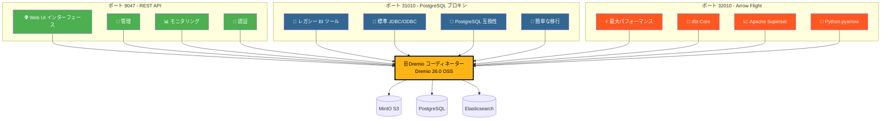
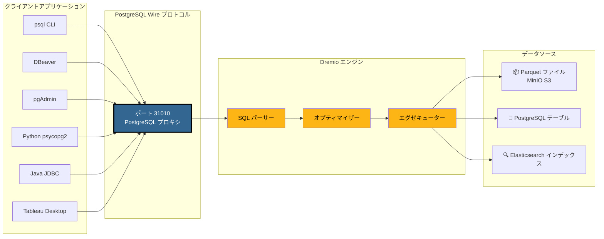
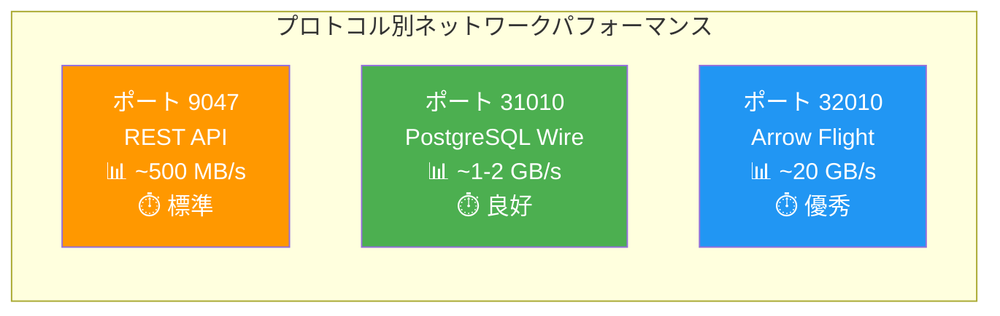
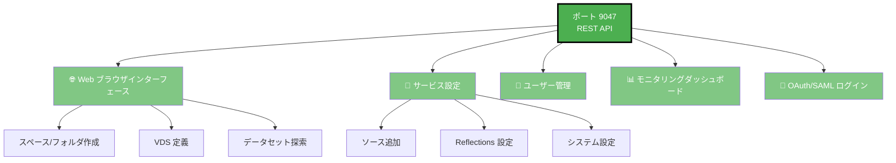
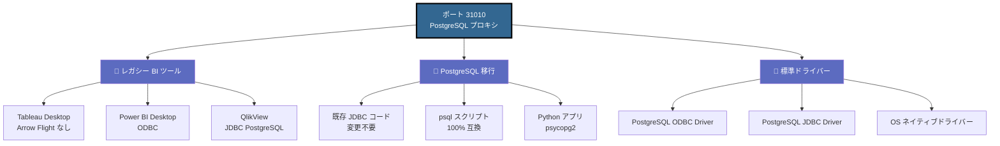
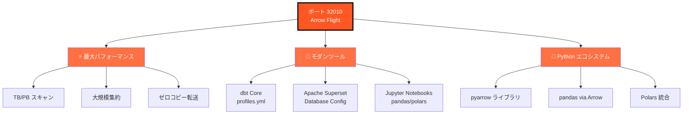
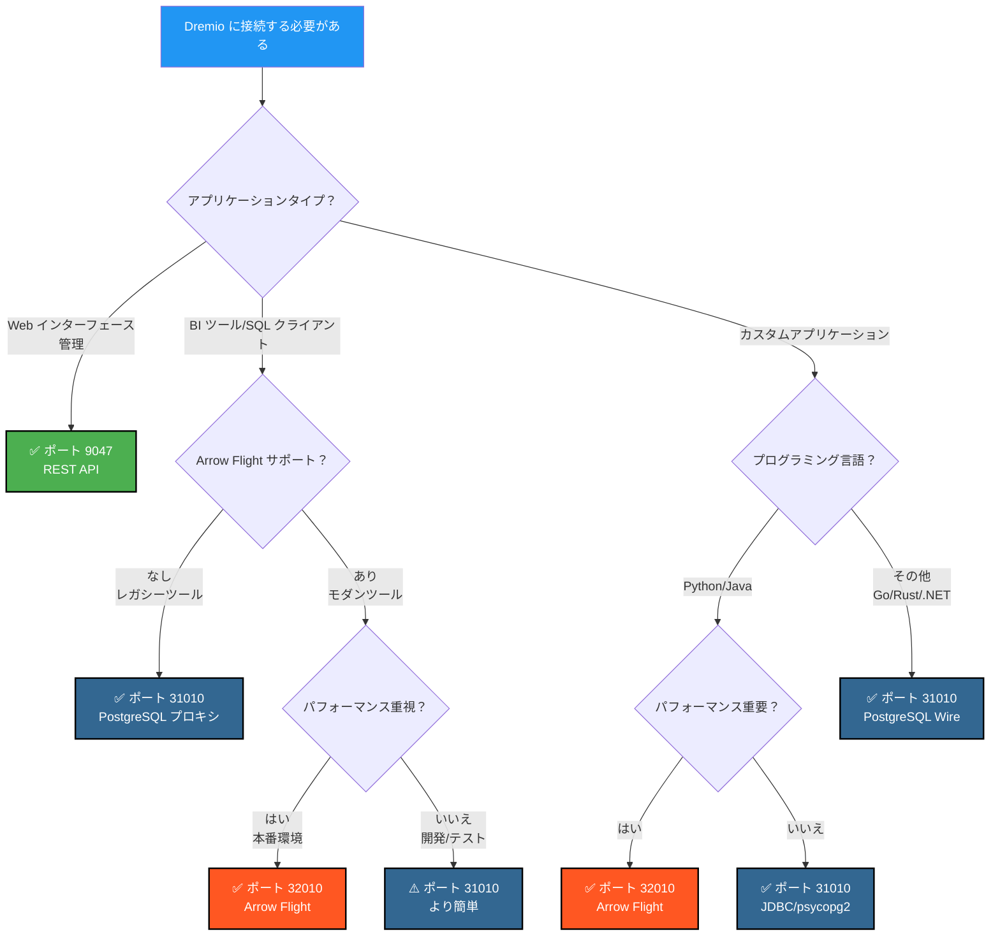
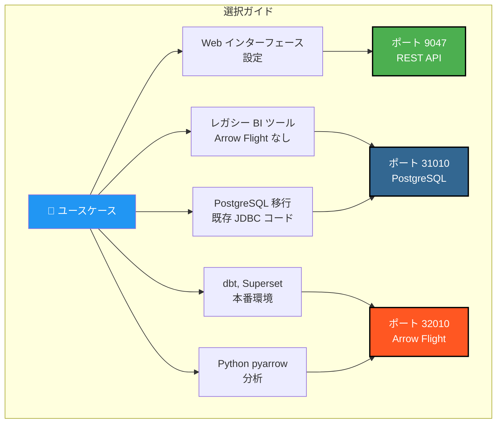

# Dremio ポート ビジュアルガイド

**バージョン**: 3.2.5  
**最終更新**: 2025年10月16日  
**言語**: 日本語

---

## Dremio の 3 つのポート概要



---

## PostgreSQL プロキシ詳細アーキテクチャ

### クライアント → Dremio 接続フロー



---

## パフォーマンス比較

### ベンチマーク: 100 GB データスキャン

```mermaid
gantt
    title プロトコル別実行時間（秒）
    dateFormat X
    axisFormat %s 秒
    
    section REST API :9047
    100 GB 転送     :0, 180
    
    section PostgreSQL :31010
    100 GB 転送     :0, 90
    
    section Arrow Flight :32010
    100 GB 転送     :0, 5
```



### データスループット



### シンプルクエリのレイテンシ

| プロトコル | ポート | 平均レイテンシ | ネットワークオーバーヘッド |
|----------|------|----------------|------------------|
| **REST API** | 9047 | 50-100 ms | JSON（冗長） |
| **PostgreSQL プロキシ** | 31010 | 20-50 ms | Wire Protocol（コンパクト） |
| **Arrow Flight** | 32010 | 5-10 ms | Apache Arrow（バイナリカラムナ） |

---

## ポート別ユースケース

### ポート 9047 - REST API



### ポート 31010 - PostgreSQL プロキシ



### ポート 32010 - Arrow Flight



---

## デシジョンツリー: どのポートを使う？



---

## PostgreSQL プロキシ接続例

### 1. psql CLI

```bash
# シンプル接続
psql -h localhost -p 31010 -U admin -d datalake

# ダイレクトクエリ
psql -h localhost -p 31010 -U admin -d datalake \
  -c "SELECT COUNT(*) FROM MinIO.datalake.customers;"

# インタラクティブモード
$ psql -h localhost -p 31010 -U admin -d datalake
Password for user admin: ****
psql (16.0, server 26.0)
Type "help" for help.

datalake=> \dt
           List of relations
 Schema |   Name    | Type  | Owner 
--------+-----------+-------+-------
 public | customers | table | admin
 public | orders    | table | admin
(2 rows)

datalake=> SELECT customer_id, name, state FROM customers LIMIT 5;
```

### 2. DBeaver 設定

```yaml
接続タイプ: PostgreSQL
接続名: Dremio via PostgreSQL Proxy

メイン:
  ホスト: localhost
  ポート: 31010
  データベース: datalake
  ユーザー名: admin
  パスワード: [your-password]
  
ドライバープロパティ:
  ssl: false
  
詳細設定:
  接続タイムアウト: 30000
  クエリタイムアウト: 0
```

### 3. Python psycopg2

```python
import psycopg2
from psycopg2 import sql

# 接続
conn = psycopg2.connect(
    host="localhost",
    port=31010,
    database="datalake",
    user="admin",
    password="your-password"
)

# カーソル
cursor = conn.cursor()

# シンプルクエリ
cursor.execute("SELECT * FROM MinIO.datalake.customers LIMIT 10")
rows = cursor.fetchall()

for row in rows:
    print(row)

# パラメータ化クエリ
query = sql.SQL("SELECT * FROM {} WHERE state = %s").format(
    sql.Identifier("MinIO", "datalake", "customers")
)
cursor.execute(query, ("CA",))

# クローズ
cursor.close()
conn.close()
```

### 4. Java JDBC

```java
import java.sql.*;

public class DremioPostgreSQLProxy {
    public static void main(String[] args) {
        String url = "jdbc:postgresql://localhost:31010/datalake";
        String user = "admin";
        String password = "your-password";
        
        try (Connection conn = DriverManager.getConnection(url, user, password)) {
            Statement stmt = conn.createStatement();
            ResultSet rs = stmt.executeQuery(
                "SELECT customer_id, name, state FROM MinIO.datalake.customers LIMIT 10"
            );
            
            while (rs.next()) {
                int id = rs.getInt("customer_id");
                String name = rs.getString("name");
                String state = rs.getString("state");
                System.out.printf("ID: %d, Name: %s, State: %s%n", id, name, state);
            }
            
            rs.close();
            stmt.close();
        } catch (SQLException e) {
            e.printStackTrace();
        }
    }
}
```

### 5. ODBC 接続文字列 (DSN)

```ini
[ODBC Data Sources]
Dremio_PostgreSQL=PostgreSQL Unicode Driver

[Dremio_PostgreSQL]
Driver=PostgreSQL Unicode
Description=Dremio via PostgreSQL Proxy
Server=localhost
Port=31010
Database=datalake
Username=admin
Password=your-password
SSLMode=disable
Protocol=7.4
```

---

## Docker Compose 設定

### Dremio ポートマッピング

```yaml
services:
  dremio:
    image: dremio/dremio-oss:26.0
    container_name: dremio
    ports:
      # ポート 9047 - REST API / Web UI
      - "9047:9047"
      
      # ポート 31010 - PostgreSQL プロキシ (ODBC/JDBC)
      - "31010:31010"
      
      # ポート 32010 - Arrow Flight (パフォーマンス)
      - "32010:32010"
    environment:
      - DREMIO_JAVA_SERVER_EXTRA_OPTS=-Xms4g -Xmx8g
    volumes:
      - ./docker-volume/dremio:/opt/dremio/data
    networks:
      - data-platform
```

### ポート検証

```bash
# 3つのポートが開いているか確認
netstat -an | grep -E '9047|31010|32010'

# REST API テスト
curl -v http://localhost:9047

# PostgreSQL プロキシテスト
psql -h localhost -p 31010 -U admin -d datalake -c "SELECT 1;"

# Arrow Flight テスト (Python)
python3 -c "
from pyarrow import flight
client = flight.connect('grpc://localhost:32010')
print('Arrow Flight OK')
"
```

---

## クイックビジュアルサマリー

### 3つのポート一覧

| ポート | プロトコル | 主な用途 | パフォーマンス | 互換性 |
|------|-----------|-------------|------------|----------------|
| **9047** | REST API | 🌐 Web UI, 管理 | ⭐⭐ 標準 | ⭐⭐⭐ ユニバーサル |
| **31010** | PostgreSQL Wire | 💼 BI ツール, 移行 | ⭐⭐⭐ 良好 | ⭐⭐⭐ 優秀 |
| **32010** | Arrow Flight | ⚡ 本番, dbt, Superset | ⭐⭐⭐⭐⭐ 最大 | ⭐⭐ 限定的 |

### 選択マトリックス



---

## 追加リソース

### 関連ドキュメント

- [アーキテクチャ - コンポーネント](./components.md) - "Dremio 用 PostgreSQL プロキシ"セクション
- [ガイド - Dremio セットアップ](../guides/dremio-setup.md) - "PostgreSQL プロキシ経由の接続"セクション
- [設定 - Dremio](../getting-started/configuration.md) - `dremio.conf` 設定

### 公式リンク

- **Dremio ドキュメント**: https://docs.dremio.com/
- **PostgreSQL Wire プロトコル**: https://www.postgresql.org/docs/current/protocol.html
- **Apache Arrow Flight**: https://arrow.apache.org/docs/format/Flight.html

---

**バージョン**: 3.2.5  
**最終更新**: 2025年10月16日  
**ステータス**: ✅ 完了
