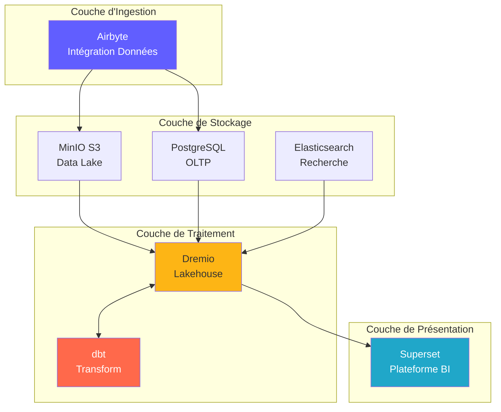
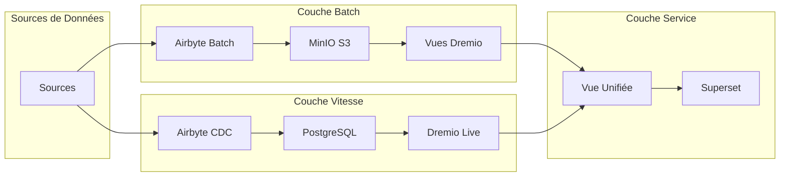
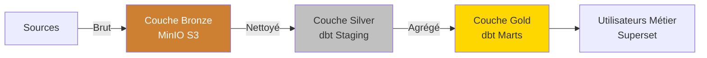
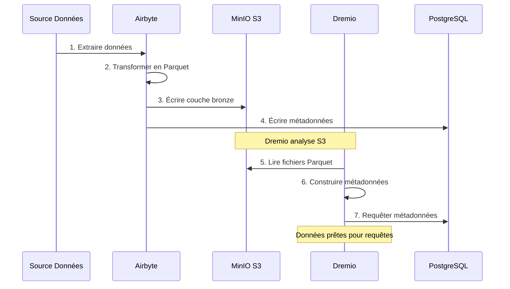
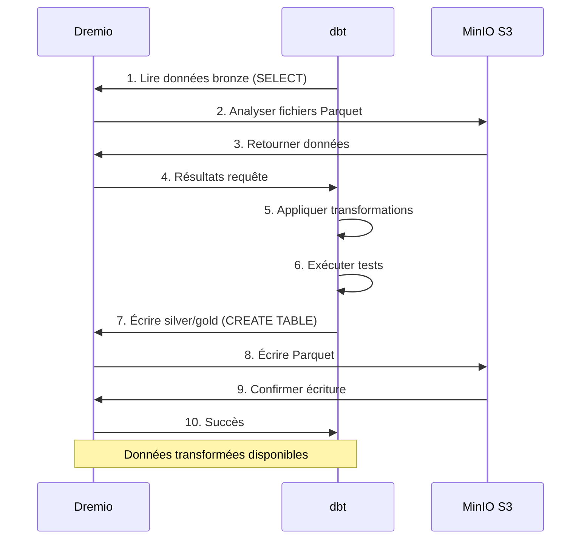
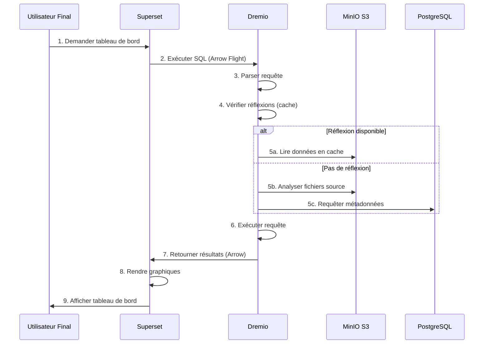
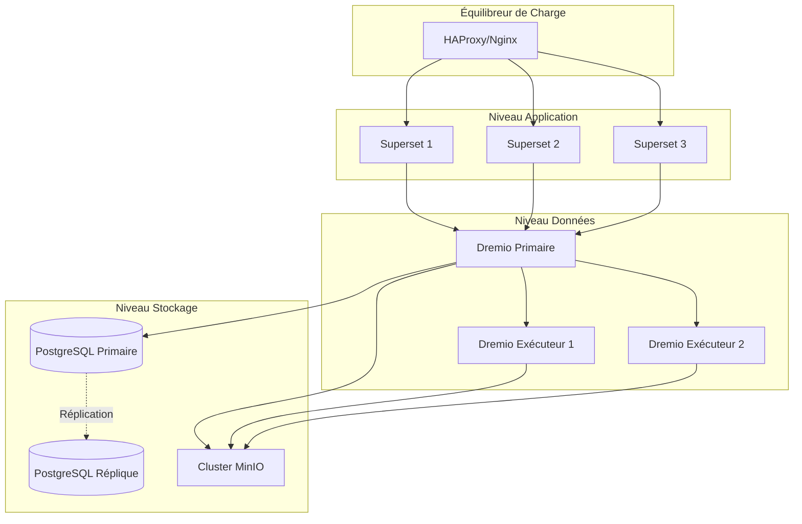
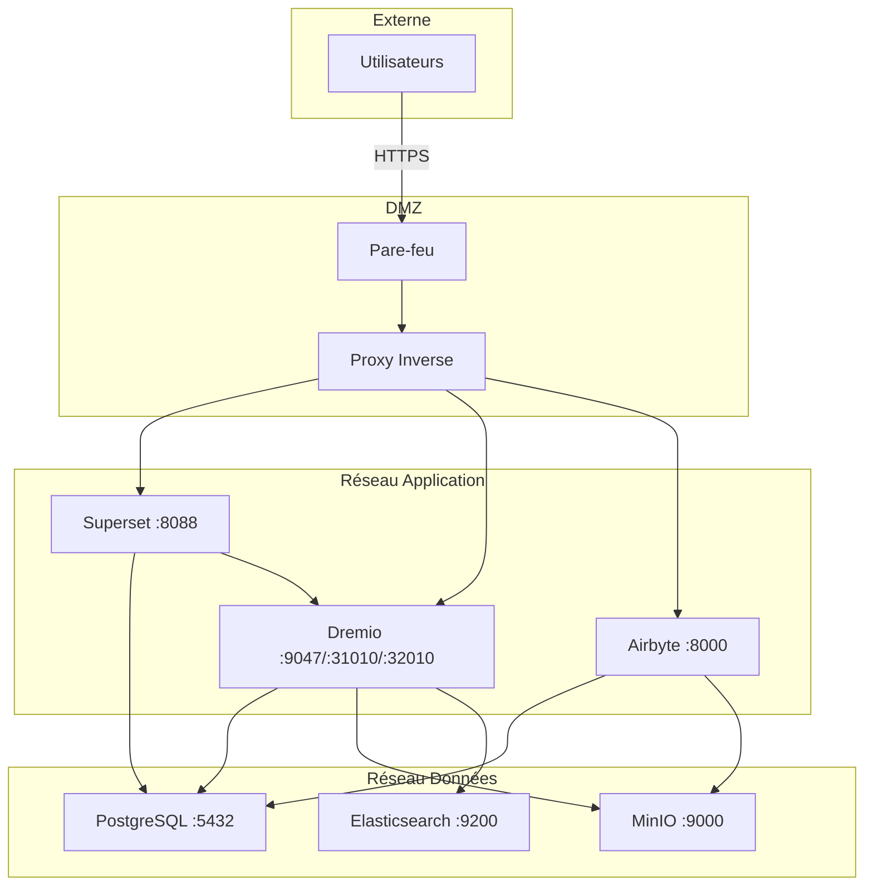
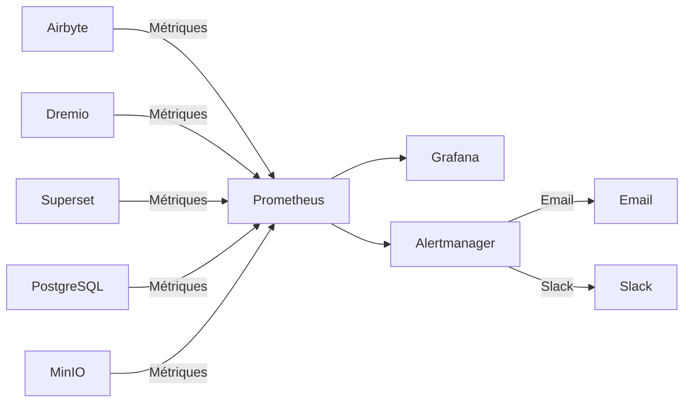

# アーキテクチャの概要

**バージョン**: 3.2.0  
**最終更新**: 2025-10-16  
**言語**: フランス語

---

＃＃ 導入

データ プラットフォームは、オープン ソース テクノロジーに基づいて構築された最新のクラウド ネイティブ アーキテクチャです。エンタープライズ規模の分析ワークロード向けに設計された、データの取り込み、保存、変換、視覚化のための包括的なソリューションを提供します。



---

## 設計原則

### 1. オープンソースファースト

**哲学**: オープンソース テクノロジーを使用して、ベンダー ロックインを回避し、柔軟性を維持します。

**利点**：
- ライセンス費用はかかりません
- コミュニティ開発
- 完全なカスタマイズ機能
- 透明性のあるセキュリティ監査
- 幅広いエコシステムの互換性

### 2. 階層化されたアーキテクチャ

**哲学**: 保守性と拡張性を確保するために、懸念事項を個別のレイヤーに分割します。

**レイヤー**:
```
┌─────────────────────────────────────┐
│     Couche de Présentation          │  Superset (BI & Tableaux de Bord)
├─────────────────────────────────────┤
│     Couche Sémantique               │  Dremio (Moteur de Requête)
├─────────────────────────────────────┤
│     Couche de Transformation        │  dbt (Transformation Données)
├─────────────────────────────────────┤
│     Couche de Stockage              │  MinIO, PostgreSQL, Elasticsearch
├─────────────────────────────────────┤
│     Couche d'Ingestion              │  Airbyte (Intégration Données)
└─────────────────────────────────────┘
```

### 3. ETL ではなく ELT

**哲学**: 最初に生データをロードし、宛先 (ELT) に変換します。

**ELT を選ぶ理由**
- **柔軟性**: 再抽出せずに複数の方法でデータを変換します
- **パフォーマンス**: 変換に宛先計算を使用します。
- **監査可能性**: 生データを常に検証に利用可能
- **コスト**: ソース システムの抽出負荷を軽減します。

**流れ**：
```
Extract → Load → Transform
(Airbyte) (MinIO/PostgreSQL) (dbt + Dremio)
```

### 4. データ レイクハウス モデル

**哲学**: データ レイクの柔軟性とデータ ウェアハウスのパフォーマンスを組み合わせます。

**特徴**：
- **ACID トランザクション**: 信頼できるデータ操作
- **スキーマ アプリケーション**: データ品質の保証
- **タイムトラベル**: 過去のバージョンのクエリ
- **オープンフォーマット**: 寄木細工、氷山、デルタ湖
- **直接ファイル アクセス**: 独自のロックなし

### 5. クラウドネイティブ設計

**哲学**: コンテナ化された分散環境向けの設計。

**実装**：
- すべてのサービスの Docker コンテナ
- 水平方向のスケーラビリティ
- コードとしてのインフラストラクチャ
- 可能な限りステートレス
- 環境変数による設定

---

## アーキテクチャ モデル

### Lambda アーキテクチャ (バッチ + ストリーム)



**バッチ レイヤー** (履歴データ):
- 大量のデータ
- 定期的な治療（毎時/毎日）
- 許容可能な高い遅延
- 完全な再処理が可能

**スピードレイヤー** (リアルタイムデータ):
- 変更データ キャプチャ (CDC)
- 低遅延が必要
- 増分更新のみ
- 最近のデータを管理します

**サービス層**:
- バッチ ビューとスピード ビューを結合します
- 単一のクエリ インターフェイス (Dremio)
- 自動ビュー選択

### 建築メダリオン (ブロンズ → シルバー → ゴールド)



**ブロンズ層** (生):
- ソースからのそのままのデータ
- 変換なし
- 完全な履歴が保存されます
- ここにAirbyteがロードされます

**シルバー層** (クリーニング済み):
- 適用されたデータ品質
- 標準化されたフォーマット
- dbt ステージング テンプレート
- 分析準備完了

**ゴールドレイヤー** (職業):
- 集約されたメトリクス
- 応用ビジネスロジック
- Marts DBT モデル
- 消費に合わせて最適化

---

## コンポーネント間の相互作用

### データ取り込みフロー



### 変換パイプライン



### クエリの実行



---

## スケーラビリティ モデル

### 水平方向のスケーリング

**ステートレス サービス** (自由に進化可能):
- Airbyte Workers: 並列同期のために進化
- Dremio Executors: クエリ パフォーマンスの拡張
- Web スーパーセット: 競合ユーザー向けに進化

**ステートフル サービス** (調整が必要):
- PostgreSQL: プライマリレプリカのレプリケーション
- MinIO: 分散モード (複数ノード)
- Elasticsearch: シャーディングを使用したクラスター

### 垂直スケーリング

**記憶に集中**:
- Dremio: 大規模なクエリのために JVM ヒープを増やす
- PostgreSQL: キャッシュ バッファ用の RAM を増やす
- Elasticsearch: インデックス作成のためのヒープの増加

**CPU 集中型**:
- dbt: 並列構築モデルのコア数を増やす
- Airbyte: より高速なデータ変換

### データのパーティショニング

```sql
-- Exemple: Partitionner par date
CREATE TABLE orders_partitioned (
    order_id INT,
    customer_id INT,
    amount DECIMAL,
    order_date DATE
)
PARTITION BY (DATE_TRUNC('month', order_date))
STORED AS PARQUET;

-- La requête analyse uniquement les partitions pertinentes
SELECT SUM(amount)
FROM orders_partitioned
WHERE order_date >= '2025-01-01'
  AND order_date < '2025-02-01';
-- Analyse uniquement la partition de janvier
```

---

## 高可用性

### サービスの冗長性



### 失敗のシナリオ

|コンポーネント |内訳 |回復 |
|---------------|-------|-----------|
| **エアバイトワーカー** |コンテナクラッシュ |自動再起動、同期を再開 |
| **ドレミオ エグゼキューター** |ノード障害 |リクエストは他の実行者にリダイレクトされました |
| **PostgreSQL** |プライマリはサービス停止中 |プライマリでレプリカを昇格する |
| **MinIO ノード** |ディスク障害 |消失符号化によりデータが再構築される |
| **スーパーセット** |サービス停止中 |バランサーがトラフィックをリダイレクトする |

### バックアップ戦略

```bash
# Sauvegardes automatisées quotidiennes
0 2 * * * /scripts/backup_all.sh

# backup_all.sh
#!/bin/bash

# Sauvegarder PostgreSQL
pg_dumpall -U postgres > /backups/postgres_$(date +%Y%m%d).sql

# Sauvegarder métadonnées Dremio
tar czf /backups/dremio_$(date +%Y%m%d).tar.gz /opt/dremio/data

# Synchroniser MinIO vers S3 distant
mc mirror MinIOLake/datalake s3-offsite/datalake-backup

# Conserver 30 jours
find /backups -mtime +30 -delete
```

---

## セキュリティ アーキテクチャ

### ネットワークセキュリティ



### 認証と認可

**サービス認証**:
- **Dremio**: LDAP/AD、OAuth2、SAML 統合
- **スーパーセット**: データベース認証、LDAP、OAuth2
- **Airbyte**: 基本認証、OAuth2 (エンタープライズ)
- **MinIO**: IAM ポリシー、STS トークン

**認証レベル**:
```yaml
Rôles:
  - Admin:
      - Accès complet à tous les services
      - Gestion utilisateurs
      - Modifications configuration
  
  - Data Engineer:
      - Créer/modifier sources données
      - Exécuter syncs Airbyte
      - Exécuter modèles dbt
      - Créer datasets Dremio
  
  - Analyst:
      - Accès lecture seule données
      - Créer tableaux de bord Superset
      - Requêter datasets Dremio
  
  - Viewer:
      - Voir tableaux de bord uniquement
      - Pas d'accès données
```

### データの暗号化

**休止中**:
- MinIO: サーバー側暗号化 (AES-256)
- PostgreSQL: 透過的データ暗号化 (TDE)
- Elasticsearch: 暗号化されたインデックス

**輸送中**：
- すべてのサービス間通信に TLS 1.3
- Dremio ↔ Superset の TLS を使用した Arrow Flight
- Web インターフェースの HTTPS

---

## 監視と可観測性

### メトリクスの収集



**主要な指標**:
- **Airbyte**: 同期成功率、同期された録音、転送されたバイト数
- **Dremio**: リクエストのレイテンシ、キャッシュ ヒット率、リソース使用量
- **dbt**: モデルの構築時間、テストの失敗
- **スーパーセット**: ダッシュボードの読み込み時間、アクティブ ユーザー
- **インフラストラクチャ**: CPU、メモリ、ディスク、ネットワーク

### ロギング

**集中ログ**:
```yaml
Stack ELK:
  - Elasticsearch: Stocker logs
  - Logstash: Traiter logs
  - Kibana: Visualiser logs

Sources de Logs:
  - Logs application (format JSON)
  - Logs d'accès
  - Logs d'audit
  - Logs d'erreur
```

### トレース

**分散トレーシング**:
- イェーガーまたはジップキンの統合
- サービス間のリクエストを追跡する
- ボトルネックを特定する
- パフォーマンスの問題をデバッグする

---

## デプロイメントトポロジ

### 開発環境

```yaml
Hôte Unique:
  Ressources: 8 Go RAM, 4 CPUs
  Services: Tous sur une machine
  Stockage: Volumes locaux
  Réseau: Réseau bridge
  Cas d'usage: Développement, tests
```

### ステージング環境

```yaml
Multi-Hôtes:
  Ressources: 16 Go RAM, 8 CPUs par hôte
  Services: Répartis sur 2-3 hôtes
  Stockage: NFS partagé ou MinIO distribué
  Réseau: Réseau overlay
  Cas d'usage: Tests pré-production, UAT
```

### 実稼働環境

```yaml
Cluster Kubernetes:
  Ressources: Auto-scaling selon charge
  Services: Conteneurisés, répliqués
  Stockage: Volumes persistants (SSD)
  Réseau: Service mesh (Istio)
  Haute Disponibilité: Déploiement multi-zones
  Cas d'usage: Charges production
```

---

## 技術的選択の正当性

### なぜ Airbyte なのか?

- **300+ コネクタ**: 事前構築された統合
- **オープンソース**: サプライヤーのロックインなし
- **アクティブなコミュニティ**: 12,000 人以上の GitHub スター
- **CDC サポート**: リアルタイム データ キャプチャ
- **標準化**: 組み込みの dbt 統合

### なぜドレミオなのか?

- **クエリの高速化**: クエリが 10 ～ 100 倍高速化
- **Arrow Flight**: 高性能データ転送
- **データ レイクの互換性**: データの移動はありません
- **セルフサービス**: ビジネス ユーザーがデータを探索する
- **収益性**: 倉庫コストを削減

### なぜ DBT なのか?

- **SQL ベース**: アナリストに馴染みのあるもの
- **バージョン管理**: Git の統合
- **テスト**: 統合されたデータ品質テスト
- **ドキュメント**: 自動生成されたドキュメント
- **コミュニティ**: 5,000 以上のパッケージが利用可能

### なぜスーパーセットなのか?

- **モダンな UI**: 直感的なインターフェイス
- **SQL IDE**: 高度なクエリ機能
- **豊富なビジュアライゼーション**: 50 以上のグラフィック タイプ
- **拡張可能**: カスタム プラグイン
- **オープンソース**: Apache Foundation をサポート

### なぜ PostgreSQL なのか?

- **信頼性**: ACID 準拠
- **パフォーマンス**: 大規模で実証済み
- **機能**: JSON、全文検索、拡張機能
- **コミュニティ**: 成熟したエコシステム
- **コスト**: 無料でオープンソース

### なぜ MinIO なのか?

- **S3 互換性**: 業界標準 API
- **パフォーマンス**: 高流量
- **消去コーディング**: データの耐久性
- **マルチクラウド**: どこにでも展開
- **コスト効率**: セルフホスト型の代替手段

---

## アーキテクチャの将来の進化

### 計画された改善

1. **データ カタログ** (OpenMetadata 統合)
   - メタデータ管理
   - 系統追跡
   - データの発見

2. **データ品質** (大きな期待)
   - 自動検証
   - 異常検出
   - 高品質のダッシュボード

3. **ML オペレーション** (MLflow)
   - モデルトレーニングパイプライン
   - モデル登録
   - 導入の自動化

4. **ストリーム処理** (Apache Flink)
   - リアルタイム変換
   - 複雑なイベント処理
   - ストリーミング分析

5. **データ ガバナンス** (Apache Atlas)
   - ポリシーの適用
   - アクセス監査
   - コンプライアンスレポート

---

## 参考文献

- [コンポーネントの詳細](components.md)
- [データフロー](data-flow.md)
- [導入ガイド](deployment.md)
- [Airbyte統合](../guides/airbyte-integration.md)

---

**アーキテクチャ概要バージョン**: 3.2.0  
**最終更新**: 2025-10-16  
**管理者**: データ プラットフォーム チーム