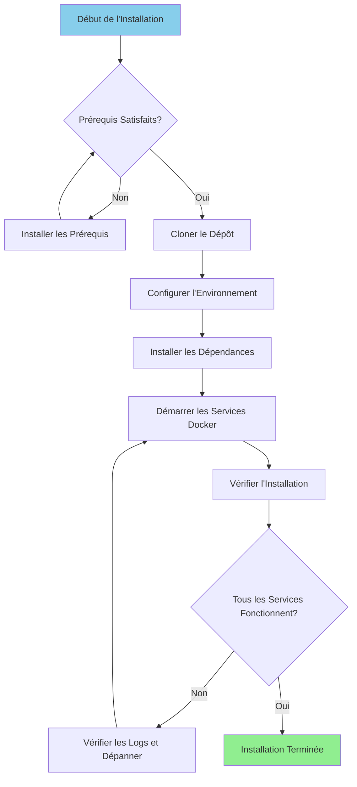

# インストールガイド

**バージョン**: 3.2.0  
**最終更新**: 2025-10-16  
**言語**: フランス語

---

＃＃ 概要

このガイドでは、Airbyte、Dremio、dbt、Apache Superset、サポート インフラストラクチャなどの完全なデータ プラットフォームをインストールして構成するための手順を段階的に説明します。



---

## 前提条件

### システム要件

**最小要件:**
- **CPU**: 4 コア (8 コア以上を推奨)
- **RAM**: 8 GB (16 GB 以上を推奨)
- **ディスク容量**: 20 GB が利用可能 (50 GB 以上を推奨)
- **ネットワーク**: Docker イメージ用の安定したインターネット接続

**オペレーティング システム:**
- Linux (Ubuntu 20.04 以降、CentOS 8 以降、Debian 11 以降)
- macOS (11.0以降)
- WSL2を搭載したWindows 10/11

### 必要なソフトウェア

#### 1. ドッカー

**バージョン**: 20.10 以降

**施設：**

**Linux:**
```bash
# Installer Docker
curl -fsSL https://get.docker.com -o get-docker.sh
sudo sh get-docker.sh

# Ajouter l'utilisateur au groupe docker
sudo usermod -aG docker $USER

# Démarrer le service Docker
sudo systemctl start docker
sudo systemctl enable docker

# Vérifier l'installation
docker --version
```

**macOS:**
```bash
# Télécharger et installer Docker Desktop depuis:
# https://www.docker.com/products/docker-desktop

# Vérifier l'installation
docker --version
```

**Windows:**
```powershell
# Installer WSL2 d'abord
wsl --install

# Télécharger et installer Docker Desktop depuis:
# https://www.docker.com/products/docker-desktop

# Vérifier l'installation
docker --version
```

#### 2. Docker Compose

**バージョン**: 2.0 以降

**施設：**

```bash
# Linux
sudo curl -L "https://github.com/docker/compose/releases/latest/download/docker-compose-$(uname -s)-$(uname -m)" -o /usr/local/bin/docker-compose
sudo chmod +x /usr/local/bin/docker-compose

# Vérifier l'installation
docker-compose --version
```

**注意**: macOS および Windows 用の Docker Desktop には Docker Compose が含まれています。

#### 3. Python

**バージョン**: 3.11 以降

**施設：**

**Linux (Ubuntu/Debian):**
```bash
sudo apt update
sudo apt install python3.11 python3.11-venv python3-pip
```

**macOS:**
```bash
brew install python@3.11
```

**Windows:**
```powershell
# Télécharger l'installateur depuis python.org
# Ou utiliser winget:
winget install Python.Python.3.11
```

**検証：**
```bash
python --version  # ou python3 --version
pip --version     # ou pip3 --version
```

#### 4.Git

**施設：**

```bash
# Linux
sudo apt install git  # Ubuntu/Debian
sudo yum install git  # CentOS/RHEL

# macOS
brew install git

# Windows
winget install Git.Git
```

**検証：**
```bash
git --version
```

---

## インストール手順

### ステップ 1: リポジトリのクローンを作成する

```bash
# Cloner le dépôt
git clone https://github.com/your-org/dremiodbt.git

# Naviguer vers le répertoire du projet
cd dremiodbt

# Vérifier le contenu
ls -la
```

**予想される構造:**
```
dremiodbt/
├── docker-compose.yml
├── docker-compose-airbyte.yml
├── README.md
├── requirements.txt
├── dbt/
├── dremio_connector/
├── docs/
└── scripts/
```

### ステップ 2: 環境を構成する

#### 環境ファイルの作成

```bash
# Copier le fichier d'environnement exemple
cp .env.example .env

# Éditer la configuration (optionnel)
nano .env  # ou utiliser votre éditeur préféré
```

#### 環境変数

**基本構成:**
```bash
# Projet
PROJECT_NAME=dremiodbt
ENVIRONMENT=development

# Réseau Docker
NETWORK_NAME=dremio_network

# PostgreSQL
POSTGRES_HOST=postgres
POSTGRES_PORT=5432
POSTGRES_DB=dremio_db
POSTGRES_USER=postgres
POSTGRES_PASSWORD=postgres123

# Dremio
DREMIO_VERSION=26.0
DREMIO_HTTP_PORT=9047
DREMIO_FLIGHT_PORT=32010
DREMIO_ADMIN_USER=admin
DREMIO_ADMIN_PASSWORD=admin123

# Airbyte
AIRBYTE_VERSION=0.50.33
AIRBYTE_HTTP_PORT=8000
AIRBYTE_API_PORT=8001

# Superset
SUPERSET_VERSION=3.0
SUPERSET_HTTP_PORT=8088
SUPERSET_ADMIN_USER=admin
SUPERSET_ADMIN_PASSWORD=admin

# MinIO
MINIO_VERSION=latest
MINIO_API_PORT=9000
MINIO_CONSOLE_PORT=9001
MINIO_ROOT_USER=minioadmin
MINIO_ROOT_PASSWORD=minioadmin123

# Elasticsearch
ELASTIC_VERSION=8.15.0
ELASTIC_HTTP_PORT=9200
```

### ステップ 3: Python の依存関係をインストールする

#### 仮想環境を作成する

```bash
# Créer l'environnement virtuel
python -m venv venv

# Activer l'environnement virtuel
# Linux/macOS:
source venv/bin/activate

# Windows:
.\venv\Scripts\activate
```

#### インストール要件

```bash
# Mettre à jour pip
pip install --upgrade pip

# Installer les dépendances
pip install -r requirements.txt

# Vérifier l'installation
pip list
```

**インストールされている主なパッケージ:**
- `pyarrow>=21.0.0` - アローフライトのお客様
- `pandas>=2.3.0` - データ操作
- `dbt-core>=1.10.0` - データ変換
- `sqlalchemy>=2.0.0` - データベース接続
- `pyyaml>=6.0.0` - 構成管理

### ステップ 4: Docker サービスを開始する

#### メインサービスの開始

```bash
# Démarrer tous les services
docker-compose up -d

# Ou utiliser Makefile (si disponible)
make up
```

**サービス開始:**
- PostgreSQL (ポート 5432)
- Dremio (ポート 9047、32010)
- Apache スーパーセット (ポート 8088)
- MinIO (ポート 9000、9001)
- Elasticsearch (ポート 9200)

#### Airbyte を開始 (別々に作成)

```bash
# Démarrer les services Airbyte
docker-compose -f docker-compose-airbyte.yml up -d
```

**Airbyteサービス開始:**
- Airbyteサーバー（ポート8001）
- Airbyte Web UI (ポート 8000)
- エアバイトワーカー
- エアバイトテンポラル
- エアバイトデータベース

#### サービスのステータスを確認する

```bash
# Voir les conteneurs en cours d'exécution
docker-compose ps

# Voir tous les conteneurs (incluant Airbyte)
docker ps

# Voir les logs
docker-compose logs -f

# Voir les logs Airbyte
docker-compose -f docker-compose-airbyte.yml logs -f
```

---

＃＃ 検証

### ステップ 5: サービスを確認する

#### 1.PostgreSQL

```bash
# Tester la connexion
docker exec -it postgres psql -U postgres -d dremio_db -c "SELECT version();"
```

**期待される出力:**
```
PostgreSQL 16.x on x86_64-pc-linux-gnu
```

#### 2. ドレミオ

**ウェブインターフェイス:**
```
http://localhost:9047
```

**最初の接続:**
- ユーザー名: `admin`
- パスワード: `admin123`
- 最初のアクセス時に管理者アカウントを作成するように求められます

**接続をテストします:**
```bash
# Tester le point de terminaison HTTP
curl http://localhost:9047/apiv2/login
```

#### 3. エアバイト

**ウェブインターフェイス:**
```
http://localhost:8000
```

**デフォルトの識別子:**
- 電子メール: `airbyte@example.com`
- パスワード: `password`

**API をテストします:**
```bash
# Vérification de santé
curl http://localhost:8001/health
```

**期待される応答:**
```json
{
  "status": "ok",
  "timestamp": "2025-10-16T12:00:00Z"
}
```

#### 4. Apache スーパーセット

**ウェブインターフェイス:**
```
http://localhost:8088
```

**デフォルトの識別子:**
- ユーザー名: `admin`
- パスワード: `admin`

**接続をテストします:**
```bash
curl http://localhost:8088/health
```

#### 5. MinIO

**コンソール UI:**
```
http://localhost:9001
```

**資格：**
- ユーザー名: `minioadmin`
- パスワード: `minioadmin123`

**S3 API をテストします:**
```bash
# Installer le client MinIO
wget https://dl.min.io/client/mc/release/linux-amd64/mc
chmod +x mc

# Configurer
./mc alias set local http://localhost:9000 minioadmin minioadmin123

# Tester
./mc ls local
```

#### 6. エラスティックサーチ

**接続をテストします:**
```bash
# Vérification de santé
curl http://localhost:9200/_cluster/health

# Obtenir les informations
curl http://localhost:9200
```

**期待される応答:**
```json
{
  "name": "elasticsearch",
  "cluster_name": "docker-cluster",
  "version": {
    "number": "8.15.0"
  }
}
```

### ステップ 6: ヘルスチェックを実行する

```bash
# Exécuter le script de vérification de santé complet
python scripts/health_check.py

# Ou utiliser Makefile
make health-check
```

**期待される出力:**
```
✓ PostgreSQL: En cours d'exécution (port 5432)
✓ Dremio: En cours d'exécution (ports 9047, 32010)
✓ Airbyte: En cours d'exécution (ports 8000, 8001)
✓ Superset: En cours d'exécution (port 8088)
✓ MinIO: En cours d'exécution (ports 9000, 9001)
✓ Elasticsearch: En cours d'exécution (port 9200)

Tous les services sont opérationnels!
```

---

## インストール後の構成

### 1. Dremio を初期化する

```bash
# Exécuter le script d'initialisation
python scripts/init_dremio.py
```

**作成:**
- 管理者ユーザー
- デフォルトのソース (PostgreSQL、MinIO)
- データセットの例

### 2. スーパーセットの初期化

```bash
# Initialiser la base de données
docker exec -it superset superset db upgrade

# Créer un utilisateur administrateur (si inexistant)
docker exec -it superset superset fab create-admin \
    --username admin \
    --firstname Admin \
    --lastname User \
    --email admin@example.com \
    --password admin

# Initialiser Superset
docker exec -it superset superset init
```

### 3.dbt を設定する

```bash
# Naviguer vers le répertoire dbt
cd dbt

# Tester la connexion
dbt debug

# Exécuter les modèles initiaux
dbt run

# Exécuter les tests
dbt test
```

### 4.Airbyteを設定する

**Web インターフェイス経由 (http://localhost:8000):**

1. セットアップウィザードを完了します
2. 最初のソースを構成します (例: PostgreSQL)
3. 宛先を設定します (例: MinIO S3)
4. 接続を作成する
5. 最初の同期を実行します

**API経由:**
```bash
# Voir docs/i18n/fr/guides/airbyte-integration.md pour les détails
python scripts/configure_airbyte.py
```

---

## インストール後のディレクトリ構造

```
dremiodbt/
├── venv/                          # Environnement virtuel Python
├── data/                          # Stockage de données local
│   ├── dremio/                    # Métadonnées Dremio
│   ├── postgres/                  # Données PostgreSQL
│   └── minio/                     # Données MinIO
├── logs/                          # Logs applicatifs
│   ├── dremio.log
│   ├── airbyte.log
│   ├── superset.log
│   └── dbt.log
├── dbt/
│   ├── models/                    # Modèles dbt
│   ├── tests/                     # Tests dbt
│   ├── target/                    # SQL compilé
│   └── logs/                      # Logs dbt
└── docker-volume/                 # Volumes persistants Docker
    ├── db-data/                   # Données de base de données
    ├── minio-data/                # Stockage objet
    └── elastic-data/              # Index de recherche
```

---

## トラブルシューティング

### よくある問題

#### 1. ポートはすでに使用されています

**エラー：**
```
Error: bind: address already in use
```

**解決：**
```bash
# Trouver le processus utilisant le port (exemple: 9047)
sudo lsof -i :9047

# Terminer le processus
sudo kill -9 <PID>

# Ou changer le port dans docker-compose.yml
```

#### 2. メモリ不足

**エラー：**
```
ERROR: Insufficient memory available
```

**解決：**
```bash
# Augmenter l'allocation mémoire Docker
# Docker Desktop: Paramètres > Ressources > Mémoire (16Go recommandés)

# Linux: Éditer /etc/docker/daemon.json
{
  "default-ulimits": {
    "memlock": {
      "Hard": -1,
      "Name": "memlock",
      "Soft": -1
    }
  }
}

# Redémarrer Docker
sudo systemctl restart docker
```

#### 3. サービスが開始されない

**ログを確認します:**
```bash
# Voir tous les logs des services
docker-compose logs

# Voir un service spécifique
docker-compose logs dremio
docker-compose logs airbyte-server

# Suivre les logs en temps réel
docker-compose logs -f
```

#### 4. ネットワークの問題

**Docker ネットワークをリセットします:**
```bash
# Arrêter tous les services
docker-compose down
docker-compose -f docker-compose-airbyte.yml down

# Supprimer le réseau
docker network rm dremio_network

# Redémarrer les services
docker-compose up -d
docker-compose -f docker-compose-airbyte.yml up -d
```

#### 5. 権限の問題 (Linux)

**解決：**
```bash
# Corriger les permissions des répertoires de données
sudo chown -R $USER:$USER data/ docker-volume/

# Corriger les permissions du socket Docker
sudo chmod 666 /var/run/docker.sock
```

---

## アンインストール

### サービスを停止する

```bash
# Arrêter les services principaux
docker-compose down

# Arrêter Airbyte
docker-compose -f docker-compose-airbyte.yml down
```

### データの削除 (オプション)

```bash
# Supprimer les volumes (ATTENTION: Supprime toutes les données)
docker-compose down -v
docker-compose -f docker-compose-airbyte.yml down -v

# Supprimer les répertoires de données locaux
rm -rf data/ docker-volume/ logs/
```

### Docker イメージを削除する

```bash
# Lister les images
docker images | grep dremio

# Supprimer des images spécifiques
docker rmi dremio/dremio-oss:24.0
docker rmi airbyte/server:0.50.33
docker rmi apache/superset:3.0

# Supprimer toutes les images non utilisées
docker image prune -a
```

---

## 次のステップ

インストールが成功したら:

1. **データ ソースの構成** - [構成ガイド](configuration.md) を参照してください。
2. **ファースト ステップのチュートリアル** - [ファースト ステップ](first-steps.md) を参照してください。
3. **Airbyte 設定** - [Airbyte 統合ガイド](../guides/airbyte-integration.md) を参照してください。
4. **Dremio のセットアップ** - [Dremio セットアップガイド](../guides/dremio-setup.md) を参照してください。
5. **dbt モデルの作成** - [dbt 開発ガイド](../guides/dbt-development.md) を参照してください。
6. **ダッシュボードの作成** - [スーパーセット ダッシュボード ガイド](../guides/superset-dashboards.md) を参照してください。

---

＃＃ サポート

インストールの問題については、次のとおりです。

- **ドキュメント**: [トラブルシューティング ガイド](../guides/troubleshooting.md)
- **GitHub の問題**: https://github.com/your-org/dremiodbt/issues
- **コミュニティ**: https://github.com/your-org/dremiodbt/Discussions

---

**インストール ガイドのバージョン**: 3.2.0  
**最終更新**: 2025-10-16  
**管理者**: データ プラットフォーム チーム