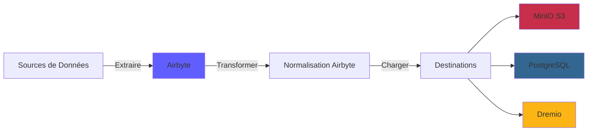
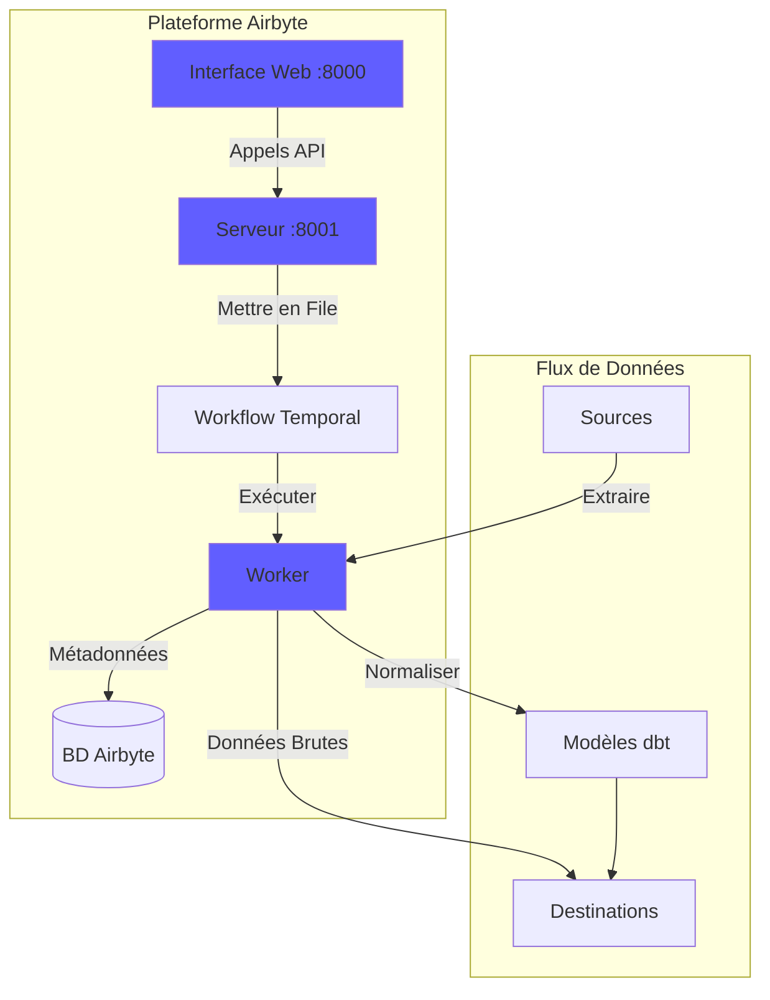
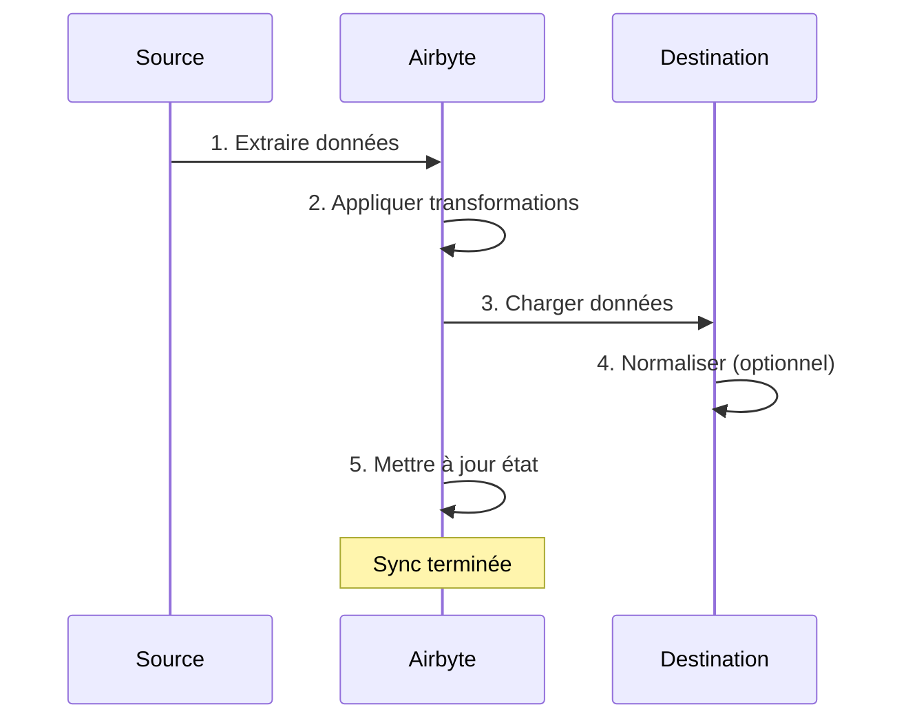
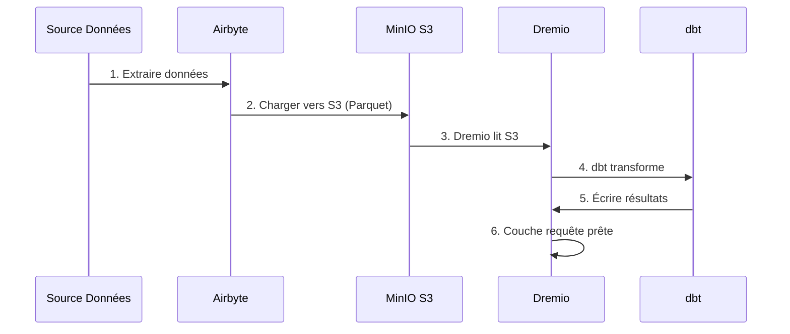

# Airbyte 統合ガイド

**バージョン**: 3.2.0  
**最終更新**: 2025 年 10 月 16 日  
**言語**: フランス語

---

＃＃ 概要

Airbyte は、さまざまなソースから宛先へのデータの移動を簡素化するオープンソースのデータ統合プラットフォームです。このガイドでは、Airbyte のデータ プラットフォームへの統合、コネクタの構成、データ パイプラインの確立について説明します。



---

## Airbyteとは何ですか?

### 主な機能

- **300 以上の構築済みコネクタ**: API、データベース、ファイル、SaaS アプリケーション
- **オープンソース**: 完全なデータ制御を備えた自己ホスト型
- **変更データ キャプチャ (CDC)**: リアルタイムのデータ同期
- **カスタム コネクタ**: Python またはローコード CDK を使用してコネクタを構築します
- **データ正規化**: 生の JSON を構造化テーブルに変換します。
- **監視とアラート**: 同期ステータスとデータ品質を追跡します

＃＃＃ 建築



---

＃＃ 施設

### クイックスタート

Airbyte はプラットフォームに含まれています。以下から始めてください:

```bash
# Démarrer services Airbyte
docker-compose -f docker-compose-airbyte.yml up -d

# Vérifier statut
docker-compose -f docker-compose-airbyte.yml ps

# Voir logs
docker-compose -f docker-compose-airbyte.yml logs -f
```

### サービス開始

|サービス |ポート |説明 |
|----------|------|---------------|
| **エアバイトウェブアプリ** | 8000 | Web ユーザー インターフェイス |
| **エアバイトサーバー** | 8001 | APIサーバー |
| **エアバイトワーカー** | - |ジョブ実行エンジン |
| **空バイト時間** | 7233 |ワークフロー オーケストレーション |
| **エアバイトデータベース** | 5432 |メタデータ データベース (PostgreSQL) |

### 初回アクセス

**ウェブインターフェイス:**
```
http://localhost:8000
```

**デフォルトの識別子:**
- **電子メール**: `airbyte@example.com`
- **パスワード**: `password`

**セキュリティのため、初めてログインするときはパスワードを変更してください**。

---

＃＃ 構成

### 構成ウィザード

最初のアクセス時に、構成ウィザードを完了します。

1. **電子メール設定**: 通知を構成する
2. **データの保存場所**: データの保存場所を選択します
3. **匿名の使用統計**: テレメトリの受け入れ/拒否

### ワークスペースの設定

**[設定] > [ワークスペース]** に移動します。

```yaml
Nom Workspace: Production Data Platform
ID Workspace: default
Définition Namespace: Destination Default
Format Namespace: ${SOURCE_NAMESPACE}
```

### リソース制限

**ファイル**: `config/airbyte/config.yaml`

```yaml
# Allocation ressources par connecteur
resources:
  source:
    cpu_limit: "1.0"
    memory_limit: "1Gi"
    cpu_request: "0.25"
    memory_request: "256Mi"
  
  destination:
    cpu_limit: "1.0"
    memory_limit: "1Gi"
    cpu_request: "0.25"
    memory_request: "256Mi"
  
  orchestrator:
    cpu_limit: "0.5"
    memory_limit: "512Mi"
```

---

## コネクタ

### ソースコネクタ

#### ソース PostgreSQL

**使用例**: トランザクション データベースからデータを抽出する

**構成：**

1. **[ソース] > [新しいソース]** に移動します。
2. **PostgreSQL** を選択します
3. 接続を構成します。

```yaml
Host: postgres
Port: 5432
Database: source_db
Username: readonly_user
Password: [MOT_DE_PASSE_SÉCURISÉ]
SSL Mode: prefer

Méthode Réplication: Standard
  # Ou CDC pour changements temps réel:
  # Méthode Réplication: Logical Replication (CDC)
```

**接続のテスト** → **ソースの設定**

#### REST API ソース

**使用例**: API からデータを抽出する

**構成：**

```yaml
Name: External API
URL Base: https://api.example.com/v1
Authentication:
  Type: Bearer Token
  Token: [API_TOKEN]

Endpoints:
  - name: customers
    path: /customers
    http_method: GET
    
  - name: orders
    path: /orders
    http_method: GET
    params:
      start_date: "{{ config['start_date'] }}"
```

#### ソース ファイル (CSV)

**使用例**: CSV ファイルをインポートする

**構成：**

```yaml
Dataset Name: sales_data
URL: https://storage.example.com/sales.csv
Format: CSV
Provider:
  Storage: HTTPS
  User Provided Storage:
    URL: https://storage.example.com/sales.csv
```

#### 一般的なソース

|出典 |使用例 | CDC サポート |
|----------|----------|---------------|
| **PostgreSQL** |トランザクションコミック | ✅ はい |
| **MySQL** |トランザクションコミック | ✅ はい |
| **MongoDB** | NoSQL ドキュメント | ✅ はい |
| **セールスフォース** | CRMデータ | ❌ いいえ |
| **Google スプレッドシート** |スプレッドシート | ❌ いいえ |
| **ストライプ** |支払いデータ | ❌ いいえ |
| **REST API** |カスタム API | ❌ いいえ |
| **S3** |ファイルストレージ | ❌ いいえ |

### 宛先コネクタ

#### MinIO S3 宛先

**使用例**: 生データをデータ レイクに保存する

**構成：**

1. **目的地 > 新しい目的地**に移動します
2. **S3** を選択します
3. 接続を構成します。

```yaml
S3 Bucket Name: datalake
S3 Bucket Path: airbyte-data/${NAMESPACE}/${STREAM_NAME}
S3 Bucket Region: us-east-1

# Point de terminaison MinIO
S3 Endpoint: http://minio:9000
Access Key ID: [MINIO_ROOT_USER]
Secret Access Key: [MINIO_ROOT_PASSWORD]

Output Format:
  Format Type: Parquet
  Compression: GZIP
  Block Size: 128MB
```

**接続のテスト** → **接続先の設定**

#### PostgreSQL の宛先

**使用例**: 分析用に変換されたデータをロードする

**構成：**

```yaml
Host: postgres
Port: 5432
Database: analytics_db
Username: analytics_user
Password: [MOT_DE_PASSE_SÉCURISÉ]
Default Schema: public

Normalization:
  Mode: Basic
  # Crée tables normalisées depuis JSON imbriqué
```

#### 目的地ドレミオ

**使用例**: データ レイクハウスへの直接読み込み

**構成：**

```yaml
Host: dremio
Port: 32010
Project: Production
Dataset: airbyte_data
Username: dremio_user
Password: [DREMIO_PASSWORD]

Connection Type: Arrow Flight
SSL: false
```

---

## 接続

### 接続を作成する

接続は送信元を宛先にリンクします。



#### ステップバイステップ

1. **[接続] > [新しい接続] に移動します**

2. **ソースの選択**: 構成されたソースを選択します (例: PostgreSQL)

3. **宛先の選択**: 宛先を選択します (例: MinIO S3)

4. **同期の構成**:

```yaml
Nom Connexion: PostgreSQL → MinIO
Fréquence Réplication: Every 24 hours
Namespace Destination: Custom
  Format Namespace: production_${SOURCE_NAMESPACE}

Streams:
  - customers
    Mode Sync: Full Refresh | Overwrite
    Champ Curseur: updated_at
    Clé Primaire: customer_id
    
  - orders
    Mode Sync: Incremental | Append
    Champ Curseur: created_at
    Clé Primaire: order_id
    
  - products
    Mode Sync: Full Refresh | Overwrite
    Clé Primaire: product_id
```

5. **正規化の構成** (オプション):

```yaml
Normalization:
  Enable: true
  Option: Basic Normalization
  # Convertit JSON imbriqué en tables plates
```

6. **接続のテスト** → **接続のセットアップ**

### 同期モード

|ファッション |説明 |使用例 |
|------|---------------|---------------|
| **完全に更新\|上書き** |すべてのデータを置き換える |寸法表 |
| **完全に更新\|追加** |すべてのレコードを追加 |履歴追跡 |
| **増分\|追加** |新しい/更新されたレコードを追加 |ファクトテーブル |
| **増分\|重複排除** |既存のレコードを更新する | SCD タイプ 1 |

### 計画

**周波数オプション:**
- **手動**: 手動でトリガーします
- **毎時**: 1時間ごと
- **毎日**: 24 時間ごと (時間を指定)
- **毎週**: 特定の曜日
- **Cron**: カスタム スケジュール (例: `0 2 * * *`)

**スケジュールの例:**
```yaml
# Toutes les 6 heures
Cron: 0 */6 * * *

# Jours de semaine à 2h du matin
Cron: 0 2 * * 1-5

# Premier jour du mois
Cron: 0 0 1 * *
```

---

## データ変換

### 基本的な正規化

Airbyte には、dbt を使用した **基本正規化** が含まれています。

**彼女の仕事:**
- ネストされた JSON をフラット テーブルに変換します
- テーブルの作成 `_airbyte_raw_*` (生の JSON)
- 標準化された (構造化された) テーブルを作成します
- メタデータ列の追加 (`_airbyte_emitted_at`、`_airbyte_normalized_at`)

**例：**

**生の JSON** (`_airbyte_raw_customers`):
```json
{
  "_airbyte_ab_id": "uuid-123",
  "_airbyte_emitted_at": "2025-10-16T10:00:00Z",
  "_airbyte_data": {
    "id": 1,
    "name": "Acme Corp",
    "contact": {
      "email": "info@acme.com",
      "phone": "+1234567890"
    },
    "addresses": [
      {"type": "billing", "city": "New York"},
      {"type": "shipping", "city": "Boston"}
    ]
  }
}
```

**標準化されたテーブル:**

`customers`:
```sql
id | name | contact_email | contact_phone | _airbyte_normalized_at
1 | Acme Corp | info@acme.com | +1234567890 | 2025-10-16 10:05:00
```

`customers_addresses`:
```sql
_airbyte_customers_hashid | type | city
hash-123 | billing | New York
hash-123 | shipping | Boston
```

### カスタム変換 (dbt)

高度な変換には、dbt を使用します。

1. **エアバイト正規化を無効にする**
2. **テーブルを参照する dbt モデルを作成** `_airbyte_raw_*`
3. Airbyte を同期した後、**dbt を実行**

**dbt モデルの例:**
```sql
-- models/staging/stg_customers.sql
with source as (
    select * from {{ source('airbyte_raw', '_airbyte_raw_customers') }}
),

parsed as (
    select
        _airbyte_ab_id,
        _airbyte_emitted_at,
        (_airbyte_data->>'id')::int as customer_id,
        _airbyte_data->>'name' as customer_name,
        _airbyte_data->'contact'->>'email' as email,
        _airbyte_data->'contact'->>'phone' as phone
    from source
)

select * from parsed
```

---

＃＃ 監視

### 同期ステータス

**ダッシュボード Web インターフェイス:**
- **接続**: すべての接続を表示
- **同期履歴**: 過去の同期ジョブ
- **同期ログ**: ジョブごとの詳細なログ

**ステータス インジケーター:**
- 🟢 **成功**: 同期は正常に完了しました
- 🔴 **失敗**: 同期に失敗しました (ログを確認してください)
- 🟡 **実行中**: 同期が進行中です
- ⚪ **キャンセル**: ユーザーによって同期がキャンセルされました

### ログ

**同期ログを参照:**
```bash
# Logs serveur Airbyte
docker-compose -f docker-compose-airbyte.yml logs airbyte-server

# Logs worker (exécution sync réelle)
docker-compose -f docker-compose-airbyte.yml logs airbyte-worker

# Logs job spécifique
# Disponible dans Interface Web: Connections > [Connection] > Job History > [Job]
```

### メトリクス

**監視すべき主要な指標:**
- **同期録音**: 同期ごとの録音数
- **同期バイト数**: 転送されたデータの量
- **同期時間**: 同期ごとにかかる時間
- **失敗率**: 失敗した同期の割合

**メトリクスのエクスポート:**
```bash
# API Airbyte
curl -X GET "http://localhost:8001/api/v1/jobs/list" \
  -H "Content-Type: application/json" \
  -d '{
    "configTypes": ["sync"],
    "configId": "connection-id"
  }'
```

### アラート

**[設定] > [通知]** で **アラートを構成**:

```yaml
Type Notification: Slack
URL Webhook: https://hooks.slack.com/services/VOTRE/WEBHOOK/URL

Événements:
  - Échec Sync
  - Succès Sync (optionnel)
  - Connexion Désactivée

Conditions:
  - Seuil échec: 3 échecs consécutifs
```

---

## API の使用法

### 認証

```bash
# Pas d'authentification requise pour localhost
# Pour production, configurez auth dans docker-compose-airbyte.yml
```

### 一般的な API 呼び出し

#### ソースのリスト

```bash
curl -X POST "http://localhost:8001/api/v1/sources/list" \
  -H "Content-Type: application/json" \
  -d '{
    "workspaceId": "workspace-id"
  }'
```

#### 接続の作成

```bash
curl -X POST "http://localhost:8001/api/v1/connections/create" \
  -H "Content-Type: application/json" \
  -d '{
    "sourceId": "source-id",
    "destinationId": "destination-id",
    "syncCatalog": {
      "streams": [
        {
          "stream": {
            "name": "customers",
            "jsonSchema": {...}
          },
          "config": {
            "syncMode": "incremental",
            "destinationSyncMode": "append",
            "cursorField": ["updated_at"]
          }
        }
      ]
    },
    "schedule": {
      "units": 24,
      "timeUnit": "hours"
    }
  }'
```

#### トリガー同期

```bash
curl -X POST "http://localhost:8001/api/v1/connections/sync" \
  -H "Content-Type: application/json" \
  -d '{
    "connectionId": "connection-id"
  }'
```

#### ジョブ ステータスの取得

```bash
curl -X POST "http://localhost:8001/api/v1/jobs/get" \
  -H "Content-Type: application/json" \
  -d '{
    "id": "job-id"
  }'
```

---

## Dremio との統合

### ワークフロー



### 構成手順

1. **MinIO S3 に充電するように Airbyte を設定します** (上記を参照)

2. **Dremio に S3 ソースを追加します:**

```sql
-- Dans Interface Dremio: Sources > Add Source > S3
Nom Source: AirbyteData
Authentication: AWS Access Key
Clé Accès: [MINIO_ROOT_USER]
Clé Secrète: [MINIO_ROOT_PASSWORD]
Chemin Racine: /
Propriétés Connexion:
  fs.s3a.endpoint: minio:9000
  fs.s3a.path.style.access: true
  dremio.s3.compat: true
```

3. **Dremio で Airbyte データをクエリする:**

```sql
-- Parcourir structure S3
SELECT * FROM AirbyteData.datalake."airbyte-data"

-- Requête table spécifique
SELECT *
FROM AirbyteData.datalake."airbyte-data".production_public.customers
LIMIT 100
```

4. **Dremio 仮想データセットの作成:**

```sql
CREATE VDS airbyte_customers AS
SELECT
  id as customer_id,
  name as customer_name,
  contact_email as email,
  contact_phone as phone,
  _airbyte_emitted_at as last_updated
FROM AirbyteData.datalake."airbyte-data".production_public.customers
```

5. **dbt モデルでの使用:**

```yaml
# dbt/models/sources.yml
sources:
  - name: airbyte
    schema: AirbyteData.datalake."airbyte-data".production_public
    tables:
      - name: customers
      - name: orders
      - name: products
```

---

## ベストプラクティス

＃＃＃ パフォーマンス

1. 可能な限り**増分同期を使用**
2. **オフピーク時間に同期をスケジュールする**
3. **圧縮率を高めるには、Parquet 形式を使用します**
4. **大きなテーブルを日付で分割**
5. **リソースの使用状況を監視**し、制限を調整する

### データ品質

1. ソース コネクタで **データ検証を有効にする**
2. **主キーを使用**して重複を検出する
3. 同期失敗の **アラートを構成**
4. **データの鮮度を監視** メトリクス
5. 生データに **dbt テストを実装**

＃＃＃ 安全

1. **ソースには読み取り専用の識別子を使用します**
2. **シークレットを環境変数に保存**
3. **接続に対して SSL/TLS を有効にする**
4. **識別子を定期的に更新**
5. **アクセス ログを定期的に監査**

### コストの最適化

1. **圧縮を使用** (GZIP、SNAPPY)
2. ソースで **データの重複排除**
3. **古いデータをコールド ストレージにアーカイブ**
4. **監視同期頻度** と要件
5. **失敗した同期データを削除します**

---

## トラブルシューティング

### よくある問題

#### 同期失敗: 接続タイムアウト

**症状：**
```
Failed to connect to source: Connection timeout
```

**解決：**
```bash
# Vérifier connectivité réseau
docker exec airbyte-worker ping postgres

# Vérifier règles pare-feu
# Vérifier hôte/port source dans configuration
```

#### メモリ不足エラー

**症状：**
```
OOMKilled: Container exceeded memory limit
```

**解決：**
```yaml
# Augmenter limites mémoire dans docker-compose-airbyte.yml
services:
  airbyte-worker:
    environment:
      - JOB_MAIN_CONTAINER_MEMORY_LIMIT=2Gi
      - JOB_MAIN_CONTAINER_MEMORY_REQUEST=1Gi
```

#### 正規化に失敗しました

**症状：**
```
Normalization failed: dbt compilation error
```

**解決：**
```bash
# Vérifier logs dbt
docker-compose -f docker-compose-airbyte.yml logs airbyte-worker | grep dbt

# Désactiver normalisation et utiliser dbt personnalisé
# Meilleur contrôle sur logique transformation
```

#### 同期パフォーマンスが遅い

**診断：**
```bash
# Vérifier logs sync pour goulot d'étranglement
# Causes courantes:
# - Grand volume données
# - Requête source lente
# - Latence réseau
# - Ressources insuffisantes
```

**解決策:**
- インクリメンタル同期頻度を増やす
- カーソルフィールドにインデックスを追加
- リアルタイム ソースに CDC を使用する
- ワーカーのリソースをスケールする

---

## 高度なトピック

### カスタムコネクタ

Airbyte CDK を使用してカスタム コネクタを構築します。

```bash
# Cloner modèle connecteur
git clone https://github.com/airbytehq/airbyte.git
cd airbyte/airbyte-integrations/connector-templates/python

# Créer nouveau connecteur
./create_connector.sh MyCustomAPI

# Implémenter logique connecteur
# Éditer source.py, spec.yaml, schemas/

# Tester localement
python main.py check --config secrets/config.json
python main.py discover --config secrets/config.json
python main.py read --config secrets/config.json --catalog integration_tests/configured_catalog.json
```

### API オーケストレーション

Python で Airbyte を自動化する:

```python
import requests

AIRBYTE_API = "http://localhost:8001/api/v1"

def trigger_sync(connection_id: str):
    """Déclencher sync manuelle pour connexion"""
    response = requests.post(
        f"{AIRBYTE_API}/connections/sync",
        json={"connectionId": connection_id}
    )
    return response.json()

def get_sync_status(job_id: str):
    """Vérifier statut job sync"""
    response = requests.post(
        f"{AIRBYTE_API}/jobs/get",
        json={"id": job_id}
    )
    return response.json()

# Utilisation
job = trigger_sync("my-connection-id")
status = get_sync_status(job["job"]["id"])
print(f"Statut sync: {status['job']['status']}")
```

---

＃＃ リソース

### ドキュメント

- **Airbyte ドキュメント**: https://docs.airbyte.com
- **コネクタ カタログ**: https://docs.airbyte.com/integrations
- **API リファレンス**: https://airbyte-public-api-docs.s3.us-east-2.amazonaws.com/rapidoc-api-docs.html

＃＃＃ コミュニティ

- **Slack**: https://slack.airbyte.io
- **GitHub**: https://github.com/airbytehq/airbyte
- **フォーラム**: https://discuss.airbyte.io

---

## 次のステップ

Airbyte を設定した後:

1. **Dremio のセットアップ** - [Dremio セットアップガイド](dremio-setup.md)
2. **dbt モデルの作成** - [dbt 開発ガイド](dbt-development.md)
3. **ダッシュボードの構築** - [スーパーセット ダッシュボード ガイド](superset-dashboards.md)
4. **監視品質** - [データ品質ガイド](data-quality.md)

---

**Airbyte 統合ガイド バージョン**: 3.2.0  
**最終更新**: 2025 年 10 月 16 日  
**管理者**: データ プラットフォーム チーム