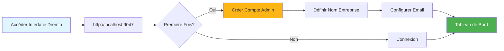
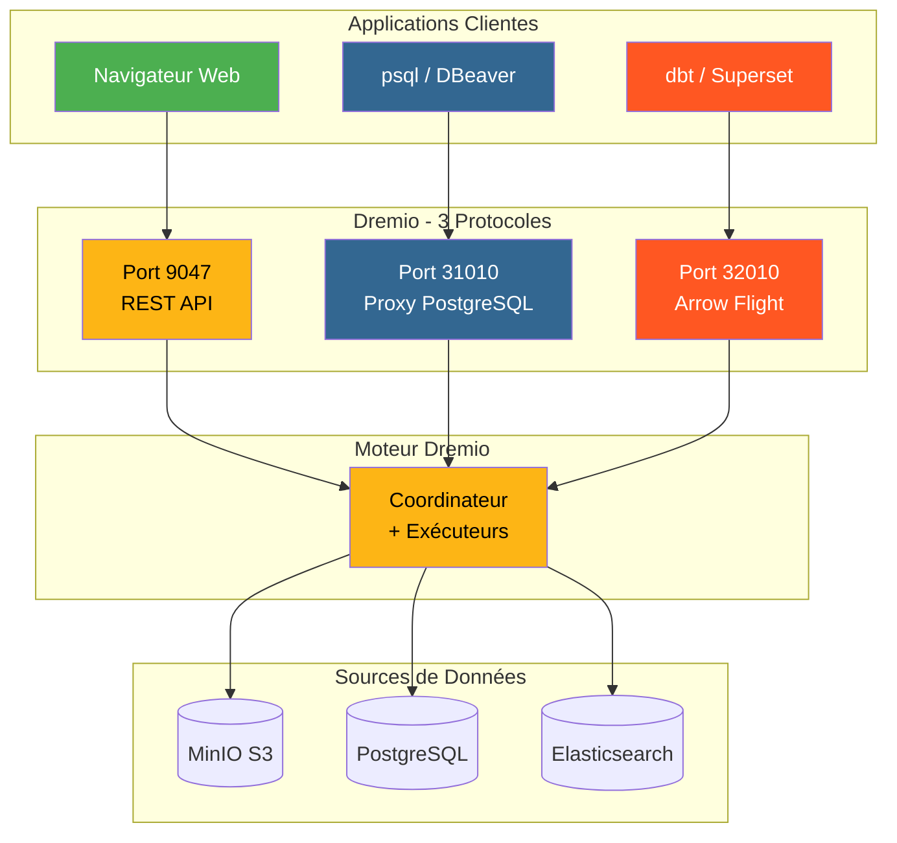
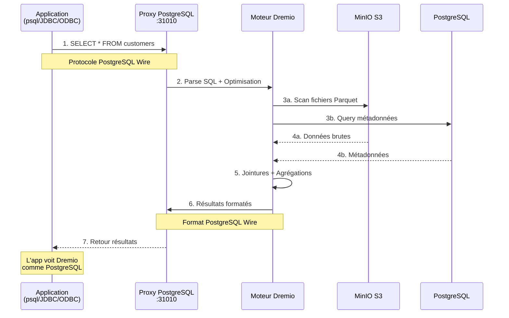
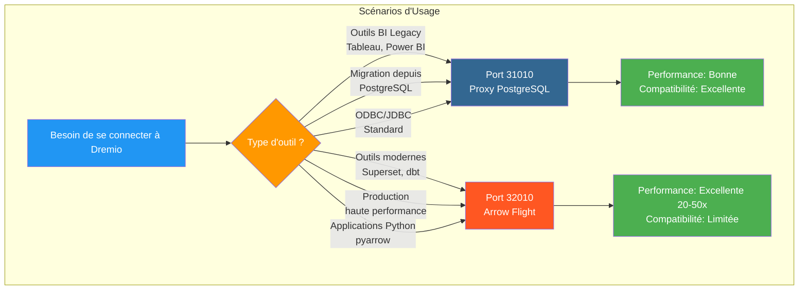
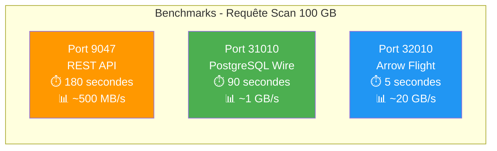
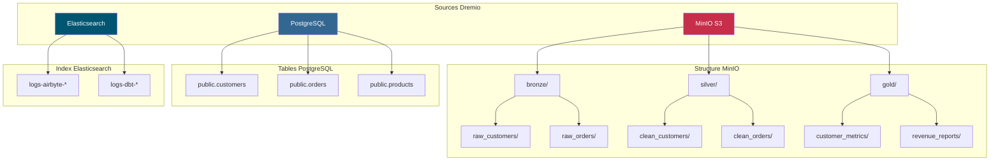
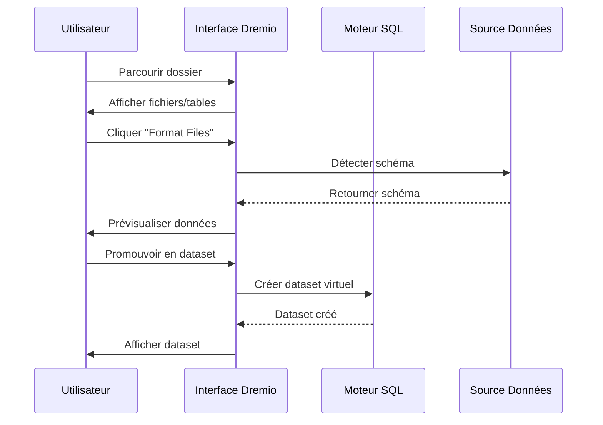
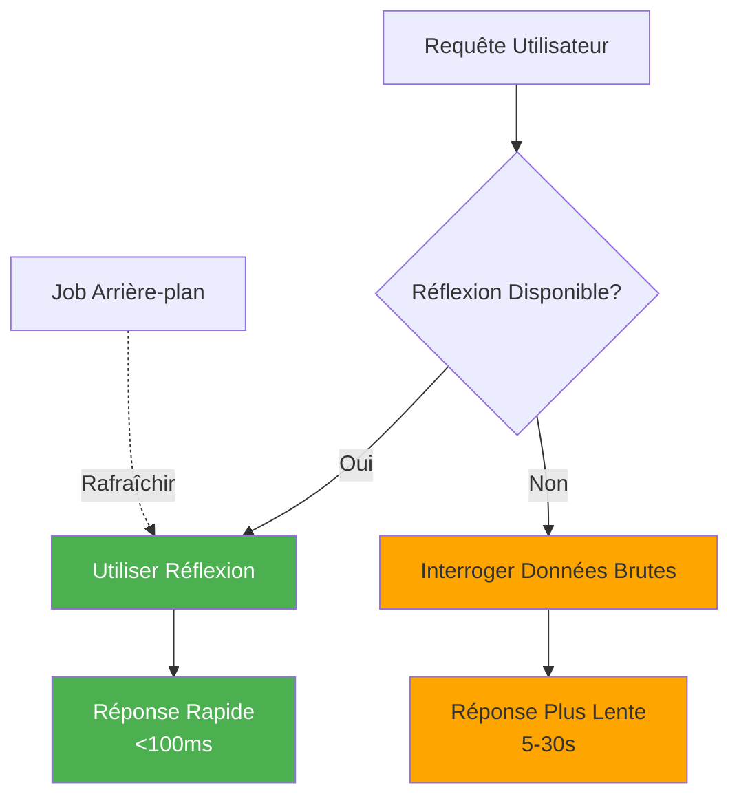

# Dremio 設定ガイド

**バージョン**: 3.2.0  
**最終更新**: 2025 年 10 月 16 日  
**言語**: フランス語

＃＃ 目次

1. [概要](#overview)
2. [初期設定](#initial-configuration)
3. [データソース構成](#data-source-configuration)
4. [仮想データセット](#virtual-datasets)
5. [思考 (アクセラレーション クエリ)](#thoughts-acceleration-queries)
6. [セキュリティとアクセス制御](#security-and-access-control)
7. [パフォーマンスの最適化](#performance-optimization)
8. [dbtとの統合](#integration-with-dbt)
9. [監視とメンテナンス](#monitoring-and-maintenance)
10. [トラブルシューティング](#troubleshooting)

---

＃＃ 概要

Dremio は、複数のソースにわたってデータをクエリするための統合インターフェイスを提供するデータ レイクハウス プラットフォームです。このガイドでは、初期セットアップから高度な最適化テクニックまですべてを説明します。

### ドレミオとは何ですか?

Dremio は、データレイクの柔軟性とデータ ウェアハウスのパフォーマンスを組み合わせています。

- **データ仮想化**: データを移動またはコピーせずにクエリします
- **クエリ アクセラレーション**: リフレクションによる自動キャッシュ
- **セルフサービス分析**: ビジネス ユーザーはデータを直接探索できます
- **SQL 標準**: 独自のクエリ言語はありません
- **Apache Arrow**: 高性能カラム形式

### 主な機能

|特集 |説明 |利益 |
|-----|----------|----------|
| **感想** |インテリジェントなクエリの高速化 | 10 ～ 100 倍高速なクエリ |
| **データ仮想化** |ソースに関する統一ビュー |データの重複なし |
| **アロー フライト** |高速データ転送 | ODBC/JDBC より 20 ～ 50 倍高速 |
| **セマンティック レイヤー** |ビジネス指向のフィールド名 |セルフサービス分析 |
| **データ用の Git** |データセットのバージョン管理 |コラボレーションとロールバック |

---

## 初期設定

### 前提条件

始める前に、次のものが揃っていることを確認してください。
- Dremio コンテナの実行中 ([インストールガイド](../getting-started/installation.md) を参照)
- データソースへのアクセス (MinIO、PostgreSQL など)
- 管理者の資格情報

### 最初の接続



#### ステップ 1: Dremio インターフェイスにアクセスする

ブラウザを開いて次の場所に移動します。
```
http://localhost:9047
```

#### ステップ 2: 管理者アカウントを作成する

初回起動時に、管理者アカウントを作成するように求められます。

```
Nom d'utilisateur: admin
Prénom: Admin
Nom: Utilisateur
Email: admin@example.com
Mot de passe: [mot de passe sécurisé]
```

**セキュリティ上の注意**: 大文字、小文字、数字、特殊文字を含む少なくとも 12 文字の強力なパスワードを使用してください。

#### ステップ 3: 初期セットアップ

```json
{
  "companyName": "Votre Organisation",
  "supportEmail": "support@talentys.eu",
  "supportKey": "votre-clé-support-si-entreprise"
}
```

### 設定ファイル

Dremio 設定は `dremio.conf` を介して管理されます。

```conf
# dremio.conf

paths: {
  local: "/opt/dremio/data"
  dist: "dremioS3:///dremio-data"
}

services: {
  coordinator.enabled: true
  coordinator.master.enabled: true
  
  executor.enabled: true
  
  # Paramètres mémoire
  coordinator.master.heap_memory_mb: 4096
  executor.heap_memory_mb: 8192
}

# Configuration réseau
services.coordinator.web.port: 9047
services.coordinator.client.port: 31010
services.coordinator.flight.port: 32010

# Ajustement performance
store.plugin.max_metadata_leaf_columns: 800
planner.enable_broadcast_join: true
planner.slice_target: 100000
```

### 環境変数

```bash
# Section environment de docker-compose.yml
environment:
  - DREMIO_JAVA_SERVER_EXTRA_OPTS=-Xms2g -Xmx4g
  - DREMIO_JAVA_FLIGHT_EXTRA_OPTS=-Xms1g -Xmx2g
  - DREMIO_MAX_MEMORY_SIZE_MB=8192
  - DREMIO_HOME=/opt/dremio
```

### PostgreSQL プロキシ経由の接続

Dremio はポート 31010 で PostgreSQL 互換インターフェイスを公開し、PostgreSQL 互換ツールを変更せずに接続できるようにします。

#### Dremio 接続アーキテクチャ



#### PostgreSQL プロキシ経由のクエリ フロー



#### プロキシ構成

PostgreSQL プロキシは、`dremio.conf` で自動的に有効になります。

```conf
# Configuration du proxy PostgreSQL (ODBC/JDBC)
services.coordinator.client.port: 31010
```

#### psql との接続

```bash
# Connexion directe avec psql
psql -h localhost -p 31010 -U admin -d datalake

# Exemple de requête
psql -h localhost -p 31010 -U admin -d datalake -c "SELECT * FROM MinIO.datalake.customers LIMIT 10;"
```

#### DBeaver / pgAdmin との接続

接続設定:

```yaml
Type: PostgreSQL
Host: localhost
Port: 31010
Database: datalake
Username: admin
Password: <votre-mot-de-passe>
SSL: Désactivé (en développement)
```

#### 接続チャネル

**JDBC:**
```java
String url = "jdbc:postgresql://localhost:31010/datalake";
Properties props = new Properties();
props.setProperty("user", "admin");
props.setProperty("password", "votre-mot-de-passe");
Connection conn = DriverManager.getConnection(url, props);
```

**ODBC (DSN):**
```ini
[Dremio via PostgreSQL]
Driver=PostgreSQL Unicode
Server=localhost
Port=31010
Database=datalake
Username=admin
Password=<votre-mot-de-passe>
SSLMode=disable
```

**Python (psycopg2):**
```python
import psycopg2

conn = psycopg2.connect(
    host="localhost",
    port=31010,
    database="datalake",
    user="admin",
    password="votre-mot-de-passe"
)

cursor = conn.cursor()
cursor.execute("SELECT * FROM MinIO.datalake.customers LIMIT 10")
rows = cursor.fetchall()
```

#### PostgreSQL プロキシを使用する場合



|シナリオ | PostgreSQL プロキシを使用する |アローフライトを使用する |
|-----------|----------------------------|-----------|
| **BI レガシー ツール** (Arrow Flight をサポートしていません) | ✅ はい | ❌ いいえ |
| **PostgreSQL からの移行** (既存の JDBC/ODBC コード) | ✅ はい | ❌ いいえ |
| **高パフォーマンスの生産** | ❌ いいえ | ✅ はい (20 ～ 50 倍高速) |
| **スーパーセット、dbt、最新のツール** | ❌ いいえ | ✅ はい |
| **迅速な開発/テスト** | ✅ はい（よく知っています） | ⚠️両方OK |

#### 3 つのポートのパフォーマンス比較



**推奨事項**: **互換性**のために PostgreSQL プロキシ (ポート 31010) を使用し、**運用パフォーマンス**のために Arrow Flight (ポート 32010) を使用します。

---

## データソースの構成

### ソース MinIO S3 を追加

MinIO はプライマリ データ レイク ストレージです。

#### ステップ 1: ソースに移動する

```
Interface Dremio → Datasets → Add Source → Object Storage → Amazon S3
```

#### ステップ 2: S3 接続の構成

```json
{
  "name": "MinIO",
  "config": {
    "credentialType": "ACCESS_KEY",
    "accessKey": "minioadmin",
    "accessSecret": "minioadmin",
    "secure": false,
    "externalBucketList": [
      "datalake"
    ],
    "enableAsync": true,
    "compatibilityMode": true,
    "rootPath": "/",
    "defaultCtasFormat": "PARQUET",
    "propertyList": [
      {
        "name": "fs.s3a.path.style.access",
        "value": "true"
      },
      {
        "name": "fs.s3a.endpoint",
        "value": "minio:9000"
      },
      {
        "name": "dremio.s3.compat",
        "value": "true"
      }
    ]
  }
}
```

#### ステップ 3: 接続のテスト

```sql
-- Requête test pour vérifier connexion MinIO
SELECT * FROM MinIO.datalake.bronze.customers LIMIT 10;
```

**期待される結果**:
```
customer_id | name           | email
------------|----------------|------------------
1           | John Doe       | john@example.com
2           | Jane Smith     | jane@example.com
...
```

### PostgreSQL ソースを追加する

＃＃＃＃ 設定

```
Interface Dremio → Datasets → Add Source → Relational → PostgreSQL
```

```json
{
  "name": "PostgreSQL",
  "config": {
    "hostname": "postgres",
    "port": "5432",
    "databaseName": "datawarehouse",
    "username": "postgres",
    "password": "postgres",
    "authenticationType": "MASTER",
    "fetchSize": 2000,
    "encryptionValidationMode": "CERTIFICATE_AND_HOSTNAME_VALIDATION"
  }
}
```

### Elasticsearch ソースを追加

```json
{
  "name": "Elasticsearch",
  "config": {
    "hostList": [
      {"hostname": "elasticsearch", "port": 9200}
    ],
    "authenticationType": "ANONYMOUS",
    "scrollSize": 4000,
    "scrollTimeout": 60000,
    "scriptsEnabled": true,
    "showHiddenIndices": false,
    "showIdColumn": false
  }
}
```

### 情報源の構成



---

## 仮想データセット

仮想データセットを使用すると、データを変換して再利用可能なビューを作成できます。

### 仮想データセットの作成

#### SQL エディターから

```sql
-- Créer dataset jointif
SELECT 
    c.customer_id,
    c.name,
    c.email,
    c.state,
    COUNT(o.order_id) as total_orders,
    SUM(o.amount) as lifetime_value
FROM MinIO.datalake.silver.customers c
LEFT JOIN MinIO.datalake.silver.orders o
    ON c.customer_id = o.customer_id
GROUP BY c.customer_id, c.name, c.email, c.state;

-- Sauvegarder comme dataset virtuel: "customer_summary"
```

**場所を保存**:
```
@username → customer_summary
```

#### インターフェースから



**手順**:
1. MinIO ソースに移動します。
2. `datalake/bronze/customers/` を参照します。
3. 「ファイルをフォーマット」ボタンをクリックします
4. 検出されたパターンを調べる
5.「保存」をクリックしてデータセットにプロモートします

### データセットの構成

スペースとフォルダーを使用して論理構造を作成します。

```
Dremio
├── @admin (Espace Personnel)
│   └── dev (Dossier)
│       ├── test_customers
│       └── test_orders
├── Production (Espace Partagé)
│   ├── Dimensions (Dossier)
│   │   ├── dim_customers
│   │   ├── dim_products
│   │   └── dim_dates
│   └── Facts (Dossier)
│       ├── fct_orders
│       ├── fct_revenue
│       └── fct_customer_lifetime_value
└── Analytics (Espace Partagé)
    ├── customer_metrics
    ├── sales_dashboard_data
    └── marketing_attribution
```

### セマンティック層

ビジネス指向の名前と説明を追加します。

```sql
-- Noms colonnes techniques originaux
SELECT
    cust_id,
    cust_nm,
    cust_em,
    crt_dt
FROM raw.customers;

-- Créer dataset virtuel avec noms sémantiques
SELECT
    cust_id AS "ID Client",
    cust_nm AS "Nom Client",
    cust_em AS "Adresse Email",
    crt_dt AS "Date Inscription"
FROM raw.customers;
```

**説明を追加**:
```
Interface → Dataset → Colonne → Éditer Description

ID Client: Identifiant unique pour chaque client
Nom Client: Nom complet du client
Adresse Email: Email principal pour communication
Date Inscription: Date inscription client sur plateforme
```

---

## リフレクション (アクセラレーション クエリ)

リフレクションは、クエリのパフォーマンスを大幅に向上させる Dremio のインテリジェントなキャッシュ メカニズムです。

### 反射の種類

#### 1. 生の反射

迅速な取得のために列のサブセットを保存します。

```sql
-- Créer réflexion brute
CREATE REFLECTION raw_customer_base
ON Production.Dimensions.dim_customers
USING DISPLAY (
    customer_id,
    name,
    email,
    state,
    registration_date
);
```

**使用事例**：
- 特定の列をクエリするダッシュボード
- 列サブセットを含むレポート
- 探索的なクエリ

#### 2. 集約の反映

即座に結果を得るために集計を事前計算します。

```sql
-- Créer réflexion agrégation
CREATE REFLECTION agg_daily_revenue
ON Production.Facts.fct_orders
USING 
  DIMENSIONS (order_date, product_id, region)
  MEASURES (
    SUM(amount),
    COUNT(*),
    AVG(amount),
    MIN(amount),
    MAX(amount)
  );
```

**使用事例**：
- エグゼクティブダッシュボード
- 概要レポート
- 傾向分析

### 設定の反映



#### リフレッシュメントポリシー

```
Interface → Dataset → Settings → Reflections → Refresh Policy
```

**オプション**:
- **決して更新しない**: 静的データ (例: 履歴アーカイブ)
- **[1 時間] ごとに更新**: 定期的な更新
- **データセット変更時に更新**: リアルタイム同期

```json
{
  "refreshPolicy": {
    "method": "PERIOD",
    "refreshPeriod": 3600000,  // 1 heure en millisecondes
    "gracePeriod": 10800000    // 3 heures
  }
}
```

#### 有効期限ポリシー

```json
{
  "expirationPolicy": {
    "method": "NEVER",
    // ou
    "method": "AFTER_PERIOD",
    "expirationPeriod": 604800000  // 7 jours
  }
}
```

### 振り返りの良い実践方法

#### 1. 高価値のクエリから始める

履歴から遅いクエリを特定します。

```sql
-- Interroger historique jobs pour trouver requêtes lentes
SELECT 
    query_text,
    execution_time_ms,
    dataset_path
FROM sys.jobs
WHERE execution_time_ms > 5000  -- Plus lent que 5 secondes
ORDER BY execution_time_ms DESC
LIMIT 100;
```

#### 2. 対象を絞ったリフレクションを作成する

```sql
-- Mauvais: Réflexion avec trop de dimensions
CREATE REFLECTION too_broad
USING DIMENSIONS (col1, col2, col3, col4, col5, col6)
MEASURES (SUM(amount));

-- Bon: Réflexion ciblée pour cas d'usage spécifique
CREATE REFLECTION targeted
USING DIMENSIONS (order_date, product_category)
MEASURES (SUM(revenue), COUNT(DISTINCT customer_id));
```

#### 3. モニターのカバレッジの反映

```sql
-- Vérifier quelles requêtes sont accélérées
SELECT 
    query_text,
    acceleration_profile.accelerated,
    acceleration_profile.reflection_ids
FROM sys.jobs
WHERE start_time > CURRENT_DATE - INTERVAL '7' DAY;
```

### パフォーマンスへの影響に関する考察

|データセットのサイズ |タイプ クエリ |反射なし |反射あり |加速 |
|-----|-------------|----------------|-----|-------------|
| 100万行 |選択 シンプル | 500ミリ秒 | 50ミリ秒 | 10倍 |
| 1,000万行 |集計 | 15秒 | 200ミリ秒 | 75倍 |
| 1億回線 |複雑な結合 | 2分 | 1秒 | 120倍 |
| 1Bライン |グループ化 | 10分 | 5秒 | 120倍 |

---

## セキュリティとアクセス制御

### ユーザー管理

#### ユーザーの作成

```
Interface → Account Settings → Users → Add User
```

```json
{
  "username": "analyst_user",
  "firstName": "Data",
  "lastName": "Analyst",
  "email": "analyst@example.com",
  "password": "secure_password"
}
```

#### ユーザーの役割

|役割 |権限 |使用例 |
|------|---------------|---------------|
| **管理者** |フルアクセス |システム管理 |
| **ユーザー** |クエリ、個人データセットの作成 |アナリスト、データサイエンティスト |
| **限定ユーザー** |データセットの作成ではなく、クエリのみ |ビジネスユーザー、閲覧者 |

### スペースの権限

```
Interface → Space → Settings → Privileges
```

**権限の種類**:
- **表示**: データセットを表示およびクエリできます。
- **変更**: データセット定義を編集できます
- **許可の管理**: 権限を管理できます
- **所有者**: 完全な制御

**例**：
```
Espace: Production
├── Équipe Analytics → View, Modify
├── Data Engineers → Owner
└── Exécutifs → View
```

### ラインレベルの安全性

行レベルのフィルタリングを実装します。

```sql
-- Créer vue avec filtre niveau ligne
CREATE VDS customer_data_filtered AS
SELECT *
FROM Production.Dimensions.dim_customers
WHERE 
  CASE 
    WHEN CURRENT_USER = 'admin' THEN TRUE
    WHEN region = (
      SELECT home_region 
      FROM users 
      WHERE username = CURRENT_USER
    ) THEN TRUE
    ELSE FALSE
  END;
```

### セキュリティレベル列

機密性の高い列を非表示にします。

```sql
-- Masquer données sensibles pour utilisateurs non-admin
CREATE VDS customer_data_masked AS
SELECT
    customer_id,
    name,
    CASE 
      WHEN CURRENT_USER IN ('admin', 'data_engineer')
      THEN email
      ELSE CONCAT(SUBSTRING(email, 1, 3), '***@***.com')
    END AS email,
    state
FROM Production.Dimensions.dim_customers;
```

### OAuth の統合

```conf
# dremio.conf
services.coordinator.web.auth.type: "oauth"
services.coordinator.web.auth.oauth.providerId: "okta"
services.coordinator.web.auth.oauth.clientId: "your-client-id"
services.coordinator.web.auth.oauth.clientSecret: "your-client-secret"
services.coordinator.web.auth.oauth.authorizeUrl: "https://your-domain.okta.com/oauth2/v1/authorize"
services.coordinator.web.auth.oauth.tokenUrl: "https://your-domain.okta.com/oauth2/v1/token"
```

---

## パフォーマンスの最適化

### クエリ最適化手法

#### 1. パーティションのプルーニング

```sql
-- Mauvais: Scanne toutes les données
SELECT * FROM orders
WHERE amount > 100;

-- Bon: Élague partitions
SELECT * FROM orders
WHERE order_date >= '2025-10-01'
  AND order_date < '2025-11-01'
  AND amount > 100;
```

#### 2. 列の枝刈り

```sql
-- Mauvais: Lit toutes les colonnes
SELECT * FROM large_table LIMIT 100;

-- Bon: Lit uniquement colonnes nécessaires
SELECT customer_id, name, email 
FROM large_table 
LIMIT 100;
```

#### 3. 述語のプッシュダウン

```sql
-- Filtres poussés vers couche stockage
SELECT c.name, o.amount
FROM customers c
JOIN orders o ON c.customer_id = o.customer_id
WHERE o.order_date >= CURRENT_DATE - INTERVAL '30' DAY;
-- Filtre appliqué avant jointure
```

#### 4. 結合の最適化

```sql
-- Utiliser broadcast join pour petites dimensions
SELECT /*+ BROADCAST(d) */
    f.order_id,
    d.product_name,
    f.amount
FROM facts.orders f
JOIN dimensions.products d
    ON f.product_id = d.product_id;
```

### メモリ構成

```conf
# dremio.conf

# Augmenter mémoire pour grandes requêtes
services.executor.heap_memory_mb: 32768

# Configurer spill to disk
spill.directory: "/opt/dremio/spill"
spill.enable: true

# Limites mémoire requête
planner.memory.max_query_memory_per_node: 10737418240  # 10GB
planner.memory.query_max_cost: 1000000000
```

### クラスターのサイジング

|負荷の種類 |コーディネーター |執行者 |クラスター全体 |
|-----------|-----------|---------------|------|
| **小さい** | 4 CPU、16 GB | 2x (8 CPU、32 GB) | 20 CPU、80 GB |
| **中** | 8 CPU、32 GB | 4x (16 CPU、64 GB) | 72 CPU、288 GB |
| **大** | 16 CPU、64 GB | 8x (32 CPU、128 GB) | 272 CPU、1088 GB |

### パフォーマンスの監視

```sql
-- Analyser performance requête
SELECT 
    query_id,
    query_text,
    start_time,
    execution_time_ms / 1000.0 AS execution_time_seconds,
    planner_estimated_cost,
    rows_returned,
    acceleration_profile.accelerated
FROM sys.jobs
WHERE start_time > CURRENT_DATE - INTERVAL '1' DAY
ORDER BY execution_time_ms DESC
LIMIT 20;
```

---

## dbt との統合

### ターゲット DBT としての Dremio

`profiles.yml`を構成します。

```yaml
# profiles.yml
dremio_project:
  target: dev
  outputs:
    dev:
      type: dremio
      threads: 4
      host: localhost
      port: 9047
      username: admin
      password: "{{ env_var('DREMIO_PASSWORD') }}"
      use_ssl: false
      space: "@admin"
      
    prod:
      type: dremio
      threads: 8
      host: dremio.example.com
      port: 443
      username: dbt_service_account
      password: "{{ env_var('DREMIO_PASSWORD') }}"
      use_ssl: true
      space: "Production"
```

### Dremio の dbt モデル

```sql
-- models/staging/stg_customers.sql
{{
    config(
        materialized='view',
        alias='stg_customers'
    )
}}

SELECT
    customer_id,
    TRIM(UPPER(name)) AS customer_name,
    LOWER(email) AS email,
    state,
    created_at
FROM {{ source('minio', 'raw_customers') }}
WHERE customer_id IS NOT NULL
```

### dbt のリフレクションを活用する

```sql
-- models/marts/fct_customer_metrics.sql
{{
    config(
        materialized='table',
        post_hook=[
            "ALTER VDS {{ this }} ENABLE RAW REFLECTION",
            "ALTER VDS {{ this }} ENABLE AGGREGATION REFLECTION 
             USING DIMENSIONS (customer_id, registration_month) 
             MEASURES (SUM(lifetime_value), COUNT(*))"
        ]
    )
}}

SELECT
    customer_id,
    DATE_TRUNC('month', registration_date) AS registration_month,
    COUNT(DISTINCT order_id) AS total_orders,
    SUM(order_amount) AS lifetime_value
FROM {{ ref('int_customer_orders') }}
GROUP BY customer_id, DATE_TRUNC('month', registration_date)
```

---

## 監視とメンテナンス

### 監視すべき主要な指標

```yaml
metrics:
  - name: Performance Requête
    query: "SELECT AVG(execution_time_ms) FROM sys.jobs WHERE start_time > NOW() - INTERVAL '1' HOUR"
    threshold: 5000  # Alerte si moyenne > 5 secondes
    
  - name: Couverture Réflexion
    query: "SELECT COUNT(*) FILTER (WHERE accelerated = true) * 100.0 / COUNT(*) FROM sys.jobs WHERE start_time > NOW() - INTERVAL '1' DAY"
    threshold: 80  # Alerte si couverture < 80%
    
  - name: Requêtes Échouées
    query: "SELECT COUNT(*) FROM sys.jobs WHERE query_state = 'FAILED' AND start_time > NOW() - INTERVAL '1' HOUR"
    threshold: 10  # Alerte si > 10 échecs par heure
```

### メンテナンスタスク

#### 1. 考えをリフレッシュする

```sql
-- Rafraîchir manuellement réflexion
ALTER REFLECTION reflection_id REFRESH;

-- Reconstruire toutes réflexions pour dataset
ALTER VDS Production.Facts.fct_orders 
REFRESH ALL REFLECTIONS;
```

#### 2. 古いデータをクリーンアップする

```sql
-- Nettoyer historique requêtes
DELETE FROM sys.jobs
WHERE start_time < CURRENT_DATE - INTERVAL '90' DAY;

-- Compacter métadonnées (Enterprise uniquement)
VACUUM CATALOG;
```

#### 3. 統計の更新

```sql
-- Rafraîchir statistiques table
ANALYZE TABLE MinIO.datalake.silver.customers;

-- Mettre à jour métadonnées dataset
REFRESH DATASET MinIO.datalake.silver.customers;
```

---

## トラブルシューティング

### よくある問題

#### 問題 1: クエリのパフォーマンスが遅い

**症状**: クエリに数秒ではなく数分かかる

**診断**：
```sql
-- Vérifier profil requête
SELECT * FROM sys.jobs WHERE job_id = 'your-job-id';

-- Vérifier si réflexion utilisée
SELECT acceleration_profile FROM sys.jobs WHERE job_id = 'your-job-id';
```

**解決策**:
1. 適切な思考を作成する
2. パーティションプルーニングフィルターを追加する
3. エグゼキュータメモリを増やす
4. キューイングを有効にする キューイング

#### 問題 2: 反射が構築されない

**症状**: 反射が「REFRESHING」状態のままになる

**診断**：
```sql
-- Vérifier statut réflexion
SELECT * FROM sys.reflections WHERE status != 'ACTIVE';

-- Vérifier erreurs réflexion
SELECT * FROM sys.reflection_dependencies;
```

**解決策**:
1. ソースデータでスキーマの変更を確認する
2. 十分なディスク容量を確認します
3. タイムアウト構築の反映を増やす
4. リフレクションを無効にして再度有効にする

#### 問題 3: 接続タイムアウト

**症状**: ソースのクエリ時に「接続タイムアウト」エラーが発生する

**解決策**:
```conf
# dremio.conf
store.plugin.keep_alive_ms: 30000
store.plugin.timeout_ms: 120000
```

#### 問題 4: メモリ不足

**症状**: ログに「OutOfMemoryError」が記録される

**解決策**:
```conf
# Augmenter taille heap
services.executor.heap_memory_mb: 65536

# Activer spill to disk
spill.enable: true
spill.directory: "/opt/dremio/spill"
```

### 診断クエリ

```sql
-- Requêtes actives
SELECT query_id, query_text, start_time, user_name
FROM sys.jobs
WHERE query_state = 'RUNNING';

-- Utilisation ressources par utilisateur
SELECT 
    user_name,
    COUNT(*) as query_count,
    AVG(execution_time_ms) as avg_execution_ms,
    SUM(rows_returned) as total_rows
FROM sys.jobs
WHERE start_time > CURRENT_DATE
GROUP BY user_name;

-- Modèles accès dataset
SELECT 
    dataset_path,
    COUNT(*) as access_count,
    COUNT(DISTINCT user_name) as unique_users
FROM sys.jobs
WHERE start_time > CURRENT_DATE - INTERVAL '7' DAY
GROUP BY dataset_path
ORDER BY access_count DESC
LIMIT 20;
```

---

＃＃ まとめ

この包括的なガイドでは次の内容がカバーされています。

- **初期構成**: 初めての構成、管理者アカウントの作成、構成ファイル
- **データ ソース**: MinIO 接続、PostgreSQL、および Elasticsearch
- **仮想データセット**: セマンティック レイヤーを使用した再利用可能な変換ビューの作成
- **リフレクション**: 10 ～ 100 倍のクエリ高速化のための生のリフレクションと集計
- **セキュリティ**: ユーザー管理、スペース権限、行/列レベルのセキュリティ
- **パフォーマンス**: クエリの最適化、メモリ構成、クラスターのサイジング
- **dbt 統合**: リフレクション管理を備えた dbt ターゲットとして Dremio を使用します
- **モニタリング**: 主要なメトリクス、メンテナンス タスク、診断リクエスト
- **トラブルシューティング**: 一般的な問題と解決策

覚えておくべき重要なポイント:
- Dremio は、すべてのデータソースにわたって統一された SQL インターフェースを提供します
- 制作パフォーマンスに必要な考え方
- 適切なセキュリティ構成により、セルフサービス分析が可能になります
- 定期的なモニタリングにより最適なパフォーマンスを保証します

**関連ドキュメント:**
- [アーキテクチャコンポーネント](../architecture/components.md)
- [データフロー](../architecture/data-flow.md)
- [dbt 開発ガイド](./dbt-development.md)
- [エアバイト統合](./airbyte-integration.md)

---

**バージョン**: 3.2.0  
**最終更新**: 2025 年 10 月 16 日