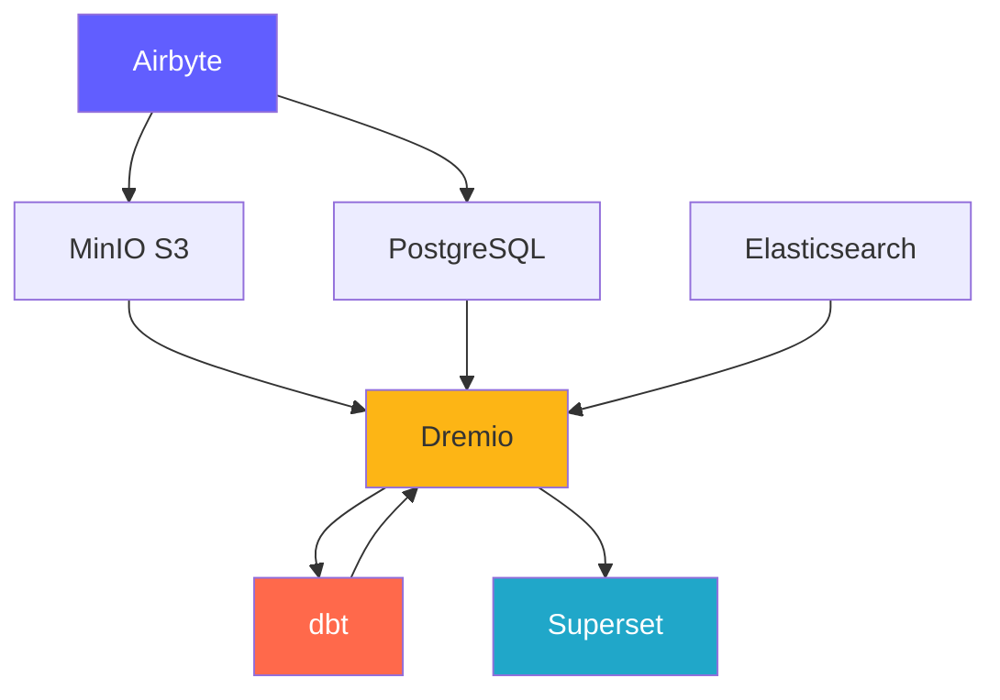
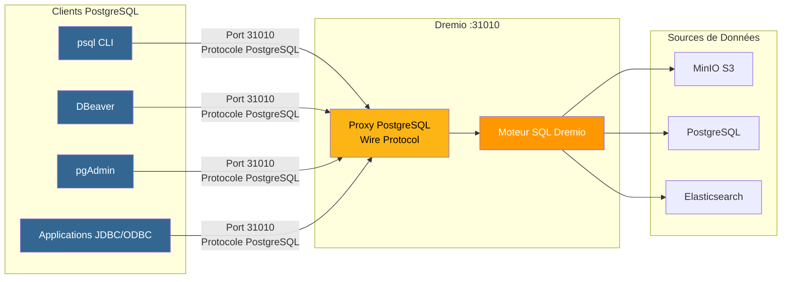
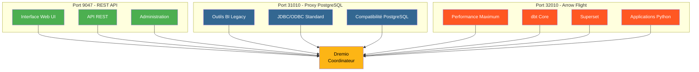
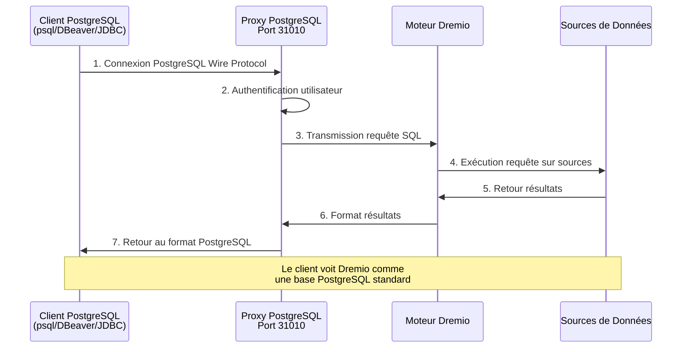
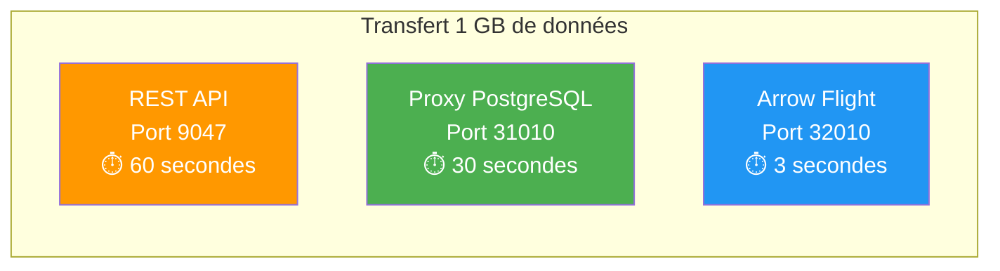

# 플랫폼 구성 요소

**버전**: 3.2.0  
**최종 업데이트**: 2025-10-16  
**언어**: 프랑스어

---

## 구성 요소 개요

데이터 플랫폼은 완벽한 솔루션을 제공하기 위해 함께 작동하는 7개의 주요 구성 요소로 구성됩니다.



---

## 1. Airbyte – 데이터 통합 ​​플랫폼

### 개요

Airbyte는 여러 소스의 데이터를 대상으로 통합하는 오픈 소스 데이터 통합 ​​엔진입니다.

**버전**: 0.50.33  
**라이센스**: MIT  
**웹사이트**: https://airbyte.com

### 주요 기능

- **300개 이상의 사전 구축된 커넥터**: 데이터베이스, API, 파일, SaaS 애플리케이션
- **변경 데이터 캡처(CDC)**: 실시간 데이터 복제
- **사용자 정의 커넥터**: Python 또는 로우 코드 CDK로 빌드
- **정규화**: JSON을 관계형 테이블로 변환
- **증분 동기화**: 신규/수정된 데이터만 동기화
- **모니터링**: 통합 추적 상태 동기화

### 건축학

```yaml
Composants:
  airbyte-webapp:
    Port: 8000
    Objectif: Interface utilisateur web
    
  airbyte-server:
    Port: 8001
    Objectif: Serveur API REST
    
  airbyte-worker:
    Objectif: Exécuter tâches synchronisation
    Scalabilité: Horizontale
    
  airbyte-temporal:
    Port: 7233
    Objectif: Orchestration workflows
    
  airbyte-db:
    Port: 5432
    Objectif: Stockage métadonnées (PostgreSQL)
```

### 사용 사례

- **ELT 파이프라인**: 추출-로드-변환 워크플로
- **데이터베이스 복제**: 데이터베이스 동기화 유지
- **API 통합**: REST API에서 데이터 추출
- **데이터 레이크 수집**: S3/MinIO에 데이터 로드
- **클라우드 마이그레이션**: 온프레미스 데이터를 클라우드로 이동

### 설정

```yaml
# Variables d'Environnement
AIRBYTE_VERSION: "0.50.33"
AIRBYTE_HTTP_PORT: 8000
AIRBYTE_API_PORT: 8001
AIRBYTE_WORKSPACE_ROOT: /tmp/airbyte_local

# Limites Ressources
CPU_LIMIT: "2.0"
MEMORY_LIMIT: "2Gi"
```

### 통합 포인트

- **출력 대상**: MinIO S3, PostgreSQL, Dremio
- **오케스트레이션**: Airflow, Prefect에 의해 트리거될 수 있음
- **모니터링**: Prometheus 측정항목 엔드포인트

---

## 2. Dremio – 데이터 레이크하우스 플랫폼

### 개요

Dremio는 쿼리 가속화를 통해 모든 데이터 소스에 대한 통합 SQL 인터페이스를 제공합니다.

**버전**: 26.0 OSS  
**라이센스**: 아파치 2.0  
**웹사이트**: https://www.dremio.com

### 주요 기능

- **데이터 레이크하우스**: 레이크 유연성과 웨어하우스 성능 결합
- **생각**: 자동 쿼리 가속(최대 100배 빠름)
- **애로우 플라이트**: 고성능 데이터 전송
- **데이터 가상화**: 데이터 이동 없이 쿼리 가능
- **의미적 레이어**: 비즈니스 친화적인 데이터 정의
- **시간 여행**: 주어진 과거 버전에 대한 쿼리

### 건축학

```yaml
Composants:
  Coordinateur:
    Port: 9047 (HTTP), 31010 (ODBC), 32010 (Arrow Flight)
    Objectif: Planification requêtes, gestion métadonnées
    Mémoire: 8Go heap + 8Go direct
    
  Exécuteur:
    Objectif: Exécution requêtes
    Mémoire: 4Go heap + 8Go direct
    Scalabilité: Horizontale (ajouter plus d'exécuteurs)
    
  Stockage:
    Type: Distribué (MinIO, S3, HDFS)
    Format: Parquet, Iceberg
```

### 사용 사례

- **셀프 서비스 분석**: 비즈니스 사용자가 데이터를 탐색할 수 있도록 허용
- **데이터 메시**: 데이터에 대한 통합 액세스
- **쿼리 가속화**: 대시보드 쿼리 가속화
- **데이터 카탈로그**: ​​데이터 검색 및 관리
- **BI 활성화**: Power Tableau, Power BI, Superset

### 설정

```conf
# dremio.conf
paths.local: "/opt/dremio/data"
services.coordinator.enabled: true
services.executor.enabled: true

services.coordinator.web.port: 9047
services.flight.endpoint.port: 32010

services.executor.cache.pct.max: 70
```

### 통합 포인트

- **읽기**: MinIO S3, PostgreSQL, Elasticsearch
- **변환 방법**: dbt
- **사용 대상**: Superset, Tableau, Power BI

### Dremio용 PostgreSQL 프록시

Dremio는 PostgreSQL 서버를 에뮬레이트할 수 있으므로 PostgreSQL 호환 도구가 마치 표준 PostgreSQL 데이터베이스인 것처럼 Dremio에 연결할 수 있습니다.

#### PostgreSQL 프록시 아키텍처



#### 드레미오 포트 3개 비교



#### 프록시 구성

```yaml
Proxy PostgreSQL:
  Port: 31010 (ODBC/JDBC)
  Protocole: PostgreSQL Wire Protocol
  Compatibilité: Outils compatibles PostgreSQL (psql, pgAdmin, DBeaver)
  
Avantages:
  - Aucune modification du code client
  - Support des pilotes PostgreSQL existants
  - Connexion via JDBC/ODBC standard
  - Compatible avec la plupart des outils BI
```

#### 프록시 사용 사례

1. **BI 레거시 도구**: Arrow Flight를 지원하지 않는 도구 연결
2. **손쉬운 마이그레이션**: 코드 변경 없이 PostgreSQL을 Dremio로 교체
3. **ODBC/JDBC 호환성**: 표준 PostgreSQL 드라이버 사용
4. **개발**: 익숙한 PostgreSQL 도구(psql, pgAdmin)를 사용하여 테스트

#### 연결 예

```bash
# Via psql
psql -h localhost -p 31010 -U admin -d datalake

# Via DBeaver / pgAdmin
Host: localhost
Port: 31010
Database: datalake
Username: admin
Password: <votre-mot-de-passe>

# Chaîne JDBC
jdbc:postgresql://localhost:31010/datalake

# Chaîne ODBC
Driver=PostgreSQL Unicode;
Server=localhost;
Port=31010;
Database=datalake;
Uid=admin;
Pwd=<votre-mot-de-passe>;
```

#### 제한 사항

- **성능**: Arrow Flight(포트 32010)가 20-50배 더 ​​빠릅니다.
- **기능**: 일부 고급 PostgreSQL 기능은 지원되지 않습니다.
- **권장사항**: 프로덕션에는 Arrow Flight를 사용하고 호환성을 위해서는 PostgreSQL 프록시를 사용하세요.

#### PostgreSQL 프록시를 통한 연결 흐름



#### 프로토콜 비교

| 프로토콜 | 포트 | 성과 | 대기 시간 | 사용 사례 |
|---------------|------|---------------|---------|-------|
| **REST API** | 9047 | 표준 | ~50-100ms | 웹 UI, 관리 |
| **ODBC/JDBC(PostgreSQL 프록시)** | 31010 | 좋음 | ~20-50ms | 레거시 BI 도구, 호환성 |
| **화살비행** | 32010 | 우수(20-50x) | ~5-10ms | 생산, 슈퍼세트, DBT |

#### 비교 성능



---

## 3. dbt - 데이터 변환 도구

### 개요

dbt(데이터 구축 도구)를 사용하면 분석 엔지니어가 SQL을 사용하여 데이터를 변환할 수 있습니다.

**버전**: 1.10+  
**라이센스**: 아파치 2.0  
**웹사이트**: https://www.getdbt.com

### 주요 기능

- **SQL 기반**: SQL로 변환 쓰기
- **버전 관리**: 협업을 위한 Git 통합
- **테스트**: 통합 데이터 품질 테스트
- **문서화**: 데이터 사전 자동 생성
- **모듈화**: 재사용 가능한 매크로 및 패키지
- **증분 모델**: 새로운 데이터만 처리

### 건축학

```yaml
Composants:
  dbt Core:
    Objectif: Outil CLI pour exécuter transformations
    Langage: Python
    
  Modèles:
    Objectif: Instructions SQL SELECT
    Types: Vues, Tables, Incrémental, Snapshots
    
  Tests:
    Objectif: Validation qualité données
    Types: Unique, Not Null, Relations, Personnalisés
    
  Macros:
    Objectif: Fonctions SQL réutilisables
    Langage: Jinja2
```

### 사용 사례

- **데이터 모델링**: 스타/플레이크 다이어그램 작성
- **데이터 품질**: 데이터 무결성 검증
- **천천히 변화하는 차원**: 기록 변경 사항 추적
- **데이터 집계**: 요약 테이블 생성
- **데이터 문서**: 데이터 카탈로그 생성

### 설정

```yaml
# dbt_project.yml
name: 'dremio_dbt'
version: '1.0.0'
profile: 'dremio'

models:
  dremio_dbt:
    staging:
      +materialized: view
      +schema: staging
    marts:
      +materialized: table
      +schema: marts
```

### 통합 포인트

- **읽기 내용**: Dremio 데이터세트
- **수신인**: Dremio(Arrow Flight를 통해)
- **조정자**: Airflow, cron, Airbyte post-sync

---

## 4. Apache Superset – 비즈니스 인텔리전스 플랫폼

### 개요

Superset은 최신 데이터 탐색 및 시각화 플랫폼입니다.

**버전**: 3.0  
**라이센스**: 아파치 2.0  
**웹사이트**: https://superset.apache.org

### 주요 기능

- **SQL IDE**: 자동 완성 기능이 있는 고급 SQL 편집기
- **풍부한 시각화**: 50개 이상의 차트 유형
- **대화형 대시보드**: 드릴다운, 필터, 교차 필터링
- **SQL Lab**: 임시 쿼리 인터페이스
- **알림**: 예약된 보고서 및 알림
- **캐싱**: 성능을 위해 쿼리 결과를 캐시합니다.

### 건축학

```yaml
Composants:
  Serveur Web:
    Port: 8088
    Objectif: Servir interface web
    Framework: Flask
    
  Workers Celery:
    Objectif: Exécution requêtes asynchrone
    File: Redis/RabbitMQ
    
  Celery Beat:
    Objectif: Tâches planifiées (préchauffage cache, alertes)
    
  Base de Données:
    Objectif: Stocker tableaux de bord, utilisateurs, logs requêtes
    Type: PostgreSQL
```

### 사용 사례

- **경영진 대시보드**: KPI 모니터링
- **운영 분석**: 실시간 모니터링
- **BI 셀프 서비스**: 분석가 역량 강화
- **내장형 분석**: 애플리케이션에 iframe 통합
- **데이터 탐색**: 임시 분석

### 설정

```python
# superset_config.py
SQLALCHEMY_DATABASE_URI = 'postgresql://...'
SECRET_KEY = '...'

FEATURE_FLAGS = {
    'DASHBOARD_NATIVE_FILTERS': True,
    'DASHBOARD_CROSS_FILTERS': True,
    'ENABLE_TEMPLATE_PROCESSING': True
}

CACHE_CONFIG = {
    'CACHE_TYPE': 'redis',
    'CACHE_DEFAULT_TIMEOUT': 300
}
```

### 통합 포인트

- **요청**: Dremio(Arrow Flight를 통해)
- **인증**: LDAP, OAuth2, 데이터베이스
- **알림**: 이메일, Slack

---

## 5. PostgreSQL - 관계형 데이터베이스

### 개요

PostgreSQL은 고급 오픈 소스 관계형 데이터베이스 관리 시스템입니다.

**버전**: 16  
**라이센스**: PostgreSQL 라이센스  
**웹사이트**: https://www.postgresql.org

### 주요 기능

- **ACID 규정 준수**: 안정적인 거래
- **JSON 지원**: 기본 JSON/JSONB 유형
- **전체 텍스트 검색**: 통합 검색 기능
- **확장**: PostGIS, pg_stat_statements, TimescaleDB
- **복제**: 스트리밍 복제, 논리적 복제
- **파티셔닝**: 기본 테이블 파티셔닝

### 건축학

```yaml
Composants:
  Serveur PostgreSQL:
    Port: 5432
    Protocole: Protocole wire PostgreSQL
    
  Bases de Données:
    - dremio_db: Métadonnées Dremio
    - superset_db: Configuration Superset
    - airbyte_db: Métadonnées Airbyte
    
  Connexions:
    Max: 200
    Pooling: PgBouncer (optionnel)
```

### 사용 사례

- **메타데이터 저장소**: 시스템 메타데이터를 저장합니다.
- **트랜잭션 로드**: OLTP 애플리케이션
- **스테이징 테이블**: 임시 데이터 처리
- **스토리지 구성**: 애플리케이션 설정
- **감사 로그**: ​​시스템 변경 사항 추적

### 설정

```conf
# postgresql.conf
max_connections = 200
shared_buffers = 256MB
effective_cache_size = 1GB
maintenance_work_mem = 64MB
work_mem = 4MB

# Performance
random_page_cost = 1.1
effective_io_concurrency = 200

# Journalisation
log_statement = 'mod'
log_duration = on
```

### 통합 포인트

- **읽은 사람**: Dremio, Superset, Airbyte
- **작성자**: Airbyte, dbt, apps
- **관리자**: 자동 백업, 복제

---

## 6. MinIO – S3 호환 개체 스토리지

### 개요

MinIO는 고성능 S3 호환 개체 스토리지 시스템입니다.

**버전**: 최신  
**라이센스**: AGPLv3  
**웹사이트**: https://min.io

### 주요 기능

- **S3 API**: Amazon S3와 100% 호환
- **고성능**: 다중 GB/s 처리량
- **삭제 코딩**: 지속 가능성 및 가용성 데이터
- **버전 관리**: 객체 버전 관리
- **암호화**: 서버측 및 클라이언트측
- **멀티 클라우드**: 어디에나 배포

### 건축학

```yaml
Composants:
  Serveur MinIO:
    Port: 9000 (API S3), 9001 (Console)
    Mode: Nœud unique ou distribué
    
  Stockage:
    Format: Erasure coded ou brut
    Redondance: Configurable (ex: 4+2)
    
  Buckets:
    - datalake: Stockage données principal
    - raw-data: Ingestion Airbyte
    - processed-data: Sorties dbt
    - backups: Sauvegardes système
```

### 사용 사례

- **데이터 레이크**: 원시 데이터와 처리된 데이터를 저장합니다.
- **객체 스토리지**: 파일, 이미지, 비디오
- **스토리지 백업**: 데이터베이스 및 시스템 백업
- **아카이브**: 장기 데이터 보존
- **데이터 스테이징**: 임시 처리 저장

### 설정

```yaml
# Variables d'Environnement
MINIO_ROOT_USER: minioadmin
MINIO_ROOT_PASSWORD: minioadmin123
MINIO_VOLUMES: /data

# Politiques Buckets
- datalake: Lecture-écriture pour plateforme données
- raw-data: Écriture par Airbyte, lecture par Dremio
- processed-data: Écriture par dbt, lecture tous
```

### 통합 포인트

- **작성자**: Airbyte, dbt, apps
- **읽는 사람**: Dremio, 데이터 과학자
- **관리자**: mc (MinIO 클라이언트), s3cmd

---

## 7. Elasticsearch - 검색 및 분석 엔진

### 개요

Elasticsearch는 Apache Lucene을 기반으로 구축된 분산 검색 및 분석 엔진입니다.

**버전**: 8.15  
**라이선스**: 탄력적 라이선스 2.0  
**웹사이트**: https://www.elastic.co

### 주요 기능

- **전체 텍스트 검색**: 고급 검색 기능
- **실시간 인덱싱**: 거의 실시간 데이터 가용성
- **분산**: 수평적 확장성
- **집계**: 복잡한 분석
- **RESTful API**: 간단한 HTTP API
- **머신러닝**: 이상 탐지

### 건축학

```yaml
Composants:
  Nœud Elasticsearch:
    Port: 9200 (HTTP), 9300 (Transport)
    Rôles: Master, Data, Ingest, ML
    
  Index:
    Objectif: Stocker documents recherchables
    Shards: Distribués entre nœuds
    Répliques: Pour haute disponibilité
    
  Cycle de Vie Index:
    Hot: Données récentes (SSD)
    Warm: Données anciennes (HDD)
    Cold: Archive (S3)
```

### 사용 사례

- **분석 로그**: ​​중앙 집중식 로깅(ELK 스택)
- **애플리케이션 검색**: 제품 카탈로그, 사이트 검색
- **보안 분석**: SIEM 사용 사례
- **관찰 가능성**: 측정항목 및 추적
- **텍스트 분석**: NLP 및 감정 분석

### 설정

```yaml
# elasticsearch.yml
cluster.name: "dremio-search-cluster"
node.name: "node-1"
network.host: 0.0.0.0
http.port: 9200

# Sécurité
xpack.security.enabled: true
xpack.security.transport.ssl.enabled: false

# Mémoire
bootstrap.memory_lock: true
```

### 통합 포인트

- **색인 생성자**: Logstash, Filebeat
- **요청자**: Dremio, Kibana
- **모니터링 대상**: Elasticsearch 모니터링

---

## 구성품 비교

| 구성요소 | 유형 | 주요 용도 | 확장성 | 상태 |
|---------------|------|----|-------------|------|
| **에어바이트** | 통합 | 데이터 수집 | 수평(근로자) | 무국적 |
| **드레미오** | 쿼리 엔진 | 데이터 액세스 | 수평(실행자) | 무국적 |
| **dbt** | 변환 | 데이터 모델링 | 세로 (하트) | 무국적 |
| **슈퍼세트** | BI 플랫폼 | 시각화 | 수평(웹) | 무국적 |
| **PostgreSQL** | 데이터베이스 | 메타데이터 저장 | 수직(+ 복제) | 상태 저장 |
| **미니IO** | 객체 스토리지 | 데이터 레이크 | 수평(분산) | 상태 저장 |
| **엘라스틱서치** | 검색 엔진 | 전문 검색 | 수평(클러스터) | 상태 저장 |

---

## 리소스 요구 사항

### 최소 구성(개발)

```yaml
Total: 8 Go RAM, 4 CPUs, 50 Go Disque

Allocation:
  Airbyte: 1 Go RAM, 0.5 CPU
  Dremio: 2 Go RAM, 1 CPU
  Superset: 1 Go RAM, 0.5 CPU
  PostgreSQL: 1 Go RAM, 0.5 CPU
  MinIO: 1 Go RAM, 0.5 CPU
  Elasticsearch: 2 Go RAM, 1 CPU
```

### 권장 구성(프로덕션)

```yaml
Total: 64 Go RAM, 16 CPUs, 500 Go SSD

Allocation:
  Airbyte: 4 Go RAM, 2 CPUs
  Dremio: 16 Go RAM, 4 CPUs
  Superset: 8 Go RAM, 2 CPUs
  PostgreSQL: 8 Go RAM, 2 CPUs
  MinIO: 16 Go RAM, 2 CPUs
  Elasticsearch: 12 Go RAM, 4 CPUs
```

---

## 버전 호환성 매트릭스

| 구성요소 | 출시 | 호환 가능 |
|------------|---------|---------|
| 에어바이트 | 0.50+ | 모든 목적지 |
| 드레미오 | 26.0 | dbt 1.8+, Arrow Flight 고객 |
| DBT | 1.10+ | 드레미오 23.0+ |
| 슈퍼세트 | 3.0+ | Dremio 22.0+, PostgreSQL 12+ |
| 포스트그레SQL | 16 | 모든 구성요소 |
| 미니IO | 최신 | S3 호환 클라이언트 |
| 엘라스틱서치 | 8.15 | Dremio 26.0+, Logstash 8.x |

---

**구성요소 가이드 버전**: 3.2.0  
**최종 업데이트**: 2025-10-16  
**관리자**: 데이터 플랫폼 팀