# 데이터 흐름 아키텍처

**버전**: 3.2.0  
**최종 업데이트**: 2025년 10월 16일  
**언어**: 프랑스어

## 목차

1. [개요](#overview)
2. [엔드 투 엔드 데이터 흐름](#end-to-end-dataflow)
3. [수집 레이어](#ingestion-layer)
4. [저장 레이어](#storage-layer)
5. [처리 레이어](#processing-layer)
6. [프레젠테이션 레이어](#presentation-layer)
7. [데이터 흐름 모델](#dataflow-models)
8. [성능 고려 사항](#performance-considerations)
9. [데이터 흐름 모니터링](#dataflow-monitoring)
10. [모범 사례](#good-practices)

---

## 개요

이 문서에서는 초기 데이터 수집부터 최종 소비까지 플랫폼의 전체 데이터 흐름 아키텍처를 자세히 설명합니다. 성능을 최적화하고, 문제를 해결하고, 효과적인 데이터 파이프라인을 설계하려면 이러한 흐름을 이해하는 것이 중요합니다.

### 데이터 흐름 원칙

우리의 아키텍처는 다음과 같은 기본 원칙을 따릅니다.

1. **단방향 흐름**: 데이터가 명확하고 예측 가능한 방향으로 이동합니다.
2. **계층화된 처리**: 각 계층에는 특정 책임이 있습니다.
3. **분리된 구성 요소**: 서비스는 잘 정의된 인터페이스를 통해 통신합니다.
4. **멱등성**: 작업을 안전하게 반복할 수 있습니다.
5. **관찰성**: 모든 단계가 기록되고 모니터링됩니다.

### 아키텍처 레이어

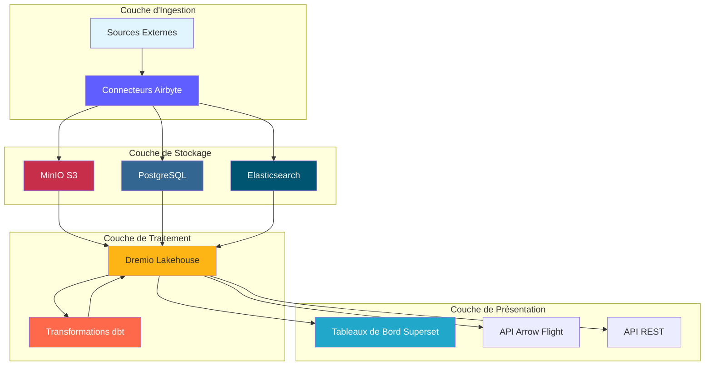

---

## 엔드투엔드 데이터 흐름

### 파이프라인 시퀀스 완료

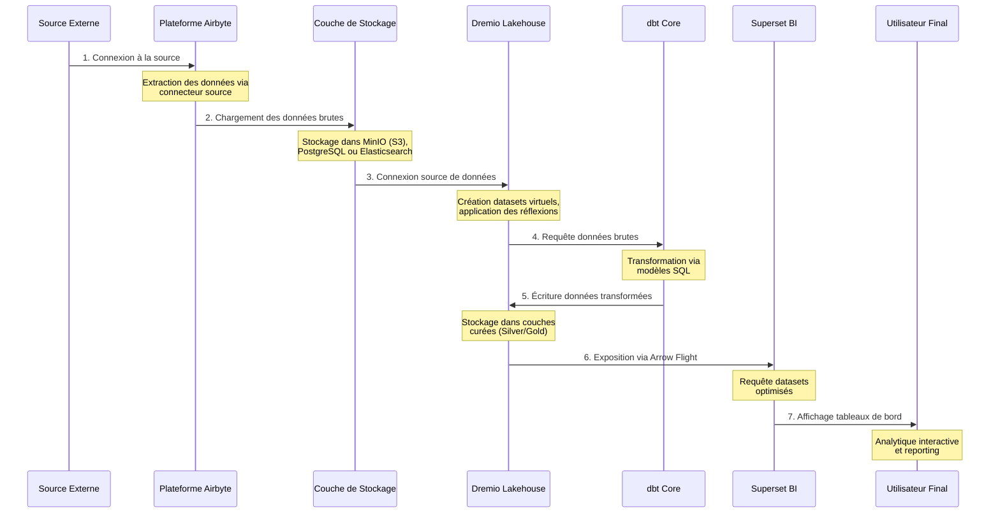

### 데이터 흐름 단계

| 단계 | 구성요소 | 입구 | 종료 | 대기 시간 |
|-------|----------|---------|---------|---------|
| **추출** | 에어바이트 | 외부 API/BD | 원시 JSON/CSV | 1~60분 |
| **로드 중** | 스토리지 계층 | 원시 파일 | 엄선된 버킷 | <1분 |
| **목록 작성** | 드레미오 | 저장 경로 | 가상 데이터 세트 | <1분 |
| **변환** | DBT | 브론즈 테이블 | 실버/골드 테이블 | 5~30분 |
| **최적화** | 드레미오 생각 | 원시 쿼리 | 숨겨진 결과 | 실시간 |
| **시각화** | 슈퍼세트 | SQL 쿼리 | 차트/대시보드 | <5초 |

---

## 수집 계층

### Airbyte 데이터 추출

Airbyte는 외부 소스로부터의 모든 데이터 수집을 관리합니다.

#### 소스 연결 흐름

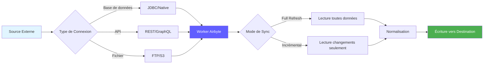

#### 데이터 추출 방법

**1. 전체 새로고침**
```yaml
# Full refresh extrait toutes les données à chaque sync
sync_mode: full_refresh
destination_sync_mode: overwrite

# Cas d'usage:
# - Petits datasets (<1M lignes)
# - Pas de suivi fiable des changements
# - Snapshots complets nécessaires
```

**2. 증분 동기화**
```yaml
# Sync incrémental extrait uniquement les données nouvelles/modifiées
sync_mode: incremental
destination_sync_mode: append_dedup
cursor_field: updated_at

# Cas d'usage:
# - Grands datasets (>1M lignes)
# - Possède champ timestamp ou curseur
# - Optimisation performance sync
```

**3. 변경 데이터 캡처(CDC)**
```yaml
# CDC utilise les logs de transaction de la base de données
method: CDC
replication_method: LOG_BASED

# Bases de données supportées:
# - PostgreSQL (WAL)
# - MySQL (binlog)
# - MongoDB (change streams)
# - SQL Server (change tracking)
```

### Airbyte API 통합

```bash
# Déclencher sync via API
curl -X POST http://localhost:8001/api/v1/connections/sync \
  -H "Content-Type: application/json" \
  -d '{
    "connectionId": "your-connection-id"
  }'

# Vérifier statut sync
curl -X POST http://localhost:8001/api/v1/jobs/get \
  -H "Content-Type: application/json" \
  -d '{
    "id": "job-id"
  }'
```

### 추출 성능

| 소스 유형 | 흐름 | 권장 주파수 |
|---|-------|---------|
| 포스트그레SQL | 50~100,000라인/초 | 15~60분마다 |
| REST API | 1~10,000 요청/초 | 5~30분마다 |
| CSV 파일 | 100-500MB/초 | 매일 |
| 몽고DB | 10~50,000개 문서/초 | 15~60분마다 |
| MySQL CDC | 실시간 | 연속 |

---

## 스토리지 레이어

### MinIO S3 스토리지

MinIO는 원시 데이터와 처리된 데이터를 계층 구조로 저장합니다.

#### 버킷 구성

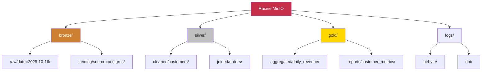

#### 데이터 경로 구조

```
s3://datalake/
├── bronze/                      # Données brutes d'Airbyte
│   ├── postgres/
│   │   ├── customers/
│   │   │   └── date=2025-10-16/
│   │   │       └── data.parquet
│   │   └── orders/
│   │       └── date=2025-10-16/
│   │           └── data.parquet
│   ├── api/
│   │   └── rest_endpoint/
│   │       └── timestamp=20251016_120000/
│   │           └── response.json
│   └── files/
│       └── csv_import/
│           └── batch_001.csv
│
├── silver/                      # Données nettoyées et validées
│   ├── customers/
│   │   └── version=v2/
│   │       └── customers_cleaned.parquet
│   └── orders/
│       └── version=v2/
│           └── orders_enriched.parquet
│
└── gold/                        # Agrégats prêts pour le métier
    ├── daily_revenue/
    │   └── year=2025/month=10/
    │       └── day=16/
    │           └── revenue.parquet
    └── customer_metrics/
        └── snapshot=2025-10-16/
            └── metrics.parquet
```

### 저장 형식 전략

| 레이어 | 형식 | 압축 | 파티셔닝 | 이유 |
|---------|---------|----------------|-------|
| **청동** | 마루 | 산뜻한 | 날짜별 | 빠른 쓰기, 우수한 압축 |
| **실버** | 마루 | 산뜻한 | 비즈니스 키별 | 효과적인 쿼리 |
| **골드** | 마루 | ZSTD | 기간별 | 최대 압축 |
| **로그** | JSON | Gzip | 서비스/날짜별 | 사람이 읽을 수 있음 |

### PostgreSQL 메타데이터 스토리지

PostgreSQL은 다음을 저장합니다.
- Airbyte 구성 및 상태
- 메타데이터 및 DBT 실행 내역
- 상위 집합 대시보드 및 사용자
- 애플리케이션 로그 및 지표

```sql
-- Structure table état Airbyte
CREATE TABLE airbyte_state (
    connection_id UUID PRIMARY KEY,
    state JSONB NOT NULL,
    updated_at TIMESTAMP DEFAULT NOW()
);

-- Historique exécution dbt
CREATE TABLE dbt_run_history (
    run_id UUID PRIMARY KEY,
    project_name VARCHAR(255),
    started_at TIMESTAMP,
    completed_at TIMESTAMP,
    status VARCHAR(50),
    models_run INTEGER,
    tests_run INTEGER,
    metadata JSONB
);
```

### Elasticsearch 문서 저장소

Elasticsearch는 로그를 색인화하고 전체 텍스트 검색을 허용합니다.

```json
{
  "index": "airbyte-logs-2025.10.16",
  "mappings": {
    "properties": {
      "timestamp": {"type": "date"},
      "level": {"type": "keyword"},
      "service": {"type": "keyword"},
      "message": {"type": "text"},
      "job_id": {"type": "keyword"},
      "connection_id": {"type": "keyword"},
      "records_synced": {"type": "integer"},
      "bytes_synced": {"type": "long"}
    }
  }
}
```

---

## 처리 레이어

### Dremio 데이터 가상화

Dremio는 모든 스토리지 소스에 대한 통합 보기를 생성합니다.

#### 가상 데이터세트 생성

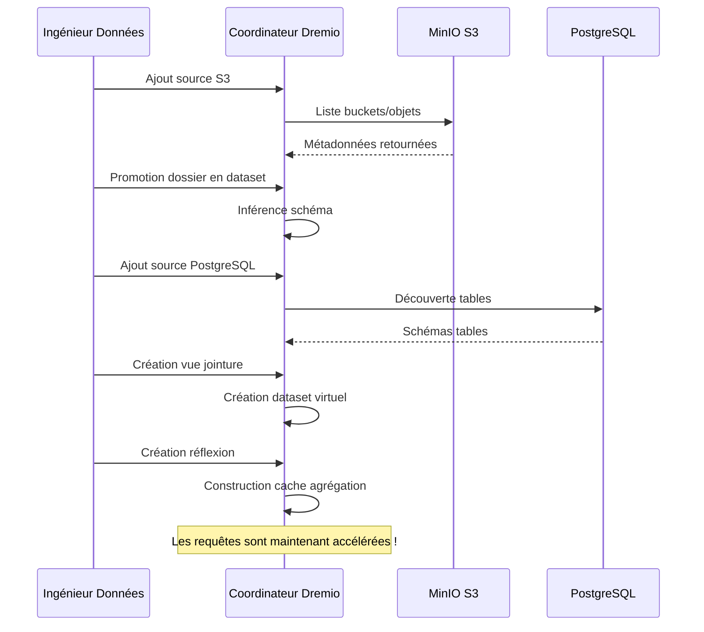

#### 반사에 의한 가속

Dremio 반사는 즉각적인 성능을 위해 쿼리 결과를 미리 계산합니다.

```sql
-- Créer réflexion brute (sous-ensemble colonnes)
CREATE REFLECTION raw_customers
ON bronze.customers
USING DISPLAY (customer_id, name, email, created_at);

-- Créer réflexion agrégation
CREATE REFLECTION agg_daily_revenue
ON gold.orders
USING DIMENSIONS (order_date)
MEASURES (SUM(amount), COUNT(*), AVG(amount));

-- Les réflexions se rafraîchissent automatiquement selon la politique
ALTER REFLECTION agg_daily_revenue
SET REFRESH EVERY 1 HOUR;
```

**반사가 성능에 미치는 영향:**

| 쿼리 유형 | 반사 없이 | 반사와 함께 | 가속 |
|-----------------|----------------|---|---------|
| 단순 선택 | 500ms | 50ms | 10배 |
| 집계 | 5초 | 100ms | 50배 |
| 복잡한 조인 | 30대 | 500ms | 60배 |
| 대형 스캔 | 120대 | 2초 | 60배 |

### DBT 변환

dbt는 원시 데이터를 비즈니스에 적합한 모델로 변환합니다.

#### 변환 흐름

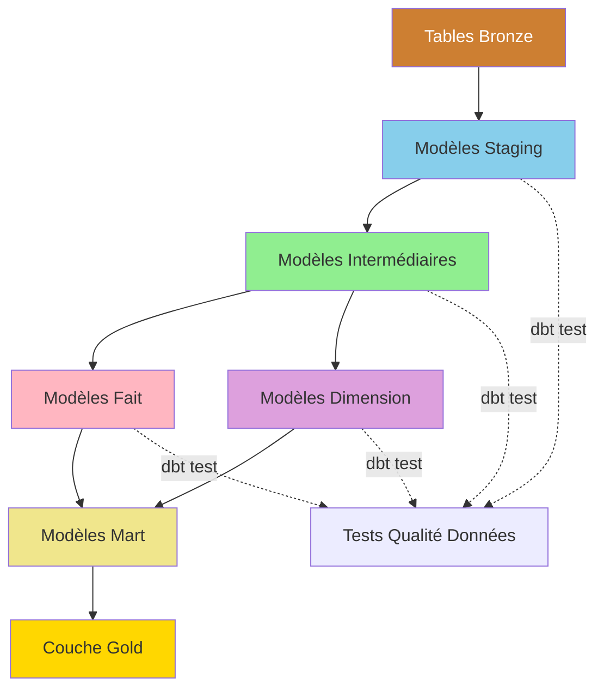

#### 변환 파이프라인 예

```sql
-- models/staging/stg_customers.sql
-- Étape 1: Nettoyage et standardisation
WITH source AS (
    SELECT * FROM bronze.raw_customers
),

cleaned AS (
    SELECT
        customer_id,
        TRIM(UPPER(name)) AS customer_name,
        LOWER(email) AS email,
        phone,
        address,
        city,
        state,
        zip_code,
        created_at,
        updated_at
    FROM source
    WHERE customer_id IS NOT NULL
)

SELECT * FROM cleaned;
```

```sql
-- models/intermediate/int_customer_orders.sql
-- Étape 2: Jointure et enrichissement
WITH customers AS (
    SELECT * FROM {{ ref('stg_customers') }}
),

orders AS (
    SELECT * FROM {{ ref('stg_orders') }}
),

joined AS (
    SELECT
        c.customer_id,
        c.customer_name,
        c.email,
        o.order_id,
        o.order_date,
        o.amount,
        o.status
    FROM customers c
    INNER JOIN orders o
        ON c.customer_id = o.customer_id
)

SELECT * FROM joined;
```

```sql
-- models/marts/fct_customer_lifetime_value.sql
-- Étape 3: Agrégation pour métriques métier
WITH customer_orders AS (
    SELECT * FROM {{ ref('int_customer_orders') }}
),

metrics AS (
    SELECT
        customer_id,
        customer_name,
        email,
        COUNT(DISTINCT order_id) AS total_orders,
        SUM(amount) AS lifetime_value,
        AVG(amount) AS average_order_value,
        MIN(order_date) AS first_order_date,
        MAX(order_date) AS last_order_date,
        DATEDIFF('day', MIN(order_date), MAX(order_date)) AS customer_lifespan_days
    FROM customer_orders
    WHERE status = 'completed'
    GROUP BY customer_id, customer_name, email
)

SELECT * FROM metrics;
```

#### dbt 실행 흐름

```bash
# Exécution pipeline complète
dbt run --select staging        # Exécuter modèles staging
dbt test --select staging       # Tester modèles staging
dbt run --select intermediate   # Exécuter modèles intermédiaires
dbt test --select intermediate  # Tester modèles intermédiaires
dbt run --select marts          # Exécuter modèles mart
dbt test --select marts         # Tester modèles mart

# Générer documentation
dbt docs generate
dbt docs serve
```

### 데이터 계보 추적성

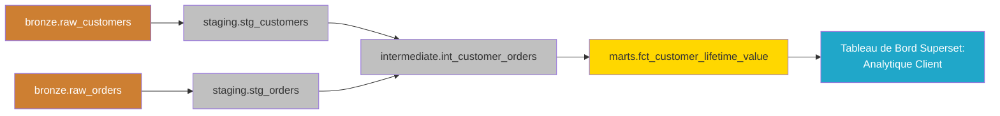

---

## 프리젠테이션 레이어

### 쿼리 실행 흐름

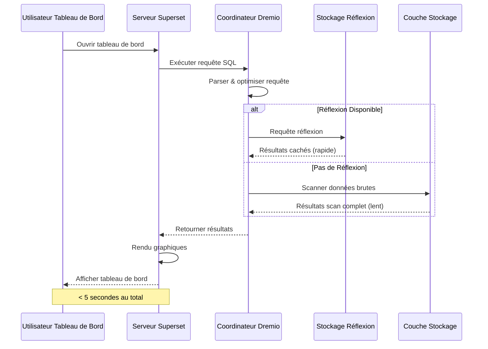

### API 액세스 모델

#### 1. 상위 대시보드(BI Interactive)

```python
# Superset exécute SQL via SQLAlchemy
from superset import db

query = """
SELECT 
    order_date,
    SUM(amount) as daily_revenue
FROM gold.fct_daily_revenue
WHERE order_date >= CURRENT_DATE - INTERVAL '30 days'
GROUP BY order_date
ORDER BY order_date
"""

results = db.session.execute(query)
```

#### 2. Arrow Flight API(고성능)

```python
# Connexion Arrow Flight directe pour outils analytiques
from pyarrow import flight

client = flight.FlightClient("grpc://localhost:32010")

# Authentification
token = client.authenticate_basic_token("admin", "password123")

# Exécuter requête
descriptor = flight.FlightDescriptor.for_command(
    b"SELECT * FROM gold.customer_metrics LIMIT 1000"
)

flight_info = client.get_flight_info(descriptor)
reader = client.do_get(flight_info.endpoints[0].ticket)

# Lire comme Table Arrow (zero-copy)
table = reader.read_all()
df = table.to_pandas()
```

#### 3. REST API(외부 통합)

```bash
# API REST Dremio pour automatisation
curl -X POST http://localhost:9047/api/v3/sql \
  -H "Authorization: Bearer $TOKEN" \
  -H "Content-Type: application/json" \
  -d '{
    "sql": "SELECT COUNT(*) FROM gold.customers"
  }'
```

---

## 데이터 흐름 모델

### 모델 1: ETL 배치 파이프라인

```mermaid
gantt
    title Planification ETL Batch Quotidien
    dateFormat HH:mm
    axisFormat %H:%M
    
    section Ingestion
    Extraction Airbyte (PostgreSQL)     :01:00, 30m
    Extraction Airbyte (APIs)           :01:30, 45m
    
    section Chargement
    Chargement vers Bronze MinIO        :02:15, 15m
    
    section Transformation
    Modèles Staging dbt                 :02:30, 20m
    Modèles Intermédiaires dbt          :02:50, 30m
    Modèles Mart dbt                    :03:20, 40m
    
    section Tests
    Tests Qualité Données dbt           :04:00, 15m
    
    section Optimisation
    Rafraîchissement Réflexions Dremio  :04:15, 20m
    
    section Présentation
    Préchauffage Cache Tableau de Bord  :04:35, 10m
```

### 모델 2: 실시간 스트리밍


### 패턴 3: 증분 업데이트

```sql
-- Modèle incrémental dbt
{{ config(
    materialized='incremental',
    unique_key='order_id',
    on_schema_change='sync_all_columns'
) }}

SELECT
    order_id,
    customer_id,
    order_date,
    amount,
    status,
    updated_at
FROM {{ source('bronze', 'orders') }}


    -- Traiter uniquement les enregistrements nouveaux ou mis à jour
    WHERE updated_at > (SELECT MAX(updated_at) FROM {{ this }})

```

### 모델 4: Lambda 아키텍처(배치 + 스트림)

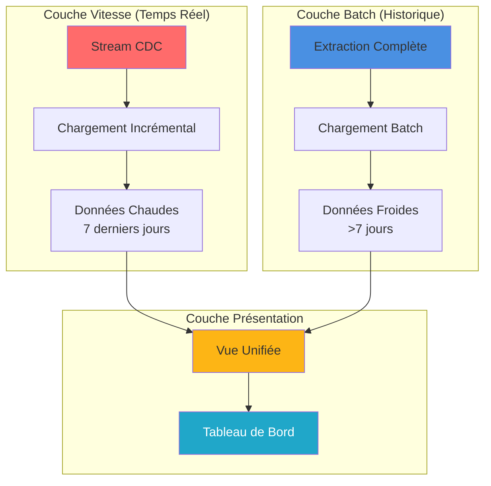

---

## 성능 고려 사항

### 수집 최적화

```yaml
# Configuration connexion Airbyte
sync_mode: incremental
destination_sync_mode: append_dedup
cursor_field: updated_at

# Ajustement performance
batch_size: 10000              # Enregistrements par batch
threads: 4                     # Workers parallèles
timeout_minutes: 60           # Timeout sync
retry_on_failure: true
max_retries: 3

# Optimisation réseau
compression: gzip
buffer_size_mb: 256
```

### 스토리지 최적화

```python
# Options écriture Parquet pour compression optimale
import pyarrow.parquet as pq

pq.write_table(
    table,
    'output.parquet',
    compression='snappy',      # Compression rapide
    use_dictionary=True,       # Activer encodage dictionnaire
    row_group_size=1000000,    # 1M lignes par row group
    data_page_size=1048576,    # 1MB taille page
    write_statistics=True      # Activer statistiques pour pruning
)
```

### 쿼리 최적화

```sql
-- Bonnes pratiques requêtes Dremio

-- 1. Utiliser partition pruning
SELECT * FROM gold.orders
WHERE order_date >= '2025-10-01'  -- Élague partitions
  AND order_date < '2025-11-01';

-- 2. Exploiter les réflexions
-- Créer réflexion une fois, requêtes auto-accélérées
ALTER REFLECTION agg_orders SET ENABLED = TRUE;

-- 3. Utiliser column pruning
SELECT order_id, amount       -- Seulement colonnes nécessaires
FROM gold.orders
LIMIT 1000;

-- 4. Pousser les filtres
SELECT *
FROM gold.customers
WHERE state = 'CA'            -- Filtre poussé vers stockage
  AND lifetime_value > 1000;
```

### 변환 최적화

```sql
-- Techniques optimisation dbt

-- 1. Modèles incrémentaux pour grandes tables
{{ config(materialized='incremental') }}

-- 2. Tables partitionnées
{{ config(
    materialized='table',
    partition_by={
        'field': 'order_date',
        'data_type': 'date',
        'granularity': 'day'
    }
) }}

-- 3. Tables clusterisées pour meilleures jointures
{{ config(
    materialized='table',
    cluster_by=['customer_id']
) }}
```

### 성능 벤치마크

| 운영 | 소규모 데이터 세트<br/>(100만 라인) | 중간 규모 데이터 세트<br/>(1억 행) | 대용량 데이터세트<br/>(10억 라인) |
|---------------|---------------|------------------|---------------|
| **에어바이트 동기화** | 2분 | 30분 | 5시간 |
| **dbt 실행** | 30초 | 10분 | 2시간 |
| **건축반영** | 10초 | 5분 | 30분 |
| **대시보드 쿼리** | <100ms | <500ms | 2초 미만 |

---

## 데이터 흐름 모니터링

### 추적할 주요 지표

```yaml
# Configuration métriques Prometheus
metrics:
  ingestion:
    - airbyte_records_synced_total
    - airbyte_sync_duration_seconds
    - airbyte_sync_failures_total
    
  storage:
    - minio_disk_usage_bytes
    - minio_objects_total
    - postgres_connections_active
    
  processing:
    - dremio_query_duration_seconds
    - dremio_reflection_refresh_seconds
    - dbt_model_execution_time
    
  serving:
    - superset_dashboard_load_time
    - superset_query_cache_hit_rate
    - api_requests_per_second
```

### 모니터링 대시보드

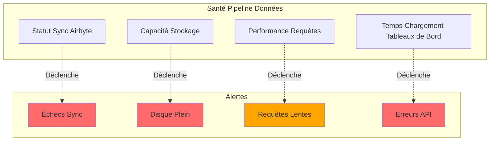

### 로그 집계

```bash
# Requête Elasticsearch pour surveillance pipeline
curl -X GET "localhost:9200/airbyte-logs-*/_search" \
  -H 'Content-Type: application/json' \
  -d '{
    "query": {
      "bool": {
        "filter": [
          {"range": {"timestamp": {"gte": "now-1h"}}},
          {"term": {"level": "ERROR"}}
        ]
      }
    },
    "aggs": {
      "by_service": {
        "terms": {"field": "service"}
      }
    }
  }'
```

---

## 모범 사례

### 데이터 흐름 설계

1. **멱등성을 위한 설계**
   - 작업을 안전하게 반복할 수 있음을 보장합니다.
   - 중복 제거를 위해 고유 키 사용
   - 적절한 오류 처리 구현

2. **데이터 품질 관리 구현**
   ```sql
   -- Exemple test dbt
   -- tests/assert_positive_amounts.sql
   SELECT *
   FROM {{ ref('fct_orders') }}
   WHERE amount <= 0
   ```

3. **대형 데이터 세트 파티션**
   ```python
   # Partitionner par date pour requêtes efficaces
   df.write.partitionBy('order_date').parquet('s3://bucket/orders/')
   ```

4. **적절한 동기화 모드 사용**
   - 전체 새로 고침: 작은 차원 테이블
   - 증분형: 대형 팩트 테이블
   - CDC: 실시간 요구사항

### 성능 조정

1. **Airbyte 동기화 일정 최적화**
   ```yaml
   # Équilibrer fraîcheur vs utilisation ressources
   small_tables:
     frequency: every_15_minutes
   
   large_tables:
     frequency: every_6_hours
   
   dimension_tables:
     frequency: daily
   ```

2. **전략적 사고 창출**
   ```sql
   -- Focus sur agrégations fréquemment requêtées
   CREATE REFLECTION common_metrics
   ON gold.orders
   USING DIMENSIONS (product_id, date_trunc('day', order_date))
   MEASURES (SUM(amount), COUNT(*));
   ```

3. **dbt 모델 최적화**
   ```yaml
   # models/schema.yml
   models:
     - name: fct_large_table
       config:
         materialized: incremental
         incremental_strategy: merge
         unique_key: id
         partition_by: {field: date, data_type: date}
   ```

### 일반적인 문제 해결

| 문제 | 증상 | 솔루션 |
|---------|---------|----------|
| **Airbyte 동기화 속도가 느림** | 동기화 시간 | 배치 크기 늘리기, 증분 모드 사용 |
| **메모리 부족** | 실패한 DBT 모델 | 점진적으로 구체화, 파티셔닝 추가 |
| **느린 쿼리** | 시간 초과 대시보드 | 반사 생성, 인덱스 추가 |
| **저장용량이 가득 참** | 쓰기 실패 | 데이터 보존 구현, 오래된 데이터 압축 |
| **사용되지 않는 데이터** | 이전 측정항목 | 동기화 빈도 늘리기, 일정 확인 |

### 올바른 보안 관행

1. **전송 중인 데이터 암호화**
   ```yaml
   # docker-compose.yml
   minio:
     environment:
       MINIO_SERVER_URL: https://minio:9000
       MINIO_BROWSER_REDIRECT_URL: https://console.minio.local
   ```

2. **액세스 제어 구현**
   ```sql
   -- ACLs Dremio
   GRANT SELECT ON gold.customer_metrics TO ROLE analyst;
   GRANT ALL ON bronze.* TO ROLE data_engineer;
   ```

3. **데이터 액세스 감사**
   ```json
   {
     "audit_log": {
       "enabled": true,
       "log_queries": true,
       "log_user_actions": true,
       "retention_days": 90
     }
   }
   ```

---

## 요약

이 문서에서는 전체 데이터 흐름 아키텍처를 자세히 설명합니다.

- **수집 계층**: Airbyte는 전체 새로 고침, 증분 또는 CDC를 통해 다양한 소스에서 데이터를 추출합니다.
- **스토리지 레이어**: MinIO, PostgreSQL 및 Elasticsearch는 원시 데이터와 처리된 데이터를 조직화된 레이어에 저장합니다.
- **처리 레이어**: Dremio는 데이터를 가상화하고 dbt는 스테이징, 중간 및 마트 모델을 통해 이를 변환합니다.
- **프레젠테이션 레이어**: 상위 대시보드 및 API를 통해 비즈니스에 즉시 사용 가능한 데이터에 대한 액세스 제공

기억해야 할 핵심 사항:
- 데이터는 명확하게 정의된 레이어를 통해 단방향으로 흐릅니다.
- 각 구성 요소에는 특정 책임과 인터페이스가 있습니다.
- 반사, 파티셔닝, 캐싱을 통해 성능이 최적화됩니다.
- 모니터링 및 관찰 가능성은 각 계층에 통합됩니다.
- 모범 사례는 신뢰성, 성능 및 보안을 보장합니다.

**관련 문서:**
- [아키텍처 개요](./overview.md)
- [컴포넌트](./comComponents.md)
- [배포](./deployment.md)
- [에어바이트 통합 가이드](../guides/airbyte-integration.md)
- [dbt 개발 가이드](../guides/dbt-development.md)

---

**버전**: 3.2.0  
**최종 업데이트**: 2025년 10월 16일