# 배포 아키텍처

**버전**: 3.2.0  
**최종 업데이트**: 2025년 10월 16일  
**언어**: 프랑스어

## 목차

1. [개요](#overview)
2. [배포 토폴로지](#deployment-topologies)
3. [Docker Compose 배포](#docker-compose 배포)
4. [Kubernetes 배포](#kubernetes-deployment)
5. [클라우드 배포](#cloud-deployments)
6. [고가용성 구성](#high-availability-configuration)
7. [확장 전략](#scaling-strategies)
8. [보안설정](#security-configuration)
9. [모니터링 및 로깅](#monitoring-and-logging)
10. [재해 복구](#disaster-recovery)
11. [모범 사례](#good-practices)

---

## 개요

이 문서는 개발부터 프로덕션까지 다양한 환경에 걸쳐 데이터 플랫폼을 배포하는 데 대한 포괄적인 지침을 제공합니다. 다양한 배포 토폴로지, 조정 전략, 운영 모범 사례를 다룹니다.

### 배포 목표

- **신뢰성**: 프로덕션 워크로드에 대한 가동 시간 99.9%
- **확장성**: 아키텍처 변경 없이 10배 성장 관리
- **보안**: 여러 계층의 보안을 통한 심층적인 방어
- **유지관리성**: 간편한 업데이트 및 구성 관리
- **수익성**: 자원 사용 최적화

### 환경 유형

| 환경 | 목표 | 규모 | 가용성 |
|---------------|---------|---------|---------------|
| **개발** | 기능 개발, 테스트 | 단일 노드 | <95% |
| **스테이징** | 사전 제작 검증 | 다중 노드 | 95-99% |
| **제작** | 실시간 데이터 워크로드 | 클러스터됨 | >99.9% |
| **DR** | 재해 복구 사이트 | 생산 거울 | 대기 |

---

## 배포 토폴로지

### 토폴로지 1: 단일 호스트 개발


**사용 사례**: 로컬 개발, 테스트, 데모

**명세서**:
- CPU: 4-8 코어
- RAM: 16~32GB
- 디스크: 100-500GB SSD
- 네트워크: 로컬호스트만 해당

**이익**:
- 간단한 구성(docker-compose up)
- 저렴한 비용
- 신속한 반복

**단점**:
- 중복 없음
- 제한된 성능
- 생산에 적합하지 않음

### 토폴로지 2: Docker Swarm 다중 호스트


**사용 사례**: 스테이징 및 소규모 프로덕션 배포

**명세서**:
- 관리자 노드: 3x(2 CPU, 4GB RAM)
- 작업자 노드: 3개 이상(8-16 CPU, 32-64GB RAM)
- 데이터베이스 노드: 1-2(4 CPU, 16GB RAM, SSD)
- 스토리지 노드: 4개 이상(CPU 2개, RAM 8GB, HDD/SSD)

**이익**:
- 고가용성
- 손쉬운 스케일링
- 통합 로드 밸런싱
- 건강 모니터링

**단점**:
- 단일 호스트보다 복잡함
- 공유 스토리지 또는 볼륨이 필요합니다.
- 네트워크 구성의 복잡성

### 토폴로지 3: Kubernetes 클러스터


**사용 사례**: 대규모 프로덕션 배포

**명세서**:
- 제어 플레인: 노드 3개 이상(관리형 또는 자체 호스팅)
- 작업자 노드: 노드 10개 이상(CPU 16~32개, RAM 64~128GB)
- 스토리지: CSI 드라이버(EBS, GCP PD, Azure Disk)
- 네트워크: CNI 플러그인(Calico, Cilium)

**이익**:
- 엔터프라이즈 수준의 오케스트레이션
- 자동화된 확장 및 복구
- 고급 네트워크(서비스 메시)
- GitOps 호환
- 다중 테넌트 지원

**단점**:
- 복잡한 구성 및 관리
- 가파른 학습 곡선
- 더 높은 운영 오버헤드

---

## Docker Compose 배포

### 개발 환경

지역 개발을 위한 `docker-compose.yml` 표준:

```yaml
version: '3.8'

services:
  # Airbyte Platform
  airbyte-server:
    image: airbyte/server:0.50.33
    container_name: airbyte-server
    ports:
      - "8001:8001"
    environment:
      - DATABASE_USER=airbyte
      - DATABASE_PASSWORD=airbyte
      - DATABASE_DB=airbyte
      - DATABASE_HOST=postgres
      - DATABASE_PORT=5432
      - WORKSPACE_ROOT=/tmp/workspace
      - CONFIG_ROOT=/data
      - TRACKING_STRATEGY=logging
    volumes:
      - airbyte-data:/data
      - airbyte-workspace:/tmp/workspace
    depends_on:
      - postgres
    networks:
      - data-platform

  airbyte-webapp:
    image: airbyte/webapp:0.50.33
    container_name: airbyte-webapp
    ports:
      - "8000:80"
    environment:
      - AIRBYTE_SERVER_HOST=airbyte-server
      - AIRBYTE_SERVER_PORT=8001
    depends_on:
      - airbyte-server
    networks:
      - data-platform

  airbyte-worker:
    image: airbyte/worker:0.50.33
    container_name: airbyte-worker
    environment:
      - DATABASE_USER=airbyte
      - DATABASE_PASSWORD=airbyte
      - DATABASE_DB=airbyte
      - DATABASE_HOST=postgres
      - DATABASE_PORT=5432
      - WORKSPACE_ROOT=/tmp/workspace
      - LOCAL_ROOT=/tmp/airbyte_local
    volumes:
      - airbyte-workspace:/tmp/workspace
      - /var/run/docker.sock:/var/run/docker.sock
    depends_on:
      - postgres
      - airbyte-server
    networks:
      - data-platform

  # Dremio Lakehouse
  dremio:
    image: dremio/dremio-oss:26.0
    container_name: dremio
    ports:
      - "9047:9047"   # Web UI
      - "31010:31010" # ODBC/JDBC
      - "32010:32010" # Arrow Flight
    environment:
      - DREMIO_JAVA_SERVER_EXTRA_OPTS=-Xms2g -Xmx4g
    volumes:
      - dremio-data:/opt/dremio/data
      - ./config/dremio.conf:/opt/dremio/conf/dremio.conf
    networks:
      - data-platform

  # Apache Superset
  superset:
    image: apache/superset:3.0.0
    container_name: superset
    ports:
      - "8088:8088"
    environment:
      - SUPERSET_SECRET_KEY=your-secret-key-here
      - SUPERSET_LOAD_EXAMPLES=yes
    volumes:
      - superset-data:/app/superset_home
    command: >
      sh -c "superset db upgrade &&
             superset fab create-admin 
               --username admin 
               --firstname Admin 
               --lastname User 
               --email admin@example.com 
               --password admin &&
             superset init &&
             superset run -h 0.0.0.0 -p 8088"
    depends_on:
      - postgres
    networks:
      - data-platform

  # PostgreSQL Database
  postgres:
    image: postgres:16
    container_name: postgres
    ports:
      - "5432:5432"
    environment:
      - POSTGRES_USER=postgres
      - POSTGRES_PASSWORD=postgres
      - POSTGRES_DB=postgres
      - PGDATA=/var/lib/postgresql/data/pgdata
    volumes:
      - postgres-data:/var/lib/postgresql/data
      - ./scripts/init-databases.sql:/docker-entrypoint-initdb.d/init.sql
    networks:
      - data-platform
    healthcheck:
      test: ["CMD-SHELL", "pg_isready -U postgres"]
      interval: 10s
      timeout: 5s
      retries: 5

  # MinIO Object Storage
  minio:
    image: minio/minio:latest
    container_name: minio
    ports:
      - "9000:9000"  # API
      - "9001:9001"  # Console
    environment:
      - MINIO_ROOT_USER=minioadmin
      - MINIO_ROOT_PASSWORD=minioadmin
    volumes:
      - minio-data:/data
    command: server /data --console-address ":9001"
    networks:
      - data-platform
    healthcheck:
      test: ["CMD", "curl", "-f", "http://localhost:9000/minio/health/live"]
      interval: 30s
      timeout: 20s
      retries: 3

  # Elasticsearch
  elasticsearch:
    image: docker.elastic.co/elasticsearch/elasticsearch:8.15.0
    container_name: elasticsearch
    ports:
      - "9200:9200"
      - "9300:9300"
    environment:
      - discovery.type=single-node
      - xpack.security.enabled=false
      - "ES_JAVA_OPTS=-Xms1g -Xmx1g"
    volumes:
      - es-data:/usr/share/elasticsearch/data
    networks:
      - data-platform
    healthcheck:
      test: ["CMD-SHELL", "curl -f http://localhost:9200/_cluster/health || exit 1"]
      interval: 30s
      timeout: 10s
      retries: 5

volumes:
  airbyte-data:
  airbyte-workspace:
  dremio-data:
  superset-data:
  postgres-data:
  minio-data:
  es-data:

networks:
  data-platform:
    driver: bridge
```

### Docker Compose Production 오버헤드

```yaml
# docker-compose.prod.yml
version: '3.8'

services:
  # Surcharge avec paramètres production
  dremio:
    environment:
      - DREMIO_JAVA_SERVER_EXTRA_OPTS=-Xms8g -Xmx16g
    deploy:
      resources:
        limits:
          cpus: '8'
          memory: 16G
        reservations:
          cpus: '4'
          memory: 8G

  postgres:
    environment:
      - POSTGRES_PASSWORD=${POSTGRES_PASSWORD}  # Depuis .env
    volumes:
      - /mnt/data/postgres:/var/lib/postgresql/data
    deploy:
      resources:
        limits:
          cpus: '4'
          memory: 8G

  minio:
    environment:
      - MINIO_ROOT_USER=${MINIO_ROOT_USER}
      - MINIO_ROOT_PASSWORD=${MINIO_ROOT_PASSWORD}
    volumes:
      - /mnt/data/minio:/data
    deploy:
      replicas: 4  # MinIO distribué
      resources:
        limits:
          cpus: '2'
          memory: 4G
```

**프로덕션에 배포**:
```bash
docker-compose -f docker-compose.yml -f docker-compose.prod.yml up -d
```

---

## 쿠버네티스 배포

### 네임스페이스 구성

```yaml
# namespaces.yaml
apiVersion: v1
kind: Namespace
metadata:
  name: data-platform
  labels:
    name: data-platform
    environment: production
---
apiVersion: v1
kind: Namespace
metadata:
  name: data-storage
  labels:
    name: data-storage
    environment: production
```

### 에어바이트 배포

```yaml
# airbyte-deployment.yaml
apiVersion: apps/v1
kind: Deployment
metadata:
  name: airbyte-server
  namespace: data-platform
spec:
  replicas: 2
  selector:
    matchLabels:
      app: airbyte-server
  template:
    metadata:
      labels:
        app: airbyte-server
    spec:
      containers:
      - name: server
        image: airbyte/server:0.50.33
        ports:
        - containerPort: 8001
        env:
        - name: DATABASE_USER
          valueFrom:
            secretKeyRef:
              name: airbyte-secrets
              key: db-user
        - name: DATABASE_PASSWORD
          valueFrom:
            secretKeyRef:
              name: airbyte-secrets
              key: db-password
        - name: DATABASE_HOST
          value: postgres-service.data-storage.svc.cluster.local
        resources:
          requests:
            memory: "1Gi"
            cpu: "500m"
          limits:
            memory: "2Gi"
            cpu: "1000m"
        livenessProbe:
          httpGet:
            path: /health
            port: 8001
          initialDelaySeconds: 60
          periodSeconds: 30
        readinessProbe:
          httpGet:
            path: /health
            port: 8001
          initialDelaySeconds: 30
          periodSeconds: 10
---
apiVersion: v1
kind: Service
metadata:
  name: airbyte-server
  namespace: data-platform
spec:
  selector:
    app: airbyte-server
  ports:
  - protocol: TCP
    port: 8001
    targetPort: 8001
  type: ClusterIP
```

### StatefulSet Dremio

```yaml
# dremio-statefulset.yaml
apiVersion: apps/v1
kind: StatefulSet
metadata:
  name: dremio-executor
  namespace: data-platform
spec:
  serviceName: dremio-executor
  replicas: 3
  selector:
    matchLabels:
      app: dremio
      role: executor
  template:
    metadata:
      labels:
        app: dremio
        role: executor
    spec:
      containers:
      - name: dremio
        image: dremio/dremio-oss:26.0
        ports:
        - containerPort: 9047
        - containerPort: 31010
        - containerPort: 32010
        env:
        - name: DREMIO_JAVA_SERVER_EXTRA_OPTS
          value: "-Xms8g -Xmx16g"
        - name: DREMIO_COORDINATOR
          value: "false"
        - name: DREMIO_MASTER_HOST
          value: dremio-coordinator.data-platform.svc.cluster.local
        resources:
          requests:
            memory: "16Gi"
            cpu: "4000m"
          limits:
            memory: "32Gi"
            cpu: "8000m"
        volumeMounts:
        - name: dremio-data
          mountPath: /opt/dremio/data
  volumeClaimTemplates:
  - metadata:
      name: dremio-data
    spec:
      accessModes: ["ReadWriteOnce"]
      storageClassName: fast-ssd
      resources:
        requests:
          storage: 100Gi
```

### 수평형 포드 자동 확장 처리

```yaml
# hpa.yaml
apiVersion: autoscaling/v2
kind: HorizontalPodAutoscaler
metadata:
  name: airbyte-worker-hpa
  namespace: data-platform
spec:
  scaleTargetRef:
    apiVersion: apps/v1
    kind: Deployment
    name: airbyte-worker
  minReplicas: 2
  maxReplicas: 10
  metrics:
  - type: Resource
    resource:
      name: cpu
      target:
        type: Utilization
        averageUtilization: 70
  - type: Resource
    resource:
      name: memory
      target:
        type: Utilization
        averageUtilization: 80
  behavior:
    scaleUp:
      stabilizationWindowSeconds: 60
      policies:
      - type: Percent
        value: 100
        periodSeconds: 60
    scaleDown:
      stabilizationWindowSeconds: 300
      policies:
      - type: Pods
        value: 1
        periodSeconds: 60
```

### 인그레스 설정

```yaml
# ingress.yaml
apiVersion: networking.k8s.io/v1
kind: Ingress
metadata:
  name: data-platform-ingress
  namespace: data-platform
  annotations:
    kubernetes.io/ingress.class: nginx
    cert-manager.io/cluster-issuer: letsencrypt-prod
    nginx.ingress.kubernetes.io/ssl-redirect: "true"
    nginx.ingress.kubernetes.io/proxy-body-size: "500m"
spec:
  tls:
  - hosts:
    - airbyte.example.com
    - dremio.example.com
    - superset.example.com
    secretName: data-platform-tls
  rules:
  - host: airbyte.example.com
    http:
      paths:
      - path: /
        pathType: Prefix
        backend:
          service:
            name: airbyte-webapp
            port:
              number: 80
  - host: dremio.example.com
    http:
      paths:
      - path: /
        pathType: Prefix
        backend:
          service:
            name: dremio-coordinator
            port:
              number: 9047
  - host: superset.example.com
    http:
      paths:
      - path: /
        pathType: Prefix
        backend:
          service:
            name: superset-web
            port:
              number: 8088
```

### 영구 저장소

```yaml
# storage-class.yaml
apiVersion: storage.k8s.io/v1
kind: StorageClass
metadata:
  name: fast-ssd
provisioner: kubernetes.io/aws-ebs
parameters:
  type: gp3
  iops: "3000"
  throughput: "125"
  fsType: ext4
allowVolumeExpansion: true
volumeBindingMode: WaitForFirstConsumer
---
apiVersion: storage.k8s.io/v1
kind: StorageClass
metadata:
  name: standard
provisioner: kubernetes.io/aws-ebs
parameters:
  type: gp2
  fsType: ext4
allowVolumeExpansion: true
volumeBindingMode: WaitForFirstConsumer
```

---

## 클라우드 배포

### AWS 아키텍처


**사용된 AWS 서비스**:
- **EKS**: 관리형 Kubernetes 클러스터
- **RDS**: 메타데이터용 PostgreSQL 다중 AZ
- **S3**: 데이터 레이크용 개체 스토리지
- **ALB**: 로드밸런서 애플리케이션
- **CloudWatch**: 모니터링 및 로깅
- **Secrets Manager**: 식별자 관리
- **ECR**: 컨테이너 등록부
- **VPC**: 네트워크 격리

**테라폼 예시**:
```hcl
# main.tf
module "eks" {
  source  = "terraform-aws-modules/eks/aws"
  version = "~> 19.0"

  cluster_name    = "data-platform-prod"
  cluster_version = "1.27"

  vpc_id     = module.vpc.vpc_id
  subnet_ids = module.vpc.private_subnets

  eks_managed_node_groups = {
    general = {
      min_size     = 3
      max_size     = 10
      desired_size = 5

      instance_types = ["m5.2xlarge"]
      capacity_type  = "ON_DEMAND"
    }
  }
}

module "rds" {
  source = "terraform-aws-modules/rds/aws"

  identifier = "data-platform-db"

  engine               = "postgres"
  engine_version       = "16.1"
  family               = "postgres16"
  major_engine_version = "16"
  instance_class       = "db.r6g.xlarge"

  allocated_storage     = 100
  max_allocated_storage = 1000

  multi_az               = true
  db_subnet_group_name   = module.vpc.database_subnet_group
  vpc_security_group_ids = [module.security_group.security_group_id]

  backup_retention_period = 30
  backup_window          = "03:00-04:00"
  maintenance_window     = "sun:04:00-sun:05:00"
}

module "s3_bucket" {
  source = "terraform-aws-modules/s3-bucket/aws"

  bucket = "data-platform-datalake-prod"

  versioning = {
    enabled = true
  }

  lifecycle_rule = [
    {
      id      = "bronze-to-glacier"
      enabled = true

      transition = [
        {
          days          = 90
          storage_class = "GLACIER"
        }
      ]
    }
  ]
}
```

### Azure 아키텍처

**Azure 서비스**:
- **AKS**: Azure Kubernetes 서비스
- **PostgreSQL용 Azure 데이터베이스**: 유연한 서버
- **Azure Blob Storage**: 데이터 레이크 Gen2
- **애플리케이션 게이트웨이**: 로드 밸런서
- **Azure Monitor**: 모니터링 및 로깅
- **Key Vault**: 비밀 관리
- **ACR**: Azure 컨테이너 레지스트리

### GCP 아키텍처

**GCP 서비스**:
- **GKE**: Google Kubernetes Engine
- **클라우드 SQL**: HA가 포함된 PostgreSQL
- **클라우드 스토리지**: 객체 스토리지
- **Cloud Load Balancing**: 글로벌 로드 밸런서
- **클라우드 로깅**: 중앙 집중식 로깅
- **Secret Manager**: 식별자 관리
- **Artifact Registry**: 컨테이너 레지스트리

---

## 고가용성 구성

### 고가용성 데이터베이스


**PostgreSQL HA 구성**:
```yaml
# postgresql.conf pour primaire
wal_level = replica
max_wal_senders = 10
wal_keep_size = 1GB
synchronous_commit = on
synchronous_standby_names = 'standby1'

# pg_hba.conf
host replication replicator standby1-ip/32 md5
host replication replicator standby2-ip/32 md5
```

### 분산 MinIO 구성

```bash
# MinIO distribué 4 nœuds
docker run -d \
  -p 9000:9000 -p 9001:9001 \
  -e "MINIO_ROOT_USER=admin" \
  -e "MINIO_ROOT_PASSWORD=password" \
  minio/minio server \
  http://minio-{1...4}.example.com/data{1...4} \
  --console-address ":9001"
```

**삭제 코딩**: MinIO는 삭제 코딩(4개 이상의 노드의 경우 EC:4)을 통해 데이터를 자동으로 보호합니다.

### Dremio 클러스터 구성

```conf
# dremio.conf pour coordinateur
coordinator.enabled: true
coordinator.master.enabled: true

# dremio.conf pour exécuteur
coordinator.enabled: false
executor.enabled: true

# Connexion au coordinateur
zookeeper: "coordinator1:2181,coordinator2:2181,coordinator3:2181"
```

---

## 확장 전략

### 수직 확장

**사용 시기**: 리소스 제한에 도달한 고유 구성요소

| 구성요소 | 이니셜 | 확장 | 개선 |
|----------|---------|---|---------|
| 드레미오 집행자 | 8개 CPU, 16GB | 16개 CPU, 32GB | 쿼리 성능 2배 |
| 포스트그레SQL | CPU 4개, 8GB | 8개 CPU, 16GB | 2배 거래 직불 |
| 작업자 에어바이트 | CPU 2개, 4GB | CPU 4개, 8GB | 2x 동기화 병렬성 |

```yaml
# Mise à jour ressources Kubernetes
kubectl set resources deployment airbyte-worker \
  --limits=cpu=4,memory=8Gi \
  --requests=cpu=2,memory=4Gi
```

### 수평 확장

**사용 시기**: 더 많은 동시 작업 부하를 처리해야 함

```yaml
# Mettre à l'échelle exécuteurs Dremio
kubectl scale statefulset dremio-executor --replicas=6

# Mettre à l'échelle workers Airbyte
kubectl scale deployment airbyte-worker --replicas=5

# Mettre à l'échelle serveurs web Superset
kubectl scale deployment superset-web --replicas=4
```

**자동 확장 정책**:
```yaml
# Cibler 70% utilisation CPU
kubectl autoscale deployment airbyte-worker \
  --cpu-percent=70 \
  --min=2 \
  --max=10
```

### 스토리지 확장

**MinIO**: 분산 클러스터에 노드 추가
```bash
# Étendre de 4 à 8 nœuds
minio server \
  http://minio-{1...8}.example.com/data{1...4}
```

**PostgreSQL**: 풀링 연결 사용(PgBouncer)
```ini
# pgbouncer.ini
[databases]
* = host=postgres port=5432

[pgbouncer]
listen_addr = *
listen_port = 6432
max_client_conn = 1000
default_pool_size = 25
```

---

## 보안 구성

### 네트워크 보안

```yaml
# NetworkPolicy: Restreindre trafic
apiVersion: networking.k8s.io/v1
kind: NetworkPolicy
metadata:
  name: data-platform-network-policy
  namespace: data-platform
spec:
  podSelector:
    matchLabels:
      app: dremio
  policyTypes:
  - Ingress
  - Egress
  ingress:
  - from:
    - podSelector:
        matchLabels:
          app: superset
    - podSelector:
        matchLabels:
          app: airbyte
    ports:
    - protocol: TCP
      port: 9047
    - protocol: TCP
      port: 32010
  egress:
  - to:
    - podSelector:
        matchLabels:
          app: postgres
    ports:
    - protocol: TCP
      port: 5432
  - to:
    - podSelector:
        matchLabels:
          app: minio
    ports:
    - protocol: TCP
      port: 9000
```

### 비밀 관리

```yaml
# Secret Kubernetes
apiVersion: v1
kind: Secret
metadata:
  name: data-platform-secrets
  namespace: data-platform
type: Opaque
stringData:
  postgres-password: "change-me-in-production"
  minio-root-password: "change-me-in-production"
  superset-secret-key: "change-me-in-production"
---
# Utiliser dans déploiement
env:
- name: POSTGRES_PASSWORD
  valueFrom:
    secretKeyRef:
      name: data-platform-secrets
      key: postgres-password
```

**외부 비밀 연산자**(프로덕션에 권장):
```yaml
apiVersion: external-secrets.io/v1beta1
kind: ExternalSecret
metadata:
  name: data-platform-secrets
spec:
  secretStoreRef:
    name: aws-secrets-manager
    kind: SecretStore
  target:
    name: data-platform-secrets
  data:
  - secretKey: postgres-password
    remoteRef:
      key: prod/data-platform/postgres
      property: password
```

### TLS/SSL 구성

```yaml
# Certificat cert-manager
apiVersion: cert-manager.io/v1
kind: Certificate
metadata:
  name: data-platform-tls
  namespace: data-platform
spec:
  secretName: data-platform-tls
  issuerRef:
    name: letsencrypt-prod
    kind: ClusterIssuer
  dnsNames:
  - airbyte.example.com
  - dremio.example.com
  - superset.example.com
```

---

## 모니터링 및 로깅

### 프로메테우스 측정항목

```yaml
# ServiceMonitor pour Dremio
apiVersion: monitoring.coreos.com/v1
kind: ServiceMonitor
metadata:
  name: dremio-metrics
  namespace: data-platform
spec:
  selector:
    matchLabels:
      app: dremio
  endpoints:
  - port: metrics
    interval: 30s
    path: /metrics
```

### Grafana 대시보드

**주요 측정항목**:
- Airbyte: 동기화 성공률, 동기화된 녹음, 동기화 시간
- Dremio: 요청 수, 요청 기간, 반영의 신선도
- PostgreSQL: 연결 수, 트랜잭션 속도, 캐시 적중률
- MinIO: 요청률, 대역폭, 오류율

### 중앙 집중식 로깅

```yaml
# DaemonSet Fluentd
apiVersion: apps/v1
kind: DaemonSet
metadata:
  name: fluentd
  namespace: kube-system
spec:
  selector:
    matchLabels:
      app: fluentd
  template:
    metadata:
      labels:
        app: fluentd
    spec:
      containers:
      - name: fluentd
        image: fluent/fluentd-kubernetes-daemonset:v1-debian-elasticsearch
        env:
        - name: FLUENT_ELASTICSEARCH_HOST
          value: "elasticsearch.data-storage.svc.cluster.local"
        - name: FLUENT_ELASTICSEARCH_PORT
          value: "9200"
        volumeMounts:
        - name: varlog
          mountPath: /var/log
        - name: varlibdockercontainers
          mountPath: /var/lib/docker/containers
          readOnly: true
      volumes:
      - name: varlog
        hostPath:
          path: /var/log
      - name: varlibdockercontainers
        hostPath:
          path: /var/lib/docker/containers
```

---

## 재해 복구

### 백업 전략

```mermaid
gantt
    title Planification Sauvegarde
    dateFormat HH:mm
    axisFormat %H:%M
    
    section Base de Données
    Sauvegarde Complète           :00:00, 2h
    Sauvegarde Incrémentielle     :06:00, 30m
    Sauvegarde Incrémentielle     :12:00, 30m
    Sauvegarde Incrémentielle     :18:00, 30m
    
    section Stockage Objet
    Snapshot Quotidien            :01:00, 1h
    
    section Métadonnées
    Sauvegarde Configuration      :02:00, 30m
```



**PostgreSQL 백업**:
```bash
# Sauvegarde complète avec pg_basebackup
pg_basebackup -h postgres -U postgres -D /backup/full -Ft -z -P

# Archivage continu (WAL)
archive_mode = on
archive_command = 'cp %p /backup/wal/%f'
```

**MinIO 백업**:
```bash
# Réplication bucket vers site DR
mc admin bucket remote add minio/datalake \
  https://dr-minio.example.com/datalake \
  --service replication

mc replicate add minio/datalake \
  --remote-bucket datalake \
  --replicate delete,delete-marker
```

### 복구 절차

**RTO/RPO 목표**:
| 환경 | RTO(복구 시간 목표) | RPO(복구 지점 목표) |
|---------------|--------------|---------|
| 개발 | 24시간 | 24시간 |
| 준비 | 4시간 | 4시간 |
| 생산 | 1시간 | 15분 |

**복구 단계**:
1. 실패 범위 평가
2. 마지막 백업에서 데이터베이스 복원
3. 장애 발생 시점까지 WAL 로그 적용
4. 스냅샷에서 객체 스토리지 복원
5. 종속성 순서대로 서비스 다시 시작
6. 데이터 무결성 확인
7. 운영 재개

---

## 모범 사례

### 배포 체크리스트

- [ ] 인프라를 코드로 사용(Terraform/Helm)
- [ ] GitOps 워크플로 구현(ArgoCD/Flux)
- [ ] 모든 서비스에 대한 상태 확인 구성
- [ ] 리소스 제한 및 요청 정의
- [ ] 적절한 경우 자동 크기 조정을 활성화합니다.
- [ ] 네트워크 정책 구현
- [ ] 외부 비밀 관리 사용
- [ ] 모든 외부 엔드포인트에 대해 TLS 구성
- [ ] 모니터링 및 경고 설정
- [ ] 로그 집계 구현
- [ ] 자동 백업 구성
- [ ] 재해 복구 절차 테스트
- [ ] 일반적인 문제에 대한 문서 런북
- [ ] CI/CD 파이프라인 설정
- [ ] 블루-그린 또는 카나리아 배포 구현

### 성능 조정

**드레미오**:
```conf
# Augmenter mémoire pour grandes requêtes
services.coordinator.master.heap_memory_mb: 16384
services.executor.heap_memory_mb: 32768

# Ajuster rafraîchissement réflexion
reflection.refresh.threads: 8
reflection.refresh.schedule.interval: 3600000  # 1 heure
```

**포스트그레SQL**:
```conf
# Optimiser pour charge de travail lecture intensive
shared_buffers = 4GB
effective_cache_size = 12GB
work_mem = 64MB
maintenance_work_mem = 1GB

# Pooling connexions
max_connections = 200
```

**최소IO**:
```bash
# Définir classe stockage optimale pour objets
mc mb --with-lock minio/datalake
mc retention set --default GOVERNANCE 30d minio/datalake
```

### 비용 최적화

1. **올바른 리소스 크기 조정**: 실제 사용량을 모니터링하고 한도를 조정합니다.
2. **스팟/선점형 인스턴스 사용**: 중요하지 않은 워크로드의 경우
3. **데이터 수명주기 정책 구현**: 콜드 데이터를 더 저렴한 스토리지 수준으로 이동
4. **리소스 확장 계획**: 사용량이 적은 시간에 줄입니다.
5. **예약 인스턴스 사용**: 기본 용량용(40-60% 절감)

---

## 요약

이 배포 아키텍처 가이드에서는 다음 내용을 다룹니다.

- **토폴로지**: 단일 호스트 개발, 다중 호스트 Docker Swarm, Kubernetes 클러스터
- **오케스트레이션**: 개발용 Docker Compose, 프로덕션용 Kubernetes
- **클라우드 배포**: AWS, Azure 및 GCP 참조 아키텍처
- **고가용성**: 데이터베이스 복제, 분산 스토리지, 클러스터링 서비스
- **확장**: 자동 확장을 통한 수직 및 수평 확장 전략
- **보안**: 네트워크 정책, 비밀 관리, TLS/SSL 구성
- **모니터링**: Prometheus 측정항목, Grafana 대시보드, 중앙 집중식 로깅
- **재해 복구**: 백업 전략, RTO/RPO 목표, 복구 절차

기억해야 할 핵심 사항:
- 간단하게(단일 호스트) 시작하고 필요에 따라 확장
- Kubernetes는 프로덕션에 더 많은 유연성을 제공합니다.
- 첫날부터 완전한 모니터링 구현
- 코드형 인프라로 모든 것을 자동화합니다.
- 재해복구 절차를 정기적으로 테스트

**관련 문서:**
- [아키텍처 개요](./overview.md)
- [컴포넌트](./comComponents.md)
- [데이터 흐름](./data-flow.md)
- [설치 가이드](../getting-started/installation.md)

---

**버전**: 3.2.0  
**최종 업데이트**: 2025년 10월 16일