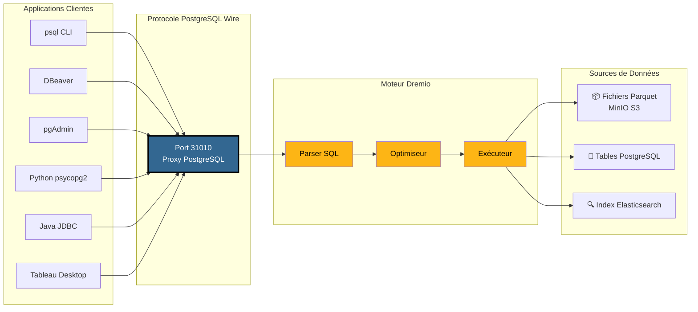
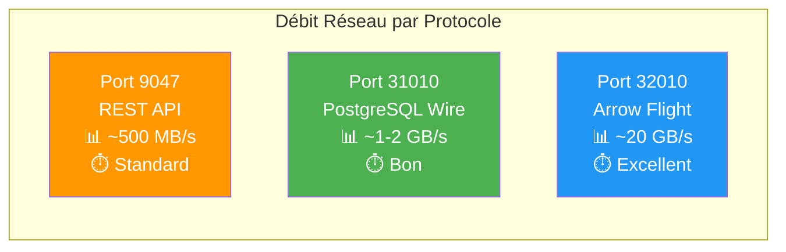
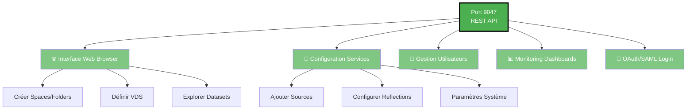
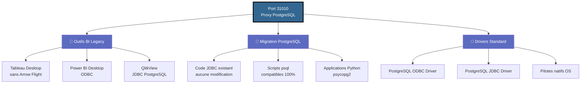
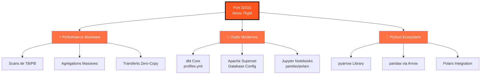
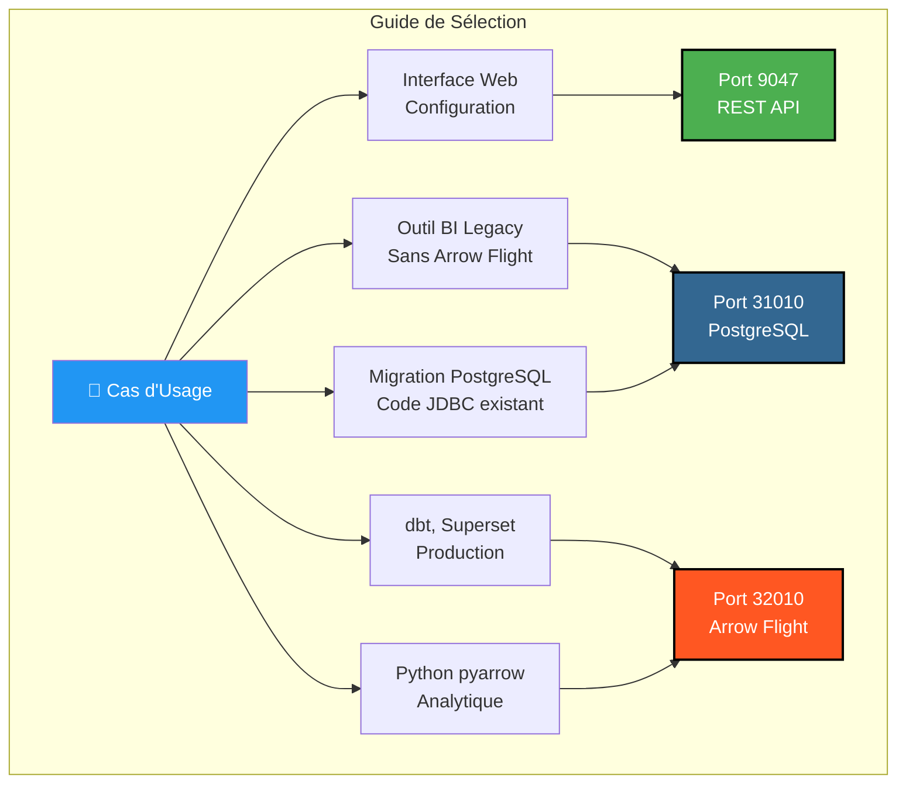

# Dremio 포트 비주얼 가이드

**버전**: 3.2.3  
**최종 업데이트**: 2025년 10월 16일  
**언어**: 프랑스어

---

## Dremio 포트 3개 개요

```mermaid
graph TB
    subgraph "Port 9047 - REST API"
        direction TB
        A1[🌐 Interface Web UI]
        A2[🔧 Administration]
        A3[📊 Monitoring]
        A4[🔐 Authentification]
    end
    
    subgraph "Port 31010 - Proxy PostgreSQL"
        direction TB
        B1[💼 Outils BI Legacy]
        B2[🔌 JDBC/ODBC Standard]
        B3[🐘 Compatibilité PostgreSQL]
        B4[🔄 Migration Facile]
    end
    
    subgraph "Port 32010 - Arrow Flight"
        direction TB
        C1[⚡ Performance Max]
        C2[🎯 dbt Core]
        C3[📈 Apache Superset]
        C4[🐍 Python pyarrow]
    end
    
    D[🗄️ Dremio Coordinateur<br/>Dremio 26.0 OSS]
    
    A1 & A2 & A3 & A4 --> D
    B1 & B2 & B3 & B4 --> D
    C1 & C2 & C3 & C4 --> D
    
    E1[(MinIO S3)]
    E2[(PostgreSQL)]
    E3[(Elasticsearch)]
    
    D --> E1 & E2 & E3
    
    style D fill:#FDB515,color:#000,stroke:#000,stroke-width:3px
    style A1 fill:#4CAF50,color:#fff
    style A2 fill:#4CAF50,color:#fff
    style A3 fill:#4CAF50,color:#fff
    style A4 fill:#4CAF50,color:#fff
    style B1 fill:#336791,color:#fff
    style B2 fill:#336791,color:#fff
    style B3 fill:#336791,color:#fff
    style B4 fill:#336791,color:#fff
    style C1 fill:#FF5722,color:#fff
    style C2 fill:#FF5722,color:#fff
    style C3 fill:#FF5722,color:#fff
    style C4 fill:#FF5722,color:#fff
```



---

## PostgreSQL 프록시의 세부 아키텍처

### 고객 연결 흐름 → 드레미오



---

## 성능 비교

### 벤치마크: 100GB 데이터 스캔

```mermaid
gantt
    title Temps d'Exécution par Protocole (secondes)
    dateFormat X
    axisFormat %s sec
    
    section REST API :9047
    Transfert 100 GB     :0, 180
    
    section PostgreSQL :31010
    Transfert 100 GB     :0, 90
    
    section Arrow Flight :32010
    Transfert 100 GB     :0, 5
```



### 데이터 속도



### 단순 쿼리 지연 시간

| 프로토콜 | 포트 | 평균 지연 시간 | 네트워크 오버헤드 |
|---------------|------|----|----|
| **REST API** | 9047 | 50-100ms | JSON(상세) |
| **PostgreSQL 프록시** | 31010 | 20-50ms | 유선 프로토콜(컴팩트) |
| **화살비행** | 32010 | 5~10ms | Apache Arrow(이진 원주형) |

---

## 포트별 사용 사례

### 포트 9047 - REST API



### 포트 31010 - PostgreSQL 프록시



### 포트 32010 - 애로우 플라이트



---

## 의사결정 트리: 어떤 포트를 사용할 것인가?

```mermaid
graph TB
    Start[Besoin de se connecter à Dremio]
    
    Start --> Q1{Type d'application ?}
    
    Q1 -->|Interface Web<br/>Administration| Port9047[✅ Port 9047<br/>REST API]
    
    Q1 -->|Outil BI/Client SQL| Q2{Supporte Arrow Flight ?}
    
    Q2 -->|Non<br/>Legacy Tool| Port31010[✅ Port 31010<br/>Proxy PostgreSQL]
    Q2 -->|Oui<br/>Modern Tool| Q3{Performance critique ?}
    
    Q3 -->|Oui<br/>Production| Port32010[✅ Port 32010<br/>Arrow Flight]
    Q3 -->|Non<br/>Dev/Test| Port31010b[⚠️ Port 31010<br/>Plus facile]
    
    Q1 -->|Application Custom| Q4{Langage ?}
    
    Q4 -->|Python/Java| Q5{Performance importante ?}
    Q5 -->|Oui| Port32010b[✅ Port 32010<br/>Arrow Flight]
    Q5 -->|Non| Port31010c[✅ Port 31010<br/>JDBC/psycopg2]
    
    Q4 -->|Autre<br/>Go/Rust/.NET| Port31010d[✅ Port 31010<br/>PostgreSQL Wire]
    
    style Start fill:#2196F3,color:#fff
    style Port9047 fill:#4CAF50,color:#fff,stroke:#000,stroke-width:2px
    style Port31010 fill:#336791,color:#fff,stroke:#000,stroke-width:2px
    style Port31010b fill:#336791,color:#fff,stroke:#000,stroke-width:2px
    style Port31010c fill:#336791,color:#fff,stroke:#000,stroke-width:2px
    style Port31010d fill:#336791,color:#fff,stroke:#000,stroke-width:2px
    style Port32010 fill:#FF5722,color:#fff,stroke:#000,stroke-width:2px
    style Port32010b fill:#FF5722,color:#fff,stroke:#000,stroke-width:2px
```



---

## PostgreSQL 프록시 연결 예

### 1. psql CLI

```bash
# Connexion simple
psql -h localhost -p 31010 -U admin -d datalake

# Avec requête directe
psql -h localhost -p 31010 -U admin -d datalake \
  -c "SELECT COUNT(*) FROM MinIO.datalake.customers;"

# Mode interactif
$ psql -h localhost -p 31010 -U admin -d datalake
Password for user admin: ****
psql (16.0, server 26.0)
Type "help" for help.

datalake=> \dt
           List of relations
 Schema |   Name    | Type  | Owner 
--------+-----------+-------+-------
 public | customers | table | admin
 public | orders    | table | admin
(2 rows)

datalake=> SELECT customer_id, name, state FROM customers LIMIT 5;
```

### 2. DBeaver 구성

```yaml
Connection Type: PostgreSQL
Connection Name: Dremio via PostgreSQL Proxy

Main:
  Host: localhost
  Port: 31010
  Database: datalake
  Username: admin
  Password: [votre-mot-de-passe]
  
Driver Properties:
  ssl: false
  
Advanced:
  Connection timeout: 30000
  Query timeout: 0
```

### 3. psycopg2를 사용한 Python

```python
import psycopg2
from psycopg2 import sql

# Connexion
conn = psycopg2.connect(
    host="localhost",
    port=31010,
    database="datalake",
    user="admin",
    password="votre-mot-de-passe"
)

# Cursor
cursor = conn.cursor()

# Requête simple
cursor.execute("SELECT * FROM MinIO.datalake.customers LIMIT 10")
rows = cursor.fetchall()

for row in rows:
    print(row)

# Requête avec paramètres
query = sql.SQL("SELECT * FROM {} WHERE state = %s").format(
    sql.Identifier("MinIO", "datalake", "customers")
)
cursor.execute(query, ("CA",))

# Fermeture
cursor.close()
conn.close()
```

### 4. 자바 JDBC

```java
import java.sql.*;

public class DremioPostgreSQLProxy {
    public static void main(String[] args) {
        String url = "jdbc:postgresql://localhost:31010/datalake";
        String user = "admin";
        String password = "votre-mot-de-passe";
        
        try (Connection conn = DriverManager.getConnection(url, user, password)) {
            Statement stmt = conn.createStatement();
            ResultSet rs = stmt.executeQuery(
                "SELECT customer_id, name, state FROM MinIO.datalake.customers LIMIT 10"
            );
            
            while (rs.next()) {
                int id = rs.getInt("customer_id");
                String name = rs.getString("name");
                String state = rs.getString("state");
                System.out.printf("ID: %d, Name: %s, State: %s%n", id, name, state);
            }
            
            rs.close();
            stmt.close();
        } catch (SQLException e) {
            e.printStackTrace();
        }
    }
}
```

### 5. ODBC 문자열(DSN)

```ini
[ODBC Data Sources]
Dremio_PostgreSQL=PostgreSQL Unicode Driver

[Dremio_PostgreSQL]
Driver=PostgreSQL Unicode
Description=Dremio via PostgreSQL Proxy
Server=localhost
Port=31010
Database=datalake
Username=admin
Password=votre-mot-de-passe
SSLMode=disable
Protocol=7.4
```

---

## Docker Compose 구성

### Dremio 포트 매핑

```yaml
services:
  dremio:
    image: dremio/dremio-oss:26.0
    container_name: dremio
    ports:
      # Port 9047 - REST API / Web UI
      - "9047:9047"
      
      # Port 31010 - Proxy PostgreSQL (ODBC/JDBC)
      - "31010:31010"
      
      # Port 32010 - Arrow Flight (Performance)
      - "32010:32010"
    environment:
      - DREMIO_JAVA_SERVER_EXTRA_OPTS=-Xms4g -Xmx8g
    volumes:
      - ./docker-volume/dremio:/opt/dremio/data
    networks:
      - data-platform
```

### 포트 확인

```bash
# Vérifier que les 3 ports sont ouverts
netstat -an | grep -E '9047|31010|32010'

# Tester REST API
curl -v http://localhost:9047

# Tester Proxy PostgreSQL
psql -h localhost -p 31010 -U admin -d datalake -c "SELECT 1;"

# Tester Arrow Flight (avec Python)
python3 -c "
from pyarrow import flight
client = flight.connect('grpc://localhost:32010')
print('Arrow Flight OK')
"
```

---

## 빠른 시각적 요약

### 3개 포트 개요

| 포트 | 프로토콜 | 주요 용도 | 성과 | 호환성 |
|------|----------|------------|-------------|---------------|
| **9047** | REST API | 🌐 웹 인터페이스, 관리자 | ⭐⭐표준 | ⭐⭐⭐ 유니버설 |
| **31010** | PostgreSQL 와이어 | 💼 BI 도구, 마이그레이션 | ⭐⭐⭐ 좋음 | ⭐⭐⭐ 훌륭함 |
| **32010** | 화살표 비행 | ⚡ 생산, dbt, Superset | ⭐⭐⭐⭐⭐ 최대 | ⭐⭐ 한정 |

### 선택 매트릭스



---

## 추가 리소스

### 관련 문서

- [아키텍처 - 구성 요소](./comComponents.md) - "Dremio용 PostgreSQL 프록시" 섹션
- [가이드 - Dremio 설정](../guides/dremio-setup.md) - "PostgreSQL 프록시를 통한 연결" 섹션
- [구성 - Dremio](../getting-started/configuration.md) - 매개변수 `dremio.conf`

### 공식 링크

- **Dremio 문서**: https://docs.dremio.com/
- **PostgreSQL 유선 프로토콜**: https://www.postgresql.org/docs/current/protocol.html
- **Apache Arrow Flight**: https://arrow.apache.org/docs/format/Flight.html

---

**버전**: 3.2.3  
**최종 업데이트**: 2025년 10월 16일  
**상태**: ✅ 완료