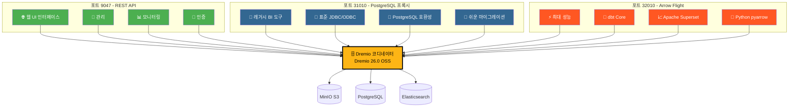
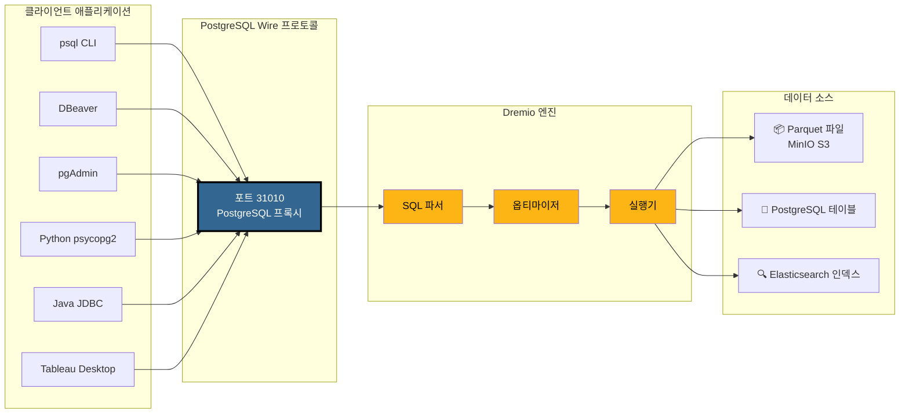
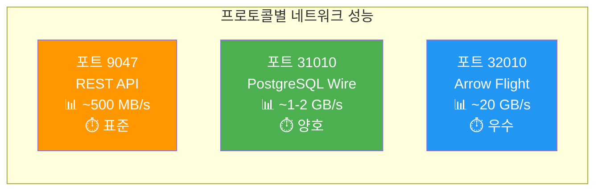
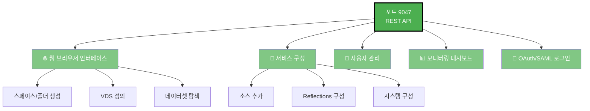
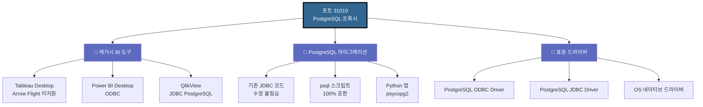
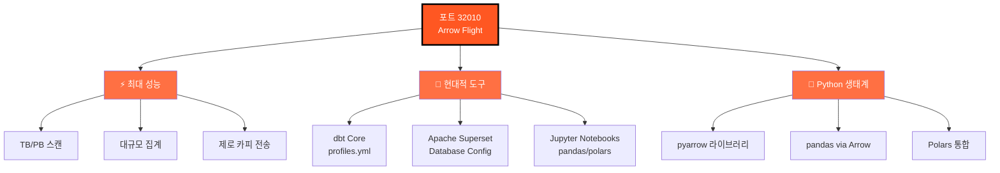
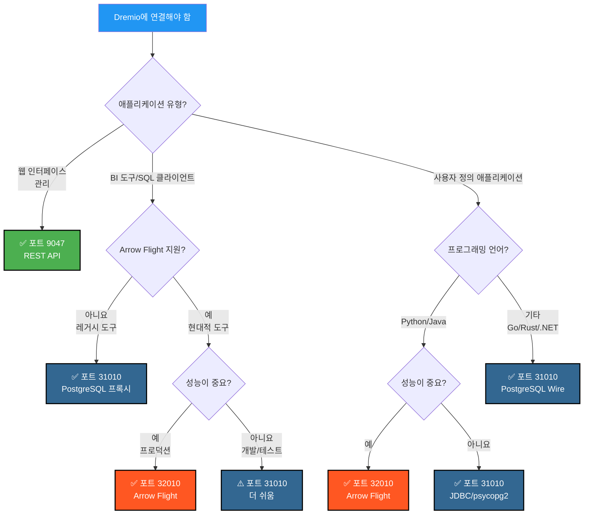
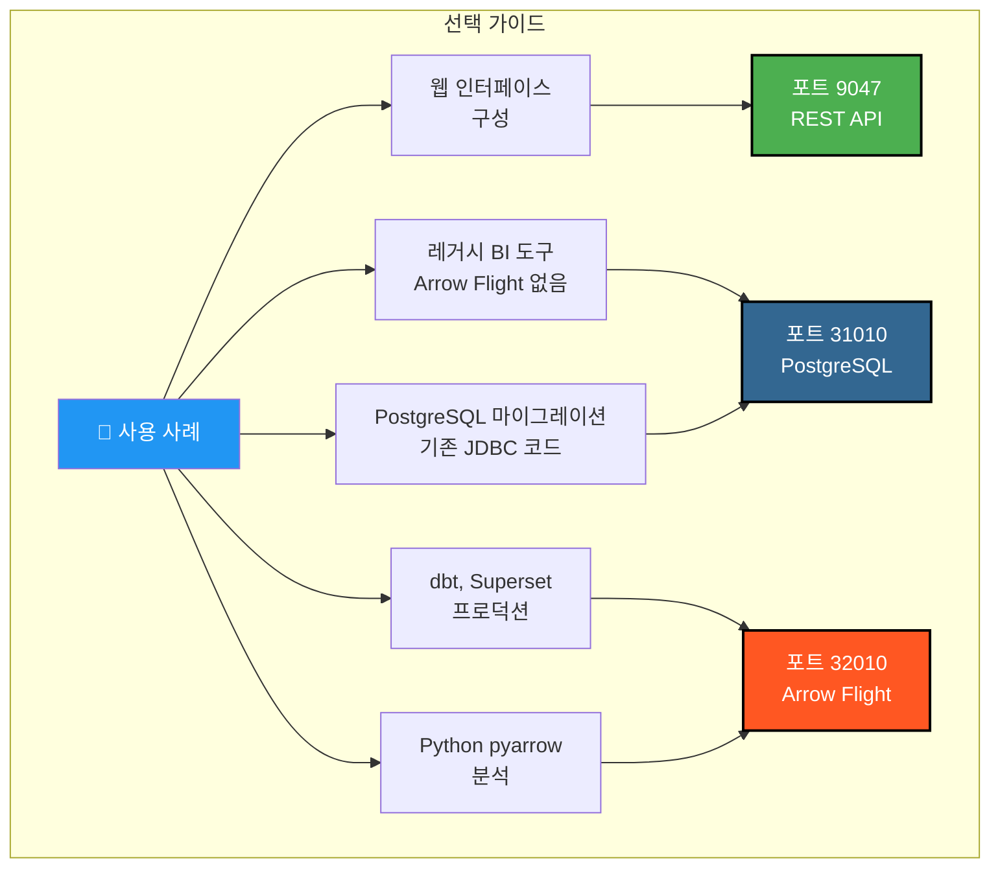

# Dremio 포트 시각적 가이드

**버전**: 3.2.5  
**최종 업데이트**: 2025년 10월 16일  
**언어**: 한국어

---

## Dremio 3개 포트 개요



---

## PostgreSQL 프록시 상세 아키텍처

### 클라이언트 → Dremio 연결 흐름



---

## 성능 비교

### 벤치마크: 100 GB 데이터 스캔

```mermaid
gantt
    title 프로토콜별 실행 시간 (초)
    dateFormat X
    axisFormat %s 초
    
    section REST API :9047
    100 GB 전송     :0, 180
    
    section PostgreSQL :31010
    100 GB 전송     :0, 90
    
    section Arrow Flight :32010
    100 GB 전송     :0, 5
```



### 데이터 처리량



### 단순 쿼리 지연 시간

| 프로토콜 | 포트 | 평균 지연 시간 | 네트워크 오버헤드 |
|----------|------|----------------|------------------|
| **REST API** | 9047 | 50-100 ms | JSON (상세) |
| **PostgreSQL 프록시** | 31010 | 20-50 ms | Wire Protocol (간결) |
| **Arrow Flight** | 32010 | 5-10 ms | Apache Arrow (바이너리 컬럼형) |

---

## 포트별 사용 사례

### 포트 9047 - REST API



### 포트 31010 - PostgreSQL 프록시



### 포트 32010 - Arrow Flight



---

## 의사 결정 트리: 어떤 포트를 사용할까?



---

## PostgreSQL 프록시 연결 예제

### 1. psql CLI

```bash
# 간단한 연결
psql -h localhost -p 31010 -U admin -d datalake

# 직접 쿼리
psql -h localhost -p 31010 -U admin -d datalake \
  -c "SELECT COUNT(*) FROM MinIO.datalake.customers;"

# 대화형 모드
$ psql -h localhost -p 31010 -U admin -d datalake
Password for user admin: ****
psql (16.0, server 26.0)
Type "help" for help.

datalake=> \dt
           List of relations
 Schema |   Name    | Type  | Owner 
--------+-----------+-------+-------
 public | customers | table | admin
 public | orders    | table | admin
(2 rows)

datalake=> SELECT customer_id, name, state FROM customers LIMIT 5;
```

### 2. DBeaver 구성

```yaml
연결 유형: PostgreSQL
연결 이름: Dremio via PostgreSQL Proxy

기본:
  호스트: localhost
  포트: 31010
  데이터베이스: datalake
  사용자: admin
  비밀번호: [your-password]
  
드라이버 속성:
  ssl: false
  
고급:
  연결 시간 초과: 30000
  쿼리 시간 초과: 0
```

### 3. Python psycopg2

```python
import psycopg2
from psycopg2 import sql

# 연결
conn = psycopg2.connect(
    host="localhost",
    port=31010,
    database="datalake",
    user="admin",
    password="your-password"
)

# 커서
cursor = conn.cursor()

# 간단한 쿼리
cursor.execute("SELECT * FROM MinIO.datalake.customers LIMIT 10")
rows = cursor.fetchall()

for row in rows:
    print(row)

# 매개변수화된 쿼리
query = sql.SQL("SELECT * FROM {} WHERE state = %s").format(
    sql.Identifier("MinIO", "datalake", "customers")
)
cursor.execute(query, ("CA",))

# 닫기
cursor.close()
conn.close()
```

### 4. Java JDBC

```java
import java.sql.*;

public class DremioPostgreSQLProxy {
    public static void main(String[] args) {
        String url = "jdbc:postgresql://localhost:31010/datalake";
        String user = "admin";
        String password = "your-password";
        
        try (Connection conn = DriverManager.getConnection(url, user, password)) {
            Statement stmt = conn.createStatement();
            ResultSet rs = stmt.executeQuery(
                "SELECT customer_id, name, state FROM MinIO.datalake.customers LIMIT 10"
            );
            
            while (rs.next()) {
                int id = rs.getInt("customer_id");
                String name = rs.getString("name");
                String state = rs.getString("state");
                System.out.printf("ID: %d, Name: %s, State: %s%n", id, name, state);
            }
            
            rs.close();
            stmt.close();
        } catch (SQLException e) {
            e.printStackTrace();
        }
    }
}
```

### 5. ODBC 연결 문자열 (DSN)

```ini
[ODBC Data Sources]
Dremio_PostgreSQL=PostgreSQL Unicode Driver

[Dremio_PostgreSQL]
Driver=PostgreSQL Unicode
Description=Dremio via PostgreSQL Proxy
Server=localhost
Port=31010
Database=datalake
Username=admin
Password=your-password
SSLMode=disable
Protocol=7.4
```

---

## Docker Compose 구성

### Dremio 포트 매핑

```yaml
services:
  dremio:
    image: dremio/dremio-oss:26.0
    container_name: dremio
    ports:
      # 포트 9047 - REST API / Web UI
      - "9047:9047"
      
      # 포트 31010 - PostgreSQL 프록시 (ODBC/JDBC)
      - "31010:31010"
      
      # 포트 32010 - Arrow Flight (성능)
      - "32010:32010"
    environment:
      - DREMIO_JAVA_SERVER_EXTRA_OPTS=-Xms4g -Xmx8g
    volumes:
      - ./docker-volume/dremio:/opt/dremio/data
    networks:
      - data-platform
```

### 포트 검증

```bash
# 3개 포트 모두 열려 있는지 확인
netstat -an | grep -E '9047|31010|32010'

# REST API 테스트
curl -v http://localhost:9047

# PostgreSQL 프록시 테스트
psql -h localhost -p 31010 -U admin -d datalake -c "SELECT 1;"

# Arrow Flight 테스트 (Python 사용)
python3 -c "
from pyarrow import flight
client = flight.connect('grpc://localhost:32010')
print('Arrow Flight OK')
"
```

---

## 빠른 시각적 요약

### 3개 포트 한눈에 보기

| 포트 | 프로토콜 | 주요 사용 | 성능 | 호환성 |
|------|-----------|-------------|------------|----------------|
| **9047** | REST API | 🌐 Web UI, 관리 | ⭐⭐ 표준 | ⭐⭐⭐ 범용 |
| **31010** | PostgreSQL Wire | 💼 BI 도구, 마이그레이션 | ⭐⭐⭐ 양호 | ⭐⭐⭐ 우수 |
| **32010** | Arrow Flight | ⚡ 프로덕션, dbt, Superset | ⭐⭐⭐⭐⭐ 최고 | ⭐⭐ 제한적 |

### 선택 매트릭스



---

## 추가 리소스

### 관련 문서

- [아키텍처 - 구성 요소](./components.md) - "Dremio용 PostgreSQL 프록시" 섹션
- [가이드 - Dremio 설정](../guides/dremio-setup.md) - "PostgreSQL 프록시를 통한 연결" 섹션
- [구성 - Dremio](../getting-started/configuration.md) - `dremio.conf` 구성

### 공식 링크

- **Dremio 문서**: https://docs.dremio.com/
- **PostgreSQL Wire 프로토콜**: https://www.postgresql.org/docs/current/protocol.html
- **Apache Arrow Flight**: https://arrow.apache.org/docs/format/Flight.html

---

**버전**: 3.2.5  
**최종 업데이트**: 2025년 10월 16일  
**상태**: ✅ 완료
