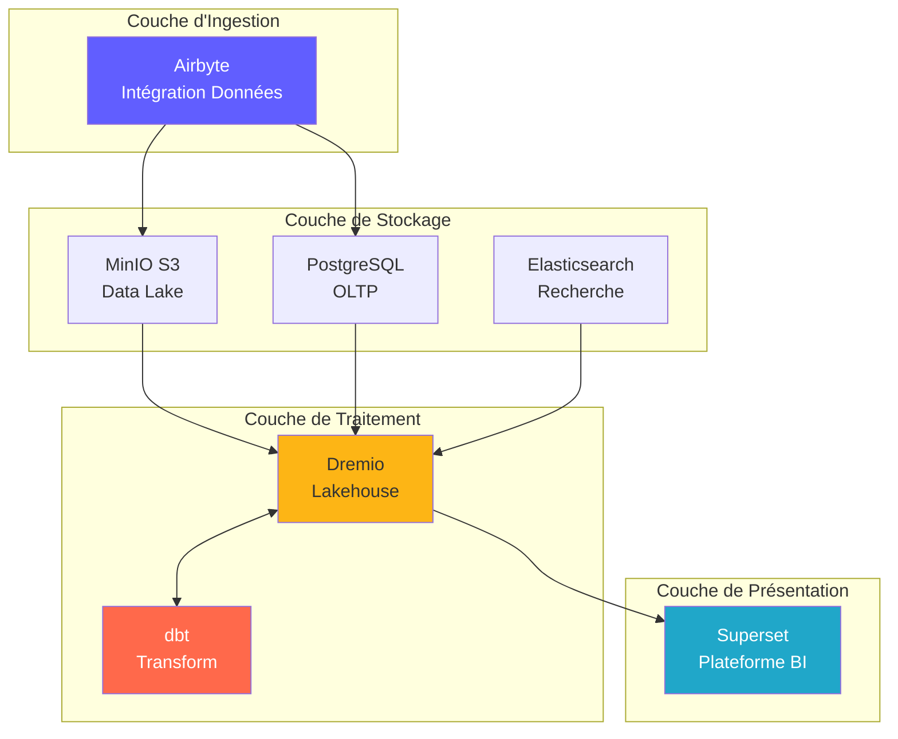
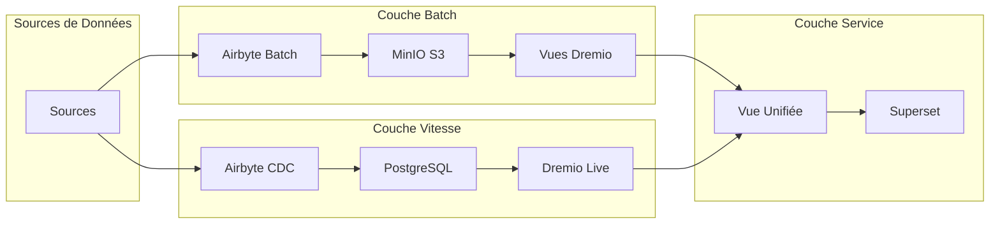
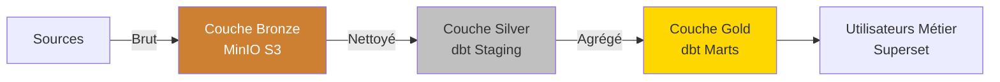
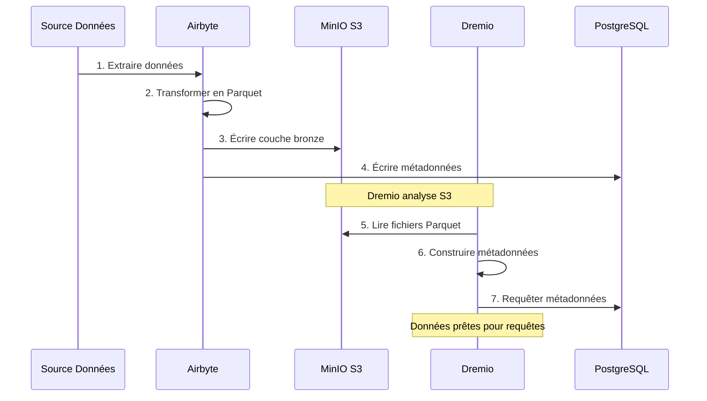
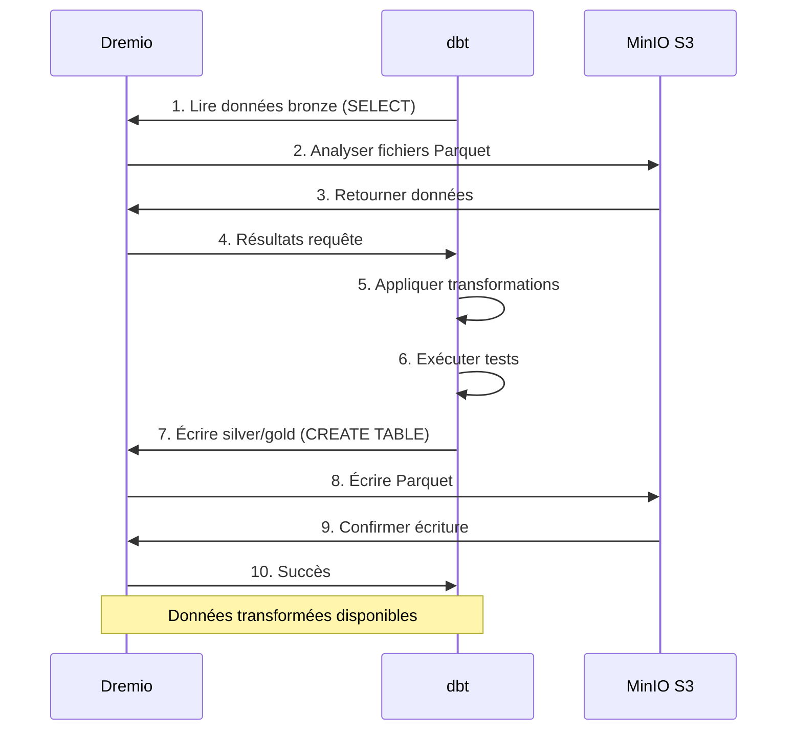
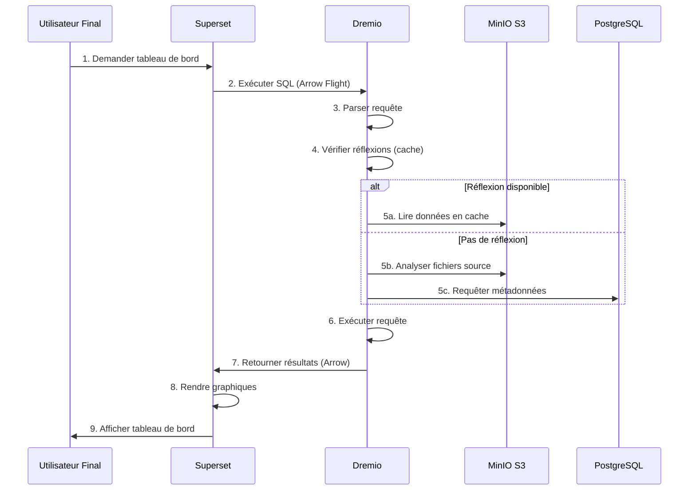
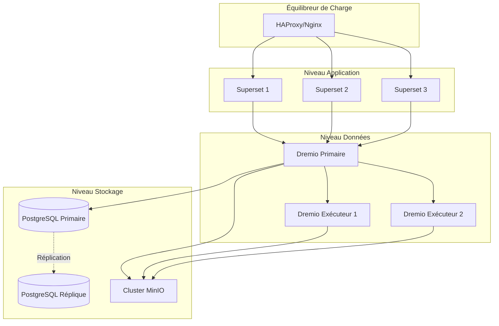
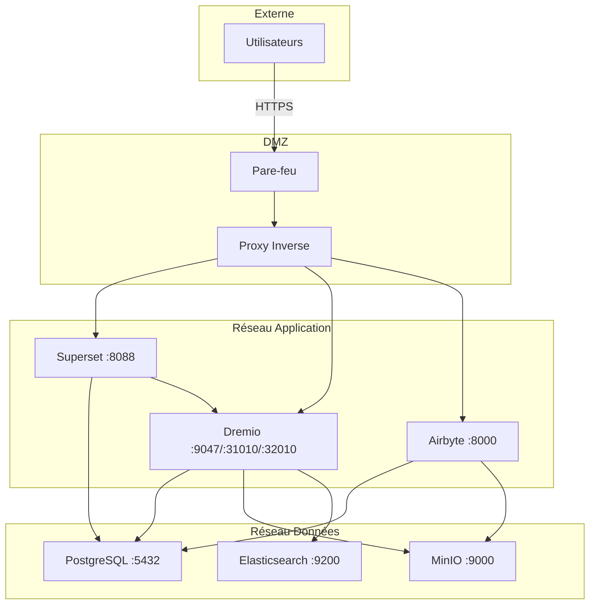
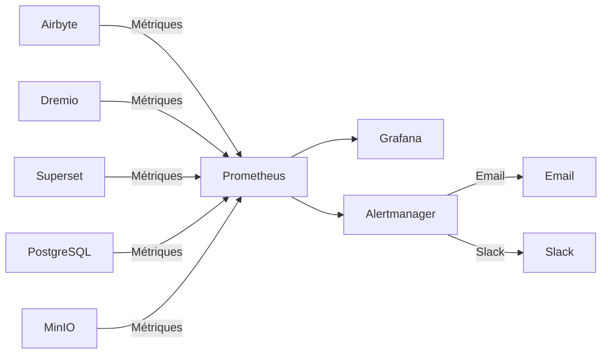

# 아키텍처 개요

**버전**: 3.2.0  
**최종 업데이트**: 2025-10-16  
**언어**: 프랑스어

---

## 소개

데이터 플랫폼은 오픈 소스 기술을 기반으로 구축된 최신 클라우드 네이티브 아키텍처입니다. 엔터프라이즈 규모의 분석 워크로드를 위해 설계된 데이터 수집, 저장, 변환 및 시각화를 위한 포괄적인 솔루션을 제공합니다.



---

## 디자인 원칙

### 1. 오픈소스 우선

**철학**: 오픈소스 기술을 사용하여 공급업체 종속을 방지하고 유연성을 유지합니다.

**이익**:
- 라이선스 비용 없음
- 지역사회 발전
- 전체 사용자 정의 기능
- 투명한 보안 감사
- 폭넓은 생태계 호환성

### 2. 계층화된 아키텍처

**철학**: 유지 관리 가능성과 확장성을 위해 문제를 별개의 레이어로 분리합니다.

**레이어**:
```
┌─────────────────────────────────────┐
│     Couche de Présentation          │  Superset (BI & Tableaux de Bord)
├─────────────────────────────────────┤
│     Couche Sémantique               │  Dremio (Moteur de Requête)
├─────────────────────────────────────┤
│     Couche de Transformation        │  dbt (Transformation Données)
├─────────────────────────────────────┤
│     Couche de Stockage              │  MinIO, PostgreSQL, Elasticsearch
├─────────────────────────────────────┤
│     Couche d'Ingestion              │  Airbyte (Intégration Données)
└─────────────────────────────────────┘
```

### 3. ETL이 아닌 ELT

**철학**: 원시 데이터를 먼저 로드하고 대상(ELT)으로 변환합니다.

**왜 ELT인가요?**
- **유연성**: 재추출 없이 다양한 방법으로 데이터 변환
- **성능**: 변환을 위해 대상 계산을 사용합니다.
- **감사 가능성**: 원시 데이터를 항상 확인용으로 사용할 수 있습니다.
- **비용**: 소스 시스템의 추출 부하 감소

**흐름**:
```
Extract → Load → Transform
(Airbyte) (MinIO/PostgreSQL) (dbt + Dremio)
```

### 4. 데이터 레이크하우스 모델

**철학**: 데이터 레이크의 유연성과 데이터 웨어하우스의 성능을 결합합니다.

**특징**:
- **ACID 트랜잭션**: 신뢰할 수 있는 데이터 작업
- **스키마 적용**: 데이터 품질 보장
- **시간 여행**: 과거 버전 쿼리
- **공개 형식**: Parquet, Iceberg, Delta Lake
- **직접 파일 액세스**: 독점 잠금 없음

### 5. 클라우드 네이티브 디자인

**철학**: 컨테이너화 및 분산 환경을 위한 설계.

**구현**:
- 모든 서비스에 대한 Docker 컨테이너
- 수평적 확장성
- 코드로서의 인프라
- 가능한 경우 무국적
- 환경 변수를 통한 구성

---

## 아키텍처 모델

### Lambda 아키텍처(배치 + 스트림)



**배치 레이어**(이력 데이터):
- 대용량 데이터
- 주기적인 치료(매시간/매일)
- 허용 가능한 높은 대기 시간
- 완전한 재가공 가능

**속도 레이어**(실시간 데이터):
- 변경 데이터 캡처(CDC)
- 낮은 대기 시간 필요
- 증분 업데이트만 가능
- 최근 데이터를 관리합니다.

**서비스 계층**:
- 일괄 및 속도 보기 병합
- 단일 쿼리 인터페이스(Dremio)
- 자동 뷰 선택

### 건축 메달리온(청동 → 은 → 금)



**브론즈 레이어**(원시):
- 소스에서 가져온 데이터
- 변형 없음
- 전체 기록 보존
- Airbyte가 여기에 로드됩니다.

**실버 레이어**(세정됨):
- 적용된 데이터 품질
- 표준화된 형식
- DBT 스테이징 템플릿
- 분석 준비

**골드 레이어**(직업):
- 집계된 지표
- 비즈니스 로직 적용
- 마트 DBT 모델
- 소비에 최적화됨

---

## 구성 요소 간의 상호 작용

### 데이터 수집 흐름



### 변환 파이프라인



### 쿼리 실행



---

## 확장성 모델

### 수평 확장

**상태 비저장 서비스**(자유롭게 발전할 수 있음):
- Airbyte Workers: 병렬 동기화를 위한 진화
- Dremio Executors: 쿼리 성능 확장
- 웹 슈퍼세트: 경쟁 사용자를 위한 진화

**상태 저장 서비스**(조정 필요):
- PostgreSQL: 기본 복제본 복제
- MinIO: 분산 모드(다중 노드)
- Elasticsearch: 샤딩이 포함된 클러스터

### 수직 확장

**메모리 집중**:
- Dremio: 대규모 쿼리를 위한 JVM 힙 증가
- PostgreSQL: 캐시 버퍼를 위한 추가 RAM
- Elasticsearch: 인덱싱을 위한 추가 힙

**CPU 집약적**:
- dbt: 병렬 구성 모델을 위한 더 많은 코어
- Airbyte: 더 빠른 데이터 변환

### 데이터 분할

```sql
-- Exemple: Partitionner par date
CREATE TABLE orders_partitioned (
    order_id INT,
    customer_id INT,
    amount DECIMAL,
    order_date DATE
)
PARTITION BY (DATE_TRUNC('month', order_date))
STORED AS PARQUET;

-- La requête analyse uniquement les partitions pertinentes
SELECT SUM(amount)
FROM orders_partitioned
WHERE order_date >= '2025-01-01'
  AND order_date < '2025-02-01';
-- Analyse uniquement la partition de janvier
```

---

## 고가용성

### 서비스 중복



### 실패 시나리오

| 구성요소 | 고장 | 회복 |
|---------------|-------|---------|
| **에어바이트 워커** | 컨테이너 충돌 | 자동 재시작, 동기화 재개 |
| **드레미오 집행자** | 노드 장애 | 요청이 다른 실행자에게 리디렉션됨 |
| **PostgreSQL** | 기본 서비스 중단 | 기본에서 복제본 승격 |
| **MinIO 노드** | 디스크 오류 | 삭제 코딩으로 데이터 재구성 |
| **슈퍼세트** | 서비스 중단 | 밸런서는 트래픽을 리디렉션합니다 |

### 백업 전략

```bash
# Sauvegardes automatisées quotidiennes
0 2 * * * /scripts/backup_all.sh

# backup_all.sh
#!/bin/bash

# Sauvegarder PostgreSQL
pg_dumpall -U postgres > /backups/postgres_$(date +%Y%m%d).sql

# Sauvegarder métadonnées Dremio
tar czf /backups/dremio_$(date +%Y%m%d).tar.gz /opt/dremio/data

# Synchroniser MinIO vers S3 distant
mc mirror MinIOLake/datalake s3-offsite/datalake-backup

# Conserver 30 jours
find /backups -mtime +30 -delete
```

---

## 보안 아키텍처

### 네트워크 보안



### 인증 및 승인

**서비스 인증**:
- **Dremio**: LDAP/AD, OAuth2, SAML 통합
- **상위 집합**: 데이터베이스 인증, LDAP, OAuth2
- **Airbyte**: 기본 인증, OAuth2(기업)
- **MinIO**: IAM 정책, STS 토큰

**승인 수준**:
```yaml
Rôles:
  - Admin:
      - Accès complet à tous les services
      - Gestion utilisateurs
      - Modifications configuration
  
  - Data Engineer:
      - Créer/modifier sources données
      - Exécuter syncs Airbyte
      - Exécuter modèles dbt
      - Créer datasets Dremio
  
  - Analyst:
      - Accès lecture seule données
      - Créer tableaux de bord Superset
      - Requêter datasets Dremio
  
  - Viewer:
      - Voir tableaux de bord uniquement
      - Pas d'accès données
```

### 데이터 암호화

**휴식 중**:
- MinIO: 서버 측 암호화(AES-256)
- PostgreSQL: 투명한 데이터 암호화(TDE)
- Elasticsearch: 암호화된 인덱스

**배송 중**:
- 모든 서비스 간 통신을 위한 TLS 1.3
- Dremio ← Superset용 TLS를 사용한 Arrow Flight
- 웹 인터페이스용 HTTPS

---

## 모니터링 및 관찰 가능성

### 측정항목 수집



**주요 측정항목**:
- **Airbyte**: 동기화 성공률, 녹음 동기화, 전송된 바이트
- **Dremio**: 요청 지연 시간, 캐시 적중률, 리소스 사용량
- **dbt**: 모델 구축 시간, 테스트 실패
- **상위 집합**: 대시보드 로딩 시간, 활성 사용자
- **인프라**: CPU, 메모리, 디스크, 네트워크

### 로깅

**중앙 집중식 로깅**:
```yaml
Stack ELK:
  - Elasticsearch: Stocker logs
  - Logstash: Traiter logs
  - Kibana: Visualiser logs

Sources de Logs:
  - Logs application (format JSON)
  - Logs d'accès
  - Logs d'audit
  - Logs d'erreur
```

### 추적

**분산 추적**:
- Jaeger 또는 Zipkin 통합
- 서비스 간 요청 추적
- 병목 현상 식별
- 성능 문제 디버그

---

## 배포 토폴로지

### 개발 환경

```yaml
Hôte Unique:
  Ressources: 8 Go RAM, 4 CPUs
  Services: Tous sur une machine
  Stockage: Volumes locaux
  Réseau: Réseau bridge
  Cas d'usage: Développement, tests
```

### 스테이징 환경

```yaml
Multi-Hôtes:
  Ressources: 16 Go RAM, 8 CPUs par hôte
  Services: Répartis sur 2-3 hôtes
  Stockage: NFS partagé ou MinIO distribué
  Réseau: Réseau overlay
  Cas d'usage: Tests pré-production, UAT
```

### 제작 환경

```yaml
Cluster Kubernetes:
  Ressources: Auto-scaling selon charge
  Services: Conteneurisés, répliqués
  Stockage: Volumes persistants (SSD)
  Réseau: Service mesh (Istio)
  Haute Disponibilité: Déploiement multi-zones
  Cas d'usage: Charges production
```

---

## 기술 선택의 정당화

### 왜 에어바이트인가?

- **300개 이상의 커넥터**: 사전 구축된 통합
- **오픈 소스**: 공급업체 종속 없음
- **활성 커뮤니티**: 12,000개 이상의 GitHub 스타
- **CDC 지원**: 실시간 데이터 캡처
- **표준화**: 내장형 DBT 통합

### 왜 드레미오인가?

- **쿼리 가속화**: 쿼리 속도가 10~100배 빨라집니다.
- **애로우 플라이트**: 고성능 데이터 전송
- **데이터 레이크 호환성**: 데이터 이동 없음
- **셀프 서비스**: 비즈니스 사용자가 데이터를 탐색합니다.
- **수익성**: 창고 비용 절감

### 왜 DBT인가요?

- **SQL 기반**: 분석가에게 친숙함
- **버전 관리**: Git 통합
- **테스트**: 통합 데이터 품질 테스트
- **문서**: 자동 생성된 문서
- **커뮤니티**: 5,000개 이상의 패키지 사용 가능

### 왜 슈퍼세트인가요?

- **현대적인 UI**: 직관적인 인터페이스
- **SQL IDE**: 고급 쿼리 기능
- **풍부한 시각화**: 50개 이상의 그래픽 유형
- **확장 가능**: 맞춤형 플러그인
- **오픈 소스**: 지원되는 Apache Foundation

### 왜 PostgreSQL인가?

- **신뢰성**: ACID 준수
- **성능**: 대규모로 입증됨
- **기능**: JSON, 전체 텍스트 검색, 확장 기능
- **커뮤니티**: 성숙한 생태계
- **비용**: 무료 및 오픈 소스

### 왜 MinIO인가?

- **S3 호환성**: 업계 표준 API
- **성능**: 고유량
- **삭제 코딩**: 데이터 내구성
- **멀티 클라우드**: 어디에나 배포
- **비용 효율적**: 자체 호스팅 대안

---

## 건축의 미래 진화

### 개선 계획

1. **데이터 카탈로그**(OpenMetadata 통합)
   - 메타데이터 관리
   - 계보 추적
   - 데이터 발견

2. **데이터 품질**(큰 기대)
   - 자동화된 검증
   - 이상 탐지
   - 품질 대시보드

3. **ML 작업**(MLflow)
   - 모델 훈련 파이프라인
   - 모델 등록
   - 배포 자동화

4. **스트림 처리**(Apache Flink)
   - 실시간 변환
   - 복잡한 이벤트 처리
   - 스트리밍 분석

5. **데이터 거버넌스**(Apache Atlas)
   - 정책적용
   - 접근 감사
   - 규정 준수 보고서

---

## 참고자료

- [구성요소 세부정보](commoders.md)
- [데이터 흐름](data-flow.md)
- [배포 가이드](deployment.md)
- [에어바이트 통합](../guides/airbyte-integration.md)

---

**아키텍처 개요 버전**: 3.2.0  
**최종 업데이트**: 2025-10-16  
**관리자**: 데이터 플랫폼 팀