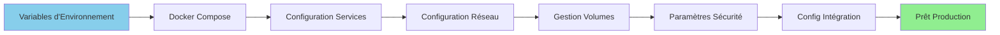
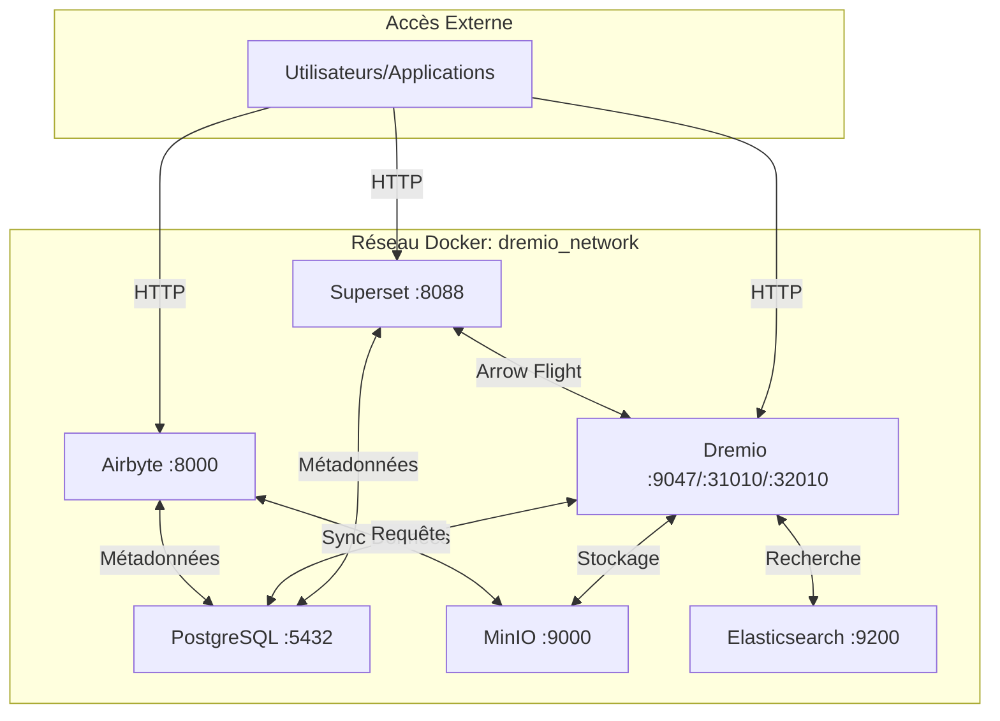

# 설정 가이드

**버전**: 3.2.0  
**최종 업데이트**: 2025-10-16  
**언어**: 프랑스어

---

## 개요

이 가이드는 Airbyte, Dremio, dbt, Apache Superset, PostgreSQL, MinIO 및 Elasticsearch를 포함한 모든 플랫폼 구성 요소의 구성을 다룹니다. 적절한 구성은 최적의 성능, 보안 및 서비스 간 통합을 보장합니다.



---

## 구성 파일

### 기본 구성 파일

```
dremiodbt/
├── .env                           # Variables d'environnement
├── .env.example                   # Modèle d'environnement
├── docker-compose.yml             # Services principaux
├── docker-compose-airbyte.yml     # Services Airbyte
├── dbt/
│   └── dbt_project.yml           # Configuration dbt
├── config/
│   ├── dremio.conf               # Paramètres Dremio
│   ├── superset_config.py        # Paramètres Superset
│   └── i18n/
│       └── config.json           # Internationalisation
└── scripts/
    └── configure_platform.py      # Configuration automatisée
```

---

## 환경 변수

### 기본 설정

프로젝트 루트에서 `.env` 파일을 생성하거나 편집합니다.

```bash
#================================================
# CONFIGURATION PROJET
#================================================

PROJECT_NAME=dremiodbt
ENVIRONMENT=production  # development, staging, production
VERSION=3.2.0

#================================================
# RÉSEAU DOCKER
#================================================

NETWORK_NAME=dremio_network
NETWORK_DRIVER=bridge

#================================================
# BASE DE DONNÉES POSTGRESQL
#================================================

POSTGRES_VERSION=16
POSTGRES_HOST=postgres
POSTGRES_PORT=5432
POSTGRES_DB=dremio_db
POSTGRES_USER=postgres
POSTGRES_PASSWORD=ChangeMe123!  # À CHANGER EN PRODUCTION

# Paramètres pool de connexions
POSTGRES_MAX_CONNECTIONS=200
POSTGRES_SHARED_BUFFERS=256MB

#================================================
# DREMIO DATA LAKEHOUSE
#================================================

DREMIO_VERSION=24.0
DREMIO_HTTP_PORT=9047
DREMIO_FLIGHT_PORT=32010
DREMIO_FABRIC_PORT=45678

# Identifiants administrateur
DREMIO_ADMIN_USER=admin
DREMIO_ADMIN_PASSWORD=Admin123!  # À CHANGER EN PRODUCTION
DREMIO_ADMIN_EMAIL=admin@example.com

# Paramètres mémoire
DREMIO_MAX_MEMORY_GB=8
DREMIO_MAX_DIRECT_MEMORY_GB=8

# Performance
DREMIO_DIST_MASTER_ENABLED=true
DREMIO_DIST_EXECUTOR_ENABLED=true

#================================================
# AIRBYTE INTÉGRATION DE DONNÉES
#================================================

AIRBYTE_VERSION=0.50.33
AIRBYTE_HTTP_PORT=8000
AIRBYTE_API_PORT=8001

# Configuration Airbyte
AIRBYTE_WORKSPACE_ROOT=/tmp/airbyte_local
AIRBYTE_LOCAL_ROOT=/tmp/airbyte_local
AIRBYTE_WEBAPP_URL=http://localhost:8000

# Base de données pour Airbyte
AIRBYTE_DB_HOST=airbyte-db
AIRBYTE_DB_PORT=5432
AIRBYTE_DB_NAME=airbyte
AIRBYTE_DB_USER=airbyte
AIRBYTE_DB_PASSWORD=AirbytePass123!  # À CHANGER EN PRODUCTION

# Temporal
TEMPORAL_HOST=airbyte-temporal:7233

#================================================
# APACHE SUPERSET BI
#================================================

SUPERSET_VERSION=3.0.1
SUPERSET_HTTP_PORT=8088

# Identifiants administrateur
SUPERSET_ADMIN_USER=admin
SUPERSET_ADMIN_PASSWORD=Admin123!  # À CHANGER EN PRODUCTION
SUPERSET_ADMIN_EMAIL=admin@example.com
SUPERSET_ADMIN_FIRSTNAME=Admin
SUPERSET_ADMIN_LASTNAME=User

# Clé secrète (générer avec: openssl rand -base64 42)
SUPERSET_SECRET_KEY=YOUR_SECRET_KEY_HERE  # À CHANGER EN PRODUCTION

# Base de données
SUPERSET_DB_USER=superset
SUPERSET_DB_PASSWORD=SupersetPass123!  # À CHANGER EN PRODUCTION

#================================================
# MINIO STOCKAGE OBJET
#================================================

MINIO_VERSION=latest
MINIO_API_PORT=9000
MINIO_CONSOLE_PORT=9001

# Identifiants root
MINIO_ROOT_USER=minioadmin
MINIO_ROOT_PASSWORD=MinioAdmin123!  # À CHANGER EN PRODUCTION

# Buckets
MINIO_DEFAULT_BUCKET=datalake
MINIO_RAW_BUCKET=raw-data
MINIO_PROCESSED_BUCKET=processed-data

#================================================
# ELASTICSEARCH MOTEUR DE RECHERCHE
#================================================

ELASTIC_VERSION=8.15.0
ELASTIC_HTTP_PORT=9200
ELASTIC_TRANSPORT_PORT=9300

# Sécurité
ELASTIC_PASSWORD=ElasticPass123!  # À CHANGER EN PRODUCTION
ELASTIC_SECURITY_ENABLED=true

# Mémoire
ELASTIC_JAVA_OPTS=-Xms1g -Xmx1g

#================================================
# DBT TRANSFORMATION
#================================================

DBT_PROFILES_DIR=./dbt
DBT_TARGET=prod  # dev, staging, prod
DBT_THREADS=4

#================================================
# JOURNALISATION
#================================================

LOG_LEVEL=INFO  # DEBUG, INFO, WARNING, ERROR
LOG_FORMAT=json  # json, text
LOG_OUTPUT=file  # console, file, both

#================================================
# SURVEILLANCE
#================================================

ENABLE_METRICS=true
METRICS_PORT=9090
ENABLE_TRACING=false

#================================================
# SAUVEGARDE
#================================================

BACKUP_ENABLED=true
BACKUP_SCHEDULE="0 2 * * *"  # 2h du matin quotidien
BACKUP_RETENTION_DAYS=30
BACKUP_S3_BUCKET=backups
```

### 올바른 보안 관행

**보안 비밀번호 생성:**
```bash
# Générer un mot de passe aléatoire (32 caractères)
openssl rand -base64 32

# Générer une clé secrète pour Superset
openssl rand -base64 42
```

**민감한 데이터를 커밋하지 마세요:**
```bash
# S'assurer que .env est dans .gitignore
echo ".env" >> .gitignore

# Utiliser .env.example pour la documentation
cp .env .env.example
# Retirer les valeurs sensibles de .env.example
```

---

## 서비스 구성

### 1. PostgreSQL 구성

#### 연결 설정

**파일**: `config/postgres.conf`

```ini
# Paramètres de Connexion
max_connections = 200
superuser_reserved_connections = 3

# Paramètres Mémoire
shared_buffers = 256MB
effective_cache_size = 1GB
maintenance_work_mem = 64MB
work_mem = 4MB

# Optimisation Requêtes
random_page_cost = 1.1
effective_io_concurrency = 200

# Journalisation
log_destination = 'stderr'
logging_collector = on
log_directory = 'pg_log'
log_filename = 'postgresql-%Y-%m-%d.log'
log_statement = 'mod'
log_duration = on

# Autovacuum
autovacuum = on
autovacuum_max_workers = 3
```

#### 데이터베이스 생성

```sql
-- Se connecter à PostgreSQL
psql -U postgres -h localhost

-- Créer les bases de données
CREATE DATABASE dremio_db;
CREATE DATABASE superset_db;
CREATE DATABASE airbyte_db;

-- Créer les utilisateurs
CREATE USER dremio WITH PASSWORD 'DremioPass123!';
CREATE USER superset WITH PASSWORD 'SupersetPass123!';
CREATE USER airbyte WITH PASSWORD 'AirbytePass123!';

-- Accorder les privilèges
GRANT ALL PRIVILEGES ON DATABASE dremio_db TO dremio;
GRANT ALL PRIVILEGES ON DATABASE superset_db TO superset;
GRANT ALL PRIVILEGES ON DATABASE airbyte_db TO airbyte;
```

### 2. 드레미오 설정

#### 메모리 설정

**파일**: `config/dremio.conf`

```hocon
paths: {
  local: "/opt/dremio/data"
  dist: "file:///opt/dremio/data/pdfs"
}

services: {
  coordinator.enabled: true
  coordinator.master.enabled: true
  executor.enabled: true
}

provisioning: {
  yarn: {
    enabled: false
  }
}

# Allocation mémoire
services.coordinator.master.heap: "4g"
services.coordinator.master.direct_memory: "8g"
services.executor.heap: "4g"
services.executor.direct_memory: "8g"

# Serveur web
services.coordinator.web.port: 9047
services.coordinator.web.ssl.enabled: false

# Points de terminaison client
services.coordinator.client.port: 31010
services.flight.endpoint.port: 32010

# Paramètres exécuteur
services.executor.cache.path.local: "/opt/dremio/data/cache"
services.executor.cache.pct.max: 70
```

#### 데이터 소스 구성

```yaml
# config/dremio-sources.yaml
sources:
  - name: PostgreSQL
    type: POSTGRES
    config:
      hostname: postgres
      port: 5432
      database: dremio_db
      username: dremio
      password: ${POSTGRES_PASSWORD}
    
  - name: MinIO
    type: S3
    config:
      accessKey: ${MINIO_ROOT_USER}
      accessSecret: ${MINIO_ROOT_PASSWORD}
      endpoint: minio:9000
      secure: false
      buckets:
        - datalake
        - raw-data
        - processed-data
```

### 3. 에어바이트 설정

#### 작업공간 설정

**파일**: `config/airbyte/config.yaml`

```yaml
# Configuration de l'espace de travail Airbyte
workspace:
  id: default
  name: "Default Workspace"
  slug: "default"
  
# Paramètres de synchronisation par défaut
sync:
  frequency: "manual"  # manual, hourly, daily, weekly
  normalization: true
  dbt_execution: false

# Valeurs par défaut des connexions
connection:
  namespace_definition: "destination"
  namespace_format: "${SOURCE_NAMESPACE}"
  prefix: ""

# Limites de ressources
resources:
  cpu_limit: "2.0"
  memory_limit: "2Gi"
  cpu_request: "0.5"
  memory_request: "512Mi"
```

#### 전류 소스 구성

**PostgreSQL 소스:**
```json
{
  "sourceDefinitionId": "decd338e-5647-4c0b-adf4-da0e75f5a750",
  "connectionConfiguration": {
    "host": "postgres",
    "port": 5432,
    "database": "source_db",
    "username": "readonly_user",
    "password": "${SOURCE_DB_PASSWORD}",
    "ssl": false,
    "replication_method": {
      "method": "Standard"
    }
  }
}
```

**S3 대상(MinIO):**
```json
{
  "destinationDefinitionId": "4816b78f-1489-44c1-9060-4b19d5fa9362",
  "connectionConfiguration": {
    "s3_bucket_name": "datalake",
    "s3_bucket_path": "airbyte-data",
    "s3_endpoint": "http://minio:9000",
    "access_key_id": "${MINIO_ROOT_USER}",
    "secret_access_key": "${MINIO_ROOT_PASSWORD}",
    "format": {
      "format_type": "Parquet"
    }
  }
}
```

### 4. DBT 설정

#### 프로젝트 구성

**파일**: `dbt/dbt_project.yml`

```yaml
name: 'dremio_dbt'
version: '1.0.0'
config-version: 2

# Configuration du profil
profile: 'dremio'

# Chemins des modèles
model-paths: ["models"]
analysis-paths: ["analyses"]
test-paths: ["tests"]
seed-paths: ["seeds"]
macro-paths: ["macros"]
snapshot-paths: ["snapshots"]

# Répertoire de sortie
target-path: "target"
clean-targets:
  - "target"
  - "dbt_packages"

# Configurations des modèles
models:
  dremio_dbt:
    # Modèles de staging
    staging:
      +materialized: view
      +schema: staging
      
    # Modèles intermédiaires
    intermediate:
      +materialized: view
      +schema: intermediate
      
    # Modèles marts
    marts:
      +materialized: table
      +schema: marts
      
    # Tests de qualité
    +tests:
      - not_null
      - unique

# Seeds
seeds:
  dremio_dbt:
    +schema: seeds
    +quote_columns: false

# Documentation
docs-paths: ["docs"]

# Variables
vars:
  start_date: '2024-01-01'
  end_date: '2025-12-31'
```

#### 프로필 구성

**파일**: `dbt/profiles.yml`

```yaml
dremio:
  target: prod
  outputs:
    dev:
      type: dremio
      threads: 4
      host: localhost
      port: 32010
      use_ssl: false
      username: dremio_user
      password: ${DREMIO_PASSWORD}
      database: "Samples"
      schema: "dbt_dev"
      
    staging:
      type: dremio
      threads: 4
      host: localhost
      port: 32010
      use_ssl: false
      username: dremio_user
      password: ${DREMIO_PASSWORD}
      database: "Production"
      schema: "dbt_staging"
      
    prod:
      type: dremio
      threads: 8
      host: localhost
      port: 32010
      use_ssl: false
      username: dremio_user
      password: ${DREMIO_PASSWORD}
      database: "Production"
      schema: "dbt_prod"
```

### 5. Apache Superset 구성

#### 애플리케이션 설정

**파일**: `config/superset_config.py`

```python
"""
Configuration Apache Superset pour l'intégration Dremio
"""
import os
from celery.schedules import crontab

# Clé secrète pour la gestion des sessions
SECRET_KEY = os.environ.get('SUPERSET_SECRET_KEY')

# Connexion base de données
SQLALCHEMY_DATABASE_URI = (
    f"postgresql://{os.environ.get('SUPERSET_DB_USER')}:"
    f"{os.environ.get('SUPERSET_DB_PASSWORD')}@postgres:5432/superset_db"
)

# Connexion Dremio
DREMIO_CONNECTION = (
    f"dremio+flight://{os.environ.get('DREMIO_ADMIN_USER')}:"
    f"{os.environ.get('DREMIO_ADMIN_PASSWORD')}@dremio:32010"
)

# Configuration Flask-AppBuilder
AUTH_TYPE = 1  # Authentification base de données
AUTH_USER_REGISTRATION = True
AUTH_USER_REGISTRATION_ROLE = "Gamma"

# Requêtes asynchrones
SUPERSET_WEBSERVER_TIMEOUT = 300
SUPERSET_CELERY_BEAT_SCHEDULE = {
    'cache-warmup': {
        'task': 'cache-warmup',
        'schedule': crontab(hour=0, minute=0),  # Quotidien à minuit
        'kwargs': {},
    },
}

# Configuration du cache
CACHE_CONFIG = {
    'CACHE_TYPE': 'redis',
    'CACHE_DEFAULT_TIMEOUT': 300,
    'CACHE_KEY_PREFIX': 'superset_',
    'CACHE_REDIS_HOST': 'redis',
    'CACHE_REDIS_PORT': 6379,
    'CACHE_REDIS_DB': 1,
}

# Indicateurs de fonctionnalités
FEATURE_FLAGS = {
    'ENABLE_TEMPLATE_PROCESSING': True,
    'DASHBOARD_NATIVE_FILTERS': True,
    'DASHBOARD_CROSS_FILTERS': True,
    'DASHBOARD_RBAC': True,
}

# Limite de lignes
ROW_LIMIT = 50000
VIZ_ROW_LIMIT = 10000
```

### 6. MinIO 구성

#### 버킷 구성

```bash
# Créer les buckets
docker exec -it minio mc mb /data/datalake
docker exec -it minio mc mb /data/raw-data
docker exec -it minio mc mb /data/processed-data
docker exec -it minio mc mb /data/backups

# Définir les politiques des buckets
docker exec -it minio mc policy set download /data/datalake
docker exec -it minio mc policy set upload /data/raw-data
```

#### 액세스 정책

```json
{
  "Version": "2012-10-17",
  "Statement": [
    {
      "Effect": "Allow",
      "Principal": {
        "AWS": ["*"]
      },
      "Action": [
        "s3:GetObject",
        "s3:ListBucket"
      ],
      "Resource": [
        "arn:aws:s3:::datalake/*",
        "arn:aws:s3:::datalake"
      ]
    }
  ]
}
```

### 7. Elasticsearch 설정

**파일**: `config/elasticsearch.yml`

```yaml
cluster.name: "dremio-search-cluster"
node.name: "node-1"

network.host: 0.0.0.0
http.port: 9200

# Sécurité
xpack.security.enabled: true
xpack.security.transport.ssl.enabled: false
xpack.security.http.ssl.enabled: false

# Mémoire
bootstrap.memory_lock: true

# Découverte
discovery.type: single-node
```

---

## 네트워크 구성

### 도커 네트워크

**파일**: `docker-compose.yml`(네트워크 섹션)

```yaml
networks:
  dremio_network:
    driver: bridge
    ipam:
      config:
        - subnet: 172.25.0.0/16
          gateway: 172.25.0.1
```

### 서비스 간 통신



---

## 볼륨 관리

### 영구 볼륨

**파일**: `docker-compose.yml`(볼륨 섹션)

```yaml
volumes:
  postgres_data:
    driver: local
    driver_opts:
      type: none
      o: bind
      device: ./docker-volume/db-data
      
  dremio_data:
    driver: local
    driver_opts:
      type: none
      o: bind
      device: ./data/dremio
      
  minio_data:
    driver: local
    driver_opts:
      type: none
      o: bind
      device: ./data/minio
      
  airbyte_data:
    driver: local
    driver_opts:
      type: none
      o: bind
      device: ./data/airbyte
      
  elastic_data:
    driver: local
    driver_opts:
      type: none
      o: bind
      device: ./data/elasticsearch
```

### 백업 전략

```bash
# Script de sauvegarde
#!/bin/bash

BACKUP_DATE=$(date +%Y%m%d_%H%M%S)
BACKUP_DIR="./backups/${BACKUP_DATE}"

# Créer le répertoire de sauvegarde
mkdir -p "${BACKUP_DIR}"

# Sauvegarder PostgreSQL
docker exec postgres pg_dumpall -U postgres > "${BACKUP_DIR}/postgres.sql"

# Sauvegarder les métadonnées Dremio
docker exec dremio tar czf - /opt/dremio/data > "${BACKUP_DIR}/dremio_data.tar.gz"

# Sauvegarder MinIO
docker exec minio mc mirror /data "${BACKUP_DIR}/minio"

# Téléverser vers S3
aws s3 sync "${BACKUP_DIR}" "s3://backups/${BACKUP_DATE}/"
```

---

## 자동 구성

### 구성 스크립트

**파일**: `scripts/configure_platform.py`

```python
#!/usr/bin/env python3
"""
Script de configuration automatisée de la plateforme
Configure tous les services avec des paramètres optimaux
"""

import os
import sys
from pathlib import Path

def configure_all_services():
    """Configurer tous les services de la plateforme"""
    
    print("Configuration de la Plateforme de Données...")
    
    # 1. Configurer PostgreSQL
    configure_postgresql()
    
    # 2. Configurer Dremio
    configure_dremio()
    
    # 3. Configurer Airbyte
    configure_airbyte()
    
    # 4. Configurer Superset
    configure_superset()
    
    # 5. Configurer MinIO
    configure_minio()
    
    print("Configuration terminée!")

if __name__ == '__main__':
    configure_all_services()
```

**실행 설정:**
```bash
python scripts/configure_platform.py
```

---

## 다음 단계

설정 후:

1. **설정 확인** - 상태 확인 실행
2. **첫 번째 단계** - [첫 번째 단계 가이드](first-steps.md)를 참조하세요.
3. **Airbyte 구성** - [Airbyte 통합](../guides/airbyte-integration.md)을 참조하세요.
4. **Dremio 구성** - [Dremio 구성](../guides/dremio-setup.md) 참조

---

**구성 가이드 버전**: 3.2.0  
**최종 업데이트**: 2025-10-16  
**관리자**: 데이터 플랫폼 팀