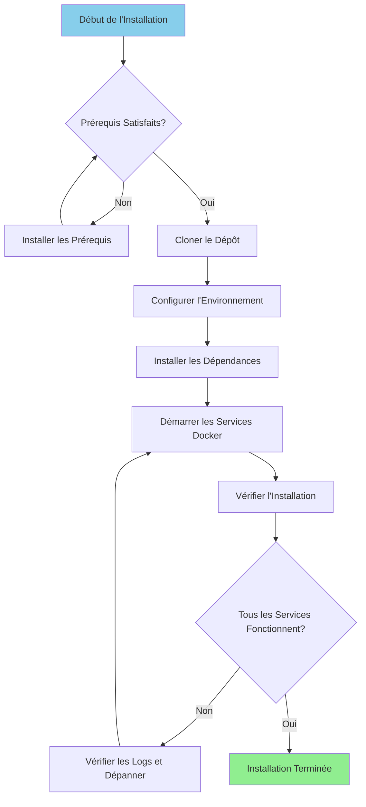

# 설치 가이드

**버전**: 3.2.0  
**최종 업데이트**: 2025-10-16  
**언어**: 프랑스어

---

## 개요

이 가이드는 Airbyte, Dremio, dbt, Apache Superset 및 지원 인프라를 포함한 전체 데이터 플랫폼을 설치하고 구성하기 위한 단계별 지침을 제공합니다.



---

## 전제 조건

### 시스템 요구 사항

**최소 요구 사항:**
- **CPU**: 4코어(8개 이상 권장)
- **RAM**: 8GB(16GB 이상 권장)
- **디스크 공간**: 20GB 사용 가능(50GB 이상 권장)
- **네트워크**: Docker 이미지를 위한 안정적인 인터넷 연결

**운영 체제:**
- 리눅스(Ubuntu 20.04+, CentOS 8+, Debian 11+)
- 맥OS(11.0+)
- WSL2가 설치된 Windows 10/11

### 필수 소프트웨어

#### 1. 도커

**버전**: 20.10 이상

**시설:**

**리눅스:**
```bash
# Installer Docker
curl -fsSL https://get.docker.com -o get-docker.sh
sudo sh get-docker.sh

# Ajouter l'utilisateur au groupe docker
sudo usermod -aG docker $USER

# Démarrer le service Docker
sudo systemctl start docker
sudo systemctl enable docker

# Vérifier l'installation
docker --version
```

**맥OS:**
```bash
# Télécharger et installer Docker Desktop depuis:
# https://www.docker.com/products/docker-desktop

# Vérifier l'installation
docker --version
```

**윈도우:**
```powershell
# Installer WSL2 d'abord
wsl --install

# Télécharger et installer Docker Desktop depuis:
# https://www.docker.com/products/docker-desktop

# Vérifier l'installation
docker --version
```

#### 2. 도커 작성

**버전**: 2.0 이상

**시설:**

```bash
# Linux
sudo curl -L "https://github.com/docker/compose/releases/latest/download/docker-compose-$(uname -s)-$(uname -m)" -o /usr/local/bin/docker-compose
sudo chmod +x /usr/local/bin/docker-compose

# Vérifier l'installation
docker-compose --version
```

**참고**: macOS 및 Windows용 Docker Desktop에는 Docker Compose가 포함되어 있습니다.

#### 3. 파이썬

**버전**: 3.11 이상

**시설:**

**리눅스(우분투/데비안):**
```bash
sudo apt update
sudo apt install python3.11 python3.11-venv python3-pip
```

**맥OS:**
```bash
brew install python@3.11
```

**윈도우:**
```powershell
# Télécharger l'installateur depuis python.org
# Ou utiliser winget:
winget install Python.Python.3.11
```

**확인:**
```bash
python --version  # ou python3 --version
pip --version     # ou pip3 --version
```

#### 4. 힘내

**시설:**

```bash
# Linux
sudo apt install git  # Ubuntu/Debian
sudo yum install git  # CentOS/RHEL

# macOS
brew install git

# Windows
winget install Git.Git
```

**확인:**
```bash
git --version
```

---

## 설치 단계

### 1단계: 저장소 복제

```bash
# Cloner le dépôt
git clone https://github.com/your-org/dremiodbt.git

# Naviguer vers le répertoire du projet
cd dremiodbt

# Vérifier le contenu
ls -la
```

**예상 구조:**
```
dremiodbt/
├── docker-compose.yml
├── docker-compose-airbyte.yml
├── README.md
├── requirements.txt
├── dbt/
├── dremio_connector/
├── docs/
└── scripts/
```

### 2단계: 환경 구성

#### 환경 파일 생성

```bash
# Copier le fichier d'environnement exemple
cp .env.example .env

# Éditer la configuration (optionnel)
nano .env  # ou utiliser votre éditeur préféré
```

#### 환경 변수

**기본 구성:**
```bash
# Projet
PROJECT_NAME=dremiodbt
ENVIRONMENT=development

# Réseau Docker
NETWORK_NAME=dremio_network

# PostgreSQL
POSTGRES_HOST=postgres
POSTGRES_PORT=5432
POSTGRES_DB=dremio_db
POSTGRES_USER=postgres
POSTGRES_PASSWORD=postgres123

# Dremio
DREMIO_VERSION=26.0
DREMIO_HTTP_PORT=9047
DREMIO_FLIGHT_PORT=32010
DREMIO_ADMIN_USER=admin
DREMIO_ADMIN_PASSWORD=admin123

# Airbyte
AIRBYTE_VERSION=0.50.33
AIRBYTE_HTTP_PORT=8000
AIRBYTE_API_PORT=8001

# Superset
SUPERSET_VERSION=3.0
SUPERSET_HTTP_PORT=8088
SUPERSET_ADMIN_USER=admin
SUPERSET_ADMIN_PASSWORD=admin

# MinIO
MINIO_VERSION=latest
MINIO_API_PORT=9000
MINIO_CONSOLE_PORT=9001
MINIO_ROOT_USER=minioadmin
MINIO_ROOT_PASSWORD=minioadmin123

# Elasticsearch
ELASTIC_VERSION=8.15.0
ELASTIC_HTTP_PORT=9200
```

### 3단계: Python 종속성 설치

#### 가상 환경 생성

```bash
# Créer l'environnement virtuel
python -m venv venv

# Activer l'environnement virtuel
# Linux/macOS:
source venv/bin/activate

# Windows:
.\venv\Scripts\activate
```

#### 설치 요구사항

```bash
# Mettre à jour pip
pip install --upgrade pip

# Installer les dépendances
pip install -r requirements.txt

# Vérifier l'installation
pip list
```

**주요 설치 패키지:**
- `pyarrow>=21.0.0` - 애로우 플라이트 고객
- `pandas>=2.3.0` - 데이터 조작
- `dbt-core>=1.10.0` - 데이터 변환
- `sqlalchemy>=2.0.0` - 데이터베이스 연결
- `pyyaml>=6.0.0` - 구성 관리

### 4단계: Docker 서비스 시작

#### 주요 서비스 시작

```bash
# Démarrer tous les services
docker-compose up -d

# Ou utiliser Makefile (si disponible)
make up
```

**서비스 시작:**
- PostgreSQL(포트 5432)
- Dremio(포트 9047, 32010)
- Apache Superset(포트 8088)
- MinIO(포트 9000, 9001)
- 엘라스틱서치(포트 9200)

#### Airbyte 시작(별도 작성)

```bash
# Démarrer les services Airbyte
docker-compose -f docker-compose-airbyte.yml up -d
```

**Airbyte 서비스 시작:**
- 에어바이트 서버(포트 8001)
- Airbyte 웹 UI (포트 8000)
- 에어바이트 워커
- 에어바이트 임시
- 에어바이트 데이터베이스

#### 서비스 상태 확인

```bash
# Voir les conteneurs en cours d'exécution
docker-compose ps

# Voir tous les conteneurs (incluant Airbyte)
docker ps

# Voir les logs
docker-compose logs -f

# Voir les logs Airbyte
docker-compose -f docker-compose-airbyte.yml logs -f
```

---

## 확인

### 5단계: 서비스 확인

#### 1. 포스트그레SQL

```bash
# Tester la connexion
docker exec -it postgres psql -U postgres -d dremio_db -c "SELECT version();"
```

**예상 출력:**
```
PostgreSQL 16.x on x86_64-pc-linux-gnu
```

#### 2. 드레미오

**웹 인터페이스:**
```
http://localhost:9047
```

**첫 번째 연결:**
- 사용자 이름: `admin`
- 비밀번호 : `admin123`
- 처음 접속 시 관리자 계정을 생성하라는 메시지가 표시됩니다.

**연결 테스트:**
```bash
# Tester le point de terminaison HTTP
curl http://localhost:9047/apiv2/login
```

#### 3. 에어바이트

**웹 인터페이스:**
```
http://localhost:8000
```

**기본 식별자:**
- 이메일: `airbyte@example.com`
- 비밀번호 : `password`

**API 테스트:**
```bash
# Vérification de santé
curl http://localhost:8001/health
```

**예상 응답:**
```json
{
  "status": "ok",
  "timestamp": "2025-10-16T12:00:00Z"
}
```

#### 4. 아파치 슈퍼세트

**웹 인터페이스:**
```
http://localhost:8088
```

**기본 식별자:**
- 사용자 이름: `admin`
- 비밀번호 : `admin`

**연결 테스트:**
```bash
curl http://localhost:8088/health
```

#### 5. 미니IO

**콘솔 UI:**
```
http://localhost:9001
```

**신임장:**
- 사용자 이름: `minioadmin`
- 비밀번호 : `minioadmin123`

**S3 API 테스트:**
```bash
# Installer le client MinIO
wget https://dl.min.io/client/mc/release/linux-amd64/mc
chmod +x mc

# Configurer
./mc alias set local http://localhost:9000 minioadmin minioadmin123

# Tester
./mc ls local
```

#### 6. 엘라스틱서치

**연결 테스트:**
```bash
# Vérification de santé
curl http://localhost:9200/_cluster/health

# Obtenir les informations
curl http://localhost:9200
```

**예상 응답:**
```json
{
  "name": "elasticsearch",
  "cluster_name": "docker-cluster",
  "version": {
    "number": "8.15.0"
  }
}
```

### 6단계: 상태 확인 실행

```bash
# Exécuter le script de vérification de santé complet
python scripts/health_check.py

# Ou utiliser Makefile
make health-check
```

**예상 출력:**
```
✓ PostgreSQL: En cours d'exécution (port 5432)
✓ Dremio: En cours d'exécution (ports 9047, 32010)
✓ Airbyte: En cours d'exécution (ports 8000, 8001)
✓ Superset: En cours d'exécution (port 8088)
✓ MinIO: En cours d'exécution (ports 9000, 9001)
✓ Elasticsearch: En cours d'exécution (port 9200)

Tous les services sont opérationnels!
```

---

## 설치 후 구성

### 1. Dremio 초기화

```bash
# Exécuter le script d'initialisation
python scripts/init_dremio.py
```

**만들기:**
- 관리자
- 기본 소스(PostgreSQL, MinIO)
- 예시 데이터 세트

### 2. 슈퍼세트 초기화

```bash
# Initialiser la base de données
docker exec -it superset superset db upgrade

# Créer un utilisateur administrateur (si inexistant)
docker exec -it superset superset fab create-admin \
    --username admin \
    --firstname Admin \
    --lastname User \
    --email admin@example.com \
    --password admin

# Initialiser Superset
docker exec -it superset superset init
```

### 3. DBT 구성

```bash
# Naviguer vers le répertoire dbt
cd dbt

# Tester la connexion
dbt debug

# Exécuter les modèles initiaux
dbt run

# Exécuter les tests
dbt test
```

### 4. 에어바이트 구성

**웹 인터페이스를 통해(http://localhost:8000):**

1. 설정 마법사 완료
2. 첫 번째 소스 구성(예: PostgreSQL)
3. 대상 구성(예: MinIO S3)
4. 연결 만들기
5. 첫 번째 동기화 실행

**API를 통해:**
```bash
# Voir docs/i18n/fr/guides/airbyte-integration.md pour les détails
python scripts/configure_airbyte.py
```

---

## 설치 후 디렉토리 구조

```
dremiodbt/
├── venv/                          # Environnement virtuel Python
├── data/                          # Stockage de données local
│   ├── dremio/                    # Métadonnées Dremio
│   ├── postgres/                  # Données PostgreSQL
│   └── minio/                     # Données MinIO
├── logs/                          # Logs applicatifs
│   ├── dremio.log
│   ├── airbyte.log
│   ├── superset.log
│   └── dbt.log
├── dbt/
│   ├── models/                    # Modèles dbt
│   ├── tests/                     # Tests dbt
│   ├── target/                    # SQL compilé
│   └── logs/                      # Logs dbt
└── docker-volume/                 # Volumes persistants Docker
    ├── db-data/                   # Données de base de données
    ├── minio-data/                # Stockage objet
    └── elastic-data/              # Index de recherche
```

---

## 문제 해결

### 일반적인 문제

#### 1. 이미 사용된 포트

**오류:**
```
Error: bind: address already in use
```

**해결책:**
```bash
# Trouver le processus utilisant le port (exemple: 9047)
sudo lsof -i :9047

# Terminer le processus
sudo kill -9 <PID>

# Ou changer le port dans docker-compose.yml
```

#### 2. 메모리 부족

**오류:**
```
ERROR: Insufficient memory available
```

**해결책:**
```bash
# Augmenter l'allocation mémoire Docker
# Docker Desktop: Paramètres > Ressources > Mémoire (16Go recommandés)

# Linux: Éditer /etc/docker/daemon.json
{
  "default-ulimits": {
    "memlock": {
      "Hard": -1,
      "Name": "memlock",
      "Soft": -1
    }
  }
}

# Redémarrer Docker
sudo systemctl restart docker
```

#### 3. 서비스가 시작되지 않음

**로그 확인:**
```bash
# Voir tous les logs des services
docker-compose logs

# Voir un service spécifique
docker-compose logs dremio
docker-compose logs airbyte-server

# Suivre les logs en temps réel
docker-compose logs -f
```

#### 4. 네트워크 문제

**Docker 네트워크 재설정:**
```bash
# Arrêter tous les services
docker-compose down
docker-compose -f docker-compose-airbyte.yml down

# Supprimer le réseau
docker network rm dremio_network

# Redémarrer les services
docker-compose up -d
docker-compose -f docker-compose-airbyte.yml up -d
```

#### 5. 권한 문제(Linux)

**해결책:**
```bash
# Corriger les permissions des répertoires de données
sudo chown -R $USER:$USER data/ docker-volume/

# Corriger les permissions du socket Docker
sudo chmod 666 /var/run/docker.sock
```

---

## 제거

### 서비스 중지

```bash
# Arrêter les services principaux
docker-compose down

# Arrêter Airbyte
docker-compose -f docker-compose-airbyte.yml down
```

### 데이터 삭제(선택사항)

```bash
# Supprimer les volumes (ATTENTION: Supprime toutes les données)
docker-compose down -v
docker-compose -f docker-compose-airbyte.yml down -v

# Supprimer les répertoires de données locaux
rm -rf data/ docker-volume/ logs/
```

### Docker 이미지 삭제

```bash
# Lister les images
docker images | grep dremio

# Supprimer des images spécifiques
docker rmi dremio/dremio-oss:24.0
docker rmi airbyte/server:0.50.33
docker rmi apache/superset:3.0

# Supprimer toutes les images non utilisées
docker image prune -a
```

---

## 다음 단계

성공적으로 설치한 후:

1. **데이터 소스 구성** - [구성 가이드](configuration.md) 참조
2. **첫 번째 단계 튜토리얼** - [첫 번째 단계](first-steps.md)를 참조하세요.
3. **Airbyte 구성** - [Airbyte 통합 가이드](../guides/airbyte-integration.md) 참조
4. **Dremio 설정** - [Dremio 설정 가이드](../guides/dremio-setup.md) 참조
5. **dbt 모델 생성** - [dbt 개발 가이드](../guides/dbt-development.md) 참조
6. **대시보드 생성** - [상위 대시보드 가이드](../guides/superset-dashboards.md) 참조

---

## 지원하다

설치 문제의 경우:

- **문서**: [문제 해결 가이드](../guides/troubleshooting.md)
- **GitHub 문제**: https://github.com/your-org/dremiodbt/issues
- **커뮤니티**: https://github.com/your-org/dremiodbt/discussions

---

**설치 가이드 버전**: 3.2.0  
**최종 업데이트**: 2025-10-16  
**관리자**: 데이터 플랫폼 팀